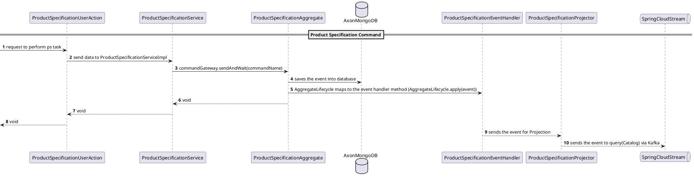

<!--
SPDX-FileCopyrightText: 2025 Orange SA
SPDX-License-Identifier: MIT

This software is distributed under the MIT License,
the text of which is available at https://opensource.org/license/mit
or see the "LICENSE.txt" file for more details.

Authors: See CONTRIBUTORS.txt
-->

# Product Specification Service

Product Specification, Catalog(Command Representation), TMF-701, TMF-620.

The Product Specification service is a microservice responsible for the management, storage, and presentation of product specifications in a standardized and structured manner. It enables the definition, retrieval, and update of product specifications, supporting catalog management and command representation in alignment with TMF-701 and TMF-620 standards.

## Overview

Product specifications serve as a fundamental component for managing and presenting products. Product specifications provide a detailed and structured description of each product or service offered by a business. They include essential information such as the product name, description, features, attributes, variations, pricing, and other relevant details.

Product specifications play several critical roles. Firstly, they establish standardized guidelines for presenting and categorizing products, ensuring consistency across various channels and touchpoints. 

Moreover, product specifications facilitate the creation of new product offerings within DISCO system. These specifications act as a blueprint for product creation, outlining the necessary attributes, variations, and pricing rules. This simplifies the process of introducing new products or modifying existing ones, ensuring accurate and comprehensive information is associated with each offering.

### Purpose of the Product Specification
The purpose of a product specification is to provide a detailed and standardized description of a product or service. It serves as a reference document that outlines the specific features, attributes, and characteristics of the product, ensuring clarity and consistency in its presentation and representation. 

TMF620 refers to the Product Specification Management API, which is a standard defined by the TM Forum. It provides a set of interfaces and operations for managing product catalog information within a digital ecosystem. The API enables efficient creation, retrieval, updating, and deletion of product catalog data, supporting various functionalities related to product offerings.

### Product Specification Creation

Product Specification can be created with CFS and StockItem.We have divided 
product specification creation in multple steps:

1) Create process flow for Product Specification Creation
2) Select support entity
3) Define Identity Data for example: name,description,related party,validity and so on.
4) Define characteristtics based on selected entityType (CFS or StockItem)
5) Define Relationships among other Product Specification (Only CFS)
6) Validate

### Product Specification Modification

Product Specification can be created with CFS and StockItem.We have divided 
product specification creation in multple steps:

1) Create process flow for Product Specification Modification
2) Select productSpecificationId to modify
3) Modify Identity Data for example: name,description,related party,validity and so on.
4) Modify characteristtics based on selected entityType (CFS or StockItem)
5) Modify Relationships among other Product Specification (Only CFS)
6) Validate

### Product Specification Versioning Management Rule

- Product Specification enities in a lifecycle before active could be directly modified in state inStudy, inDesign, inTest.
- Product Specification enities in state rejected or obsolete could not be modified.
- Product Specification enities in lifecycle state active or after active (launched, unavailable and retired) must not be directly modified.  But a new version for this entity could be created. There are 2 possibilities:

#### Create a minor version

- Create a new minor version (from version 2.0 to 2.1) – this is possible only for backward compatible modification (like for example adding a value in an enum based characteristic).
- When the new minor version is activated it must have no impact on the installed base (no impact because it is a new value or installed base has been updated accordingly)
- Old/new version must leverage validFor attribute - The new minor version will replace the previous one and both must not be in any lifecycleState [active/launched/unavailable/retired] at the same time. In case of minor version only the latest version will exist in the active/launch state the previous version will be automatically moved to retired state.

#### Create a major version

- Create a new major version (from version 2.1 to 3.0)  - this is possible for non-backward compatible modification
- New version start inStudy lifecycle
- Activate a new version requires previous installed base update.
- Several major versions could be in same state at same time. Nevertheless cohabitation of 2 versions in production (state = active/launched/unavailable) should be time-limited.

### Product Specification User Roles and Permission

TMF672 Permission & User Right management REST API Specification will be used as model.

2 entities are managed:

- **UserRole** - allows defining a set an entitlement(s). The list of entitlements is defined in application.yml. A userRole “Catalog Product Spec Administrator” is able to create & modify Product spec and consult all ODACA entities.
- **Permission** - set of UserRole providing to a user for a scope of entities. Starting today, User (party) Jean Pontus is Catalog Product Spec Administrator for manageable assets (all Mobile catalog entities). Permission is allowed by a granter.

### Product Specification Flow


#### Brief description of Sequence fiagram

1. ProductSpecificationUserAction will send data to service class which is needed to perform that task
2. ProductSpecificationService will process the data and sends a command and wait for a result either synchronously, with a timeout or asynchronously.
3. ProductSpecificationAggregate - As an aggregate will handle commands that are targeted to a specific aggregate instance, we need to specify the identifier with the AggregateIdentifier annotation.
In ProductSpecificationAggregate ,business logic is written for the creation and the updation tasks and events are published to specific event handler.
It's automatically save the event into axon database.
4. ProductSpecificationEventHandler : In this ProductSpecificationEventHandler, we are calling handle method in which we pass the event and this method internally call the ProductSpecificationProjector for publishing the events.'
5. ProductSpecificationProjector - will send the events to kafka stream.

## Community

You can chat with the core team on [
- [Java](https://jdk.java.net/) 17
- [Maven](https://maven.apache.org/) 3.8

Your local Maven settings file (`$HOME/.m2/settings.xml`) must specify your local repository directory.

Your Maven repository may require authentication credentials to publish artifacts in unstable and stable maven repositories. To handle authentication, please read the [to-be-continuous maven template documentation](https://to-be-continuous.gitlab.io/doc/ref/maven/#maven-repository-authentication) for more information.

### Installing

Clone the project with:

```bash
git clone git@gitlab.ow2.org:discobole/disco-oda-components/disco-catalog/catalog-product-specification.git
```

If you haven't already done so, add the following lines in your local Maven settings file:
```xml
<server>
  <id>gitlab-maven</id>
  <configuration>
    <httpHeaders>
      <property>
        <name>Private-Token</name>
        <value>${GITLAB_TOKEN}</value>
      </property>
    </httpHeaders>
  </configuration>
</server> 
```

To build and deploy the application, the following environment variables need to be defined and exported in your terminal. 

| Name                 | Description                                                  | Value                                                        |
| -------------------- | ------------------------------------------------------------ | ------------------------------------------------------------ |
| :lock: `GITLAB_TOKEN` | The GitLab private access token defined with the `api` scope. | See your [preferences](https://gitlab.ow2.org/-/user_settings/personal_access_tokens?page=1&state=active&sort=expires_asc) (*required to deploy the project artifacts*). |
| `CI_API_V4_URL`      | The GitLab API v4 root URL.                                  | `https://gitlab.ow2.org/api/v4` (*required to pull & deploy the project artifacts*). |
| `CI_PROJECT_ID`      | The ID of the GitLab project. This ID is part of the GitLab project package registry URL. | See the project general settings (*required to deploy the maven artifacts*). |
| `GROUP_ID`           | The ID of the GitLab group visible in the [project general settings](https://gitlab.ow2.org/groups/discobole/-/edit). This ID is part of the GitLab group package registry URL. | `5972` (*required only if the project depends on `DISCOBOLE` maven artifac*t). |

:information_source: If you don't have access to the project general settings, the project ID may be retrieved as follows: 

```bash
curl -s https://gitlab.ow2.org/api/v4/projects/discobole%2Fdisco-oda-components%2Fdisco-catalog%2Fcatalog-product-specification | jq .id
```

Build the application with:

```bash
mvn clean install 
```

### Configuration

The default configuration is set up in the `src/main/resources/config/application.yml` file.

### Running locally

To launch the service on your local machine:

```bash
mvn spring-boot:run
```

Or start the service with your own configuration `application-<your profile name>.yml` overriding the default configuration:

```bash
mvn spring-boot:run -Pspring.profiles.active=<your profile name>
```

### Usage

Access the [OpenAPI specification](http://localhost:8080) of the API.

## Running the tests

Run the unit tests with:

```bash
mvn tests
```

## Installation manually using Helm

A Helm chart is provided to deploy your application manually.

Please consult its [documentation](helm/chart/README.md).

## Installation via CI/CD with GitLab-CI and Helm

### Prerequisites

You will need access to a remote Kubernetes cluster (OpenShift, Rancher, GKE, Vanilla Kubernetes, ...) with

- Kubernetes 1.20+

**REMARKS**: Some parameters depend on the target infrastructure (Openshift, Rancher, ...). For instance, to expose your service outside the cluster:

- On *Openshift*, define an OpenShift Route.
- On *Rancher* or *any Kubernetes cluster* running an Ingress controller, configure an Ingress.

Sample custom value files for different environments are provided with the chart to give you an example of what needs to be done.

The application can be built, tested, and deployed in an automated manner with a GitLab-CI pipeline. The included [gitlab-ci.yml](.gitlab-ci.yml) file includes templates provided by [To Be Continuous](https://to-be-continuous.gitlab.io/doc/) for:

- Building the app (`docker` "to be continuous" template)
- Deploying the app (`helm` "to be continuous" template)
- Managing releases (`semantic-release` "to be continuous" template)

### Forking the repository and configuring the pipeline

First, fork this project in a namespace where you have write access.

For the pipeline to execute properly, **some CI/CD variables need to be set**. The list of variables required by each template is documented via comments in the [gitlab-ci.yml](.gitlab-ci.yml) file.

#### Docker images publication

The pipeline is configured to publish the Docker images produced by the [Docker](https://gitlab.com/to-be-continuous/docker) "to be continuous" template to the GitLab project internal registry. All template variables are configured by default to build and push your Docker images on the GitLab project internal registry.

### Deployment with Helm

Regarding deployments with the [helm](https://gitlab.com/to-be-continuous/helm) "to be continuous" template, this part is disabled but the Helm package is built and published in the GitLab project internal registry.

#### Versioning with semantic release

To let the [semantic release template](https://gitlab.com/to-be-continuous/semantic-release) add the necessary changes on your Git repository, define credentials in this CI/CD variable:

- :lock: `GITLAB_TOKEN` (GitLab access token with `api`, `read_repository`, and `write` repository scopes and `Maintainer` role)

## Environments

All deployed environments can be found in [GitLab Environments page](../../-/environments).

## Built With

- [Git](https://git-scm.com/) - Open source distributed version control system
- [Java 17](https://jdk.java.net/)
- [Maven](https://maven.apache.org/) - Dependency Management

## Documentation

- [Overall DISCOBOLE documentation](https://discobole.ow2.io/doc)
- [API User Guide](doc/api-getting-started.md)
- [API TMF-701 Compliance](doc/api-compliance-report)
- [API TMF-620 Compliance](doc/CTK-report.html)

## Contributing

Please read [CONTRIBUTING.md](CONTRIBUTING.md) for details on our process for submitting merge requests.

## Versioning

We use [SemVer](http://semver.org/) for versioning. For the versions available, see the [tags on this repository](../../tags).

## Authors

See the list of [contributors](CONTRIBUTORS.md) who participated in this project.

## License

This project is licensed - see the [LICENSE](LICENSE.txt) file for details.