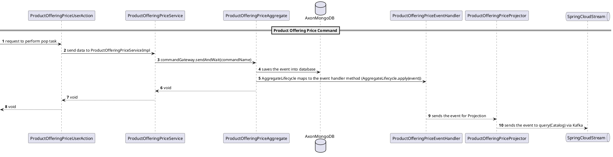

<!--
SPDX-FileCopyrightText: 2025 Orange SA
SPDX-License-Identifier: MIT

This software is distributed under the MIT License,
the text of which is available at https://opensource.org/license/mit
or see the "LICENSE.txt" file for more details.

Authors: See CONTRIBUTORS.txt
-->

# Product Offering Price Service

Product Offering Price, Catalog(Command), TMF-701, TMF-620.

## Overview

The Catalog service develops a catalog component that will provide all required information to manage the product order fulfillment process. In order to do that ODACA will manage Commercial Catalog and partially functional catalog. Additionally the catalog component is designed & built to allow management of tariff and tariff alteration for recurring, non-recurring and usage tariff. Also it provides information to build the installed base during the order capture and update during order fulfilment. 

The Catalog component follows the CQRS pattern. The Product Offering Price handles only the command part and manages stages like creation of POP and modification of POP.The POP is Envelope dependent i.e. based on TMF 701 API and uses Event Store (AxonDB) to save the data.

We introduce 2 specific ProductOfferingPrice specializations to manage charge (POPCharge) and alteration (POPAlteration). This resource will be managed as an API resource: ProductOfferingPrice but with @type valued to ProductOfferingPriceCharge or ProductOfferingPriceAlteration.

### Product Offering Price Flow



### Brief description of Sequence diagram

1. ProductOfferingPriceUserAction will send data to service class which is needed to perform that task
2. ProductOfferingPriceService will process the data and sends a command and wait for a result either synchronously, with a timeout or asynchronously.
3. ProductOfferingPriceAggregate - As an aggregate will handle commands that are targeted to a specific aggregate instance, we need to specify the identifier with the AggregateIdentifier annotation.
In ProductOfferingPriceAggregate ,business logic is written for the creation and the updation tasks and events are published to specific event handler.
It's automatically save the event into axon database.
4. ProductOfferingPriceEventHandler : In this ProductOfferingPriceEventHandler, we are calling handle method in which we pass the event and this method internally call the ProductOfferingPriceProjector for publishing the events.'
5. ProductOfferingPriceProjector - will send the events to kafka stream.

## Community

You can chat with the core team on [](https://discord.gg/pzcwfgqns7).

## Getting Started

To get a local copy of the project up and running, follow these simple steps.

### Prerequisites

- [git](https://git-scm.com/)
- [Java](https://jdk.java.net/) 11
- [Maven](https://maven.apache.org/) 3.8

Your local Maven settings file (`$HOME/.m2/settings.xml`) must specify your local repository directory.

Your Maven repository may require authentication credentials to publish artifacts in unstable and stable maven repositories. To handle the authentication, please read the [to-be-continuous maven template documentation](https://to-be-continuous.gitlab.io/doc/ref/maven/#maven-repository-authentication) for more information.

### Installing

Clone the project with:

```bash
git clone git@gitlab.ow2.org:discobole/disco-oda-components/disco-catalog/catalog-product-offering-price.git
```

If you haven't already done so, you will need to add the following lines in your local maven settings file.

```xml
<server>
  <id>gitlab-maven</id>
  <configuration>
    <httpHeaders>
      <property>
        <name>Private-Token</name>
        <value>${GITLAB_TOKEN}</value>
      </property>
    </httpHeaders>
  </configuration>
</server> 
```

To build and deploy the application, the following environment variables need to be defined and exported in your terminal. 

| Name                 | Description                                                  | Value                                                        |
| -------------------- | ------------------------------------------------------------ | ------------------------------------------------------------ |
| :lock: `GITLAB_TOKEN` | The GitLab private access token defined with the `api` scope. | See your [preferences](https://gitlab.ow2.org/-/user_settings/personal_access_tokens?page=1&state=active&sort=expires_asc) (*required to deploy the project artifacts*). |
| `CI_API_V4_URL`      | The GitLab API v4 root URL.                                  | `https://gitlab.ow2.org/api/v4` (*required to pull & deploy the project artifacts*). |
| `CI_PROJECT_ID`      | The ID of the GitLab project. This ID is part of the GitLab project package registry URL. | See the project general settings (*required to deploy the maven artifacts*). |
| `GROUP_ID`           | The ID of the GitLab group visible in the [project general settings](https://gitlab.ow2.org/groups/discobole/-/edit). This ID is part of the GitLab group package registry URL. | `5972` (*required only if the project depends on `DISCOBOLE` maven artifac*t). |

:information_source: If you don't have access to the project general settings, the project ID may be retrieved as follows: 

```bash
curl -s https://gitlab.ow2.org/api/v4/projects/discobole%2Fdisco-oda-components%2Fdisco-catalog%2Fcatalog-product-offering-price | jq .id
```

Build the application with:

```bash
mvn clean install 
```

### Configuration

The default configuration is setup in `src/main/resources/config/application.yml` file.

Different Product Offering Price states and transition can be configured as below:

```yaml
package-element:
  state-machines:
    - name: ProductOfferingPriceCreation
      states:
        - name: FORK
          entryActions:
          exitActions:
          stateActions:
          initialAction:
          parentState:
          regionId: Region1
          pseudoStateKind: FORK
        - name: REGION
          entryActions:
          exitActions:
          stateActions:
          initialAction:
          parentState:
          regionId: Region1
          pseudoStateKind: INITIAL
        - name: productOfferingPriceCancel
          entryActions:
          exitActions:
          stateActions:
          initialAction:
          parentState: REGION
          regionId: SubRegion2
          pseudoStateKind: INITIAL
        - name: terminateFLow
          entryActions:
          exitActions:
          stateActions:
          initialAction:
          parentState: REGION
          regionId: SubRegion2
          pseudoStateKind: END
        - name: selectPOPType
          entryActions:
          exitActions:
          stateActions:
          initialAction:
          parentState: REGION
          regionId: SubRegion1
          pseudoStateKind: INITIAL
        - name: decisionTask1
          entryActions:
          exitActions:
          stateActions:
          initialAction:
          parentState: REGION
          regionId: SubRegion1
          pseudoStateKind: CHOICE
        - name: defineProductOfferingPriceChargeIdentityData
          entryActions:
          exitActions:
          stateActions:
          initialAction:
          parentState: REGION
          regionId: SubRegion1
          pseudoStateKind:
        - name: defineProductOfferingPriceAlterationIdentityData
          entryActions:
          exitActions:
          stateActions:
          initialAction:
          parentState: REGION
          regionId: SubRegion1
          pseudoStateKind:
        - name: defineRelationship
          entryActions:
          exitActions:
          stateActions:
          initialAction:
          parentState: REGION
          regionId: SubRegion1
          pseudoStateKind:
        - name: definePOPStatusValidityPeriod
          entryActions:
          exitActions:
          stateActions:
          initialAction:
          parentState: REGION
          regionId: SubRegion1
          pseudoStateKind:
        - name: done
          entryActions:
          exitActions:
          stateActions:
          initialAction:
          parentState: REGION
          regionId: SubRegion1
          pseudoStateKind: END
        - name: JOIN
          entryActions:
          exitActions:
          stateActions:
          initialAction:
          parentState:
          regionId: Region1
          pseudoStateKind: JOIN
        - name: endFLow
          entryActions:
          exitActions:
          stateActions:
          initialAction:
          parentState:
          regionId: Region1
          pseudoStateKind:
          end: true
      transitions:
        - event:
          source: FORK 
          target: REGION
          actions:
          guard:
          kind:
        - event:
          source: REGION
          target: productOfferingPriceCancel
          actions:
          guard:
          kind: EXTERNAL
        - event: endPOPCancelFlow
          source: productOfferingPriceCancel
          target: terminateFLow
          actions:
            - endRegionFlow
          guard:
          kind: EXTERNAL
        - event:
          source: REGION
          target: selectPOPType
          actions:
          guard:
          kind: EXTERNAL
        - event:
          source: selectPOPType
          target: decisionTask1
          actions:
          guard:
          kind: EXTERNAL
        - event:
          source: decisionTask1
          target: defineProductOfferingPriceChargeIdentityData
          actions:
          guard: isPriceTypePOPC
          kind: EXTERNAL
        - event:
          source: decisionTask1
          target: defineProductOfferingPriceAlterationIdentityData
          actions:
          guard:
          kind: EXTERNAL
        - event: alterationIdentityDataDefined
          source: defineProductOfferingPriceAlterationIdentityData
          target: definePOPStatusValidityPeriod
          actions:
          guard:
          kind: EXTERNAL
        - event: chargeIdentityDataDefined
          source: defineProductOfferingPriceChargeIdentityData
          target: defineRelationship
          actions:
          guard:
          kind: EXTERNAL
        - event: defRelationshipDefined
          source: defineRelationship
          target: definePOPStatusValidityPeriod
          actions:
          guard:
          kind: EXTERNAL
        - event: validated
          source: definePOPStatusValidityPeriod
          target: done
          actions:
            - endRegionFlow
          guard:
          kind: EXTERNAL
        - event:
          source: REGION
          target: JOIN
          actions:
          guard:
          kind:
        - event:
          source: JOIN
          target: endFlow
          actions:
          guard:
          kind: EXTERNAL
    - name: ProductOfferingPriceModification
      states:
        - name: OUTERFORK
          entryActions:
          exitActions:
          stateActions:
          initialAction:
          parentState:
          regionId: Region
          pseudoStateKind: FORK
        - name: OUTERREGION
          entryActions:
          exitActions:
          stateActions:
          initialAction:
          parentState:
          regionId: Region
          pseudoStateKind: INITIAL
        - name: productOfferingPriceModificationCancel
          entryActions:
          exitActions:
          stateActions:
          initialAction:
          parentState: OUTERREGION
          regionId: Region2
          pseudoStateKind: INITIAL
        - name: terminateFLow
          entryActions:
          exitActions:
          stateActions:
          initialAction:
          parentState: OUTERREGION
          regionId: Region2
          pseudoStateKind: END
        - name: selectPOPTypeForModification
          entryActions:
          exitActions:
          stateActions:
          initialAction:
          parentState: OUTERREGION
          regionId: Region1
          pseudoStateKind: INITIAL
        - name: selectPOP
          entryActions:
          exitActions:
          stateActions:
          initialAction:
          parentState: OUTERREGION
          regionId: Region1
          pseudoStateKind: INITIAL
        - name: decisionTask2
          entryActions:
          exitActions:
          stateActions:
          initialAction:
          parentState: OUTERREGION
          regionId: Region1
          pseudoStateKind: CHOICE
        - name: selectProductOfferingPriceVersion
          entryActions:
          exitActions:
          stateActions:
          initialAction:
          parentState: OUTERREGION
          regionId: Region1
          pseudoStateKind: INITIAL
          editable: 
        - name: FORK
          entryActions:
          exitActions:
          stateActions:
          initialAction:
          parentState: OUTERREGION
          regionId: Region1
          pseudoStateKind: FORK
        - name: INNERREGION
          entryActions:
          exitActions:
          stateActions:
          initialAction:
          parentState: OUTERREGION
          regionId: Region1
          pseudoStateKind: INITIAL      
        - name: modifyPOPChargeIdentityData
          entryActions:
          exitActions:
          stateActions:
          initialAction:
          parentState: INNERREGION
          regionId: SubRegion1
          pseudoStateKind: INITIAL
        - name: POPChargeIdentityDataModified
          entryActions:
          exitActions:
          stateActions:
          initialAction:
          parentState: INNERREGION
          regionId: SubRegion1
          pseudoStateKind: END    
        - name: modifyPOPAlterationIdentityData
          entryActions:
          exitActions:
          stateActions:
          initialAction:
          parentState: INNERREGION
          regionId: SubRegion2
          pseudoStateKind: INITIAL
        - name: POPAlterationIdentityDataModified
          entryActions:
          exitActions:
          stateActions:
          initialAction:
          parentState: INNERREGION
          regionId: SubRegion2
          pseudoStateKind: END     
        - name: modifyRelationship
          entryActions:
          exitActions:
          stateActions:
          initialAction:
          parentState: INNERREGION
          regionId: SubRegion3
          pseudoStateKind: INITIAL
        - name: RelationshipModified
          entryActions:
          exitActions:
          stateActions:
          initialAction:
          parentState: INNERREGION
          regionId: SubRegion3
          pseudoStateKind: END
        - name: modifyPOPStatusValidityPeriod
          entryActions:
          exitActions:
          stateActions:
          initialAction:
          parentState: INNERREGION
          regionId: SubRegion4
          pseudoStateKind: INITIAL
        - name: POPStatusValidityPeriodModified
          entryActions:
          exitActions:
          stateActions:
          initialAction:
          parentState: INNERREGION
          regionId: SubRegion4
          pseudoStateKind: END
        - name: validate
          entryActions:
          exitActions:
          stateActions:
          initialAction:
          parentState: INNERREGION
          regionId: SubRegion5
          pseudoStateKind: INITIAL
          editable: false
        - name: validated
          entryActions:
          exitActions:
          stateActions:
          initialAction:
          parentState: INNERREGION
          regionId: SubRegion5
          pseudoStateKind: END 
        - name: JOIN
          entryActions:
          exitActions:
          stateActions:
          initialAction:
          parentState: OUTERREGION
          regionId: Region1
          pseudoStateKind: JOIN
        - name: endFLow
          entryActions:
          exitActions:
          stateActions:
          initialAction:
          parentState:
          regionId: Region1
          pseudoStateKind:
          end: true
        - name: OUTERJOIN
          entryActions:
          exitActions:
          stateActions:
          initialAction:
          parentState:
          regionId: Region
          pseudoStateKind: JOIN
        - name: outerEndFLow
          entryActions:
          exitActions:
          stateActions:
          initialAction:
          parentState:
          regionId: Region
          pseudoStateKind:
          end: true
      transitions:
        - event:
          source: OUTERFORK
          target: OUTERREGION
          actions:
          guard:
          kind:
        - event:
          source: OUTERREGION
          target: productOfferingPriceModificationCancel
          actions:
          guard:
          kind: EXTERNAL
        - event: endPOPCancelFlow
          source: productOfferingPriceModificationCancel
          target: terminateFLow
          actions:
            - endRegionFlow
          guard:
          kind: EXTERNAL
        - event:
          source: OUTERREGION
          target: selectPOPTypeForModification
          actions:
          guard:
          kind: EXTERNAL
        - event:
          source: selectPOPTypeForModification
          target: selectPOP
          actions:
          guard:
          kind: EXTERNAL
        - event:
          source: selectPOP
          target: decisionTask2
          actions:
          guard:
          kind: EXTERNAL
        - event:
          source: decisionTask2
          target: selectProductOfferingPriceVersion
          actions:
          guard: selectVersioningGuard
          kind: EXTERNAL
        - event:
          source: decisionTask2
          target: FORK
          actions:
          guard: 
          kind: EXTERNAL
        - event:  productOfferingPriceVersionSelected
          source: selectProductOfferingPriceVersion
          target: FORK
          actions:
          guard: 
          kind: EXTERNAL
        - event:
          source: FORK
          target: INNERREGION
          actions:
          guard:
          kind:
        - event:
          source: INNERREGION
          target: modifyPOPChargeIdentityData
          actions:
          guard: isPriceTypePOPC
          kind: EXTERNAL
        - event: POPChargeIdentityDataModified
          source: modifyPOPChargeIdentityData
          target: POPChargeIdentityDataModified
          actions:
          guard: isPriceTypePOPC
          kind: EXTERNAL
        - event:
          source: INNERREGION
          target: modifyPOPAlterationIdentityData
          actions:
          guard: isPriceTypePOPA
          kind: EXTERNAL      
        - event: POPAlterationIdentityDataModified
          source: modifyPOPAlterationIdentityData
          target: POPAlterationIdentityDataModified
          actions:
          guard: isPriceTypePOPA
          kind: EXTERNAL
        - event:
          source: INNERREGION
          target: modifyRelationship
          actions:
          guard: minorVersionPOPCNotSelectedGuard
          kind: EXTERNAL
        - event: RelationshipModified
          source: modifyRelationship
          target: RelationshipModified
          actions:
          guard: minorVersionPOPCNotSelectedGuard
          kind: EXTERNAL
        - event:
          source: INNERREGION
          target: modifyPOPStatusValidityPeriod
          actions:
          guard: minorVersionPOPCNotSelectedGuard
          kind: EXTERNAL
        - event: POPStatusValidityPeriodModified
          source: modifyPOPStatusValidityPeriod
          target: POPStatusValidityPeriodModified
          actions:
          guard: minorVersionPOPCNotSelectedGuard
          kind: EXTERNAL
        - event:
          source: INNERREGION
          target: validate
          guard:
          kind: EXTERNAL
        - event: validated
          source: validate
          target: validated
          actions:
            - endRegionFlow
          guard:
          kind: EXTERNAL
        - event:
          source: INNERREGION
          target: JOIN
          actions:
          guard:
          kind:
        - event:
          source: JOIN
          target: endFlow
          actions:
          guard:
          kind: EXTERNAL
        - event:
          source: OUTERREGION
          target: OUTERJOIN
          actions:
          guard:
          kind:
        - event:
          source: OUTERJOIN
          target: outerEndFlow
          actions:
          guard:
          kind: EXTERNAL
```

### Running locally

To launch the service on your local machine:

```bash
mvn spring-boot:run
```

Or start the service with your own configuration `application-<your profile name>.yml` overriding the default configuration:

```bash
mvn spring-boot:run -Dspring.profiles.active=<your profile name>
```

Alternative ways to run:

* Start the service directly with JAR:

```bash
java -jar target/product-offering-price-1.0.1-SNAPSHOT-exec.jar
```

* Start the service with another context root:

```bash
java -Dserver.servlet.context-path=/product-offering-price -jar target/product-offering-price-1.0.1-SNAPSHOT-exec.jar
```

* Start the service on another port:

```bash
java -Dserver.port=8081 -jar target/product-offering-price-1.0.1-SNAPSHOT-exec.jar
```

### Usage

Access to the [OpenAPI specification](http://localhost:8080) of the API.

## Running the tests

Run the unit tests with:

```bash
mvn test
```

## Installation manually using Helm

A chart helm is provided in order to deploy your application manually. 

Please consult its [documentation](https://gitlab.ow2.org/discobole/disco-oda-components/disco-catalog/catalog-product-offering-price/-/blob/main/helm/chart/README.md).

In order to deploy you will need helm and a kubernetes cluster:

```bash
helm install cpib-release ./helm -f ./helm/values-local.yaml
```

## Installation via CI/CD with GitLab-CI and Helm

### Prerequisites

You will need access to a remote Kubernetes cluster (OpenShift, Rancher, GKE, Vanilla Kubernetes, ...) with

- Kubernetes 1.20+

**REMARKS**: some parameters depend on the target infrastructure (Openshift, Rancher, ...). For instance, in order to expose your service outside the cluster:

- On *Openshift*, one must define an OpenShift Route
- On *Rancher* or *any Kubernetes cluster* running an Ingress controller, one may configure an Ingress

Sample custom value files for different environments are being provided with the chart to give you an example of what needs to be done.

The application can be built, tested and deployed in an automated manner with a GitLab-CI pipeline. The included [gitlab-ci.yml](https://gitlab.ow2.org/discobole/disco-oda-components/disco-catalog/catalog-product-offering-price/-/blob/main/.gitlab-ci.yml) file includes some templates provided by [To Be Continuous](https://to-be-continuous.gitlab.io/doc/) for:

- Building the app (`docker` "to be continuous" template)
- Deploying the app (`helm` "to be continuous" template)
- Managing releases (`semantic-release` "to be continuous" template)

### Forking the repository and configuring the pipeline

You will first have to fork this project in a namespace where you have write access.

In order for the pipeline to execute properly, **some CI/CD variables need to be set**. The list of variables required by each template is documented via comments in the [gitlab-ci.yml](https://gitlab.ow2.org/discobole/disco-oda-components/disco-catalog/catalog-product-offering-price/-/blob/main/.gitlab-ci.yml) file.

#### Docker images publication

The pipeline is configured to publish the Docker images produced by the [Docker](https://gitlab.com/to-be-continuous/docker) "to be continuous" template to the GitLab project internal registry. All template variables are configured by default to build and push your Docker images on the GitLab project internal registry.

### Deployment with Helm

Regarding deployments with the [helm](https://gitlab.com/to-be-continuous/helm) "to be continuous" template, this part is disabled but the Helm package is built and published in the GitLab project internal registry.

#### Versioning with semantic release

In order to let the [semantic release template](https://gitlab.com/to-be-continuous/semantic-release) adding the necessary changes on your Git repository, it is required to define credentials in this CI/CD variable:

- :lock: `GITLAB_TOKEN` (gitlab access token with `api`, `read_repository` and `write` repository scopes and `Maintainer` role)

## Built With

- [Git](https://git-scm.com/) - Open source distributed version control system
- [Java 11](https://jdk.java.net/)
- [Maven](https://maven.apache.org/) - Dependency Management
- [Spring Boot](https://spring.io/projects/spring-boot) - Development stack for Spring Applications

## Documentation

- [Overall DISCOBOLE documentation](https://discobole.ow2.io/doc)
- [API User Guide](https://gitlab.ow2.org/discobole/disco-oda-components/disco-catalog/catalog-product-offering-price/-/blob/main/doc/api-getting-started.md)
- [API TMF Compliancy](https://gitlab.ow2.org/discobole/disco-oda-components/disco-catalog/catalog-product-offering-price/-/blob/main/doc/api-compliance-report)
- [API TMF Conformance](https://gitlab.ow2.org/discobole/disco-oda-components/disco-catalog/catalog-product-offering-price/-/blob/main/doc/CTK-report.html)

## Contributing

Please read [CONTRIBUTING.md](https://gitlab.ow2.org/discobole/disco-oda-components/disco-catalog/catalog-product-offering-price/-/blob/main/CONTRIBUTING.md) for details on our process for submitting merge requests to us.

Any contributions you may make are greatly appreciated. If you have a suggestion that would make this better, please fork the repo and create a merge request. You can also simply open an issue with the tag "enhancement".

1. Fork the Project
2. Clone the project on your workstation
3. Create your Feature Branch (`git checkout -b feature/AmazingFeature`)
4. Commit your Changes (`git commit -m 'Add some AmazingFeature'`)
5. Push to the Branch (`git push origin feature/AmazingFeature`)
6. Open a Merge Request

## Versioning

We use [SemVer](http://semver.org/) for versioning. For the versions available, see the [tags on this repository](https://gitlab.ow2.org/discobole/disco-oda-components/disco-catalog/catalog-product-offering-price/-/tags).

## Authors

See the list of [contributors](https://gitlab.ow2.org/discobole/disco-oda-components/disco-catalog/catalog-product-offering-price/-/blob/main/CONTRIBUTORS.md) who participated in this project.

## License

This project is licensed - see the [LICENSE](https://gitlab.ow2.org/discobole/disco-oda-components/disco-catalog/catalog-product-offering-price/-/blob/main/LICENSE.txt) file for details.
