# Overall Architecture

## Global View

Product Catalog is part of the [DISCOBOLE](https://discobole.ow2.io/doc/) platform.

{.img-zoomable}

The **Product Catalog** component belongs to the **ODA Core Commerce Management (CCM)** block.  
It supports the Order To Bill (OTB) process for product offering and specification management.

The Product Catalog interacts with:

- Party management platforms or any Engagement management system (front-end channels)
- Product Configurator component
- Order Management component
- Customer Order Orchestration and Delivery component
- Commercial Products Installed Base component/Product Inventory
- Catalog administration portal for Catalod admins

## Process View

The Product Catalog component uses business process flows to manage creation and updating of entities. The following are the implemented processes:

- Product Offering,
- Product Specification,
- Product Offering Price,
- Category,
- Lifecycle Management.

The Product Catalog architecture is based on a back-end-driven design, where the processes and individual tasks are defined, rather than specifying separately for front-ends.

!!! info "Process Flow"
    The process flow concept is employed to implement the business processes. This approach facilitates the implementation of a centralized order capture process, guiding any front-end seamlessly through the process flow interface TMF701. The process flow library is used to manage the interactions between the back-end process flow and any front-end consumer through the TMF701 Process Flow API.

### E2E Process

The end-to-end process for creating a product offering in the ODACAT Product Catalog employs a "bottom-up" approach. The foundation for defining catalog entities is based on ODA Production layer entities, which are either a Customer Facing Service Specification (CFS Specification) or a Stock Item Type. The Product Offering which is a commercial entity is built upon a function entity Product Specification, as outlined below:

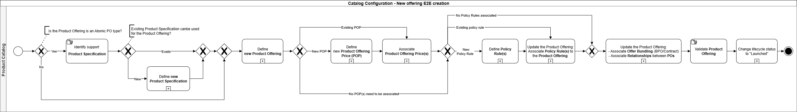{.img-zoomable}

### Import of CFS Specification

A Customer Facing Service Specfication (CFS Specification) functionally acts as a template by which services may be instantiated. A CFS Specification is a prerequisite to realize a Product Specification. A Product Specification restricts the characteristics of the CFS and its relationships.

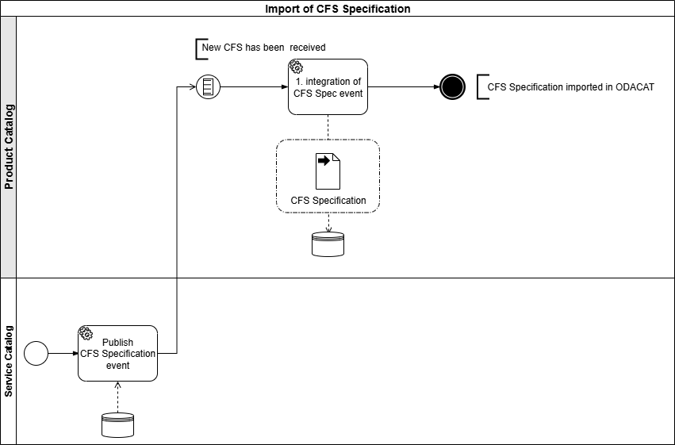{.img-zoomable}

### Import of Stock Item Type

The Stock Item allows for a tangible configured product to find the article in the stock. A tangible product can be configured, but the choice of the Stock Item depends on the chosen configuration. 

A Stock Item Type entity is useful to gather all Stock Items for a given Product Specification.

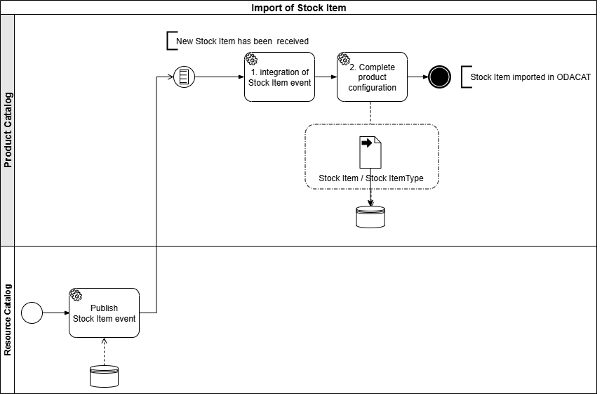{.img-zoomable}

### Create Product Specification

- The Product Specification describes the offering from the perspective of the business user and outlines what the marketing operator intends to sell at a functional level (e.g., capacities, available usages). 
- It can be derived from either a Customer Facing Service Specificaty (CFS Specification) or a Stock Item type entity. 
- The characteristics of a Product Specification are constrained by the attributes of the Service Specification or Stock Item.

The process for creating a Product Specification is outlined below:

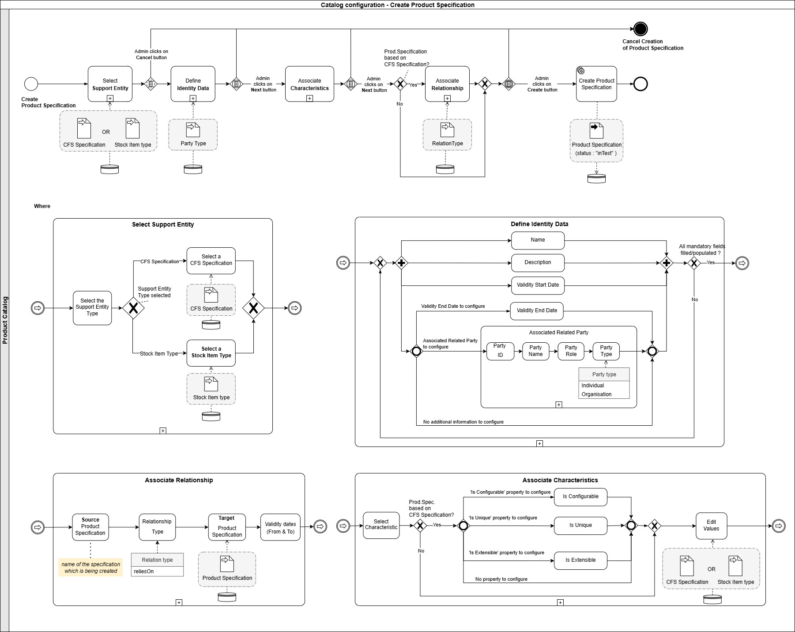{.img-zoomable}

### Modify Product Specification

- The Modify Product Specification process is initiated by selecting an existing Product Specification by `Id` whose lifecycle status isn't launched, obsolete or retired.
- The underlying entity (CFS Specification or Stock Item Type) cannot be modified. 

The tasks in the process are identical to the corresponding create process which are outlined below

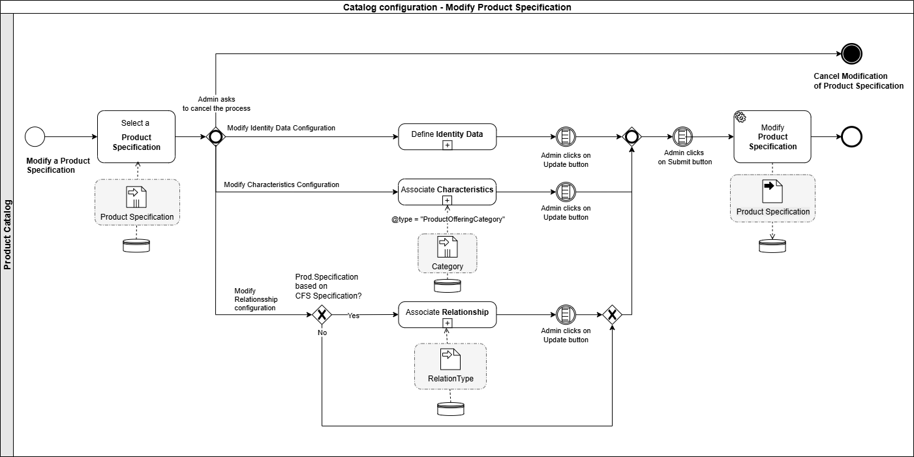{.img-zoomable}

### Create Product Offering

A Product Offering represents entities that are orderable from the provider of the catalog; this resource includes Pricing information, Policy Rules and Relationships. The process is outlined below:

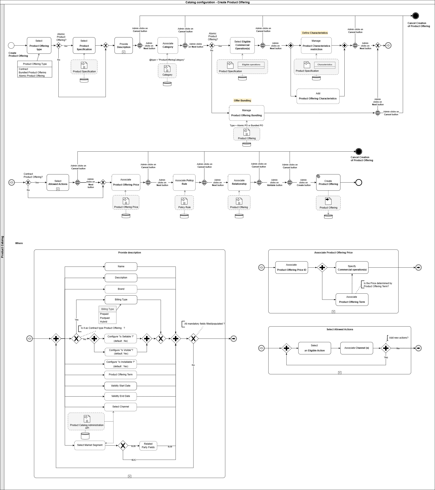{.img-zoomable}

### Modify Product Offering

- The Modify Product Offering process is initiated using the `ID` of the Product Offering.
- The process is identical to the create process with the exception of the underlying Product Specification being uneditable for an Atomic Product Offering.

The process is outlined below: 

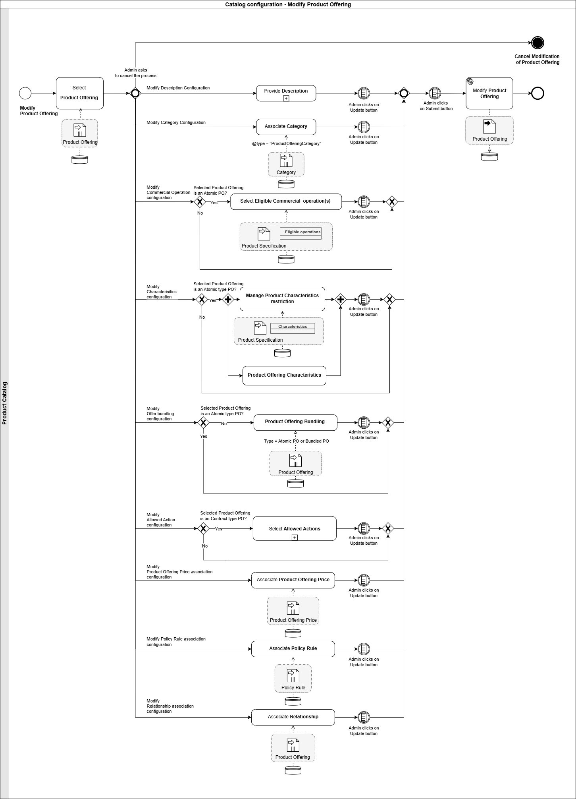{.img-zoomable}

!!! info "Tasks description"
    For details on 'Provide Description', 'Select Allowed Actions' and  'Associate Product Offering Price', please refer to the description provided in the **Create Product Offering** process.

### Lifecycle Management Process

The lifecycle management process is used to manage the lifecycle status of Product Offerings and Product Specifications. The segregation of process enables to manage authorization for managing lifecycle status effectively.

The process is outlined below:

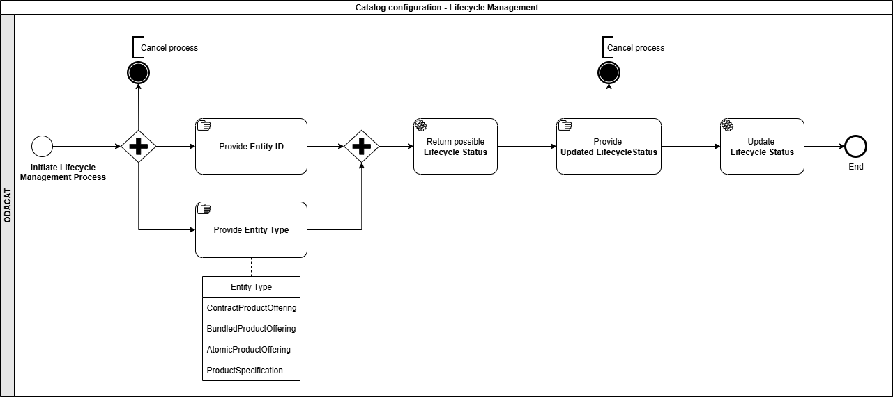{.img-zoomable}

### Create Product Offering Price

This entity represents all the Product Offering Price applicable to an offering. There may be 4 kinds of Product Offering Price:

- Product Offering Price Charge.  
- Product Offering Price Alteration: This corresponds to a discount.  
- Tax Product Offering Price Charge: This corresponds to taxes.  
- Installment Charge: Used in the case of acquiring a tangible product offering in installments rather than full payment.  

The process is outlined below: 

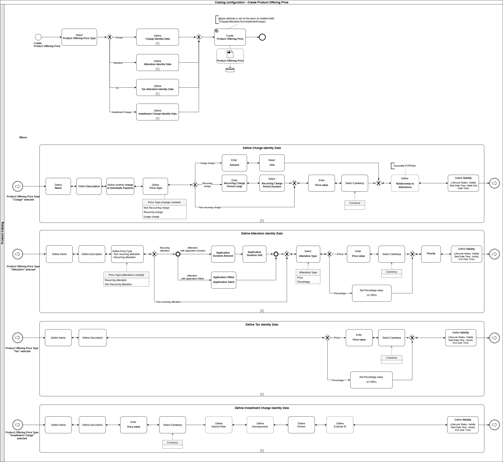{.img-zoomable}

### Create Category

The Category resource is used to group Product Offerings. Categories can contain other Categories and/or Product Offerings. 

The following is the process to create a product offering category:

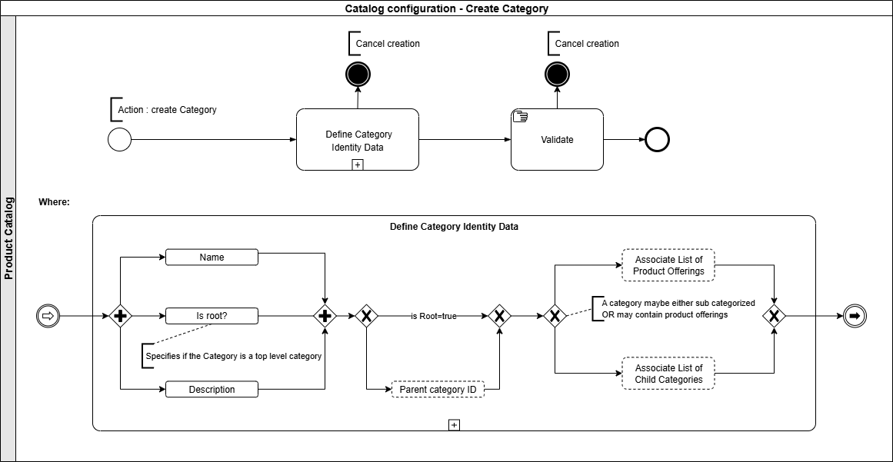{.img-zoomable}

### Modify Category

All the attributes in a Category are modifiable except the unique generated `ID` and the `isRoot` attribute which specifies if the category is the topmost level category.

The modify process is instantiated with a modify call process call on the unique `ID`.

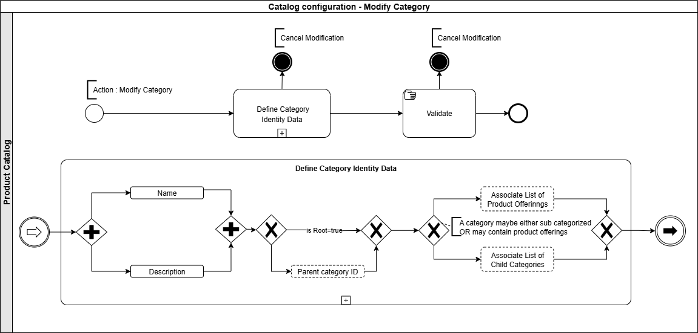{.img-zoomable}

### Delete Category

The Category delete process is a simple two steps process, the first step being the instantiation and the second being the selection of the category by `ID` for deletion.

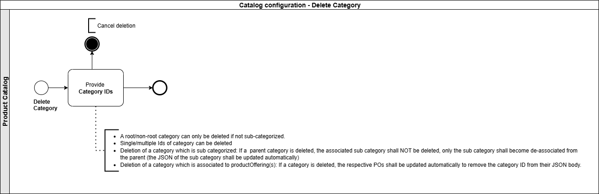{.img-zoomable}

### Policy Rule Operations

Apart from the above processes, the Policy Rule resource is managed through Create, Read, Update and Delete (CRUD) operations directly on the Policy Rule API, rather than a process. The Policy Rule resource supports mainly 3 types of operations:

- Create  
- Modify  
- Delete  

#### Policy Rule Create and Modify

The Policy Rule creation and modification are identitical with the operations being enabled by the POST and PATCH verbs of the Policy Rule API and it's resources. The workflow is outlined below:

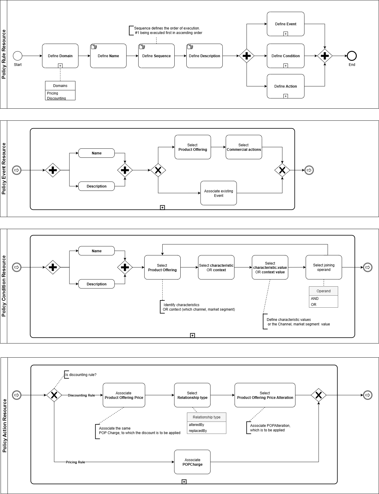{.img-zoomable}

#### Policy Rule Delete

The Policy Rule delete operations also deletes the associated `event`, `condition` and `action` objects. It is enabled by the DELETE verb of the TMF723 Policy Rule API and it's resources. It is therefore important to consider the deletion of re-used events and conditions. 

The workflow is outlined below:

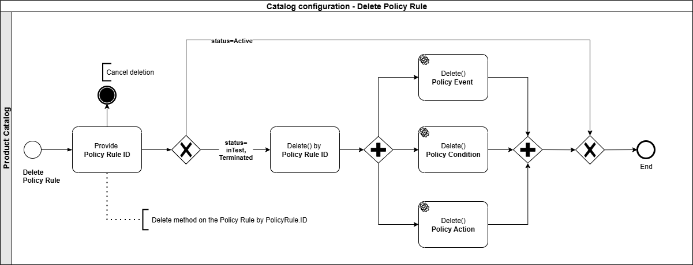{.img-zoomable}

## Data View

### Product Catalog (TMF620)

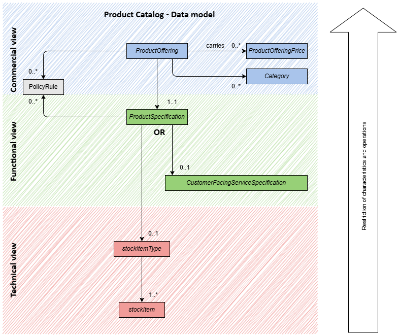{.img-zoomable}

The data model for the TMF620 API follows the "Bottom-up" approach. In this approach, support entities from the service/resource layers (e.g., CFS and Stock Items) are used to realize Product Specifications. The Product Specifications define the features for offerings in terms of characteristics. Additionally, these Product Specifications may have relationships used during the orchestration process to derive orchestration plans. Product Offerings are a restriction of Product Specifications. They may optionally have a Product Offering Price and can also be categorized. Rules may be defined for Product Offerings to drive configurations in the Product Configurator component.

1. **Product Offering**: Represents entities that are orderable from the provider of the catalog; this resource includes pricing information.
2. **Product Offering Price**: Represents the price for Product Offerings. This price may be further revised through discounting (a Product Offering Price that reflects an alteration). The price, applied for a Product Offering, may also be influenced by the Product Offering Term, the customer selected, and other factors defined by Policy Rules.
3. **Product Specification**: A detailed description of a tangible or intangible object made available externally in the form of a Product Offering to customers.
4. **Category**: Used to group Product Offerings in logical containers. Categories can contain other Categories and/or Product Offerings.
5. **Policy Rule**: Defined from Event–Condition–Action (ECA) definition:
   1. The Event part specifies the signal that triggers the invocation of the rule.
   2. The Condition part is a logical test that, if satisfied or evaluates to true, causes the action to be carried out.
   3. The Action part consists of updates or invocations on the local data.
6. **Customer Facing Service Specification**: Represents the intangible services used to instantiate Product Specifications.
7. **Stock Items and Stock Item Types**: Stock items are the tangible stock that can instantiate Product Specifications.

### Export Job

This functional feature enables exporting the TMF620 API-managed entities in a workbook. An ODF-specific file is generated for the requested export entities. Current export types of entities supported:

- Product Offerings
- Product Specifications
- Customer Facing Service Specifications
- Stock Items

 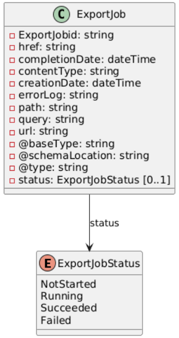{.img-zoomable}

 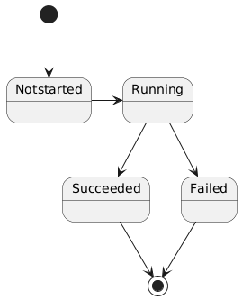{.img-zoomable}

### Export Job Properties

| Property             | Description                                                                 | Mandatory | Stored in DB |
|:------------------|:----------------------------------------------------------------------------|:----------|:-------------|
| `href`              | A URI. Reference of the export job.                                         | No        | No           |
| `id`                | A string. Identifier of the export job.                                     | No        | Yes - unique ID generated by MongoDB |
| `@baseType`         | A string. When sub-classing, this defines the super-class.                   | No        | No           |
| `@schemaLocation`   | A URI. A URI to a JSON-Schema file that defines additional attributes and relationships. | No        | No           |
| `@type`             | A string. When sub-classing, this defines the sub-class Extensible name.    | No        | No           |
| `completionDate`    | A date time (DateTime). Date at which the job was completed.                | No        | Yes - date-time when the job went into status success/failed |
| `contentType`       | A string. The format of the exported data.                                  | No        | "ODF" - hardcoded by default |
| `creationDate`      | A date time (DateTime). Date at which the job was created.                  | No        | Yes - request date for the export job |
| `errorLog`          | A string. Reason for failure.                                               | No        | Optional - Mandatory when ExportJob is in "failed" status |
| `path`              | A string. URL of the root resource acting as the source for streaming content to the file specified by the export job. | No        | No           |
| `query`             | A string. Used to scope the exported data.                                  | Yes - contains the values of filters requested by the user which shall determine the rows in the export | Yes - contains the values of filters requested by the user which shall determine the rows in the export |
| `status`            | A JobStateType. Status of the export job (not started, running, succeeded, failed). | No        | Yes          |
| `url`               | A URI. URL of the file containing the data to be exported.                  | No        | No           |

### Policy Rule

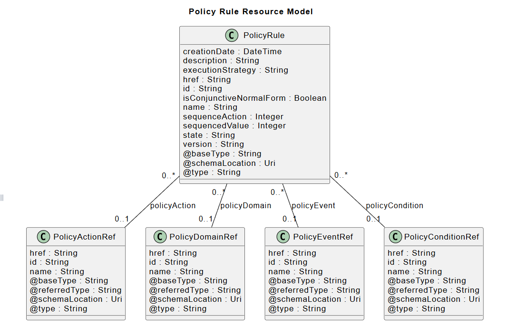{.img-zoomable}

- **PolicyRule:** Central entity describing a Policy Rule.
- **PolicyActionRef, PolicyDomainRef, PolicyEventRef, PolicyConditionRef:** Reference entities for actions, domains, events, and conditions related to the policy.

#### Resource Description

- The Event part specifies the signal that triggers the invocation of the rule.
- The Condition part is a logical test that, if satisfied or evaluates to true, causes the action to be carried out.
- The Action part consists of updates or invocations on the local data.
- The Domain specifies the domain/component mastered. In the context of DISCOBOLE, since the TMF723 Policy Rule API is central to the product catalog rules only, the domain is used to identify the type of rules i.e. :
  - **Pricing Rules:** To define the conditions under which tariffs are associated with the offer.
  - **Discounting Rules:** To define the conditions under which alterations (discounts) are associated with the charges (tariffs). 
  - **Eligibility Rules:** Those rules control what actions are authorized (add or remove a product instance, which attribute values can be set, towards which offer migration are allowed).
  - **Commercial Rules:** To define all kind of rules that control the relations between products (e.g., incompatibility, prerequisites, brings, relies on...).
  - **Attribute Rules:**  To define the valid attribute values in context of offer and current configurations.

## Relationship Modelling

| Relationship Type | Hierarchy Level | Definition | Example |
|:------------------|:----------------|:-----------|:--------|
| `incompatible`  | PO–PO level     | Used to ensure that certain commercial objects cannot be selected together in a configuration. It covers both commercial and technical restrictions. This rule is bi-directional (A is incompatible with B = B is incompatible with A). | Contract MP1 is incompatible with Contract MP2. |
| `requires`      | PO–PO level     | Indicates that one Product Offering depends on the selection of another product. It ensures logical grouping of offers during configuration. | Contract MP1 requires Contract MP2 to be selected. |
| `reliesOn`      | PS–PS level     | Defines a functional dependency between Product Specifications. This is a directional relation (source to target) and is checked at the specification level. | A mobile access service relies on a SIM card; or a shared data bucket across mobile accesses. |

## Entity Lifecycles

The possible values for status of lifecycle is illustrated in the sections below.

### Product Offering & Product Specification Lifecycle

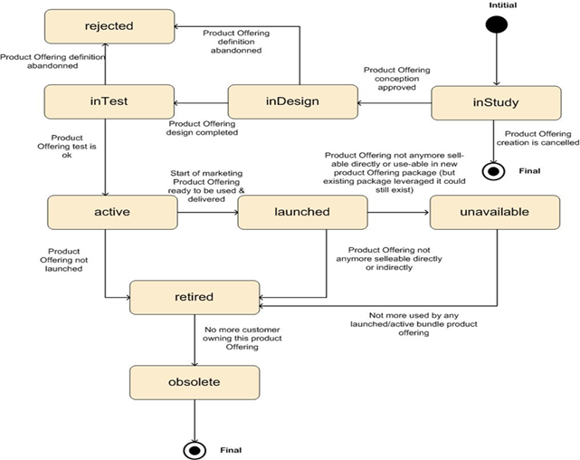{.img-zoomable}

### Policy Rule Lifecycle

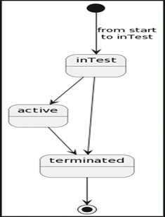{.img-zoomable}

## Entity Versioning

The following is an example of how changes to a Product Offering impact version and lifecycle status. The same behavior shall be replicated for Product Specification.

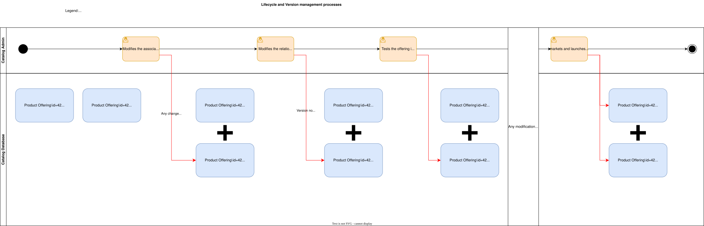{.img-zoomable}

## Component View

The Product Catalog component is positioned as part of the ODA Core Commerce Management layer.

{.img-zoomable}

The end-user is a **Product Catalog Administrator** who wants to manage the Product Offerings on the [Product Catalog UI](https://gitlab.ow2.org/discobole/disco-oda-components/disco-ui-portals/product-catalog-ui), which is the front-end for the Product Catalog component.

This web application consumes a Process Flow API named **TMF701 Process Flow** to trigger/update the Product Catalog entities. The **TMF701 Process Flow** is managed by a process flow library: [processFlow](https://gitlab.ow2.org/discobole/disco-oda-components/process-flow).

The Product Catalog also exposes the **TMF620 Product Catalog Management API**, which is consumed by the following components:

- **Order Management**  
  [Order Management Website](https://discobole.ow2.io/discobole-oda-components/disco-order-management/doc)  
  Used to place orders.
- **Product Configurator**  
  [Product Configurator Website](https://discobole.ow2.io/discobole-oda-components/disco-product-configurator/doc)  
  Handles commercial eligibility and offer configuration during the order capture process.
- **Commercial Products Install Base**  
  [Product Inventory Website](https://discobole.ow2.io/discobole-oda-components/disco-product-inventory/doc)  
  Responsible for product management.
- **Customer Order Orchestration and Delivery**  
  [Order Orchestration Website](https://discobole.ow2.io/discobole-oda-components/disco-order-orchestration/doc)  
  Manages customer order orchestration and delivery.

???+ summary "Product Catalog APIs & Event Summary"
    | API Name | TMF Code | Description | State |
    |:---------|:---------|:------------|:------|
    | Product Catalog Management | TMF620 | Fetch the Product Catalog entities | Exposed |
    | Process Flow | TMF701 | Manage Product Catalog entities | Exposed |
    | Product Catalog Administration | N/A | Provide admin capabilities to administer the Product Catalog | Exposed |
    | Policy Rules | TMF723 | Manage Policy Rules for the Product Catalog entities | Exposed |
    | Service Catalog Event | TMF633 | Consume the service catalog entity creation and state change events | Consumed |
    | Resource Catalog Event | TMF634 | Consume the resource catalog entity creation and state change events | Consumed |

!!! abstract "Service Overview"
    The data in the Product Catalog is consumed via TMF620 GET operations by the following components:
    1. [Order Management](https://discobole.ow2.io/discobole-oda-components/disco-order-management/order-website/)
    2. [Product Configurator](https://discobole.ow2.io/discobole-oda-components/disco-product-configurator/configurator-website/)
    3. [Customer Order Orchestration and Delivery](https://discobole.ow2.io/discobole-oda-components/disco-order-orchestration/orchestration-delivery-website/)
    4. [Commercial Product Install Base](https://discobole.ow2.io/discobole-oda-components/disco-product-inventory/product-inventory-website/)

## Software Architecture View

The Software View describes the products and frameworks used by each microservice.

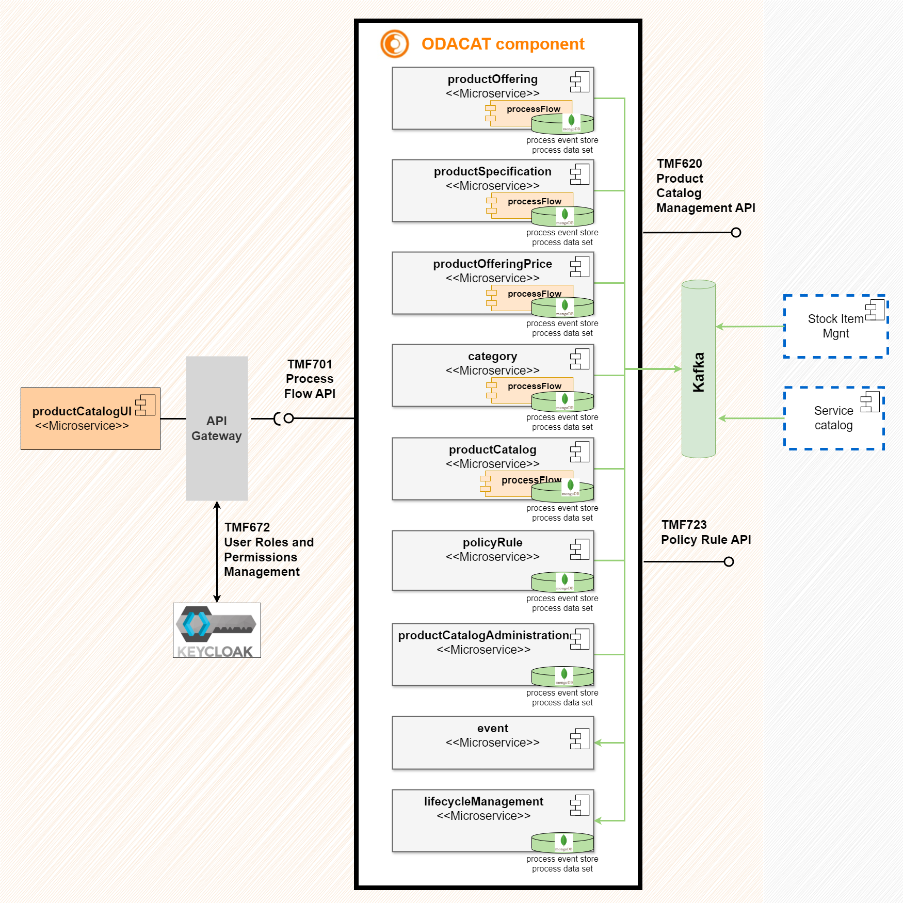{.img-zoomable}

The Catalog component includes the following microservices:

1. **Product Catalog**  
   The Product Catalog microservice in ODACAT implements the TMF620 API. This microservice enables the GET of all resources exposed by the TMF620 API. All consuming components utilize this API to fetch the master Product Catalog data. The Product Catalog acts as a single source of truth for all product-related data within the DISCOBOLE ecosystem.

2. **Product Specification**  
   The Product Specification microservice implements the TMF701 API, exposing POST and PATCH operations for the Product Specification resource within the catalog. The API interacts externally with the Product Catalog front-end and can be exposed as a standalone API to create and manage Product Specifications. Product Specifications serve as a fundamental component for managing and presenting products, providing a detailed and structured description of each product or service, including features (characteristics), attributes, relationships, and other relevant details.

3. **Product Offering**  
   The Product Offering microservice implements the TMF701 API, exposing POST and PATCH operations for the Product Offering resource within the catalog. The API interacts externally with the Product Catalog front-end and can be exposed standalone to create and manage Product Offerings. Product Offerings provide the commercial view of the Product Catalog, including the name, description, association to prices and rules, and flags to manage their behavior.

4. **Product Offering Price**  
   The Product Offering Price microservice implements the TMF701 API, exposing POST and PATCH operations for Product Offering Prices within the catalog. The API interacts externally with the Product Catalog front-end and can be exposed standalone to create and manage Product Offering Prices. These may be associated with Product Offerings, rules, or themselves, and may be specialized into a charge or discount, including details regarding types of charges/discounts, names, values, or percentages.

5. **Category**  
   The Category microservice implements the TMF701 API, exposing POST and PATCH operations for the Category resource in the Product Catalog. The API interacts externally with the Product Catalog front-end and can be exposed standalone to create and manage Categories. Categories are logical containers/directory structures for organizing Product Offerings, aiding catalog browsing for administrators and can be exposed to channels for classification.

6. **Lifecycle Management**  
   The Lifecycle Management microservice implements the TMF701 API, exposing POST and PATCH operations to manage the lifecycle of catalog entities like Product Offerings and Product Specifications. The lifecycle status of all managed catalog entities can be modified using this service.

7. **Policy Rule**  
   The Policy Rule microservice implements the TMF723 API, exposing POST/PATCH/DELETE operations for the Policy Rule and its associated sub-resources. The API interacts with the Product Catalog front-end, enabling management of Policy Rules and their components: policyEvent, policyCondition, and policyAction. The TMF723 Policy Rule API is CRUD-based and used to manage the design of Product Catalog business rules, which are conditional and map actions to conditions (e.g., pricing, discounting, eligibility, attribute rules).

8. **Product Catalog Administration**  
   The Product Catalog Administration microservice implements a custom Product Catalog Administration API to manage resources such as currency, frequencies, channels, and market segments by enabling POST/PATCH/DELETE operations. The API maintains global properties used within the catalog by Product Catalog users.

9. **Event Service**  
   The Event Service microservice consumes events from the Service Catalog component and the Stock Item Management component. These events duplicate CFS (Customer Facing Service) and Stock Items into the Product Catalog to realize Product Specifications and Product Offerings.

10. **Product Catalog UI**  
    The Product Catalog UI microservice exposes the front-end for the Product Catalog component. It interacts with all back-end APIs to manage the creation and maintenance of Product Catalog entities. It exposes a ReactJS-based, access-controlled front-end for Product Catalog users (admins/regular users) to manage entities.

### The Product Catalog Component Exposes the TMF701

- The Product Catalog exposes the TMF701 Process Flow API to manage BE-FE interactions.
- The Product Catalog also exposes the TMF620 Product Catalog Management API to manage GET operations of Product Catalog entities.
- Other APIs like TMF723 Policy Rule API and Product Catalog Administration API are also consumed by the Product Catalog front-end.
- The front-end uses ReactJS as a framework.
- The Product Catalog front-end is backend-driven, implying that tasks for managing catalog entity operations are exposed by the back-end APIs.

???+ summary "BPM Technology Used"
    The Spring State Machines, based on the Java Spring framework, are used to drive the BPM process for ODACAT.

## Design Patterns and Frameworks

The following design patterns and frameworks have been used in the Product Catalog component. These have been described in succeeding sections:

- Command Query Responsibility Segregration
- Axon Framework
- Asynchronous processing for export jobs

### Command Query Responsibility Segregation (CQRS)

**CQRS (Command Query Responsibility Segregation)** describes a way of developing applications that cleanly separate making changes to the application from querying the application. This typically results in two separate sets of application models and data sources - the write side and the read side. The read side is populated by the write side, typically through events.

**Key Reasons for Implementing CQRS:**

- The write side is optimized for changing the state of the application through commands that make sense to a business user. Application state is modeled through DDD aggregates. The read side is highly optimized for querying, resulting in a model that avoids complex queries and maximizes query performance. The read model is typically just DTOs (Data Transfer Objects) per screen. Focusing on the write and read sides tends to result in simpler code in both models that would otherwise be combined in a single, more complex model.
- The read and write models can be scaled independently as separate deployment units with dedicated capacity when needed. This is especially important for applications with high scalability requirements for the read side.
- The read and write sides can use the data storage that makes the most sense for each concern. With the Axon Platform, the write side is typically implemented using Event Sourcing (with perhaps AxonDB), and the read side can be implemented using a relational database or NoSQL data store.

#### CQRS Application Approach

CQRS splits the conceptual model into separate models for update and display, referred to as Command and Query, respectively, following the vocabulary of Command Query Separation. The rationale is that for many problems, particularly in complex domains, having the same conceptual model for commands and queries leads to a more complex model that does neither well.

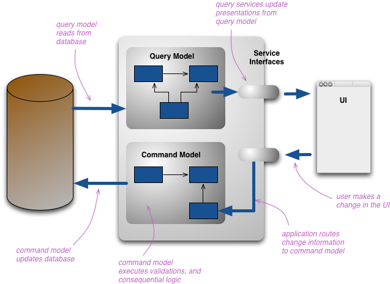{.img-zoomable}

### Axon Framework

Axon Framework is a Java framework for building applications using CQRS and Event Sourcing. It helps separate the parts of the system that handle business updates from the parts that serve queries, making complex domain logic easier to manage.

- Axon Framework is a strong fit for a product catalog because catalog systems usually have many more reads than writes.  
- The UI sends commands for business actions like creating products, updating prices, or changing availability.  
- A Command Handler processes the command, and the Domain/Aggregate enforces business rules and state changes.  
- Changes are stored as events in the Event Store and published through the Event Bus.  
- Event Handlers use those events to update the read model, analysis database, or messaging workflows.  
- The read side uses a Thin Data Layer to return DTOs optimized for catalog screens and queries.  
- This separation keeps the write model clean and the read model fast and simple.  
- It also makes the catalog easier to scale and evolve independently for browsing and editing needs.

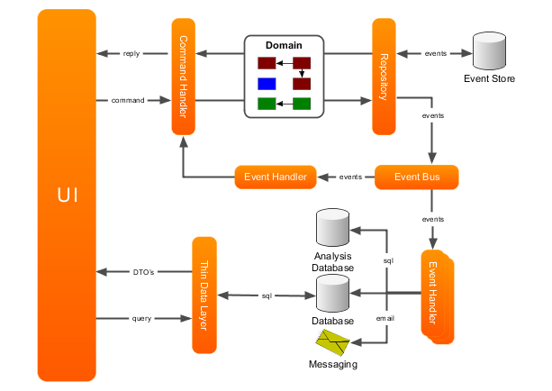{ width="600" }

#### Existing Implementation in Catalog

Events generated from the catalog-configurator are sent to the catalog via Kafka channels, and event data is stored in a MongoDB database. Query methods fetch data from the database for the user.

1. Bind the channels to the respective class.
2. Event Handlers are registered on initialization.
3. `@StreamListener` listens to the data and calls the respective handlers per the event.
4. Save the events in the MongoDB database from the handlers.
5. This microservice is used to query the data from the database.

### Asynchronous Implementation for Export Job 

#### Overview
The export job functionality enables a user to request data export through the Product Catalog UI, which submits the request to the TMF620 API. The API validates the request, creates an asynchronous `exportJob()` instance, and tracks its execution until completion. Once the job is completed, the generated export file is uploaded to an S3 bucket and becomes available for user download through the UI.

!!! info "Release 12 - November 2026"
    Asynchronous implementation is important for the downloading of files, so as to avoid the issue of timeouts due to complex procedures used for export.

#### Request Submission
The process begins when the user initiates an export request from the Product Catalog UI. The request contains the required parameters:

- `path()`
- `query()`

The UI forwards this request to the TMF620 API for processing.

#### Validation and Job Creation
Upon receiving the request, the TMF620 API performs validation to ensure that the input parameters are correct and complete. If the request is valid, the API creates an `exportJob()` object in asynchronous mode and assigns it an initial status of `inProgress`.

At this stage, the request is accepted for background processing, and the user is not required to wait for completion.

#### Asynchronous Processing
The export job is processed in the background by the backend service. During this phase, the export operation continues independently of the UI session.

#### Status Polling
While the job is being processed, the Product Catalog UI polls the TMF620 API at 5-minute intervals to retrieve the current status of the export job.

Possible status values:

- `inProgress`
- `Completed`

#### Completion and File Upload
When the export job reaches the `Completed` status, the generated export file is pushed to the S3 bucket. The file is stored in S3 and made available for download.

#### Download Availability
Once the job is marked as completed, the frontend displays a download link to the user. This link points to the file stored in S3.

#### File Download
The user clicks the download link in the UI to retrieve the export file. The file is then downloaded from the S3 bucket and saved to the user’s local storage.

#### End Result
After the download is complete, the user has a local copy of the export job file available for further use.

#### Process Summary
1. The user submits an export request via the Product Catalog UI.
2. The UI sends the request to the TMF620 API with `path()` and `query()` parameters.
3. The API validates the request and creates an asynchronous `exportJob()` with status `inProgress`.
4. The UI polls for status updates every 5 minutes.
5. When the job is completed, the file is uploaded to S3.
6. The UI exposes a download link to the user.
7. The user downloads the file to local storage.

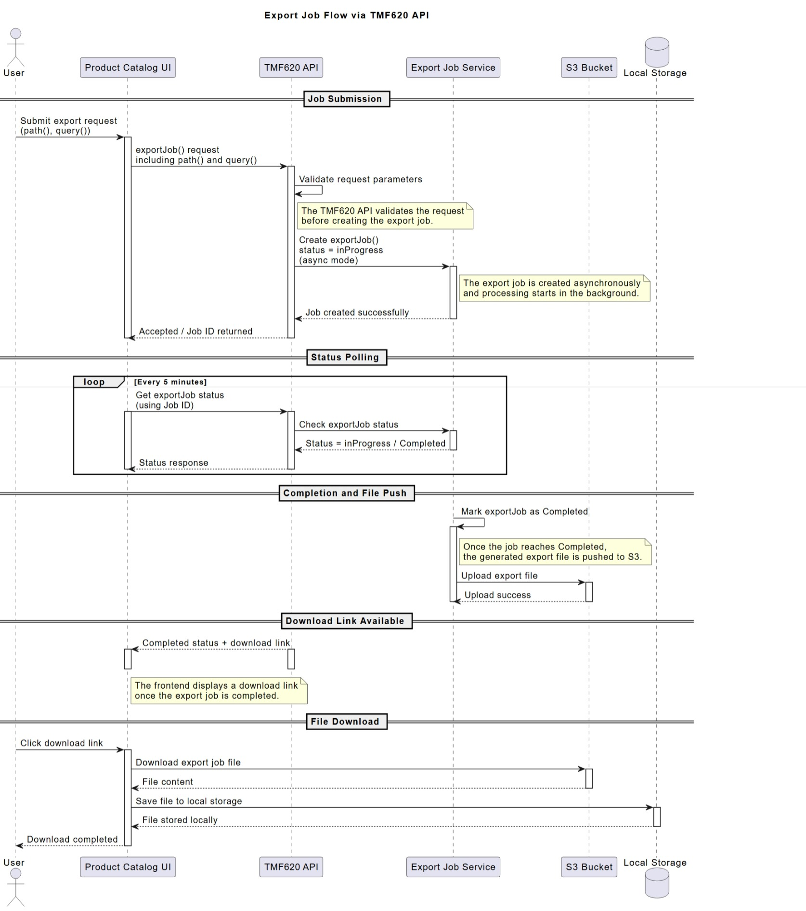{.img-zoomable}

## Source Code Organization

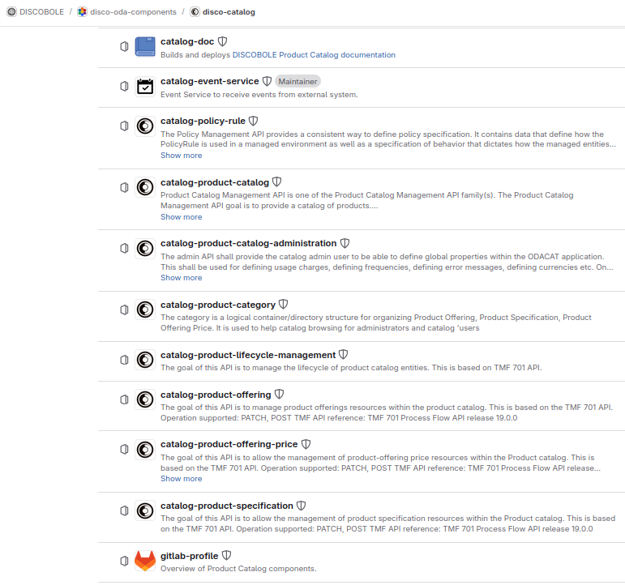{.img-zoomable}
