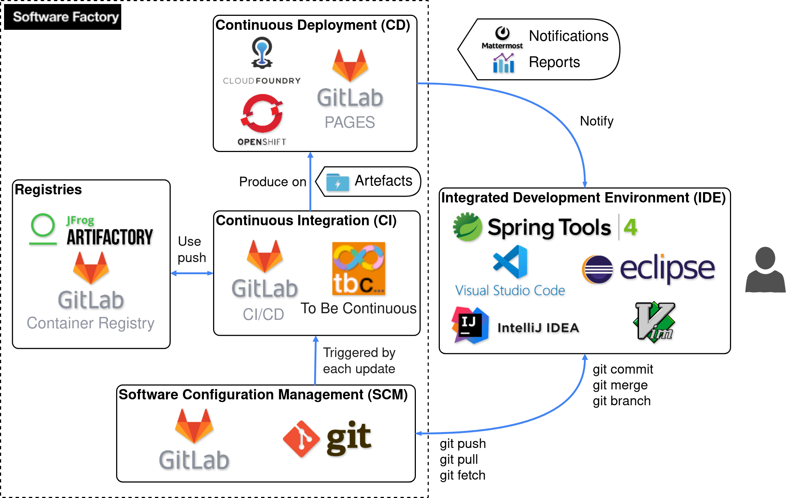
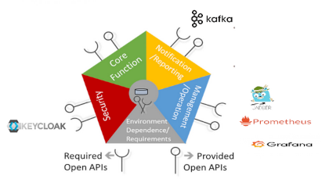

# Development Ecosystem

## Software Factory

???+ info "Components"
    - __GitLab__: source code repository
    - __GitLab CI__: continuous integration and continuous deployment
    - __GitLab Pages__ : GitLab integrated http hosting for html pages
    - __tbc...__: to be continuous templates
    - __Openshift__ & __Rancher Kubernetes__: deployment platform
    - __GitLab Container Registry__: Docker registry for internal project usage
    - __Discord__: human and bot communication channel
  
## Canvas Functions

???+ info "Components"
    - __TMF620__: ​TMF620 Product Catalog Managemnet API refers to the Product Catalog Management API developed by the TM Forum, a global industry association that provides standards and best practices for the telecommunications sector. This API offers a standardized RESTful interface for managing the complete lifecycle of product catalog elements, including product offerings, specifications, categories, and pricing.
    - __TMF723__: TMF723 Policy API goal is to provide the ability to manage Policy rule and its components: policyEvent, policyCondition and policyAction and policyDomain.
    - __Kafka__: Kafka is a distributed data store optimized for ingesting and processing streaming data in real-time.
    - __Keycloak__ : Keycloak is an open-source software solution designed to provide single sign-on access to applications and services.
    - __Jaeger__: Jaeger is software that you can use to monitor and troubleshoot problems on interconnected software components called microservices.
    - __Prometheus__: It's an open-source system for monitoring services and alerts based on a time series data model.
    - __Grafana__: Grafana is an open-source platform for data visualization, monitoring and analysis.
