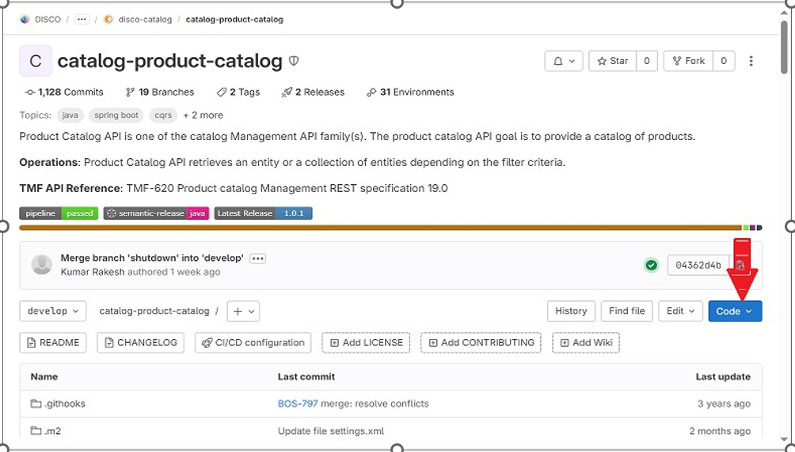
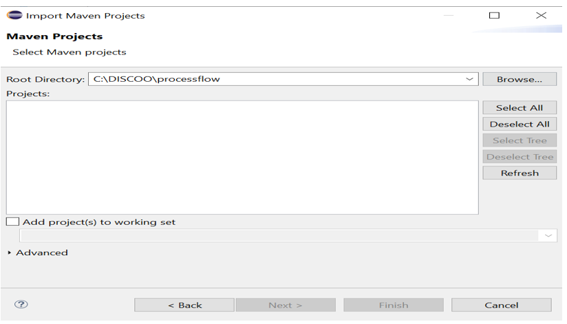
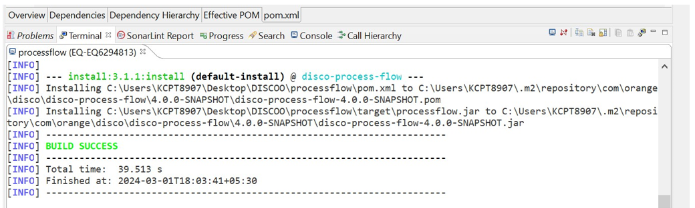
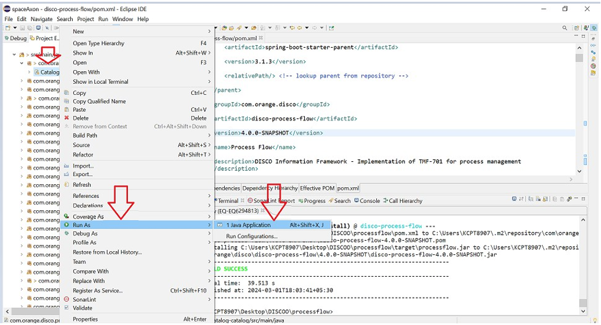
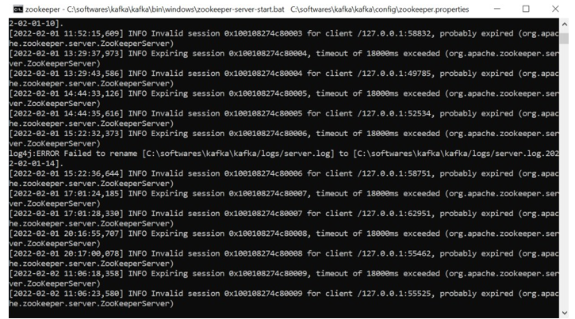

# Guide of Product Catalog Project Set Up

## Installation

First needs to clone the Product Catalog projects from the [Git subgroup location](https://gitlab.ow2.org/discobole/disco-oda-components/disco-catalog).

Click on Clone Button.



After clicking on clone, copied URL from Clone with HTTPS.


Open Command Prompt (cmd.exe) and locate directory where you want to clone and use below command format:
    a)git clone {url}
    b)for product catalog , command will be:
    ```bash
    git clone https://gitlab.ow2.org/discobole/disco-oda-components/disco-catalog/catalog-product-catalog.git
    ```

Repeat step from 2 to 4 for other catalog projects repositories.

## Import Projects In IDE

Import projects in IDE. Here we are using Eclipse IDE.

We need to build process flow first as it is used in all catalog projects.

Take clone of processFlow:

```bash
git clone https://gitlab.ow2.org/disco/disco-oda-components/process-flow.git
```

So, let's import process flow and then the same steps will be followed for other projects.

Click on Files -> import -> Select Existing Maven Project -> Next -> Browse the location where you have cloned process flow library/project -> Finish.




After that need to execute maven update. Right click on project-> select Maven-> update Project.


After completion of project update, need to build the project: right click on Project -> Show in Terminal -> write "mvn clean install".




Now need to set up catalog projects in same way ,as we have done setup for process flow project.

After importing all the projects successfully, we need to up kafka service, mongoDB.

After, run services by click right on project main application file and run as java application.



## MongoDB

1. Download MongoDB and install it (zip --> extract).
2. Create a folder "data" in System C and inside data create "db" folder.
3. Goto bin path inside your mongoDB folder. (e.g. C:\Program Files\MongoDB\Server\3.4\bin)
4. Add this path in System Environment variables path.
5. Open command prompt and write "mongod".


6. Download MongoDB Compass to view Databases and Collections.


## Kafka

Install Kafka

Go to kafka folder directory and select `start_with_test_topic.bat` file from the bin folder . Please see the attached screenshot for reference.


This will open below two prompts after execution of `start_with_test_topic.bat` file. One will be Kafka and another Zookeeper




## Postman

Install Postman.

Run any GET endpoint of product catalog.

Get All Product Specifications : `GET https://{{baseUrl}}/productCatalogManagement/v1/productOffering`.

We required a token which we will get from keycloak after authorization and add in Get Call Header as Authorization: bearer {{token}}.

To get token, below is curl request:

```bash
curl --location --request POST 'https://{{baseUrl}}/keycloak/realms/SpringBootKeycloak/protocol/openid-connect/token
```

- header 'Content-Type: application/x-www-form-urlencoded'
- data-urlencode 'username={{email}}'
- data-urlencode 'password={{password}}'
- data-urlencode 'grant_type={{password}}'
- data-urlencode 'client_id={{clientId}}'
- data-urlencode 'client_secret={{clientSecret}}'
- data-urlencode 'scope=openid'


