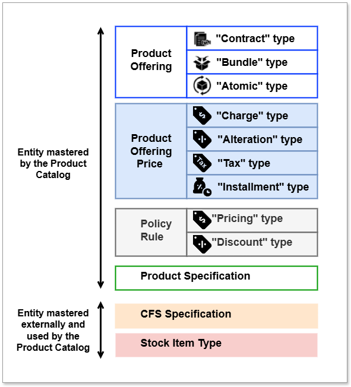

# Bottom-up Approach

Below description explains the main steps to follow with the **bottom-up approach** in order to configure the main catalog entities in ODACAT Product Catalog. Each entity is highly configurable.

First you need the [Customer Facing Service (CFS) Specifications](../cfs-specification/) or [Stock Item (STK) Types](../stock-item-type/) created based on events received from Service Catalog & Stock Item Management systems which hold the primary definition of those elements. The CFS represents intangible services like Broadband, and stockItemTypes are groupings of delivered tangible products to the customer. Received events are consumed by the Product Catalog to create replicas of CFS Specification & Stock Items Types into the Product Catalog data base. They are then visible through ODACAT UI in Customer Facing Service and Stock Item Type sections. Please note that some CFS have relationships between each other. 

!!! example "CFS relationship"
    `Data bundle` CFS Specification needs a `reliesOn` relationship with the `Mobile Line` CFS Specification. 

!!! warning "About lifecycle if CFS Spec and STK Types in ODACAT"
    It is highly important to note that Customer Facing Services Specification and Stock Item Types can't be created, modified or deleted through ODACAT Product Catalog.

Secondly [Product Specifications](../product-specification/) (PS) needs to be defined. In the Product Catalog, you can create as many Product Specifications as you want based on the same Customer Facing Service or Stock Item Type. These Product Specification are restrictions from Customer Facing Service and Stock Item Type. It represents what the operator is going to sell to the end customer (for ex. a mobile line service, fiber access or a VoIP service). Product Specifications are technical entities as Customer Facing Service & Stock Item Type. Product Specifications need also some relationships to indicate how they are bound together and if there are any dependencies between them (for ex a 'Data bundle' Product Specifications needs a `reliesOn` relastionhip with a 'Mobile line' Product Specifications since the 'Data bundle' needs a 'Mobile line' to exist). These dependencies at the Product Specification level are used to specify the 1) pre-requisites & 2) order of nodes for delivery by the [COOD](https://discobole.ow2.io/disco-oda-components/disco-order-orchestration/doc/) component. Product Specifications can be created on top of a Customer Facing Service for intangible products or on top of Stock Item Types for tangible products.

???+ summary "Specific Product Specification (PS) subtype for Shipping"
    - A specific Product Specification (PS) subtype with `@baseType="ShippingProductSpecification"` is required to handle shipping for tangible products. This shipping subtype is derived from the Customer Facing Service; 
    - when the Customer Facing Service event also specifies `@baseType="ShippingProductSpecification"`, the corresponding PS is automatically updated upon creation from the Customer Facing Service. Standard restrictions on characteristics and their values apply, as with other Product Specifications. The `@baseType` attribute is used during delivery to orchestrate the shipping process.

Next step is to define [Product Offerings](../product-offering/) (PO) which describe the commercial part of the catalog. There are 3 types of products offerings:

- **Atomic** product offering: they are defined on top of a product specification (for ex livebox atomic product offering),
- **Bundle** product offering: they can bundle several atomic or bundle product offerings with minimal and maximum cardinalities at each level and on a global level (for ex a mobile package bundle product offering),
- **Contract** product offering: they are the offer that is subscribed by the end customer. They can be composed of atomic and/or bundle products offerings (for ex a convergent mobile/internet contract product offering).

Some relationships are also needed at product offering level. For example, regarding shipment, each offer that contains a tangible product shall have a `requires` relationship with a shipment offer. Product Offering relationships are utilized by the [Configurator](https://discobole.ow2.io/disco-oda-components/disco-product-configurator/doc/) to manage the following behaviour:  

- Auto add an offering based on requires relationship (ex. Tangible offer "requires" Shipping)  
- Define incompatibility between offers in current configuration and installed base (Ex: "Premium" contract offer is "incompatible" with "Basic" contract offer)  
- Define possible migrations between contracts (Ex: "Mobile Package Comfort" 'migratesTo' "Mobile Package Relax").

Another crucial point regarding commercial needs is the definition of pricing and discounting rules. This is done through entities named [Product Offering Prices](../product-offering-price/) (POP) which can have several types:

- **Charge**
- **Alteration (discount)**
- **Tax**
- **Installment Charge**

In order to define more sophisticated rules for pricing and discounting, the [Policy Rules](../policy-rule/) shall be used. This allows to define some trigger and condition(s) in order to apply a given price or a given discount in a certain context for example.

The figure below presents the main entities managed in ODACAT Product Catalog:

 

??? note "Category"
    For clarity purpose, the Category entity has not been represented in the figure above eventhough it's an entity managed by the ODACAT Product Catalog
