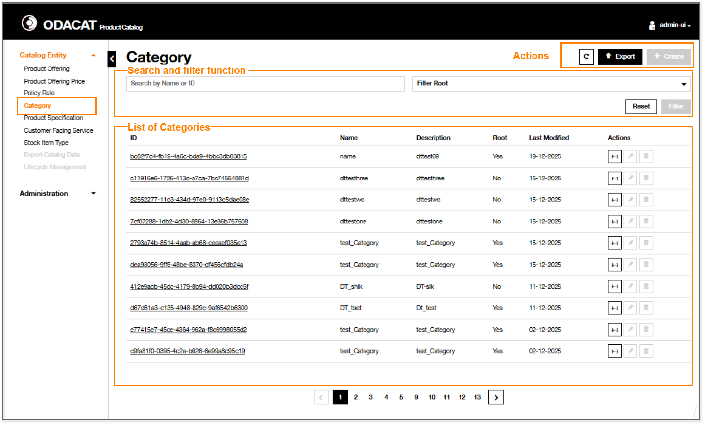
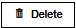
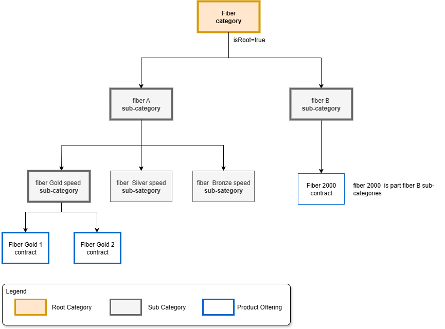
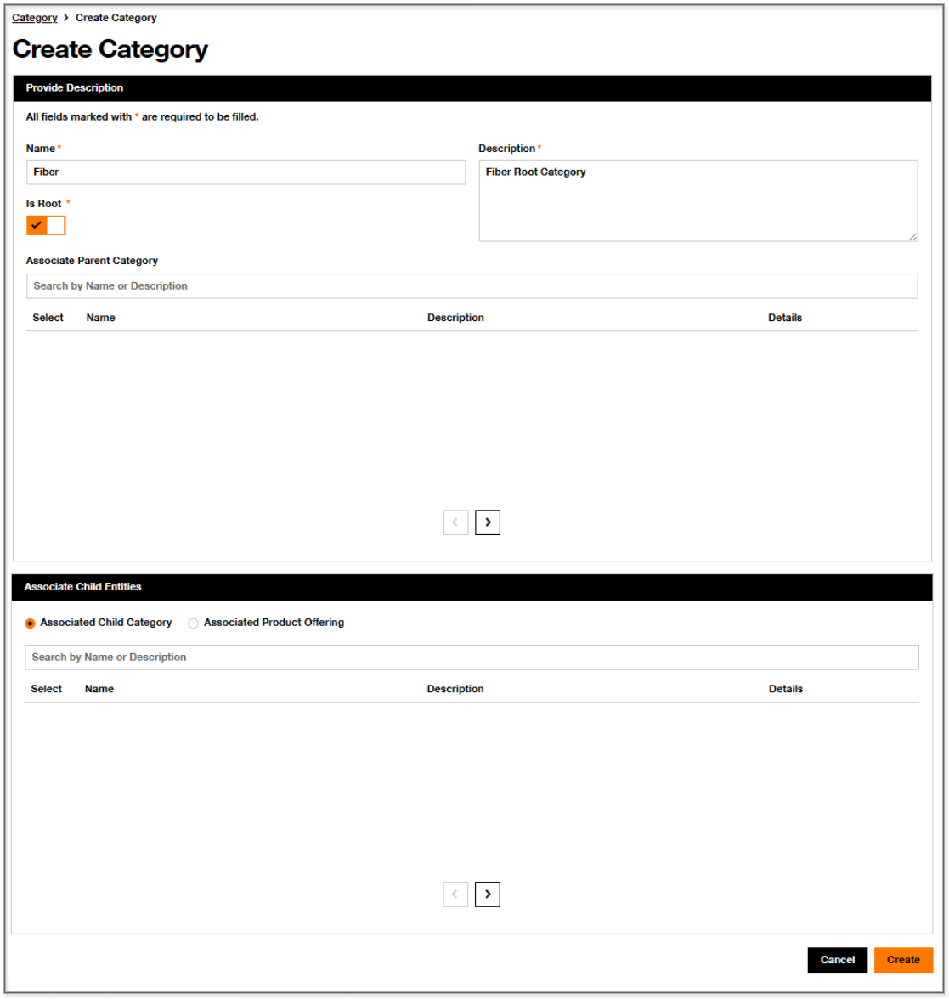
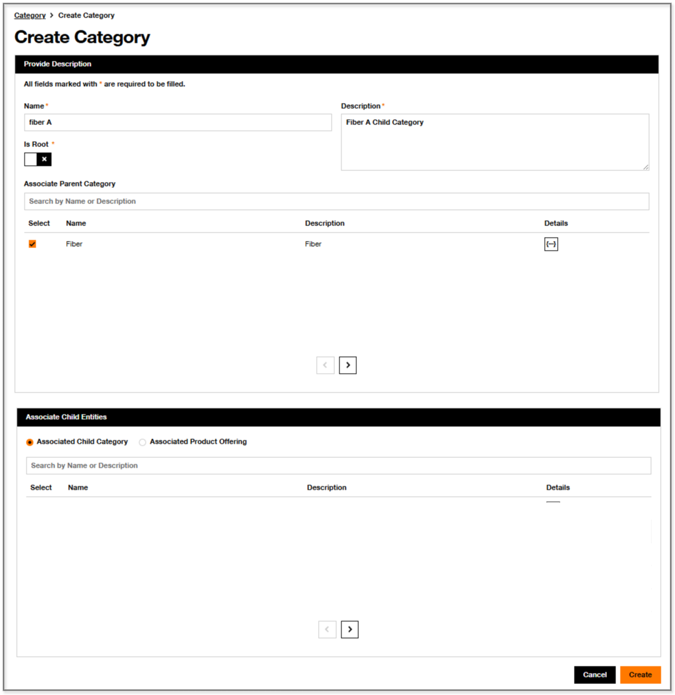
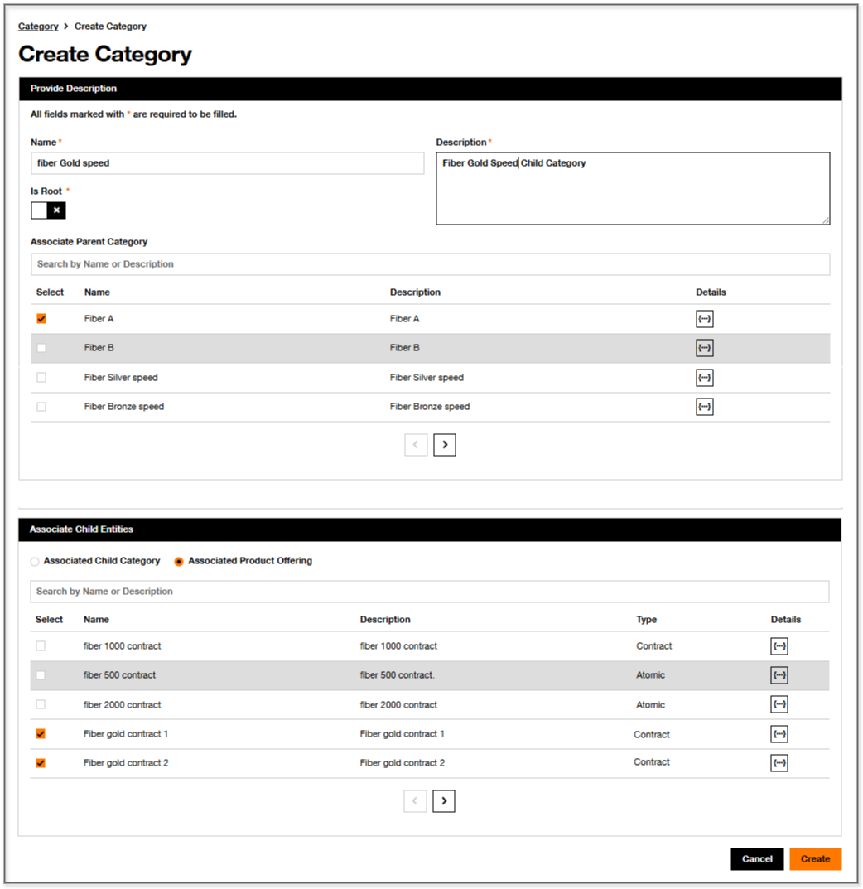

# Category

In the ODACAT Product Catalog User Interface, you can [Create](#create-category), [Modify](#modify-category) and [Delete](#delete-category) as well as visualize the list of categories in the associated [Dashboard](#dashboard).

!!! success "Category levels"
    - ODACAT supports a maximum of 3 nested categories: 1 root category + 2 Non root categories
    - if the Category being defined is a "root" level, then there is no Parent Category to configure. Else, the configuration of a Parent category is mandatory.

## Dashboard

In the ODACAT Product Catalog User Interface, you can access to **Category Dashboard** by selecting the **Category** from the "Catalog Entity" panel. It includes: 

- a set of Action buttons:
  -  button to refresh the display
  -  button to generate an export file with the list of Categories
  -  button to create of a Category
- a [Search and filter function](#search-and-filter-function) related area, you can use to filter the list of Categories.
- a list of Categories.

   

### Information Displayed and Actions

The list of Category displays all of, or a subset of, the Category(s) defined in the Product Catalog. The properties of the Category displayed include: 

  | Column               | Description                                                                                             |
  | :------------------- | :-----------------------------------------------------------------------------------------------------  |
  | `ID`                 | The identifier of the Category                                                                          |
  | `Name`               | The name of the Category                                                                                |
  | `Description`        | A description of the Category                                                                           |
  | `Root`               | This boolean defines whether the Category is a Root or not. Possible values are [Yes/No]                |
  | `Last Modified Date` | The date this Category was last modified                                                                |
  | `Action`             | Set of Category specific actions:   to get details on its definition in *Json* format   to edit it   to delete it.  | 

### Search and filter function

The **Search and filter function** of the **Category Dashboard** enables to retrieve the list of Categories based on a set of filter criteria:

- Identifier ID or Name
- Root: boolean value to specify whether the category is a Root or a Child

These filter criteria may be combined.

??? abstract "Search by ID"
     1. Enter the **Category ID** in the **Search on Name or ID** area  
     2. Click on **Filter** button  
     3. The result of the filtering is displayed:  
       - If the **Category ID** is already defined in the Product Catalog, then the list of Categories is refreshed and only the associated Category is displayed with its properties.  
       - Otherwise, If the **Category ID** is not defined in the Product Catalog, then the list of Categories is refreshed with no entry and a message `No data to display` is provided.   
     4. To return on the default list of Categories, click on the Reset button  on the top of the screen.   

??? abstract "Search by Name"
     **Full name entered**  
     1. Enter the complete **Category Name** in the **Search on Name or ID** area  
     2. Click on **Filter** button  
     3. The result of the filtering is displayed:  
        - If there is a Category already defined in the Product Catalog with this Name, then the list of Categories is refreshed and only the associated Category is displayed with its properties.  
        - Otherwise, if there is no Category with this Name in the Product Catalog, then the list of Categories is refreshed with no entry and a message `No data to display` is provided.
     4. To return on the default list of Categories, click on the Reset button  on the top of the screen.     
     **Partial name entered**  
     1. Enter some characters of **Category Name** in the **Search on Name or ID** area  
     2. Click on **Filter** button  
     3. The result of the filtering is displayed:  
       - If there is one or several Category(s) already defined in the Product Catalog which Name includes the set of characters used for the Search, then the list of Categories is refreshed and only the associated Categories is (are) displayed with its (their) properties.  
       - Otherwise, if there is not any Category which name includes this set of characters, then the list of Categories is refreshed with no entry and a message `No data to display` is provided.  
     4. To return on the default list of Categories, click on the Reset button  on the top of the screen.  

??? abstract "Filter Root"
     The **Filter Root** criteria of the Category Dashboard can be used to restrict the list of Categories.  
     - if 'Yes' value is selected, only the Categories which are at **Root level** will be displayed  
     - if 'No' value is selected, only the Categories which are **not at Root level** will be displayed

## Create Category

This section describes how a **Category** can be created with the ODACAT User Interface. This creation follows a sequence of configurations on the user interface aligned with the process flow presented in the [Category Process](../../../architecture/overall-architecture#category-process) section of the [Overall Architecture](../../../architecture/overall-architecture).

### Root Category

1. Click on the  on top right corner of the window
2. A **Create Category** page is displayed with two cards Provide Description  and Associate Childs entities 

3. Provide Description  

   - Enter the **Name**
   - Enter the **Description**  
   - Specify the category is a **Root** category: **Root** is **enabled**.

4. If the given **Category** should be sub categorized, then configure in the Associate Childs entities , one or multiple Child Category(ies).  
   - You can first get details on each Category listed thanks to the  button
   - Once identified, you can select with the checkbox the Category(s) that should be associated as a Child of the Root Category under creation

   Once completed, click on the **Create** orange button to complete the process flow for the creation of a Root Category.

5. Otherwise, if the given **Category** should not be sub categorized, then configure in the **Product offering** card, one or multiple Product Offerings that will be contained in the Category.  
   - You can first get details on each Product Offering listed thanks to the  button
   - Once identified, you can select with the checkbox the Product Offering(s) that should be associated to the Category under creation

!!! success "Result"
    The **Category Dashboard** is displayed and includes the Category which has been created.

### Child Category

1. Click on the  on top right corner of the window
2. A **Create Category** page is displayed

3. Provide Description  
   - Enter the **Name**
   - Enter the **Description**  
   - Specify the category is not a **Root** category: **Root** is **disabled**.

4. Configure in the **Parent Category** card the Parent Category.  
   - You can first get details on each Category listed thanks to the  button
   - Once identified, you can select with the checkbox the Category that should be associated as a Parent of the Child Category under creation

5. If the given **Category** should be sub categorized, then configure in then, configure in the **Child Category** card, one or multiple Child Category(ies).  
   - You can first get details on each Category listed thanks to the  button
   - Once identified, you can select with the checkbox the Category(s) that should be associated as a Child of the Category under creation

6.  Otherwise, if the given **Category** should not be sub categorized, configure in the **Product offering** card, one or multiple Product Offering that is contained in the Category.
   - You can first get details on each Product Offering listed thanks to the  button
   - Once identified, you can select with the checkbox the Product Offering(s) that should be associated as a Child of the Category under creation

   Once completed, click on the **Create** orange button to complete the process flow for the creation of a Child Category.

!!! success "Result"
    The **Category Dashboard** is displayed and includes the Child Category which has been created.

## Get Category Details

ODACAT Product Catalog enables to retrieve details on **Category**.

1. Identify the **Category** that needs to be consulted. The **Search and filter function** can be used to retrieve this Category.  
2. The **Category Details** page displayed includes, below the tittle, the **Identifier** of the selected **Category**   
3. On the top right side of this page, some action buttons are present:  
   -  button to visualize the definition of the Category in *Json* format  
   -  button to update the Category.  
   -  button to delete the Category.  

4. The **Category** is composed of four cards giving details on: the **Identity Data**, the **Parent Category**, the **Child Category**, the **Product Offering**

5. The **Identity data** card provides:  

It provides:

  | Line                         | Description                                       |
  | :--------------------------- | :------------------------------------------------ |
  | `Root`                       | It specifies whether the associated Category is at Root level [Yes] or a Child [No] |
  | `Name`                       | The name of the category                          |
  | `Description`                | The description of the category                   |
  | `Last Modified`              | The date and time the category was last modified  |

Parent Category

It provides:

  | Column           | Description                                       |
  | :--------------- | :------------------------------------------------ |
  | `ID`             | Identifier of the Parent Category. It is populated when the associate Category is a Child Category (i.e. not populated for Root Category). |
  | `Name`           | The name of the category                          |
  | `Description`    | The description of the category                   |
  | `Details`        | button to visualize the definition of the Parent Category in *Json* format  |

Child Category 

It provides:

  | Column           | Description                                       |
  | :--------------- | :------------------------------------------------ |
  | `ID`             | Identifier of the Child Category                  |
  | `Name`           | The name of the category                          |
  | `Description`    | The description of the category                   |
  | `Details`        |  button to visualize the definition of the Child Category in *Json* format  |   

Product Offering  

It provides, if any, the list of Product Offering contained in the associated Category:  

  | Column           | Description                                           |
  | :--------------- | :---------------------------------------------------- |
  | `ID`             | Identifier of the product offering                    |
  | `Name`           | The name of the product offering                      |
  | `Description`    | The description of the cproduct offering              |
  | `Offering Type`  | The type of product offering [Contract/Bundle/Atomic] |
  | `Details`        |  button to visualize the definition of the product offering in *Json* format  |  

## Modify Category

This section describes how a **Category** can be modified with the ODACAT User Interface.

??? info "Precondition"
    The Category has been already created.

??? warning "Update of entity Name and entity Description"
    Any update of Name and Description to empty value will be rejected and an error message will be displayed. 

1. Identify the Category that needs to be modified. You can use the **Search and filter function** to retrieve the relevant Category.  
2. There are multiple ways to update a Category:  
   - From the **Category Dashboard**:  
     - option 1) Click on the   action  
     - option 2) Click on the **ID** link of the Category 
   - From the **Category Details** page:  
     - option 3) Click on the  button 

3. A **Modify Category** page is then displayed with the **ID** of the Category 
4. Update some information of the **Define Identity Data** card. You can update if necessary:  
   - the **Name**
   - the **Description**
   - If the give Category is sub categorized, then you can update, if necessary, the configuration of the **Child Category**. It is possible to get details on the Category by clicking on the  **Details** button.
   - If the give Category is not sub categorized, then you can update, if necessary, the configuration of the association between the given category and **Product Offering**. It is possible to get details on the Product Offering by clicking on the  **Details** button.

    Once completed, click on the **Update** orange button to record the update

  Then click on **Save Changes** orange button to complete the process flow for the modification of Category.

!!! success "Result"
    The **Category Dashboard** is displayed and includes the Category which has been modified.  

## Delete Category

There are two ways to delete a Category

- From the Category Dashboard, identify the Category which should be deleted and click on the   action to **delete it**.  
- From the Category details, click on the  button to **delete it**.

!!! warning "Deletion of a Category which is sub categorized"
    Only a category which is not sub categorized shall be allowed for deletion. To allow for deletion of a sub-categorized category, the sub-categories shall be deleted first.

## Hands-on cases

The Hands-on use cases below describe some Category configurations linked to the following modelling example:

{.img-zoomable}

| Index | Hands-on Use Case                                       | Example                                |
| ----- | ------------------------------------------------------- | -------------------------------------- |  
| 1     | Create a Root Category                                  | Fiber                                  |
| 2     | Create a Sub Category attached to Root                  | 'Fiber A' and 'Fiber B' sub categories |
| 3     | Create a Sub Category with Associated Product Offerings | 'fiber Gold Speed' sub category        |

### Create a Root Category 'Fiber'

**Category Configuration steps**  

???+ abstract "'Provide Description' card"
     | Name  |Description           | Is Root   | Associate Parent Category |
     | ----- | -------------------- |---------- | ------------------------- |
     | Fiber | Fiber Root Category  | Enabled   |                           |

   Then, click on Create button

 {.img-zoomable}

The Category `Fiber` has been created and is displayed in the Category Dashboard with as a Root Category.

### Create a Sub Category 'Fiber A'

**Category Configuration steps**  

??? info "Preconditions"
    - The `Fiber` Category, which is a Parent Category for 'Fiber A' Category, has been created.  

???+ abstract "'Provide Description' card"
     | Name    |Description                | Is Root   | Associate Parent Category |
     | ------- | ------------------------- |---------- | ------------------------- |
     | Fiber A | Fiber A Child Category   | Disabled  | Select 'Fiber' Category   |

   Then, click on Create button

 {.img-zoomable}

The Category `Fiber A` has been created and is displayed in the Category Dashboard with as a Sub Category.

### Create a Sub Category 'Fiber B'

**Category Configuration steps**  

??? info "Preconditions"
    - The `Fiber` Category, which is a Parent Category for 'Fiber B' Category, has been created.

???+ abstract "'Provide Description' card"
     | Name     |Description               | Is Root   | Associate Parent Category |
     | ------- | ------------------------- |---------- | ------------------------- | 
     | Fiber B | Fiber B Child Category    | Disabled  | Select 'Fiber' Category   |

   Then, click on Create button

The Category `Fiber B` has been created and is displayed in the Category Dashboard with as a Sub Category.

### Create a Sub Category 'fiber Gold Speed' as sub category of 'Fiber A ' Category

**Category Configuration steps**  

??? info "Preconditions"
    - The `Fiber` Category has been created.  
    - The `Fiber A` Sub Category has been created.
    - The 'Fiber gold Contract 21' has been created
    - The 'Fiber gold Contract 2' has been created 

???+ abstract "'Provide Description' card"
     | Name             | Description                      | Is Root   | Associate Parent Category |
     | ---------------- | -------------------------------- |---------- | ------------------------- |
     | fiber Gold Speed | Fiber Goold Speed Child Category | Disabled  | Select 'Fiber A' Category |

???+ abstract "'Associate Product Offering' card"
     | Action  | Name                   | Description           | Type      |
     | ------- | ---------------------- | --------------------- | --------- |
     | Select  | Fiber gold Contract 1  | Fiber gold Contract 1 | Contract  |
     | Select  | Fiber gold Contract 2  | Fiber gold Contract 2 | Contract  |

   Then, click on Create button

 {.img-zoomable}

The Category `fiber Gold Speed` has been created and is displayed in the Category Dashboard with as a Sub Category.
