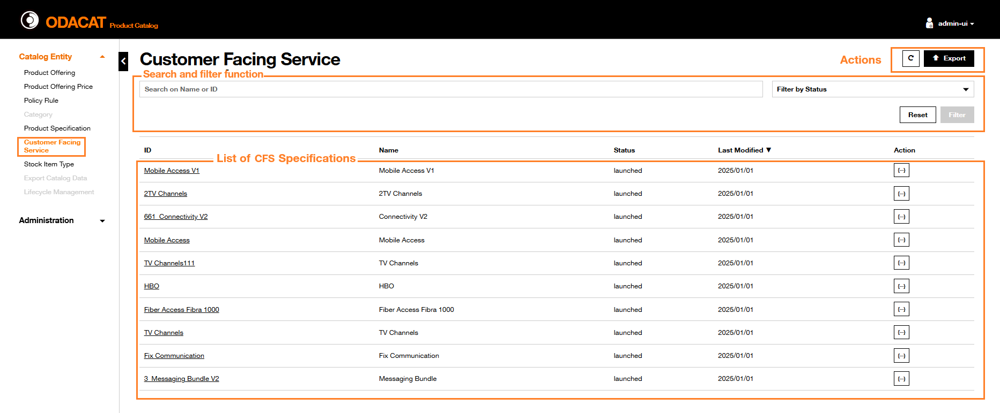

# CFS Specification

## Dashboard

In the ODACAT Product Catalog User Interface, you can access to **Customer Facing Service Specification Dashboard** by selecting the **Customer Facing Service** from the "Catalog Entity" panel. It includes:  
- a set of Action buttons:   
   +  button to refresh the display    
   +  button to generate an export file with the list of CFS Specifications    
- a [Search and filter function](../cfs-specification/#search-and-filter-function) related area, you can use to filter the list of CFS Specifications.     
- a list of CFS Specification(s)    

   

### Information Displayed

The list of CFS Specifications displays all of, or a subset of, the CFS Specifications defined in the Product Catalog. Some of the CFS Specifications properties are displayed in a table view:

  | Column               | Description                                                                                                                      |
  | :------------------- | :------------------------------------------------------------------------------------------------------------------------------- |
  | `ID`                 | The identifier of the CFS Specification                                                                                          |
  | `Name`               | The name of the CFS Specification                                                                                                |
  | `Status`             | The status of the CFS Specification                                                                                              |
  | `Last Modified Date` | The date this CFS Specification was last modified                                                                                |
  | `Action`             | The  action can be used to get details on the CFS Specification selected *Json* format |

### Search and filter function

The **Search and filter function** of the **CFS Specification Dashboard** enables to retrieve the list of CFS Specification(s) based on a set of filter criteria:

- Identifier ID or Name
- Status: [active/launched] values

These filter criteria may be combined.

??? abstract "Search by ID"
     1. Enter the **CFS Specification ID** in the **Search on Name or ID** area  
     2. Click on **Filter** button  
     3. The result of the filtering is displayed: 
       - If the **CFS Specification ID** is already defined in the Product Catalog, then the list of CFS Specifications is refreshed and only the associated CFS Specification is displayed with its properties.  
       - Otherwise, If the **CFS Specification ID** is not defined in the Product Catalog, then the list of CFS Specifications is refreshed with no entry and a message `No data to display` is provided.   
     4. To return on the default list of CFS Specifications, click on the Reset button  on the top of the screen.   

??? abstract "Search by Name"
     **Full name entered**  
     1. Enter the complete **CFS Specification Name** in the **Search on Name or ID** area  
     2. Click on **Filter** button  
     3. The result of the filtering is displayed:  
        - If there is a CFS Specification already defined in the Product Catalog with this Name, then the list of CFS Specifications is refreshed and only the associated CFS Specification is displayed with its properties.  
        - Otherwise, if there is no CFS Specification with this Name in the Product Catalog, then the list of CFS Specifications is refreshed with no entry and a message `No data to display` is provided.  
     4. To return on the default list of CFS Specifications, click on the Reset button  on the top of the screen.     
     **Partial name entered**  
     1. Enter some characters of **CFS Specification Name** in the **Search on Name or ID** area  
     2. Click on **Filter** button  
     3. The result of the filtering is displayed:  
       - If there is one or several CFS Specification(s) already defined in the Product Catalog which Name includes the set of characters used for the Search, then the list of CFS Specifications is refreshed and only the associated CFS Specifications is (are) displayed with its (their) properties.  
       - Otherwise, if there is not any CFS Specification which name includes this set of characters, then the list of CFS Specifications is refreshed with no entry and a message `No data to display` is provided.  
     4. To return on the default list of CFS Specifications, click on the Reset button  on the top of the screen.  

??? abstract "Filter by Status"
    The **Filter by Status** criteria of the CFS Specification dashboard can be used to restrict the list of CFS Specifications to a specific status [active/launched].    
    **Filter by 'active' status**  
     1. Click on the **Filter by Status** dropdown button and select the `Active` value  
     2. Click on **Filter** button  
     3. Filtering result is displayed accordingly. Only the CFS Specification(s) in active status is (are) displayed  
     4. To return on the default list of CFS Specifications, click on the Reset button  on the top of the screen.     
    **Filter by 'launched' status**  
     1. Click on the **Filter by Status** dropdown button and select the `Launched` value  
     2. Click on **Filter** button  
     3. Filtering result is displayed accordingly. Only the CFS Specification(s) in launched status is (are) displayed  
     4. To return on the default list of CFS Specifications, click on the Reset button  on the top of the screen.  

## Get CFS Specification Details

ODACAT Product Catalog enables to retrieve details on **CFS Specification**.

1. Identify the **CFS Specification** that needs to be consulted. The **Search and filter function** can be used to retrieve this CFS Specification.  
2. The **Customer Facing Service Specification Details** page displayed includes below the tittle, the **Identifier** of the selected **CFS Specification**   
3. On the top right side of this page, an action  button to visualize the definition of the CFS Specification in *Json* format     
4. The **CFS Specification** is composed of five cards giving details on the **Identity Data**, the **Related Resource**, the **Characteristics**, the **Eligible Commercial Operation(s)** and the **Relationship to Stock Item Type(s)**  

Identity data

It provides:

  | Line                        | Description                                                                                                                                                     |
  | :-------------------------- | :-------------------------------------------------------------------------------------------------------------------------------------------------------------- |
  | `Name`                      | Name of the CFS Specification                                                                                                                                   |
  | `Description`               | Description of the CFS Specification                                                                                                                            |
  | `Status`                    | Status of the CFS Specification. The possible values can be launched or active |
  | `Validity Start Date & Time` |   |
  | `Validity End Data & Time`    |   |

Related Resource

It provides information about the factory which handles this CFS Specification:  

  | Column                  | Description                                                                                                  |
  | :---------------------- | :----------------------------------------------------------------------------------------------------------- |
  | `ID`                    | The identifier of the Related Resource                                                                       |
  | `Delivery Factory Name` | The name of the Delivery Factory that will process the Service Order based on the selected CFS Specification |
  | `Delivery Factory Link` | The link of the Delivery Factory that will process the Service Order based on the selected CFS Specification |
   
Characteristics

It details, in a table, the properties of the characteristics provided by this CFS Specification:  

  | Column                 | Description                                                                                 |
  | :--------------------- | :------------------------------------------------------------------------------------------ |
  | `ID`                   | The identifier of the CFS Specification Characteristic                                      |
  | `Name`                 | The name of the CFS Specification Characteristic                                            |
  | `Description`          | The description of the CFS Specification Characteristic                                     |
  | `Is Configurable`      | A Boolean [Yes/No] specifying whether this CFS Specification Characteristic is configurable |
  | `Is Unique`            | A Boolean [Yes/No] specifying whether this CFS Specification Characteristic is unique       |
  | `Is Extensible`        | A Boolean [Yes/No] specifying whether this CFS Specification Characteristic is extensible   |
  | `Characteristic value` |  button which displays in a modal window the possible value(s) of the CFS Specification Characteristic selected |

  The modal window details the **Characteristics Values** within a table with the following properties:

  | Column            | Description                                                                                                                     |
  | :---------------- | :------------------------------------------------------------------------------------------------------------------------------ |
  | `Value`           | The value of the CFS Specification Characteristic                                                                               |
  | `Unit of measure` | Unit of measure of the characteristic value, for instance Mb, hour, etc.                                                        |
  | `Is Default`      | Indicate if this value if the default one                                                                                       |
  | `Value From`      | In case the values can be defined as a range, this attribute will include the minimum value, otherwise 'N/A' value is displayed |
  | `Value To`        | In case the values can be defined as a range, this attribute will include the maximum value, otherwise 'N/A' value is displayed |
  | `Start Date Time` | Start & Date Time of the characteristic value                                                                                   |
  | `End Date Time`   | End Date & Time of the characteristic value                                                                                     |

Eligible Commercial Operation(s)

It provides the list of possible Commercial Operation(s) which can be used for this CFS Specification. This list is displayed in a table:

  | Column        | Description                                                                     |
  | :------------ | :------------------------------------------------------------------------------ |
  | `Name`        | The name of the Commercial Operation applicable to the CFS Specification        |
  | `Description` | The description of the Commercial Operation applicable to the CFS Specification |

!!! note "Commercial Operation at Product Specification level"  
    During the definition of a Product Specification based on this CFS Specification, it will be possible to use all or a subset of these CFS Specification Eligible Commercial Operation(s). 

Relationship to Stock Item Type

It provides the list of relation(s) the selected CFS Specification has with Stock Item Type. If any, the relationship(s) is(are) displayed in a table:

  | Column                 | Description                                                                                                                           |
  | :--------------------- | :------------------------------------------------------------------------------------------------------------------------------------ |
  | `Stock Item Type ID`   | The ID of the Stock Item Type which has a relationship with this CFS Specification                                                    |
  | `Stock Item Type Name` | The Name of the Stock Item Type which has a relationship with this CFS Specification                                                  |
  | `Valid For`            | Validity period of the Stock Item Type                                                                                                |  
  | `Relationship Type`    | Specifies the type of relationship between the CFS Specification selected and the Stock Item Type considered, for instance `reliesOn` |  
  | `Details`              |  action button which displays in a modal window the details of the Stock Item Type          |
