

# Policy Rule

This document describes how to use the ODACAT UI to configure a **Product Rule**. It includes:

- a **Policy Rule Dashboard** description introducing the **Information Displayed**, the list of **Actions** and how to use the [Search and filter function](../policy-rule/#search-and-filter-function),    
- a step by step description on how to:

    - [Create](../policy-rule/#create-policy-rule-pricing), [Get Details on](../policy-rule/#get-details-on-policy-rule-pricing) or [Modify](../policy-rule/#modify-a-policy-rule-pricing) a **Policy Rule Pricing**,    
    - [Create](../policy-rule/#create-policy-rule-discount), [Get Details on](../policy-rule/#get-details-on-policy-rule-discount) or [Modify](../policy-rule/#modify-a-policy-rule-discount) a **Policy Rule Discount**  
     
- some [Hands-on use cases](../policy-rule/#hands-on-cases) which provide a detailed descriptions on how to use the ODACAT UI for some concrete **Policy Rule** use cases configuration. 

## Dashboard

In the ODACAT Product Catalog Portal, you can access to **Policy Rule Dashboard** by selecting the **Policy Rule** from the "Catalog Entity" side panel. It includes: 

- a set of possible actions:   
  -  button to refresh the display  
  -  button to generate an export file with the list of Policy Rules   
  -  button to create a Policy Rule   
- a [Search and filter function](../policy-rule/#search-and-filter-function) related area, you can use to filter the list of Policy Rules.   
- a list of the Policy Rules.

### Information Displayed and Actions

The **Policy Rule dashboard** is then displayed.    

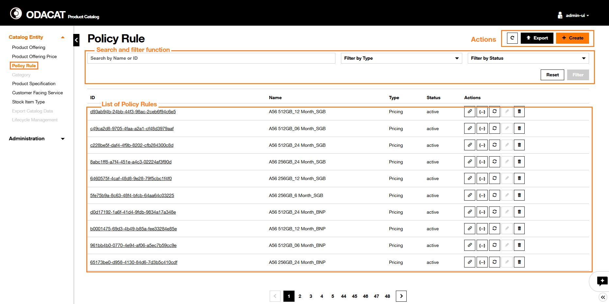{.img-zoomable}  
 
The list of Policy Rules includes all of, or a subset of, the Policy Rule(s) already defined in the Product Catalog. The properties of the Policy Rules displayed include:  

  | Column               | Description                                                                                                                 |
  | :------------------- | :-------------------------------------------------------------------------------------------------------------------------- |
  | `ID`                 | The identifier of the Policy Rule                                                                                           |
  | `Name`               | The name of the Policy Rule                                                                                                 |
  | `Type`               | The Policy Rule type can be [Pricing/Discount]                                                                              |
  | `Status`             | The status of the Policy Rule which value can be inTest active terminated |
  | `Action`             | Set of Policy Rule specific actions:    to get in a modal screen, the related Product Offering(s) that is(are) using the selected Policy Rule    to retrieve its definition    to change its lifecycle status    to edit it   to delete it  | 

### Search and filter function

The **Search and filter function** can be used to retrieve the list of Policy Rule(s), one or multiple, defined in the Product Catalog based on a set of filter criteria (ID, Name, Type and Status) which may be combined. 

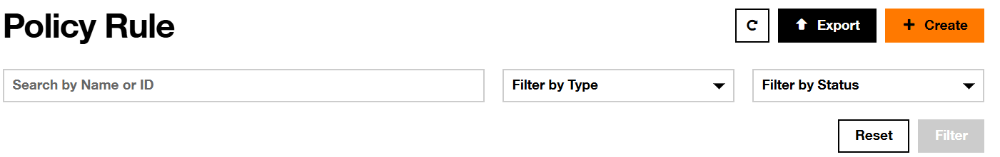 

??? abstract "Search by ID"
     1. Enter the **Policy Rule ID** in the **Search on Name or ID** area  
     2. Click on **Filter** button  
     3. The result of the filtering is displayed: 
       - If the **Policy Rule ID** is already defined in the Product Catalog, then the list of Policy Rules is refreshed and only the associated Policy Rule is displayed with its properties.  
       - Otherwise, If the **Policy Rule ID** is not defined in the Product Catalog, then the list of Policy Rules is refreshed with no entry and a message `No data to display` is provided.  
     4. To return on the default list of Policy Rules, click on the Reset button  on the top of the screen.   

??? abstract "Search by Name"
     **Full name entered**  
     1. Enter the complete **Policy Rule Name** in the **Search on Name or ID** area  
     2. Click on **Filter** button  
     3. The result of the filtering is displayed:  
        - If there is a Policy Rule already defined in the Product Catalog with this Name, then the list of Policy Rules is refreshed and only the associated Policy Rule is displayed with its properties.  
        - Otherwise, if there is no Policy Rule with this Name in the Product Catalog, then the list of Policy Rules is refreshed with no entry and a message `No data to display` is provided.  
     4. To return on the default list of Policy Rules, click on the Reset button  on the top of the screen.     
     **Partial name entered**  
     1. Enter some characters of **Policy Rule Name** in the **Search on Name or ID** area  
     2. Click on **Filter** button  
     3. The result of the filtering is displayed:  
       - If there is one or several Policy Rule(s) already defined in the Product Catalog which Name includes the set of characters used for the Search, then the list of Policy Rules is refreshed and only the associated Policy Rules is (are) displayed with its (their) properties.  
       - Otherwise, if there is not any Policy Rule which name includes this set of characters, then the list of Policy Rules is refreshed with no entry and a message `No data to display` is provided.  
     4. To return on the default list of Policy Rules, click on the Reset button  on the top of the screen.  

??? abstract "Filter by Type"  
     The **Filter by Type** criteria of the Policy Rule dashboard can be used to restrict the list of Policy Rules to:  
        - Pricing Policy Rule  
        - Discount Policy Rule      
    **Pricing Type**  
     1. Click on the **Filter by Type** dropdown button and select the `Pricing` value  
     2. Click on **Filter** button  
     3. The result of the filtering is displayed accordingly. Only the Pricing Policy Rule(s) is (are) displayed        
     4. To return on the default list of Policy Rules, clicks on the Reset button on the top of the screen.      
    **Discount Type**  
     1. Click on the **Filter by Type** dropdown button and select the `Discount` value  
     2. Click on **Filter** button  
     3. The result of the filtering is displayed accordingly. Only the Discount Policy Rule(s) is (are) displayed     
     4. To return on the default list of Policy Rules, clicks on the Reset button on the top of the screen.   

??? abstract "Filter by Status"
    The **Filter by Status** criteria of the Policy Rule dashboard can be used to restrict the list of PPolicy Rule s to a specific status inTest status or active or terminated.      
    **Filter by 'active' status**  
     1. Click on the **Filter by Status** dropdown button and select the `inTest` value  
     2. Click on **Filter** button  
     3. Filtering result is displayed accordingly. Only the Policy Rule(s) in inTest status is (are) displayed  
     4. To return back on the default list of Policy Rules, click on the Reset button  on the top of the screen.     
    **Filter by 'active' status**  
     1. Click on the **Filter by Status** dropdown button and select the `Active` value  
     2. Click on **Filter** button  
     3. Filtering result is displayed accordingly. Only the Policy Rule(s) in active status is (are) displayed  
     4. To return back on the default list of Policy Rules, click on the Reset button  on the top of the screen.     
    **Filter by 'launched' status**  
     1. Click on the **Filter by Status** dropdown button and select the `Terminated` value  
     2. Click on **Filter** button  
     3. Filtering result is displayed accordingly. Only the Policy Rule(s) in terminated status is (are) displayed  
     4. To return back on the default list of Policy Rules, click on the Reset button  on the top of the screen.  

## General information about Product Offering configuration

## Policy Rule Pricing

!!! success "ODACAT Product Catalog enables to create two types of  **Policy Rules**: **Pricing Policy Rule** and **Discount Policy Rule**."

### Create Policy Rule Pricing

!!! summary "Precondition"
    The Product Offering and its characteristics that will be used to support the event of the Policy Rule has been already created.

1. Click on the  on top right corner of the screen

   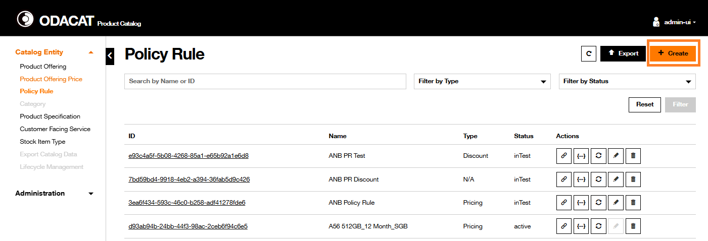{.img-zoomable}

2. A **Create Policy Rule** page is displayed in which you have first to specify the Policy Rule Type:  
   - Pricing
   - Discount
3. In this use case, choose the **Pricing** Policy Rule Type
4. **Provide Description** of the Policy Rule that is under creation: 
   - Enter the **Name** (mandatory)
   - Enter the **Description** (mandatory)
   - Optionally, you can enter the **Priority** of this Policy Rule

    Once completed, click on the Next button to continue the process flow

      > Example: Create a Policy Rule Pricing with the following properties
      >  **[Name] PR-example**
      >  [Event] When the *Samsung Galaxy A55* Product Offering is purchased (Add Operation)  
      >  [Condition] If the *Memory Size* of the 'Samsung Galaxy A55' is *256GB*  
      >  [Action] Then apply Product Offering Price Charge of *525 EUR*  
      >
      > 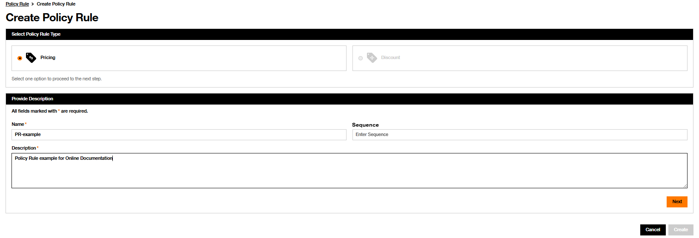{.img-zoomable}

5. Configure the characteristics of the **Policy Event** into the **Provide Event** section.  

   - You can **Create a New Event** by selecting the **Create Event** radio button. In this case, you should: 
     - Define the **Name** of the Event (mandatory)
     - Define the **Description** of the Event (mandatory)
     - Then, within the **Associate the Product Offering** are, select the **Product Offering** and specifiy the **Commercial Operations** applicable to this event. Note that Product Offering details can be retrieved thanks to the  icon  
  
      Once completed, click on the Next button to continue the process flow.

      > Example:
      >  [Event] When the *Samsung Galaxy A55* Product Offering is purchased (Add Operation) 
      >
      > 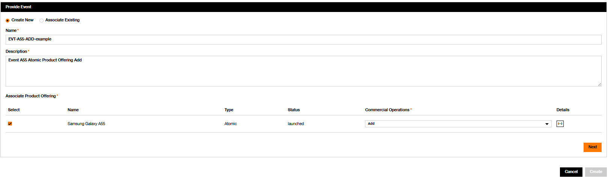{.img-zoomable}

   - Alternatively, you can reuse an existing Event by activating the **Associate Existing** radio button and selecting one of the events displayed in the table. Note that you can get **Event** details thanks to the  icon 

   Once completed, click on the Next button  to continue the process flow.

6. Configure the characteristics of the **Policy Condition** into the **Provide Condition** section. You will have to:       
   - Define the **Name** of the Condition (mandatory)  
   - Define the **Description** of the Condition (mandatory)  
   - Setup the **Condition Statement(s)**  
       - Click on the 'Add a New Row' button  
       - Select a **Product Offering**, a **Condition Entity**, a **Condition Value** and a **Condition Variable Value**  
        Once completed, click on the **Save** Action  

       Once completed, click on the Next button to continue the process flow.  

      > Example:
      >  [Condition] If the *Memory Size* of the 'Samsung Galaxy A55' is *256GB*  
      >
      >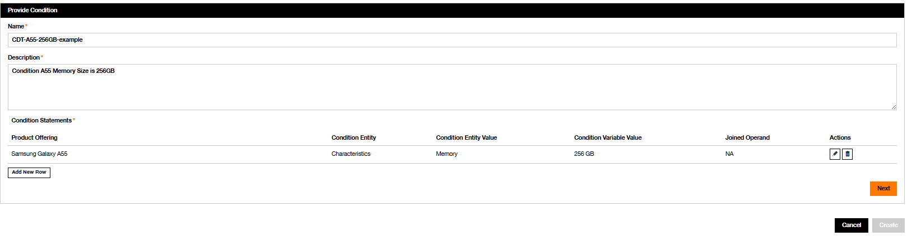{.img-zoomable}

    !!! info "Combination of conditions"  
          The solution supports combination of conditions. To do that, click on **Add New Row** button and defines the **Joined Operand** between the different actions.  

7. Configure the characteristics of the **Policy Action** into the **Provide Action** section. 
   - You can get details on the Product Offering Price by clicking on the  icon  
   - You can select, with the checkbox, the Product Offering Price to be associated with the Policy Rule.
  
      Once completed, click on the **Validate** orange button to complete the **Policy Rule Action** setup.

      > Example:
      >  [Action] Then apply Product Offering Price Charge of *525 EUR*  
      >
      >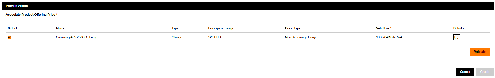{.img-zoomable}

 Once completed, click on the Create button to complete the process Policy Rule Pricing Creation.

> Example:
>
> 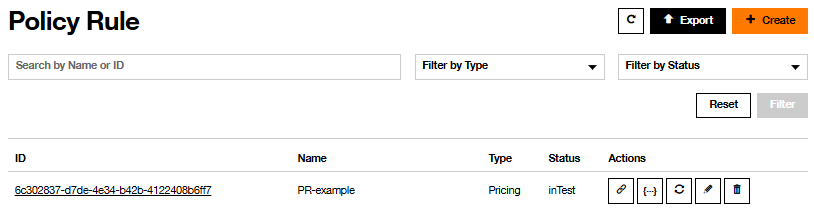 {.img-zoomable}

!!! success "Result" 
    A message is displayed to confirm the successfull creation of the Policy Rule  
     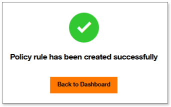  
    The Policy Rule Dashboard is displayed and includes the **Policy Rule Pricing** which has been created. Its **state** is inTest  

### Get Details on Policy Rule Pricing

ODACAT Product Catalog enables to get details on a specific **Policy Rule**.

1. Identify the **Policy Rule** that needs to be consulted. The **Search and filter function** can be used to retrieve this Policy Rule.  
2. A **Policy Rule Details** page is then displayed with the **Identifier** of the Policy Rule below the title of the page.  
3. On the top right side of this page, some action buttons are displayed:
   - 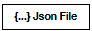 button to visualize the definition of the the Policy Rule in *Json* format  
   -  button to change the status according the [Policy Rule lifecyle](../../../architecture/overall-architecture/#policy-rule-lifecycle/)  
   - 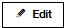 button to update the the Policy Rule. Please refer to the associated paragraph for more details   

4. The **Policy Rule Details** included three four sections:
   - the **Identity Data** details 
   - the **Event** details
   - the **Condition** details
   - the **Action** details

5. The **Identity data** card of the selected Policy Rule includes:
   - the **Type**: it has a 'Pricing' value
   - the **Name**
   - the **Description**
   - the **Status** which value can be either inTest, active or terminated
   - the **Priority**
   - the **Validity End Date & Time**
    
6. The **Event** card of the Policy Rule includes:
   - the **ID**
   - the **Name**
   - the **Description**
   - the **Product Offering** and the **Commercial Operation** which characterise this event
   - the **Details**   can be used  to visualize the definition of the Product Offering.
7. The **Condition** card of the Policy Rule includes:
   - the **ID**
   - the **Name**
   - the **Description**
   - the list of **Condition Entity**, **Condition Entity Variable** and **Condition Entity Value** that specifies the Condition 
   - the **Details**   can be used to visualize the definition of the Product Offering.
        
8. The **Action** card of the Policy Rule includes:
   - the **ID**
   - the **Name**
   - the **Price**
   - the **Type**
   - the **Valid For**
   - the  **Details** icon to visualize the definition of the Product Offering Price Charge.
   
9. The **Related Product Offering** card of the Policy Rule includes:
   - the **ID**
   - the **Name**
   - the **Status**
   - the **Type**
   of the Product Offering that has this Policy Rule associated. 
   
   This association between Policy Rule and Product Offering Has to be configured from the Product Offering entity.

> Example: Policy Rule Pricing 'PR-example' Details
>
>   - [Event] When the **Samsung Galaxy A55** Product Offering is purchased (Add Operation)  
>   - [Condition] If the **Memory Size** of the 'Samsung Galaxy A55' is 256GB  
>   - [Action] Then apply Product Offering Price Charge of 525 EUR  
>
> 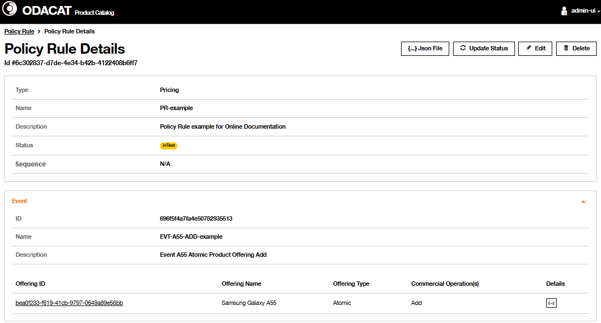
>
> 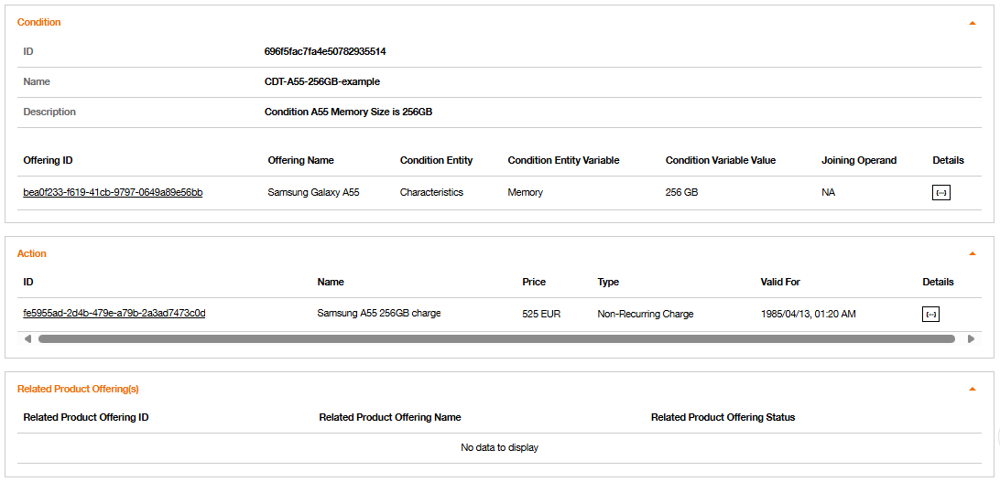

### Modify a Policy Rule Pricing

ODACAT Product Catalog enables to modify a **Policy Rule Pricing**.

??? warning "Update of entity Name and entity Description"
    Any update of Name and Description to empty value will be rejected and an error message will be displayed.  

- A **Policy Rule Pricing** registered in the Product Catalog in **inTest** status may be updated on:
   - some of its **identity data**: **Name**, **Priority** and **Description**; Click on Update button to save the change  
   - the **Event** definition: associate another event; Then click on **Update** button to save the change  
   - the **Condition** definition: add new criteria, update the value of the criteria, etc.; Then click on Update button to save the change  
   - the **Action** definition: change the **Product Offering Price Charge** to be used  
   
    Then click on **Update** button to save the change

    Once completed, click on the **Save changes** orange button to complete the Policy Rule Modification process  

!!! success "Result" 
    The message 'Policy Rule has been modified successfully". Click on Back to Dashboard.

## Policy Rule Discount

### Create Policy Rule Discount

???+ summary "Precondition"
    The Product Offering and its characteristics that will be used to support the event of the Policy Rule Discount has been already created.

1. Click on the  on top right corner of the screen

   

2. A **Create Policy Rule** page is displayed in which you have first to specify the Policy Rule Type:  
   - Pricing
   - Discount
3. In this use case, choose the **Discount** Policy Rule Type
4. **Provide Description** of the Policy Rule that is under creation: 
   - Enter the **Name** (mandatory)
   - Enter the **Description** (mandatory)
   - Optionally, you can enter the **Priority** of this Policy Rule

    Once completed, click on the Next button  to continue the process flow

5. Configure the characteristics of the **Policy Event** into the **Provide Event**. You can:  
   - Create a New Event by selecting the **Create Event** radio button. In this case, you need to:  
     - Define the **Name** of the Event (mandatory) 
     - Define the **Description** of the Event (mandatory)  
     - Select the **Product Offering** and corresponding **Commercial Operations** which characterize this event into the **Associate the Product Offering** section. Note that you can get details about any Product Offerings thanks to the  icon.  
  
     Once completed, click on the Next button  to continue the process flow.

   - Or select an existing Event by selecting the **Associate Existing** radio button and selecting one of the events displayed in the table.
     - it is possible to get Event details thanks to the  icon 

   Once completed, click on the Next button  to continue the process flow.

6. Configure the characteristics of the **Policy Condition** into the **Provide Condition** section. You will have to:  

   - Define the **Name** of the Condition (mandatory)  
   - Define the **Description** of the Condition (mandatory)  
   - Setup the **Condition Statement(s)**  
        - First, you need to 'Add a New Row'  
        - Then, select **Product Offering**, **Condition Entity**, **Condition Value** and **Condition Variable Value**  
        Once complete click on the **Save** Action  

!!! info "Combination of conditions"  
    The solution supports combination of conditions. To do that, click on **Add New Row** button and defines the **Joined Operand** between the different actions.  

   Once completed, click on the Next button  to continue the process flow.

7. Configure the characteristics of the **Policy Action** into the **Provide Action** section.  
   - You have to select (checkbox), from the list of **Product Offering Price Charges** displayed, the **Product Offering Price Charge** to be associated with the Policy Rule. Details about the **Product Offering Price Charge** can be retrieved by clicking on the  icon
   - Then, you have to select in the dropdown menu whether this **Product Offering Price** will be **altered by** or **replaced by** the Alteration that will be selected in Next Step. 
   - At the end, you have to select the Alteration that applies on the Product Offering Price Charge when the Event and the Condition statements are met. You can get details on the **Product Offering Price Alteration** by clicking on the  icon.

   Once completed, click on the **Validate** orange button to complete the **Policy Rule Action** setup.

 Once completed, click on the Create button to complete the Policy Rule Discount Creation process.

!!! success "Result" 
    A message is displayed to confirm the successfull creation of the Policy Rule  
       
    The Policy Rule Dashboard is displayed and includes the **Policy Rule Discount** which has been created. Its **state** is **inTest**  

### Get Details on Policy Rule Discount

1. Identify the **Policy Rule (PR)** that needs to be consulted. The **Search and filter function**  can be used to retrieve this Policy Rule  
2. A **Policy Rule Details** page is then displayed with the **Identifier of the Policy Rule** below the title  
3. On the top right side of this page, some action buttons are displayed:
   -  button to visualize the definition of the the Policy Rule in *Json* format  
   -  button to change the status according the [Policy Rule lifecyle](../../../architecture/overall-architecture/#policy-rule-lifecycle/)  
   -  button to update the the Policy Rule. Please refer to the associated paragraph for more details   

4. The **Policy Rule Details** included three four sections:
   - the **Identity Data** details 
   - the **Event** details
   - the **Condition** details
   - the **Action** details

5. The **Identity data** card of the selected Policy Rule includes:
   - the **Type**: it has a 'Discount' value
   - the **Name**
   - the **Description**
   - the **Status** which value can be either inTest, active or terminated
   - the **Priority**
   - the **Validity End Date & Time**
    
6. The **Event** card of the Policy Rule includes:
   - the **ID**
   - the **Name**
   - the **Description**
   - the **Product Offering** and the **Commercial Operation** which characterise this event
   - the **Details**  to visualize the definition of the Product Offering.
7. The **Condition** card of the Policy Rule includes:
   - the **ID**
   - the **Name**
   - the **Description**
   - the list of **Condition Entity**, **Condition Entity Variable** and **Condition Entity Value** that specifies the Condition 
   - the **Details**  icon can be used to visualize the definition of the Product Offering.
        
8. The **Action** card of the Policy Rule includes:
   - the **ID**
   - the **Name**
   - the **Price**
   - the **Type**
   - the **Valid For**
   - the  **Details** icon to visualize the definition of the Product Offering Price Charge in Json format.
   - the **type of alteration** applied (Altered By or Replace By) 
   - the **Product Offering Price Alteration** that applies. The **Details**  icon can be used to retrieve the definition of the Product Offering Price Alteration.
   
9. The **Related Product Offering** card of the Policy Rule includes information about the Product Offering for which this Policy Rule has been associated:
   - the **ID** of the Related Product Offering
   - the **Name** of the Related Product Offering
   - the **Status** of the Related Product Offering (inTest,active, launched)

### Modify a Policy Rule Discount

ODACAT Product Catalog enables to modify a **Policy Rule Discount** .

??? warning "Update of entity Name and entity Description"
    Any update of Name and Description to empty value will be rejected and an error message will be displayed.  

- A **Policy Rule Discounting** registered in the Product Catalog in inTest status may be updated on:
   - some of its **identity data**: **Name**, **Priority** and **Description**; Click on **Update** button to save the change  
   - the **Event** definition: associate another event; Then click on **Update** button to save the change  
   - the **Condition** definition: add new condition, update the value of the criteria, etc.; Then click on **Update** button to save the change  
   - the **Action** definition: various type of modifications can be done:  
       - Change the reference of the targeted **Product Offering Price Charge**   
       - Switch the **Alteration Type** value, for instance move from `Altered by` to `Replaced by`  
       - Change the reference of **Product Offering Price Alteration**  
      Then click on **Update** button to save the change  
    
    Once completed, click on the **Save changes** orange button to complete the Policy Rule Modification process  

!!! success "Result" 
    The message "Policy Rule has been modified successfully". Click on **Back to Dashboard**.  

## Change the lifecycle status

Product Catalog enables to change the status of Product Rule according [Product Rule lifecyle](../../../architecture/overall-architecture/#policy-rule-lifecycle/) section of the [Overall Architecture](../../../architecture/overall-architecture/).

A Policy Rule being created has a inTest status.

ODACAT Product Catalog enables to change the status of a Policy Rule:  
- from inTest status to active status  
- or from inTest status to terminated status  
- or from active status to terminated status  

A change of the status of a Policy Rule defined in the Product Catalog can be performed:

- Either from the **Policy Rule dashboard**, by using the  **Lifecycle change** icon in the **Actions** column associated to the Policy Rule to be modified.

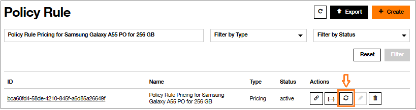

- Or from the **Policy Rule Details** page, by clicking on the  **Update Status** button.

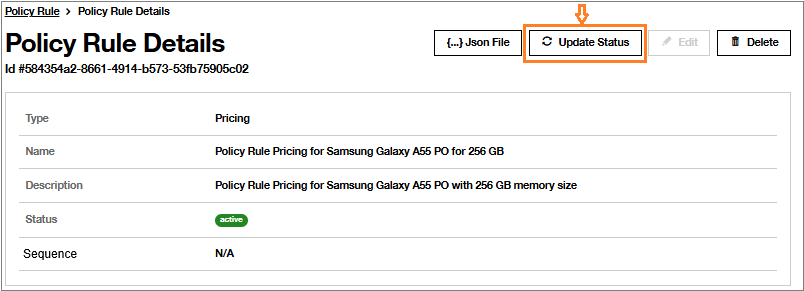

## Hands-on cases

This section describes all steps in details to guide you to configure the solution for specific cases. The Hands-on use cases describe various Policy Rule configurations:

| Index  | Hands-on Use Case Name                                                                                                                     | 
| :----: | :----------------------------------------------------------------------------------------------------------------------------------------- |   
| 1      |  Product Offering price influenced by Stock Item related Product Characteristic value |   
| 2      |  Product Offering price influenced by CFS Spec related Product Characteristic              |   
| 3      |  Discount based on the value of the Product Offering Characteristic              |   
| 4      |  Cross Discount                                                                  |   

These hands-on cover multiple concrete Business needs presented in the table below:

| Type | Business need | Hands-on Use Case Name | Hands-on Use Case Index | 
| -------- | -------- | -------- | -------- |   
|   | Device with a 256GB memory size (resp. 512GB) costs 525€ (respectively 600€) | [PR Pricing with STK Characteristic](../policy-rule/#1-product-offering-price-influenced-by-stock-item-related-product-characteristic-value) | 1 |  
|  | Add-on HBO with a HBO profile (resp. HBO Max) will have monthly cost of 6€/month (respectively 12€/month) tax included| [Product Offering price influenced by CFS Spec related Product Characteristic](../policy-rule/#2-product-offering-price-influenced-by-cfs-spec-related-product-characteristic-value) | 2 |  
| | Premium package of Software License PO costs 15€/month. The Basic Package has a 10% Discount compared to the Premium one (e.g. cost of 13.5€ month) | [PR Discounting](../policy-rule/#3-discount-based-on-the-value-of-the-product-offering-characteristic) | 3 |     
| | --- | [PR Discounting](../policy-rule/#4-cross-discount) | 4 |     

Entities represented in the offers modelling included in this section will be aligned with the following representation aligned with TM Forum SID:

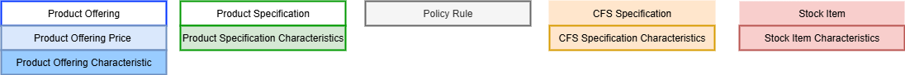

### 1. Product Offering price influenced by Stock Item related Product Characteristic value

!!! abstract "Marketing Requirement"
    During the ordering of the 'Samsung Galaxy A55' Product Offering for instance in Selfcare Portal, the Customer can choose a 256GB or a 512GB memory size device. The price of the device depends on the size of its memory. Device with a 256GB memory size (resp. 512GB) costs 525€ (respectively 600€).

!!! info "Associated Catalog Configuration"

    According TM Forum modelling principles, the offer modelling applicable to this use case is the following one
    
    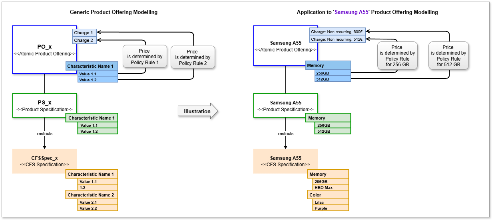{.img-zoomable}
    
    The table below presents the Catalog entities required:

    | Entity Name | Entity Type | Reference |  Description |
    | -------- | -------- |-------- |-------- |    
    | Samsung Galaxy A55 | Stock Item Type | Received by ODACAT from Stock Item Management system | Includes a STK Characteristic named `Memory` with two possible values [256GB/512GB] |   
    | Samsung Galaxy A55 | Product Specification | ODACAT | Includes a Product Specification Characteristic (Configurable) named `Memory` with two possible configurable values [256GB/512GB] inherited from the Stock Item Type |
    | Samsung Galaxy A55 |Product Offering | ODACAT | Uses the Configurable Product Specification Characteristic named `Memory` with two possible configurable values [256GB/512GB] defined in the PS |
    | Samsung A55 256GB charge | Product Offering Price | ODACAT | NRC 525€ with Immediate Payment |
    | Samsung A55 512GB charge | Product Offering Price | ODACAT | NRC 600€ with Immediate Payment |
    | ==Policy Rule Pricing for Samsung Galaxy A55 PO for 256 GB== | Policy Rule Pricing | ODACAT | **WHEN** Samsung Galaxy A55 PO is added **IF** `Memory` == `256` **THEN** Price is `Samsung A55 256GB charge` |
    | ==Policy Rule Pricing for Samsung Galaxy A55 PO for 512 GB== | Policy Rule Pricing | ODACAT | **WHEN** Samsung Galaxy A55 PO is added **IF** `Memory` == `512` **THEN** Price is `Samsung A55 512GB charge` |

    Note: the entities highlighted in yellow are the policy rules to be created.

!!! training "Main configuration steps"

    The configuration of this use case requires mainly four sub-processes:  

    1. Create a Policy Rule Pricing named `Policy Rule Pricing for Samsung Galaxy A55 PO for 256 GB`  
    2. Create a Policy Rule Pricing named `Policy Rule Pricing for Samsung Galaxy A55 PO for 512 GB`  
    3. Change the Policy Rules status to active  
    4. Modify Product Offering to associate Policy Rule 

??? info "Preconditions"
    - The `Samsung A55` Stock Item Type has been uploaded in the Product Catalog,  
    - The Product Specification (PS) `Samsung A55` has been created based on `Samsung A55` Stock Item Type,  
    - The Product Offering Price Charge (POPC) `Samsung A55 256GB charge` has been created,  
        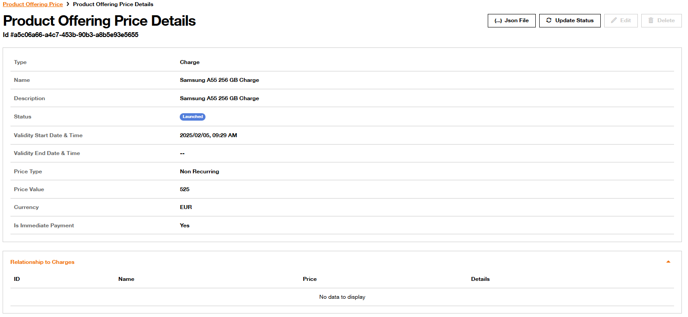{.img-zoomable}     
    - The Product Offering Price Charge (POPC) `Samsung A55 512GB charge` has been created,  
    - The Product Offering (PO) `Samsung A55` has been created based on `Samsung A55` PS.  

??? Quote "Create a Policy Rule Pricing named `Policy Rule Pricing for Samsung Galaxy A55 PO for 256 GB`" 

    ???+ note "'Provide Description' card"

        | Name                                                     |Description                                                            | 
        | -------------------------------------------------------- | --------------------------------------------------------------------- |   
        | Policy Rule Pricing for Samsung Galaxy A55 PO for 256 GB | Policy Rule Pricing for Samsung Galaxy A55 PO with 256 GB memory size | 

        Then, click on Next button 

    ???+ note "'Provide Event' card"

        | Name                | Description                  | Associate Product Offering - Name | Associate Product Offering - Commercial Operation | 
        | ------------------- | ---------------------------- |---------------------------------- |-------------------------------------------------- |   
        | EVT-Add-Samsung A55 | Event Add the Samsung A55 PO | Samsung A55                       | add                                               | 

         Then, click on Next button   

    ???+ note "'Provide Condition' card"

        | Name           | Description                      |
        | -------------- | -------------------------------- |
        | CDT-Memory-256 | Condition: Memory value is 256GB | 

        Statements

        | Product Offering | Entity          | Entity Value | Variable Value | Joined Operand |  
        | ---------------- | --------------- |------------- |--------------- | -------------- |   
        | Samsung A55      | Characteristics | Memory       | 256GB          |  NA            | 

        {.img-zoomable}

        **Save** the Condition Statement

        Then, click on Next button 

    ???+ note "'Provide Action' card"

        Select the Product Offering Price: `Samsung A55 256GB charge` 

        {.img-zoomable}
  
        Then, click on **Validate** button

    Then, click on the Create button.
  
    A message 'Policy Rule has been created successfully' is displayed.

    !!! success "Result"

        The Policy Rule `Policy Rule Pricing for Samsung Galaxy A55 PO for 256 GB` has been created.  

        ??? example "Illustration in the Policy Rule Dashboard"

            The Policy Rule `Policy Rule Pricing for Samsung Galaxy A55 PO for 256 GB` has been created and is displayed in the Policy Rule Dashboard with a inTest status. 

            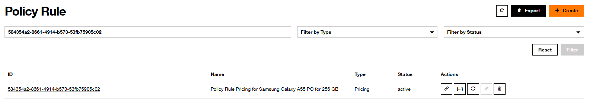{.img-zoomable} 

        ??? example "Illustration of the Policy Rule Details" 

            It is also possible to visualize the Policy Rule created:

            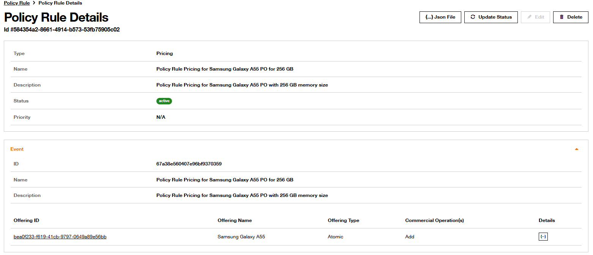{.img-zoomable}

            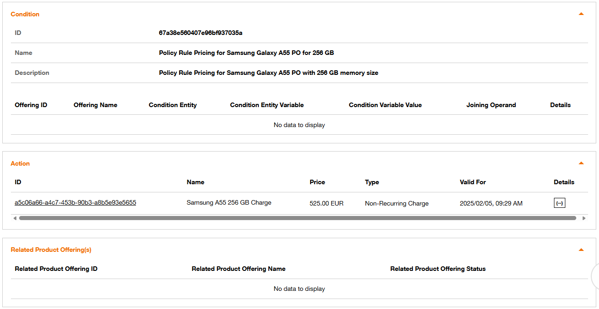{.img-zoomable}

??? Quote "Create a Policy Rule Pricing named `Policy Rule Pricing for Samsung Galaxy A55 PO for 512 GB`" 

    ???+ note "'Provide Description' card"
         | Name                                                     |Description                                                            | 
         | -------------------------------------------------------- | --------------------------------------------------------------------- |   
         | Policy Rule Pricing for Samsung Galaxy A55 PO for 512 GB | Policy Rule Pricing for Samsung Galaxy A55 PO with 512 GB memory size | 

     Then, click on Next button 

    ???+ note "'Provide Event' card"

         | Name                |Description                   | Associate Product Offering - Name | Associate Product Offering - Commercial Operation |
         | ------------------- | -----------------------------|---------------------------------- |-------------------------------------------------- |    
         | EVT-Add-Samsung A55 | Event Add the Samsung A55 PO | Samsung A55                       | add                                               | 

     Then, click on Next button 

    ???+ note "'Provide Condition' card"

         | Name           | Description                      |
         | -------------- | -------------------------------- |
         | CDT-Memory-512 | Condition: Memory value is 512GB | 

         Statements

         | Product Offering | Entity          | Entity Value | Variable Value | Joined Operand |  
         | ---------------- | --------------- |------------- |--------------- | -------------- |    
         | Samsung A55      | Characteristics | Memory       | 512GB          | NA             | 

         **Save** the Condition Statement

         Then, click on Next button 

    ???+ note "'Provide Action' card"

        Select the Product Offering Price: `Samsung A55 512GB charge` 
  
        Then, click on **Validate** button

    Then, click on Create button

    !!! success "Result"

        The Policy Rule `Policy Rule Pricing for Samsung Galaxy A55 PO for 512 GB` has been created and is displayed in the Policy Rule Dashboard with a inTest status.  

??? Quote "Change the Policy Rules status" 

    Change the Policy Rules status from inTest to active 

??? Quote "Modify Product Offering to associate Policy Rule" 

    Update the Product Offering(PO) named `Samsung A55 ` in order to associate these new Policy Rules `Policy Rule Pricing for Samsung Galaxy A55 PO for 256 GB` and `Policy Rule Pricing for Samsung Galaxy A55 PO for 512 GB` 

### 2. Product Offering price influenced by CFS Spec related Product characteristic value

!!! abstract "Marketing Requirement"
    During the ordering of the Add-on HBO Product Offering, the Customer can select the 'HBO' profile or the 'HBO Max' profile. The price of the HBO product depends on which profile has been choosen by the Customer during the Order Capture. Add-on HBO with a HBO profile (resp. HBO Max) will have monthly cost of 6€/month (respectively 12€/month) tax included.

!!! info "Associated Catalog Configuration"

    According TM Forum modelling principles, the offer modelling applicable to this use case is the following one

    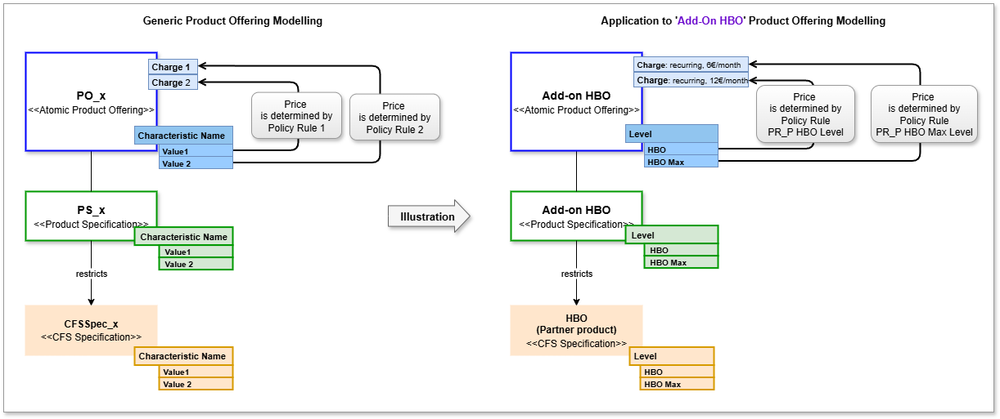{.img-zoomable}
    
    The table below presents the Catalog entities required:

    | Entity Name                         | Entity Type            | Reference              | Description |
    | ----------------------------------- | ---------------------- |----------------------- |------------------------------------------------------------------------------------------------- |    
    | HBO                                 | CFS Specification      | Service Catalog system | Includes a Service Characteristic named 'Level' with two possible values [HBO/HBO Max]           |   
    | Add-on HBO | Product Specification  | ODACAT                 | ODACAT                 | Includes a PS Characteristic (Configurable) named 'Level' with two possible values [HBO/HBO Max] inherited from the CFS Spec |
    | Add-on HBO |Product Offering        | ODACAT                 | ODACAT                 | Uses the Configurable PS Characteristic named 'Level' with two possible values [HBO/HBO Max] defined in the PS               |
    | Recurring Charge for HBO (standard) | Product Offering Price | ODACAT                 |  6 €/month                                                                                        |
    | Recurring Charge for HBO Max        | Product Offering Price | ODACAT                 | 12 €/month                                                                                        |
    | ==PR_P HBO Level==                  | Policy Rule Pricing    | ODACAT                 | **WHEN** Add-on HBO PO is added **IF** `level` == `HBO` **THEN** Price is 6€/month               |
    | ==PR_P HBO Max Level==              | Policy Rule Pricing    | ODACAT                 | **WHEN** Add-on HBO PO is added **IF** `level` == `HBO Max` **THEN** Price is 12€/month          |

    Note: the entities highlighted in yellow are the policy rules to be created.

!!! training "Main configuration steps"

    The configuration of this use case requires mainly four sub-processes:  

    1. Create a Policy Rule Pricing named `PR_P HBO Level`  
    2. Create a Policy Rule Pricing named `PR_P HBO Max Level`  
    3. Change the Policy Rules status to active  
    4. Modify Product Offering to associate Policy Rule 

??? info "Preconditions"

    - The `HBO` CFS Specification has been uploaded in the Product Catalog,  
    - The Product Specification (PS) `Add-on HBO` has been created based on `HBO` CFS Specification,  
    - The Product Offering Price Charge (POPC) `Recurring Charge for HBO (standard)` has been created,  
        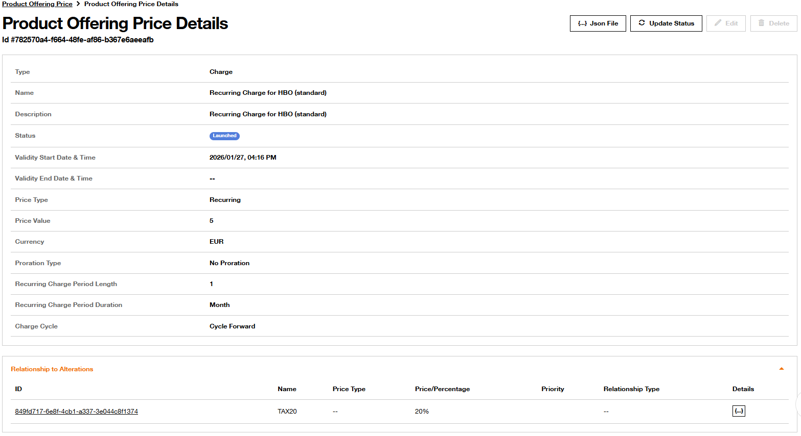{.img-zoomable}     
    - The Product Offering Price Charge (POPC) `Recurring Charge for HBO Max` has been created,  
    - The Product Offering (PO) `Add-on HBO` has been created based on `HBO` PS.  

??? Quote "Create a Policy Rule Pricing named `PR_P HBO Level`" 

    ???+ note "'Provide Description' card"

        | Name           |Description                           | 
        | -------------- | ------------------------------------ |   
        | PR_P HBO Level | Policy Rule Pricing for Level is HBO | 

        Then, click on Next button 

    ???+ note "'Provide Event' card"

        | Name             |Description                  | Associate Product Offering - Name | Associate Product Offering - Commercial Operation |
        | ---------------- | --------------------------- |---------------------------------- |-------------------------------------------------- |    
        | EVT-Add-AddonHBO | Event Add the HBO Add On PO | Add-on HBO                        | add                                               | 

        Then, click on Next button 

    ???+ note "'Provide Condition' card"

        | Name          | Description                         |
        | ------------- | ----------------------------------- |
        | CDT-Level HBO | Condition: HBO level value is 'HBO' | 

        Statements

        | Product Offering | Entity          | Entity Value | Variable Value | Joined Operand |  
        | ---------------- | --------------- |------------- |--------------- | -------------- |    
        | Add-on HBO       | Characteristics | Level        | HBO            |  NA            | 

        **Save** the Condition Statement

        Then, click on Next button 

    ???+ note "'Provide Action' card"

        Select the Product Offering Price: `Recurring Charge for HBO (standard)` 
  
        {.img-zoomable}
  
        Then, click on **Validate** button

    Then, click on Create button

    A message 'Policy Rule has been created successfully' is displayed.

    !!! success "Result"
        The Policy Rule `PR_P HBO Level` has been created.  

        ??? example "Illustration in the Policy Rule Dashboard"

            The Policy Rule `PR_P HBO Level` has been created and is displayed in the Policy Rule Dashboard with a inTest status.

            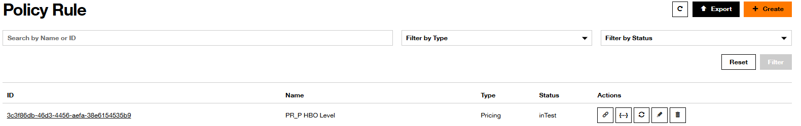{.img-zoomable} 

        ??? example "Illustration of the Policy Rule Details" 

            It is also possible to visualize the Policy Rule created:  

            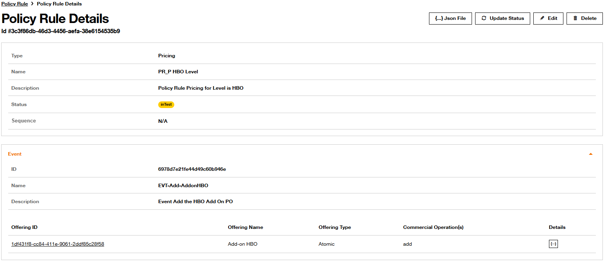{.img-zoomable}

            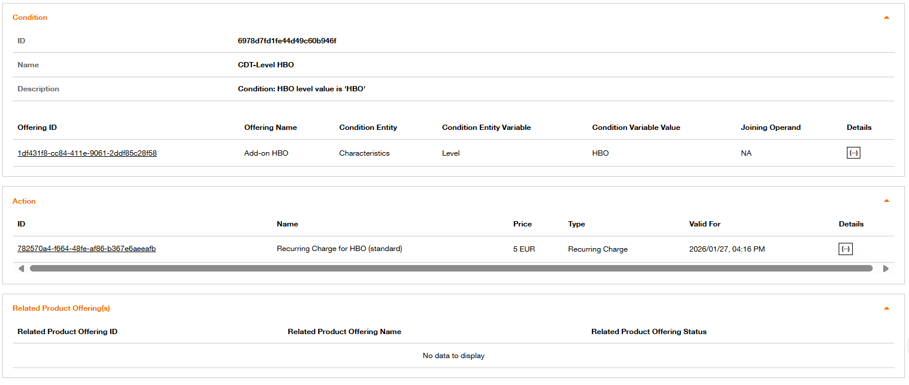{.img-zoomable}

??? Quote "Create a Policy Rule Pricing named `PR_P HBO Max Level`" 

    ???+ note "'Provide Description' card"

        | Name               | Description                              | 
        | ------------------ | ---------------------------------------- |   
        | PR_P HBO Max Level | Policy Rule Pricing for Level is HBO Max | 

        Then, click on Next button 

    ???+ note "'Provide Event' card"

        | Name             | Description                 | Associate Product Offering - Name |  Associate Product Offering - Commercial Operation |
        | ---------------- | --------------------------- |---------------------------------- |--------------------------------------------------- |    
        | EVT-Add-AddonHBO | Event Add the HBO Add On PO | Add-on HBO                        | add                                                | 

        Then, click on Next button 

    ???+ note "'Provide Condition' card"

        | Name          | Description                             |
        | ------------- | --------------------------------------- |
        | CDT-Level HBO | Condition: HBO level value is 'HBO Max' | 

        Statements

        | Product Offering | Entity          | Entity Value | Variable Value | Joined Operand |  
        | ---------------- | --------------- |------------- |--------------- | -------------- |    
        | Add-on HBO       | Characteristics | Level        | HBO Max        |  NA            | 

        **Save** the Condition Statement

        Then, click on Next button 

    ???+ note "'Provide Action' card"

     Select the Product Offering Price: `Recurring Charge for HBO Max` 
   
     Then, click on **Validate** button

    Then, click on Create button

    The Policy Rule `PR_P HBO Max Level` has been created and is displayed in the Policy Rule Dashboard with a inTest status.

??? Quote "Change the Policy Rules status" 

    Change the Policy Rules status from inTest to active 

??? Quote "Modify Product Offering to associate Policy Rule" 

    Update the Product Offering(PO) named `Add-on HBO` in order to associate these new Policy Rules `PR_P HBO Level` and `PR_P HBO Max Level`

### 3. Discount based on the value of the Product Offering Characteristic

!!! abstract "Marketing Requirement"
    During the ordering of the Software License Product Offering, the Customer can select a license for 'Premium' package or fort 'Basic' package. The price of the Software product depends on which package has been choosen by the Customer during the Order Capture. Premium  package of Software License PO costs 15€/month. The Basic Package has a 10% Discount compared to the Premium one (e.g. cost of 13.5€ month)

!!! info "Associated Catalog Configuration"

    According TM Forum modelling principles, the offer modelling applicable to this use case is the following one
    
    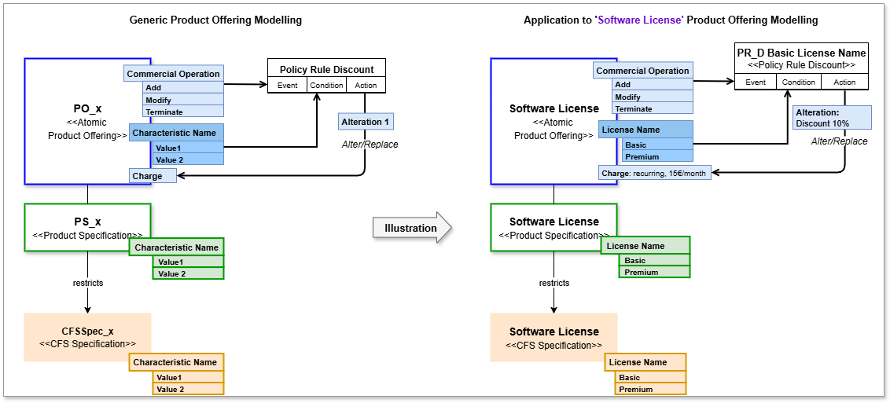{.img-zoomable}
    
    The table below presents the Catalog entities required:

    | Entity Name      | Entity Type           | Reference                                                                             | Description                                                       |
    | -----------------| --------------------- |----------------------------------------------- |--------------------------------------------------------------------------------------------------------- |    
    | Software Licence | CFS Specification     | Received by ODACAT from Service Catalog system | Includes a Service Characteristic named 'License Name' includes possible values [Premium/Basic]          |   
    | Software Licence | Product Specification | ODACAT                                         | Includes a PS Characteristic (Configurable) named 'License Name' with at least two possible values [Premium/Basic] inherited from the CFS Spec |
    | Software Licence | Product Offering      | ODACAT | Uses the Configurable Product Specification Characteristic named 'License Name' with at least two possible values [Premium/Basic] defined in the PS              |
    | Monthly Fee Software License | Product Offering Price | ODACAT | 15 €/month |
    | ==PR_D Basic Lience Name== | Policy Rule Discount | ODACAT | **WHEN** Software Licence is added  **IF** `License Name` == `Basic` **THEN** the Price 15€/month is **Altered By** a '10% Discount'|

    Note: the entities highlighted in yellow are the policy rules to be created.

!!! training "Main configuration steps"

    The configuration of this use case requires mainly three sub-processes:  

    1. Create a Policy Rule Discount named `PR_D Basic License Name`  
    2. Change the Policy Rules status to active  
    3. Modify Product Offering to associate Policy Rule 
  

??? info "Preconditions"
    - The `Software License` CFS Specification has been updloaded in the Product Catalog,  
    - The Product Specification (PS) `Software License` has been created based on `Software License` CFS Specification,  
    - The Product Offering Price Charge (POPC) `Monthly Fee Software License` has been created,  
        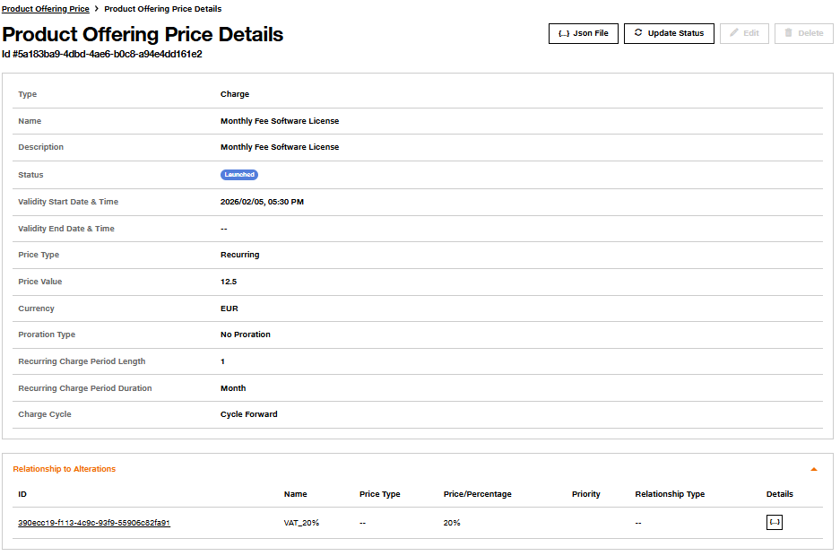{.img-zoomable}     
    - The Product Offering Price Alteration (POPA) `10% Discount` has been created,  
    - The Product Offering(PO) `Software License` has been created based on `Software License` PS.  

??? Quote "Create a Policy Rule Discount named `PR_D Basic License Name`" 

    ???+ note "'Provide Description' card"

        | Name |Description | 
        | -------- | -------- |   
        | PR_D Basic License Name | Policy Rule Discount when License Name is Basic  | 

        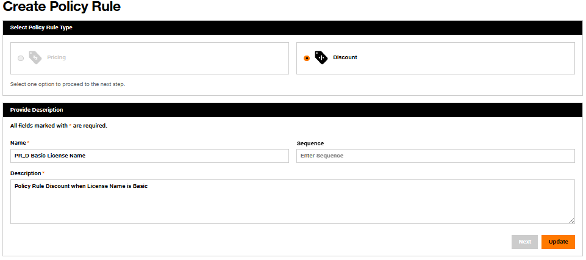{.img-zoomable}

        Then, click on Next button 

    ???+ note "'Provide Event' card"

        | Name                     |Description                          | Associate Product Offering - Name | Associate Product Offering - Commercial Operation |
        | ------------------------ | ----------------------------------- |---------------------------------- |-------------------------------------------------- |    
        | EVT-Add-Software License | Event Add the 'Software License' PO | Software License                  | add                                               | 

        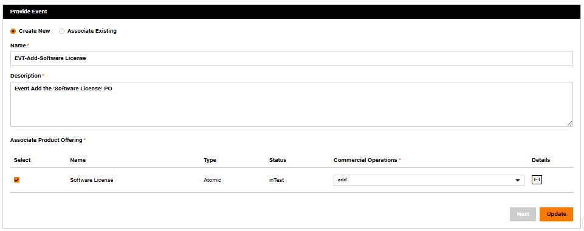{.img-zoomable}

        Then, click on Next button 

    ???+ note "'Provide Condition' card"

        | Name                   | Description                              |
        | ---------------------- | ---------------------------------------- |
        | CDT-License Name-Basic | Condition: License Name value is 'Basic' | 

        Statements

        | Product Offering |Entity           | Entity Value | Variable Value | Joined Operand |  
        | ---------------- | --------------- |------------- |--------------- | -------------- |    
        | Software License | Characteristics | License Name | Basic          |             NA | 

        **Save** the Condition Statement  

        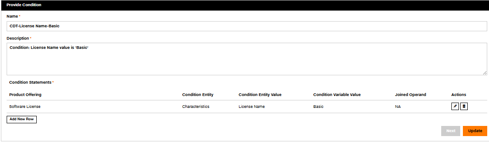{.img-zoomable}

        Then, click on Next button 

    ???+ note "'Provide Action' card"

        Select the Product Offering Price: `Monthly Fee Software License` 
        Select the Alteration type: Altered by
        Select the Alteration: 'Discount 10%'

        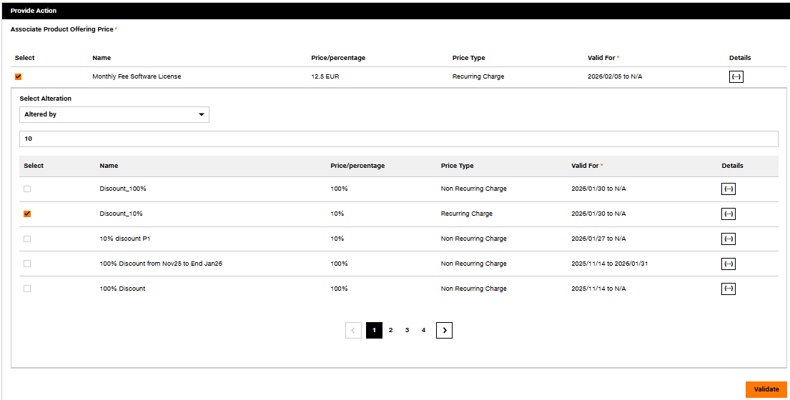{.img-zoomable}
  
        Then, click on **Validate** button

    Then, click on Create button

    A message 'Policy Rule has been created successfully' is displayed.

    !!! success "Result"

        The Policy Rule `PR_D Basic License Name` has been created.  

        ??? example "Illustration in the Policy Rule Dashboard"

            The Policy Rule `PR_D Basic License Name` has been created and is displayed in the Policy Rule Dashboard with a inTest status.

            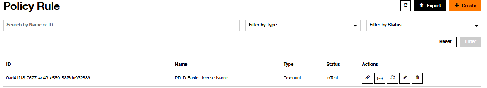{.img-zoomable} 

        ??? example "Illustration of the Policy Rule Details"

            It is also possible to visualize the Policy Rule created:  

            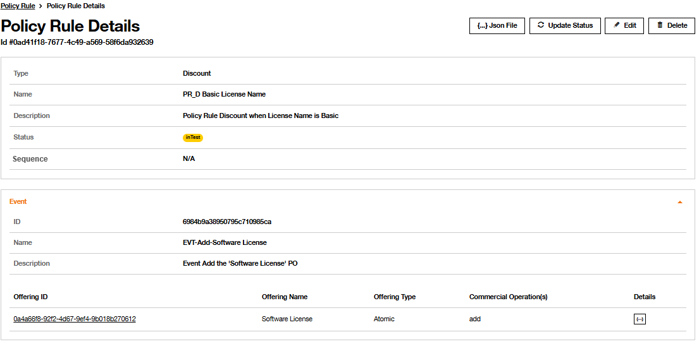{.img-zoomable}

            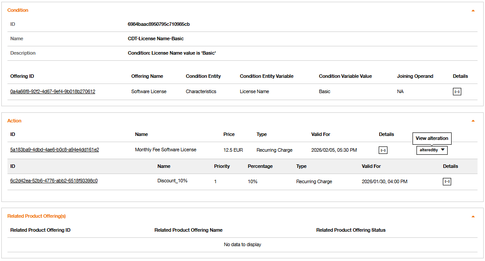{.img-zoomable}
  
??? Quote "Change the Policy Rules status" 

    Change the Policy Rules status from inTest to active 

??? Quote "Modify Product Offering to associate Policy Rule" 

    Update the Product Offering (PO) named `Software License` in order to associate the Policy Rule `PR_D Basic License Name` 

    ??? example "Policy Rule associated with Product Offering" 

        The Policy Rule is now associated with the `Software License` Product Offering
        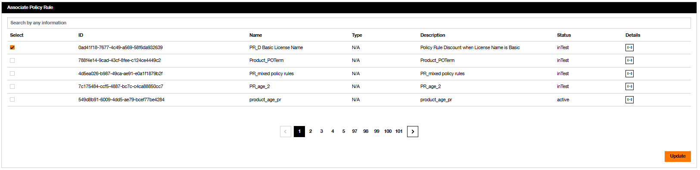{.img-zoomable} 
        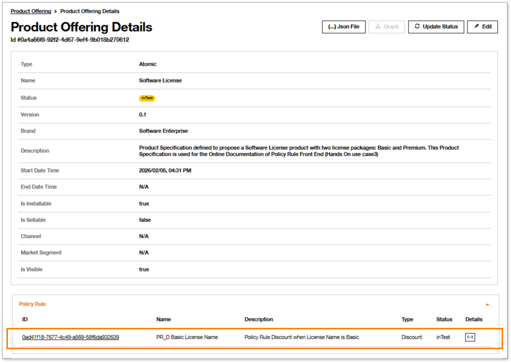{.img-zoomable}

    ??? example "Related Product Offering for Policy Rule" 

        After this association, the `Software License` appears as a Related Product Offering for this Policy Rule 
        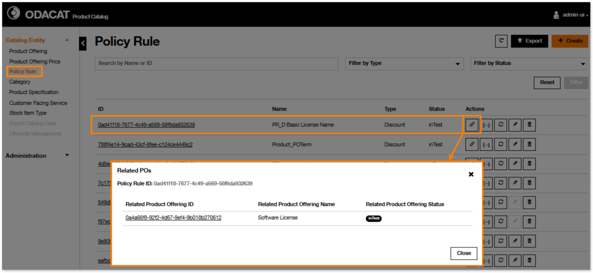{.img-zoomable}

### 4. Cross Discount

!!! abstract "Marketing Requirement"
    The price of the Internet Box Demo Product Offering is discounted 100% if it is subscribed within the FTTH Contract over the Selfcare Channel.

!!! info "Associated Catalog Configuration"

    According TM Forum modelling principles, the offer modelling applicable to this use case is the following one

    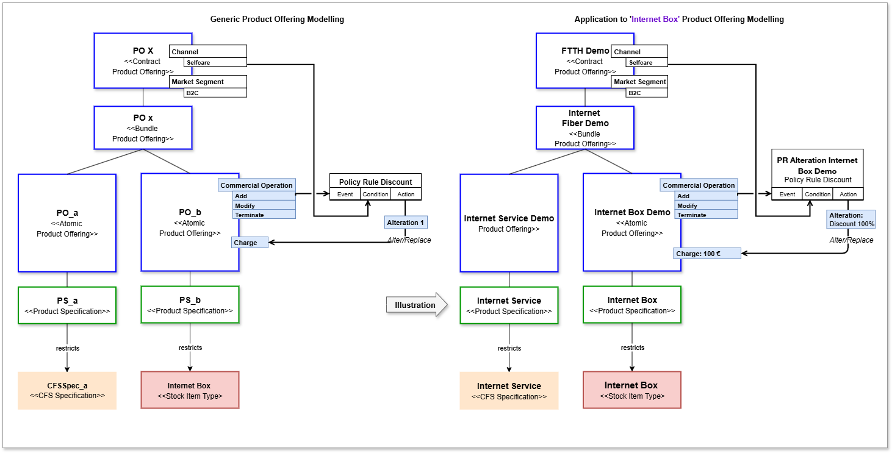{.img-zoomable} 
    
    The table below presents the Catalog entities required:

    | Entity Name                         | Entity Type                       | Reference | Description                   |
    | ------------------------------------| --------------------------------- |---------- |------------------------------ |    
    | Internet Box Demo                   | Atomic Product Offering           | ODACAT    |                               |
    | Internet Fiber Demo                 | Bundle Product Offering           | ODACAT    |                               |
    | FTTH Demo                           | Contract Offering                 | ODACAT    | Channel: Selfcare             |
    | NRC 100 Euro                        | Product Offering Price Charge     | ODACAT    | Non Recurring Charge 100 Euro |
    | 100% Discount                       | Product Offering Price Alteration | ODACAT    | Non Recurring Alteration 100% |
    | ==PR Alteration Internet Box Demo== | Policy Rule Discount              | ODACAT    | **WHEN** Internet Box is Added **IF** `FTTH Demo Contract` is ordered from `Channel` == `Selfcare` **THEN** the charge 100€ is **Altered By** a '100% Discount'|

    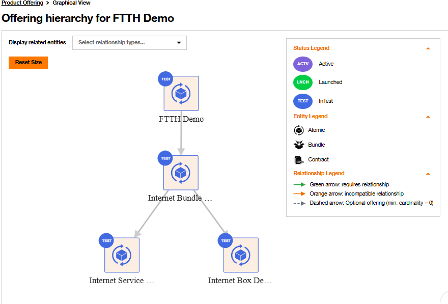{.img-zoomable}

    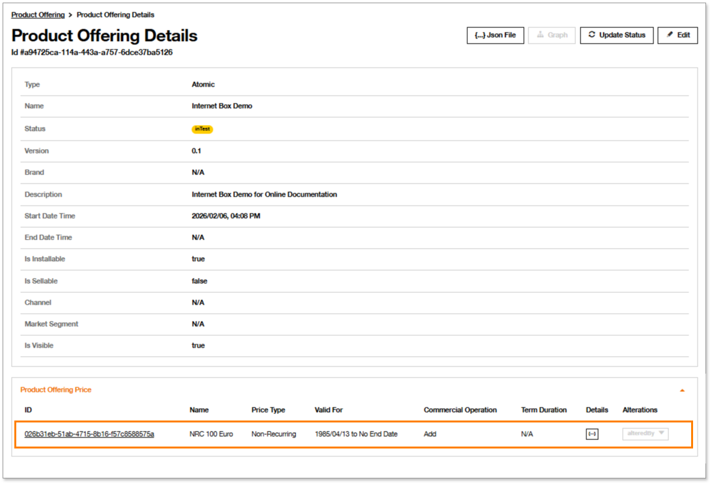{.img-zoomable}

    Note: the entities highlighted in yellow are the policy rules to be created.

!!! training "Main configuration steps"

    The configuration of this use case requires mainly three sub-processes:  

    1. Create a Policy Rule Discount named `PR Alteration Internet Box Demo`  
    2. Change the Policy Rules status to active  
    3. Modify Product Offering to associate Policy Rule 

??? info "Preconditions"
    - The `Internet Box` Stock Item Type has been updloaded in the Product Catalog,  
    - The Product Specification (PS) `Internet Box` has been created based on `Internet Box` Stock Item Type,  
    - The Product Offering Price Charge (POPC) `NRC 100 Euro` has been created,   
    - The Product Offering Price Alteration (POPA) `100% Discount` has been created,  
    - The Product Offering Atomic `Internet Box Demo` has been created based on `Internet Box` PS.  
    - The Product Offering Bundle `Internet Fiber Demo` has been created and includes the `Internet Box` Atomic Product Offering
    - The Product Offering Contract `FTTH Demo` has been created, includes the `Internet Fiber Demo` Bundle Product Offering and can be order through Selfcare channel.  

??? Quote "Create a Policy Rule Discount named `PR Alteration Internet Box Demo`" 

    ???+ note "'Provide Description' card"

        | Name                            | Description                     | 
        | ------------------------------- | ------------------------------- |   
        | PR Alteration Internet Box Demo | PR Alteration Internet Box Demo | 

        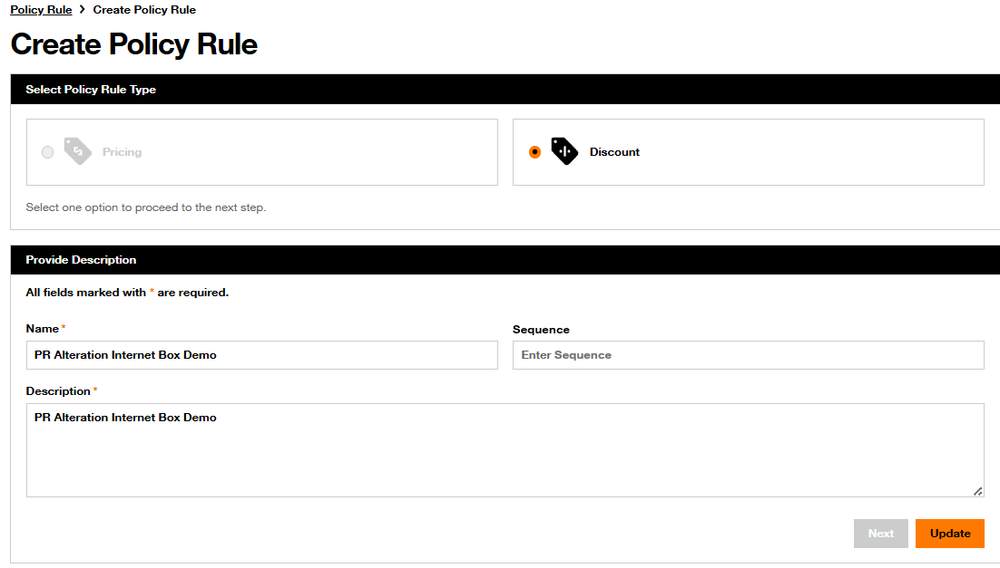{.img-zoomable}

        Then, click on Next button 

    ???+ note "'Provide Event' card"

        | Name                      |Description                  | Associate Product Offering - Name | Associate Product Offering - Commercial Operation |
        | ------------------------- | --------------------------- |---------------------------------- |-------------------------------------------------- |    
        | EVT-Add Internet Box Demo | Event Add Internet Box Demo | Internet Box Demo                 | add                                               | 

        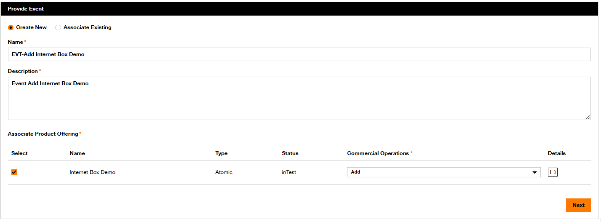{.img-zoomable}

        Then, click on Next button 

    ???+ note "'Provide Condition' card"

        | Name                      | Description                                             |
        | ------------------------- | ------------------------------------------------------- |
        | CDT-FTTH Channel Selfcare | Condition: Channel used for FTTH contract is 'Selfcare' | 

        Statements

        | Product Offering |Entity           | Entity Value | Variable Value | Joined Operand |  
        | ---------------- | --------------- |------------- |--------------- | -------------- |    
        | FTTH Demo        | Channel         | Selfcare     | Selfcare       |             NA | 

        **Save** the Condition Statement  

        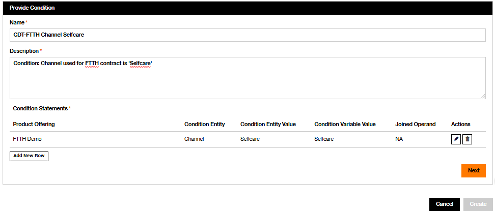{.img-zoomable}

        Then, click on Next button 

    ???+ note "'Provide Action' card"

        Select the Product Offering Price: `NRC 100 Euro` 
        Select the Alteration type: Altered by
        Select the Alteration: 'Discount 100%'

        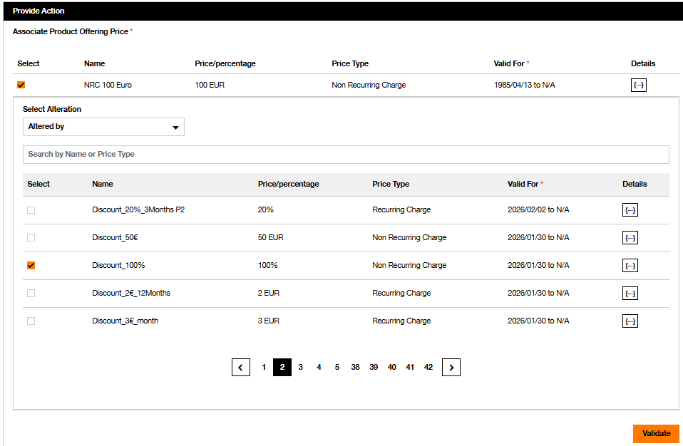{.img-zoomable}
  
        Then, click on **Validate** button

    Then, click on Create button

    A message 'Policy Rule has been created successfully' is displayed.

    !!! success "Result"
        The Policy Rule `PR Alteration Internet Box Demo` has been created.  

        ??? example "Illustration in the Policy Rule Dashboard"

            The Policy Rule `PR Alteration Internet Box Demo` has been created and is displayed in the Policy Rule Dashboard with a inTest status.

            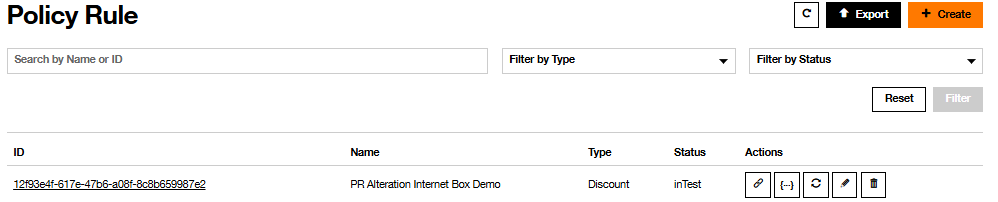{.img-zoomable} 

        ??? example "Illustration of the Policy Rule Details" 

            It is also possible to visualize the Policy Rule created:  

            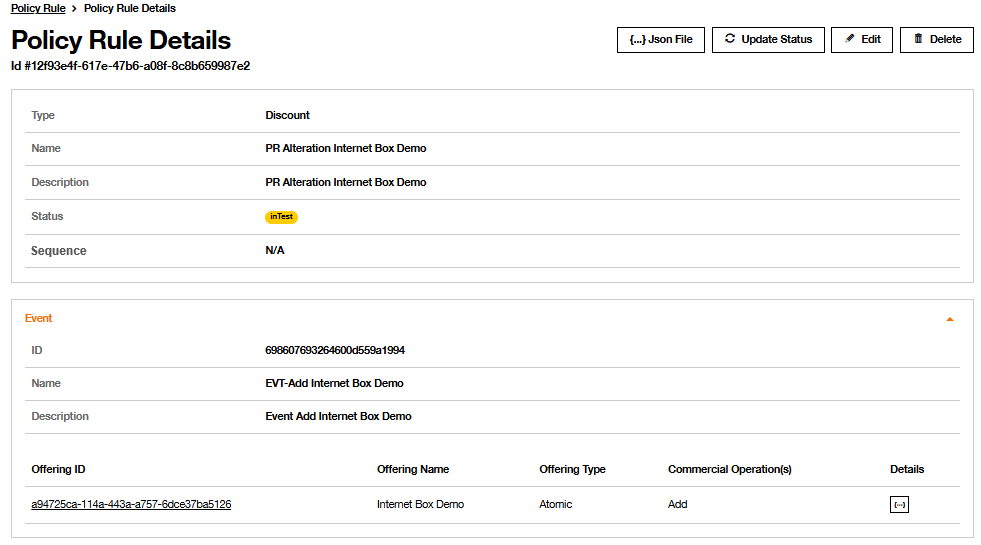{.img-zoomable}

            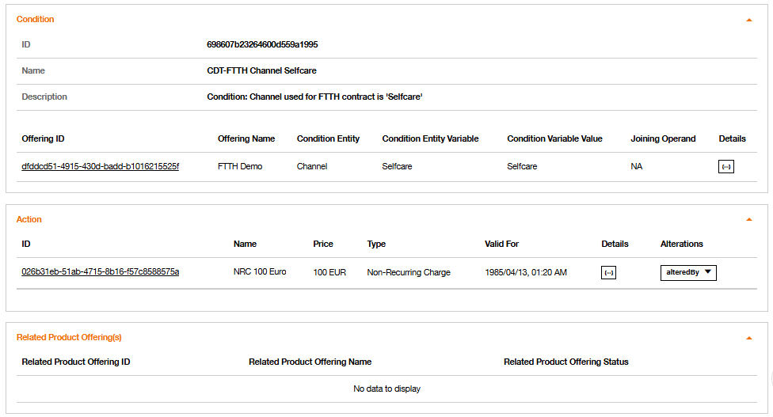{.img-zoomable}

??? Quote "Change the Policy Rules status" 

    Change the Policy Rules status from inTest to active 

??? Quote "Modify Product Offering to associate Policy Rule" 

    Update the Product Offering (PO) named `Internet Box Demo` in order to associate the Policy Rule `PR Alteration Internet Box Demo` 

    ??? example "Policy Rule associated with Product Offering" 

        The Policy Rule is now associated with the `Internet Box Demo`Product Offering

        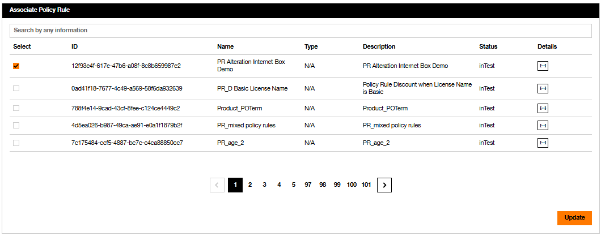{.img-zoomable} 

        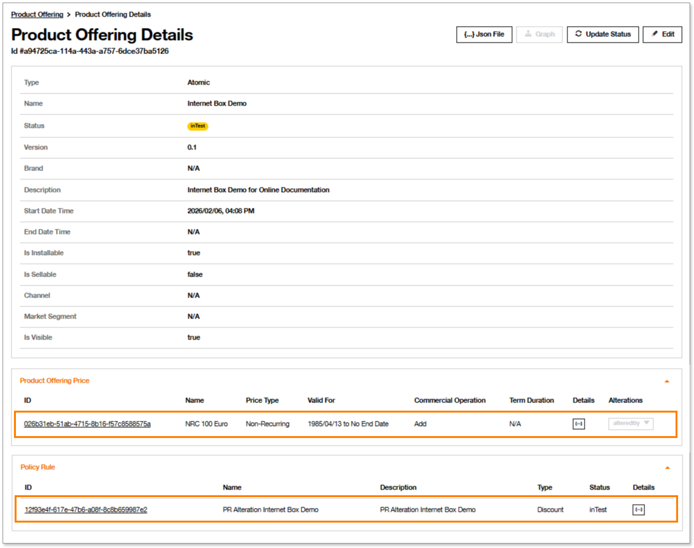{.img-zoomable}

    ??? example "Related Product Offering for Policy Rule" 

        After this association, the `Internet Box Demo` appears as a Related Product Offering for this Policy Rule `PR Alteration Internet Box Demo`.

        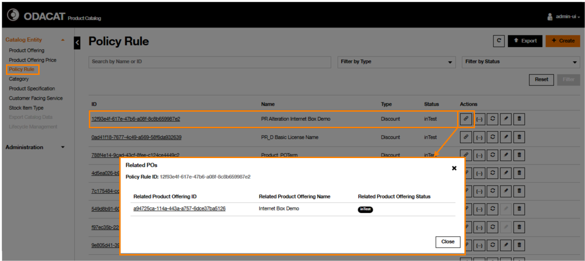{.img-zoomable} 