

# Product Offering Price

This document describes how to use the ODACAT UI to manage the configuration of the **Product Offering Price** entity which can be of different types reminded in the table below: 

| Entity              | Description  | Entity Icon                          | 
| ------------------- | --------------------------------------------------- |----------------------------------------------------------------- |   
| Charge              | It represents price which can be recurring or non recurring and can be associated to Product Offering   *Example: Recurring Charge of 30€/month* |   |   
| Installment Charge  | It defines whether the product offering will be paid **upfront** or with **installments** plans which refer to an offer price that is divided into multiple payments over several months, typically a tangible item such as a smartphone.  |        |   
| Alteration          | It enables to alter or replace the charge price by a specific percentage or amount   *Examples: Discount of 10%/month, Discount of 5%/months during 5 months, Discount of 5€*  |   |   
| Tax                 | Tax, in price value or percentage, alters a charge.   *Example: Value Added Tax (VAT) of 19%* |        |   

!!! success "What you will find in this documentation"
    This document covers basic configuration **Product Offering Price configuration** descriptions as well as more advanced ones in a progressive way.  

    It is split in three parts:  

     - the first part deals with the description of the **Product Offering Price Dashboard** introducing the **Information Displayed**, the list of **Actions** and how to use the [Search and filter function](../product-offering-price/#search-and-filter-function),    
     - the second part deals with a step by step description on how to create **Product Offering Price Charge**, **Product Offering Price Alteration**, **Product Offering Price Tax** or **Product Offering Price Installment Charge** and get details on them.  
     - the third part includes some [Hands-on use cases](../product-offering-price/#hands-on-cases) with detailed descriptions on how to configure the solution with the ODACAT UI to support some concrete and relevant **Product Offering Price** use cases.

    | Use Case  | Type(s) involved        | Hands-on Use Case                                                                        |
    | :-------: | :---------------------: |----------------------------------------------------------------------------------------- |
    | 1         | Tax                     | Tax in Percentage                                                                        |
    | 2         | Charge and Tax          | Recurring with Tax                                                                       |
    | 3         | Alteration              | Recurring in Percentage                                                                  |
    | 4         | Alteration              | Recurring in Percentage with Limited Application Duration                                |
    | 5         | Alteration              | Recurring in Price                                                                       | 
    | 6         | Alteration              | Recurring in Price with limited Application Duration                                     |
    | 7         | Alteration              | Non Recurring in Percentage                                                              |
    | 8         | Alteration              | Non Recurring in Price                                                                   |
    | 9         | Charge, Alteration, Tax | Recurring Charge altered in Percentage                                                   |
    | 10        | Charge, Alteration, Tax | Recurring Charge altered in Percentage with Application Duration                         |
    | 11        | Charge, Alteration, Tax | Recurring Charge altered in Price                                                        |
    | 12        | Charge, Alteration, Tax | Recurring Charge altered in Price with Application Duration                              |
    | 13        | Charge, Alteration, Tax | Recurring Charge altered in Price with Specific Time Frame                               |
    | 14        | Charge, Alteration, Tax | Recurring Charge altered in Price with Application Duration and Specific Time Frame      |
    | 15        | Charge, Alteration, Tax | Non Recurring Charge with Immediate Payment altered in Percentage                        |
    | 16        | Charge, Alteration, Tax | Non Recurring Charge without Immediate Payment altered in Price                          |
    | 17        | Charge, Alteration, Tax | Non Recurring Charge altered in Price                                                    |
    | 18        | Charge, Alteration, Tax | Recurring Charge altered by Multiple Percentage Alteration Type                          |
    | 19        | Charge, Alteration, Tax | Recurring Charge altered both by Percentage and Price Alteration Types                   |
    | 20        | Charge, Alteration, Tax | Non Recurring Charge replaced by an Alteration Price                                     |
    | 21        | Installment Charge      | Installment Charge with Down Payment                                                     |
    | 22        | Installment Charge      | Installment Charge with Interest Rate and Partner                                        |  

## Dashboard

In the ODACAT Product Catalog Portal, you can access to **Product Offering Price Dashboard** by selecting the **Product Offering Price** from the "Catalog Entity" panel. It includes:  

- a set of actions:
  - 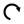 button to refresh the display    
  - 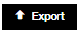 button to generate an export file with the list of Product Offering Prices   
  - 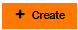 button to create a Product Offering Price     
- a [Search and filter function](../product-offering-price/#search-and-filter-function) related area, you can use to filter the list of Product Offering Prices. See section [Search and filter function](../product-offering-price/#search-and-filter-function) for more details.     
- a list of Product Offering Prices. See section [List of Information Displayed and Actions on per Product Offering Price instance](../product-offering-price/#list-of-information-displayed-and-actions-on-per-product-offering-price-instance) for more details.

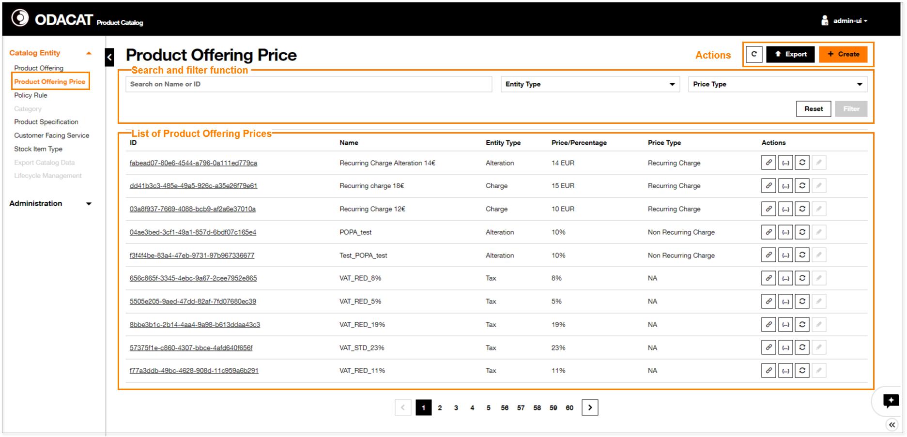{.img-zoomable} 

### List of Information Displayed and Actions on per Product Offering Price instance

The list of Product Offering Prices displays all of, or a subset of, the Product Offering Price(s) defined in the Product Catalog. The displayed Product Offering Price properties are:  

  | Column               | Description                                                                                                                               |
  | :------------------- | :---------------------------------------------------------------------------------------------------------------------------------------- |
  | `ID`                 | The identifier of the Product Offering Price                                                                                              |
  | `Name`               | The name of the Product Offering Price                                                                                                    |
  | `Entity Type`        | It specifies if the Product Offering Price is related to a **Charge**, an **Alteration**, a **Tax** or an **Installment Charge**          |
  | `Price/Percentage`   | It specifies the value which is respectively:  - the duty-free amount for 'Price'   - percentage value for percentage type |
  | `Price Type`         | depending on the context, it can be [Recurring Charge, Non Recurring Charge] or Non Applicable (N/A)                                      |
  | `Action`             | Set of Product Offering Price specific actions:   to:   - when a specific Product Offering Price Alteration is selected, to get the list of Product Offering Price Charges that is using this Alteration (discount)    - when a specific Product Offering Price Tax Alteration is selected, to get the list of Product Offering Price Charges that is using this Tax alteration  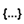 to get details on its definition in *Json* format  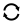 to change its lifecycle status   to edit it. Today this icon is greyed as this action is not possible. Hence, Product Offering Price status are launched when created and cannot be modified.  | 

### Search and filter function

The **Search and filter function** of the **Product Offering Price Dashboard** enables to retrieve the list of Product Offering Price(s) based on a set of filter criteria:

- Identifier ID or Name
- Type: [Charge/Alteration/Tax/Installment Charge] values
- Price Type: [Recurring/Non Recurring] values

These filter criteria may be combined.

??? abstract "Search by ID"
     1. Enter the **Product Offering Price ID** in the **Search on Name or ID** area  
     2. Click on **Filter** button  
     3. The result of the filtering is displayed: 
       - If the **Product Offering Price ID** is already defined in the Product Catalog, then the list of Product Offering Prices is refreshed and only the associated Product Offering Price is displayed with its properties.  
       - Otherwise, If the **Product Offering ID** is not defined in the Product Catalog, then the list of Product Offering Prices is refreshed with no entry and a message `No data to display` is provided.   
     4. To return on the default list of Product Offering Prices, click on the Reset button on the top of the screen.   

??? abstract "Search by Name"
     **Full Name Entered**  
     1. Enter the complete **Product Offering Name** in the **Search on Name or ID** area  
     2. Click on **Filter** button  
     3. The result of the filtering is displayed:  
        - If there is a Product Offering Price already defined in the Product Catalog with this Name, then the list of Product Offering Prices is refreshed and only the associated Product Offering Price is displayed with its properties.  
        - Otherwise, if there is no Product Offering Price with this Name in the Product Catalog, then the list of Product Offering Prices is refreshed with no entry and a message `No data to display` is provided.
     4. To return on the default list of Product Offering Prices, click on the Reset button on the top of the screen.      
     **Partial Name Entered**  
     1. Enter some characters of **Product Offering Name** in the **Search on Name or ID** area  
     2. Click on **Filter** button  
     3. The result of the filtering is displayed:  
       - If there is one or several Product Offering Price(s) already defined in the Product Catalog which Name includes the set of characters used for the Search, then the list of Product Offering Prices is refreshed and only the associated Product Offering Prices is (are) displayed with its (their) properties.  
       - Otherwise, if there is not any Product Offering Price which name includes this set of characters, then the list of Product Offering Prices is refreshed with no entry and a message `No data to display` is provided.  
     4. To return on the default list of Product Offering Prices, click on the Reset button on the top of the screen.  

??? abstract "Filter by Entity Type"
     The **Filter by Type** criteria of the **Product Offering Price Dashboard** can be used to filter the display to Product Offering Price according the **Product Offering Price Type** [Charge/Alteration/Tax/Installment Charge]:  
        - Charge  
        - Alteration   
        - Tax   
        - Installment Charge      
    **Filter by Charge Type**  
     1. Click on the **Filter by Type** dropdown button and select the `Charge` value  
     2. Click on **Filter** button  
     3. The result of the filtering is displayed accordingly. Only the Charges are displayed     
     4. To return on the default list of Product Offering Prices, clicks on the Reset button on the top of the screen.      
    **Filter by Alteration Type**  
     1. Click on the **Filter by Type** dropdown button and select the `Alteration` value  
     2. Click on **Filter** button  
     3. The result of the filtering is displayed accordingly. Only the Alterations are displayed   
     4. To return on the default list of Product Offering Prices, clicks on the Reset button on the top of the screen.      
    **Filter by Tax Type**  
     1. Click on the **Filter by Type** dropdown button and select the `Tax` value  
     2. Click on **Filter** button  
     3. The result of the filtering is displayed accordingly. Only the Tax are displayed   
     4. To return on the default list of Product Offering Prices, clicks on the Reset button on the top of the screen.      
    **Filter by Tax Type**  
     1. Click on the **Filter by Type** dropdown button and select the `Installment Charge` value  
     2. Click on **Filter** button  
     3. The result of the filtering is displayed accordingly. Only the Installment Charges are displayed   
     4. To return on the default list of Product Offering Prices, clicks on the Reset button on the top of the screen.

??? abstract "Filter by Price Type"
     The **Price Type** criteria of the **Product Offering Price Dashboard** can be used to restrict the list of **Product Offering Prices Charge** and **Product Offering Prices Alteration** depending on their Price Type:   
        - Recurring  
        - Non Recurring      
    **Filter by Recurring Price Type**  
     1. Click on the **Filter by Type** dropdown button and select the `Recurring` value  
     2. Click on **Filter** button  
     3. he result of the filtering is displayed accordingly so only the **Product Offering Price Charge** and **Product Offering Price Alteration** with a Recurring price type are displayed      
     4. To return on the default list of Product Offering Prices, clicks on the Reset button on the top of the screen.      
    **Filter by Non-Recurring Price Type**  
     1. Click on the **Filter by Type** dropdown button and select the `Non Recurring` value  
     2. Click on **Filter** button  
     3. The result of the filtering is displayed accordingly so only the **Product Offering Price Charge** and **Product Offering Price Alteration** with a Non Recurring price type are displayed     
     4. To return on the default list of Product Offering Prices, clicks on the Reset button on the top of the screen.   

## General information about Product Offering Price configuration

For Product Offering Price entity, the ODACAT UI is composed on multiple cards that will be displayed according the process ( i.e. Create, Get Details) to be managed. 

This paragraph provides some figures illustrating the main cards involved per Product Offering Price type and per process.

The cards used the 'Product Offering Price Creation' process are presented in the figure below:

   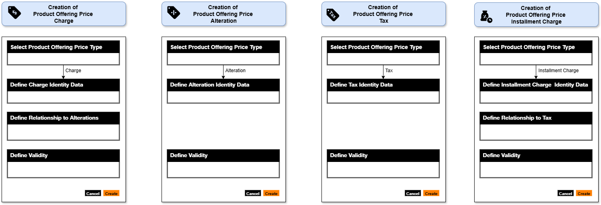

   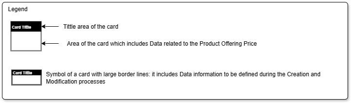

As a user of the Product Catalog, you must be aware of some important rules that shall be respected for the configuration of a **Product Offering Price** entity. These are summarized in the following **Golden Rules** section. 

!!! success "Golden Rules"
    - **Alterations (Discounts) are calculated on Priority based. The lower priority number is, the higher priority applies (i.e. an associated POP Alteration with a `Priority` value set to `1` will be applied before any associated POP Alteration with a `Priority` value set to `2` or greater than `2`)**
    - **Alterations with the same "priority" value are prohibited for association with Charge**
    - **Tax Calculation applies on Discounted (e.g Altered) Charges**
    - **Restriction to two tax rates** 
      - For now, a maximum of 2 tax rates are permitted to be applied to a Charge at a given point in time. When two tax rates are defined, there is no priority between them.
    - **No Multiple Replacements for a Charge**
      - A single Product Offering Price (POPC) cannot have multiple replacedBy relationships.
      - Only one replacedBy definition is allowed for a given Product Offering Price (POPC).
    - **Mutual Exclusivity: replacedBy vs alteredBy**
      - If a replacedBy relationship is defined in a POPC, an alteredBy relationship cannot exist for the same POPC with type = @POPA.
      > Example:  
      >   Allowed: POPC → replacedBy → POPA  
      >   Not Allowed: POPC → replacedBy → POPA and POPC → alteredBy → @POPA simultaneously.
    - **Alterations (Tax/Other Adjustments)**
      - A POPC can have an alteredBy relationship with type = @TaxPOPA.
      - This is permitted even if a replacedBy exists, as long as the alteration is tax-related and not a POPA type.
    - **ReplacedBy Definition Restriction**
      - A replacedBy relationship can be defined only once per POPC.
      - After replacement is set, no new replacedBy definition can be created.
    - **Product Offering Price Charge Integrity Constraint**
      - Ensure that all Product Offering Prices are consistently linked either by:
        - Replacement (replacedBy)
        - Alteration (alteredBy)
        - But not both (except in Tax-specific cases).
    - **In case of configuration of a Product Offering Price Charge which has to be associated to an Alteration (respectively associated to a Tax), ==the configuration of the Alteration (respectively the Tax), shall be done prior to the configuration of the Product Offering Price Charge==.**

## Product Offering Price Charge

ODACAT supports the creation of a **Product Offering Price Charge** with either a **Recurring Charge** Price Type, for instance '30€ per month', or a **Non Recurring Charge** Price Type, for instance '25$ with Immediate Payment'.  

!!! note "Product Offering Price configuration process"
    **Product Offering Price** creation follows a sequence of configurations on the user interface aligned with the process flow presented in the [Create Product Offering Price](../../../architecture/overall-architecture/#create-product-offering-price) section of the [Overall Architecture](../../../architecture/overall-architecture/).

### Create Recurring Charge

1. Click on the  on top right corner of the screen

2. A **Create Product Offering Price** page is displayed with a first card Select Product Offering Price Type  of the Product Offering Price to be created with a set of radio buttons:  Charge,  Alteration,  Tax or  Installment Charge. 

3. In this use case, choose the  **Charge** type. News cards are displayed Define Charge Identity Data, Define Relationship to Alteration and Define Validity.

4. Define Charge Identity Data  

  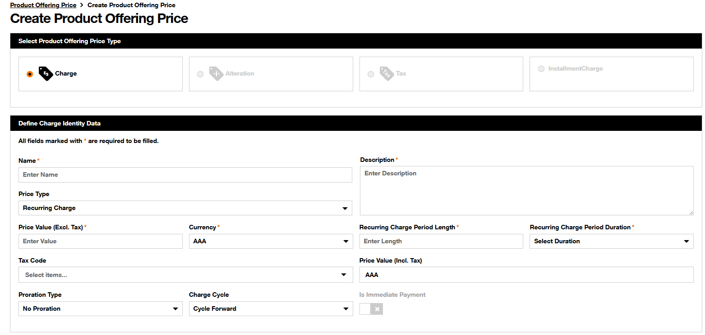{.img-zoomable}  

   - Enter the **Name**  
   - Enter the **Description**  
   - Select the **Price Type** from the dropdown button. You can select either `Recurring Charge` or `Non Recurring Charge`. By default, `Recurring Charge` Price type is proposed. According to the use case dealt in this section, the `Recurring Charge` type applies:  
   - Enter the amount value Tax excluded in the **Price Value (Excl. Tax)** field  
   - Choose the **Currency** from the list of currencies proposed in the dropdown and setup in the [Catalog Administration](../../catalog-administration/) section.  
   - Define the properties of the Recurring Charge period:  
      - Enter the **Length of the Recurring Charge Period**  
      - Select the **Duration of the Recurring Charge Period** from the list of Duration lengths proposed in the dropdown and setup in the [Catalog Administration](../../catalog-administration/) section.    
   - Choose **Tax Code** to be applied to the Charge. One or two **Tax Code** can be selected from the list of **Product Offering Price Tax** type already defined. 
     The value of the **Price Value (Incl. Tax)** is computed based on the **Price Value (Excl. Tax)** entered and the **Tax Code(s)** selected.  
   - Optionally, select the **Proration Type** to be applied. Possible values are:`No Proration` *(default value)*, `Prorated at subscription`, `Prorated at Termination` or `Both`. The `Both` can be used to indicate that Proration will be applied both at Subscription of the product and at product Termination.

    !!! info "Proration management"
          ODACAT enables to optionally associate a specific Proration Type to a Product Offering Price Charge. The values configured are not used by the Product Configurator for price calculation but can be used by Rating and Billing external component(s).

   - Optionally, select the **Charge Cycle** to be applied from the possible values `Cycle Forward` or `Cycle Arrears`.  

    !!! info "Charge Cycle management"
          ODACAT enables to optionally associate a specific type of Charge Cycle to a Product Offering Price Charge. The values configured are not used by the Product Configurator for Price calculation but can be used by Rating and Billing component(s).

    !!! abstract "Definition of the association between an Alteration and a Charge can be done either through Direct Association Charge Configuration or within Policy Rule Discount Definition"
          In ODACAT Product Catalog, there are two ways to configure how Discounts will be applied on a Charge:

          - Using **Direct Association** configuration between one or several 'Alterations' and the 'Charge' during the **Product Offering Price** configuration thanks to the **Define Relationship to Alteration** card setup.  

          - Using [Policy Rule Discount](../policy-rule/#policy-rule-discount) which can be used for advanced Discount configuration taking into account some Event and Conditions criteria for Discount eligibility.

5. Define Relationship to Alteration  Optionally, configure **a Direct Relationship between Alteration(s) and a Charge**:

  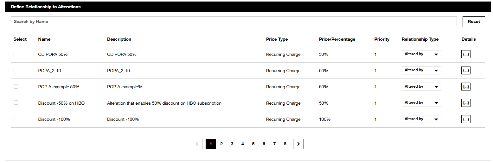{.img-zoomable}

   - You can first get details on each **Product Offering Price Alteration** listed thanks to the  button  
   - Once identified, you can select with the checkbox the **Product Offering Price Alteration(s)** that should have a relationship with the **Product Offering Price Charge** under creation.  
   - For each **Product Offering Price Alteration** selected, you can:  
      - Retrieve some details (Name, Description, Price Type, Price/Percentage, Priority)  
      - Set up the **Relationship type** [Altered by/Replaced by] between the **Product Offering Price Charge** and the **Product Offering Price Alteration**. 

    !!! info "How Does 'Altered By' and 'Replaced By' impact the discounted price"
        The type `Altered by` means that the Alteration price/percentage **alters** (subtraction if price or percentage calculation) the price value of the Charge. The type `Replaced by` means that the Alteration price value **replaces** the price value of the Charge. If multiple **Alterations** must be selected, please check they have different priority values otherwise an error will be raised. The lowest value the priority number is, the highest priority will be considered by the Product Configurator during the calculation of discounted price amount.
        > **Examples of 'Alteration type'**  
        >  
        > | POP Charge Amount | POP Alteration | Alteration Type | Discounted Price Amount Value |
        > | ----------------- | ---------------|---------------- |------------------------------ |
        > | 100€              | 10%            | Altered by      | 90€                           |
        > | 100€              | 20€            | Altered by      | 80€                           |
        > | 100€              | 15€            | Replaced by     | 15€                           |

    !!! info abstract "Check Priority value when multiple Alterations should be associated to a Charge"
        It is possible to associate several **Alterations** to one **Charge**, but these must have different **Priority** value. So, during the configuration of multiple associations between a **Charge** and some **Alterations**, please check they have different **priority** value otherwise an error will be raised. As a reminder, the lowest value the **priority** number is, the highest priority will be considered by the Product Configurator during the calculation of discounted price amount.

     > **Configuration of a Product Offering Price Charge Recurring**  
     >   - Tax Excluded Amount: 50€  
     >   - Recurring Period: every month   
     >   - Tax rate: 20%  
     >   - Discount: 10% Discount for 3 months (Altered by)  
     >  
     > 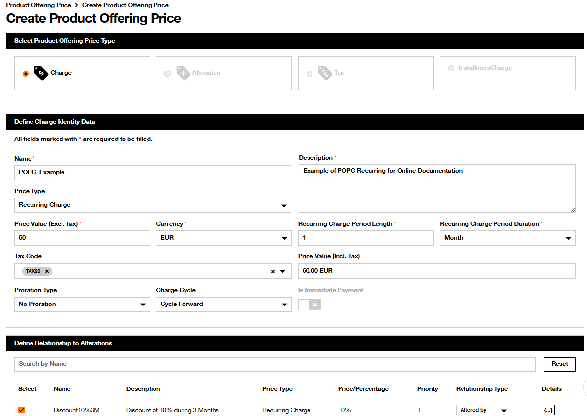{.img-zoomable}

6. Define Validity  

  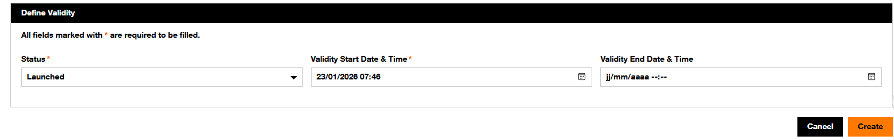{.img-zoomable}  

   - Select the Status from the list of status displayed in the dropdown. In this use case, the predefined status value launched can be used.  
   - Define **Validity Start Date & Time**, override, if necessary, the default value proposed.  
   - Define, if necessary, the **Validity End Date & Time**  

Once completed, click on the Create button to complete the process flow for the creation of a Product Offering Price Charge with Recurring Charge type.

  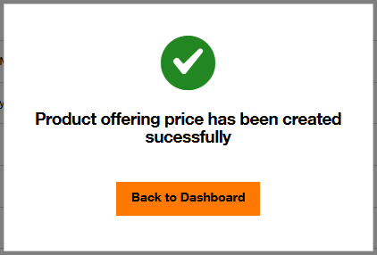 

!!! success "Result"
    The **Product Offering Price Charge**  is created and displayed in the Dashboard.

> Example: Product Offering Price Charge Recurring
>
>  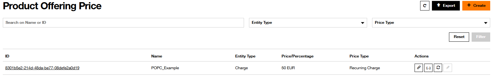{.img-zoomable} 

### Create Non Recurring Charge 

1. Click on the  on top right corner of the screen

2. A **Create Product Offering Price** page is displayed with a first card Select Product Offering Price Type  of the Product Offering Price to be created with a set of radio buttons:  Charge,  Alteration,  Tax or  Installment Charge. 

3. In this use case, choose the  **Charge** type. News cards are displayed Define Charge Identity Data, Define Relationship to Alteration and Define Validity.

4. Define Charge Identity Data  

   - Enter the **Name**   
   - Enter the **Description**   
   - Select the **Non Recurring Charge** value in the list of **Price Type**  
   - Enter the amount value Tax excluded in the **Price Value (Excl. Tax)** field  
   - Choose the **Currency** from the list of currencies proposed in the dropdown and setup in the [Catalog Administration](../../catalog-administration/) section.
   - Choose **Tax Code** to be applied to the Charge. One or two **Tax Code** can be selected from the list of **Product Offering Price Tax** type already defined. The value of the **Price Value (Incl. Tax)** is computed based on the **Price Value (Excl. Tax)** entered and the **Tax Code(s)** selected.  
   - Specify whether the charge requires or not an **Immediate Payment**. A charge with an Immediate Payment will have to be paid at the end of the Product Ordering process.
                        
    > **Example**  
    > **Configuration of a Product Offering Price Charge Non Recurring**  
    > - Tax excluded amount: 15€  
    > - Non Recurring and with **Immediate Payment**  
    > - Tax rate: 20%  
    > - No alteration  
    >  
    > 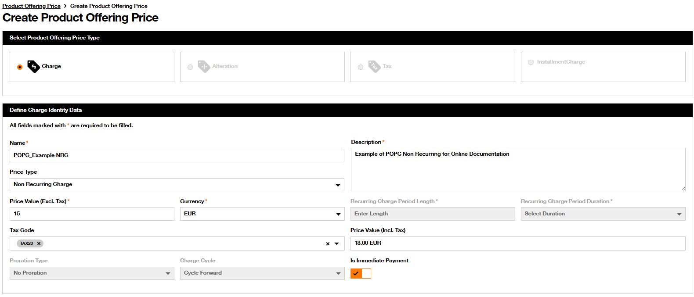{.img-zoomable}  
    >  

5. Define Relationship to Alteration  Optionally, configure **a Direct Relationship between Alteration(s) and a Charge**:

   - You can first get details on each **Product Offering Price Alteration** listed thanks to the  button  
   - Once identified, you can select with the checkbox the **Product Offering Price Alteration(s)** that should have a relationship with the **Product Offering Price Charge** under creation.  
   - For each **Product Offering Price Alteration** selected, you can:  
      - Retrieve some details like the Name, Description, Price Type, Price/Percentage and Priority  
      - Set up the **Relationship type** [Altered by/Replaced by] between the **Product Offering Price Charge** and the **Product Offering Price Alteration**.      

    !!! info "How Does 'Altered By' and 'Replaced By' impact the discounted price"
        The type `Altered by` means that the Alteration price/percentage **alters** (subtraction if price or percentage calculation) the price value of the Charge. The type `Replaced by` means that the Alteration price value **replaces** the price value of the Charge. If multiple **Alterations** have to be selected, please check they have different priority values otherwise an error will be raised. The lowest value the priority number is, the highest priority will be considered by the Product Configurator during the calculation of discounted price amount.
        > **Examples of 'Alteration type'**  
        >  
        > | POP Charge Amount | POP Alteration | Alteration Type | Discounted Price Amount Value |
        > | ----------------- | ---------------|---------------- |------------------------------ |
        > | 100€              | 10%            | Altered by      | 90€                           |
        > | 100€              | 20€            | Altered by      | 80€                           |
        > | 100€              | 15€            | Replaced by     | 15€                           |

    !!! info abstract "Check Priority value when multiple Alterations should be associated to a Charge"
        It is possible to associate several **Alterations** to one **Charge**, but these must have different **Priority** value. So, during the configuration of multiple associations between a **Charge** and some **Alterations**, please check they have different **priority** value otherwise an error will be raised. As a reminder, the lowest value the **priority** number is, the highest priority will be considered by the Product Configurator during the calculation of discounted price amount.

6. Define Validity  

   - Select the Status from the list of status displayed in the dropdown. In this use case, the predefined status value launched can be used.  
   - Define **Validity Start Date & Time**, override, if necessary, the default value proposed.  
   - Define, if necessary, the **Validity End Date & Time**  

Once completed, click on the Create button to complete the process of the creation of a Product Offering Price Charge with Non Recurring Charge type.  

   

!!! success "Result"
    The **Product Offering Price Charge** is created and displayed in the Dashboard.

    > **Example**
    > **Product Offering Price Charge Non Recurring**  
    >  
    >  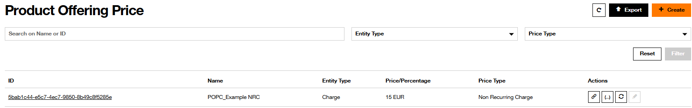{.img-zoomable}  

### Get Details on Product Offering Price Charge

ODACAT Product Catalog enables to get details on a specific **Product Offering Price Charge**.

1. Identify the **Product Offering Price Charge** that needs to be consulted. The **Search and filter function** can be used to retrieve this Product Offering Price Charge.
2. A **Product Offering Price Details** page is then displayed with the Identifier of the Product Offering Price below this page title
3. On top right side of this page, some buttons are presented
   -  **Json file** button enables to visualize the definition of the Product Offering Price in Json format  
   -  **Update Status** button enables to change the status of the Product Offering Price according Product Offering Price life-cycle policy  
   -  **Edit** button enables to update the Product Offering. This action is so far not allowed and is greyed.
   -  **Delete** button enables to delete the Product Offering Price (so far, this action is disabled).

4. The **Product Offering Price Details** gives details on:  

It provides in a table view: 

  | Line                         | Description                                                                      |
  | :--------------------------- | :------------------------------------------------------------------------------- |
  | `Type`                       | The type of the Product Offering Price, in this use case it's a `charge`         |
  | `Name`                       | The name of the Product Offering Price Charge                                    |
  | `Description`                | The description of the Product Offering Price                                    |
  | `Status`                     | The status of the Charge launched      |
  | `Validity Start Date & Time` |                                                                                  |
  | `Validity End Data & Time`   |                                                                                  |
  | `Price Type`                 | The Price Type value which can be either `Recurring` or `Non Recurring`         |
  | `Price Value`                | Amount (Tax excluded)                                                            |
  | `Currency`                   | Currency used to define the price amount of the charge                          |
  | `Is Immediate Payment`       | Boolean applicable only for Non Recurring Price Type                             |

Relationship to Alterations

It provides in a table view: 

  | Column               | Description                                                                                                                      |
  | :------------------- | :------------------------------------------------------------------------------------------------------------------------------- |
  | `ID`                 | The identifier of the Alteration                                                                                                 |
  | `Name`               | The name of the Alteration                                                                                                       |
  | `Price Type`         | The Price Type value which can be either `Recurring` or `Non Recurring`                                                         |
  | `Price Percentage`   | Depending the alteration, it provides either the Duty Free Price Amount or the Percentage value                                  |
  | `Priority`           | The value of the priority of the Alteration                                                                                      |
  | `Relationship Type`  | Specifies whether the alteration alters (e.g. `alteredBy`) or replaces (e.g. `replacedBy`) the Charge  amount                    |
  | `Action`             | The  action can be used to get details on the Alteration selected *Json* format        |

!!! success "Product Offering Price Charge Hands On use cases"
    For further details and specific configurations examples about Product Offering Price Charge, see the associated [Hands On use cases](../product-offering-price/#hands-on-cases)

## Product Offering Price Alteration

ODACAT supports the creation of **Product Offering Price Alteration** which can be either with `Recurring` Price Type or with `Non Recurring` Price Type.  

### Create Recurring Alteration 

1. Click on the  on top right corner of the screen

2. A **Create Product Offering Price** page is displayed in which you have first to specify the  **type** of the Product Offering Price to be created: a  Charge, an  Alteration, a  Tax or an  Installment Charge. 

3. In this use case, choose the  **Alteration** type. News cards are displayed Define Charge Identity Dataand Define Validity. 

4. Define Alteration Identity Data  

   - Enter the **Name**   
   - Enter the **Description**   
   - Select the **Recurring Alteration** from the **Price Type** list.  
   - Select the **Alteration Type** from the dropdown values presented: **Price** or **Percentage**  
     - For **Price Alteration Type**, enter the **Price Value (Excl. Tax)** value and choose the **Currency** from the list of currencies proposed in the dropdown and setup in the [Catalog Administration](../../catalog-administration/) section.  
     - For **Percentage Alteration Type**, enter the **Percentage (0-100%)** value. An integer percentage value, for instance 10%, can be entered by using the top arrow/down arrow or manually. A decimal percentage value, for instance 2.5%, needs to be entered manually.   
   - Enter the **Priority**. The lowest value the priority number is, the highest priority will be considered by the Product Configurator during the calculation of discounted price amount.           
   - Optionally, select the **Proration Type**  
   - Optionally, configure the **Application Duration** of the Alteration:  
       - Select the **Application Duration Unit** from the list proposed and setup in the [Catalog Administration](../../catalog-administration/) section.    
       - Enter the **Application Duration Length**. Note that empty value means that the Alteration applies permanently.  
   - Optionally if you want that the Alteration will be applicable within specific Time Fram, you should configure the value of the **Application Start** which will contain the number of recurrences from which the alteration starts. 

6. Define Validity  

   - Can select a Status from the list of status displayed in the dropdown[Launched/Unavailable/Retired/Obsolete]. In this use case, the predefined status value launched can be used  
   - If necessary, update the **Validity Start Date & Time**  
   - If necessary, define the **Validity End Date & Time** 

Once completed, click on the Create button to complete the process of the creation of a Product Offering Price Alteration with Recurring Alteration Price type.   

!!! success "Result"
    The **Product Offering Price Alteration** is created and displayed in the Dashboard.  

???+ abstract "Example of Discount without Application Duration and without any specific Time Frame"
     Example: Recurring charge of 10€/month with a Discount of 50%  
     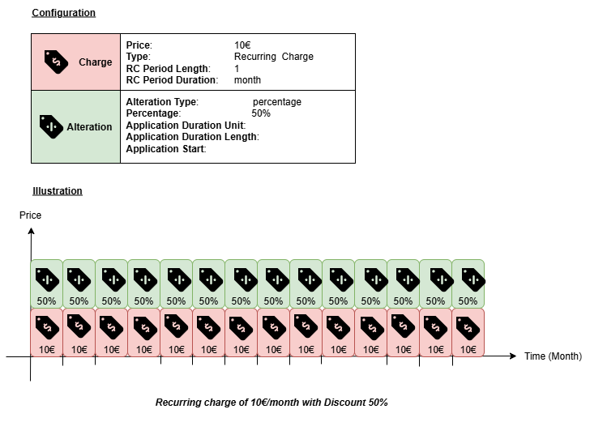

???+ abstract "Example of Discount with Application Duration and without any specific Time Frame"
     Example: Recurring charge of 10€/month with a Discount of 10% granted for 2 months  
     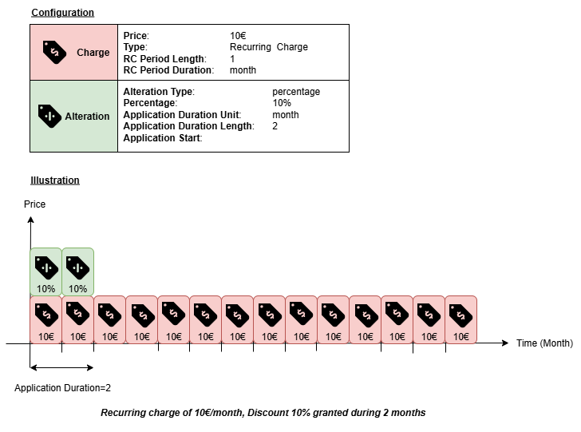

???+ abstract "Example of Discount with Application Duration and within a specific Time Frame"
     Example: Recurring charge of 10€/month with a Discount of 20% granted during 5 months from Month#3  
     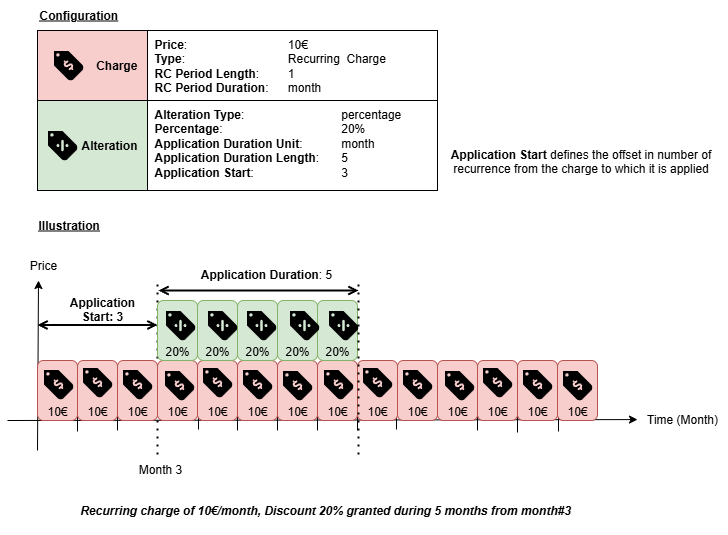

### Create Non Recurring Alteration 

1. Click on the  on top right corner of the screen

2. A **Create Product Offering Price** page is displayed with a first card Select Product Offering Price Type  of the Product Offering Price to be created with a set of radio buttons:  Charge,  Alteration,  Tax or  Installment Charge. 

3. In this use case, choose the  **Alteration** type. News cards are displayed Define Charge Identity Dataand Define Validity. 

4. Define Alteration Identity Data  

   - Enter the **Name**   
   - Enter the **Description**   
   - Select the **Non Recurring Alteration** from the **Price Type** list.  
   - Select the **Alteration Type** from the dropdown values presented: **Price** or **Percentage**  
       - For **Price Alteration Type**, enter the **Price Value (Excl. Tax)** value and choose the **Currency** from the list of currencies proposed in the dropdown and setup in the [Catalog Administration](../../catalog-administration/) section.  
       - For **Percentage Alteration Type**, enter the **Percentage (0-100%)** value   
   - Enter the **Priority** 
      
  !!! info "Influence of Priority value in Total Price Calculation "  
      The lowest value the priority number is, the highest priority will be considered by the Product Configurator during the calculation of discounted price amount 

  !!! info "Configuration of the Percentage value"  
      An integer percentage value, for instance 10%, can be entered by using the top arrow/down arrow or manually. A decimal percentage value, for instance 2.5%, needs to be entered manually. 

6. Define Validity  

   - Can select a Status from the list of status displayed in the dropdown [Launched/Unavailable/Retired/Obsolete]. In this use case, the predefined status value launched can be used  
   - If necessary, update the **Validity Start Date & Time**  
   - If necessary, define the **Validity End Date & Time**  

Once completed, click on the Create button to complete the process of the creation of a Product Offering Price Alteration with Non Recurring Alteration Price type.  

!!! success "Result" 
    The **Product Offering Price Alteration** has been created and displayed in the **Dashboard**.

### Get Details on Product Offering Price Alteration

ODACAT Product Catalog enables to get details on a specific **Product Offering Price Alteration**.

1. Identify the **Product Offering Price Alteration** that needs to be consulted. The **Search and filter function** can be used to retrieve this Product Offering Price Alteration.
2. A **Product Offering Price Details** page is then displayed with the Identifier of the Product Offering Price below this page title
3. On top right side of this page, some buttons are presented
   -  **Json file** button enables to visualize the definition of the Product Offering Price in Json format  
   -  **Update Status** button enables to change the status of the Product Offering Price according Product Offering Price life-cycle policy  
   -  **Edit** button enables to update the Product Offering. So far, this action is disabled
   -  **Delete** button enables to delete the Product Offering Price. So far, this action is disabled

4. The **Product Offering Price Details** gives details on:  

It provides in a table view: 

  | Line                          | Description                                                                                                                                          |
  | :---------------------------- | :--------------------------------------------------------------------------------------------------------------------------------------------------- |
  | `Type`                        | The type of the Product Offering Price, in this use case it's a `Alteration`                                                                         |
  | `Name`                        | The name of the Product Offering Price Alteration                                                                                                    |
  | `Description`                 | The description of the Product Offering Price                                                                                                        |
  | `Status`                      | The status of the Charge launched                                                                          |
  | `Validity Start Date & Time`  |                                                                                                                                                      |
  | `Validity End Date & Time`    |                                                                                                                                                      |
  | `Price Type`                  | The Price Type value which can be either `Recurring` or `Non Recurring`                                                                              |
  | `Alteration Type`             | `Price` or `Percentage`                                                                                                                              |
  | `Price Value`                 | Amount (Tax excluded) when Alteration Type is `Price` or percentage** value when Alteration Type is `Percentage`                                     |
  | `Currency`                    | Currency used to define the price amount of the Alteration when Alteration Type is `Price`                                                          |
  | `Priority`                    | Priority of the alteration                                                                                                                           |
  | `Prioration Type`             | Proration statuses (`No Proration`, etc.)                                                                                                            |
  | `Application Duration Amount` | Integer defining the value Application Duration                                                                                                      |
  | `Application Duration Unit`   | Unit of the Application Duration. Possible values of the list are defined in the Catalog Administration                                              |
  | `Application Start`           | Defined when Alteration applies withing a specific Time Frame. The integer value defines the number of recurrences from which the alteration starts  |

Relationship to Charges  

It displays, in table view, the list of Product Offering Price Charges which have a association with the selected Tax: 

  | Column    | Description                                                                                                           |
  | :---------| :-------------------------------------------------------------------------------------------------------------------- |
  | `ID`      | The identifier of the Charge                                                                                          |
  | `Name`    | The name of the Charge                                                                                                |
  | `Price`   | Duty Free (e.g Tax excluded) Price Amount of the Charge                                                               |
  | `Action`  | The  action can be used to get details on the Charge selected *Json* format |

!!! success "Product Offering Price Alteration Hands On use cases"
    For further details and specific configuration examples about Product Offering Price Alteration, see the associated [Hands On use cases](../product-offering-price/#hands-on-cases)

## Product Offering Price Tax

### Create POP Tax

1. Click on the  on top right corner of the screen 

2. A **Create Product Offering Price** page is displayed in which you have first to specify the **type** of the Product Offering Price to be created: a  Charge, an  Alteration, a  Tax or an  Installment Charge. 

3. In this use case, choose the   **Tax** type. News cards are displayed Define Tax Identity Dataand Define Validity. 

4. Define Tax Identity Data 

  - Enter the **Name**   
  - Enter the **Description**   
  - Select the **Tax Type** from the dropdown values presented: **Price** or **Percentage**  
      - For **Price Tax Type**, enter the **Price Value (Excl. Tax)** value and choose the **Currency** from the list of currencies proposed in the dropdown and setup in the [Catalog Administration](../../catalog-administration/) section.  
      - For **Percentage Tax Type**, enter the **Percentage (0-100%)** value   

5. Define Validity  

  - Can select a Status from the list of status displayed in the dropdown [Launched/Unavailable/Retired/Obsolete]. In this use case, the predefined status value launched can be used  
  - If necessary, update the **Validity Start Date & Time**  
  - If necessary, define the **Validity End Date & Time**  

Once completed, click on the Create button to complete the process of the creation of a Product Offering Price Tax.

!!! info "About Tax"  
    There no Price Type 'recurring or 'non recurring' property for Product Offering Price which type is Tax. 

!!! success "Result" 
    The **Product Offering Price Tax** has been created and displayed in the Dashboard.

### Get Details on Product Offering Price Tax

ODACAT Product Catalog enables to get details on a specific **Product Offering Price Tax**.

1. Identify the **Product Offering Price Tax** that needs to be consulted. The **Search and filter function** can be used to retrieve this Product Offering Price Tax.
2. A **Product Offering Price Details** page is then displayed with the Identifier of the Product Offering Price below this page title
3. On top right side of this page, some buttons are presented
   -  **Json file** button enables to visualize the definition of the Product Offering Price in Json format  
   -  **Update Status** button enables to change the status of the Product Offering Price according Product Offering Price life-cycle policy  
   -  **Edit** button enables to update the Product Offering. This action is so far not allowed and is greyed.
   -  **Delete** button enables to delete the Product Offering Price. This action is so far not allowed and is greyed.

4. The **Product Offering Price Details** gives details on:  

It provides in a table view: 

  | Line                          | Description                                                                       |
  | :---------------------------- | :-------------------------------------------------------------------------------- |
  | `Type`                        | The type of the Product Offering Price, in this use case it's a `Tax`             |
  | `Name`                        | The name of the Product Offering Price Tax                                        |
  | `Description`                 | The description of the Product Offering Price                                     |
  | `Status`                      | The status of the Charge launched       |
  | `Validity Start Date & Time`  |                                                                                   |
  | `Validity End Date & Time`    |                                                                                   |
  | `Price Type`                  | The Price Type value which can be either `Recurring` or `Non Recurring`           |
  | `Alteration Type`             | `Price` or `Percentage`                                                           |
  | `Price Value`                 | Amount (Tax excluded) when Alteration Type is `Price`                             |
  | `Currency`                    | Currency used to define the price amount of the Tax when Tax Type is `Price`     |
  | `Percentage`                  | Percentage (0-100%) value when TaxType is `Percentage`                            |

Relationship to Charges  

It displays, in table view, the list of Product Offering Price Charges which have a association with the selected Tax: 

  | Column               | Description                                                                                                           |
  | :------------------- | :-------------------------------------------------------------------------------------------------------------------- |
  | `ID`                 | The identifier of the Charge                                                                                          |
  | `Name`               | The name of the Charge                                                                                                |
  | `Price Value`        | Duty Free (e.g Tax excluded) Price Amount of the Charge                                                               |
  | `Action`             | The  action can be used to get details on the Charge selected *Json* format |

!!! success "Product Offering Price Tax Hands On use cases"
    For further details and specific configuration examples about Product Offering Price Tax, see the associated [Tax in Percentage](../product-offering-price//#1-tax-in-percentage)

## Product Offering Price Installment Charge

!!! note "Key Terms"
    - Installment plan: it refers to an offer price that is divided into multiple payments over several months, typically a tangible item such as a smartphone.
    - Upfront payment: this is a term when a customer opts to pay in full the amount for the product that they purchase.
    - Down payment: this is a commonly used term to make a compulsory part payment upfront, while the remaining amount gets divided into installments.

### Create POP Installment Charge

1. Click on the  on top right corner of the screen

2. A **Create Product Offering Price** page is displayed in which you have first to specify the  **type** of the Product Offering Price to be created: a  Charge, an  Alteration, a  Tax or an  Installment Charge. 

3. In this use case, choose the  **Installment Charge** type. News cards are displayed Define Installment Charge Identity Data, Define Relationship to Tax and Define Validity.

4. Define Installment Charge Identity Data 

   - Enter the **Name**  
   - Enter the **Description**
   - Enter the value of the **Original Amount**
   - Optionally update the **Currency** proposed by default. The list of alternative currencies proposed in the dropdown is configured in the [Catalog Administration](../../catalog-administration/) section.  
   - Select the **Installment Period Value** from the list of value proposed
   - Enter the value of the **Installment Period Units**
   
   Optionally the following can be configured (all/combinations)

   - **Down Payment** amount 
   - **Interest Rate** percentage value 
   - **Partner** identifier 
   - **External identifier** of the Installment plan for partners

5. Define Relationship to Tax Optionally:

   - You can first get details (Name, Description, Price/Percentage) on each **Product Offering Price Tax** listed thanks to the  button  
   - Once identified, you can select with the checkbox the **Product Offering Price Tax(es)** that should have a relationship with the **Product Offering Price Installment Charge** under creation.  

6. Define Validity  

   - Select the Status from the list of status displayed in the dropdown. In this use case, the predefined status value launched can be used.  
   - Define **Validity Start Date & Time**, override, if necessary, the default value proposed.  
   - Define, if necessary, the **Validity End Date & Time**.  

Once completed, click on the Create button to complete the process flow for the creation of a Product Offering Price Installment Charge.

!!! success "Result"
    The **Product Offering Price Installment Charge**  is created and displayed in the Dashboard.

### Get Details on Product Offering Price Installment Charge

ODACAT Product Catalog enables to get details on a specific **Product Offering Price Installment Charge**.

1. Identify the **Product Offering Price Installment Charge** that needs to be consulted. The **Search and filter function** can be used to retrieve this Product Offering Price Installment Charge.
2. A **Product Offering Price Details** page is then displayed with the Identifier of the Product Offering Price below this page title
3. On top right side of this page, some buttons are presented
   -  **Json file** button enables to visualize the definition of the Product Offering Price in Json format  
   -  **Update Status** button enables to change the status of the Product Offering Price according Product Offering Price life-cycle policy  
   -  **Edit** button enables to update the Product Offering. This action is so far not allowed and is greyed.
   -  **Delete** button enables to delete the Product Offering Price. This action is so far not allowed and is greyed.

4. The **Product Offering Price Details** gives details on:  

It provides in a table view: 

  | Line                         | Description                                                                       |
  | :--------------------------- | :-------------------------------------------------------------------------------- |
  | `Type`                       | The type of the Product Offering Price, in this use case it's a `Installment`     |
  | `Name`                       | The name of the Product Offering Price Installment Charge                         |
  | `Description`                | The description of the Product Offering Price                                     |
  | `Status`                     | The status of the Charge launched       |
  | `Validity Start Date & Time` |                                                                                   |
  | `Validity End Date & Time`   |                                                                                   |
  | `Original Amount`            | Amount (Tax excluded)                                                             |
  | `Currency`                   | Currency used to define the Original price amount                                |
  | `Down payment`               | In monetary value. It represents the amount that will be immediately paid by the customer at the end of the product order |
  | `Installment Period`         |              |
  | `Interest Rate`              |              |
  | `Partner      `              |              |
  | `External Identifier`        |              |

Relationship to Tax  

It displays, in table view, the list of Product Offering Price Tax which have a association with the selected Installment Charge: 

  | Column        | Description                                                                                                        |
  | :------------ | :----------------------------------------------------------------------------------------------------------------- |
  | `ID`          | The identifier of the Tax                                                                                          |
  | `Name`        | The name of the Tax                                                                                                |
  | `Description` | The description of the Tax                                                                                         |
  | `Action`      | The  action can be used to get details on the Tax selected *Json* format |

## Change the lifecycle status

Product Catalog enables to change the status of Product Offering Price according [Product Offering Price lifecyle](../../../architecture/overall-architecture/#product-offering-price-lifecycle) section of the [Overall Architecture](../../../architecture/overall-architecture/).

There are two ways to change the status of a Production Offering Price according to the lifecyle of this catalog entity:  

- From the **Product Offering Price Dashboard** with the  icon in the **Actions** column of the associated Product Offering Price.  
- From the **Product Offering Price Details** page, by clicking on the 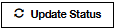 button.  

!!! success "Product Offering Price Installment Hands On use cases"
    For further details and specific configuration examples about Product Offering Price Installment, see the associated [Hands On use cases](../product-offering-price/#hands-on-cases)

## Hands-on cases

This 'Hands-on use cases' section describes all steps in details to guide you to configure the solution for multiple concrete Business needs presented in the table below:

| Type | Business need | Hands-on Use Case Name | Hands-on Use Case Index | 
| -------- | -------- | -------- | -------- |   
|   | Create a Tax with 20% rate | [Tax in Percentage](../product-offering-price/#1-tax-in-percentage) | 1 |  
|  | Create a Recurring Charge of 24€ per month 'Tax included - rate of 20% | [Recurring Charge altered by a Tax](../product-offering-price/#2-recurring-charge-with-tax) | 2 |  
|  | Create a Recurring Discount of 10% per month | [Recurring Percentage Alteration](../product-offering-price/#3-recurring-percentage-alteration) | 3 |     
|  | Create a Recurring Discount of 5% per month valid during 3 months | [Recurring Percentage Alteration with Application Duration](../product-offering-price/#4-recurring-percentage-with-application-duration-alteration) | 4 |     
|  | Create a Recurring Discount of 3€ per month | [Recurring Price Alteration](../product-offering-price/#5-recurring-price-alteration) | 5 |     
|  | Create a recurring Discount of 2€ per month valid during 12 months | [Recurring Price Alteration with Application Duration](../product-offering-price/#6-recurring-price-with-application-duration-alteration) | 6 |    
|  | Create a Discount of 100% | [Non Recurring Percentage Alteration](../product-offering-price/#7-non-recurring-percentage-alteration) | 7 |     
|  | Create a Discount of 50€ | [Non Recurring Price Alteration](../product-offering-price/#8-non-recurring-price-alteration) | 8 |     
|  | Create a Recurring Charge of 30€ per month with 10% Discount | [Recurring Charge Altered in Percentage](../product-offering-price/#9-recurring-charge-altered-percentage)| 9 | 
|  | Create a Recurring Charge of 40€ per month with 5% Discount during 3 months | [Recurring Charge Altered in Percentage with Application Duration](../product-offering-price/#10-recurring-charge-altered-percentage-with-application-duration) | 10 | 
|  | Create a Recurring Charge of 60€ per month with 3€ Discount | [Recurring Charge Altered in Price](../product-offering-price/#11-recurring-charge-altered-price) | 11 | 
|  | Create a Recurring Charge of 12€ per month with 2€ Discount during 12 months | [Recurring Charge Altered in Price with Application Duration](../product-offering-price/#12-recurring-charge-altered-price-with-application-duration) | 12 | 
|  | Create a Recurring Charge of 12€ per month with 8€ Discount starting from Month#4| [Recurring Charge Altered in Price with Specific Time Frame](../product-offering-price/#13-recurring-charge-altered-price-with-specific-time-frame) | 13 | 
|  | Create a Recurring Charge of 12€ per month with 8€ Discount starting from Month#4 for 2 months| [Recurring Charge Altered in Price with Application Duration And Specific Time Frame](../product-offering-price/#14-recurring-charge-altered-price-with-application-duration-and-specific-time-frame) | 14 | 
|  | Create a Non-Recurring Charge with Immediate Payment of 6€ with 100% Discount | [Non Recurring Charge wutg Immediate Payment Altered in Percentage](../product-offering-price/#15-non-recurring-charge-immediate-payment-altered-percentage) | 15 | 
|  | Create a Non-Recurring Charge without Immediate Payment of 36€ with 100% Discount | [Non-Recurring Charge wo Immediate Payment Altered in Percentage](../product-offering-price/#16-non-recurring-charge-without-immediate-payment-altered-percentage) | 16 | 
|  | Create a Non-Recurring charge of 80€ with 50€ Discount | [Non-Recurring Charge Altered in Price](../product-offering-price/#17-non-recurring-charge-altered-price)| 17 | 
|  | Create a Recurring Charge of 18€ altered by 10% Discount and 20% Discount during 3 months  | [Recurring Charge Altered by Multiple Percentage Alteration Type](../product-offering-price/#18-recurring-charge-altered-by-multiple-percentage-alteration-type)| 18 | 
|  | Create a Recurring Charge of 18€ altered by 10% Discount and 3€ Discount during 1 month | [Recurring Charge Altered Both by Percentage and Price Alteration Types](../product-offering-price/#19-recurring-charge-altered-both-by-percentage-and-price-alteration-types)| 19 | 
|  | Create a Non-Recurring Charge of 90€ with a 50€ replacement Discount | [Non Recurring Charge Replaced by an Alteration Price](../product-offering-price/#20-non-recurring-charge-replaced-by-an-alteration-price)| 20 | 
|   | Create an Installment Charge of 1000€ with 24 Rates and 100€ Down Payment | [Installment Charge with Down Payment](../product-offering-price/#21-create-an-installment-charge-with-down-payment)| 21 | 
|   | Create an Installment Charge of 1500€ with 36 Rates and an Interest Rate 2.5% from 'Best Bank' Partner | [Installment Charge with Interest Rate and Partner](../product-offering-price/#22-create-an-installment-charge-with-interest-rate-and-partner)| 22 | 

### 1. Tax in Percentage

!!! abstract "Marketing Requirement"
    Create a simple Tax with a 20% rate.

??? Quote "Create a Product Offering Price Tax Type named `VAT_20%`" 

    ???+ note "'Select Product Offering Price Type' card"

         | Action                             | Value                                            |  
         | -----------------------------------| ------------------------------------------------ |  
         | Select Product Offering Price Type |  Tax  |  

    ???+ note "'Define Tax Identity Data' card"

         | Action                             | Value      |  
         | ---------------------------------- | ---------- |  
         | Enter the **Name**                 | VAT_20%    |  
         | Enter the **Description**          | Tax of 20% |  
         | Select the **Tax Type**            | Percentage |  
         | Enter the **Percentage (0..100%)** | 20         |  
         | Price Value                        | ---------- |  
         | Currency                           | ---------- |  

    !!! Note
        In this use case, the Price value and Currency is not applicable, the information are greyed and cannot be filled.

    ???+ note "'Define Validity' card"

         | Status   | Validity Start Date & Time | Validity End Date & Time   |  
         | -------- | -------------------------- |--------------------------- |  
         | Launched | 30/01/2026 14:01           | ---                        |  
 

    ??? example "Illustration of this configuration ODACAT UI"
        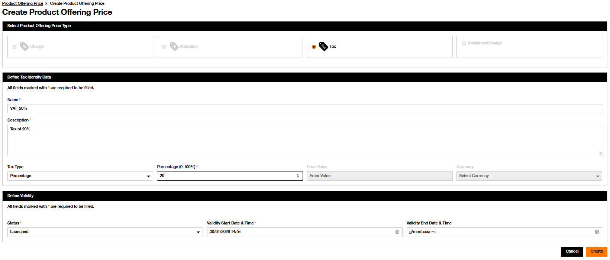{.img-zoomable}

    Then, click on Create button

    A message 'Product offering price has been created successfully' is displayed.

    !!! success "Result"
        The Product Offering Price Tax `VAT_20%` has been created.  

        ??? example "Illustration in the Product Offering Price Dashboard"
            The Product Offering Price Tax `VAT_20%` has been created with the ID `390ecc19-f113-4c9c-93f9-55906c82fa91` and is displayed in the Dashboard with a launched status.            
            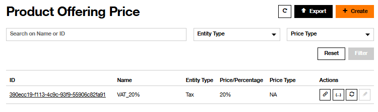{.img-zoomable} 

        ??? example "Illustration of the Product Offering Price Details" 
            It is also possible to visualize the Product Offering Price created  
            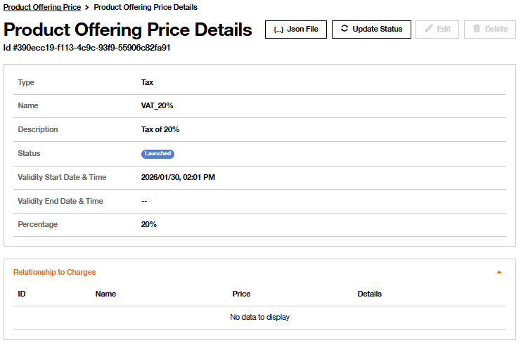{.img-zoomable}    

### 2. Recurring Charge with tax

!!! abstract "Marketing Requirement"
    Create a Recurring Charge of 24€ per month with tax included (20%).

??? info "Preconditions"
    - A Tax of 20% has been configured in the Product Catalog. See details [Tax in Percentage](../product-offering-price/#1-tax-in-percentage)
    - Currency to be used is already configured in the [Catalog Administration](../../catalog-administration/) section.

??? Quote "Create a Product Offering Price Charge" 

    ???+ note "'Select Product Offering Price Type' card"

         | Action                             | Value                                                     |  
         | -----------------------------------| --------------------------------------------------------- |  
         | Select Product Offering Price Type |  Charge  |  

    ???+ note "'Define Charge Identity Data' card"

         | Action                                                | Value                                        |     
         | ----------------------------------------------------- | -------------------------------------------- |    
         | Enter the **Name**                                    | Monthly_fee 24                               |  
         | Enter the **Description**                             | Recurring Charge of 24€/month (tax included) |  
         | Select the **Price Type**                             | Recurring Charge                             |  
         | Enter the **Price Value (Excl. Tax)**                 | 20                                           |  
         | Choose the **Currency**                               | EUR                                          |  
         | Enter the **Length of the Recurring Charge Period**   | 1                                            |  
         | Enter the **Duration of the Recurring Charge Period** | Month                                        |  
         | Choose the **Tax Code**                               | VAT_20%                                      |  
         | Check **Price Value (Incl. Tax)**                     | 24                                           |  
  
    ???+ note "'Define Relationship to Alterations' card"

         Not applicable in this use case.

    ??? example "Illustration of this configuration ODACAT UI"
        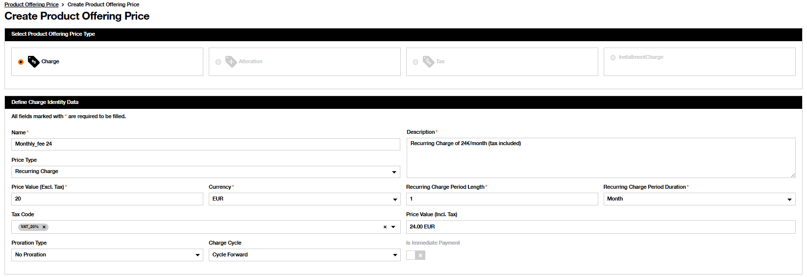{.img-zoomable}

    Once completed, click on the Create button to complete the creation of this Charge.

    A message 'Product offering price has been created successfully' is displayed

    !!! success "Result"
        The Product Offering Price Charge has been created.  

        ??? example "Illustration in the Product Offering Price Dashboard"
            The Product Offering Price Charge has been created with the ID `8f0f968a-e2f9-42a8-9f7e-0cab734ace9b` and is displayed in the Dashboard with a launched status.            
            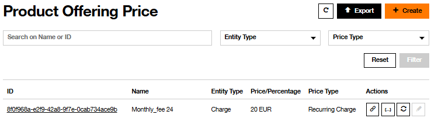{.img-zoomable} 
            *Note that the value of the Charge price displayed in the dashboard excludes the Tax alteration.*   

        ??? example "Illustration of the Product Offering Price Details" 
            It is also possible to visualize the Product Offering Price created:  
            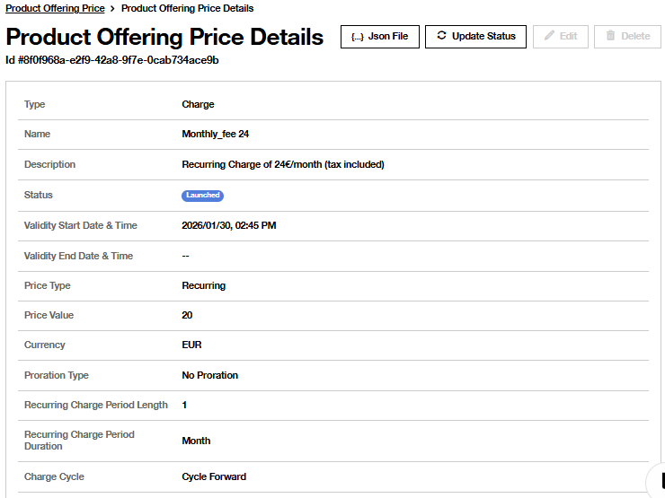{.img-zoomable}  

### 3. Recurring Percentage Alteration

!!! abstract "Marketing Requirement"
    Create a Recurring Discount of 10% per month.

??? info "Preconditions"
    No precondition.

??? Quote "Create a Product Offering Price Alteration" 
    
    ???+ note "'Select Product Offering Price Type' card"

         | Action                             | Value                                                                 |  
         | -----------------------------------| --------------------------------------------------------------------- |  
         | Select Product Offering Price Type |  Alteration  |  

    ???+ note "'Define Charge Identity Data' card"

         | Action                             | Value                  |  
         | ---------------------------------- | ---------------------- |    
         | Enter the **Name**                 | Discount_10%           |  
         | Enter the **Description**          | Recurring Discount 10% |  
         | Select the **Price Type**          | Recurring Alteration   |  
         | Choose the **Alteration Type**     | Percentage             |  
         | Choose the **Percentage (0-100%)** | 10                     |  
         | Enter the **Priority**             | 1                      |  

    In this use case, as the discount applies till the termination of the charge, the values of the **Application Duration Unit**, **Application Duration Length** and **Application Start** must be set as "null". In addition, it is not necessary to change the default value of the **Proration Type** (No proration). 

    The configuration of this Alteration in the ODACAT UI is:
    
    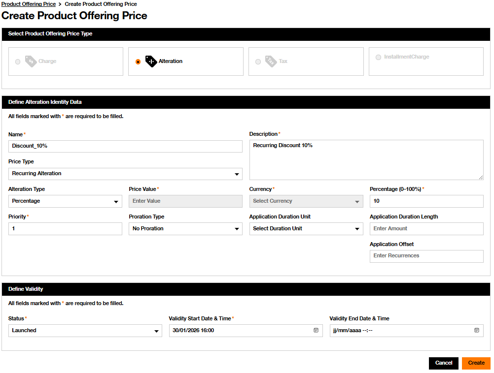{.img-zoomable}

    Once completed, click on the Create button to complete the creation of this Alteration.
  
    A message 'Product offering price has been created successfully' is displayed

    !!! success "Result"
        The Product Offering Price Alteration 'Recurring Discount 10'%' has been created.  

        ??? example "Illustration in the Product Offering Price Dashboard"
            The Product Offering Price Alteration 'Recurring Discount 10'%' has been created with the ID `6c2d42ea-52b6-4776-abb2-6518f93398c0` and is displayed in the Dashboard with a launched status.            
            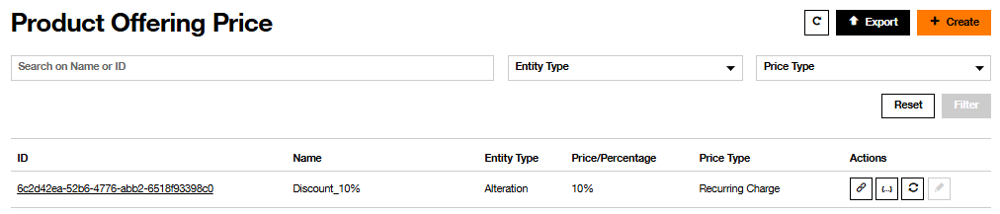{.img-zoomable} 

        ??? example "Illustration of the Product Offering Price Details" 
            It is also possible to visualize the Alteration created:  
            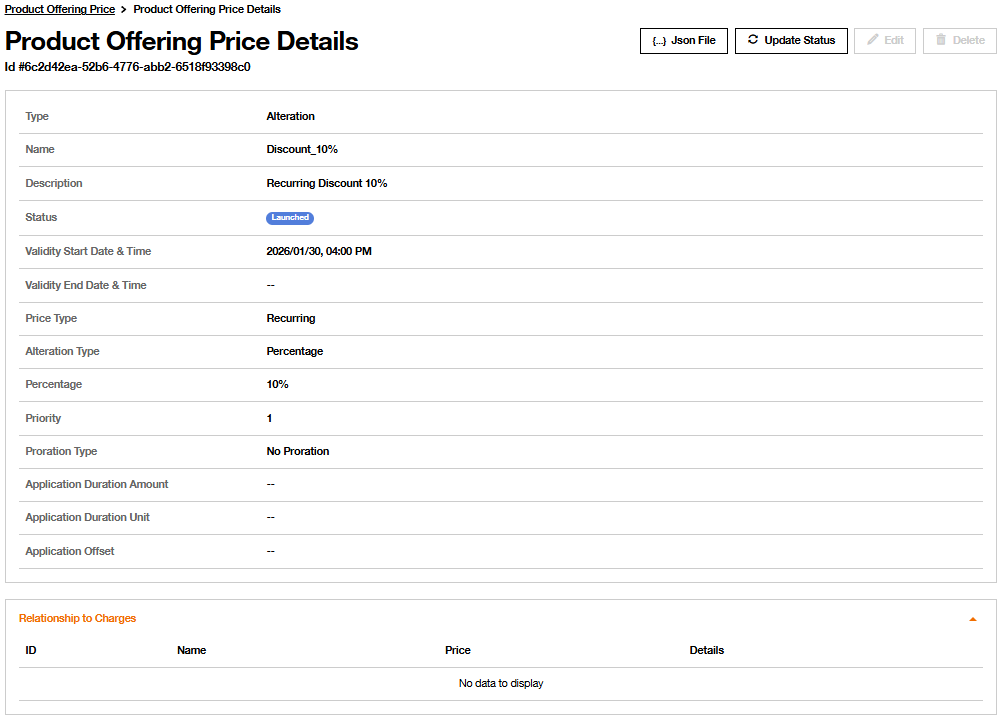{.img-zoomable}  

### 4. Recurring Percentage with Application Duration Alteration 

!!! abstract "Marketing Requirement"
    Create a Recurring Discount of 5% per month valid during 3 months.

??? info "Preconditions"
    Application Duration Unit to be used is already configured in the [Catalog Administration](../../catalog-administration/) section.

??? Quote "Create a Product Offering Price Alteration" 

    ???+ note "'Select Product Offering Price Type' card"

         | Action                             | Value                                                                 |  
         | -----------------------------------| --------------------------------------------------------------------- |  
         | Select Product Offering Price Type |  Alteration  |  

    ???+ note "'Define Charge Identity Data' card"

         | Action                                    | Value                                  |     
         | ----------------------------------------- | -------------------------------------- |    
         | Enter the **Name**                        | Discount_5%_3Months                    |  
         | Enter the **Description**                 | Discount 5% applicable during 3 months |  
         | Select the **Price Type**                 | Recurring Alteration                   |  
         | Choose the **Alteration Type**            | Percentage                             |  
         | Choose the **Percentage (0-100%)**        | 5                                      |  
         | Enter the **Application Duration Unit**   | Month                                  |  
         | Enter the **Application Duration Length** | 3                                      |  
         | Enter the **Priority**                    | 1                                      |  

    In this use case, it is not necessary to change the default value of the **Proration Type** (No Proration) or to configure **Application Start**.  

    The configuration of this Alteration in the ODACAT UI is:

    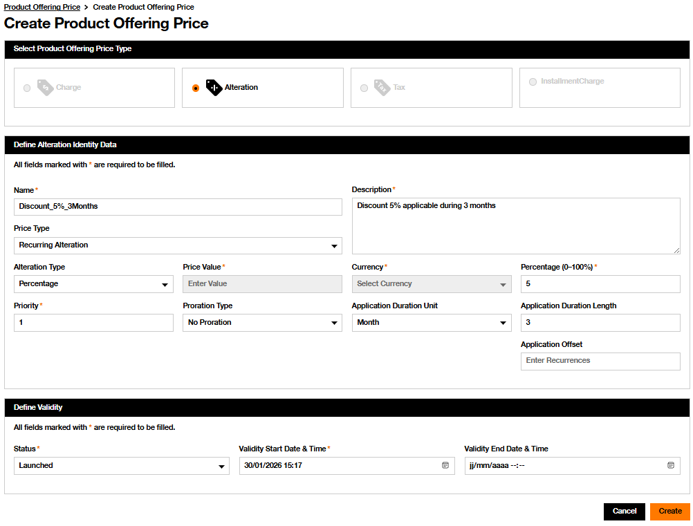{.img-zoomable}

    Once completed, click on the Create button to complete the creation of this Alteration.
  
    A message 'Product offering price has been created successfully' is displayed

    !!! success "Result"
        The Product Offering Price Alteration Recurring 'Discount_5%_3Months' has been created..  

        ??? example "Illustration in the Product Offering Price Dashboard"
            The Product Offering Price Alteration Recurring 'Discount_5%_3Months' has been created with the ID `d80cecc-842e-4a1a-8b24-7d0c8bf6ad87` and is displayed in the Dashboard with a launched status.            
            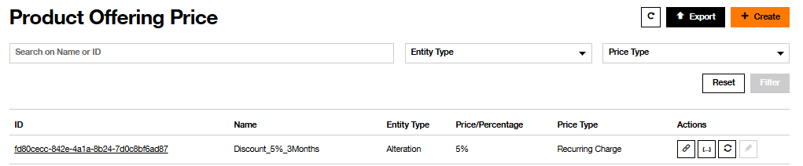{.img-zoomable} 

        ??? example "Illustration of the Product Offering Price Details" 
            It is also possible to visualize the Alteration created:  
            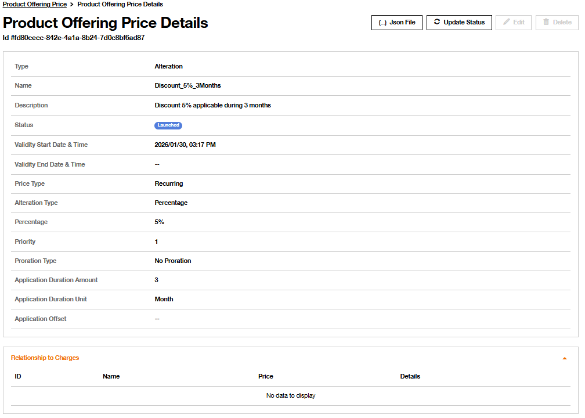{.img-zoomable}  

### 5. Recurring Price Alteration

!!! abstract "Marketing Requirement"
    Create a Recurring Discount of 3€ per month.

??? info "Preconditions"
    Currency to be used already configured in the [Catalog Administration](../../catalog-administration/) section.

??? Quote "Create a Product Offering Price Alteration" 

    ???+ note "'Select Product Offering Price Type' card"

         | Action                             | Value                                                                |  
         | -----------------------------------| -------------------------------------------------------------------- |  
         | Select Product Offering Price Type |  Alteration |  

    ???+ note "'Define Charge Identity Data' card"

         | Action                         | Value                 |     
         | ------------------------------ | --------------------- |    
         | Enter the **Name**             | Discount_3€_month     |  
         | Enter the **Description**      | Discount 3€ per month |  
         | Select the **Price Type**      | Recurring Alteration  |  
         | Choose the **Alteration Type** | Price                 |  
         | Choose the **Price Value**     | 3                     |  
         | Choose the **Currency**        | EUR                   |  
         | Enter the **Priority**         | 1                     |  

    In this use case, as the discount applies till the termination of the charge, the values of the **Application Duration Unit**, **Application Duration Length** and **Application Start** must be set as "null". In addition, it is also not necessary to change the default value of the **Proration Type** (No Proration).

    The configuration of this Alteration in the ODACAT UI is:  
    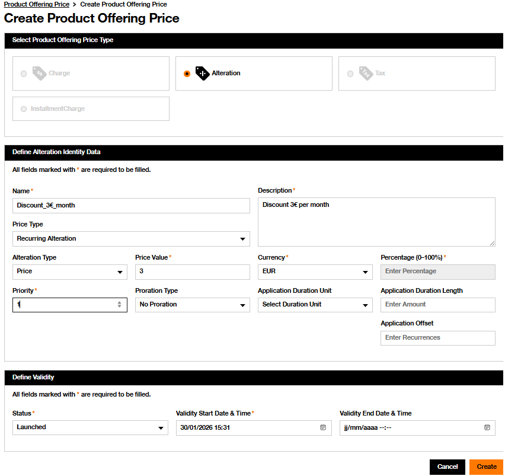{.img-zoomable}

    Once completed, click on the Create button to complete the creation of this Alteration.
  
    A message 'Product offering price has been created successfully' is displayed

    !!! success "Result"
        The Product Offering Price Alteration Recurring 'Discount_3€_month' has been created.  

        ??? example "Illustration in the Product Offering Price Dashboard"
            The Product Offering Price Alteration Recurring 'Discount_3€_month' has been created with ID `ead0845a-1b5c-4206-966f-8443ecd39e1a`and is displayed in the Dashboard with a launched status.            
            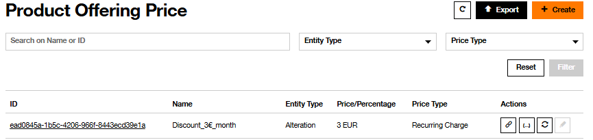{.img-zoomable} 

        ??? example "Illustration of the Product Offering Price Details" 
            It is also possible to visualize the Alteration created:  
            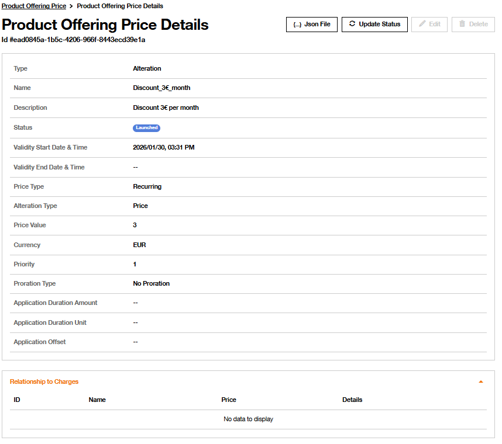{.img-zoomable}  

### 6. Recurring Price with Application Duration Alteration

!!! abstract "Marketing Requirement"
    Create a Recurring Discount of 2€ per month valid during 12 months.

??? info "Preconditions"
    - Currency to be used already configured in the [Catalog Administration](../../catalog-administration/) section.     
    - Application Duration Unit to be used already configured in the [Catalog Administration](../../catalog-administration/) section.

??? Quote "Create a Product Offering Price Alteration" 

    ???+ note "'Select Product Offering Price Type' card"

         | Action                             | Value                                                                |  
         | -----------------------------------| -------------------------------------------------------------------- |  
         | Select Product Offering Price Type |  Alteration |  

    ???+ note "'Define Charge Identity Data' card"

         | Action                                    | Value                                   |     
         | ----------------------------------------- | --------------------------------------- |    
         | Enter the **Name**                        | Discount_2€_12Months                    |  
         | Enter the **Description**                 | Discount 2€ applicable during 12 months |  
         | Select the **Price Type**                 | Recurring Alteration                    |  
         | Choose the **Alteration Type**            | Price                                   |  
         | Choose the **Price Value**                | 2                                       |  
         | Choose the **Currency**                   | EUR                                     |  
         | Choose the **Percentage (0-100%)**        |                                         |  
         | Enter the **Application Duration Unit**   | Month                                   |  
         | Enter the **Application Duration Length** | 12                                      |  
         | Enter the **Application Start**           |                                         |  
         | Enter the **Priority**                    | 1                                       |  

    In this use case, there is no need to change the default value of the **Proration Type** (No Proration) and no need to configure the **Application Start**. 

    The configuration of this Alteration in the ODACAT UI is:  
    {.img-zoomable}

    Once completed, click on the Create button to complete the creation of this Alteration.
  
    A message 'Product offering price has been created successfully' is displayed

    !!! success "Result"
        The Product Offering Price Alteration Recurring 'Discount_2€_12Months'.  

        ??? example "Illustration in the Product Offering Price Dashboard"
            The Product Offering Price Alteration Recurring 'Discount_2€_12Months' has been created with ID `be871ac7-63c0-4e48-b59f-1394346bbef7` and is displayed in the Dashboard with a launched status.            
            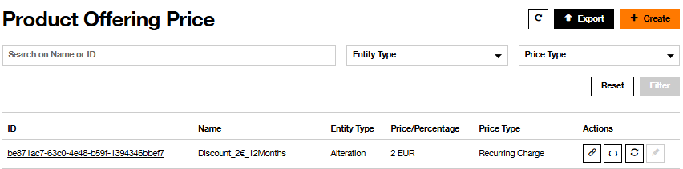{.img-zoomable} 

        ??? example "Illustration of the Product Offering Price Details" 
            It is also possible to visualize the Alteration created:  
            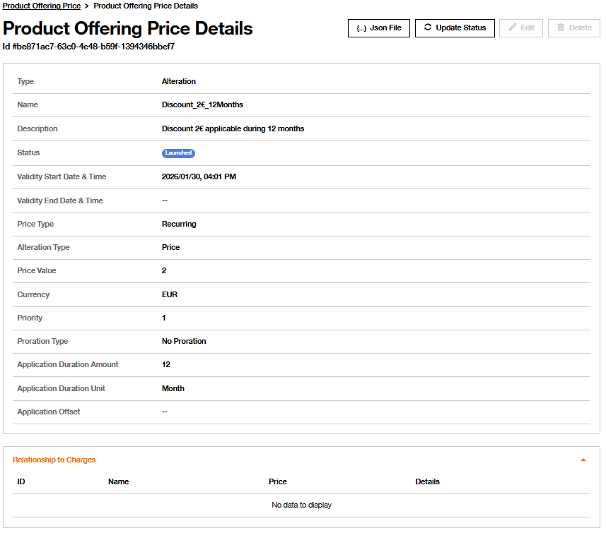{.img-zoomable}  

### 7. Non Recurring Percentage Alteration

!!! abstract "Marketing Requirement"
    Create a Discount of 100%.

??? info "Preconditions"
    No precondition.

??? Quote "Create a Product Offering Price Alteration" 

    ???+ note "'Select Product Offering Price Type' card"

         | Action                             | Value                                                                |  
         | -----------------------------------| -------------------------------------------------------------------- |  
         | Select Product Offering Price Type |  Alteration |  

    ???+ note "'Define Charge Identity Data' card"

         | Action                             | Value                    |     
         | ---------------------------------- | ------------------------ |    
         | Enter the **Name**                 | Discount_100%            |  
         | Enter the **Description**          | Discount 100%            |  
         | Select the **Price Type**          | Non Recurring Alteration |  
         | Choose the **Alteration Type**     | Percentage               |  
         | Choose the **Percentage (0-100%)** | 100                      |  

    The configuration of this Alteration in the ODACAT UI is:  
    {.img-zoomable}

    Once completed, click on the Create button to complete the creation of this Alteration.
  
    A message 'Product offering price has been created successfully' is displayed

    !!! success "Result"
        The Product Offering Price Alteration Non Recurring 'Discount_100%' has been created.  

        ??? example "Illustration in the Product Offering Price Dashboard"
            The Product Offering Price Alteration Non Recurring 'Discount_100%' has been created with ID `652d4de0-4621-43ac-9c69-32de9827cb82` and is displayed in the Dashboard with a launched status.            
            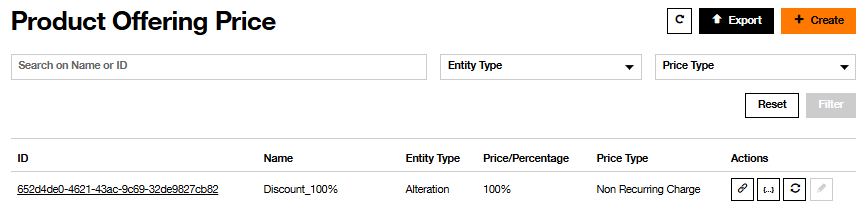{.img-zoomable} 

        ??? example "Illustration of the Product Offering Price Details" 
            It is also possible to visualize the Alteration created:  
            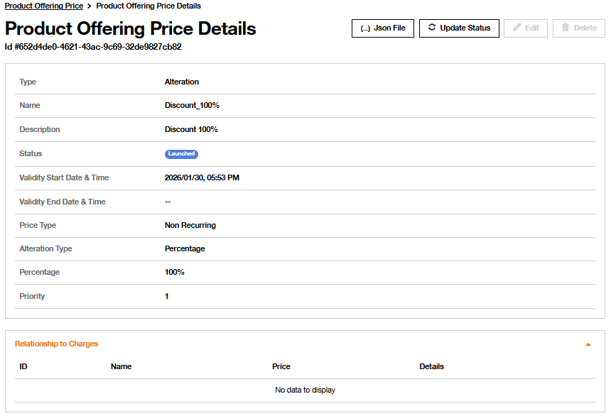{.img-zoomable}  

### 8. Non Recurring Price Alteration

!!! abstract "Marketing Requirement"
    Create a Discount of 50€.

??? info "Preconditions"
    No precondition.

??? Quote "Create a Product Offering Price Alteration" 

    ???+ note "'Select Product Offering Price Type' card"

         | Action                             | Value                                                                |  
         | -----------------------------------| -------------------------------------------------------------------- |  
         | Select Product Offering Price Type |  Alteration |  

    ???+ note "'Define Charge Identity Data' card"

         | Action                         | Value                    |     
         | ------------------------------ | ------------------------ |    
         | Enter the **Name**             | Discount_50€             |  
         | Enter the **Description**      | Discount 50€             |  
         | Select the **Price Type**      | Non Recurring Alteration |  
         | Choose the **Alteration Type** | Price                    |  
         | Choose the **Price Value**     | 50                       |  
         | Choose the **Currency**        | EUR                      |  
         | Enter the **Priority**         | 1                        |  

    The configuration of this Alteration in the ODACAT UI is:  
    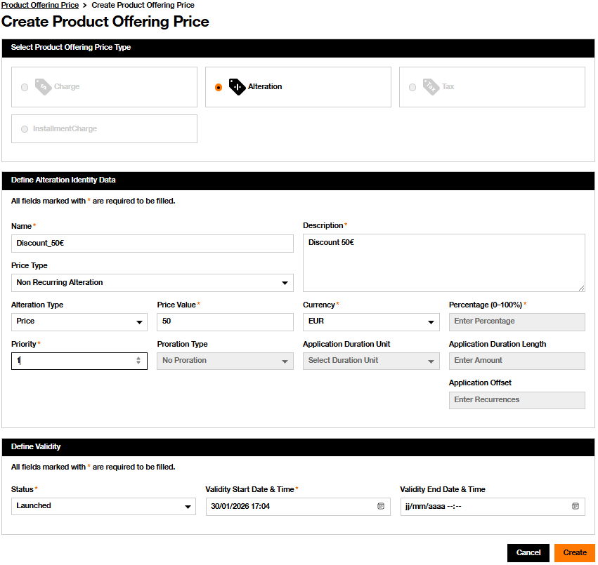{.img-zoomable}

    Once completed, click on the Create button to complete the creation of this Alteration.
    
    A message 'Product offering price has been created successfully' is displayed

    !!! success "Result"
        The Product Offering Price Alteration 'Discount_50€' has been created.  

        ??? example "Illustration in the Product Offering Price Dashboard"
            The Product Offering Price Alteration 'Discount_50€' has been created with ID `1c4af5ba-fdfb-4cbf-a3b5-b1fa10bd83fc` and is displayed in the Dashboard with a launched status.            
            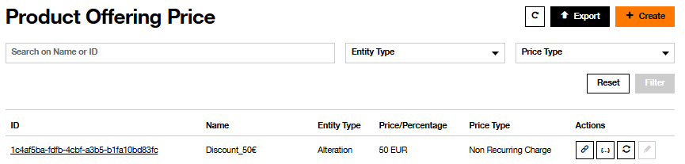{.img-zoomable} 

        ??? example "Illustration of the Product Offering Price Details" 
            It is also possible to visualize the Alteration created:  
            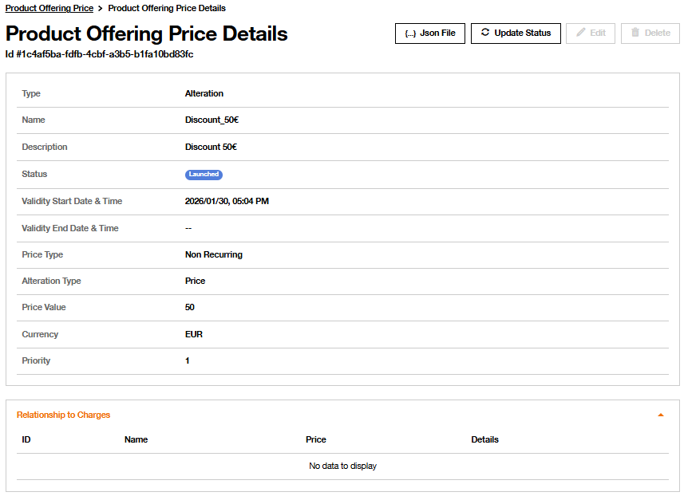{.img-zoomable}  

### 9. Recurring Charge Altered Percentage

!!! abstract "Marketing Requirement"
    Create a Recurring Charge of 30€ per month with 10% Discount.

??? info "Preconditions"
    - A Tax of 20% has been configured in the Product Catalog. See details [Tax in Percentage](../product-offering-price/#1-tax-in-percentage).
    - Currency to be used is already configured in the [Catalog Administration](../../catalog-administration/) section.
    - The recurring discount which will alter the Charge has been created. In our use case, this alteration is the 'recurring discount of 10% per month' created in use case [3. Alteration-Recurring-Percentage-Unlimited Application Duration](../product-offering-price/#3-alteration-recurring-percentage-unlimited-application-duration).

??? Quote "Create a Product Offering Price Charge" 

    ???+ note "'Select Product Offering Price Type' card"

         | Action                             | Value                                                     |  
         | -----------------------------------| --------------------------------------------------------- |  
         | Select Product Offering Price Type |  Charge  |  

    ???+ note "'Define Charge Identity Data' card"

         | Action                                                | Value                                                                |     
         | ----------------------------------------------------- | -------------------------------------------------------------------- |    
         | Enter the **Name**                                    | RC30€_month_A10%                                                     |  
         | Enter the **Description**                             | Recurring Charge of 30€/month (tax included) altered by 10% Discount |  
         | Select the **Price Type**                             | Recurring Charge                                                     |  
         | Enter the **Price Value (Excl. Tax)**                 | 25                                                                   |  
         | Choose the **Currency**                               | EUR                                                                  |  
         | Enter the **Length of the Recurring Charge Period**   | 1                                                                    |  
         | Enter the **Duration of the Recurring Charge Period** | Month                                                                |  
         | Choose the **Tax Code**                               | VAT_20%                                                              |  
         | Check **Price Value (Incl. Tax)**                     | 30                                                                   |  
         | Unchange default value **Proration Type**             | No Proration                                                         |  
         | Unchange default value **Charge Cycle**               | Cycle Forward                                                        |  

    ???+ note "'Define Relationship to Alterations' card"

         | Action                           | Value                       |     
         | -------------------------------- | --------------------------- |    
         | Search by Name                   | Discount_10%                |  
         | Select the **Alteration**        | Discount_10%                |  
         | Select the **Relationship Type** | Altered by *(defaut value)* |  
  
    ???+ note "'Define Validity' card"   

         | Action                  ,                                             | Value            |     
         | --------------------------------------------------------------------- | ---------------- |    
         | Check **Status**                                                      | Launched         |  
         | Update, if necessary, default value of **Validity Start Date & Time** | 02/02/2026 09:24 |  
         | Update, if necessary, default value of **Validity End Date & Time**   | *empty*          |  

    The configuration of this Charge in the ODACAT UI is:  
    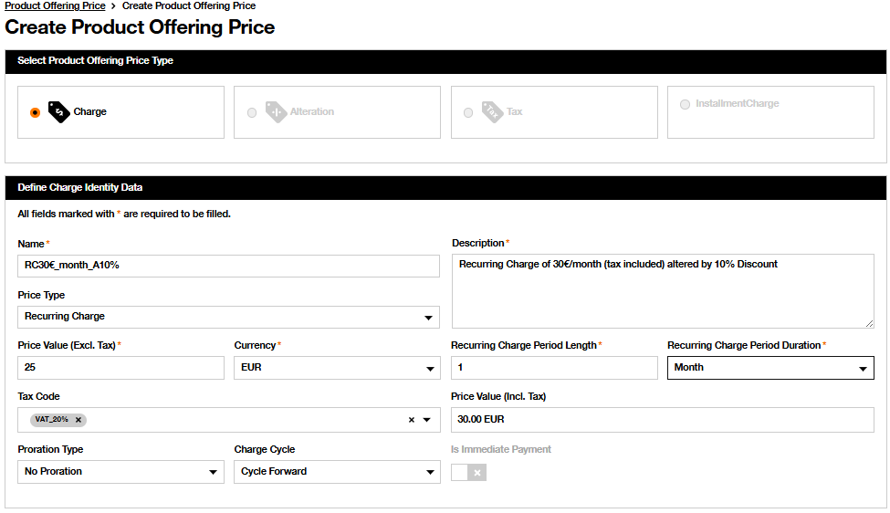{.img-zoomable}
   
    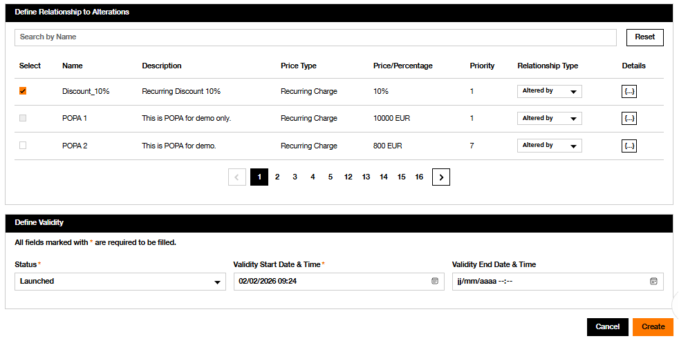{.img-zoomable}

    Once completed, click on the Create button to complete the creation of this Charge.

    A message 'Product offering price has been created successfully' is displayed

    !!! success "Result"
        The Product Offering Price Charge has been created.  

        ??? example "Illustration in the Product Offering Price Dashboard"
            The Product Offering Price Charge has been created with the ID `85fd55c2-f30d-43b7-9bde-16925ead6c1b` and is displayed in the Dashboard with a launched status.            
            {.img-zoomable} 

        ??? example "Illustration of the Product Offering Price Details" 
            It is also possible to visualize the Charge created:  
            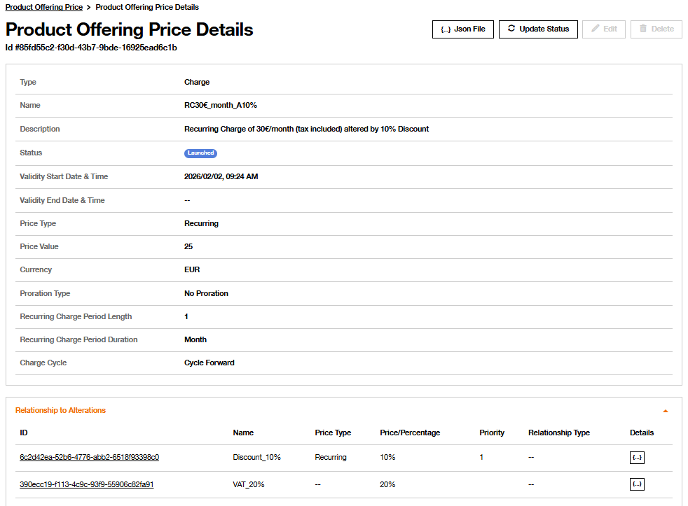{.img-zoomable}  

### 10. Recurring Charge Altered Percentage with Application Duration

!!! abstract "Marketing Requirement"
    Create a Recurring Charge of 40€ per month with 5% Discount during 3 months.

??? info "Preconditions"
    - A Tax of 20% has been configured in the Product Catalog. See details [Tax in Percentage](../product-offering-price/#1-tax-in-percentage).
    - Currency to be used is already configured in the [Catalog Administration](../../catalog-administration/) section.
    - The recurring discount which will alter the Charge has been created. In our use case, this alteration is the 'Discount_5%_3Months%' created in use case [4. Alteration-Recurring-Percentage-Limited Application Duration](../product-offering-price/#4-alteration-recurring-percentage-limited-application-duration).

??? Quote "Create a Product Offering Price Charge" 

    ???+ note "'Select Product Offering Price Type' card"

         | Action                             | Value                                                    |  
         | -----------------------------------| -------------------------------------------------------- |  
         | Select Product Offering Price Type |  Charge |  

    ???+ note "'Define Charge Identity Data' card"

         | Action | Value |     
         | ----------------------------------------------------- | ----------------------- |    
         | Enter the **Name**                                    | RC40€_month_A5%D3months |  
         | Enter the **Description**                             | Recurring Charge of 40€/month (tax included) altered by 5% Discount During 3 months|  
         | Select the **Price Type**                             | Recurring Charge        |  
         | Enter the **Price Value (Excl. Tax)**                 | 33.33                   |  
         | Choose the **Currency**                               | EUR                     |  
         | Enter the **Length of the Recurring Charge Period**   | 1                       |  
         | Enter the **Duration of the Recurring Charge Period** | Month                   |  
         | Choose the **Tax Code**                               | VAT_20%                 |  
         | Check **Price Value (Incl. Tax)**                     | 40                      |  
         | Unchange default value **Proration Type**             | No Proration            |  
         | Unchange default value **Charge Cycle**               | Cycle Forward           |  

    ???+ note "'Define Relationship to Alterations' card"

         | Action                            | Value                       |     
         | --------------------------------- | --------------------------- |    
         |  Search by Name                   | Discount_5%_3Months%        |  
         |  Select the **Alteration**        | Discount_5%_3Months         |  
         |  Select the **Relationship Type** | Altered by *(defaut value)* |  
  
    ???+ note "'Define Validity' card"   

         | Action                                                              | Value            |     
         | ------------------------------------------------------------------- | ---------------- |    
         | Check **Status**                                                    | Launched         |  
         | Update if necessary, default value of **Validity Start Date & Time** | 02/02/2026 10:00 |  
         | Update if necessary, default value of **Validity End Date & Time**   | *empty*          |  

    The configuration of this Charge in the ODACAT UI is:  
    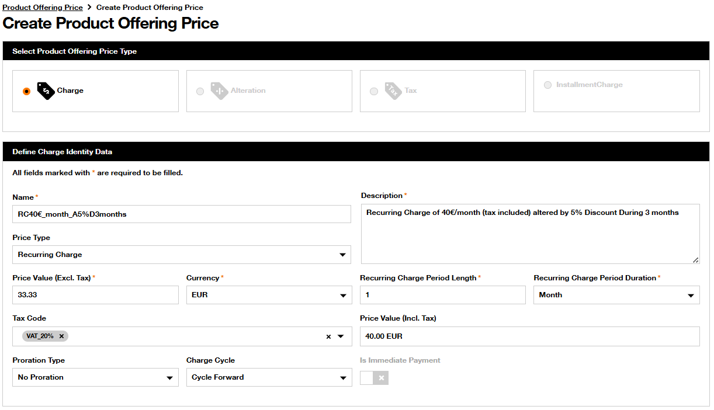{.img-zoomable}
   
    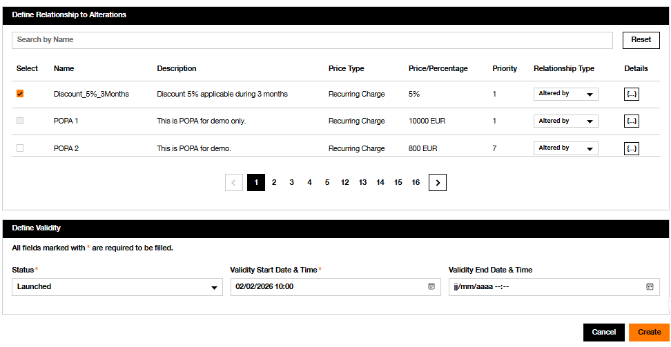{.img-zoomable}

    Once completed, click on the Create button to complete the creation of this Charge.

    A message 'Product offering price has been created successfully' is displayed

    !!! success "Result"
        The Product Offering Price Charge has been created.  

        ??? example "Illustration in the Product Offering Price Dashboard"
            The Product Offering Price Charge has been created with the ID `cfc82f70-55b4-45c9-b7b2-f3c81eb736bb` and is displayed in the Dashboard with a launched status.            
            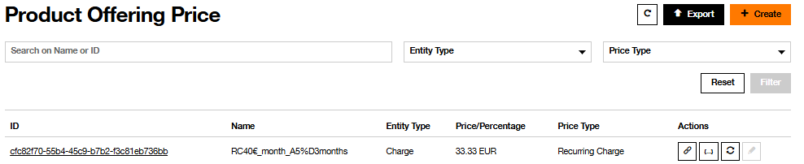{.img-zoomable} 

        ??? example "Illustration of the Product Offering Price Details" 
            It is also possible to visualize the Charge created:  
            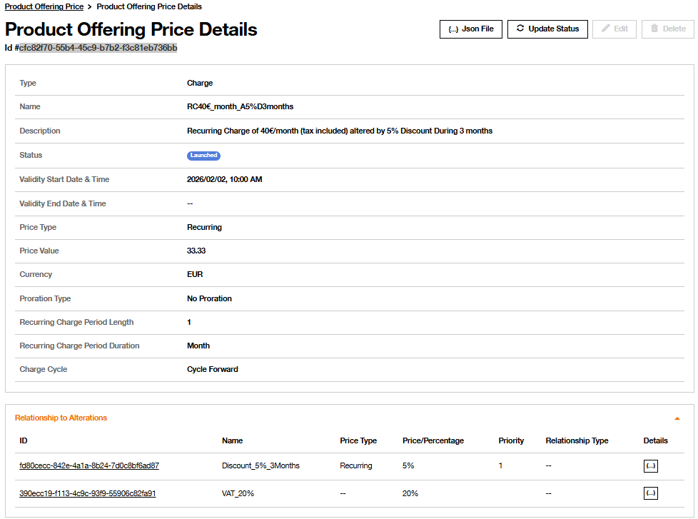{.img-zoomable}  

### 11. Recurring Charge Altered Price

!!! abstract "Marketing Requirement"
    Create a Recurring Charge of 60€ per month with 3€ Discount.

??? info "Preconditions"
    - A Tax of 20% has been configured in the Product Catalog. See details [Tax in Percentage](../product-offering-price/#1-tax-in-percentage).
    - Currency to be used is already configured in the [Catalog Administration](../../catalog-administration/) section.
    - The recurring discount which will alter the Charge has been created. In our use case, this alteration is the 'Discount_3€_month' created in use case [5. Alteration-Recurring-Price-Unlimited Application Duration](../product-offering-price/#5-alteration-recurring-price-unlimited-application-duration).

??? Quote "Create a Product Offering Price Charge" 

    ???+ note "'Select Product Offering Price Type' card"

         | Action                             | Value                                                    |  
         | -----------------------------------| -------------------------------------------------------- |  
         | Select Product Offering Price Type |  Charge |  

    ???+ note "'Define Charge Identity Data"
 
         | Action                                                | Value            |     
         | ----------------------------------------------------- | ---------------- |    
         | Enter the **Name**                                    | RC60€_month_A3€  |  
         | Enter the **Description**                             | Recurring Charge of 60€/month (tax included) altered by 3 |  
         | Select the **Price Type**                             | Recurring Charge |  
         | Enter the **Price Value (Excl. Tax)**                 | 50               |  
         | Choose the **Currency**                               | EUR              |  
         | Enter the **Length of the Recurring Charge Period**   | 1                |  
         | Enter the **Duration of the Recurring Charge Period** | Month            |  
         | Choose the **Tax Code**                               | VAT_20%          |  
         | Check **Price Value (Incl. Tax)**                     | 60               |  
         | Unchange default value **Proration Type**             | No Proration     |  
         | Unchange default value **Charge Cycle**               | Cycle Forward    |  

    ???+ note "'Define Relationship to Alterations' card"

         | Action                            | Value                       |     
         | --------------------------------- | --------------------------- |    
         |  Search by Name                   | Discount_3€_month           | 
         |  Select the **Alteration**        | Discount_3€_month           |  
         |  Select the **Relationship Type** | Altered by *(defaut value)* |  
  
    ???+ note "'Define Validity' card"   

         | Action                                                               | Value            |     
         | -------------------------------------------------------------------- | ---------------- |    
         | Check **Status**                                                     | Launched         |  
         | Update if necessary, default value of **Validity Start Date & Time** | 02/02/2026 10:10 |  
         | Update if necessary, default value of **Validity End Date & Time**   | *empty*          |  

    ??? example "Illustration of this configuration ODACAT UI"
        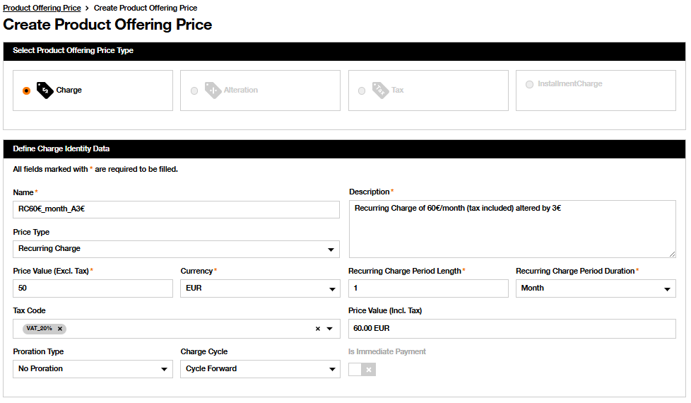{.img-zoomable}

        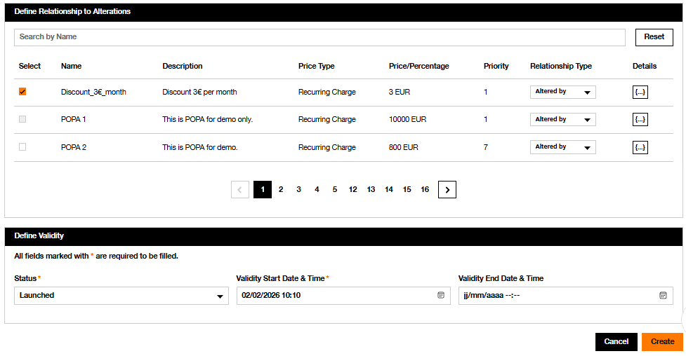{.img-zoomable}

    Once completed, click on the Create button to complete the creation of this Charge.

    A message 'Product offering price has been created successfully' is displayed

    !!! success "Result"
        The Product Offering Price Charge has been created.  

        ??? example "Illustration in the Product Offering Price Dashboard"
            The Product Offering Price Charge has been created with the ID `b06a025e-846b-4324-aef6-9d37b5a4bf51` and is displayed in the Dashboard with a launched status.            
            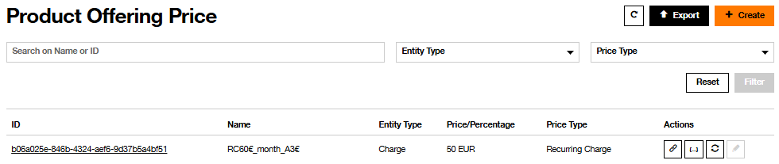{.img-zoomable} 

        ??? example "Illustration of the Product Offering Price Details" 
            It is also possible to visualize the Charge created:  
            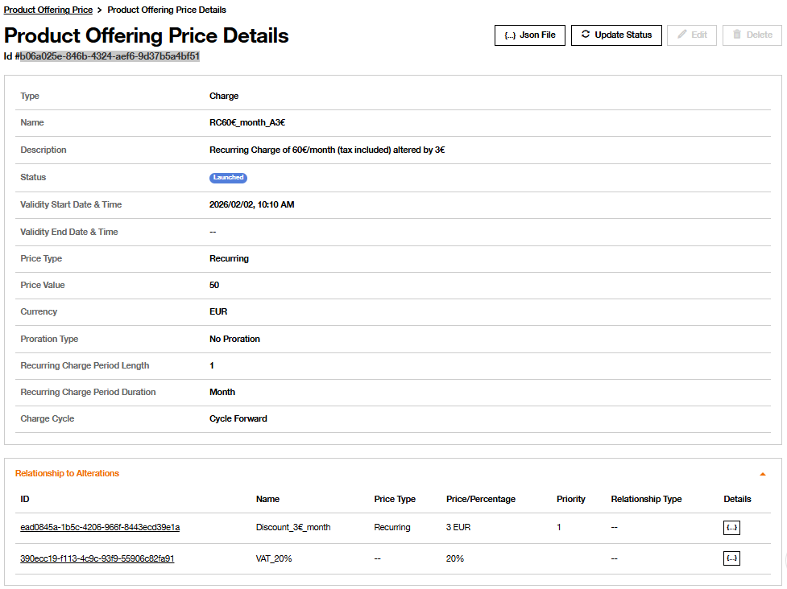{.img-zoomable}  

### 12. Recurring Charge Altered Price with Application Duration

!!! abstract "Marketing Requirement"
    Create a Recurring Charge of 12€ per month with 2€ Discount during 12 months.

??? info "Preconditions"
    - A Tax of 20% has been configured in the Product Catalog. See details [Tax in Percentage](../product-offering-price/#1-tax-in-percentage).
    - Currency to be used is already configured in the [Catalog Administration](../../catalog-administration/) section.
    - The recurring discount which will alter the Charge has been created. In our use case, this alteration is the 'Discount_2€_12Months'  created in use case [6. Alteration-Recurring-Price-Limited Application Duration](../product-offering-price/#6-alteration-recurring-price-limited-application-duration).

??? Quote "Create a Product Offering Price Charge" 

    ???+ note "'Select Product Offering Price Type' card"

         | Action                             | Value                                                    |  
         | -----------------------------------| -------------------------------------------------------- |  
         | Select Product Offering Price Type |  Charge |  

    ???+ note "'Define Charge Identity Data"
   
         | Action                                                | Value                    |     
         | ----------------------------------------------------- | ------------------------ |    
         | Enter the **Name**                                    | RC12€_month_A2€D12months |  
         | Enter the **Description**                             | Recurring Charge of 12€/month (tax included) altered by 2€ during 12 months |  
         | Select the **Price Type**                             | Recurring Charge         |  
         | Enter the **Price Value (Excl. Tax)**                 | 10                       |  
         | Choose the **Currency**                               | EUR                      |  
         | Enter the **Length of the Recurring Charge Period**   | 1                        |  
         | Enter the **Duration of the Recurring Charge Period** | Month                    |  
         | Choose the **Tax Code**                               | VAT_20%                  |  
         | Check **Price Value (Incl. Tax)**                     | 12                       |  
         | Unchange default value **Proration Type**             | No Proration             |  
         | Unchange default value **Charge Cycle**               | Cycle Forward            |  

    ???+ note "'Define Relationship to Alterations' card"

         | Action                           | Value                       |     
         | -------------------------------- | --------------------------- |    
         | Search by Name                   | Discount_2€_12Months        | 
         | Select the **Alteration**        | Discount_2€_12Months        |  
         | Select the **Relationship Type** | Altered by *(defaut value)* |  
  
    ???+ note "'Define Validity' card" 

         | Action                                                               | Value            |     
         | -------------------------------------------------------------------- | ---------------- |    
         | Check **Status**                                                     | Launched         |  
         | Update if necessary, default value of **Validity Start Date & Time** | 02/02/2026 10:30 |  
         | Update if necessary, default value of **Validity End Date & Time**   | *empty*          |  

    The configuration of this Charge in the ODACAT UI is:  
    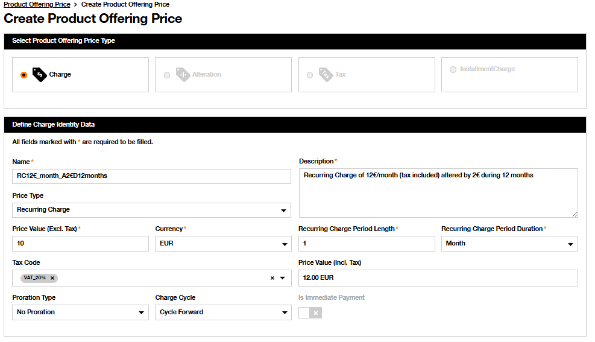{.img-zoomable}
   
    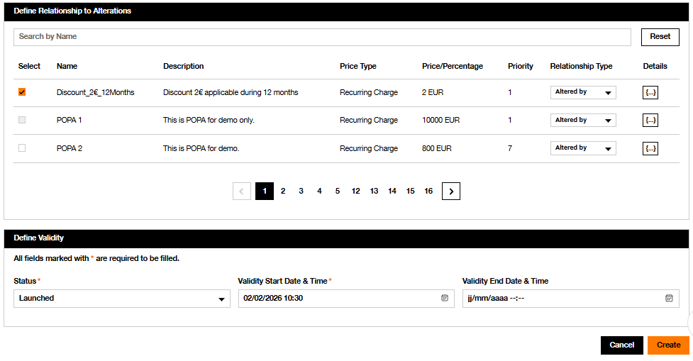{.img-zoomable}

    Once completed, click on the Create button to complete the creation of this Charge.

    A message 'Product offering price has been created successfully' is displayed

    !!! success "Result"
        The Product Offering Price Charge has been created.  

        ??? example "Illustration in the Product Offering Price Dashboard"
            The Product Offering Price Charge has been created with the ID `3e88e42c-6ff7-4bff-8e7a-c457f11ea80a` and is displayed in the Dashboard with a launched status.            
            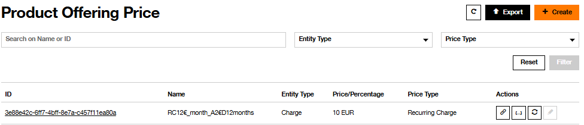{.img-zoomable} 

        ??? example "Illustration of the Product Offering Price Details" 
            It is also possible to visualize the Charge created:  
            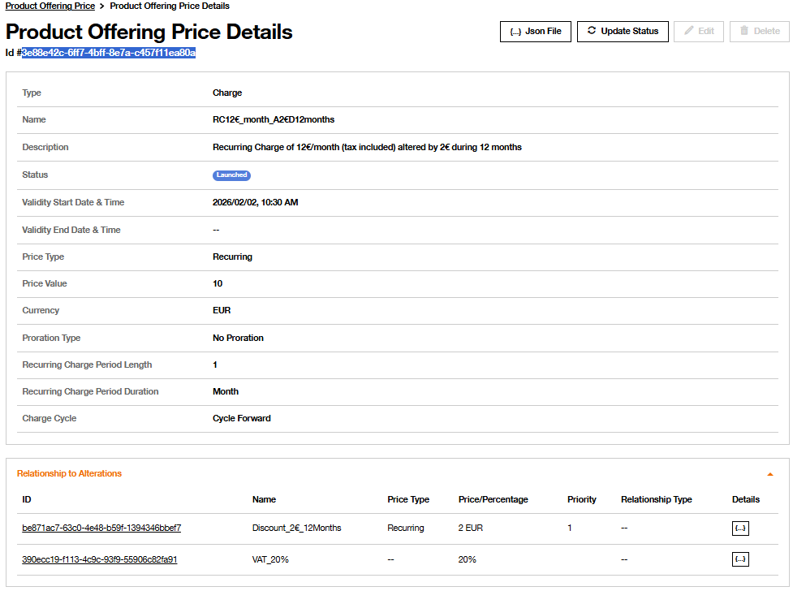{.img-zoomable}  

### 13. Recurring Charge Altered Price with Specific Time frame

!!! abstract "Marketing Requirement"
    Create a Recurring Charge of 12€ per month with 8€ Discount starting from Month#4.

??? info "Preconditions"
    - A Tax of 20% has been configured in the Product Catalog. See details [Tax in Percentage](../product-offering-price/#1-tax-in-percentage).
    - Currency to be used is already configured in the [Catalog Administration](../../catalog-administration/) section.

??? Quote "Create a Product Offering Price Alteration" 

    ???+ note "'Select Product Offering Price Type' card"

         | Action                             | Value                                                                |  
         | -----------------------------------| -------------------------------------------------------------------- |  
         | Select Product Offering Price Type |  Alteration |  

    ???+ note "'Define Charge Identity Data' card"

         | Action                                    | Value                          |     
         | ----------------------------------------- | ------------------------------ |    
         | Enter the **Name**                        | Discount_8€_S4                 |  
         | Enter the **Description**                 | Discount 8€ Start from month#4 |  
         | Select the **Price Type**                 | Recurring Alteration           |  
         | Choose the **Alteration Type**            | Price                          |  
         | Choose the **Price Value**                | 8                              |  
         | Choose the **Currency**                   | EUR                            |  
         | Choose the **Percentage (0-100%)**        |                                |  
         | Enter the **Application Duration Unit**   |                                |  
         | Enter the **Application Duration Length** |                                |  
         | Enter the **Application Start**           | 4                              |  
         | Enter the **Priority**                    | 1                              |  

    In this use case, there is no need to change the default value of the **Proration Type** (No Proration) and no need to configure the **Application Duration**. 

    The configuration of this Alteration in the ODACAT UI is:  
    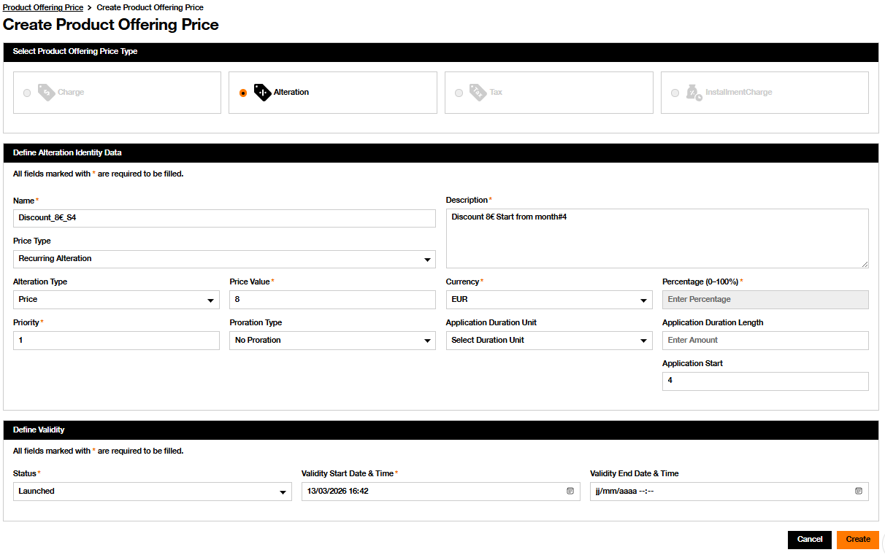{.img-zoomable}  

    Once completed, click on the Create button to complete the creation of this Alteration.
  
    A message 'Product offering price has been created successfully' is displayed

    !!! success "Result"
        The Product Offering Price Alteration Recurring 'Discount_8€_S4'.  

        ??? example "Illustration in the Product Offering Price Dashboard"
            The Product Offering Price Alteration Recurring 'Discount_8€_S4' has been created with ID `6accb536-5185-4fc5-84de-82b1ce5b84bc` and is displayed in the Dashboard with a launched status.            
            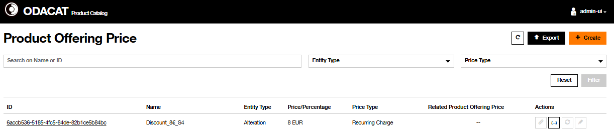{.img-zoomable} 

        ??? example "Illustration of the Product Offering Price Details" 
            It is also possible to visualize the Alteration created:  
            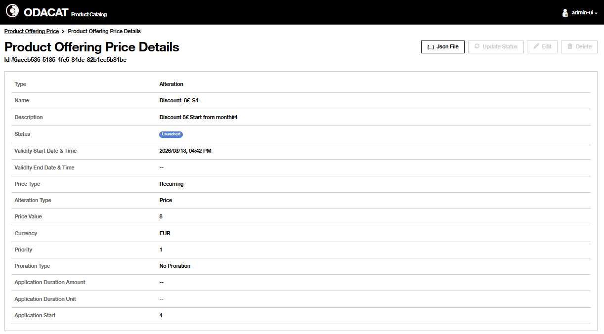{.img-zoomable}  

??? Quote "Create a Product Offering Price Charge" 

    ???+ note "'Select Product Offering Price Type' card"

         | Action                             | Value                                                    |  
         | -----------------------------------| -------------------------------------------------------- |  
         | Select Product Offering Price Type |  Charge |  

    ???+ note "'Define Charge Identity Data' card"

         | Action                                                | Value              |     
         | ----------------------------------------------------- | ------------------ |    
         | Enter the **Name**                                    | RC12€_month_A8€S4  |  
         | Enter the **Description**                             | Recurring Charge of 12€/month (tax included) altered by 8€ starting from Month#4 |  
         | Select the **Price Type**                             | Recurring Charge   |  
         | Enter the **Price Value (Excl. Tax)**                 | 10                 |  
         | Choose the **Currency**                               | EUR                |  
         | Enter the **Length of the Recurring Charge Period**   | 1                  |  
         | Enter the **Duration of the Recurring Charge Period** | Month              |  
         | Choose the **Tax Code**                               | VAT_20%            |  
         | Check **Price Value (Incl. Tax)**                     | 12                 |  
         | Unchange default value **Proration Type**             | No Proration       |  
         | Unchange default value **Charge Cycle**               | Cycle Forward      |  

    ???+ note "'Define Relationship to Alterations' card"

         | Action                           | Value                       |     
         | -------------------------------- | --------------------------- |    
         | Search by Name                   | Discount_8€_S4              | 
         | Select the **Alteration**        | Discount_8€_S4              |  
         | Select the **Relationship Type** | Altered by *(defaut value)* |  
  
    ???+ note "'Define Validity' card" 

         | Action                                                              | Value            |     
         | ------------------------------------------------------------------- | ---------------- |    
         | Check **Status**                                                    | Launched         |  
         | Update if necessary, default value of **Validity Start Date & Time** | 02/02/2026 10:30 |  
         | Update if necessary, default value of **Validity End Date & Time**   | *empty*          |  

    ??? example "Illustration of this configuration ODACAT UI"
        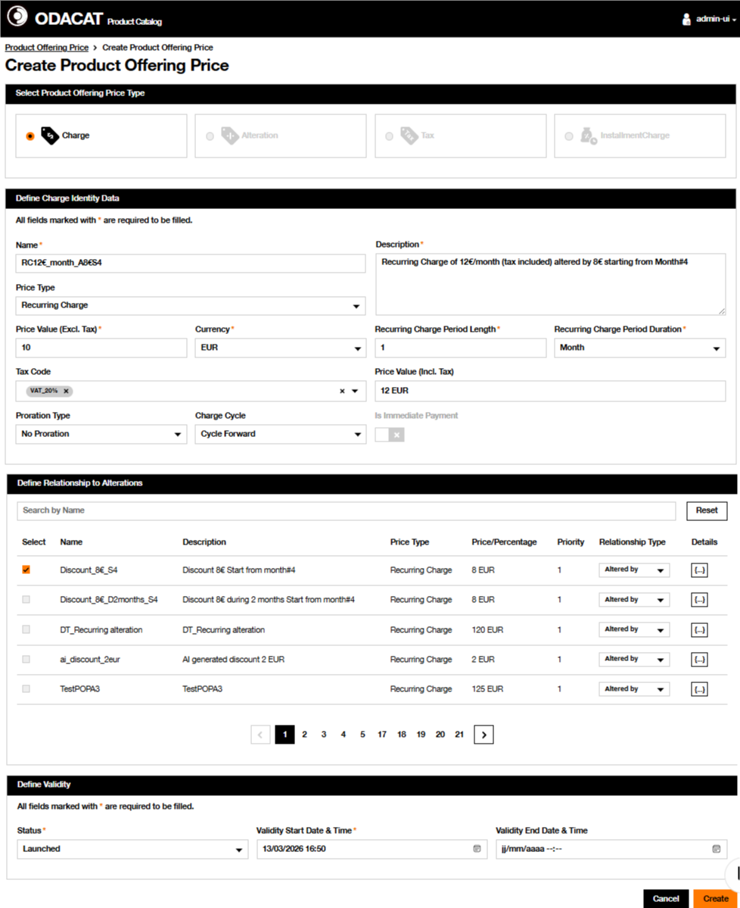{.img-zoomable}

    Once completed, click on the Create button to complete the creation of this Charge.

    A message 'Product offering price has been created successfully' is displayed

    !!! success "Result"
        The Product Offering Price Charge has been created.  

        ??? example "Illustration in the Product Offering Price Dashboard"
            The Product Offering Price Charge has been created with the ID `166be963-09d7-40d6-8bc0-2b8f8027f548` and is displayed in the Dashboard with a launched status.            
            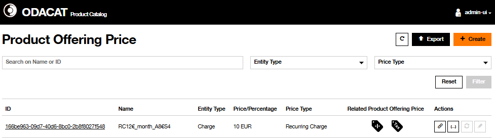{.img-zoomable} 

        ??? example "Illustration of the Product Offering Price Details" 
            It is also possible to visualize the Charge created:  
            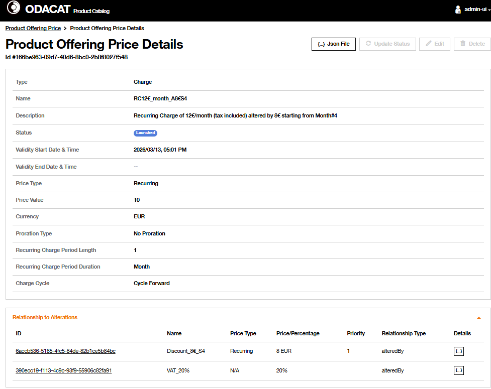{.img-zoomable}  

### 14. Recurring Charge Altered Price with Application Duration and Specific Time frame

!!! abstract "Marketing Requirement"
    Create a Recurring Charge of 12€ per month with 10€ Discount starting from Month#4 for 2 months.

??? info "Preconditions"
    - A Tax of 20% has been configured in the Product Catalog. See details [Tax in Percentage](../product-offering-price/#1-tax-in-percentage).
    - Currency to be used is already configured in the [Catalog Administration](../../catalog-administration/) section.

??? Quote "Create a Product Offering Price Alteration" 

    ???+ note "'Select Product Offering Price Type' card"

         | Action                             | Value                                                                |  
         | -----------------------------------| -------------------------------------------------------------------- |  
         | Select Product Offering Price Type |  Alteration |  

    ???+ note "'Define Charge Identity Data' card"

         | Action                                    | Value                                          |     
         | ----------------------------------------- | ---------------------------------------------- |    
         | Enter the **Name**                        | Discount_8€_D2months_S4                        |  
         | Enter the **Description**                 | Discount 8€ during 2 months Start from month#4 |  
         | Select the **Price Type**                 | Recurring Alteration                           |  
         | Choose the **Alteration Type**            | Price                                          |  
         | Choose the **Price Value**                | 8                                              |  
         | Choose the **Currency**                   | EUR                                            |  
         | Choose the **Percentage (0-100%)**        |                                                |  
         | Enter the **Application Duration Unit**   | 2                                              |  
         | Enter the **Application Duration Length** | Months                                         |  
         | Enter the **Application Start**           | 4                                              |  
         | Enter the **Priority**                    | 1                                              |  

    In this use case, there is no need to change the default value of the **Proration Type** (No Proration).

    The configuration of this Alteration in the ODACAT UI is:  
    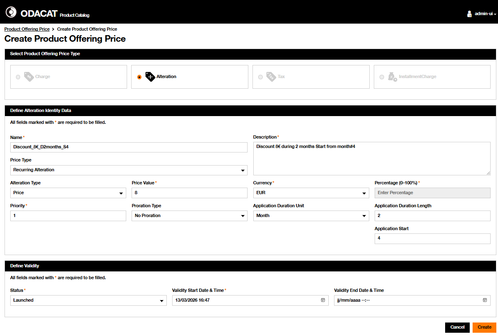{.img-zoomable}

    Once completed, click on the Create button to complete the creation of this Alteration.
  
    A message 'Product offering price has been created successfully' is displayed

    !!! success "Result"
        The Product Offering Price Alteration Recurring 'Discount_8€_D2months_S4' has been created.  

        ??? example "Illustration in the Product Offering Price Dashboard"
            The Product Offering Price Alteration Recurring 'Discount_8€_D2months_S4' has been created with ID `6b261fd9-a9a9-40a8-832a-41c6ff385f09` and is displayed in the Dashboard with a launched status.            
            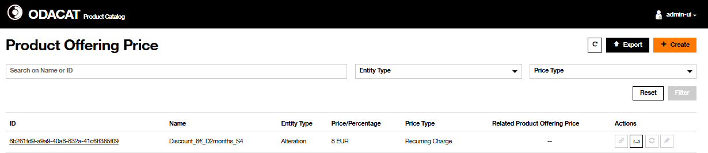{.img-zoomable} 

        ??? example "Illustration of the Product Offering Price Details" 
            It is also possible to visualize the Alteration created:  
            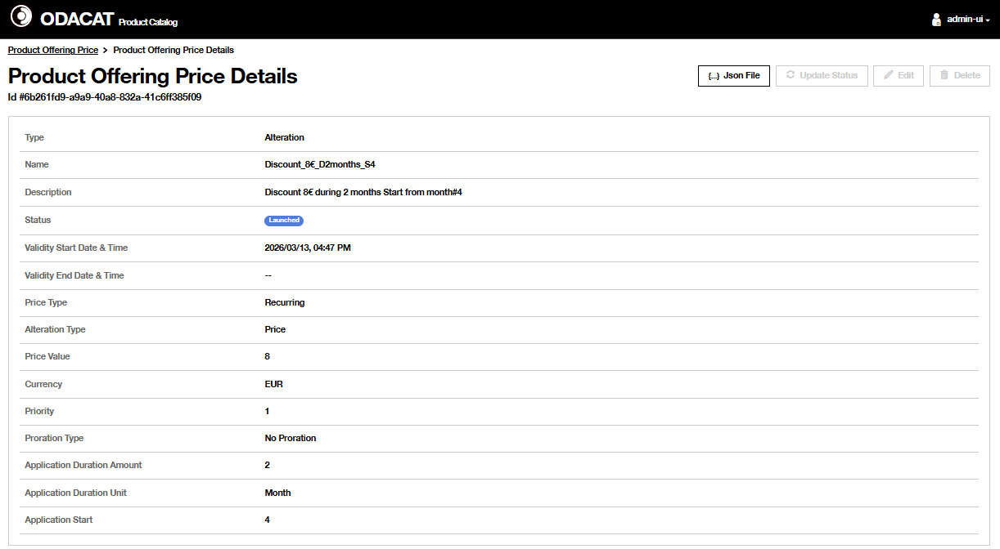{.img-zoomable}  

??? Quote "Create a Product Offering Price Charge" 

    ???+ note "'Select Product Offering Price Type' card"

         | Action                             | Value                                                    |  
         | -----------------------------------| -------------------------------------------------------- |  
         | Select Product Offering Price Type |  Charge |  

    ???+ note "'Define Charge Identity Data' card"

         | Action                                                | Value                     |     
         | ----------------------------------------------------- | ------------------------- |    
         | Enter the **Name**                                    | RC12€_month_A8€D2monthsS4 |  
         | Enter the **Description**                             | Recurring Charge of 12€/month (tax included) altered by 8€ during 2 months starting from Month#4 |  
         | Select the **Price Type**                             | Recurring Charge         |  
         | Enter the **Price Value (Excl. Tax)**                 | 10                       |  
         | Choose the **Currency**                               | EUR                      |  
         | Enter the **Length of the Recurring Charge Period**   | 1                        |  
         | Enter the **Duration of the Recurring Charge Period** | Month                    |  
         | Choose the **Tax Code**                               | VAT_20%                  |  
         | Check **Price Value (Incl. Tax)**                     | 12                       |  
         | Unchange default value **Proration Type**             | No Proration             |  
         | Unchange default value **Charge Cycle**               | Cycle Forward            |  

    ???+ note "'Define Relationship to Alterations' card"

         | Action                           | Value                       |     
         | -------------------------------- | --------------------------- |    
         | Search by Name                   | Discount_8€_D2months_S4     | 
         | Select the **Alteration**        | Discount_8€_D2months_S4     |  
         | Select the **Relationship Type** | Altered by *(defaut value)* |  
  
    ???+ note "'Define Validity' card" 

         | Action                                                               | Value            |     
         | -------------------------------------------------------------------- | ---------------- |    
         | Check **Status**                                                     | Launched         |  
         | Update if necessary, default value of **Validity Start Date & Time** | 02/02/2026 10:30 |  
         | Update if necessary, default value of **Validity End Date & Time**   | *empty*          |  

    ??? example "Illustration of this configuration ODACAT UI"
        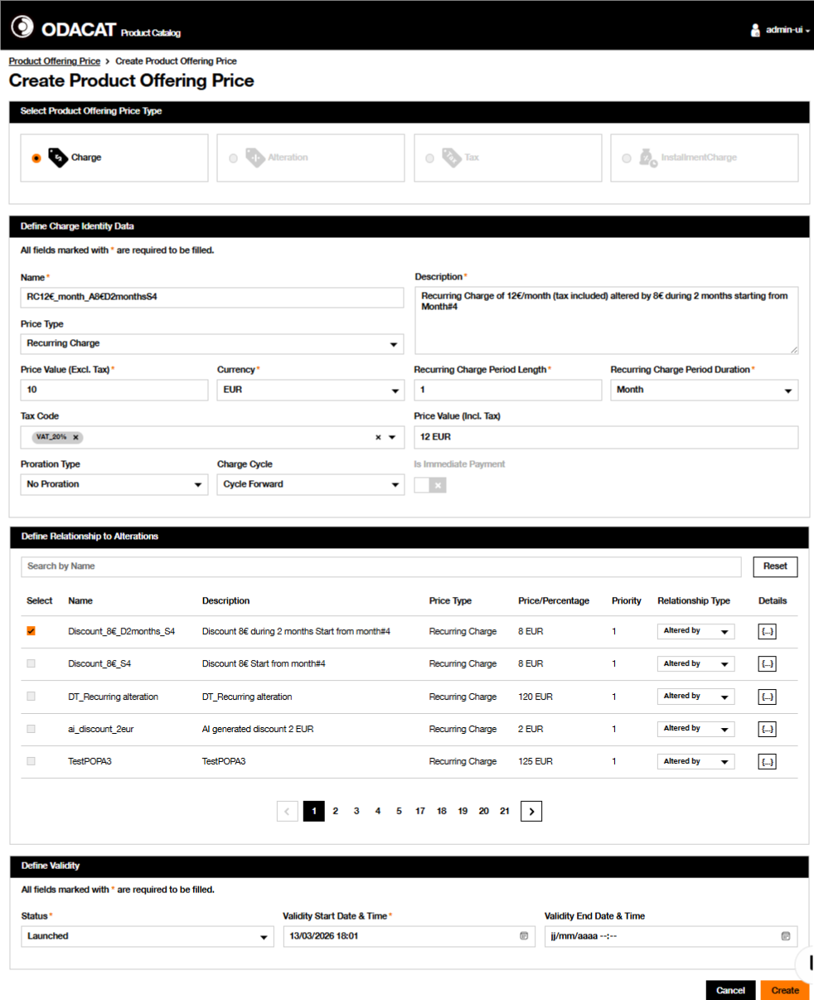{.img-zoomable}

    Once completed, click on the Create button to complete the creation of this Charge.

    A message 'Product offering price has been created successfully' is displayed

    !!! success "Result"
        The Product Offering Price Charge has been created.  

        ??? example "Illustration in the Product Offering Price Dashboard"
            The Product Offering Price Charge has been created with the ID `0aecefb0-8e4c-46a7-9c34-f053794263f1` and is displayed in the Dashboard with a launched status.            
            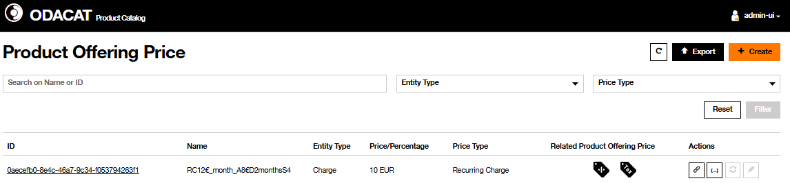{.img-zoomable} 

        ??? example "Illustration of the Product Offering Price Details" 
            It is also possible to visualize the Charge created:  
            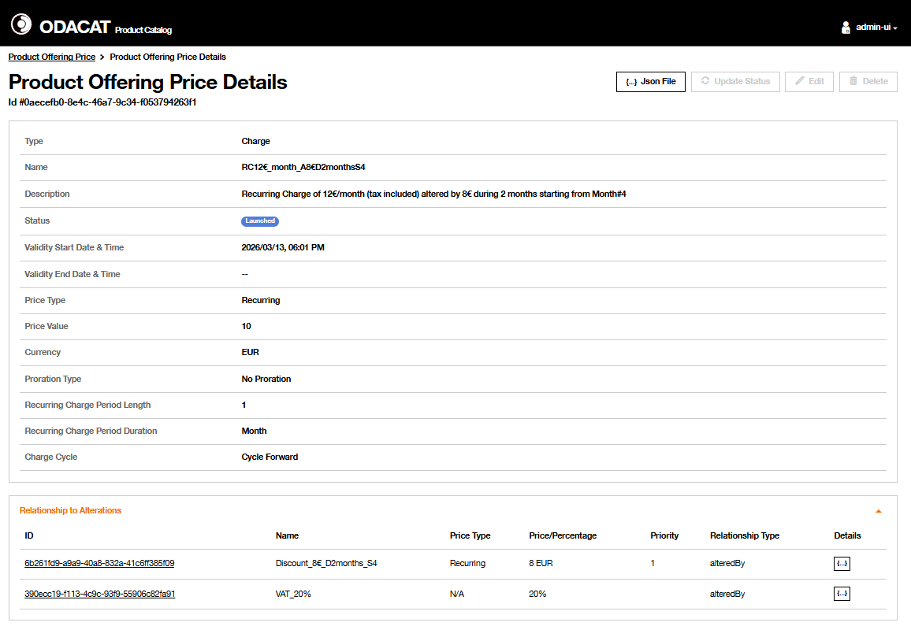{.img-zoomable}  

### 15. Non Recurring Charge Immediate Payment Altered-Percentage

!!! abstract "Marketing Requirement"
    Create a Non-Recurring Charge of 6€ with Immediate Payment and with a 100% Discount.

??? info "Preconditions"
    - A Tax of 20% has been configured in the Product Catalog. See details [Tax in Percentage](../product-offering-price/#1-tax-in-percentage).
    - Currency to be used is already configured in the [Catalog Administration](../../catalog-administration/) section.
    - The non recurring discount which will alter the Charge has been created. In our use case, this alteration is the 'Discount_100%' created in use case [7. Alteration-Non Recurring-Percentage](../product-offering-price/#7-alteration-non-recurring-percentage).

??? Quote "Create a Product Offering Price Charge" 

    ???+ note "'Select Product Offering Price Type' card"

         | Action                             | Value                                                    |  
         | -----------------------------------| -------------------------------------------------------- |  
         | Select Product Offering Price Type |  Charge |  

    ???+ note "'Define Charge Identity Data' card"

         | Action                                  | Value                                                     |     
         | --------------------------------------- | --------------------------------------------------------- |    
         | Enter the **Name**                      | NRC6€A100%                                                |  
         | Enter the **Description**               | Non Recurring Charge of 6€ (tax included) altered by 100% |  
         | Select the **Price Type**               | Non Recurring Charge                                      |  
         | Enter the **Price Value (Excl. Tax)**   | 5                                                         |  
         | Choose the **Currency**                 | EUR                                                       |  
         | Choose the **Tax Code**                 | VAT_20%                                                   |  
         | Check **Price Value (Incl. Tax)**       | 6                                                         |  
         | Enable or Disable **Immediate Payment** | **Enabled**                                               |  

    ???+ note "'Define Relationship to Alterations' card"

         | Action                           | Value                       |     
         | -------------------------------- | --------------------------- |    
         | Search by Name                   | Discount_100%               | 
         | Select the **Alteration**        | Discount_100%               |  
         | Select the **Relationship Type** | Altered by *(defaut value)* |  
  
    ???+ note "'Define Validity' card"   

         | Action                                                               | Value            |     
         | -------------------------------------------------------------------- | ---------------- |    
         | Check **Status**                                                     | Launched         |  
         | Update if necessary, default value of **Validity Start Date & Time** | 02/02/2026 11:00 |  
         | Update if necessary, default value of **Validity End Date & Time**   | *empty*          |  

    ??? example "Illustration of this configuration ODACAT UI"
        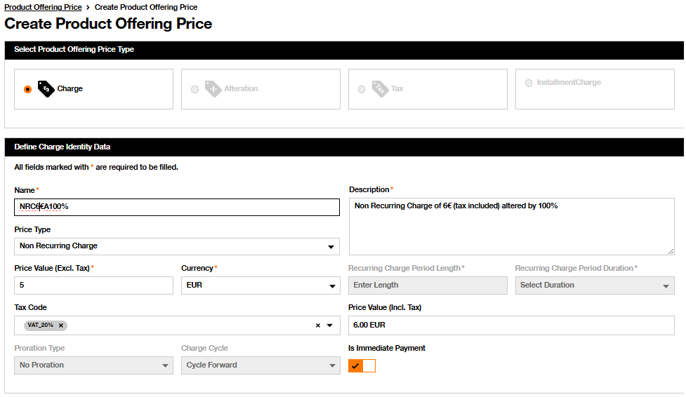{.img-zoomable}
        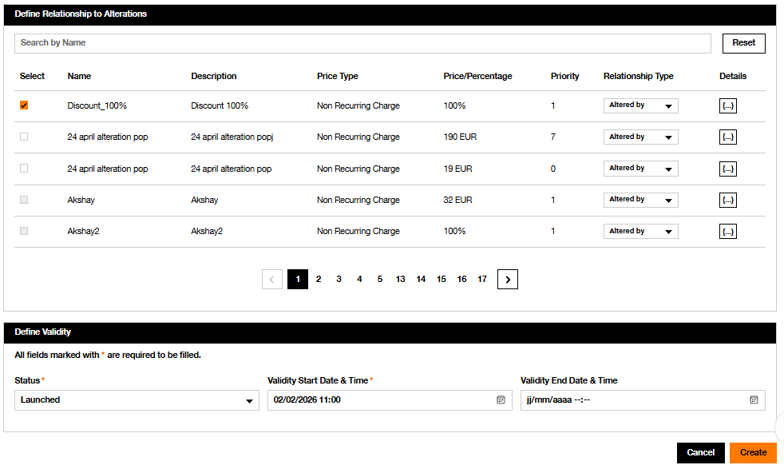{.img-zoomable}

    Once completed, click on the Create button to complete the creation of this Charge.

    A message 'Product offering price has been created successfully' is displayed

    !!! success "Result"
        The Product Offering Price Charge has been created.  

        ??? example "Illustration in the Product Offering Price Dashboard"
            The Product Offering Price Charge has been created with the ID `3aaa73d9-a4b0-4491-91ef-73be885738b7` and is displayed in the Dashboard with a launched status.            
            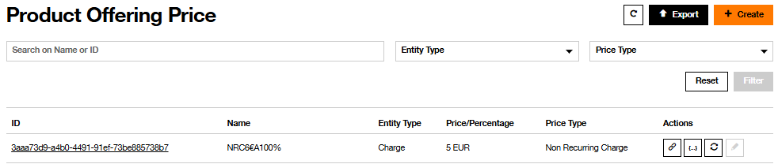{.img-zoomable} 

        ??? example "Illustration of the Product Offering Price Details" 
            It is also possible to visualize the Charge created:  
            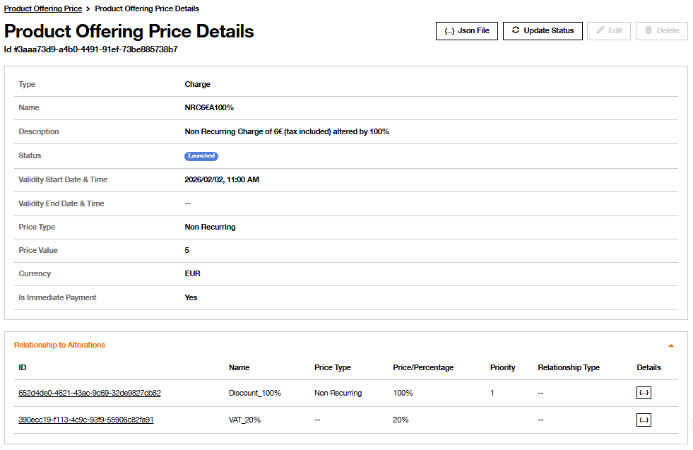{.img-zoomable}  

### 16. Non Recurring Charge without Immediate Payment Altered Percentage

!!! abstract "Marketing Requirement"
    Create a Non-Recurring Charge of 36€ without Immediate Payment and with a 100% Discount.

??? info "Preconditions"
    - A Tax of 20% has been configured in the Product Catalog. See details [Tax in Percentage](../product-offering-price/#1-tax-in-percentage).
    - Currency to be used is already configured in the [Catalog Administration](../../catalog-administration/) section.
    - The non recurring discount which will alter the Charge has been created. In our use case, this alteration is the 'Discount_100%' created in use case [7. Alteration-Non Recurring-Percentage](../product-offering-price/#7-alteration-non-recurring-percentage).

??? Quote "Create a Product Offering Price Charge" 

    ???+ note "'Select Product Offering Price Type' card"

         | Action                             | Value                                                    |  
         | -----------------------------------| -------------------------------------------------------- |  
         | Select Product Offering Price Type |  Charge |  

    ???+ note "'Define Charge Identity Data' card"

         | Action                                  | Value                      |     
         | --------------------------------------- | -------------------------- |    
         | Enter the **Name**                      | NRC36€A100%                |  
         | Enter the **Description**               | Non Recurring Charge of 36€ (tax included) without Immediate Payment altered by 100% |  
         | Select the **Price Type**               | Non Recurring Charge       |  
         | Enter the **Price Value (Excl. Tax)**   | 30                         |  
         | Choose the **Currency**                 | EUR                        |  
         | Choose the **Tax Code**                 | VAT_20%                    |  
         | Check **Price Value (Incl. Tax)**       | 36                         |  
         | Enable or Disable **Immediate Payment** | **Disabled**               |  

    ???+ note "'Define Relationship to Alterations' card"

         | Action                           | Value                       |     
         | -------------------------------- | --------------------------- |    
         | Search by Name                   | Discount_100%               | 
         | Select the **Alteration**        | Discount_100%               |  
         | Select the **Relationship Type** | Altered by *(defaut value)* |  
  
    ???+ note "'Define Validity' card"   

         | Action                                                               | Value            |     
         | -------------------------------------------------------------------- | ---------------- |    
         | Check **Status**                                                     | Launched         |  
         | Update if necessary, default value of **Validity Start Date & Time** | 02/02/2026 11:45 |  
         | Update if necessary, default value of **Validity End Date & Time**   | *empty*          |  

    ??? example "Illustration of this configuration ODACAT UI"
        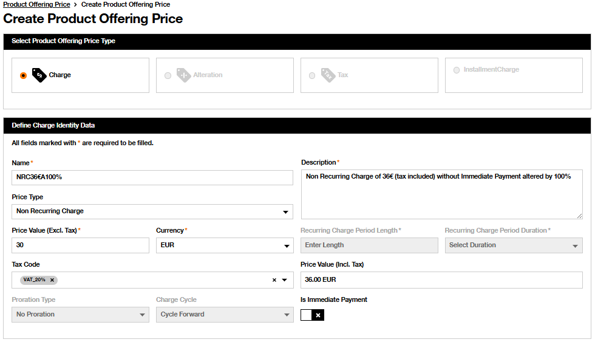{.img-zoomable}
        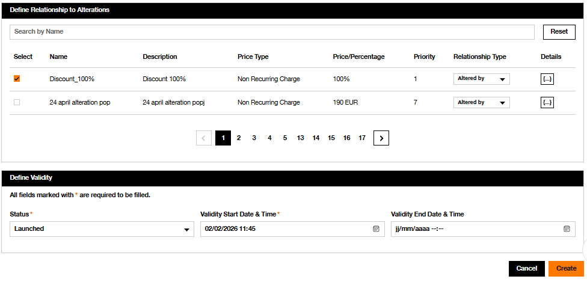{.img-zoomable}

    Once completed, click on the Create button to complete the creation of this Charge.

    A message 'Product offering price has been created successfully' is displayed

    !!! success "Result"
        The Product Offering Price Charge has been created.  

        ??? example "Illustration in the Product Offering Price Dashboard"
            The Product Offering Price Charge has been created with the ID `6eb99838-3d6e-4042-82c4-1da3e095e1c0` and is displayed in the Dashboard with a launched status.            
            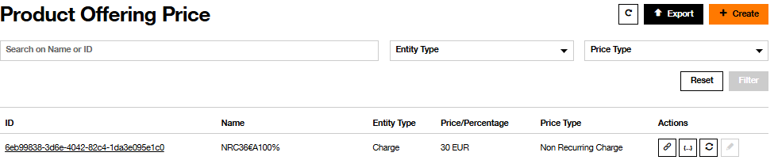{.img-zoomable} 

        ??? example "Illustration of the Product Offering Price Details" 
            It is also possible to visualize the Charge created:  
            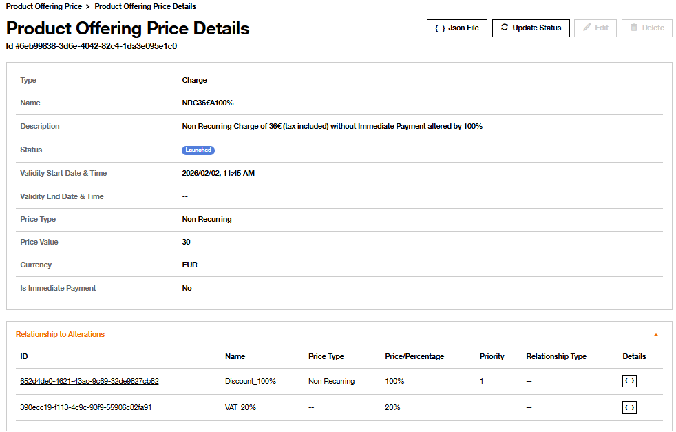{.img-zoomable}  

### 17. Non Recurring Charge Altered Price

!!! abstract "Marketing Requirement"
    Create a Non-Recurring Charge of 80€ with 50€ Discount.

??? info "Preconditions"
    - A Tax of 20% has been configured in the Product Catalog. See details [Tax in Percentage](../product-offering-price/#1-tax-in-percentage).
    - Currency to be used is already configured in the [Catalog Administration](../../catalog-administration/) section.
    - The non recurring discount which will alter the Charge has been created. In our use case, this alteration is the 'Discount_50€' created in use case [8. Alteration-Non Recurring-Price](../product-offering-price/#8-alteration-non-recurring-price)

??? Quote "Create a Product Offering Price Charge" 

    ???+ note "'Select Product Offering Price Type' card"

         | Action                             | Value                                                    |  
         | -----------------------------------| -------------------------------------------------------- |  
         | Select Product Offering Price Type |  Charge |  

    ???+ note "'Define Charge Identity Data' card"

         | Action                                  | Value                                                     |     
         | --------------------------------------- | --------------------------------------------------------- |    
         | Enter the **Name**                      | NRC80€A50€                                                |  
         | Enter the **Description**               | Non Recurring Charge of 80€ (tax included) altered by 50€ |  
         | Select the **Price Type**               | Non Recurring Charge                                      |  
         | Enter the **Price Value (Excl. Tax)**   | 66.67                                                     |  
         | Choose the **Currency**                 | EUR                                                       |  
         | Choose the **Tax Code**                 | VAT_20%                                                   |  
         | Check **Price Value (Incl. Tax)**       | 80                                                        |  
         | Enable or Disable **Immediate Payment** | Enabled *in our use case*                                 | 

    ???+ note "'Define Relationship to Alterations' card"

         | Action                           | Value                       |     
         | -------------------------------- | --------------------------- |    
         | Search by Name                   | Discount_50€                | 
         | Select the **Alteration**        | Discount_50€                |  
         | Select the **Relationship Type** | Altered by *(defaut value)* |  
  
    ???+ note "'Define Validity' card"   

         | Action                                                               | Value            |     
         | -------------------------------------------------------------------- | ---------------- |    
         | Check **Status**                                                     | Launched         |  
         | Update if necessary, default value of **Validity Start Date & Time** | 02/02/2026 11:11 |  
         | Update if necessary, default value of **Validity End Date & Time**   | *empty*          |  

    ??? example "Illustration of this configuration ODACAT UI"
        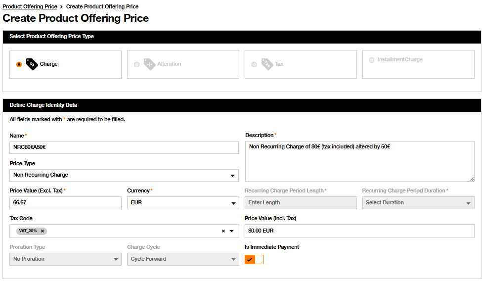{.img-zoomable}
        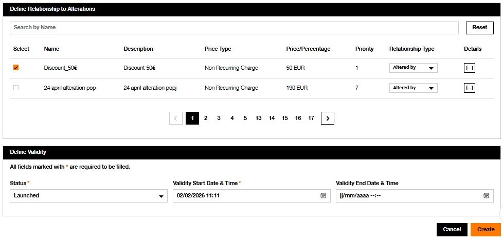{.img-zoomable}

    Once completed, click on the Create button to complete the creation of this Charge.

    A message 'Product offering price has been created successfully' is displayed

    !!! success "Result"
        The Product Offering Price Charge has been created.  

        ??? example "Illustration in the Product Offering Price Dashboard"
            The Product Offering Price Charge has been created with the ID `1c531eca-7021-47a6-9138-242329941b7d` and is displayed in the Dashboard with a launched status.            
            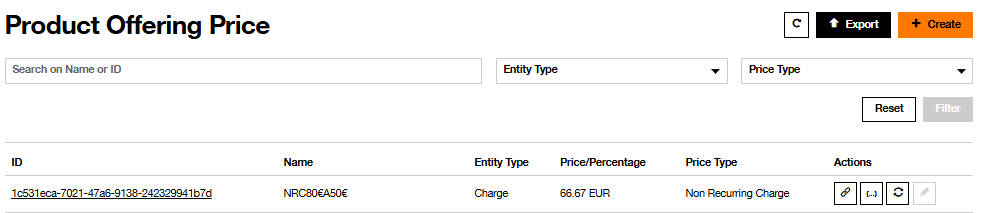{.img-zoomable}

        ??? example "Illustration of the Product Offering Price Details" 
            It is also possible to visualize the Charge created:  
            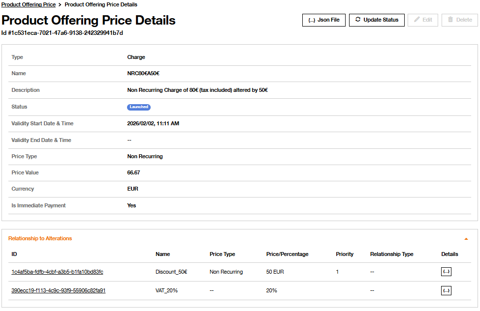{.img-zoomable}   

### 18. Recurring Charge Altered by multiple Percentage Alteration Type

!!! abstract "Marketing Requirement"
    Create a Recurring Charge of 18€ per month with 10% Discount (unlimited) and a 20% Discount during 3 months.

??? info "Preconditions"
    - A Tax of 20% has been configured in the Product Catalog. See details [Tax in Percentage](../product-offering-price/#1-tax-in-percentage).
    - Currency to be used is already configured in the [Catalog Administration](../../catalog-administration/) section.
    - The recurring discount which will alter the Charge has been created. In our use case, this alteration is the 'Recurring Discount of 10% per month' created in use case [3. Alteration-Recurring-Percentage-Unlimited Application Duration](../product-offering-price/#3-alteration-recurring-percentage-unlimited-application-duration).

??? Quote "Create a Product Offering Price Alteration 20% Discount during 3 months with a priority set to '2'" 

    ???+ note "'Select Product Offering Price Type' card"

         | Action                             | Value                                                                |  
         | -----------------------------------| -------------------------------------------------------------------- |  
         | Select Product Offering Price Type |  Alteration |  

    ???+ note "'Define Charge Identity Data' card"

         | Action                                    | Value                                              |     
         | ----------------------------------------- | -------------------------------------------------- |    
         | Enter the **Name**                        | Discount_20%_3Months P2                            |  
         | Enter the **Description**                 | Discount 20% applicable during 3 months Priority 2 |  
         | Select the **Price Type**                 | Recurring Alteration                               |  
         | Choose the **Alteration Type**            | Percentage                                         |  
         | Choose the **Percentage (0-100%)**        | 20                                                 |  
         | Enter the **Application Duration Unit**   | Month                                              |  
         | Enter the **Application Duration Length** | 3                                                  |  
         | Enter the **Priority**                    | 2                                                  |  

    In this use case, it is not necessary to change the default value of the **Proration Type** (No Proration) or to configure **Application Start**.  

    The configuration of this Alteration with a priority 2 in the ODACAT UI is:  
    {.img-zoomable}

    Once completed, click on the Create button to complete the creation of this Alteration.
  
    A message 'Product offering price has been created successfully' is displayed

    !!! success "Result"
        The Product Offering Price Alteration Recurring 'Discount_20%_3Months P2' has been created.  

        ??? example "Illustration in the Product Offering Price Dashboard"
            The Product Offering Price Alteration Recurring 'Discount_20%_3Months P2' has been created with the ID `0359bd0e-0db4-4e3e-9baa-26881976053d` and is displayed in the Dashboard with a launched status.            
            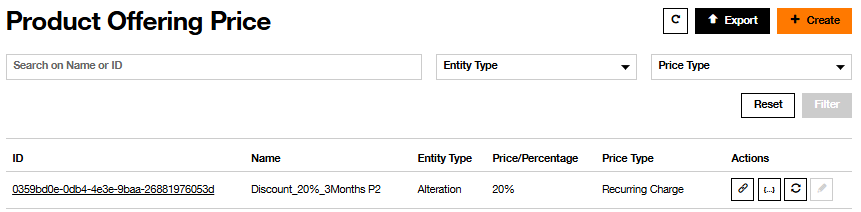{.img-zoomable}

        ??? example "Illustration of the Product Offering Price Details" 
            It is also possible to visualize the Alteration created:  
            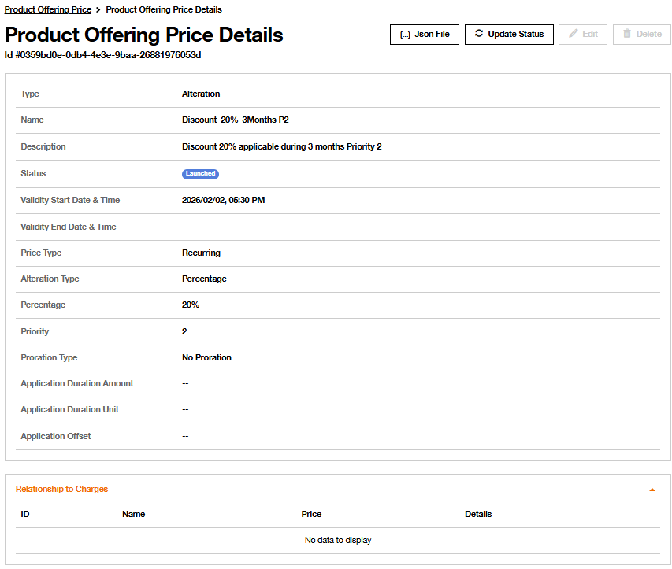{.img-zoomable}   

??? Quote "Create a Product Offering Price Charge" 

    ???+ note "'Select Product Offering Price Type' card"

         | Action                             | Value                                                    |  
         | -----------------------------------| -------------------------------------------------------- |  
         | Select Product Offering Price Type |  Charge |  

    ???+ note "'Define Charge Identity Data' card"

         | Action                                                | Value                        |     
         | ----------------------------------------------------- | ---------------------------- |    
         | Enter the **Name**                                    | RC18€_month_A5%D3months_A10% |  
         | Enter the **Description**                             | Recurring Charge of 18€/month (tax included) altered by 10% (unlimited) and by 20% Discount During 3 months |  
         | Select the **Price Type**                             | Recurring Charge             |  
         | Enter the **Price Value (Excl. Tax)**                 | 15.00                        |  
         | Choose the **Currency**                               | EUR                          |  
         | Enter the **Length of the Recurring Charge Period**   | 1                            |  
         | Enter the **Duration of the Recurring Charge Period** | Month                        |  
         | Choose the **Tax Code**                               | VAT_20%                      |  
         | Check **Price Value (Incl. Tax)**                     | 18.00                        |  
         | Unchange default value **Proration Type**             | No Proration                 |  
         | Unchange default value **Charge Cycle**               | Cycle Forward                |  

    ???+ note "'Define Relationship to Alterations' card"

         | Action                           | Value                       |     
         | ---------------------------------| --------------------------- |    
         | Search by Name                   | Discount_10%                |  
         | Select the **Alteration**        | Discount_10%                |  
         | Select the **Relationship Type** | Altered by *(defaut value)* |  
         | Search by Name                   | Discount_20%_3Months P2     |  
         | Select the **Alteration**        | Discount_20%_3Months P2     |  
         | Select the **Relationship Type** | Altered by *(defaut value)* |  

    ???+ note "'Define Validity' card"   

         | Action                                                               | Value            |     
         | -------------------------------------------------------------------- | ---------------- |    
         | Check **Status**                                                     | Launched         |  
         | Update if necessary, default value of **Validity Start Date & Time** | 02/02/2026 17:30 |  
         | Update if necessary, default value of **Validity End Date & Time**   | *empty*          |  

    ??? example "Illustration of this configuration ODACAT UI"
        {.img-zoomable}
        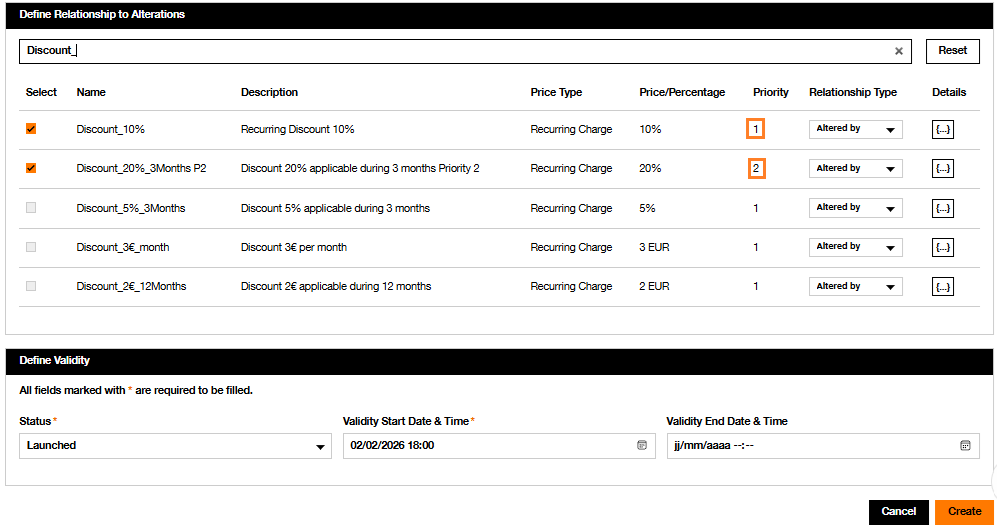{.img-zoomable}

    Once completed, click on the Create button to complete the creation of this Charge.

    A message 'Product offering price has been created successfully' is displayed

    !!! success "Result"
        The Product Offering Price Charge has been created.  

        ??? example "Illustration in the Product Offering Price Dashboard"
            The Product Offering Price Charge has been created with the ID `4212d99f-92ba-49c3-9d4b-a08524aae4ae` and is displayed in the Dashboard with a launched status.            
            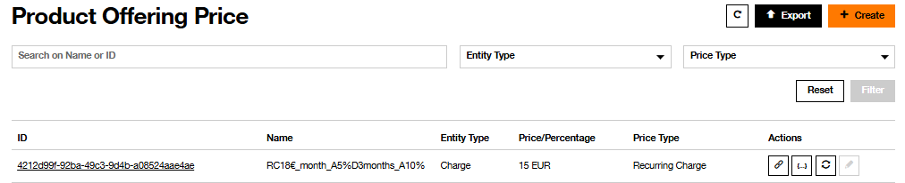{.img-zoomable} 

        ??? example "Illustration of the Product Offering Price Details" 
            It is also possible to visualize the Charge created:  
            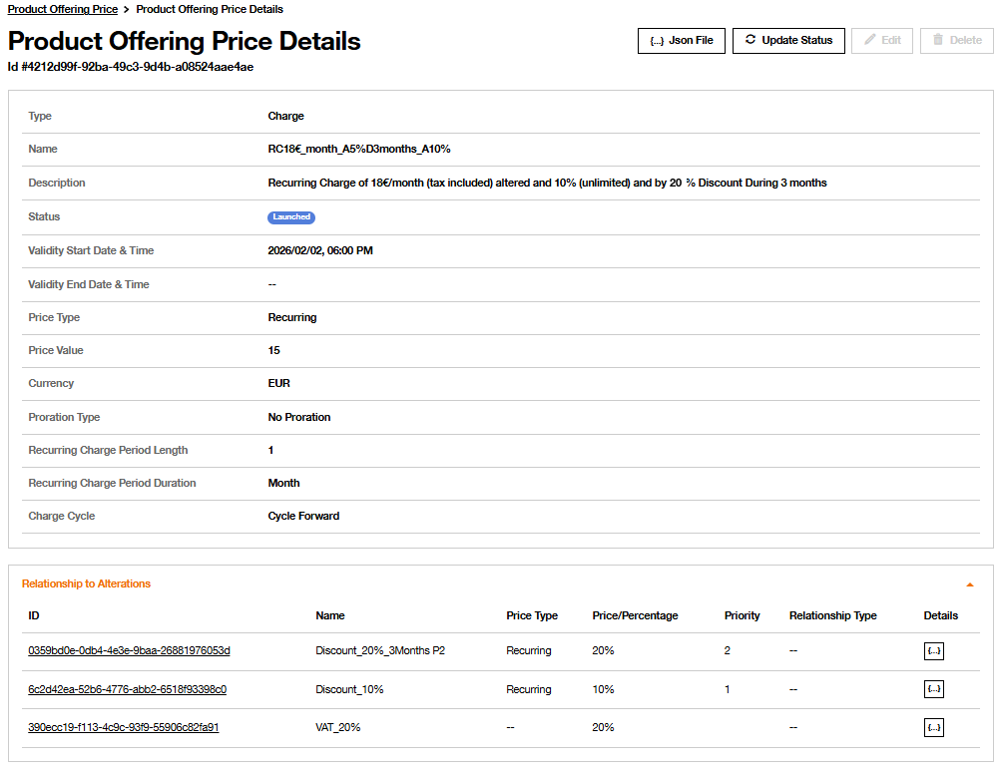{.img-zoomable}   

    !!! note "Details on how it works"
         | Period              | Formula                                                 | Value (€) Tax Excluded        | Result (€) Tax Excluded | Result (€) Tax Included (20%) |     
         | ------------------- | ------------------------------------------------------- | ----------------------------- | ----------------------- | ----------------------------- |    
         | [Month 1 - Month 3] | **Price Value (Excl. Tax)** x (1-10/100) x (1-20/100)   | 15 x (1-10/100) x (1-20/100)  | 10,8                    | 12.96                         |
         | [Month 4 - .......] | **Price Value (Excl. Tax)** x (1-10/100)                | 15 x (1-10/100)               | 13,5                    | 16,2                          |
     
         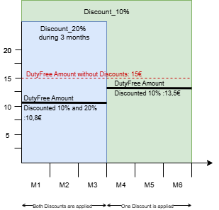{.img-zoomable}    
     
         A Product, which has been configured with the Product Offering Price Charge 'RC18€_month_A5%D3months_A10%', will cost 12.96€ (Tax included) the 1st Month and then 16.2€/month for the next months.

### 19. Recurring Charge Altered Both by Percentage and Price Alteration Types

!!! abstract "Marketing Requirement"
    Create a Recurring Charge of 18€ per month with 10% Discount (unlimited) and a 3€ Discount during 1 month.

??? info "Preconditions"
    - A Tax of 20% has been configured in the Product Catalog. See details [Tax in Percentage](../product-offering-price/#1-tax-in-percentage).
    - Currency to be used is already configured in the [Catalog Administration](../../catalog-administration/) section.
    - The recurring discount which will alter the Charge has been created. In our use case, this alteration is the 'recurring discount of 10% per month' created in use case [3.Alteration-Recurring-Percentage-Unlimited Application Duration](../product-offering-price/#3-alteration-recurring-percentage-unlimited-application-duration).

??? Quote "Create a Product Offering Price Alteration 3€ Discount during 1 month with a priority set to '3'" 

    ???+ note "'Select Product Offering Price Type' card"

         | Action                             | Value                                                                |  
         | -----------------------------------| -------------------------------------------------------------------- |  
         | Select Product Offering Price Type |  Alteration |  

    ???+ note "'Define Charge Identity Data' card"

         | Action                                    | Value                                            |     
         | ----------------------------------------- | ------------------------------------------------ |    
         | Enter the **Name**                        | Discount_3€_1Month_P3                            |  
         | Enter the **Description**                 | Discount 3€ applicable during 1 month Priority 3 |  
         | Select the **Price Type**                 | Recurring Alteration                             |  
         | Choose the **Alteration Type**            | Price                                            |  
         | Choose the **Price Value**                | 3                                                |  
         | Choose the **Currency**                   | EUR                                              |  
         | Enter the **Application Duration Unit**   | Month                                            |   
         | Enter the **Application Duration length** | 1                                                |  
         | Enter the **Priority**                    | 3                                                |    

    In this use case, it is not necessary to change the default value of the **Proration Type** (No Proration) or to configure **Application Start**.  

    The configuration of this Alteration with a priority 2 in the ODACAT UI is:  
    {.img-zoomable}

    Once completed, click on the Create button to complete the creation of this Alteration.
  
    A message 'Product offering price has been created successfully' is displayed.

    !!! success "Result"
        As a result, the Product Offering Price Alteration Recurring 'Discount_3€_1Month_P3' has been created.  

        ??? example "Illustration in the Product Offering Price Dashboard"
            The Product Offering Price Alteration Recurring 'Discount_3€_1Month_P3' has been created with the ID `c35c6324-6679-4d2c-b0a0-d43261b69863` and is displayed in the Dashboard with a launched status.            
            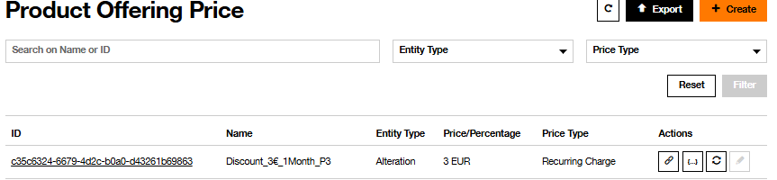{.img-zoomable} 

        ??? example "Illustration of the Product Offering Price Details" 
            It is also possible to visualize the Alteration created:  
            {.img-zoomable}   

??? Quote "Create a Product Offering Price Charge" 

    ???+ note "'Select Product Offering Price Type' card"

         | Action                             | Value                                                    |  
         | -----------------------------------| -------------------------------------------------------- |  
         | Select Product Offering Price Type |  Charge |  

    ???+ note "'Define Charge Identity Data' card"

         | Action                                                | Value                       |     
         | ----------------------------------------------------- | --------------------------- |    
         | Enter the **Name**                                    | RC18€_month_A3€D1month_A10% |  
         | Enter the **Description**                             | Recurring Charge of 18€/month (tax included) altered by 10% (unlimited) and by 3€ Discount During 1 month |  
         | Select the **Price Type**                             | Recurring Charge            |  
         | Enter the **Price Value (Excl. Tax)**                 | 15.00                       |  
         | Choose the **Currency**                               | EUR                         |  
         | Enter the **Length of the Recurring Charge Period**   | 1                           |  
         | Enter the **Duration of the Recurring Charge Period** | Month                       |  
         | Choose the **Tax Code**                               | VAT_20%                     |  
         | Check **Price Value (Incl. Tax)**                     | 18.00                       |  
         | Unchange default value **Proration Type**             | No Proration                |  
         | Unchange default value **Charge Cycle**               | Cycle Forward               |  

    ???+ note "'Define Relationship to Alterations' card"

         | Action                           | Value                       |     
         | -------------------------------- | --------------------------- |    
         | Search by Name                   | Discount_10%                |  
         | Select the **Alteration**        | Discount_10%                |  
         | Select the **Relationship Type** | Alteredby *(defaut value)*  |  
         | Search by Name                   | Discount_3€_1Month_P3       |  
         | Select the **Alteration**        | Discount_3€_1Month_P3       |  
         | Select the **Relationship Type** | Altered by *(defaut value)* |  

    ???+ note "'Define Validity' card"   

         | Action                                                               | Value            |     
         | -------------------------------------------------------------------- | ---------------- |    
         | Check **Status**                                                     | Launched         |  
         | Update if necessary, default value of **Validity Start Date & Time** | 02/02/2026 17:30 |  
         | Update if necessary, default value of **Validity End Date & Time**   | *empty*          |  

    The configuration of this Charge in the ODACAT UI is:  
    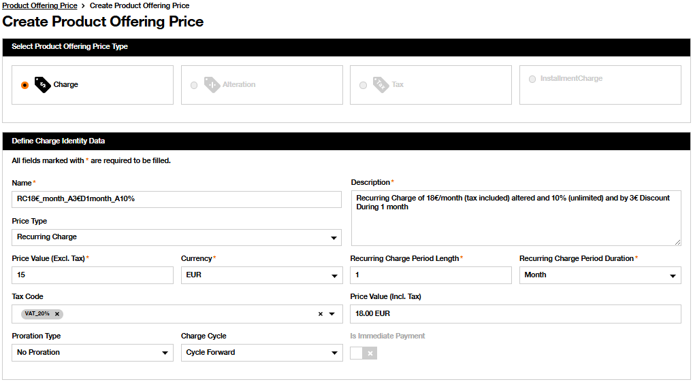{.img-zoomable}
   
    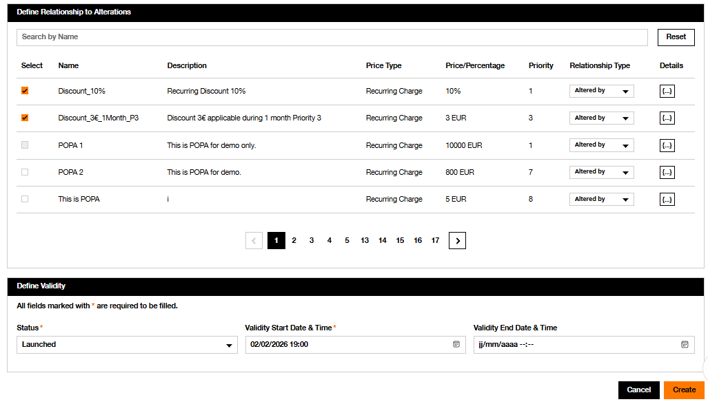{.img-zoomable}

    Once completed, click on the Create button to complete the creation of this Charge.

    A message 'Product offering price has been created successfully' is displayed

    !!! success "Result"
        As a result, the Product Offering Price Charge has been created.  

        ??? example "Illustration in the Product Offering Price Dashboard"
            The Product Offering Price Charge has been created with the ID `11ea4435-f0b6-4f60-adbb-1f3cca9b4245` and is displayed in the Dashboard with a launched status.            
            {.img-zoomable} 

        ??? example "Illustration of the Product Offering Price Details" 
            It is also possible to visualize the Charge created:  
            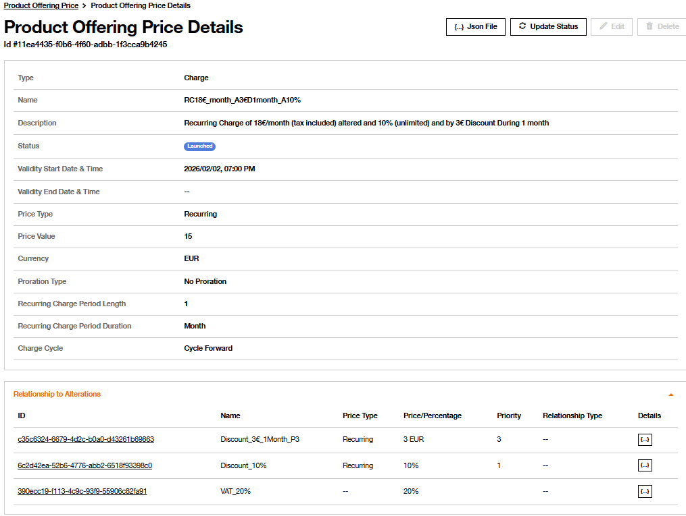{.img-zoomable}   

    !!! note "Details on how it works"
         | Period          | Formula (€)                                       | Value (€) Tax Excluded | Result(€) Tax Excluded | Result(€) Tax Included (20%) |    
         | --------------- | ------------------------------------------------- | ---------------------- | ---------------------- | ---------------------------- |
         | [Month 1]       | [**Price Value (Excl. Tax)** x (1-10/100)] - 3    | 15 x (1-10/100) - 3    | 10.5                   | 12.6                         |
         | [Month 2 - ...] | **Price Value (Excl. Tax)** x (1-10/100)          | 15 x (1-10/100)        | 13.5                   | 16.2                         |
     
         A Product, which has been configured with the Product Offering Price Charge 'RC18€_month_A3€D1month_A10%', will cost 12.6€ (Tax included) the 1st Month and then 16.2€/month for the next months.

### 20. Non Recurring Charge replaced by an Alteration Price

!!! abstract "Marketing Requirement"
    Create a Non-Recurring Charge of 90€, without Immediate Payment, with a 50€ replacement Discount.

??? info "Preconditions"
    - A Tax of 20% has been configured in the Product Catalog. See details [Tax in Percentage](../product-offering-price/#1-tax-in-percentage).
    - Currency to be used is already configured in the [Catalog Administration](../../catalog-administration/) section.
    - The non recurring discount which will alter the Charge has been created. In our use case, this alteration is the 'Discount_50€' created in use case [8. Alteration-Non Recurring-Price](../product-offering-price/#8-alteration-non-recurring-price)

??? Quote "Create a Product Offering Price Charge" 

    ???+ note "'Select Product Offering Price Type' card"

         | Action                             | Value                                                      |  
         | -----------------------------------| ---------------------------------------------------------- |  
         | Select Product Offering Price Type |  Charge   |  

    ???+ note "'Define Charge Identity Data' card"

         | Action                                  | Value                                                                                  |     
         | --------------------------------------- | -------------------------------------------------------------------------------------- |    
         | Enter the **Name**                      | NRC90€R50€                                                                             |  
         | Enter the **Description**               | Non Recurring Charge of 90€ (tax included), without Immediate Payment, replaced by 50€ |  
         | Select the **Price Type**               | Non Recurring Charge                                                                   |  
         | Enter the **Price Value (Excl. Tax)**   | 75.00                                                                                  |  
         | Choose the **Currency**                 | EUR                                                                                    |  
         | Choose the **Tax Code**                 | VAT_20%                                                                                |  
         | Check **Price Value (Incl. Tax)**       | 90                                                                                     |  
         | Enable or Disable **Immediate Payment** | Disabled                                                                               | 

    ???+ note "'Define Relationship to Alterations' card"

         | Action                           | Value                      |     
         | -------------------------------- | -------------------------- |    
         | Search by Name                   | Discount_50€               | 
         | Select the **Alteration**        | Discount_50€               |  
         | Select the **Relationship Type** | Replaced by                |  
  
    ???+ note "'Define Validity' card"   

         | Action                                                               | Value            |     
         | -------------------------------------------------------------------- | ---------------- |    
         | Check **Status**                                                     | Launched         |  
         | Update if necessary, default value of **Validity Start Date & Time** | 05/02/2026 10:00 |  
         | Update if necessary, default value of **Validity End Date & Time**   | *empty*          |  

    ??? example "Illustration of this configuration ODACAT UI"
        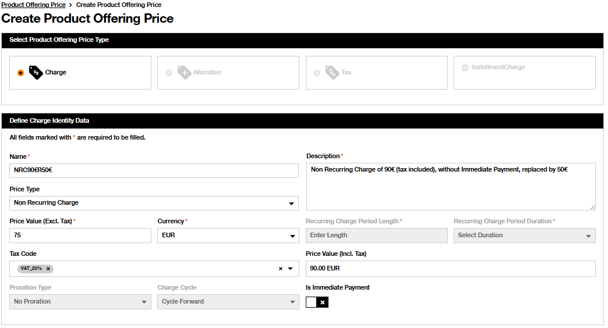{.img-zoomable}
        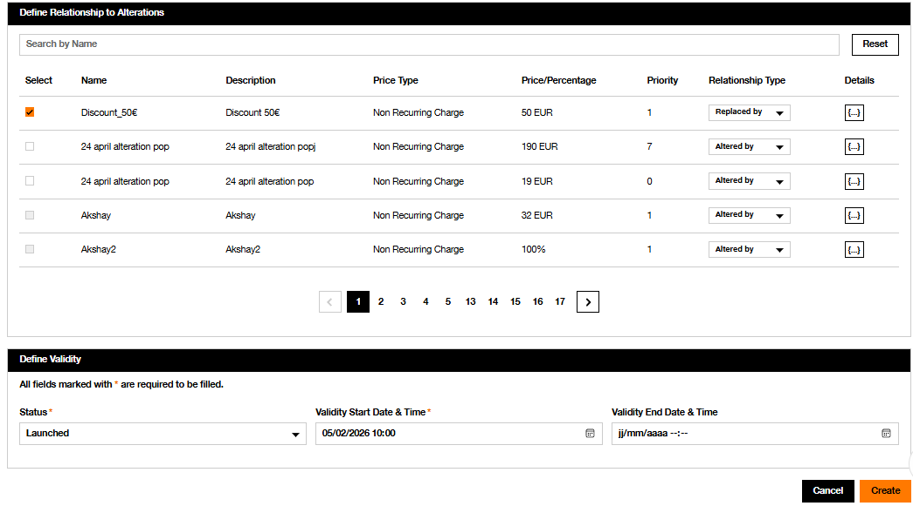{.img-zoomable}

    Once completed, click on the Create button to complete the creation of this Charge.

    A message 'Product offering price has been created successfully' is displayed

    !!! success "Result"
        The Product Offering Price Charge has been created.  

        ??? example "Illustration in the Product Offering Price Dashboard"
            The Product Offering Price Charge has been created with the ID `da1ad593-a741-4944-8667-8ce8f211c627` and is displayed in the Dashboard with a launched status.            
            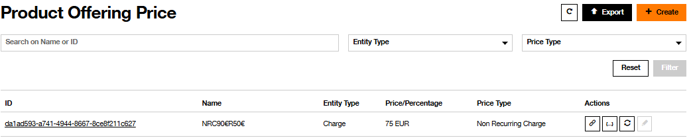{.img-zoomable} 

        ??? example "Illustration of the Product Offering Price Details" 
            It is also possible to visualize the Charge created:  
            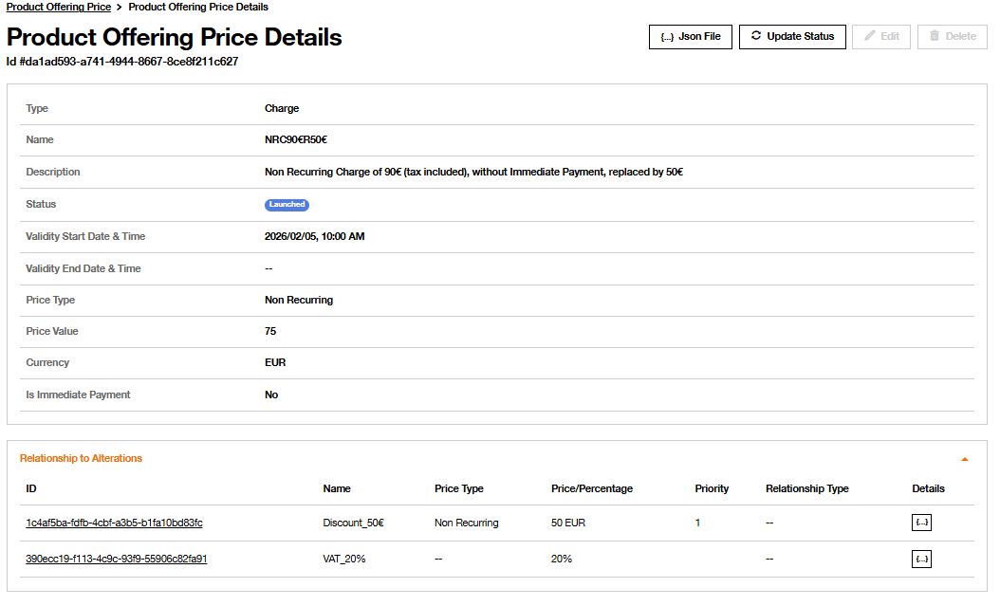{.img-zoomable}   

    !!! note "Details on how it works"
         | Duty Free Amount formula                                       | Duty Free Amount (€) Applicable for the Use Case   | Tax Included (20%) Amount |     
         | ------------------------------------------------------------- | ------------------------------------------------- | ------------------------- |
         | **Price Value (Excl. Tax)** - **Alteration price (Replaced)** | 90 - 50 = 40                                      | 40 x 1.2 = 48             | 
         
         A Product, which has been configured with the Product Offering Price Charge 'RC90€R50€', will cost 48€ (Tax included).

### 21. Create an Installment Charge with Down Payment

!!! abstract "Marketing Requirement"
    Create an Installment Charge of 1000€ with 24 Rates and 100€ Down Payment.

??? info "Preconditions"
    - A Tax of 20% has been configured in the Product Catalog. See details [Tax in Percentage](../product-offering-price/#1-tax-in-percentage).
    - Currency to be used is already configured in the [Catalog Administration](../../catalog-administration/) section.

??? Quote "Create a Product Offering Price Installment Charge" 

    ???+ note "'Select Product Offering Price Type' card"

         | Action                               | Value                                                                                          |  
         | -------------------------------------| ---------------------------------------------------------------------------------------------- |  
         | Select Product Offering Price Type   |  Installment Charge    |  

    ???+ note "'Define Charge Identity Data' card"

         | Action | Value |     
         | ---------------------------------------------- | ----------------------------------------------------------------- |    
         | Enter the **Name**                         | IP1000_24M_DP100                                                  |  
         | Enter the **Description**                  | Installment Charge of 1000€ on 24 months and Down Payment of 100€ |  
         | Enter the **Original Amount**              | 1000                                                              |  
         | Choose the **Currency**                    | EUR                                                               |  
         | Enter the **Installment Period Value**     | Month                                                             |  
         | Enter the **Installment Period Units**     | 24                                                                |  
         | Choose the **Down Payment**                | 100                                                               |  

    ???+ note "'Define Relationship to Tax' card"

         | Action                 | Value          |     
         | ---------------------- | -------------- |    
         |  Search by Name        | VAT_20%        |  
         |  Select the **Tax**    | VAT_20%        |  
  
    ???+ note "'Define Validity' card"   

         | Action                                                               | Value            |     
         | -------------------------------------------------------------------- | ---------------- |    
         | Check **Status**                                                     | Launched         |  
         | Update if necessary, default value of **Validity Start Date & Time** | 10/02/2026 13:48 |  
         | Update if necessary, default value of **Validity End Date & Time**   | *empty*          |  

    ??? example "Illustration of this configuration ODACAT UI"
        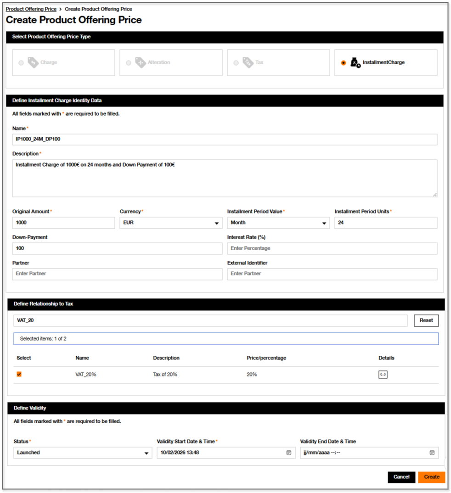{.img-zoomable}

    Once completed, click on the Create button to complete the creation of this Installment Charge.

    A message 'Product offering price has been created successfully' is displayed

    !!! success "Result"
        The Product Offering Price Installment Charge has been created.  

        ??? example "Illustration in the Product Offering Price Dashboard"
            The Product Offering Price Installment Charge has been created with the ID `a30c5345-cbb1-4199-b40d-98e8d81ecce2` and is displayed in the Dashboard with a launched status.            
            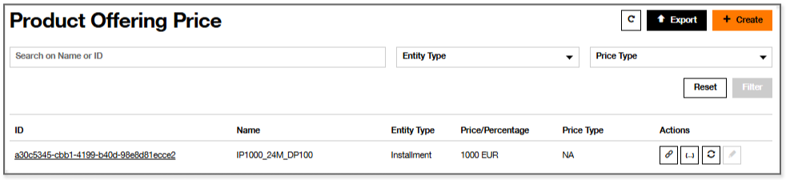{.img-zoomable} 

        ??? example "Illustration of the Product Offering Price Details" 
            It is also possible to visualize the Installment Charge created:  
            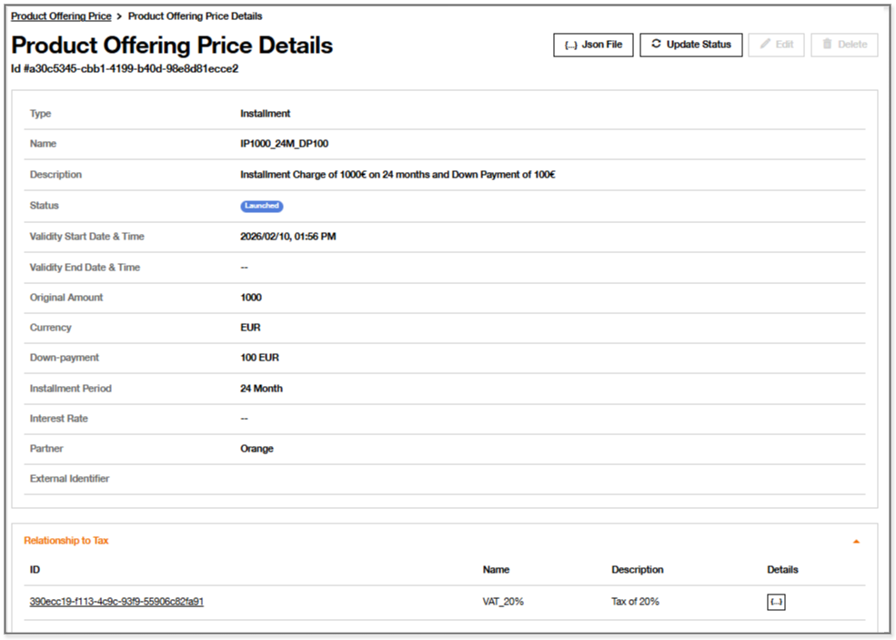{.img-zoomable}   

### 22. Create an Installment Charge with Interest Rate and Partner

!!! abstract "Marketing Requirement"
    Create an Installment Charge of 1500€ with 36 Rates and an Interest Rate 2.5% from 'Best Bank' Partner.

??? info "Preconditions"
    - A Tax of 20% has been configured in the Product Catalog. See details [Tax in Percentage](../product-offering-price/#1-tax-in-percentage).
    - Currency to be used is already configured in the [Catalog Administration](../../catalog-administration/) section.

??? Quote "Create a Product Offering Price Installment Charge" 

    ???+ note "'Select Product Offering Price Type' card"

         | Action                             | Value                                                                                       |  
         | -----------------------------------| ------------------------------------------------------------------------------------------- |  
         | Select Product Offering Price Type |  Installment Charge |  

    ???+ note "'Define Charge Identity Data' card"

         | Action | Value |     
         | ----------------------------------------------------- | --------------------------------------------------------------------------------- |    
         | Enter the **Name**                                    | IC1000_IP12M_IR2.5_Partner-BestBank                                               |  
         | Enter the **Description**                             | Installment Charge of 1500€ 36 rates and Interest Rate 2.5% from BestBank Partner |  
         | Enter the **Original Amount**                         | 1500                                                                              |  
         | Choose the **Currency**                               | EUR                                                                               |  
         | Enter the **Installment Period Value**                | Month                                                                             |  
         | Enter the **Installment Period Units**                | 36                                                                                |  
         | Enter the **Interest Rate (%)**                       | 2.5%                                                                              |  
         | Enter the **Partner**                                 | Best Bank                                                                         |  
         | Enter the **External Identifier**                      | BB_P36M_R2.5                                                                             |  

    ???+ note "'Define Relationship to Tax' card"

         | Action                 | Value     |     
         | -----------------------| --------- |    
         |  Search by Name        | VAT_20%   |  
         |  Select the **Tax**    | VAT_20%   |  
  
    ???+ note "'Define Validity' card"   

         | Action                                                              | Value            |     
         | ------------------------------------------------------------------- | ---------------- |    
         | Check **Status**                                                    | Launched         |  
         | Update if necessary, default value of **Validity Start Date & Time** | 10/02/2026 14:20 |  
         | Update if necessary, default value of **Validity End Date & Time**   | *empty*          |  

    ??? example "Illustration of this configuration ODACAT UI"
        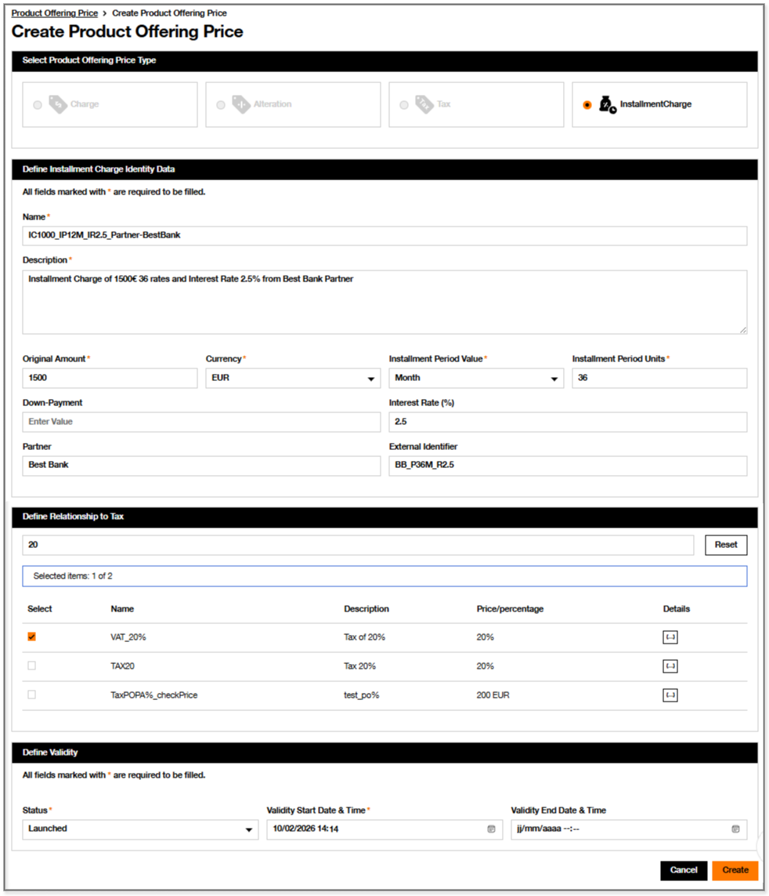{.img-zoomable}

    Once completed, click on the Create button to complete the creation of this Installment Charge.

    A message 'Product offering price has been created successfully' is displayed

    !!! success "Result"
        The Product Offering Price Installment Charge has been created.  

        ??? example "Illustration in the Product Offering Price Dashboard"
            The Product Offering Price Installment Charge has been created with the ID `2146d1d4-423d-4958-954e-2d3345af2c1d` and is displayed in the Dashboard with a launched status.            
            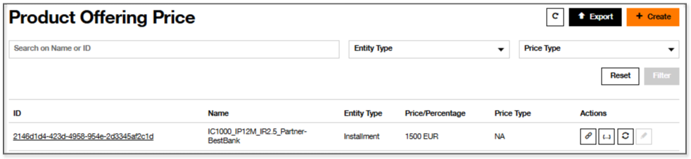{.img-zoomable} 

        ??? example "Illustration of the Product Offering Price Details" 
            It is also possible to visualize the Installment Charge created:  
            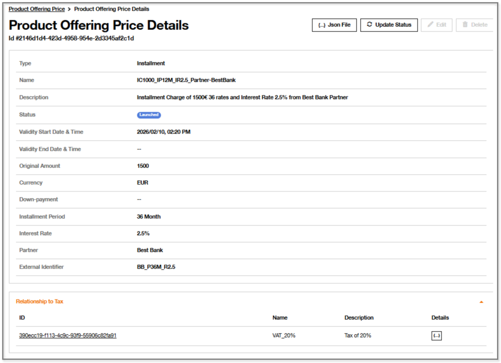{.img-zoomable}   
