

# Product Offering

ODACAT Product Catalog manages three types of **Product Offering**:

- **Atomic Product Offering**
- **Bundle Product Offering**
- **Contract Product Offering**

## Dashboard

In the ODACAT Product Catalog Portal, you can access to **Product Offering Dashboard** by selecting the **Product Offering** from the "Catalog Entity" panel. It includes:

- a set of possible actions:
  -  button to refresh the display    
  -  button to generate an export file with the list of Product Offerings   
  -  button to create a Product Offering    
- a [Search and filter function](../product-offering/#search-and-filter-function) related area, you can use to filter the list of Product Offerings.   
- a list of Product Offerings

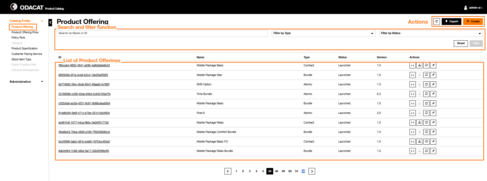{.img-zoomable} 

### Information Displayed and Actions

The list of Product Offerings displays all or a subset of, the Product Offering defined in the Product Catalog. The properties of the Product Offerings displayed include:

  | Column               | Description                                                                                                                 |
  | :------------------- | :-------------------------------------------------------------------------------------------------------------------------- |
  | `ID`                 | The identifier of the Product Offering                                                                                      |
  | `Name`               | The name of the Product Offering                                                                                            |
  | `Type`               | The Product Offering type can be [Atomic/Bundle/Contract]                                                                   |
  | `Status`             | The status of the Product Offering which value can be inTest, active or launched (other statuses are not displayed)    |
  | `Version`            | The version of the Product Offering                                                                                        |
  | `Action`             | Set of Product Offering specific actions:   to get details on its definition in *Json* format   to display a graph with the contract hierachy   to change its lifecycle status   to edit it.  | 

### Search and filter function

??? abstract "Search by ID"
     1. Enter the **Product Offering ID** in the **Search on Name or ID** area   
     2. Click on **Filter** button  
     3. The result of the filtering is displayed:  
       - If the **Product Offering ID** is already defined in the Product Catalog, then the list of Product Offerings is refreshed and only the associated Product Offering is displayed with its properties.  
       - Otherwise, If the **Product Offering ID** is not defined in the Product Catalog, then the list of Product Offerings is refreshed with no entry and a message `No data to display` is provided.   
     4. To return on the default list of Product Offerings, click on the Reset button  on the top of the screen.   

??? abstract "Search by Name"
     **Full name entered**  
     1. Enter the complete **Product Offering Name** in the **Search on Name or ID** area  
     2. Click on **Filter** button  
     3. The result of the filtering is displayed:  
       - If there is a Product Offering already defined in the Product Catalog with this Name, then the list of Product Offerings is refreshed and only the associated Product Offering is displayed with its properties.  
       - Otherwise, if there is no Product Offering with this Name in the Product Catalog, then the list of Product Offerings is refreshed with no entry and a message `No data to display` is provided.  
     4. To return on the default list of Product Offerings, click on the Reset button  on the top of the screen.       
     **Partial name entered**  
     1. Enter some characters of **Product Offering Name** in the **Search on Name or ID** area  
     2. Click on **Filter** button  
     3. The result of the filtering is displayed:  
       - If there is one or several Product Offering(s) already defined in the Product Catalog which Name includes the set of characters used for the Search, then the list of Product Offerings is refreshed and only the associated Product Offerings is (are) displayed with its (their) properties.  
       - Otherwise, if there is not any Product Offering which name includes this set of characters, then the list of Product Offerings is refreshed with no entry and a message `No data to display` is provided.  
     4. To return on the default list of Product Offerings, click on the Reset button  on the top of the screen.  

??? abstract "Filter by Type"
     The **Filter by Type** criteria of the Product Offering dashboard can be used to restrict the list of Product Offerings to:  
       - Atomic Product Offering  
       - Bundle Product Offering  
       - Contract Product Offering     
    **Filter by Atomic Type**  
     1. Click on the **Filter by Type** dropdown button and select the `Atomic` value  
     2. Click on **Filter** button  
     3. The result of the filtering is displayed accordingly. Only the Atomic Product Offerings (are) displayed     
     4. To return on the default list of Product Offerings, clicks on the Reset button on the top of the screen.     
    **Filter by Bundle Type**  
     1. Click on the **Filter by Type** dropdown button and select the `Bundle` value  
     2. Click on **Filter** button  
     3. The result of the filtering is displayed accordingly. Only the Bundle Product Offerings (are) displayed   
     4. To return on the default list of Product Offerings, clicks on the Reset button on the top of the screen.     
    **Filter by Contract Type**  
     1. Click on the **Filter by Type** dropdown button and select the `Contact` value  
     2. Click on **Filter** button  
     3. The result of the filtering is displayed accordingly. Only the Contact Product Offerings (are) displayed   
     4. To return on the default list of Product Offerings, clicks on the Reset button on the top of the screen.   

??? abstract "Filter by Status"
    The **Filter by Status** criteria of the Product Offering dashboard can be used to restrict the list of Product Offerings to a specific status inTest status or active or launched.     
    **Filter by 'active' status**  
     1. Click on the **Filter by Status** dropdown button and select the `inTest` value  
     2. Click on **Filter** button  
     3. Filtering result is displayed accordingly. Only the Product Offering(s) in inTest status is (are) displayed  
     4. To return on the default list of Product Offerings, click on the Reset button  on the top of the screen.     
    **Filter by 'active' status**  
     1. Click on the **Filter by Status** dropdown button and select the `Active` value  
     2. Click on **Filter** button  
     3. Filtering result is displayed accordingly. Only the Product Offering(s) in active status is (are) displayed  
     4. To return on the default list of Product Offerings, click on the Reset button  on the top of the screen.     
    **Filter by 'launched' status**  
     1. Click on the **Filter by Status** dropdown button and select the `Launched` value  
     2. Click on **Filter** button  
     3. Filtering result is displayed accordingly. Only the Product Offering(s) in launched status is (are) displayed  
     4. To return on the default list of Product Offerings, click on the Reset button  on the top of the screen.  

## General information about Product Offering configuration

For Product Offering entity, the ODACAT UI is composed on different **cards** displayed along the process performed (Creation, Get Details,  Modification, etc.)  

This paragraph gives an helicopter view of the main cards involved depending the Product Offering type (Atomic, Bundle, Contract) and the process (Creation, Modification, Get Details).

The cards will be represented according the following principles:

   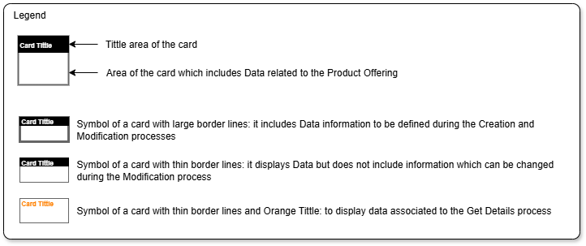

### For Product Offering Creation

   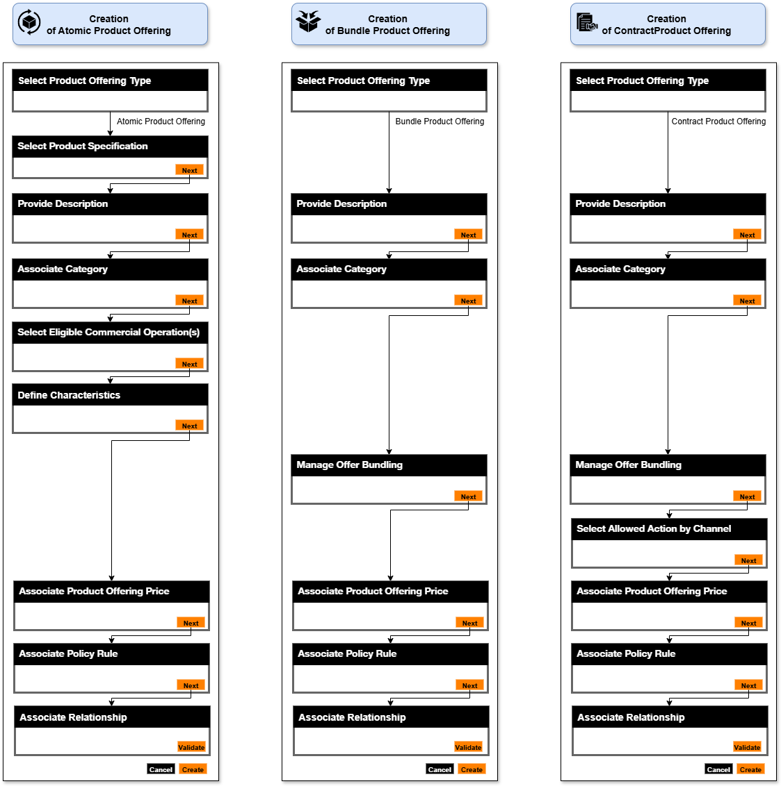

### For Product Offering Details

   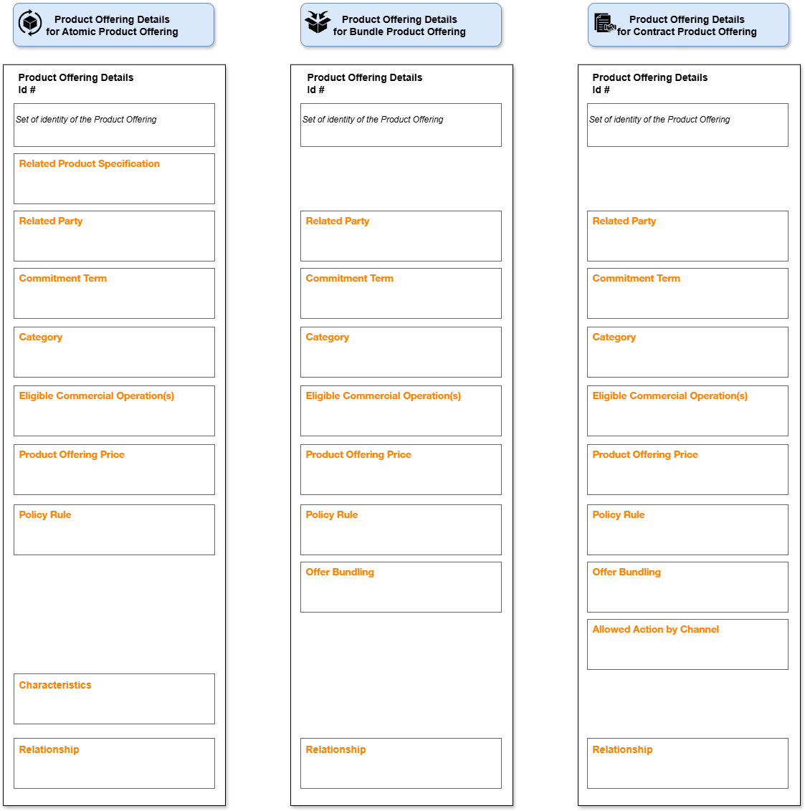

### For Product Offering Modification

   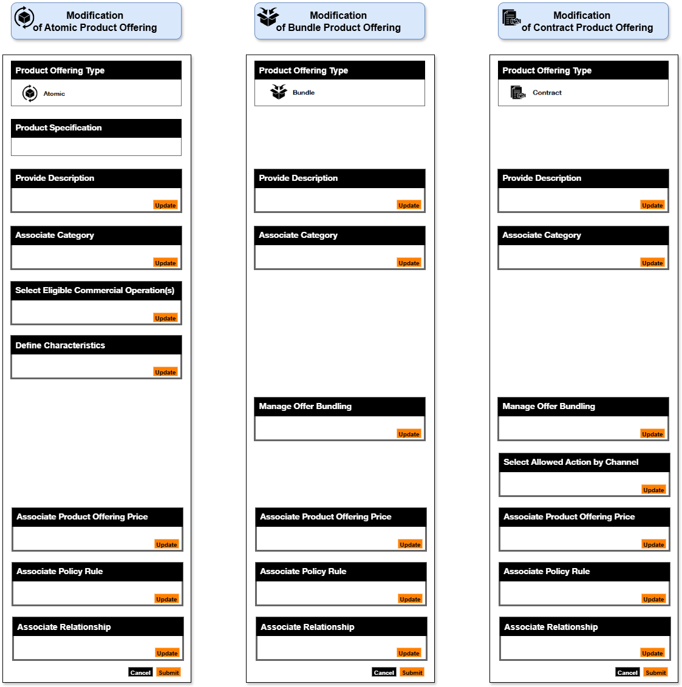

??? warning "How to record the changes done in cards for Product Offering Creation and Modification"
    **The Creation of Product Offering follow a process flow to move from one activity, for instance 'Select Target Product Specification' to the next one, for instance 'Provide Description' by clicking on the Next button . When you are invited to fill detail in card~(n+1)~ after having clicked on the 'Next' button of the card~(n)~ it is possible to update the information of any previous cards (card~(n)~, card~(n-1)~,..) but you shall click on the Next button of the updated card to record the changes in database.** 
    
    **During the Modification of Product Offering, you can change the information of any cards displayed, for instance 'Provide Description', 'Associate Category' and this update can be done in the order you want, for instance, first add an 'Associate Category' then change the 'Description' details in the 'Provide Description', BUT you must click on the 'Update' orange button to register the change on each card modified.** 

## Atomic Product Offering

### Create Atomic Product Offering

This section describes how an Atomic Product Offering can be created with the ODACAT User Interface. This creation follows a sequence of configurations on the user interface aligned with the process flow presented in the [Create Product Offering](https://catalog-doc-integration-disco.apps.fr01.paas.tech.orange/architecture/overall-architecture/#create-product-offering) section of the [Overall Architecture](https://catalog-doc-integration-disco.apps.fr01.paas.tech.orange/architecture/overall-architecture/).

!!! summary "Precondition"
    The Product Specification that will be used to define the Product Offering has been already created.

1. Click on the Create button on top of the screen
2. A **Create Product Offering** page is displayed  
3. Select the **Atomic Product Offering** radio button from the list of Product Offering type [Atomic/Bundle/Contract]  
4. Select the target **Product Specification** from the list of Product Specifications displayed by using the **Search and filter function** menu or searching it by scrolling on the different pages of the list of Product Specifications. Once the Product Specification has been selected, click on the Next button 
5. Define the **Identity Data** of the Product Offering that is under creation
   - Enter the **Name** (mandatory)
   - Optionally, enter the **Brand** associated to this entity  
   - Enter the **Description** (mandatory)
   - Specify whether the Product Offering have to be installed in the Product Inventory.
     - In positive case, the **Installable** toggle button shall be enabled (default state).
     - If not, the **Installable** toggle button shall be disabled.
   - Specify whether the Product Offering will be visible in the Selfcare. 
     - In positive case, the **Visible** toggle button shall be enabled (default state). 
     - If not, the **Visible** toggle button shall be disabled
   - Specify whether the Product Offering will be Sellable.
     - In positive case, the **Sellable** toggle button shall be enabled. 
     - If not, the **Sellable** toggle button shall be disabled (default state).
   - Optionally, update the value of the **Start Date**
   - Optionally, enter the value of the **End Date**
   - Optionally, select the applicable **Channel(s)** from the list proposed and setup in the [Catalog Administration](../../catalog-administration/)
   - Optionally, select the applicable **Market Segment(s)** from the list proposed and setup in the [Catalog Administration](../../catalog-administration/)
   - Optionally, define the **Commitment Term(s)**
     - Name
     - Description
     - Term Duration
     - Term Unit

     Once completed, click on the Next button  to continue the process flow

    ??? info "Channel and Market Segment used for Commercial Eligibility Check"
        The Channel(s) and the Market Segment(s) configured in Product Offering (Atomic, Bundle and Contract type) are stored in the Product Catalog Database but, for now, only those defined for Contract Product Offering will be used for the 'Commercial Eligibility Check' during the Order Capture process of DISCOBOLE OM component.
   
6. Optionally, set up the list of **Category** associated to the Product Offering within the **Associate Category** section. The Category are setup in the [Catalog Administration](../../catalog-administration/)
   
7. Select the **Eligible Commercial Operation(s)** associated to the Product Offering
   - The list of available **Commercial Operations** (for intance 'Add', 'Terminate', etc.) are inherited from the one defined in the Product Specification.
   - It is also possible to define the **validity** of the Commercial Operation associated to the Product Offering.
    
8. Define the **Characteristics** that will be applicable for the Product Offering. This card displays the list of characteristics, inherited from the Characteristic of the Product Specification that is linked to the Product Offering under creation, with their properties. You can select the characteristic that will be applied to the Product Offering:
   - to select all the characteristic: activate the checkbox on top the table
   - to select one or multiple characteristics: activate the checkbox in front of the characteristic to be selected; It is possible to select some characteristic value(s) of the selected characteristic by clicking on the **Edit the Value**

   Once completed, click on the Next button  to continue the process flow.

9. Configure the **Associate Product Offering Price** section which defines the relationship between the Product Offering under creation and the Product Offering Price to be applied according **Commercial Operation** and **Commitment Terms** if defined.
   - You can get details on the Product Offering Price by clicking on the  icon
   - You can select, with the checkbox, the Product Offering Price to be associated with the Product Offering.
   - For each Product Offering Price selected, define the **Commercial Operations** (mandatory) and optionally select one or multiple **Commitment Term** for which the Product Offering Price will be applied for this Product Offering.

   Once completed, click on the Next button  to continue the process flow.

10. Configure the **Associate Policy Rule** section which defines the relationship between the Product Offering under creation and the Policy Rule(s). 
   - You can select with the checkbox, the Policy Rule to be associated with the Product Offering.
   - You can get details on the Policy Rule by clicking on the  icon

   Once completed, click on the Next button  to continue the process flow.

11. Configure the **Associated Relationship** that will be applicable for the Product Offering. This card lists the available (i.e. with inTest, active and launched statuses) Product Offerings and enables you to configure the relationship between the Product Offering under creation and the one(s) available in the Product Catalog. 
   - You can get details on the Product Offering by clicking on the  icon  
   - You can select with the checkbox the Product Offerings that have a relationship with the Product Offering under creation.
   - For each Product Offering selected, it is possible to:  
   - Set up **Start Date** and **End Date** of the relationship by setting the **ValidFor** property 
   - Specify the **Relationship Type** between Product Offerings which can take the values:
     - **Incompatible**, or 
     - **Requires** 

   *Example 1: Use case of product offering for tangible product - APO (A) (ex. Samsung A55) that requires a shipment*
   - *Atomic offer being created: Atomic Product Offering(A)*
   - *Relationship to be configured in APO (A)*

   | Product Offering Name | Valid For | RelationShip Type |
   | -------- | -------- | -------- |
   | Shipment PO    | *default values*     | Requires      |

   *Example 2: Use case of Product Offerings (B) & (D) incompatibility*
   - *Atomic offer being created: Product Offering(D)*
   - *Relationship to be configured in the Product Offering (D) definition:*

   | Product Offering Name | Valid For | RelationShip Type |
   | -------- | -------- | -------- |
   | Product Offering (B)     | *default values*     | Incompatible      |

Once completed, click on the Create button to complete the process flow for the creation of an **Atomic Product Offering**.

!!! success "Result"
    The Product Offering Dashboard is displayed and includes the Atomic Product Offering that has been created. Its state is inTest and its **version** is `0.1`.

### Get Details on Atomic Product Offering

ODACAT Product Catalog enables to get details on a specific **Atomic Product Offering**.

1. Identify the **Product Offering** that needs to be consulted. The **Search and filter function** can be used to retrieve this Product Offering.
2. A **Product Offering Details** page is then displayed with the Identifier of the Product Offering below this page title
3. On top right side of this page, some buttons are presented
   -  **Json file** button enables to visualize the definition of the Product Offering in Json format  
   -  **Update Status** button enables to change the status of the Product Offering according Product Offering life-cycle policy  
   -  **Edit** button enables to update the Product Offering. Please refer to the [Modify Atomic Product Offering](../product-offering/#modify-atomic-product-offering) section for more details.

4. The **Product Offering Details** gives details on:  

   - the **Identity Data**
   - the **Related Product Specification**
   - the **Related Party**
   - the **Commitment Term**
   - the **Category**
   - the **Eligible Commercial Operation(s)**
   - the **Product Offering Price**
   - the **Policy Rule**
   - the **Characteristics**
   - the **Relationship**

### Modify Atomic Product Offering

This section describes how an Atomic Product Offering can be modified with the ODACAT User Interface. This modification follows a sequence of configurations on the user interface aligned with the process flow presented in the [Modify Product Offering](https://catalog-doc-integration-disco.apps.fr01.paas.tech.orange/architecture/overall-architecture/#modify-product-offering) section of the [Overall Architecture](https://catalog-doc-integration-disco.apps.fr01.paas.tech.orange/architecture/overall-architecture/).

An **Atomic Product Offering** registered in the Product Catalog in inTest or active status may be updated on:  

   - some of its **Identity Data**  
   - associated **Category**  
   - associated **Eligible Commercial Operations**  
   - associated **Characteristics**  
   - associated **Product Offering Price**  
   - associated **Policy Rules**  
   - associated **Relationships**  

!!! summary "Precondition"
    The Product Offering has been already created.

1. Identify the Product Offering that needs to be modified. The **Search and filter function** can be used to retrieve it.  
2. There are three ways to update a Production Offering  
   - From the **Product Offering dashboard**:  
     - option 1) Click on the **Edit** button on the top right part of the page  
     - option 2) Click on the **ID** link of the Product Offering  
   - From the **Product Offering Details** page:  
     - option 3) Click on the **Update** action symbolised by the  icon 

3. A **Modify Product Offering** page is then displayed with predefined information:
   - the **Atomic** Product Offering Type is selected
   - the **reference and details of the Product Specification** that supports the Product Offering being updated.
4. Update the Product Offering details through the **Define Identity Data** card. The modification can be performed, if necessary, on the following information:
   - the **Name**
   - the **Description**
   - the **Brand**
   - the **Installable**, **Visible** and **Sellable** enabled/disabled properties
   - the **Validity Start Date**
   - the **Validity End Date**
   - the **Associated Related Party**
   - the **Commitment Term**

    Once completed, click on the Update button to record the update

    ??? warning "Update of entity Name and entity Description"
        Any update of Name and Description to empty value will be rejected and an error message will be displayed.  

5. Optionally, update the list of **Category** associated to the Product Offering within the **Associate Category** section. The Category are setup in the [Catalog Administration](../../catalog-administration/).  
6. Optionally, update the **Eligible Commercial Operation(s)** associated to the Product Offering
7. Optionally, modify the **Characteristics** setup. You can select the characteristic that will be applied to the Product Offering:  
   - To select all the characteristic: activate the checkbox on top the table
   - To select one or multiple characteristics: activate the checkbox in front of the each characteristic to be selected; It is possible to select some characteristic value(s) of the selected characteristic by clicking on the **Edit the Value**

   Once completed, click on the Next button  to continue the process flow.

8. Optionally, modify the **Associate Product Offering Price** section and therefore:
   - you can choose to associate a new Product Offering Price to the Product Offering.  
   - or you can choose to remove a Product Offering Price formally associated with the Product Offering.  
   - or in addition, for the selected Product Offering Price, add or remove the **Commercial Operations** (mandatory) or add/remove one or multiple **Commitment Term** for which the Product Offering Price will be applied for this Product Offering.  

   *Note: that at least one commercial operation must define for each Product Offering Price associated.*

  Once completed, click on the Next button  to continue the process flow.

9. Optionally, modify the configuration of the **Associate Policy Rule** section to:
   - choose a new the Policy Rule to be associated with the Product Offering.  
   - remove the association between a Policy Rule formally associated with the Product Offering. The Policy Rule will no more be associated to the selected Product Offering.

  Once completed, click on the Next button  to continue the process flow.

10. Optionally, modify the configuration of the **Associate Relationship** that will be applicable for the Product Offering. This section lists the Product Offerings with [inTest/active/launched] statuses and allow you to configure the relationship between the Product Offering under creation and other Product offering defined in the Product Catalog.
   - You can select the checkbox associated to a Product Offering that will have a relationship with the Product Offering under creation.  
   - For each Product Offering selected, it is also possible to:  
       - Change the **Start Date** and **End Date** of the relationship by setting the **ValidFor** property
       - Change the **Relationship Type** value initally defined to another value.

Once completed, click on the Update button to complete the process flow for the creation of an **Atomic Product Offering**.

!!! success "Result"
    The Product Offering Dashboard is displayed and includes the Atomic Product Offering that has been updated. For Product Offering with active status, the **version** is incremented.  

## Bundle Product Offering

### Create Bundle Product Offering

This section describes how an Bundle Product Offering can be created with the ODACAT User Interface. This creation follows a sequence of configurations on the user interface aligned with the process flow presented in the [Create Product Offering](https://catalog-doc-integration-disco.apps.fr01.paas.tech.orange/architecture/overall-architecture/#create-product-offering) section of the [Overall Architecture](https://catalog-doc-integration-disco.apps.fr01.paas.tech.orange/architecture/overall-architecture/).

!!! summary "Precondition"
    The Product Offering(s), at least one of them that should be included in the bundle, has been already created.

1. Click on the Create button on top of the screen  
2. A **Create Product Offering** page is displayed  
3. Select the **Bundle Product Offering** radio button from the list of Product Offering type [Atomic/Bundle/Contract]  
4. Define the **Identity Data** of the Product Offering that is under creation

   - Enter the **Name** (mandatory)  
   - Optionally, enter the **Brand**
   - Enter the **Description** (mandatory)  
   - Specify whether the Product Offering will be **installed in the Product Inventory**.
     - In positive case, the **Installable** toggle button shall be enabled (default state).
     - If not, the **Installable** toggle button shall be disabled.
   - Specify whether the Product Offering will be **visible in the Selfcare**.
     - In positive case, the **Visible** toggle button shall be enabled (default state).
     - If not, the **Visible** toggle button shall be disable.
   - Specify whether the Product Offering will be **sellable**.
     - In positive case, the **Sellable** toggle button shall be enabled.
     - If not, the **Sellable** toggle button shall be disabled (default state).  
   - Optionally, update the value of the **Start Date**  
   - Optionally, enter the value of the **End Date**  
   - Optionally, select the applicable **Channel(s)** from the list proposed and setup in the [Catalog Administration](../../catalog-administration/)
   - Optionally, select the applicable **Market Segment(s)** from the list proposed and setup in the [Catalog Administration](../../catalog-administration/)
   - Optionally, define the **Commitment Term(s)**
     - Name
     - Description
     - Term Duration
     - Term Unit

    Once completed, click on the Next button  to continue the process flow.  

    ??? info "Channel and Market Segment used for Commercial Eligibility Check"
        The Channel(s) and the Market Segment(s) configured in Product Offering (Atomic, Bundle and Contract type) are stored in the Product Catalog Database but, for now, only those defined for Contract Product Offering will be used for the 'Commercial Eligibility Check' during the Order Capture process of DISCOBOLE OM component.

5. Optionally, set up the list of **Category** associated to the Product Offering within the **Associate Category** section. The Category are setup in the [Catalog Administration](../../catalog-administration/),  

6. In the **Manage Offer Bundle**, select the Product Offering(s) that will be included in the Bundle Product Offering and specifies for each of them, the cardinalities of the relationship with the Bundle Product Offering being created:
   - Minimum Cardinality
   - Default Cardinality
   - Maximum Cardinality

    It is possible to get the details on the Product Offering to be included in the Bundle by clicking on the  icon.  

    At the end, click on the **Recalculate** button to refresh the values of the:
     - Global Minimum Cardinality  
     - Global Maximum Cardinality

    Once completed, click on the Next button  to continue the process flow.  

    ??? warning "Recalculation of Global Minimum and Maximum cardinalities after any cardinality change"
        **An error message will be raised in case of modification of cardinality (Min, Default, Max) related to the association between child product offering and the bundle product offering, without asking for a recalculation of Global Mininmum and Global Maximum Cardinalities, thank to the related 'Recalculate' button, before clicking on the 'Next' orange button.**  

7. Configure the **Associate Product Offering Price** section which defines the relationship between the Product Offering under creation and the Product Offering Price to be applied according **Commercial Operation** and **Commitment Terms**.  
   - You can get details on the Product Offering Price by clicking on the icon
   - You can select with the checkbox, the Product Offering Price to be associated with the Bundle Product Offering
   - For each Product Offering Price selected, define the **Commercial Operations** (mandatory) and optionally select one or multiple  **Commitment Term** for which the Product Offering Price will be applied for this PO.

   Once completed, click on the Next button  to continue the process flow.

8. Configure the **Associate Policy Rule** section which defines the relationship between the Product Offering under creation and the Policy Rule(s).
   - You can get details on the Policy Rule by clicking on the  icon
   - You can select with the checkbox, the Policy Rule to be associated with the Product Offering.

   Once completed, click on the Next button  to continue the process flow.

9. Configure the **Associate Relationship** that will be applicable for the Product Offering. This cards lists the available (inTest, active, launched statuses) Product Offerings and enables you to configure the relationship between the Bundle Product Offering under creation and the one(s) available in the Product Catalog.
   - You can select with the checkbox the Product Offerings that have a relationship with the Product Offering under creation.  
   - You can get details on the Product Offering by clicking on the  icon
   - For each Product Offering selected, it is possible to
     - Set up **Start Date** and **End Date** of the relationship by setting the **ValidFor** property
     - Specify the **Relationship Type** which can take the values **Incompatible** or **Requires** for the relationship between Product Offerings

Once completed, click on the Create button to complete the process flow for the creation of a Bundle Product Offering.

!!! success "Result"
    The Product Offering Dashboard is displayed and includes the Bundle Product Offering that has been created. Its state is inTest and its **version** is `0.1`.

### Get Details on Bundle Product Offering

ODACAT Product Catalog enables to get details on a specific **Bundle Product Offering**.

1. Identify the **Product Offering** that needs to be consulted. The **Search and filter function** can be used to retrieve this Product Offering
2. A **Product Offering Details** page is then displayed with the Identifier of the Product Offering below this page title
3. On top right side of this page, some buttons are presented:
   -  **Json file** button enables to visualize the definition of the Product Offering in Json format
   -  **Update Status** button enables to change the status of the Product Offering according Product offering life-cycle policy
   -  **Edit** button enables to update the Product Offering. Please refer to the [Modify Bundle Product Offering](../product-offering/#modify-bundle-product-offering) section for more details.
4. The **Product Offering Details** includes the following sections:
   - the **Identity Data**
   - the **Related Party**
   - the **Commitment Term**
   - the **Category**
   - the **Eligible Commercial Operation(s)**
   - the **Product Offering Price**
   - the **Policy Rule**
   - the **Offer Bundling**
   - the **Relationship**

### Modify Bundle Product Offering

This section describes how a Bundle Product Offering can be modified with the ODACAT User Interface. This modification follows a sequence of configurations on the user interface aligned with the process flow presented in the [Modify Product Offering](https://catalog-doc-integration-disco.apps.fr01.paas.tech.orange/architecture/overall-architecture/#modify-product-offering) section of the [Overall Architecture](https://catalog-doc-integration-disco.apps.fr01.paas.tech.orange/architecture/overall-architecture/).

A **Bundle Product Offering** registered in the Product Catalog in inTest or active status may be updated on:

- some of its identity Data
- associated category
- associated offer(s) Bundling
- associated characteristics
- associated Product Offering Price
- associated Policy Rules
- associated relationships

??? warning "Update of entity Name and entity Description"
    Any update of Name and Description to empty value will be rejected and an error message will be displayed.  

!!! note "Record of the updates done"
    In order to record the changes on a card, you should click on the Update button related to the card.  
    At the end, you need also to submit the updates with the **Submit** orange button.  
    If you want to cancel the modification process, then click on the **Cancel** black button on the bottom of the page.  

## Contract Product Offering

### Create Contract Product Offering

This section describes how a Contract Product Offering can be created with the ODACAT User Interface. This creation follows a sequence of configurations on the user interface aligned with the process flow presented in the [Create Product Offering](https://catalog-doc-integration-disco.apps.fr01.paas.tech.orange/architecture/overall-architecture/#create-product-offering) section of the [Overall Architecture](https://catalog-doc-integration-disco.apps.fr01.paas.tech.orange/architecture/overall-architecture/).

???+ summary "Precondition"
    The Product Offering(s), at least one of them, that will be included in the Contract as been already created.

1. Click on the Create button on top of the screen
2. A **Create Product Offering** page is displayed
3. Select the **Contract Product Offering** radio button from the list of Product Offering type [Atomic/Bundle/Contract]  
4. Define the **Identity Data** of the Product Offering that is under creation

   - Enter the **Name** (mandatory)
   - Optionally, enter the **Brand** associated to this entity
   - Enter the **Description** (mandatory)
   - Optionally, update the value of the **Start Date**
   - Optionally, enter the value of the **End Date**
   - Select one of the **Billing Type** values: [Postpaid/Prepaid/Hybrid]
   - Specify whether the Product Offering will be **installed in the Product Inventory**.
     - In positive case, the **Installable** toggle button shall be enabled (default state).
     - If not, the **Installable** toggle button shall be disabled.
   - Optionally, select the **applicable Channel(s)** from the list proposed and setup in the [Catalog Administration](../../catalog-administration/). Once defined, Customer will be able to purchase the Contract through the defined Channel(s). For instance, if only Selfcare channel has been associated to the Contrat, this contract can not be purchased from Shop.
   - Optionally, select the applicable **Market Segment(s)** from the list proposed and setup in the [Catalog Administration](../../catalog-administration/). Once defined, for instance B2C and/or B2B, only Customers associated with the define Market Segment(s) will be able to purchase the Contract.
   - Optionally define the **Commitment Term(s)**
     - Name
     - Description
     - Term Duration
     - Term Unit

     Please note that the **Commitment Term** defined here can then be used in the 'Associate Product Offering Price' card to define penalties in case Contract has to be terminated before the end it Commitment Term. 

    ??? info "Channel and Market Segment used for Commercial Eligibility Check"
          The Channel(s) and the Market Segment(s) configured in Product Offering (Atomic, Bundle and Contract type) are stored in the Product Catalog Database but, for now, only those defined for Contract Product Offering will be used for the 'Commercial Eligibility Check' during the Order Capture process of DISCOBOLE OM component.

    Once completed, click on the Next button  to continue the process flow

    ??? warning "Recalculation of Global Minimum and Maximum cardinalities after any cardinality change"
          **An error message will be raised in case of modification of cardinality (Min, Default, Max) related to the association between child product offering and the bundle product offering, without asking for a recalculation of Global Mininmum and Global Maximum Cardinalities, thank to the related 'Recalculate' button, before clicking on the 'Next' orange button.**  

5. Optionally, set up the list of **Category** associated to the Product Offering within the **Associate Category** section. The Category are setup in the [Catalog Administration](../../catalog-administration/)
6. In the **Manage Offer Bundling** at contract level and therefore select each Product Offering (Atomic and/or Bundle types) that will be included in the Contract and specifies for each of them, the cardinalities of the relationship with the Contract Product Offering being created:

   - **Minimum Cardinality**
   - **Default Cardinality**
   - **Maximum Cardinality**

    It is possible to get the details on the Product Offering to be included in the Contract by clicking on the  icon.

    At the end, click on the **Recalculate** button to refresh the values of the **Global Minimum Cardinality** and **Global Maximum Cardinality**.

    Once completed, click on the Next button  to continue the process flow

7. Configure the **Associate Product Offering Price** section which defines the relationship between the Contract Product Offering under creation and the Product Offering Price to be applied according to **Commercial Operation** and **Commitment Terms**.
   - You can get details on the Product Offering Price by clicking on the  icon
   - You can select with the checkbox, the Product Offering Price to be associated with the Contract Product Offering.
   - For each Product Offering Price selected, define the **Commercial Operations** (mandatory) and optionally select one or multiple **Commitment Term(s)** for which the Product Offering Price will be applied for this Product Offering.

   Once completed, click on the Next button  to continue the process flow.

8. Configure the **Associate Policy Rule** section which defines the relationship between the Product Offering under creation and the Policy Rule(s). 
   - You can get details on the Policy Rule by clicking on the  icon
   - You can select with the checkbox, the Policy Rule to be associated with the Product Offering. 

   Once completed, click on the Next button  to continue the process flow.

9. Configure the **Associate Relationship** that will be applicable for the Product Offering. This card lists the available Product Offerings with a inTest, active, launched status and enables you to configure the relationship between the Contract Product Offering under creation and the one(s) available in the Product Catalog.
   - You can get details on the Product Offering by clicking on the  icon
   - You can select with the checkbox the Product Offerings that have a relationship with the Product Offering under creation.  
   - For each Product Offering selected, it is possible to:  
     - Set up **Start Date** and **End Date** of the relationship by setting the **ValidFor** property  
     - Specify the **Relationship Type** which can take the values **Incompatible** or **Requires** for the relationship between Product Offerings.

Once completed, click on the Create button to complete the process flow for the creation of a **Contract Product Offering**.

!!! success "Result"
    The Product Offering Dashboard is displayed and includes the Contract Product Offering that has been created. Its state is inTest and its **version** is `0.1`.

### Get Details on Contract Product Offering

ODACAT Product Catalog enables to get details on a specific **Contract Product Offering**.

1. Identify the **Product Offering** that needs to be consulted. The **Search and filter function**, with filter by Name/ID as well as filter by Type=Contract can be used to retrieve this Product Offering
2. A **Product Offering Details** page is then displayed with the Identifier of the Product Offering below this page title
3. On top right side of this page, some buttons are presented:

   -  **Json file** icon to visualize the definition of the Product Offering in Json format
   -  **Contract Hierarchy Graph** icon to display a graph with the contract hierachy (e.g. Product Offerings includes in the Contract and relationships). Please refer to the 'Offering Hierarch Diagram' sub-section below for more details.
   -  **Update Status** icon to change the status of the Product Offering according Product Offering life-cycle policy
   -  **Edit** icon to update the Product Offering. Please refer to the [Modify Contract Product Offering](../product-offering/#modify-contract-product-offering) section for more details.

4. The **Product Offering Details** includes the following sections:

   - the **Identity Data**
   - the **Related Party**
   - the **Commitment Term**
   - the **Category**
   - the **Eligible Commercial Operation(s)**
   - the **Product Offering Price**
   - the **Policy Rule**
   - the **Offer Bundling**
   - the **Relationship**

#### Offering Hierarchy Diagram

The **Offering Hierarchy Diagram** presents in a graphical way the list of product offerings included in a selected contract. It includes:

- the Contract Product Offering, identified with the icon  
- all the Product Offering entities sold by the Contract:
   - Bundle Product Offering(s), identified with the icon  
   - Atomic Product Offering(s), identified with the icon  
- the status of each of these entities [InTest/Active/Launched]  
- the relationship between these Product Offering entities: 
   - [requires/incompatible] relationships  
       - Green arrow: requires relationship  
       - Orange arrow: incompatible relationship  
   - 'optional' or 'mandatory' property of the relationship  
       - Dashed arrow: Optional offering (min. cardinality equals 0)  
       - Solid arrow: Mandatory offering (min. cardinality greater or equal to 1)  

   Please note that it is possible to deactivate or activate the type of relationship to be displayed. 

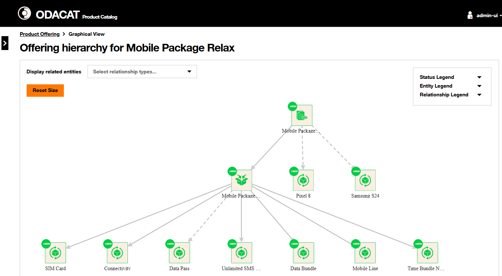

For clarity purpose, it is also possible to dynamically reorganise the default hierarchy diagram, by selecting any entity of the diagram and by moving it to another place in the diagram. 

For each entity of the diagram, a right click on the entity displays a modal window showing its main characteristics (status, id, etc.). In addition, the selection of the **View All Details** action on the bottom of the modal window trigger the visualization of the definition of the entity selected. 

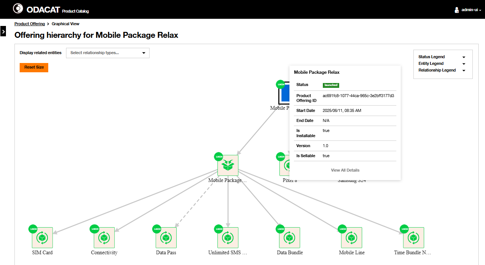.

### Modify Contract Product Offering

This section describes how a Contract Product Offering can be modified with the ODACAT User Interface. This modification follows a sequence of configurations on the user interface aligned with the process flow presented in the [Modify Product Offering](https://catalog-doc-integration-disco.apps.fr01.paas.tech.orange/architecture/overall-architecture/#modify-product-offering) section of the [Overall Architecture](https://catalog-doc-integration-disco.apps.fr01.paas.tech.orange/architecture/overall-architecture/).

A **Contract Product Offering** registered in the Product Catalog and with either inTest or active status may be updated on:

- some of its Identity Data,
- associated Category,  
- associated Offer(s) Bundling,  
- associated Product Offering Price(s) to add for instance a **Product Offering Price Charge**, change the **Commercial Operation** associated to a Product Offering Price Charge, or to remove a previously associated **Product Offering Price Charge**,  
- associated Policy Rules to add another Policy Rule or to remove a Policy Rule previously associated to this Contract,  
- associated Relationships to add 'requires' or 'incompatible' relationship with another Product Offering, or to remove a relationships previously defined for this Contract.  

??? warning "Update of entity Name and entity Description"
    Any update of Name and Description to empty value will be rejected and an error message will be displayed.  

!!! note "Record of the updates done"
    In order to record the changes on a card, you should click on the Update button related to the card.  
    At the end, you need also to submit the updates with the **Submit** orange button.  
    If you want to cancel the modification process, then click on the **Cancel** black button on the bottom of the page. 

## Change the lifecycle status

Product Catalog enables to change the status of Product Offering according [Product Offering lifecyle](../../../architecture/overall-architecture/product-offering-product-specification-lifecycle) section of the [Overall Architecture](../../../architecture/overall-architecture/).

There are different ways to change the status of a Production Offering according the lifecyle of this catalog entity:  

- From the **Product Offering Dashboard** with the  icon in the **Actions** column of the associated Product Offering to be modified.

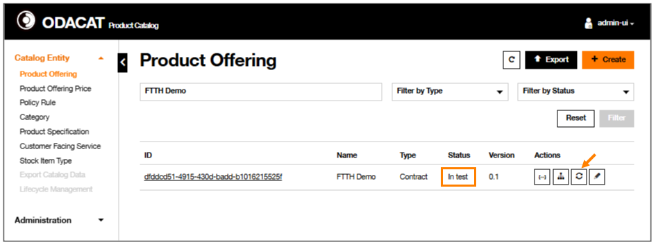

A modal window is displayed. You can see the the current status of the Product Offering and you can select the target status. In the example below, we are changing the FFTH Demo Contract status from inTest to active. Then click on the Save changes button.

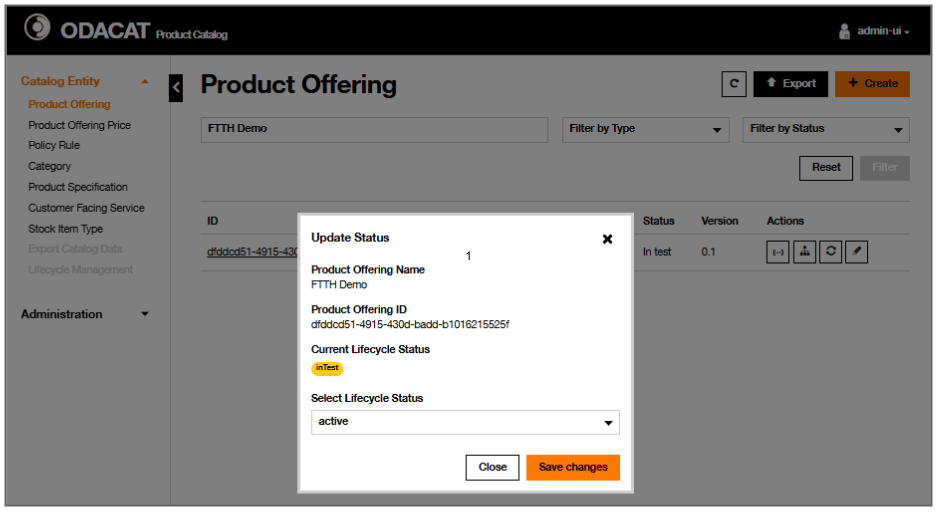

Cancellation of the status change is also possible by cliking on the 'Close' button. 

The Dashboard shows that the status of the product Offering has been updated to the new value.

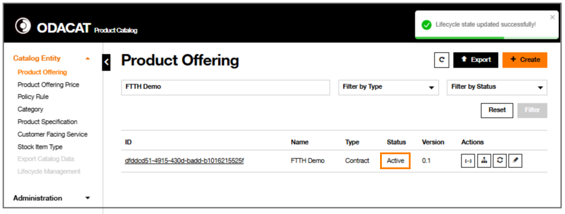

- From the **Product Offering Details** page, by clicking on the  button.  

## Hands-on cases

This section describes all steps in details to guide you to configure the solution for specific cases presented in the table below:

| Index | Hands-on case Name                                         |
| ----- | ---------------------------------------------------------- |   
| 1     | Installment Plans in Product Offering associated to Device |   
| 2     | Contract Charge related to Commitment Terms                |   

### 1. Installment Plans in Product Offering associated to Device 

!!! abstract "Marketing Requirement"

    A device 'NewSmartphone' is sold by an operator with following Installment Plan 

    | Device        | Device Characteristic | Installment Plan                                                                             |
    | ------------- | --------------------- | -------------------------------------------------------------------------------------------- |
    | NewSmartphone | 256GB                 | Installment Charge of 1000€ with 24 Rates and 100€ Down Payment                              |
    | NewSmartphone | 256GB                 | Installment Charge of 1500€ with 36 Rates and an Interest Rate 2.5% from 'Best Bank' Partner |

    Please note that management of other prices based on other memory sizes and installment plans will have same configuration process as the one detailed in this hands-on case. So it's easy to extend this one to other use cases. In this hands on case description, we will focus on the first installment plan 'Installment Charge of 1000€ with 24 Rates and 100€ Down Payment`. Similar configuration can be used for the second one provided relevant configuration of the Installment Charge which is described in [Create an Installment Charge with Interest Rate and Partner](../../product-offering-price/#21-create-an-installment-charge-with-down-paymentproduct-offering-price/#22-create-an-installment-charge-with-interest-rate-and-partner/) hands on case.

!!! training "Main configuration steps"
    The configuration of this use case requires mainly three sub-processes which must be configured in the following order:

    1. Create a Product Offering  
    2. Create a Policy Rule Pricing  
    3. Modify the Product Offering to associate the Policy Rule Pricing previously defined  

    !!! Note
        The Product Offering must be created ^^before^^ the configuration of the Policy Rule Pricing as the Product Offering is used during the configuration of the Event of the Policy Rule Pricing configuration.

??? info "Preconditions"
    - Installment Charges have been already configured in the product Catalog. For further details, please refer to the associated Product Offering Price hands-on cases [Create an Installment Charge with Down Payment](../../product-offering-price/#21-create-an-installment-charge-with-down-payment/) and [Create an Installment Charge with Interest Rate and Partner](../../product-offering-price/#21-create-an-installment-charge-with-down-paymentproduct-offering-price/#22-create-an-installment-charge-with-interest-rate-and-partner/).
    - In this hands one case, we will use, for exemple, a Product Specification named "Samsung A55 PS" which restricts the "Samsung A55" Stock Item Type, has been already created. In this use case, we will consider that Samsung A55 Stock Item has a `memory size` characteristic which `256 GB` and `512 GB` values.  

??? Quote "Create a Product Offering `NewSmartPhone`" 

    ???+ note "'Select Product Offering Type' card"
         | Action                               | Value   |  
         | -------------------------------------| ------- |  
         | Select Product Product Offering Type | Atomic  |  

    ???+ note "'Select Product Specification' card"
         | Action                               | Value                                        |  
         | -------------------------------------| -------------------------------------------- |  
         | Select Product Product Specification | Select "NewSmartPhone" Product Specification |  
     
         Then, click on Next button

    ???+ note "'Provide Description' card"
         | Action                    | Value                |  
         | --------------------------| -------------------- |  
         | Enter Name                | NewSmartPhone        |  
         | Enter Description         | NewSmartPhone Device |  
         | Enter Validity Start Date | 30/03/2026 11:30     | 

         Then, click on Next button

    ???+ note "'Select Eligible Commercial Operation(s)' card"
         | Action                      | Value                                       |  
         | ----------------------------| ------------------------------------------- |  
         | Select Commercial Operation | Enable 'add', 'Return' and 'Replace' values |  

    ???+ note "'Define Characteristics' card"
         | Action                | Value            |  
         | ----------------------| ---------------- |  
         | Select characteristic | 256GB and 512 GB |  
         | Add the Product Offering Characteristic |*See below* | 
         
         Add the Product Offering Characteristic `Installment Period"

         | Action                                     | Value                                                                                 |  
         | -------------------------------------------| ------------------------------------------------------------------------------------- |  
         | click on '**+ Add Characteristic**' button |                                                                                       |  
         | Enter Name                                 | Installment Period                                                                    |  
         | Enter Description                          | The installment period for the installment based plan                                 |  
         | Click on  to enter the PO characteristic value | *Enter the Value in the modal window* |  

         Enter the Product Offering Characteristic "Installment Period values" in the modal window

         | Action                                                                                                | Value    |  
         | ------------------------------------------------------------------------------------------------------| -------- |  
         | click on '**+ Add Values**' button                                                                        |          |  
         | Enter Value                                                                                           | 24 Month |  
         | Enable `IsDefault` toggle                                                                             | Enable   |  
         | Click on  to approve the value entered |          |  
         | Click on 'Save' button to save the Product Offering Characteristic value(s)                           |          |  

    ???+ note "'Associate Product Offering Price' card"
         Nothing to do for now. 
         Click on Next button 

    ???+ note "'Associate Policy Rule' card"
         Nothing to do for now. 
         Click on Next button 

    ???+ note "'Associate Relationship' card"
         Nothing to do for now. 
         Click on Next button 

    Once completed, click on the Create button to complete the creation of this Product Offering

    ??? example "Illustration of this configuration ODACAT UI"
        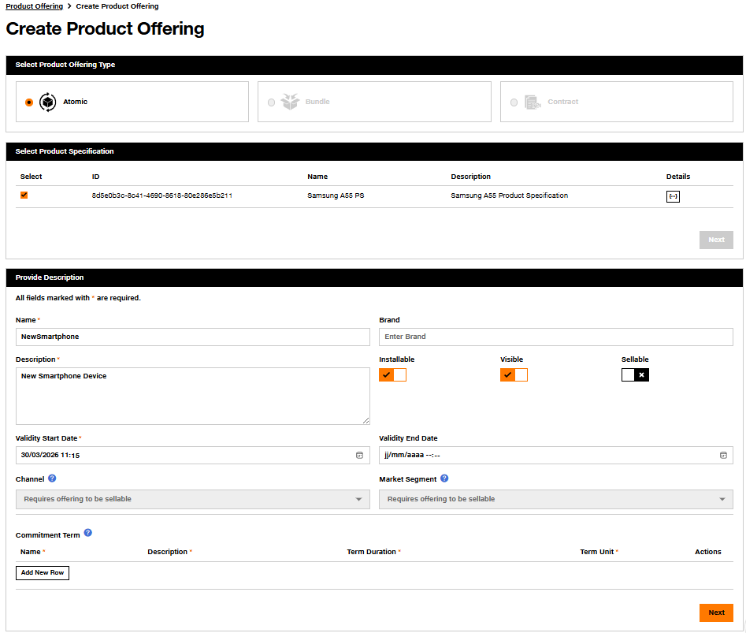{.img-zoomable}
        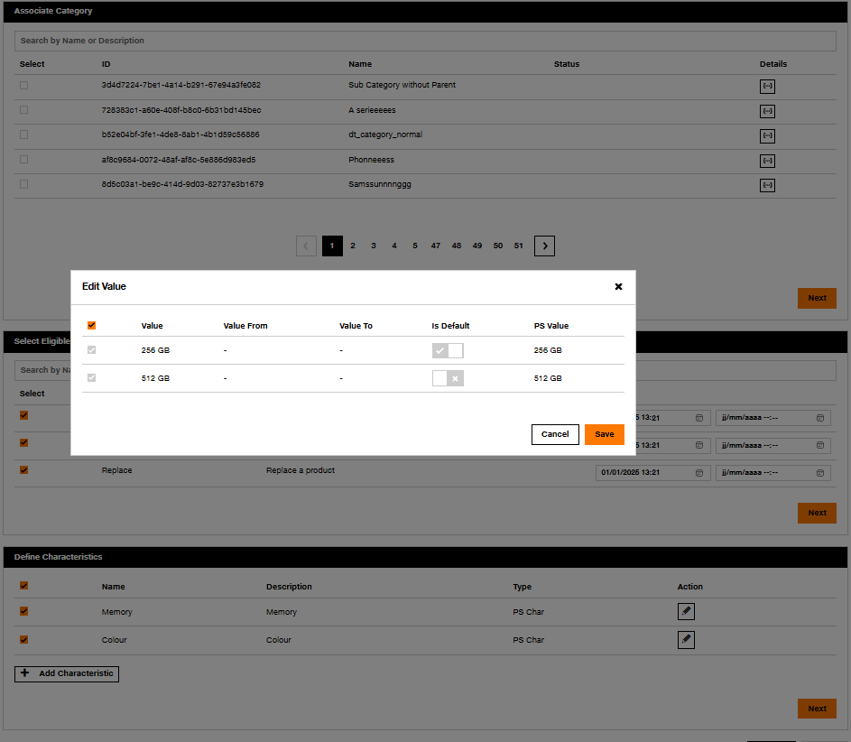{.img-zoomable}
        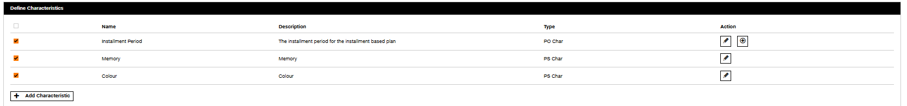{.img-zoomable}
        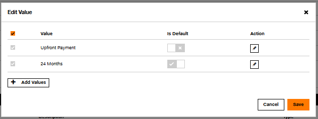{.img-zoomable}

    Then, click on Create button

    A message 'Product offering has been created successfully' is displayed

    !!! success "Result"
        The Product Offering 'NewSmartphone' has been created.  

        ??? example "Illustration in the Product Offering Dashboard"
            The Product Offering 'NewSmartphone' has been created with the ID `8cd8862e-b1f8-450c-8a01-c237172f3bcc` and is displayed in the Dashboard with a inTest status.            
            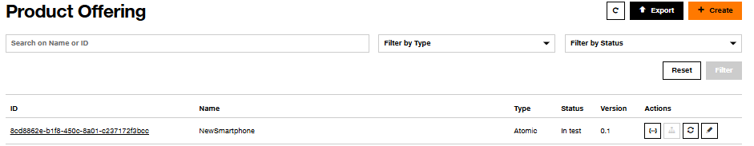{.img-zoomable} 

        ??? example "Illustration of the Product Offering Details" 
            It is also possible to visualize the Product Offering created  
            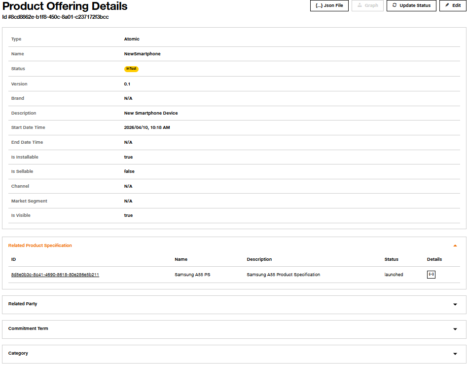{.img-zoomable}    
            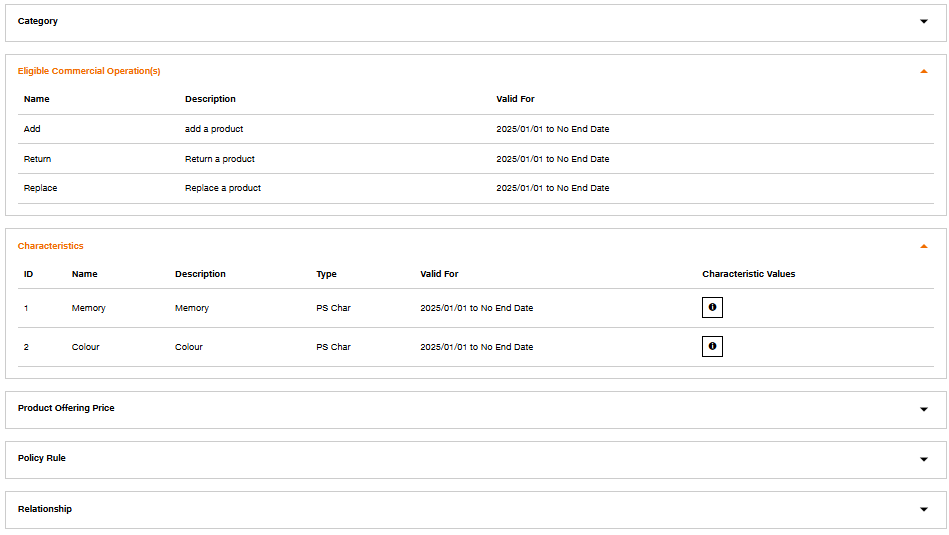{.img-zoomable}    

??? Quote "Create a Policy Rule Pricing `NewSmartPhone 256 GB 24 Months Installment`" 

    ???+ note "'Provide Description' card"
         | Name                                       | Description                                                                                       | 
         | ------------------------------------------ | ------------------------------------------------------------------------------------------------- |   
         | NewSmartPhone 256 GB 24 Months Installment | Policy Rule Pricing for NewSmartPhone PO with 256 GB memory size and 24 Months installment period | 

         Then, click on Next button 

    ???+ note "'Provide Event' card"
         | Name                  | Description                    | Associate Product Offering - Name | Associate Product Offering - Commercial Operation | 
         | --------------------- | ------------------------------ |---------------------------------- |-------------------------------------------------- |   
         | EVT-Add-NewSmartPhone | Event Add the NewSmartPhone PO | NewSmartPhone                     | add                                               | 

         Then, click on Next button   

    ???+ note "'Provide Condition' card"
         | Name           | Description                                                          |
         | -------------- | -------------------------------------------------------------------- |
         | CDT-Memory-256 | Condition: Memory value is 256GB and Installment period is 24 Months | 
    
         Statements

         | Product Offering | Entity          | Entity Value       | Variable Value | Joined Operand |  
         | ---------------- | --------------- |------------------- |--------------- | -------------- |   
         | NewSmartPhone    | Characteristics | Memory             | 256GB          |  AND           | 
         | NewSmartPhone    | Characteristics | Installment Period | 24 Months      |  NA            | 

         **Save** the Condition Statement

         Then, click on Next button 

    ???+ note "'Provide Action' card"
         Select the Product Offering Price: `IP1000_24M_DP100` 
    
         for furhter detail on this charge, please refer to [Create an Installment Charge with Down Payment](../../product-offering-price/#21-create-an-installment-charge-with-down-payment/)
      
         Then, click on **Validate** button

       Then, click on Create button

    !!! success "Result"
        The Policy Rule `NewSmartPhone 256 GB 24 Months Installment` has been created and is displayed in the Policy Rule Dashboard with a inTest status.

??? Quote "Modify the Product Offering `NewSmartPhone`to add the Policy Rule `NewSmartPhone 256 GB 24 Months Installment`" 

    ???+ note "'Associate Policy Rule' card"
         | Action                            | Value                                                             |  
         | ----------------------------------| ----------------------------------------------------------------- |  
         | Associate the Policy Rule Pricing | Enable the check box 'NewSmartPhone 256 GB 24 Months Installment' |  
         
         Then, click on Update button 
    
         Once completed, click on the Submit button to complete the modification of this Product Offering
    
         A message 'Product offering has been modified successfully' is displayed

    !!! success "Result"
        The Product Offering 'NewSmartphone' has been modified in order to associate the Policy Rule Pricing, which aims to activate an Installment Charge of 1000€ on 24 months and Down Payment of 100€ when the memory size `256GB` is selected.

!!! success "Result"
    A Product Offering 'NewSmartphone' with an Installment Charge of 1000€ on 24 months and Down Payment of 100€ when the memory size `256GB` has been created.

### 2. Contract Charge related to Commitment Terms  

!!! abstract "Marketing Requirement"
    Commitment Terms 12 Months and 24 Months are associated to a Contract named 'Mobile Extra Contract' which is sold by Operator.  

    > The Contract, with 12 Months Commitment Term, has:  
    >  - a monthly recurring charge of 15€ (19% Tax excluded) and  
    >  - a penalty fee of 50€ (tax excluded) if the Contract is terminated before the end of the 12 months commitment period 

    > The Contract, with 24 Months Commitment Term, has:  
    >  - a monthly recurring charge of 10€ (19% Tax excluded) and  
    >  - a penalty fee of 100€ (tax excluded) if the Contract is terminated before the end of the 24 months commitment period  

!!! training "Main configuration steps"
    The configuration of this use case requires mainly five sub-processes:  

    1. Create a Product Offering Price: Recurring Charge of 15€ with a 19% Tax alteration  
    2. Create a Product Offering Price: Recurring Charge of 10€ with a 19% Tax alteration  
    3. Create a Product Offering Price: Non-Recurring Charge of 50€ with a 19% Tax alteration  
    4. Create a Product Offering Price: Non-Recurring Charge of 100€ with a 19% Tax alteration  
    5. Create a Product Offering 'Mobile Extra Contract' which includes Commitment Terms and the Product Offering Prices defined previously 

??? info "Preconditions"
    - Installment Charges have been already configured in the product Catalog. For further details, please refer to the associated Product Offering Price hands-on cases [Create an Installment Charge with Down Payment](../../product-offering-price/#21-create-an-installment-charge-with-down-payment/) and [Create an Installment Charge with Interest Rate and Partner](../../product-offering-price/#21-create-an-installment-charge-with-down-paymentproduct-offering-price/#22-create-an-installment-charge-with-interest-rate-and-partner/).
    - The Product Specification "Samsung A55 PS" which restricts "Samsung A55" STK has been created. In this use case, we will consider that Samsung A55 Stock Item has a `memory size` characteristic which `256 GB` and `512 GB` values.   

??? Quote "Create a Product Offering Price `Mobile Extra Contract 12 month charge`" 

    ???+ note "'Select Product Offering Price Type' card"
    
         | Action                                        | Value  | 
         | --------------------------------------------- | ------ |   
         | Select the target Product Offering Price Type | Charge | 

    ???+ note "'Define Charge Identity' card"
    
         | Name                                  | Description                           | Price Type | Recurring Charge Period  (Length Duration) | Price Value | Currency |
         | ------------------------------------- | ------------------------------------- |----------- |----------------------------------------------- |------------ |--------- |   
         | Mobile Extra Contract 12 month charge | Mobile Extra Contract 12 month charge | Recurring  | 1 Month                                        | 15          | EUR      |

    ???+ note "'Define Relationship with Alteration' card"
    
         | Name    | Description     | Type | Percentage |
         | ------- | --------------- |----- | ---------- |
         | VAT     | VAT tax at 19%  | Tax  | 19%        |

    ???+ note "'Define Validity' card"

         | Status   | Validity Start Date & Time |
         | -------- | -------------------------- |
         | Launched | 2025/08/27 11:21 AM        | 

    Then, click on Create button

    !!! success "Result"
        The Product Offering Price `Mobile Extra Contract 12 month charge` has been created and is displayed in the Dashboard with a launched status.

??? Quote "Create a Product Offering Price `Mobile Extra Contract 24 month charge`" 

    ???+ note "'Select Product Offering Price Type' card"
    
         | Action                                        | Value  | 
         | --------------------------------------------- | ------ |   
         | Select the target Product Offering Price Type | Charge |

    ???+ note "'Define Charge Identity' card"
    
         | Name                                  | Description                           | Price Type | Recurring Charge Period  (Length Duration) | Price Value | Currency |
         | ------------------------------------- | ------------------------------------- |----------- |------------------------------------------ |------------ |--------- |   
         | Mobile Extra Contract 24 month charge | Mobile Extra Contract 24 month charge | Recurring  | 1 Month                                   | 10          | EUR      |

    ???+ note "'Define Relationship with Alteration' card"

         | Name    | Description     | Type | Percentage |
         | ------- | --------------- |----- | ---------- |
         | VAT     | VAT tax at 19%  | Tax  | 19%        |

    ???+ note "'Define Validity' card"
    
         | Status   | Validity Start Date & Time |
         | -------- | -------------------------- |
         | Launched | 2025/08/27 11:21 AM        |

    Then, click on Create button

    The Product Offering Price `Mobile Extra Contract 24 month charge` has been created and is displayed in the Dashboard with a launched status.

??? Quote "Create a Product Offering Price `Mobile Extra Contract 12 month penalty: 50 Eur`" 

    ???+ note "'Select Product Offering Price Type' card"

         | Action                                        | Value  | 
         | --------------------------------------------- | ------ |   
         | Select the target Product Offering Price Type | Charge | 

    ???+ note "'Define Charge Identity' card"
         | Name                                           | Description                                    | Price Value | Currency |
         | ---------------------------------------------- | ---------------------------------------------- |------------ |--------- |   
         | Mobile Extra Contract 12 month penalty: 50 Eur | Mobile Extra Contract 12 month penalty: 50 Eur | 50          | EUR      |

    ???+ note "'Define Relationship with Alteration' card"

         | Name    | Description     | Type | Percentage |
         | ------- | --------------- |----- | ---------- |
         | VAT     | VAT tax at 19%  | Tax  | 19%        |

    ???+ note "'Define Validity' card"

         | Status   | Validity Start Date & Time |
         | -------- | -------------------------- |
         | Launched | 2025/08/27 11:21 AM        | 

    Then, click on Create button

    The Product Offering Price `Mobile Extra Contract 12 month penalty: 50 Eur` has been created and is displayed in the Dashboard with a launched status.

??? Quote "Create a Product Offering Price `Mobile Extra Contract 24 month penalty: 100 Eur`" 

    ???+ note "'Select Product Offering Price Type' card"

         | Action                                        | Value  | 
         | --------------------------------------------- | ------ |   
         | Select the target Product Offering Price Type | Charge | 

    ???+ note "'Define Charge Identity' card"

         | Name                                            | Description                                     | Price Value | Currency |
         | ----------------------------------------------- | ----------------------------------------------- |------------ |--------- |   
         | Mobile Extra Contract 24 month penalty: 100 Eur | Mobile Extra Contract 24 month penalty: 100 Eur | 100         | EUR      |

    ???+ note "'Define Relationship with Alteration' card"

         | Name  | Description     | Type | Percentage |
         | ----- | --------------- |----- | ---------- |
         | VAT   | VAT tax at 19%  | Tax  | 19%        |

    ???+ note "'Define Validity' card"

         | Status   | Validity Start Date & Time |
         | -------- | -------------------------- |
         | Launched | 2025/08/27 11:21 AM        | 

    Then, click on Create button

    The Product Offering Price `Mobile Extra Contract 24 month penalty: 100 Eur` has been created and is displayed in the Dashboard with a launched status.

??? Quote "Create a Mobile Extra Contract Product Offering" 

    ???+ note "'Select Product Offering Type' card"

         | Action                       | Value    |  
         | -----------------------------| -------- |  
         | Select Product Offering Type | Contract |  

    ???+ note "'Provide Description'"

         | Action                     | Value                                              |    
         | ---------------------------| -------------------------------------------------- |  
         | Enter Name                 | Mobile Extra Contract                              |  
         | Enter Description          | Mobile Extra Contract                              |  
         | Enter Billing Type         | posptaid                                           |  
         | Enter Channel              | Selfcare                                           |  
         | Enter Market Segment       | BC                                                 |  
         | Enter Validity Start Date  | 30/03/2026 11:30                                   | 
         
         Configure the Commitment Terms:      

         | Action                     | Value      |  
         | ---------------------------| ---------- |  
         | Enter Name                 | 12 Month   |  
         | Enter Description          | 12 Month   |  
         | Enter Term Duration        | 12         |  
         | Select Term Unit           | Month      |  

         | Action                     | Value      |  
         | ---------------------------| ---------- |  
         | Enter Name                 | 24 Month   |  
         | Enter Description          | 24 Month   |  
         | Enter Term Duration        | 24         |  
         | Select Term Unit           | Month      |  

         Then, click on Next button 

    ???+ note "'Select Eligible Commercial Operation(s)' card"

         | Action                       | Value                                          |  
         | -----------------------------| ---------------------------------------------- |  
         | Select Commercial Operation  | Enable 'Add', 'Modify', 'Terminate', 'Migrate' |  

    ???+ note "'Manage Offer Bundling' card"

         Select offers to be bundled within the Contract 
         Click on Next button 

    ???+ note "'Select Allowed Action by Channel' card"

         Nothing to do for now. 
         Click on Next button 

    ???+ note "'Associate Product Offering Price' card"

         | Action     | Name                                             | Price | Price Type    | Commercial Operations| Commitment Terms| 
         | -----------| ------------------------------------------------ | ----- | ------------- | -------------------- |-----------------| 
         | Select POP |	Mobile Extra Contract 12 month charge           |  15   | Reccuring     | Add                  | 12 Month        |
         | Select POP |	Mobile Extra Contract 24 month charge           |  10   | Reccuring     | Add                  | 24 Month        |
         | Select POP |	Mobile Extra Contract 24 month penalty: 50 Eur  |  50   | Non Reccuring | Terminate            | 12 Month        |
         | Select POP |	Mobile Extra Contract 24 month penalty: 100 Eur |  100  | Non Reccuring | Terminate            | 24 Month        |
         
        !!! reco "Monthly fee versus Penalty fee in Commitment Terms Management" 

            In order to differentiate recuring charge from non recurring charge (a.k.a. penalty) during the price configuration with Commitment Terms Management, you will have to consider that:  
            - The association of the recurring charge with the **Add** commercial operation defines the monthly **recurring charges to be applied to the product offering during the Commitment period** associated,            
            - The association of the non recurring charge with the **Terminate** commercial operation defines the **penalty which will be applied if the contract is terminated before the end of the commitment period** associated. 

    ???+ note "'Associate Policy Rule' card"

         Nothing to do for now. 
         Click on Next button 

    ???+ note "'Associate Relationship' card"

         Nothing to do for now. 
         Click on Next button 

    Once completed, click on the Create button to complete the creation of this Product Offering

    Then, click on Create button

    A message 'Product offering has been created successfully' is displayed

    !!! success "Result"
        The Product Offering 'Mobile Extra Contract' has been created with a inTest status.  

        ??? example "Illustration of the Product Offering Details" 
            It is also possible to visualize the Product Offering created  
            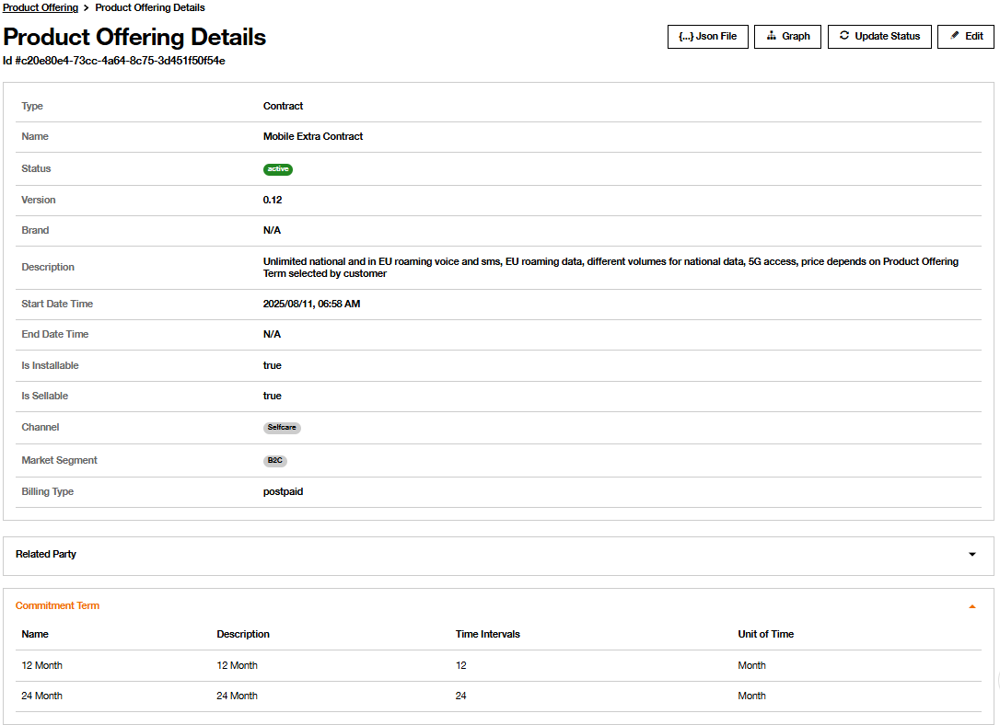{.img-zoomable}    
            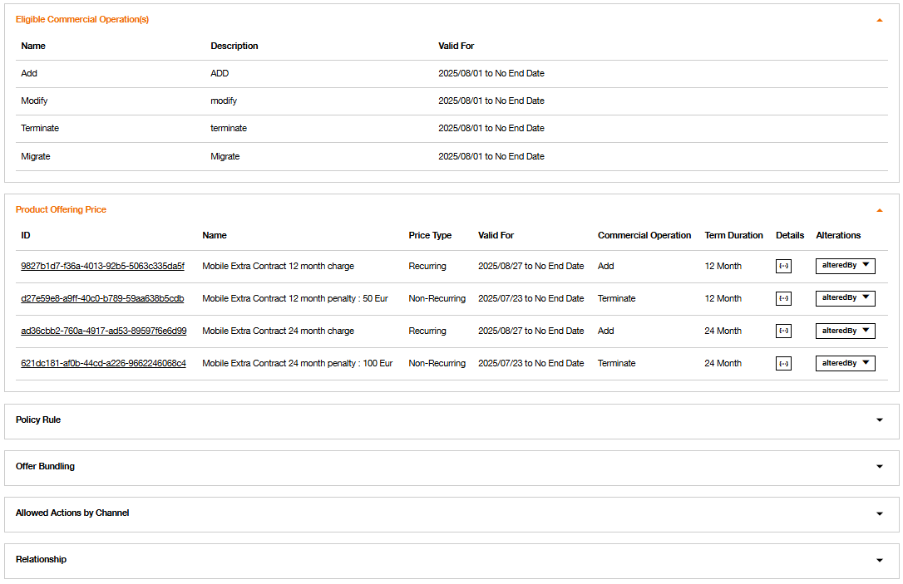{.img-zoomable}    

