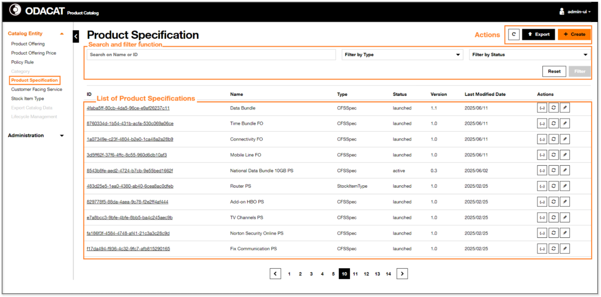
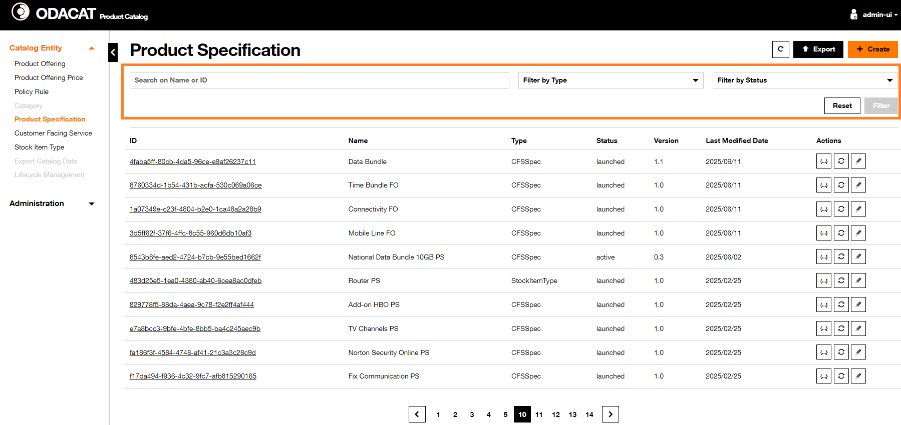
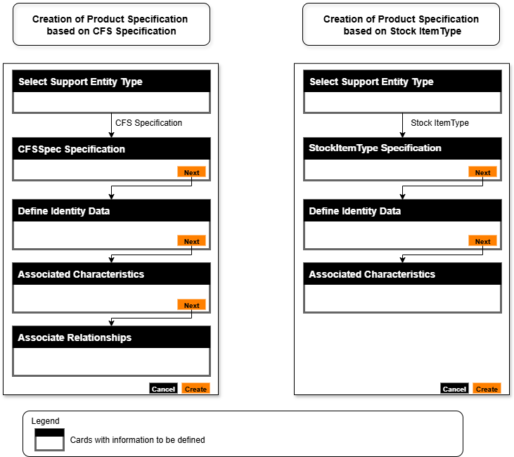
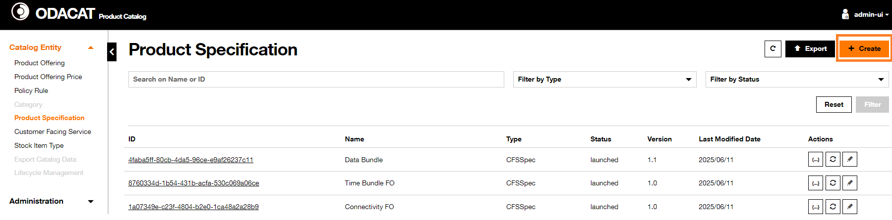
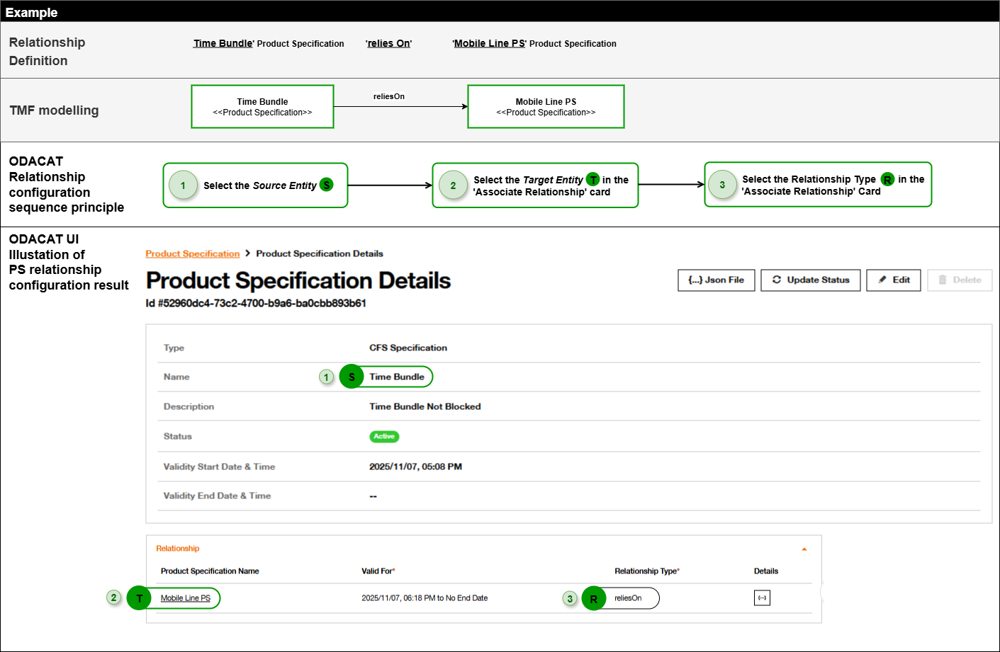
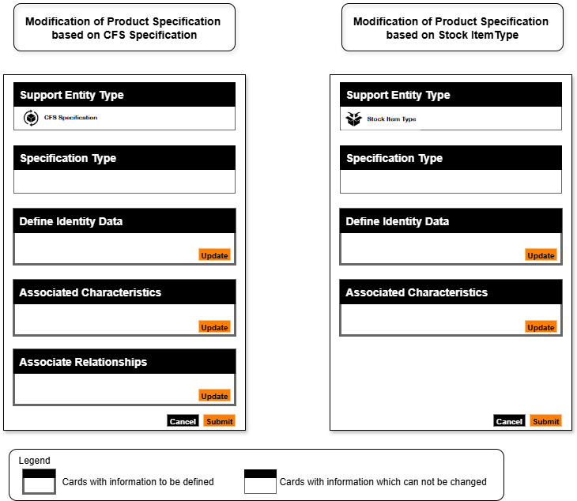

# Product Specification

## Dashboard

In the ODACAT Product Catalog User Interface, you can access to **Product Specification Dashboard** by selecting the **Product Specification** from the "Catalog Entity" panel. It includes:  
- a set of Action buttons:   
  -  button to refresh the display    
  -  button to generate an export file with the list of Product Specifications    
  -  button to create a Product Specification     
- a [Search and filter function](../product-specification/#search-and-filter-function) related area, you can use to filter the list of Product Specifications.   
- a list of Product Specifications. 

   

### Information Displayed and Actions

The list of Product Specifications displays all of, or a subset of, the Product Specification(s) defined in the Product Catalog. By default, only the Product Specifications with inTest / active / launched status are displayed. The properties of the Product Specification(s) displayed include: 

  | Column               | Description                                                                                                                      |
  | :------------------- | :------------------------------------------------------------------------------------------------------------------------------- |
  | `ID`                 | The identifier of the Product Specification                                                                                      |
  | `Name`               | The name of the Product Specification                                                                                            |
  | `Type`               | It defines whether the Product Specification is a based on [CFS Specification/Stock Item]                                        |
  | `Status`             | The status of the Product Specification which value can be inTest active launched (other statuses are not displayed)           |
  | `Version`            | The version of the Product Specification                                                                                         |
  | `Last Modified Date` | The date this Product Specification was last modified                                                                            |
  | `Action`             | Set of Product Specification specific actions:   to get details on its definition in *Json* format   to change its lifecycle status   to edit it.  | 

### Search and filter function

The **Search and filter function** of the **Product Specification Dashboard** enables to retrieve the list of Product Specifications based on a set of filter criteria:

- Identifier ID or Name
- Type: [CFS Specification/Stock Item Type] values
- Status: inTest, active or launched values

These filter criteria may be combined.

 

??? abstract "Search by ID"
     1. Enter the **Product Specification ID** in the **Search on Name or ID** area  
     2. Click on **Filter** button  
     3. The result of the filtering is displayed:  
       - If the **Product Specification ID** is already defined in the Product Catalog, then the list of Product Specifications is refreshed and only the associated Product Specification is displayed with its properties.  
       - Otherwise, If the **Product Specification ID** is not defined in the Product Catalog, then the list of Product Specifications is refreshed with no entry and a message `No data to display` is provided.   
     4. To return on the default list of Product Specifications, click on the Reset button  on the top of the screen.   

??? abstract "Search by Name"
     **Full name entered**  
     1. Enter the complete **Product Specification Name** in the **Search on Name or ID** area  
     2. Click on **Filter** button  
     3. The result of the filtering is displayed:  
        - If there is a Product Specification already defined in the Product Catalog with this Name, then the list of Product Specifications is refreshed and only the associated Product Specification is displayed with its properties.  
        - Otherwise, if there is no Product Specification with this Name in the Product Catalog, then the list of Product Specifications is refreshed with no entry and a message `No data to display` is provided.
     4. To return on the default list of Product Specifications, click on the Reset button  on the top of the screen.     
     **Partial name entered**  
     1. Enter some characters of **Product Specification Name** in the **Search on Name or ID** area  
     2. Click on **Filter** button  
     3. The result of the filtering is displayed:  
       - If there is one or several Product Specification(s) already defined in the Product Catalog which Name includes the set of characters used for the Search, then the list of Product Specifications is refreshed and only the associated Product Specifications is (are) displayed with its (their) properties.  
       - Otherwise, if there is not any Product Specification which name includes this set of characters, then the list of Product Specifications is refreshed with no entry and a message `No data to display` is provided.  
     4. To return on the default list of Product Specifications, click on the Reset button  on the top of the screen.  

??? abstract "Filter by Type"
     The **Filter by Type** criteria of the Product Specification dashboard can be used to restrict the list of Product Specifications to:  
        - Product Specification based on `CFS Specification`  
        - Product Specification based on `StockItemType`    
    **Filter by 'CFS Specification' Type**  
     1. Click on the **Filter by Type** dropdown button and select the `CFSSpec` value  
     2. Click on **Filter** button  
     3. The result of the filtering is displayed accordingly. Only the Product Specification(s) which is (are) based on CFS Specification type is (are) displayed    
     4. To return on the default list of Product Specifications, clicks on the Reset button on the top of the screen.    
    **Filter by 'Stock Item Type' Type**  
     1. Click on the **Filter by Type** dropdown button and select the `StockItemType` value   
     2. Click on **Filter** button   
     3. The result of the filtering is displayed accordingly. Only the Product Specification(s) which is (are) based on StockItemType type is (are) displayed   
     4. To return on the default list of Product Specifications, clicks on the Reset button on the top of the screen.   

??? abstract "Filter by Status"
    The **Filter by Status** criteria of the Product Specification dashboard can be used to restrict the list of Product Specifications to a specific status inTest status or active or launched.     
    **Filter by 'active' status**  
     1. Click on the **Filter by Status** dropdown button and select the `inTest` value  
     2. Click on **Filter** button  
     3. Filtering result is displayed accordingly. Only the Product Specification(s) in inTest status is (are) displayed  
     4. To return on the default list of Product Specifications, click on the Reset button  on the top of the screen.     
    **Filter by 'active' status**  
     1. Click on the **Filter by Status** dropdown button and select the `Active` value  
     2. Click on **Filter** button  
     3. Filtering result is displayed accordingly. Only the Product Specification(s) in active status is (are) displayed  
     4. To return on the default list of Product Specifications, click on the Reset button  on the top of the screen.     
    **Filter by 'launched' status**  
     1. Click on the **Filter by Status** dropdown button and select the `Launched` value  
     2. Click on **Filter** button  
     3. Filtering result is displayed accordingly. Only the Product Specification(s) in launched status is (are) displayed  
     4. To return on the default list of Product Specifications, click on the Reset button  on the top of the screen.  

## General information about Product Offering configuration

??? warning "How to record the changes done in cards for Product Specification Creation and Modification"
    **The Creation of Product Specification follow a process flow to move from one activity, for instance 'CFS Specification' to the next one, for instance 'Define Identity Data' by clicking on the Next button. When you are invited to fill detail in card~(n+1)~ after having clicked on the Next button of the card~(n)~ it is possible to update the information of any previous cards (card~(n)~, card~(n-1)~,..) but you shall click on the Next button of the updated card to record the changes in database.** 
    
    **During the Modification of Product Specification, you can change the information of any cards displayed, for instance Define Identity Data, Associated Characteristics and this update can be done in the order you want, for instance, first add a characteristic in Associated Characteristics then change the 'Description' details in the Define Identity Data, BUT you must click on the Update button to register the change on each card modified.** 

## Create Product Specification

This section describes how a **Product Specification** can be created with the ODACAT User Interface. This creation follows a sequence of configurations on the user interface aligned with the process flow presented in the [Create Product Specification](https://catalog-doc-integration-disco.apps.fr01.paas.tech.orange/architecture/overall-architecture/#create-product-specification) section of the [Overall Architecture](https://catalog-doc-integration-disco.apps.fr01.paas.tech.orange/architecture/overall-architecture/).

The Create Product Specification process involves a set of  cards, which depends on whether the Product Specification will be inherited from a CFS Specification or a Stock Item Type:

- Select Support Entity Type enables to specify whether the Product Specification will be inherited from CFS Specification or from Stock Item Type  
- CFSSpec Specification enables to specify the CFS Specification that will be used for Product Specification  
- Stock Item Type Specification enables to specify the Stock Item Type that will be used for Product Specification  
- Define Identity Data enables to specify the Name, Description of the Product Specification  
- Associated Characteristics enables to select and specifiy Characteristics used at Product Specification level from the CFS Specification Characteristics inherited     
- Associate Relationships only applicable for Product Specification based on CFS Specification and enables to define a 'reliesOn' relationship between the Product Specification and other Product Specification (example: the 'Time Bundle' Product Specification relies on athe 'Mobile Line' Product Specification).

The figure below presents the different cards used for the Product Specification creation:

- on the left side, based on a CFS Specification,  
- on the left side, based on a Stock Item Type.

   

ODACAT Product Catalog enables to create a **Product Specification** based either on a `CFS Specification` or on a `Stock Item Type`.

### PS based on CFS Specification

!!! summary "Precondition"
     The CFS Specification supporting the Product Specification is registered in the Product Catalog.
     For details, please refer to [CFS Specification](../cfs-specification/)  

1. Click on the  on top right corner of the screen

   

2. A **Create Product Specification** page is displayed in which you have first to specify whether the Product Specification will be a restriction of a `CFS Specification` or a restriction of a `Stock Item Type`  
3. For the use case *Creation of PS based on CFS Specification* considered, select the **CFS Specification** radio button from the Select Support Entity Type card  
4. CFSSpec Specification card lists the **CFS Specifications**. Select the one to be used. Please note that you can retrieve the targeted CFS Specification with its name in the Search area or by scrolling the list.  
   Once the **CFS Specification** has been selected, click on the Next button
5. Define Identity Data card is used to define the following Product Specification attributes: 
   - Enter the **Name**   
   - Enter the **Description**  
   - Optionally, enter the **Brand** associated to this entity  
   - Optionally, update the value of the **Start Date**  
   - Optionally, enter the value of the **End Date**  
   - Optionally, configure the **Associate Related Party**  

    Once completed, click on the Next button to continue the process flow 

6. A list of characteristics, inherited from the CFS Specification characteristics, is displayed in the Associated Characteristics card. Configure, the characteristics which will be used at **Product Specification** level:   
   - You can select the characteristic(s) that will be used for the Product Specification:   
     - for all the characteristic: activate the checkbox on the top of the table 
     - for a specific characteristic: activate the checkbox in front of each characteristic to be selected.  
   - You can update some properties associated to each characteristic:
     - Specify whether or not the Product Specification Characteristic is configurable with the **IsConfigurable** checkbox  
     - Specify whether or not the Product Specification Characteristic is unique with the **IsUnique** checkbox  
     - Specify whether or not the Product Specification Characteristic is extensible with the **IsExtensible** checkbox  

    ???+ abstract "'Information about isConfigurable and isSelectable properties' card"
         - The "configurable" attribute in the body of the productSpecification defines whether the characteristic values are selectable by end user OR not. 
         - The characteristic is itself returned in the productConfiguration API response, but the selected characteristic values cannot be modified.
         - Also, the `isConfigurable` attribute in the `productConfiguration.configurationCharacteristic[]` object in the productConfiguration API is directly mapped and returned in the API response. This attribute can be used by the selfcare/front-end to indicate to the user that the values cannot be changed/modified.
         - Also, such characteristics are not returned in the "modify" scenario response, as they aren't editable by the end user.
         - The table below presents the characteristic behavior in context of `isConfigurable` and `isSelectable` for TMF760 API responses:

         | `isConfigurable` (defined @characteristic) | `isSelectable` (defined @characteristic.Value) | Expected behavior |
         | ------------------------------------------ | ---------------------------------------------- | ----------------- |
         | `true`                                     | `true`                                         | The characteristic is configurable, the value **CAN** be selected in the context of the given product specification | 
         | `true`                                     | `false`                                        | The characteristic is configurable, the value **CANNOT** be selected in the context of the given product specification | 
         | `false`                                    | `false`                                        | The characteristic is not configurable by the user. The `isSelectable` attribute shall be `false` by default in ODACAT is the `Isconfigurable` is `false` | 

   - You can also configure the characteristic value(s) which will be used at Product Specification level thanks to the  action in the **Edit the Value** column if this action is allowed. The modal window displayed enables to configure one or charateristic values at Product Specification level based on a restriction of the one defined in the CFS Specification, which is the Supported Entity in our context. Depending on the characteristics properties set up at CFS Specification level, you will be able to select one or several values or even configure new Product Specification characteristic Value thanks to the 'Add New Row' button. Don't forget to save the configuration thanks to the "Save" button if you want to record the configuration and return to the "Associated Characteristics". In case, you click on the "Close" button while some characteristics value have been modified, you will be asked either to cancel the closure and you will stay on the characteritic value configuration modal window or to continue without change and in this case, you will return to the card listing the characteristics. 

  | Column            | Description                                                                                                                     |
  | :---------------- | :------------------------------------------------------------------------------------------------------------------------------ |
  | `Value`           | The value of the Characteristic                                                                               |
  | `Value From`      | In case the values can be defined as a range, this attribute will include the minimum value, otherwise 'N/A' value is displayed |
  | `Value To`        | In case the values can be defined as a range, this attribute will include the maximum value, otherwise 'N/A' value is displayed |
  | `Unit of Measure` | Unit of measure of the characteristic value, for instance Mb, hour, etc.                                                        |
  | `Is Default ?`    | Toogle button to indicate if this value if the default one                                                                      |
  | `Is Selectable ?` | Toogle button to Indicate if this value can be selected                                                                         |
  | `CFS Value`       | Display the associated value by the support entity (CFS Spec)                                                                   |
  | `Action`          |  Delete action (greyed)                                                                |

   Once completed, click on the Next button to continue the process flow.
 
7. At the end, configure in the Associate Relationships card, the relationship between this Product Product Specification will have with other(s) Product Specification(s):  
   - You can first get details on each Product Specification listed thanks to the  button   
   - Once identified, you can select with the checkbox the Product Specification(s) that should have a relationship with the Product Specification under creation   
   - For each Product Specification selected, you can:  
     - Set up **Start Date** and **End Date** of the relationship by setting the **ValidFor** property  
     - Specify the **Relationship Type**. For now, only the `Relies On` relationship is managed at Product Specifications level. 

    The figure below illustrates the sequence order of the relationship example: "Time Bundle" Product Specification relies on "Mobile Line" Product Specification
    

   Once completed, click on the Create button to complete the process flow for the creation of a Product Specification based on a CFS Specification.

!!! success "Result" 
    The **Product Specification Dashboard** is displayed and includes the Product Specification which has been created. Its **state** and **version** are respectively inTest and `0.1`.

### PS based on StockItem Type

???+ summary "Precondition"
      The StockItemType that will be used to support the Product Specification has been already created.
      For details, please refer to [Stock Item Type](../stock-item-type/) 

1. Click on the **Create** button (orange) on top right corner of the screen  
2. A **Create Product Specification** page is displayed in which you have first to specify whether the Product Specification will be a restriction of a `CFS Specification` or a restriction of a `Stock Item Type`  
3. For the use case *Creation of PS based on Stock Item Type*, select the **Stock Item Type** radio button from the Select Support Entity Type card  
4. Stock Item Type Specification card lists the Stock Item Types. Select the one to be used. The Stock Item Type can be searched by Name or ID or by scolling the list.
   Once the **Stock Item Type** has been selected, click on the Next button    
5. Define the Product Specification in the Define Identity Data card: 
   - Enter the **Name**  
   - Enter the **Description**   
   - Optionally, enter the **Brand** associated to this entity  
   - Optionally, update the value of the **Start Date**  
   - Optionally, enter the value of the **End Date**  
   - Optionally, configure the **Associate Related Party**   

   Once completed, click on the Next button to continue the process flow.
    
6. A list of characteristics, inherited from the Stock Item Type characteristics, is displayed in the Associated Characteristics card. Configure the characteristics which will be used at **Product Specfication** level:   
   - You can select the characteristic(s) that will used for the Product Specification:  
     - for all the characteristic: activate the checkbox on the top of the table   
     - for a specific characteristic: activate the checkbox in front of each characteristic to be selected  
   - You can update the characteristic value(s) with the  button of the **Action** column, if this action is allowed.  

!!! summary "Edit Characteristic values"
    A modal window listing the possible characteristics displayed in a table and includes:  
       - A check box which is used to configure the selection of a specific technical value  
       - The technical name of the characteristic  
       - The value of the characteristic  
       - A toggle switch button 'Is Selectable ?' to specify whether the technical value is selected or not.  

     Once the value edition has been completed, click on the **Save** orange button to close the modal window.  

   Once completed, click on the Next button to continue the process flow.  

Once completed, click on the Create button to complete the process flow for the creation of a Product Specification based on a Stock Item Type.

!!! success "Result" 
    The **Product Specification Dashboard** is displayed and includes the Product Specification which has been created. Its **state** and **version** are respectively inTest and `0.1`.

## Get Product Specification Details

ODACAT Product Catalog enables to retrieve details on **Product Specification** with inTest or active or launched status.

### PS based on CFS Specification

1. Identify the **Product Specification (PS)** that needs to be consulted. The **Search and filter function** can be used to retrieve this Product Specification.  
2. The **Product Specification Details** page displayed includes, below the title, the **Identifier** of the selected **Product Specification**   
3. On the top right side of this page, some action buttons are present:  
   -  button to visualize the definition of the Product Specification in *Json* format  
   -  button to change the status according Product Specification life-cycle policy  
   -  button to update the Product Specification. Please refer to the associated paragraph for more details  

4. The **Product Specifcation Details** is composed of five cards giving details on Identity Data card, Related CFS Specification card,  Related Party card, Characteristics card and Relationship card. 

!!! note "Relationship card"  
    This card is displayed only if at least one relationship has been defined.

Identity Data  

It provides:  

   - the **Type**: it has a `CFS Specification` value to remind the selected Product Specification is a restriction from a CFS Specification  
   - the **Name**  
   - the **Description**  
   - the **Status**: the possible status are launched  active inTest  
   - the **Validity Start Date & Time**  
   - the **Validity End Date & Time**  
    
Related CFS Specification

It provides:  

   - the **ID** of the CFS Specification. It's possible to get details on this CFS Specification by clicking either on the link or on the **Details** action button.  
   - the **Name**  
   - the **Description**  
   - the **From** information gives the 'Validity Start Date & Time' of this CFS Specification.  
   - the **To** information gives the 'Validity End Date & Time' of this CFS Specification  
   - the **Status**  
   - the  **Details** action enables to visualize the definition of the CFS Specification in *Json* format.  

Related Party

If defined, it includes:  

  - the Related Party **Id**  
   - the Related Party **Name**  
   - the Related Party **Role**  
   - the Related Party **Party Type**  
        
Characteristics

It provides for each characteristic, the value of characteristic properties: 

   - **Id**  
   - **Name**  
   - **Description**  
   - Whether or not the Product Specification Characteristic is configurable based on the **IsConfigurable** checkbox  
   - Whether or not the Product Specification Characteristic is unique based on the **IsUnique** checkbox  
   - Whether or not the Product Specification Characteristic is extensible based on the **IsExtensible** checkbox  
   -  icon in the **Characteristic Value** column enables to get more details displayed in modal window  
    
Relationship

If relationship(s) has/have been setup, it will provide the **Relationships** associated to this Product Specification:  
   - **Product Specification Name** provides the name of the Product Specification in relationship with the selected Product Specification  
   - **Valid For** gives the the **Validity Start Date & Time** and the **Validity End Date & Time** of this relationship  
   - **Relationship Type** specifies the type of the relationship  
   - the  **Details** icon enables to visualize the definition, in *Json* format, of the Product Specification that has this relationship with the selected Product Specification.
    
### PS based on Stock Item Type

1. Identify the **Product Specification (PS)** that needs to be consulted. The **Search and filter function** can be used to retrieve this Product Speccification  
2. The **Product Specification Details** page now displayed includes, below the title, the **Identifier of the Product Specification**   
3. On the top right side of this page, some action buttons are displayed:  
   -  button to visualize the definition of the Product Specification in *Json* format  
   -  button to change the status according Product Specification life-cycle policy  
   -  button to update the Product Specification. Please refer to the associated paragraph for more details    

4. The **Product Specifcation Details** is composed of four cards giving details on Identity Data card, the Related Stock Item Type card, the Related Party card and the Characteristics card    
    
Identity Data 

It provides:  

   - the **Type**: it has a `Stock Item Type` value to remind the selected Product Specificationis a restriction from a Stock Item Type  
   - the **Name**  
   - the **Description**  
   - the **Status**  
   - the **Validity Start Date & Time**  
   - the **Validity End Date & Time**  
    
Related Stock Item Type

It provides:  

   - the **ID** of the Stock Item Type. It's possible to get details on this Stock Item Type by clicking on the link or by clicking on the 'Details' action button.  
   - the **Name**  
   - the **Description**  
   - the **From** information provided the 'Validity Start Date & Time' of this Stock Item Type  
   - the **To** information provided the 'Validity End Date & Time of this Stock Item Type  
   - the **Status**  
   - the  icon enables to visualize the definition of the Stock Item Type in *Json* format.

Related Party

It provides, if defined:  

   - the Related Party **Id**  
   - the Related Party **Name**  
   - the Related Party **Role**  
   - the Related Party **Party Type**  
        
Characteristics

It provides for each characteristic, the value of characteristic properties:   
   - the **Id**  
   - the **Name**  
   - the **Description**  
   - the  icon in the **Characteristic Value** column enables to get more details displayed in a modal window.

## Modify a Product Specification

This section describes how a **Product Specification** can be modified with the ODACAT User Interface. This modification follows a sequence of configurations on the user interface aligned with the process flow presented in the [Modify Product Specification](https://catalog-doc-integration-disco.apps.fr01.paas.tech.orange/architecture/overall-architecture/#modify-product-specification) section of the [Overall Architecture](https://catalog-doc-integration-disco.apps.fr01.paas.tech.orange/architecture/overall-architecture/).

The Modify Product Specification process involves a set of cards in the ODACAT UI:

- Select Support Entity Type reminds whether the given Product Specification is inherited from CFS Specification or from Stock Item Type  
- CFSSpec Specification reminds the CFS Specification used for the given Product Specification
- Stock Item Type Specification reminds the Stock Item Type used for the given Product Specification
- Define Identity Data enables to modify some information, for instance the Name, Description of the Product Specification
- Associated Characteristics enables to update the Characteristics used at Product Specification level from the CFS Specification Characteristics inherited   
- Associate Relationships only applicable for Product Specification based on CFS Specification, it enables to update the 'reliesOn' relationships between the Product Specification and other Product Specification (example: the 'Time Bundle' Product Specification relies on the 'Mobile Line' Product Specification).

The figure below presents the different cards used for the Product Specification modification: 

- on the left side, based on a CFS Specification,  
- on the left side, based on a Stock Item Type.

   

- A **Product Specification** based on a **CFS Specification** registered in the Product Catalog in inTest or active status may be updated from:  
   - Define Identity Data card    
   - Associated Characteristics  card    
   - Associate Relationships card    
- A **Product Specification** based on a **Stock Item Type** registered in the Product Catalog in inTest or active status may be updated from:    
   - Define Identity Data card    
   - Associated Characteristics card    

??? info "Precondition"
    The Product Specification has been already created.

??? warning "Update of entity Name and entity Description"
    Any update of Name and Description to empty value will be rejected and an error message will be displayed. 

1. Identify the Product Specification that needs to be modified. You can use the **Search and filter function** to retrieve the relevant Product Specification.  
2. There are multiple ways to update a Production Specification:  
   - From the **Product Specification dashboard**:  
     - option 1) Click on the   action  
     - option 2) Click on the **ID** link of the Product Specification  
   - From the **Product Specification Details** page:  
     - option 3) Click on the  button 
    
### PS based on CFS Specification

3. A **Modify Product Specification** page is then displayed with some predefined information:  
   - the **CFS Specification** as Support Entity Type selected in the Support Entity Type card   
   - the **reference and details of the CFS Specification** that supports the Product Specification being in the Specification Type cardupdated.  

4. Update some information of the Define Identity Data card. You can Update if necessary:  
   - the **Name**    
   - the **Description**    
   - the **Brand** associated to this entity  
   - the **Start Date**  
   - the **End Date**  
   - the **Associate Related Party**  
    
    Once completed, click on the Update button to record the update
    
5.  Update if necessary, the configuration of the Associated Characteristics that will used for the Product Specification. You can update:  
   - the selection of the characteristic, for instance add or remove a characteristic
   - the characteristic properties by changing the checkbox states associated to the `Is Configurable`, `Is Unique`, `Extensible` properties  
   - the characteristic value(s) by clicking on the **Edit the Value** if this action is allowed  
  
   Once completed, click on the Update button to continue the process flow.
 
6.  Update if necessary, the configuration of the Associate Relationships  that will be applicable for the Product Specification. You can:  
   - Create a new relationship with another Product Specification  
   - Update a previoulsy defined relationship at Product Specification level, for instance update the `Valid For` details  
   - Delete a previously defined relationship at Product Specification level  

     *Note: it is possible to get details on the Product Specification by clicking on the  **Details** button.*
   
  Once completed, click on the Update button to record the update.
    
  Then click on Submit button to complete the process flow for the modification of a Product Specification based on a CFS Specification.

!!! success "Result" 
    The **Product Specification Dashboard** is displayed and includes the Product Specification which has been modified.  
    For Product Specification with active status, the **version** is incremented.

### PS based on StockItem Type

3. A **Modify Product Specification** page is then displayed with some predefined information:  
   - the **Stock Item Type** as Entity Type selected in the Support Entity Type card  
   - the **reference and details of the Stock Item Type** that supports the Product specification being updated in the Specification Type card.  
   
4. Update some information of the Define Identity Data card. You can Update if necessary:  
   - the **Name**   
   - the **Description**   
   - the **Brand** associated to this entity  
   - the **Start Date**  
   - the **End Date**  
   - the **Associate Related Party**  
     
   Once completed, click on the Update button to record the update. 
    
5. Update if necessary, the configuration of the Associated Characteristics that will used for the Product Specification. You can update:  
   - the selection of the characteristic, for instance add or remove characteristic
   - the characteristic value(s) by clicking on the **Edit the Value** if this action is allowed  
   
Once completed click on Submit button to complete the process flow for the modification of a Product Specification based on a Stock Item.  

!!! success "Result" 
    The **Product Specification Dashboard** is displayed and includes the Product Specification which has been modified.  
    For Product Specification in active status, the **version** is incremented. 

## Change the lifecycle status

Product Catalog enables to change the status of Product Specification according [Product Specification lifecyle](../../../architecture/overall-architecture/#product-offering-product-specification-lifecycle) section of the [Overall Architecture](../../../architecture/overall-architecture/).

There are different ways to change the status of a Production Specification according the lifecyle of this catalog entity:  

- From the **Product Specification Dashboard** with the  icon in the **Actions** column of the associated Product Specification to be modified.  
- From the **Product Specification Details** page, by clicking on the  button.  