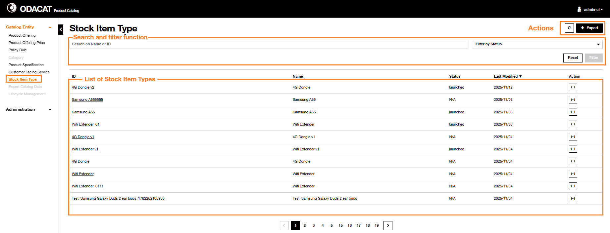

# Stock Item Type

## Dashboard

In the ODACAT Product Catalog User Interface, you can access to **Stock Item Type Dashboard** by selecting the **Stock Item Type** from the "Catalog Entity" panel.
It includes:  

- a set of Action buttons:   
  -  button to refresh the display    
  -  button to generate an export file with the list of Stock Item Types     
- a [Search and filter function](../stock-item-type/#search-and-filter-function) related area, you can use to filter the list of Stock Item Types.     
- a list of Stock Item Types.

   

### Information Displayed

The list of Stock Item Types displays all of, or a subset of, the Stock Item Type (s) defined in the Product Catalog. Some of the Stock Item Types properties are displayed in a table view:

  | Column               | Description                                                                                                                    |
  | :------------------- | :----------------------------------------------------------------------------------------------------------------------------- |
  | `ID`                 | The identifier of the Stock Item Type                                                                                          |
  | `Name`               | The name of the Stock Item Type                                                                                                |
  | `Status`             | The status of the Stock Item Type                                                                                              |
  | `Last Modified Date` | The date this Stock Item Type was last modified                                                                                |
  | `Action`             | The  action can be used to get details on the Stock Item Type  selected *Json* format |

### Search and filter function

The **Search and filter function** of the **Stock Item Type Dashboard** enables to retrieve the list of Stock Item Type(s) based on a set of filter criteria:

- Identifier ID or Name
- Status: active or launched values

These filter criteria may be combined.

??? abstract "Search by ID"
     1. Enter the **Stock Item Type ID** in the **Search on Name or ID** area  
     2. Click on **Filter** button  
     3. The result of the filtering is displayed:  
       - If the **Stock Item Type ID** is already defined in the Product Catalog, then the list of Stock Item Types is refreshed and only the associated Stock Item Type is displayed with its properties.  
       - Otherwise, If the **Stock Item Type ID** is not defined in the Product Catalog, then the list of Stock Item Types is refreshed with no entry and a message `No data to display` is provided.   
     4. To return on the default list of Stock Item Types, click on the Reset button  on the top of the screen.   

??? abstract "Search by Name"
     **Full name entered**  
     1. Enter the complete **Stock Item Type Name** in the **Search on Name or ID** area  
     2. Click on **Filter** button  
     3. The result of the filtering is displayed:  
       - If there is a Stock Item Type already defined in the Product Catalog with this Name, then the list of Stock Item Types is refreshed and only the associated Stock Item Type is displayed with its properties.  
       - Otherwise, if there is no Stock Item Type with this Name in the Product Catalog, then the list of Stock Item Types is refreshed with no entry and a message `No data to display` is provided.  
     4. To return on the default list of Stock Item Types, click on the Reset button  on the top of the screen.     
     **Partial name entered**  
     1. Enter some characters of **Stock Item Type Name** in the **Search on Name or ID** area  
     2. Click on **Filter** button  
     3. The result of the filtering is displayed:  
       - If there is one or several Stock Item Type(s) already defined in the Product Catalog which Name includes the set of characters used for the Search, then the list of Stock Item Types is refreshed and only the associated Stock Item Types is (are) displayed with its (their) properties.  
       - Otherwise, if there is not any Stock Item Type which name includes this set of characters, then the list of Stock Item Types is refreshed with no entry and a message `No data to display` is provided.  
     4. To return on the default list of Stock Item Types, click on the Reset button  on the top of the screen.  

??? abstract "Filter by Status"
    The **Filter by Status** criteria of the Stock Item Type dashboard can be used to restrict the list of Stock Item Types to a specific status active or launched.   
    **Filter by 'active' status**  
     1. Click on the **Filter by Status** dropdown button and select the `Active` value  
     2. Click on **Filter** button  
     3. Filtering result is displayed accordingly. Only the Stock Item Type(s) in active status is (are) displayed  
     4. To return on the default list of Stock Item Types, click on the Reset button  on the top of the screen.   
    **Filter by 'launched' status**  
     1. Click on the **Filter by Status** dropdown button and select the `Launched` value  
     2. Click on **Filter** button  
     3. Filtering result is displayed accordingly. Only the Stock Item Type(s) in launched status is (are) displayed  
     4. To return on the default list of Stock Item Types, click on the Reset button  on the top of the screen.  

## Get Stock Item Type Details

ODACAT Product Catalog enables to retrieve details on **Stock Item Type**.

1. Identify the **Stock Item Type** that needs to be consulted. The **Search and filter function** can be used to retrieve this Stock Item Type.  
2. The **Stock Item Type Details** page displayed includes below the tittle, the **Identifier** of the selected **Stock Item Type**   
3. On the top right side of this page, an action  button to visualize the definition of the Stock Item Type in *Json* format     
4. The **Stock Item Type** is composed of three cards giving details on the **Identity Data**, the **Characteristics** and the **Stock Items**:  

Identity data

It includes the following information about the Stock Item Type:

  | Line                        | Description                                                                                                                                                   |
  | :-------------------------- | :------------------------------------------------------------------------------------------------------------------------------------------------------------ |
  | `Name`                      | Name of the Stock Item Type                                                                                                                                   |
  | `Status`                    | Status of the Stock Item Type. The possible values can be launched or active |
  | `Validity Start Date & Time` |   |
  | `Validity End Date & Time`   |   |
   
Characteristics

It details, in a table, the properties of the characteristics provided by this Stock Item Type:  

  | Column            | Description                                           |
  | :-----------------| :---------------------------------------------------- |
  | `ID`              | The identifier of the Stock Item Type Characteristic  |
  | `Name`            | The name of the Stock Item Type Characteristic        |
  | `Description`     | The description of the Stock Item Type Characteristic |
  | `Valid From`      | Start & Date Time of the characteristic value         |
  | `Valid To`        | End Date & Time of the characteristic value           |

Stock Items 

It provides the list of Stock Items associated to this Stock Item Type:

  | Column  | Description                |
  | :------ | :------------------------- |
  | `ID`    | The ID of the Stock Item. If you click on a Stock Item ID, there will be redirection to a new page in which you will find further details on this Stock Item (see below) |
  | `Name`  | The Name of the Stock Item |

In this case, the **Stock Item Details** page displayed includes, below the title, the **Identifier** of the selected **Stock Item** and also the three additional cards **Identity Data**, the **Stock Item Type Details** and the **Characteristics** related to this Stock Item: 

Identity data 

It includes information about the Stock Item:  

  | Line                         | Description                                                                                                                                                     |
  | :--------------------------- | :-------------------------------------------------------------------------------------------------------------------------------------------------------------- |
  | `Name`                       | Name of the Stock Item                                                                                                                                          |
  | `Description`                | Description of the Stock Item                                                                                                                                   |
  | `Status`                     | Status of the Stock Item. The possible values can be launched or active    |
  | `Validity Start Date & Time` |   |
  | `Validity End Date & Time`   |   | 

Stock Item Type Details

It reminds information about the Stock Item Type which includes the selected Stock Item:

  | Line                        | Description                                                                                                                                                  |
  | :-------------------------- | :----------------------------------------------------------------------------------------------------------------------------------------------------------- |
  | `Name`                      | Name of the Stock Item Type                                                                                                                                  |
  | `Description`               | Description of the Stock Item Type                                                                                                                           |
  | `Status`                    | Status of the Stock Item. The possible values can be launched or active    |
  | `Validity Start Date & Time` |   |
  | `Validity End Date & Time`   |   |

Characteristics

It details, in a table, the properties of the characteristics provided by this Stock Item:  

  | Column                 | Description                                                                                                                                              |
  | :--------------------- | :------------------------------------------------------------------------------------------------------------------------------------------------------- |
  | `ID`                   | The identifier of the Stock Item Characteristic                                                                                                          |
  | `Name`                 | The name of the Stock Item Characteristic                                                                                                                |
  | `Description`          | The description of the Stock Item Characteristic                                                                                                         |
  | `Validity For`         | Start Date & Time and End Date & Time of the Stock Item Characteristic                                                                                   |
  | `Characteristic Values` |  button which displays in a modal window the possible value(s) of the Stock Item Characteristic selected |

  The modal window details the **Characteristics Values**" within a table with the following properties:

  | Column            | Description                                     |
  | :---------------- | :---------------------------------------------- |
  | `Value`           | The value of the Stock Item Characteristic      |
  | `Start Date Time` | Start & Date Time of the characteristic value   |
  | `End Date Time`   | End Date & Time of the characteristic value     |

!!! info "Commercial Operations"  
      The commercial operations for stockItems aren't managed in the resource catalog, the default operations for product offerings realized from stock items can be restricted to/ be a subset of "add"/"return"/"replace". As of now the DISCOBOLE Product Configurator supports "add" operations for stock item based offerings.  
