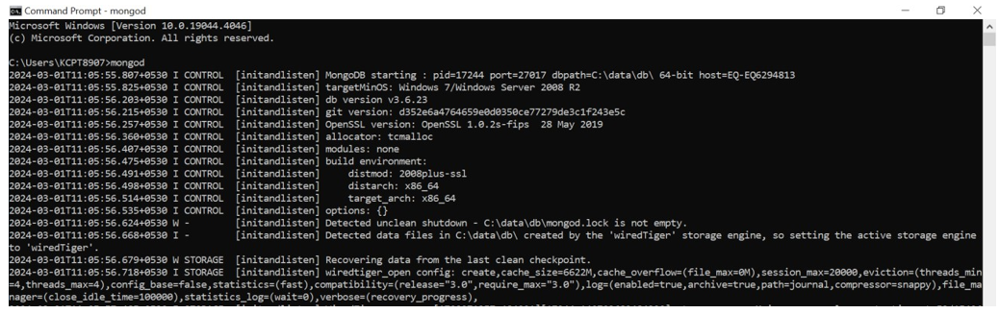
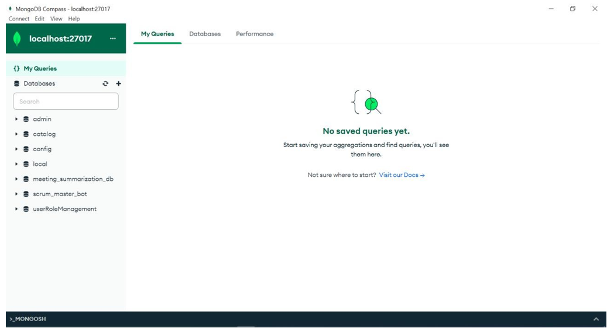
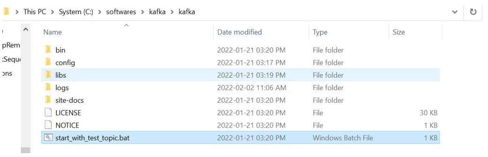
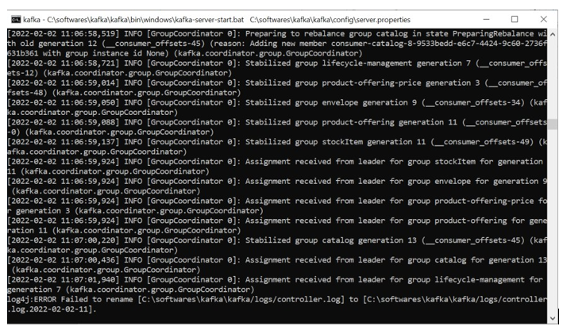
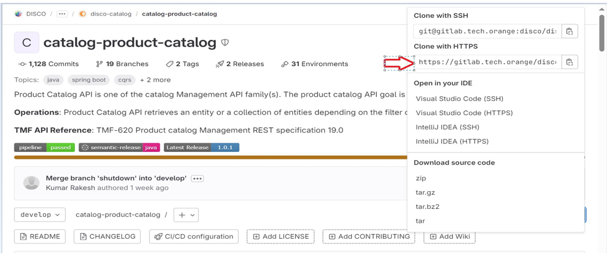
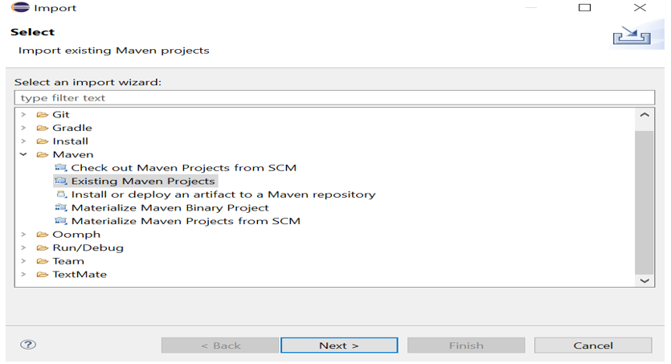
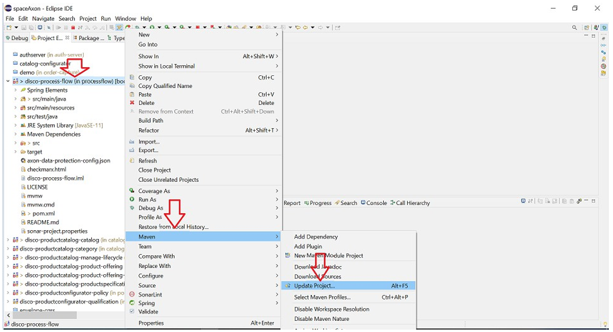
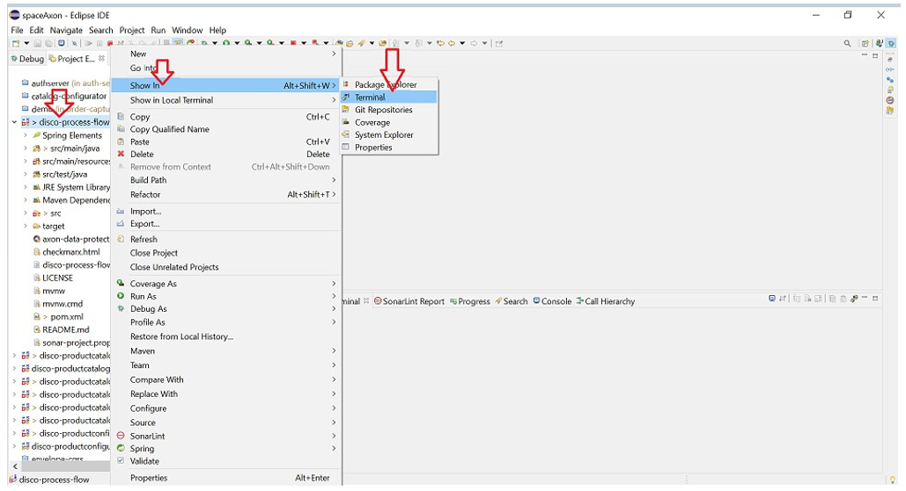
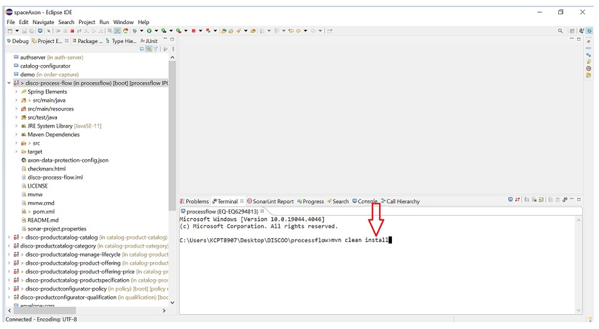
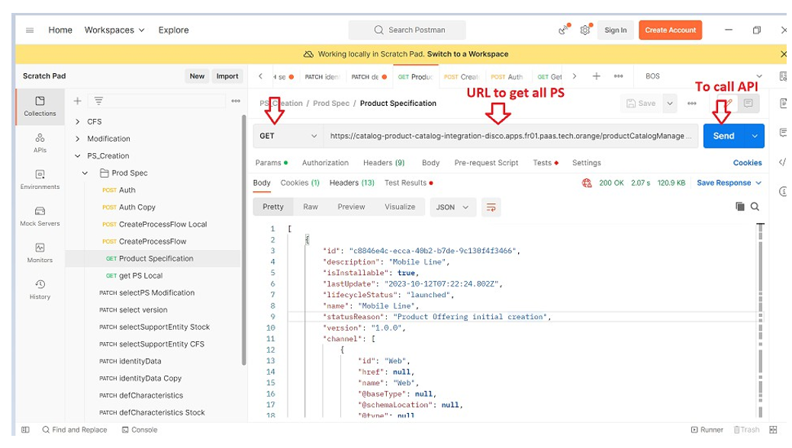

<!--
Software Name: disco-cataloglab-profile
SPDX-FileCopyrightText: 2025 Orange SA
SPDX-License-Identifier: MIT

This software is distributed under the MIT License,
the text of which is available at https://opensource.org/license/mit
or see the "LICENSE.txt" file for more details.

Authors: See CONTRIBUTORS.txt
-->

# Product Catalog (ODACAT) Component

Responsible for organizing the Commerce collection of Products and Product Offerings specifications that identify and define all requirements of a product or a product offering that can be commercialized.

## Community

You can chat with the core team on [](https://discord.gg/pzcwfgqns7).

## Getting Started

### Prerequisites

- git
- Java 17
- Maven 3.8
- MongoDB
- Kafka
- Postman

#### MongoDB

1. Download MongoDB and install it (zip --> extract). 
2. Create a folder `data` in your workspace and inside `data` create `db` folder. 
3. Go to bin path inside your MongoDB folder. (e.g. `C:\Program Files\MongoDB\Server\3.4\bin`) 
4. Add this path to your system environment variables. 
5. Open command prompt and type `mongod`.

6. Download MongoDB Compass to view databases and collections. 


#### Kafka

1. Install Kafka 
2. Go to Kafka folder directory and select `start_with_test_topic.bat` file from the `bin` folder. 
3. Please see the attached screenshot for reference. 

4. This will open the two prompts after executing `start_with_test_topic.bat` — one will be Kafka and the other Zookeeper.
 


### Installing with Git CLI

To install locally recursively the projects, please clone the [know-how project](https://gitlab.ow2.org/discobole/disco-project/know-how).

```bash
git clone git@gitlab.ow2.org:discobole/disco-project/know-how.git
cd know-how
```

By default, the projects are cloned into `$HOME/workspaces`. To change the workspaces folder and other options, please run `git-all --help` script.

Then clone all repositories of `disco-catalog`, as follows:

```bash
git-all clone discobole/disco-oda-components/disco-catalog
```

### Installing with IDE

1. First needs to clone the [Product Catalog component](https://gitlab.ow2.org/discobole/disco-oda-components/disco-catalog) from Git
2. Click on the clone Button

3. After clicking on the clone button, copied URL with HTTPS 

4. Open Command Prompt (`cmd.exe`) and locate directory where you want to clone 
5. Use below this command on all projects of the [Product Catalog component](https://gitlab.ow2.org/discobole/disco-oda-components/disco-catalog):
```bash
git clone https://gitlab.ow2.org/discobole/disco-oda-components/disco-catalog/{{project_name}}.git
```

#### Import Projects In IDE

1. Import the projects in IDE. Here we are using Eclipse IDE
2. We need to build the process flow project first as it is used in all projects of the Product Catalog component
3. Take clone of  the [process-flow project]([https://gitlab.ow2.org/discobole/disco-oda-components/process-flow.git)
4. So, let's import the process flow project and then the same steps will be followed for other projects. 
5. Click on **Files -> Import -> Select Existing Maven Project -> Next -> Browse** the location where you have cloned the process flow project -> **Finish**.


6. After that need to execute Maven update: right click on **Project -> Maven -> Update Project**

7. After completion of project update, need to build the project: right click on **Project -> Show in Terminal -> type** and execute in the console  `mvn clean install`.
 
 

8. Now need to set up catalog projects in same way as we have done setup for process flow project.
9. After importing all the projects successfully, we need to up Kafka service, MongoDB.
10. After step 7 is done: run services by right-clicking on the project's main application file and selecting **Run As -> Java Application**.


## Running the tests

### Running the unit tests
Run the unit tests with:

```bash
mvn tests
```

### Running the API tests

1. Install Postman
2. Clone the [Product Catalog API Postman collections project](https://gitlab.ow2.org/discobole/disco-oda-components/disco-catalog/disco-microservices-postman-collections)
3. Import the collections in Postman
4. Run any GET endpoints of the Product Catalog API

> As we require a token from Keycloak after authorization, add the `Authorization: bearer {{token}}` header to GET calls. To get token, use below this `cURL` request:

```bash
curl --location --request POST 'https://{{keycloak_URL_server}}/realms/SpringBootKeycloak/protocol/openid-connect/token' \
--header 'Content-Type: application/x-www-form-urlencoded' \
--data-urlencode 'username={{email}}' \
--data-urlencode 'password={{password}}' \
--data-urlencode 'grant_type=password' \
--data-urlencode 'client_id={{clientId}}' \
--data-urlencode 'client_secret={{clientSecret}}' \
--data-urlencode 'scope=openid'
```

Here is an example to get Product Specification entities of a catalog.


## Documentation

- [Overall DISCOBOLE documentation](https://discobole.ow2.io/doc)
- [Product Catalog Component documentation](https://discobole.ow2.io/disco-oda-components/disco-catalog/doc)

## Contributing

Please read [CONTRIBUTING.md](CONTRIBUTING.md) for details on our process for submitting merge requests to us.

## Authors

See the list of [contributors](CONTRIBUTORS.md) who participated in this project.

## License

This project is licensed - see the [LICENSE](LICENSE.txt) file for details.
