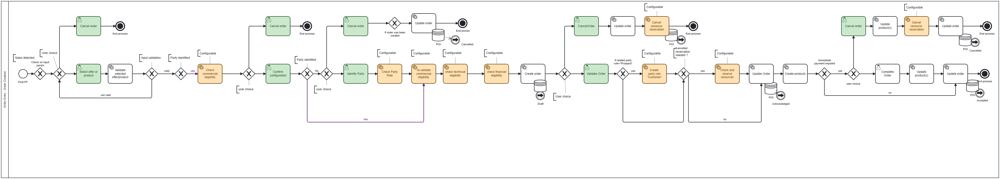
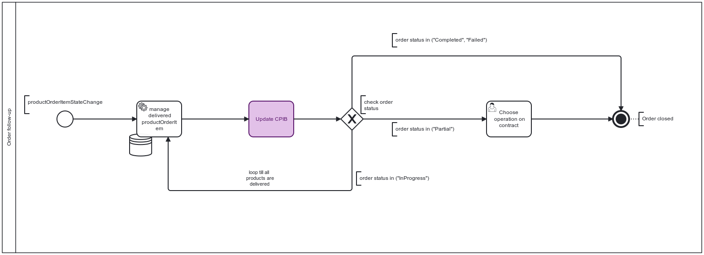
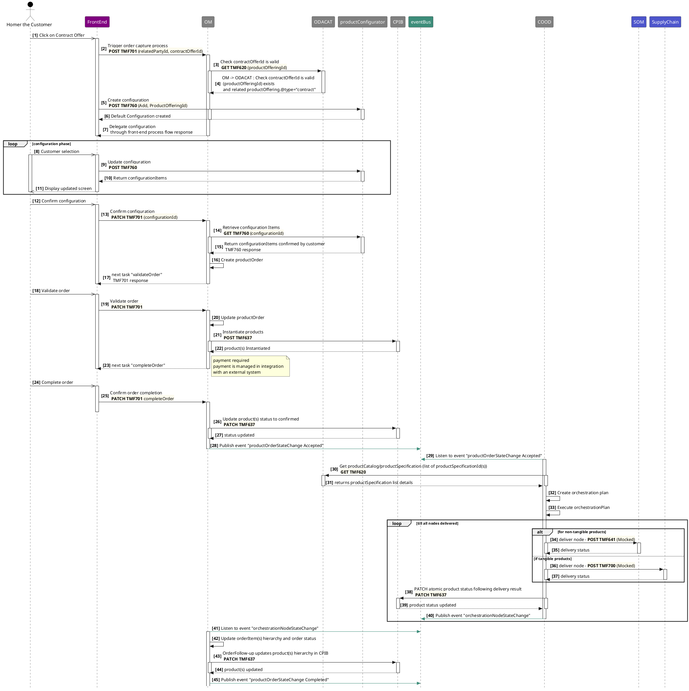
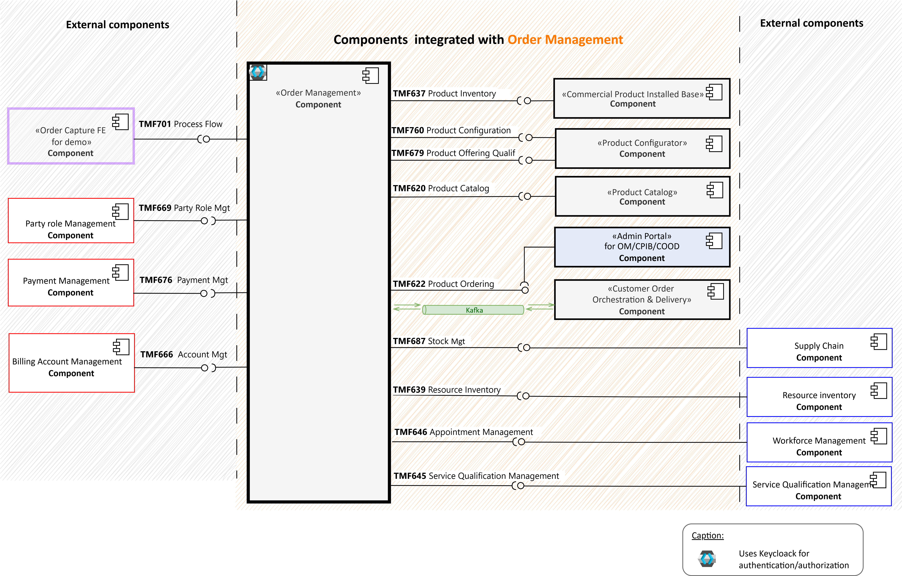
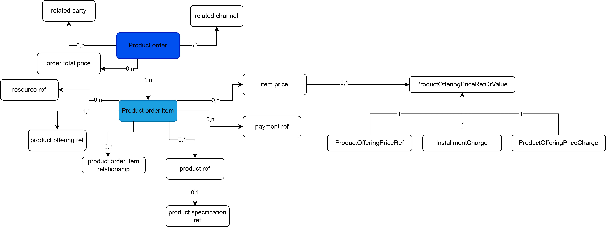
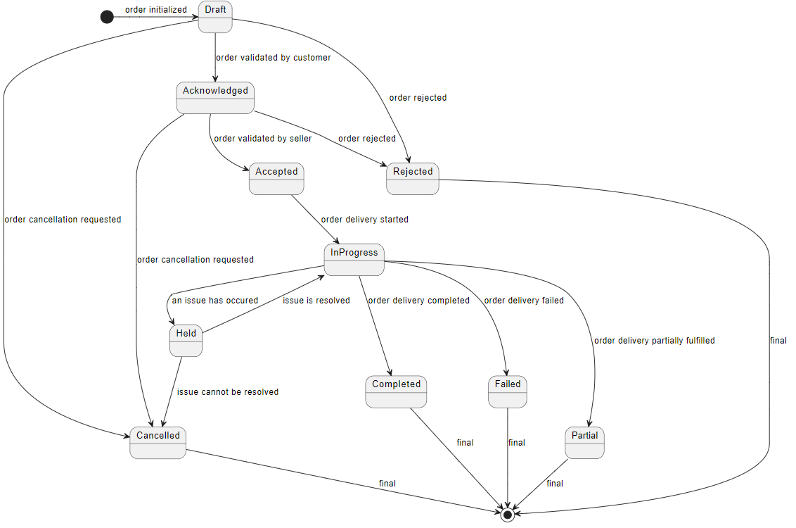
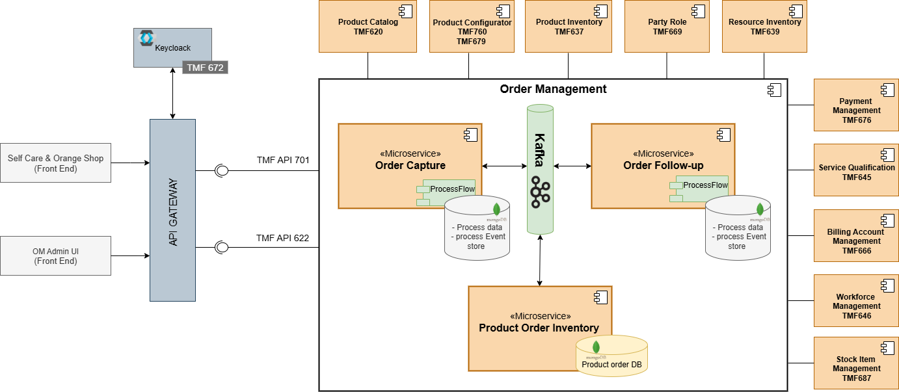
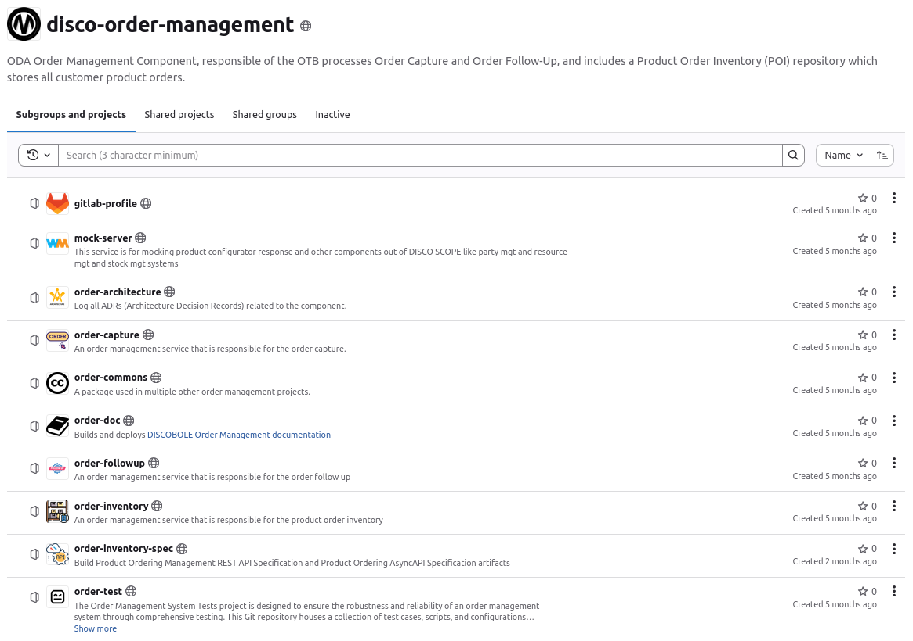

--- 
title: Overall Architecture 
summary: multiple architecture views for order management component.
authors:
  - Abir BRADAI
  - Hassen OULED SGHAEIR
---

# Overall Architecture

## Global View

Order Management is part of the [DISCOBOLE](https://discobole.ow2.io/doc/) platform.

{.img-zoomable}

Order Management component (OM) belongs to the ODA Core Commerce Management (CCM) block. It is a backend that supports the OTB processes Order Capture and Order Follow-Up.
OM includes a Product Order Inventory (POI) repository which stores all customer productOrder(s).

The OM component is triggered by:

- Party management platforms or any engagement management system (front end channels)
- COOD component when a productOrderItem delivery is started
- COOD component when a productOrderItem delivery is fulfilled

As output, OM component is responsible to inform about the order state changes:

- Order validation by customer
- Order validation by operator
- Order completion
- Order cancellation

## Process View

Implementing two business processes, namely Order Capture and Order Follow-Up, is essential for effective order management.

To establish a distinct separation between the front-end and back-end, the business processes and task specifications for order management are centralized in the back-end. Rather than specifying them individually for each front-end.

!!! info "Process Flow"
    The process flow concept is employed to implement the business processes. This approach facilitates the implementation of a centralized order capture process, guiding any front-end seamlessly through the process flow interface TMF701. The process flow library is used to manage the interactions betwween backend process flow and any front end consumer through the TMF701 process flow API.

### Order Capture Process

Includes two functional phases "order entry" to capture and configure customer orders and "order completion" to orchestrate the final validation of orders from the seller's perspective. This includes payment processing, back-office validation, assigning billing accounts, and setting appointments.  

{: .img-zoomable }

| User Task                                   | Automated Task/check                     | Business Rule                                                | Remark                                                       |
|---------------------------------------------| ---------------------------------------- | ------------------------------------------------------------ | ------------------------------------------------------------ |
| Launch Process                              | Check on process flow  relatedEntity     | If product offering Id or product Id is provided, then next task confirmConfiguration Else next task selectOfferOrProduct |                                                              |
| selectOfferOrProduct (offerId or productId) | 1. Validate input param                  | If productOffering Id is provided (acquisition use case), validate offer Id in commercial CAT (type=contract & status=”launched”) If product Id is provided (modification or termination use case), validate product Id in product Inventory (@Type=contract &  status=”active”) |                                                              |
|                                             | 2. Check commercial eligibility          | If the productOffering ID is provided and valid, and the relatedParty.id is provided, then check commercial eligibility in the configurator  through the TMF679 API.   Based on the eligibility result: <ul><li>If the offer is qualified, proceed to the next task "confirmConf." </li><li>Otherwise, proceed to the next task "selectOfferOrProduct."</li></ul> | It's a configurable task. The check could be enabled/disabled through the administration portal process setting screen. |
| confirmConf (confId)                        | 1. Check if party is identified          | If the relatedParty (customer) is provided in the confirmConf task flow, then the next automated task is to check commercial eligibility. Otherwise, the next task (user task) is to identify the party, followed by checking commercial eligibility. |                                                              |
|                                             | 2. Check commercial eligibility          | Check commercial eligibility in the configurator through the TMF679 API. Based on the eligibility result:<ul><li>If the offer is qualified, the next automated task is "check technical eligibility."</li><li>Otherwise, the next user task is "selectOfferOrProduct."</li></ul> | It's a configurable task. The check could be enabled/disabled through the administration portal process setting screen. |
|                                             | 3. Check technical eligibility           | For each configuration item, check if it has a characteristic with type @type "AddressCharacteristic" and contains "Address_Id". <ul><li>If "Address_Id" is present, verify in the catalog's related product specification whether qualification is required.</li><ul><li>If qualification is required, initiate a POST request to serviceQualification (TMF 645).</li><ul><li>If successful, capture the installation requirement information and resume the ordering process.</li><li>If not qualified, proceed to &lt;&lt;User task: Select offer.&gt;&gt; and display: "The mentioned address is not eligible to fiber. Please update the address or select another offer."</li></ul></ul><li>If "Address_Id" is not provided, navigate to the home screen and proceed to &lt;&lt;User task: Select offer.&gt;&gt;, displaying: "The address is required to check the technical eligibility."</li></ul> | It's a configurable task. The check could be enabled/disabled through the administration portal process setting screen. |
|                                             | 4. Check financial eligibility           | In the use case of installment, if an installment charge exists and the check financial eligibility flag is enabled, verify the customer's creditworthiness using the TMF632 API (`ratingScore`). <ul><li>If the ratingScore is greater than 750, the customer is eligible to receive a product with installment payments.</li><li>Otherwise, the process redirects to the plan selection screen (next task: confirmConfiguration) to select an alternative option instead of installment.</li></ul> | It's a configurable task. The check could be enabled/disabled through the administration portal process setting screen. |
|                                             | 5. Create order                          | <ul><li>Retrieve the configuration by confId via the TMF API 760 exposed by the configurator.</li><li>Map the confItems to orderItems.</li><li>Create the order in POI via an internal API call (POST TMF622).</li><li>Return the next task "validateOrder."</li></ul> |                                                              
| IdentifyParty (partyId)                     | Check party role                         | Check via mock the party role assigned to the provided party ID (get party role by ID TMF669):       <ul><li>If the party role does not exist, create the party role "prospect" once the order is validated.</li><li>Else if the party role is "customer" or "prospect," resume the process:  check commercial eligibility, then proceed to the next user task  "validateOrder."</li></ul> | It's a configurable task. The check could be enabled/disabled through the administration portal process setting screen. |
| Validate order (order id)                   | 1. Create party role = customer          | This action is only applicable when the party is a prospect (party role=prospect) | It's a configurable task. The check could be enabled/disabled through the administration portal process setting screen. |
|                                             | 2.  Reserve resources                    | Based on the characteristics configured in the  different order items, the OM checks the commercial catalog to see if  the characteristics require reservation (relatedResource: logical or  stock to be verified).       If logical resources or physical resources are required, reserve resources based on mock calls with the TMF API: <ul><li>Resource Inventory Management for logical resources (MSISDN, ICCID, etc.). </li><li>Stock Management API for physical resources (stock): handset, SIM card, accessories. </li></ul> | It's a configurable task. The check could be enabled/disabled through the administration portal process setting screen. |
|                                             | 3. Update order status                   | Update order and orderItem(s) statuses in POI from "Draft" to "Acknowledged" |                                                              |
|                                             | 4. Instantiate products                  | <ul><li>**Acquisition**(add action applied on contract orderItem): Map order items to products and create products in the Product Inventory.</li><li>**Modification** (modify action applied on contract orderItem): </li><ul><li>**Add option:** Create product.</li><li>**Modify option:** Add productOrderItemRef to the product already instantiated in the Product Inventory.</li><li>**Terminate option:** Add productOrderItemRef to the product already instantiated in the Product Inventory.</li><li>**Termination** (terminate action applied on contract orderItem): Add productOrderItemRef to the product already instantiated in the Product  Inventory.</li></ul><ul><li>**Migration**</li><li>Build the target contract product hierarchy, including:</li><ul><li>Create the contract product.</li><li>Add product: Create a new product under the target contract.</li><li>Modify product: Move an existing product from the old contract to the target contract hierarchy and add its productOrderItemRef.</li><li>NoChange: Move a product from the old contract hierarchy to the target contract hierarchy without any change, and add its productOrderItemRef.</li></ul></ul><li>Update the old contract product hierarchy:</li><ul><li>Terminate product: Add productOrderItemRef to the product already instantiated in the old contract hierarchy.</li></ul></ul> |                                                              |
|                                             | 5. Check required completion information | For each order item in the order, check if a paymentRef or a billingAccountRef is required. Based on the productOfferingPrice persisted at the orderItem level, check the catalog for the flag ImmediatePayment.  <ul><li>If ImmediatePayment is true, then a paymentRef is required for this orderItem.</li><li>Else if ImmediatePayment is false, then a billingAccountRef is required.</li> **Note:** If there is no productOfferingPrice linked to the order item, payment and billingAccountRef are not required. |                                                              |
|                                             | Check the provided information           | <ul><li>Check if  the provided paymentRef is valid </li><li>Check if  the provided BA_Ref is valid</li></ul> | It's a configurable task. The check could be enabled/disabled through the administration portal process setting screen. |
|                                             | Update products                          | Only applicable for products created within the ordering journey: add  action in both acquisition and modification use cases. OM updates the operational status from Created to Confirmed |                                                              |

### Order Follow-Up Process

Manages operations required to complete delivery, excluding product delivery. This encompasses lifecycle management, order closure, and activation/deactivation of charges. Additionally, it provides customers with updates on delivery progress.

{: .img-zoomable}

### End 2 End Ordering Flow

Below is a simplified E2E call flow for an **offer acquisition** by a customer named `Homer`. This illustrates how the components interact with each other and also with external components.

## Component View

The Order Management component is part of the ODA Core Commerce Management layer, as shown in this diagram, which outlines its exposed and consumed APIs.

{.img-zoomable}

??? info "Components Overview"
    The end-user is a customer who wants to order offers on the [web-selfCare](https://gitlab.ow2.org/discobole/disco-oda-compoents/disco-ui-portals/selfcare-ui) which is a demo web application that runs into a browser. This web application is consuming a REST API named `TMF701Process Flow` in order to trigger/update the order capture process.

    The TMF701 Process Flow is managed by a [process flow library](https://gitlab.ow2.org/discobole/disco-oda-compoents/process-flow).

    This [order capture](https://gitlab.ow2.org/discobole/disco-oda-components/disco-order-management/order-capture) microservice is consuming the API of other components:

    - [product-catalog](https://gitlab.ow2.org/discobole/disco-oda-components/disco-catalog) is in charge of catalog management.
    - [product-configurator](https://gitlab.ow2.org/discobole/disco-oda-components/product-configurator) is in charge commercial eligibility and offer configuration during the order capture process.
    - [product-inventory](https://gitlab.ow2.org/discobole/disco-oda-components/disco-product-inventory) is in charge of product management.
    - 
    OM includes a dedicated Product Order Inventory (POI) repository. This repository serves as centralized storage for all customer product orders created and updated by the order management processes defined above.

    The table below lists the different Order management (OM) interactions within [DISCOBOLE](https://discobole.ow2.io/doc/) ecosystem.

??? info "Order Management APIs & Event Summary"
    | API name                          | TMF code | Description                                                                    | State                             |
    |:----------------------------------|:---------|:-------------------------------------------------------------------------------|:----------------------------------|
    | Product Ordering                  | TMF622   | Manage product order inventory                                                 | Exposed                           |
    | Process Flow                      | TMF701   | Manage order capture process flow instances                                    | Exposed (by process flow library) |
    | Product Catalog                   | TMF620   | Display offers details                                                         | Dependent                         |
    | Product Offering Qualification    | TMF679   | Check commercial eligibility                                                   | Dependent                         |
    | Product Inventory                 | TMF637   | Manage product inventory                                                       | Dependent                         |
    | Product Configuration             | TMF760   | Create and retrieve configuration items                                        | Dependent/Mocked                  |
    | Resource Inventory                | TMF639   | Reserve logical resources                                                      | Dependent/Mocked                  |
    | Party Role Management             | TMF669   | Retrieve Party Role                                                            | Dependent/Mocked                  |
    | Payment Management                | TMF676   | Management Payment                                                             | Dependent/Mocked                  |
    | Billing Account Management        | TMF666   | Retrieve Billing Account                                                       | Dependent/Mocked                  |
    | Service Qualification Management  | TMF645   | Manage Service Qualification                                                   | Dependent/Mocked                  |
    | Workforce Management              | TMF646   | Workforce mangement for appointment                                            | Dependent/Mocked                  |
    | Stock Item Management             | TMF687   | Request Stock item delivery                                                    | Dependent/Mocked                  |
    | ProductOrderStateChange           | -        | Triggered by product order state update to "Acknowledged" or "Accepted" states | Published                         |
    | ProductOrderAttributeValueChange  | -        | Triggered when product order item states moves from accepted to inProgres, etc.| Published                         |

## Data View

### Data Model Overview

{: .img-zoomable width="1300" }

| Class name                        | Description                                                                                          |
|:-  -------------------------------|:-----------------------------------------------------------------------------------------------------|
| `Product Order`                   | Contains one or multiple order items                                                                 |
| `Product Order Item`              | Specifies the action (add, modify, terminate), quantity, and references to the product if applicable |
| `Product Reference`               | Refers to the product concerned by a modify or a terminate action                                    |
| `Item Price`                      | Indicates recurring or one-time charges associated with the item                                     |
| `Related Party`                   | Identifies the party ID and role (customer, owner, prospect, etc.)                                   |
| `Product Offering Reference`      | Refers to the catalog product offering                                                               |
| `Product Specification Reference` | Refers to the catalog product specification                                                          |

### Product Order Lifecycle

{.img-zoomable}

| State        | Definition                                                                                                                                                                                                                                                                                                                                                                           |
|:-------------|:-------------------------------------------------------------------------------------------------------------------------------------------------------------------------------------------------------------------------------------------------------------------------------------------------------------------------------------------------------------------------------------|
| `Draft`        | <ul><li> ProductOrder created and not yet validated by customer</li><li>  ProductOrderItems created and the configuration is still ongoing </li></ul>                                                                                                                                                                                                                                |
| `Rejected`     | <ul><li> ProductOrder not validated by seller </li></ul>                                                                                                                                                                                                                                                                                                                             |
| `Acknowledged` | <ul><li> ProductOrder validated by customer </li></ul>                                                                                                                                                                                                                                                                                                                               |
| `Accepted`     | <ul><li> ProductOrder validated by seller </li></ul>                                                                                                                                                                                                                                                                                                                                 |
| `Cancelled`    | <ul><li> A productOrder is cancelled </li></ul>                                                                                                                                                                                                                                                                                                                                      |
| `InProgress`   | <ul><li> The product delivery has started</li><li>  At least one productOrderItem delivery is ongoing </li></ul>                                                                                                                                                                                                                                                                     |
| `Held`         | <ul><li> ProductOrderItem delivery is blocked due to a technical issue</li></ul>                                                                                                                                                                                                                                                                                                     |
| `Completed`    | <ul><li> ProductOrderItem delivery is completed successfully </li><li> For ProductOrder: all productOrderItems delivered successfully </li></ul>                                                                                                                                                                                                                                     |
| `Failed`       | <ul><li> ProductOrderItem delivery failed</li><li> For ProductOrder: delivery failed for all productOrderItems</li></ul>                                                                                                                                                                                                                                                             |
| `Partial`      | <ul><li> ProductOrder which has at least one productOrderItem delivery failed</li><li>ProductOrderItem related to a bundled productOffering and which has at least one child productOrderItem delivery failed</li><li>Not applicable to productOrderItem linked to an atomic productOffering</li><li>Not applicable to productOrderItem linked to a productSpecification</li></ul>   |

## Software View

{ .img-zoomable width="1100" }

???+ info "Software Architecture Overview"
    The order management component includes three microservices:

    - [**Order Capture service**](https://gitlab.ow2.org/discobole/disco-oda-components/disco-order-management/order-capture): responsible for the order capture processing. It manages a process database and provides TMF701 API (ProcessFlow management). Since Order Capture microservice uses ProcessFlow, the latter generates a database including a process table (saving the final state of a process) and an event store ( saving all changes applied to a process).
    - [**Order Followup service**](https://gitlab.ow2.org/discobole/disco-oda-components/disco-order-management/order-followup): responsible for the order followUp processing. It manages a process database and provides TMF701 API (ProcessFlow management).
      Since Order Followup microservice uses ProcessFlow, the latter generates a database including a process table (saving the final state of a process) and an event store ( saving all changes applied to a process).
    - [**Product Order Inventory service**](https://gitlab.ow2.org/discobole/disco-oda-components/disco-order-management/product-order-inventory): responsible for managing the product order database, handling events received from "Order capture" microservice and handling events "ProductOrderItemStateChanged (delivery level)" received from Customer Order Orchestration and Delivery (COOD) in order to calculate and update the state of the productOrderItems hierarchy. It provides the TMF622 API (ProductOrdering management).

???+ info "Process Flow Library"
    Process Flow handles process management and task management. The main purpose of the library is to dynamically derive GUI via API with the help of HATEOAS (which includes hypermedia links with the responses).

    The Process Flow library exposes the TMF701 API which provides the mechanism to derive GUI by back-end.

## Source Code Organization

{.img-zoomable}

??? info "Order Management Repositories"
    All DISCOBOLE components are grouped together in one single subgroup  [disco-oda-components](https://gitlab.ow2.org/discobole/disco-oda-components) holds all Git repositories of the DISCOBOLE components.

    The Order Management component is composed of:

    - [**order-architecture**](https://gitlab.ow2.org/discobole/disco-oda-components/disco-order-management/order-architecture) - register all Architecture Decision Records (ADRs)
    - [**order-commons**](https://gitlab.ow2.org/discobole/disco-oda-components/disco-order-management/order-commons) - common library and connectors to external domains
    - [**order-capture**](https://gitlab.ow2.org/discobole/disco-oda-components/disco-order-management/order-capture) - service responsible of the order capture management and based on TMF701 API REST Specification.
    - [**order-followup**](https://gitlab.ow2.org/discobole/disco-oda-components/disco-order-management/order-followup) - service responsible of the order follow-up management and based on TMF701 API REST Specification.
    - [**order-inventory**](https://gitlab.ow2.org/discobole/disco-oda-components/disco-order-management/order-inventory) - service responsible of the product order management and based on the TMF622 API REST Specification.
    - [**mock-server**](https://gitlab.ow2.org/discobole/disco-oda-components/disco-order-management/mock-server) - mock server for configuration and resources APIs.

??? info "Service Projects Structure"
    In each API project you will find the same project structure and content:

    - `README.md` - the project documentation
      - How to install the project locally or on cloud environment
      - How to contribute to the project
    - `pom.xml` -  maven project configuration file
    - `gitlab-ci.yml` - the GitLab CI pipeline for build, test, package and deploy the project on a Cloud using [to be continuous](https://to-be-continuous.gitlab.io/doc/usage/) templates
    - `docker` folder - all Docker related files to package the code into a Docker image
    - `bruno` - business use cases used to test the API
