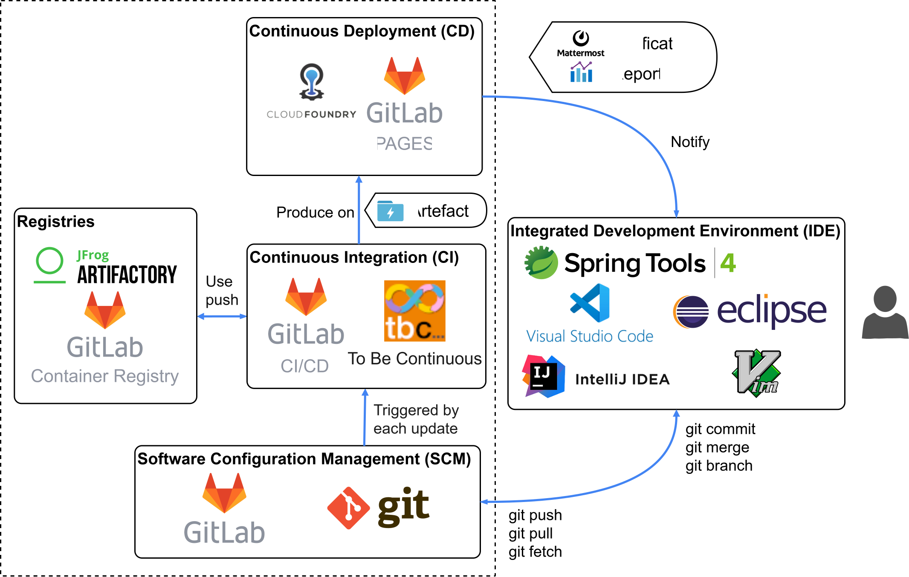

# Development Ecosystem

???+ info "Components"
    - __GitLab__: source code repository
    - __GitLab CI__: continuous integration and continuous deployment
    - __GitLab Pages__ : GitLab integrated http hosting for html pages
    - __To Be Continuous.__: to be continuous templates
    - __OpenShift__: deployment platform
    - __GitLab Container Registry__: Docker registry for internal project usage
    - __Discord__: human and bot communication channel
