

# Product Ordering Monitoring

The **Monitoring > Orders** screen is the main entry point for administrators to search and browse all customer orders managed by the OM system. It provides a set of filters and a configurable results table.

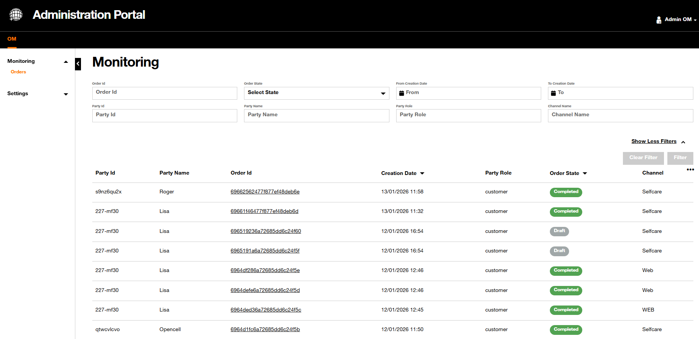{.img-zoomable}

In this monitoring section, the administrator can search for any order with different filtering criteria. The columns of the table are configurable.

The administrator can then click on the order id to get all the details regarding this particular order like the global order state, the status of each order item and associated actions (add, modify, terminate, migrate) which indicates which type of commercial action is performed on the given order item. Associated prices and discounts are also displayed.

---

## Filter View

The filter panel offers two modes:

- the **compact mode**: this mode is the **default** mode, displaying the most-used filters
- the **expanded mode**: this mode reveals all available criteria.

By default, only the top-level filters are visible.

To show all available filters, click on {width="250"} buton.

To go back to the most-used filters, click on 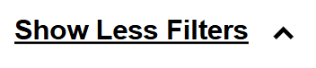{.img-zoomable} button.

### Compact Mode

Here are the always-visible filters which are frequently used to list a shorted list of orders.

| Filter | Type | Description |
| :----- | :--- | :---------- |
| `Order Id` | Text | Search by the unique order identifier |
| `Order State` | Dropdown | Filter by the current order lifecycle state (see values below) |
| `From Creation Date` | Date | Start bound of the creation date range |
| `To Creation Date` | Date | End bound of the creation date range |

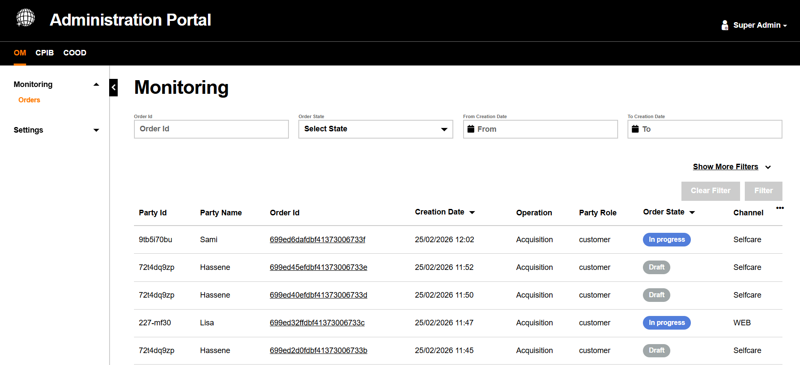{.img-zoomable}

#### `Order State` Filter

The `Order State` filter reflects the commercial lifecycle of a customer order. Each state is color-coded:

| State | Badge | Description |
| :---- | :---- | :---------- |
| `Draft` | Draft | Order initiated but not yet submitted |
| `Acknowledged` | Acknowledged | Order received and acknowledged by the system |
| `Accepted` | Accepted | Order validated and accepted |
| `In Progress` | In progress | Order currently being processed and delivered |
| `Held` | Held | Order processing paused pending further action |
| `Pending` | Pending | Order awaiting an external event or condition |
| `Pending Cancellation` | Pending Cancellation | A cancellation request has been initiated |
| `Assessing Cancellation` | Assessing Cancellation | The system is evaluating the cancellation request |
| `Cancelled` | Cancelled | Order has been cancelled |
| `Rejected` | Rejected | Order was rejected (e.g., failed eligibility check) |
| `Completed` | Completed | Order fully delivered successfully |
| `Failed` | Failed | Order processing encountered a terminal failure |
| `Partial` | Partial | Some order items succeeded while others failed |

### Expanded Mode

In addition of the most-used filters, here is the whole list of filters that can be used to have a shorted list of orders.

| Filter | Type | Description |
| :----- | :--- | :---------- |
| `Party Id` | Text | Filter by the end customer's party identifier |
| `Party Name` | Text | Filter by the customer's party name |
| `Party Role` | Text | Filter by the party's role (e.g., `customer`) |
| `Channel Name` | Text | Filter by the channel through which the order was placed (e.g., `Selfcare`, `WEB`) |

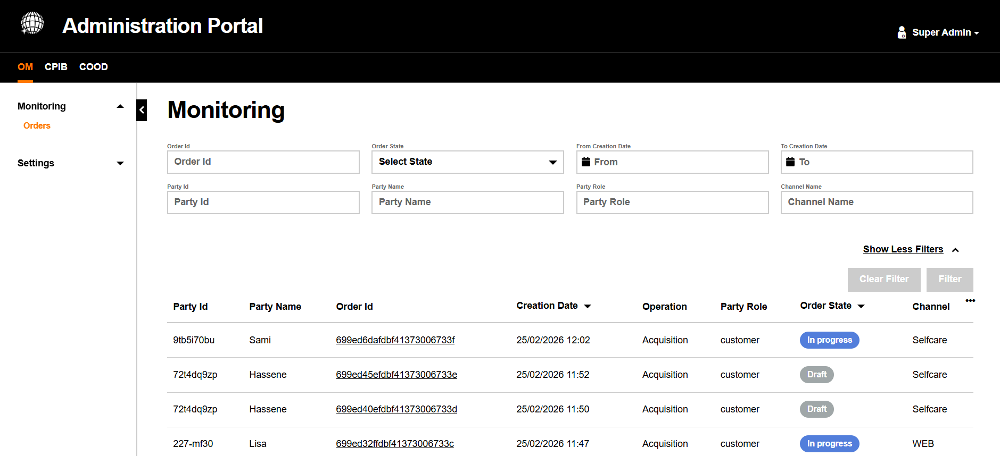{.img-zoomable}

### Filter Buttons

Two action buttons control the filter execution:

- **Filter button (active)**: Orange background — at least one filter is filled in and the filter can be applied.

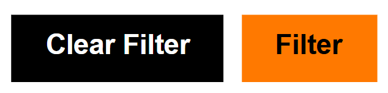{width="250"}

- **Filter / Clear Filter (disabled)**: Grey background — no filter is active or no change has been made.

{width="250"}

- **Clear Filter**: Resets all filter fields to their default empty state and refreshes the table.
- **Filter**: Applies the current filter criteria and reloads the results table.

## Table View

The results table displays all matching orders. Each row shows key order data and links to the full Order Details view.

### Table Columns

| Column | Description |
| :----- | :---------- |
| `Party Id` | The identifier of the customer party associated with the order |
| `Party Name` | The name of the customer |
| `Order Id` | Unique order identifier — `clickable link` that opens the Order Details screen |
| `Creation Date` | The date and time the order was created. Sortable ▼ |
| `Operation` | The commercial operation type (e.g., `Acquisition`, `Modification`, `Termination`) |
| `Party Role` | The role of the party (e.g., `customer`) |
| `Order State` | The current lifecycle state badge |
| `Channel` | The channel through which the order was placed (e.g., `Selfcare`, `WEB`) |

### Managing Visible Columns

The table columns are configurable. Click the `⋯` icon at the top right of the table header to open the column visibility panel. Columns with an orange checkmark are currently displayed; unchecked columns are hidden.

#### All columns Visible

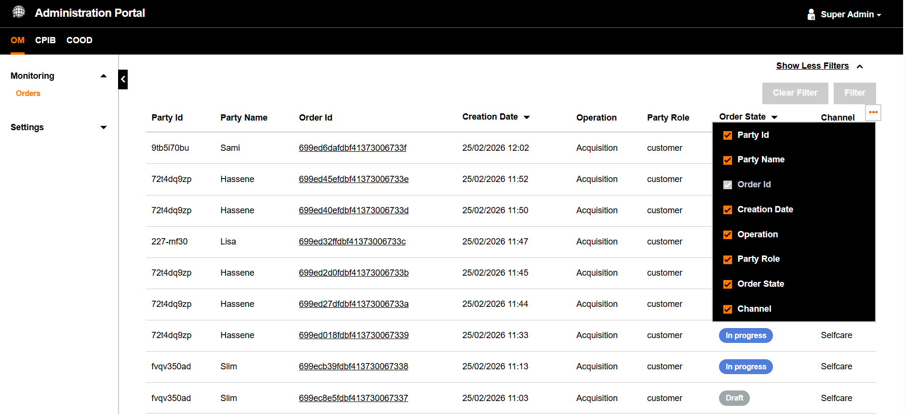{.img-zoomable}

#### Fewer columns Selected

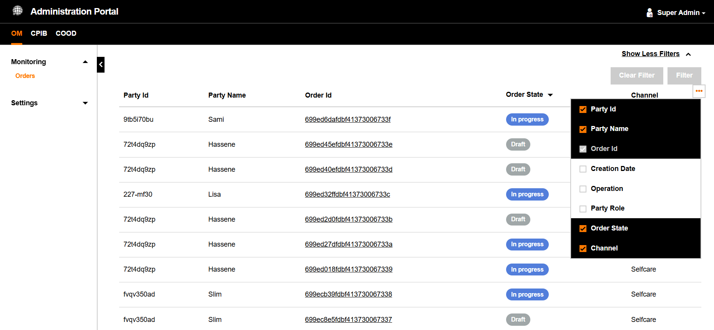{.img-zoomable}

### Pagination

Results are paginated. The pagination control appears at the bottom of the results table.

**First page view:**

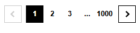{.img-small}

**Navigation in the middle of results:**

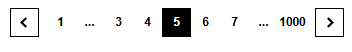{.img-small}

- Use `<` and `>` to navigate one page at a time.
- Click a specific page number to jump directly to it.
- `...` indicates skipped pages when the total count is large.

### Details Details

Upon clicking on an `Order Id` in the monitoring table, the administrator accesses the full **Order Details** screen.

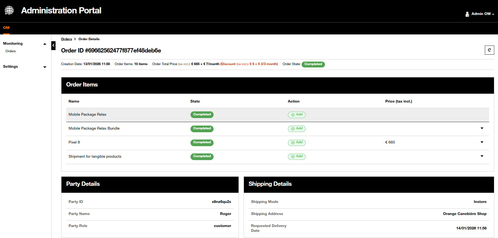{.img-zoomable}

A {width="32" .img-zoomable} reload button is available to dynamically refreshes the product data, ensuring the administrator always views the most up-to-date information without needing to manually refresh the entire browser page.

The administrator can get more information by clicking on each order item (triangle on the right) to expand the information.

Please note that super admin profiles who have access to the three components are able to jump from one component to another using the **icons** on top close to the order id:

- the  icon will lead you to the related CPIB products, and
- the  icon will lead you to the related orchestration plan for the products and services delivery from COOD.

Here is the renderer:

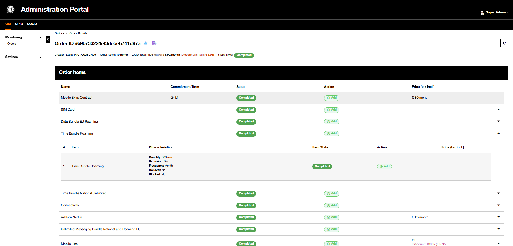{.img-zoomable}

#### Order Summary Bar

Directly below the Order ID, a compact summary line provides key order metadata at a glance:

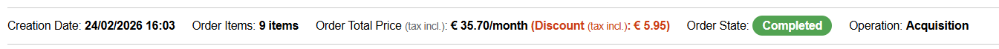{.img-zoomable}

The meaning is the following.

| Field | Description |
| :---- | :---------- |
| `Creation Date` | Date and time the order was created |
| `Order Items` | Total number of order items in this order |
| `Order Total Price` | Total price including taxes; any discount is highlighted in orange |
| `Order State` | Current lifecycle status badge |
| `Operation` | Commercial operation type (e.g., `Acquisition`) |

#### Order Items

The **Order Items** section lists all line items included in the order. Each row represents one product or service being ordered.

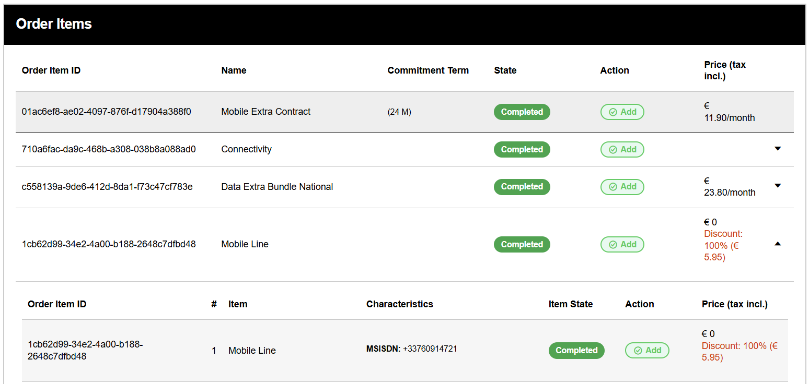{.img-zoomable}

| Column | Description |
| :--- | :--- |
| `Order Item ID` | Unique identifier of the order item |
| `Name` | Product or service name (e.g., `Mobile Extra Contract`, `Connectivity`) |
| `Commitment Term` | Contractual engagement duration if applicable (e.g., `24 M`) |
| `State` | Current delivery status of the order item |
| `Action` | Commercial action applied (e.g., `Add`, `Modify`, `Terminate`) |
| `Price (tax incl.)` | Price for this item including taxes; discounts are displayed in orange |

Click the `▼` icon on the right of an order item row to expand it and reveal sub-item details, including product characteristics such as `MSISDN: +33760914721`.

#### Party Details & Shipping Details

At the bottom of the Order Details page, two panels are displayed side-by-side:

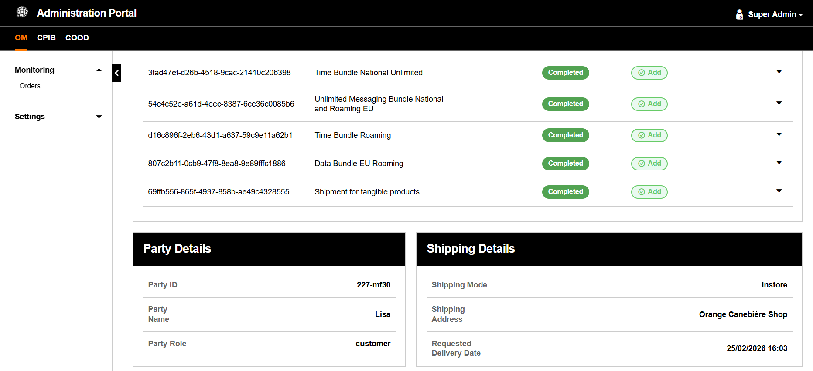{.img-zoomable}

##### Party Details

It is related to the customer information associated with the order.

| Field | Description |
| :--- | :--- |
| `Party ID` | Unique identifier for the customer party |
| `Party Name` | Full name of the customer |
| `Party Role` | Role of the party in the order context (e.g., `customer`) |

##### Shipping Details

It is related to the delivery logistics for tangible products included in the order.

| Field | Description |
| :--- | :--- |
| `Shipping Mode` | Delivery method (e.g., `Instore`, `Home delivery`) |
| `Shipping Address` | The delivery location (e.g., store name or home address) |
| `Requested Delivery Date` | The requested date and time for delivery |