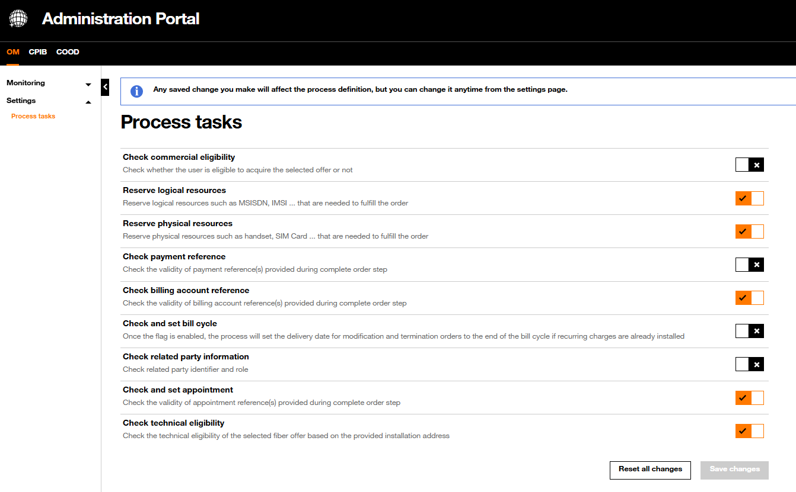
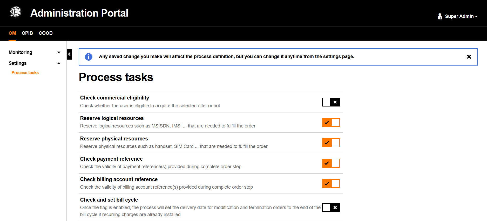

# Settings

The Settings menu enables to reach some Order Capture process settings.

**These settings need to be aligned with the project context of integration of the Order Management Component. They enable to activate or deactivate some checks performed by OM component.**

{.img-zoomable}

!!! info ""
    **Any saved change will immediately affect the process definition. Settings can be updated at any time from the Settings page.**

## Process Tasks View

The **Settings > Process Tasks** sub-section lists all configurable tasks in the order capture workflow. The super administrator can enable (orange toggle ✓) or disable (grey toggle ✗) each task independently.

{.img-zoomable}

### Process Tasks

Below is described the purpose of each task. For each enabled task, DISCOBOLE OM component will interact with external components.

| Task | Description |
| :--- | :---------- |
| `Check commercial eligibility` | Check whether the user is eligible to acquire the selected offer or not from a commercial point of view. If disabled, for ex., the Order Management Order Capture will go on even if the selected offer is not in `launched` status. |
| `Reserve logical resources` | Reserve logical resources such as MSISDN, IMSI, etc. that are needed to fulfill the order. |
| `Reserve physical resources` | Reserve physical resources such as handsets, SIM cards, internet boxes, etc. that are needed to fulfill the order. |
| `Check payment reference` | Check the validity of payment reference(s) provided during the complete order step. For offers requiring immediate payment, the customer provides a payment reference to continue the order. This reference can be verified or not by the Order Capture process based on this setting. |
| `Check billing account reference` | Check the validity of billing account reference(s) provided during the complete order step. For offers associated with billable charges, the customer provides the billing account ref to continue the order. This billing account ref can be verified or not by the Order Capture process. |
| `Check and set bill cycle` | Once the flag is enabled, the process will set the delivery date for modification, migration and termination orders to the end of the bill cycle if recurring charges are already installed. |
| `Check related party information` | Check related party identifier and role. |
| `Check and set appointment` | Check the validity of appointment reference(s) provided during the complete order step. For order items requiring an appointment, the customer provides the appointment ref that has been created to continue the order. This reference can be verified or not by the Order Capture process. |
| `Check technical eligibility` | Check the technical eligibility of the selected fiber offer based on the provided installation address. |

### Save / Reset Buttons

Two action buttons control the persistence of settings changes:

- **Reset all changes**: Reverts all toggles to their last saved state without persisting any modifications.
- **Save changes**: Persists all toggle states and immediately applies them to the order capture process definition.

The **Save changes** is enabled when at least one toggle has been modified.

{width="300"}

The **Save changes** is disabled when no changes have been made since the last save.

{width="300"}

!!! info "Tip"
    The **Save changes** button only becomes active (orange) when at least one toggle has been modified since the last save.
