# Business Flows

## Orchestration and Delivery Lifecycle

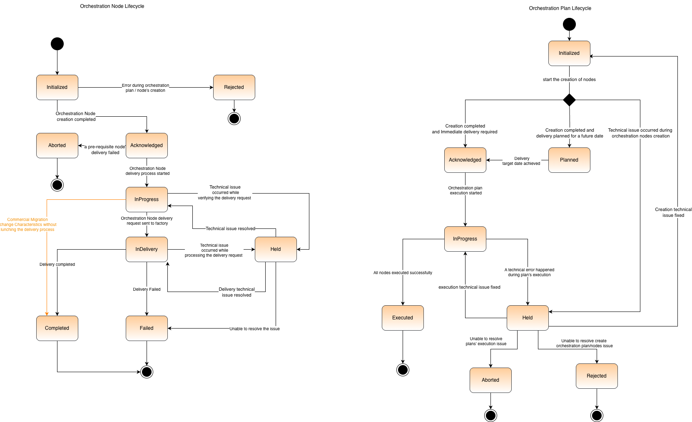{.img-zoomable}

- For each accepted order, COOD creates an orchestration plan to orchestrate the delivery for all order items. In addition, an orchestration node is created for each order item to manage the delivery of the order item in the appropriate sequence.
- Each orchestration node carries all the product order item information, including the product specs obtained in the order and other specifications retrieved from the catalogue, list of all related products, action identified in the order (`Add`, `Delete`, `Terminate`, `Migrate`).
- For each orchestration node, a delivery order is created.  Then, delivery management service will decide the appropriate delivery factory and use the delivery order data to build a request to the delivery factory (SOM or shipping request) and submit it to the target delivery factory. Furthermore, COOD may send a single delivery request for several order items; e.g. tangible products that are shipped together.

### Orchestration Plan Lifecycle

- Firstly, initialized created orchestration plan is moved to status acknowledged or planned according to the requested delivery dates.
- Then status is changed to `InProgress` when nodes delivery start, also, it goes to Held when delivery is `Held` and no nodes are progressing forward.
- Finally, status is changed to held when all nodes are completed (even if some of them delivery failed), or `Aborted` if some delivery of at least one node is aborted (for example pre-requisite is not satisfied)
- `Rejected` status can take place in case a technical issue occurred during orchestration plan/nodes creation

### Orchestration Node Lifecycle

- `Acknowledged` node is turned into `InProgress`, up on the completion of the previous node the orchestration plan, and then status is changed to `InDelivery` in case the status of all related nodes are satisfied.
- Node gets Held in case a technical issue takes place, and returned to the previous status if resolved, otherwise node will fail.
- For nodes `InDelivery`, a SOM request is sent to the delivery factory. Up on the SOM response status, the node status is changed to weither `Completed` or `Failed` or `Held`.
- Only, in case of Commercial Migration, when both `MigratedFrom` and `MigratedTo` products have the same characteristics, node status is changed from `InProgress` to `Completed` after updating the inventory without sending a SOM request.

### Delivery Order Lifecycle

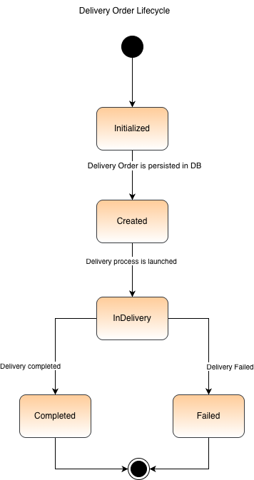

- Delivery order is an entity in the delivery management service that carries the information and status relevant to the delivery process.
- Delivery order is initiated for each delivery process, and it can carry out the delivery of one or more nodes.
- Once created, it has a status of initialized, it is immediately changed to created once persisted to the database.
- Status is changed to inDelivery when the delivery process is launched. Then changed to completed or failed based on the result of the delivery process.

## Orchestration Plan Creation

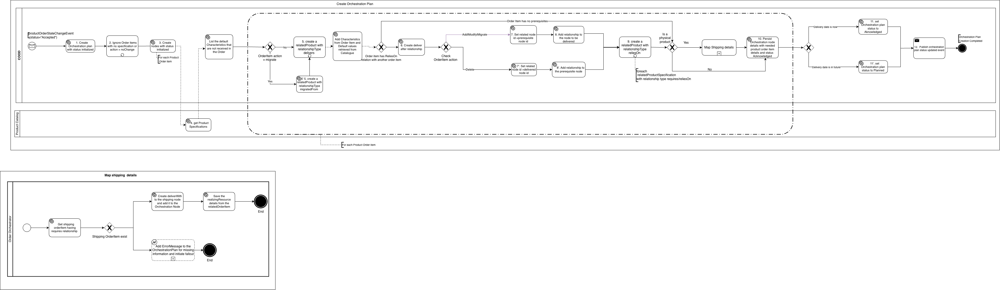{.img-zoomable}

- COOD consumes `productOrderStateChangeEvent` and creates the orchestration plan dynamically taking into account all received different order items and consults the Product Catalog for order items with spec id to build their relationships on product spec level.
- COOD then evaluates the delivery date to determine if it should immediately start the execution of the plan or not and publishes an `orchestrationPlanStateChangeEvent`.
- As a catalogue driven system, COOD Updates Product order by Retrieving delivery-focused characteristics, So, the final set of specification includes product specs coming from both accepted order and default product characteristics as defined in the product catalogue.
- In addition, COOD validates the list of characteristics received in the order against the set of characteristics declared in the catalogue. If any of these characteristics does not exist in the catalogue, COOD will ignore it.  
- COOD retrieves Product Spec from the catalogue and makes use of product specification relationships to build the Orchestration plan in the correct order and allocate proper relations between orchestration nodes.
- In case of Multi-purchase use case, where the same product specs is repeated in the same order, COOD makes use of the relationships defined in the order to link appropriate product.
- Furthermore, when a product relies on multiple products, so there will be several prerequisites for the delivery of the product. In such a case COOD will consider one of the prerequisites is sufficient to proceed forward with the orchestration and delivery of the product to be delivered.
- For tangible products, COOD reads the shipping details from the shipping order item that is linked to the tangible product order item, and attach this details to the node responsible for the tangible product delivery.

**Note:** there is a _cronjob_ that runs to update the state of planned deliveries to trigger their execution later on.

## Orchestration Plan Execution

{.img-zoomable}

- COOD consumes `orchestrationPlanStateChangeEvent` and starts executing plan if status is Acknowledged and publishes another `orchestrationPlanStateChangeEvent` to declare plan is in progress.
- Before executing a plan or a node, COOD confirms that the plan/node start time is satisfied. If not yet, COOD will create a schedule task to execute it on time.
- COOD starts selecting leaf nodes (that don't have any prerequisites) for delivery first and publishes `orchestrationPlanNodeStateChangeEvent`.
- COOD listens to each `orchestrationPlanNodeStateChangeEvent` to detect when a delivery is done(`completed`/`failed`/`held`) to adjust state of any dependents found in the plan.
- COOD then triggers `orchestrationPlanNodeStateChangeEvent` for these dependents.
- COOD finally triggers `orchestrationPlanStateChangeEvent` when all nodes get processed (held or executed).

## Verify Related Products for Delivery

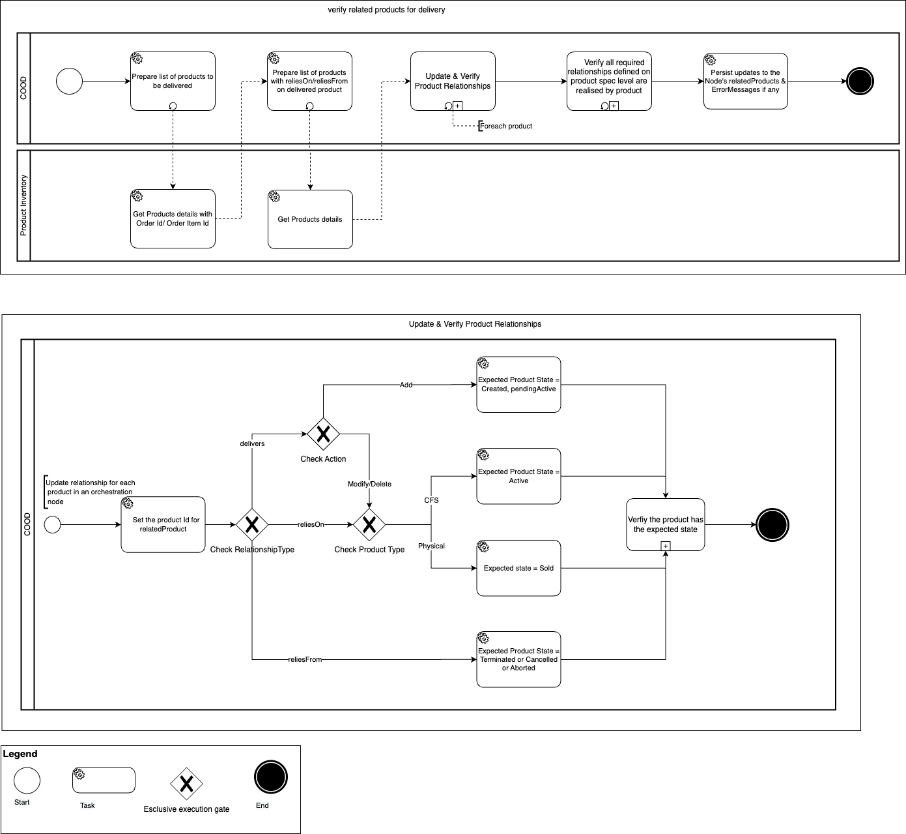{.img-zoomable}

- Before starting the delivery for each Orchestration Node, COOD checks the status for all related products at the Product Inventory Component (CPIB).
- First COOD checks the status for the product to be deliverd (relationship Delivers). e.g for acquisition use case, product status should be created, while for termination/modification/migration use case product status should be `Active`.
- For prerequisites, i.e. products with relationship `reliesOn` and `reliesFrom`, which is translated into `delivesAfter` relationship between the related orchestration nodes. This covers both acquisition and termination use cases.

## Skipping the Delivery Process for Some Special Cases

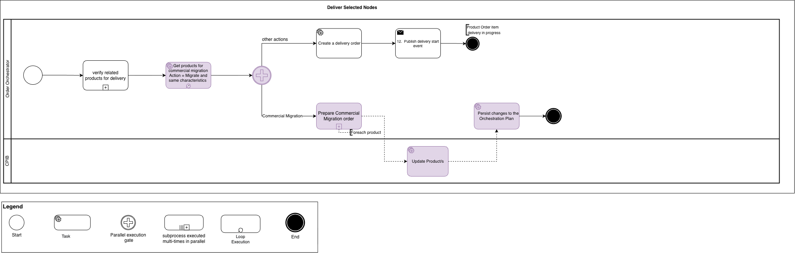

- COOD considers cases such as commercial migration use case when the migration takes places on commercial level only while the atomic product characteristics are not impacted.
- COOD should identify the case then updated the product inventory and close the node as completed without triggering the delivery management service.

## Orchestration Nodes Delivery & Follow-up

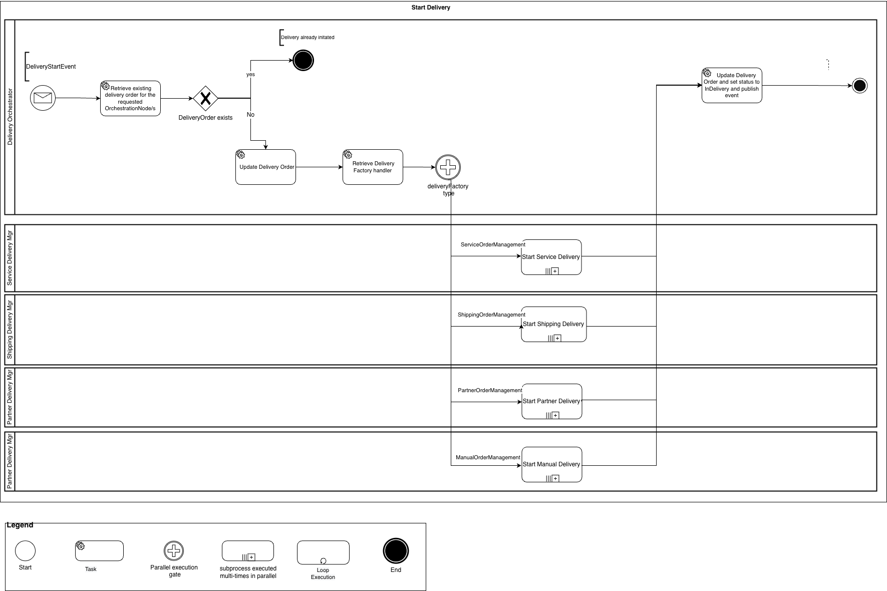

- COOD delivery management service has various delivery handlers; each one manages the delivery cycle for a specific delivery mode.
- The handler selection criteria depend on the product type the specifications retrieved from the catalogue. Also, the URL for the target delivery factory is obtained from the product catalogue
- COOD delivery management service handlers’ selection supports multiple modes, as described in the figure above (service, shipping, and manual delivery handlers are already supported while partner handler is not yet delivered).

### Service Delivery via SOM Handler

#### Service catalogue Verifications

- COOD delivery management service retrieves the service specifications from the service catalogue and validates the names of the characteristics included in each node. If any of these characteristics is not defined in the service catalogue this will lead to an exception and fallout incident is created.
- The service catalogue verification is a configurable task that can be disabled via a configuration file.

#### Prepare SOM Request

- COOD prepares SOM request and all the product specifications and characteristics as received in the order and enriched by catalogue.
- In addition, the SOM request carries the realization service ID for the product to be delivered in case of modification or termination, while the realization service ID for the related product will be added in acquisition use case.
- Finally, the SOM request should be submitted to the appropriate URL as defined in the product specifications in the product catalogue.

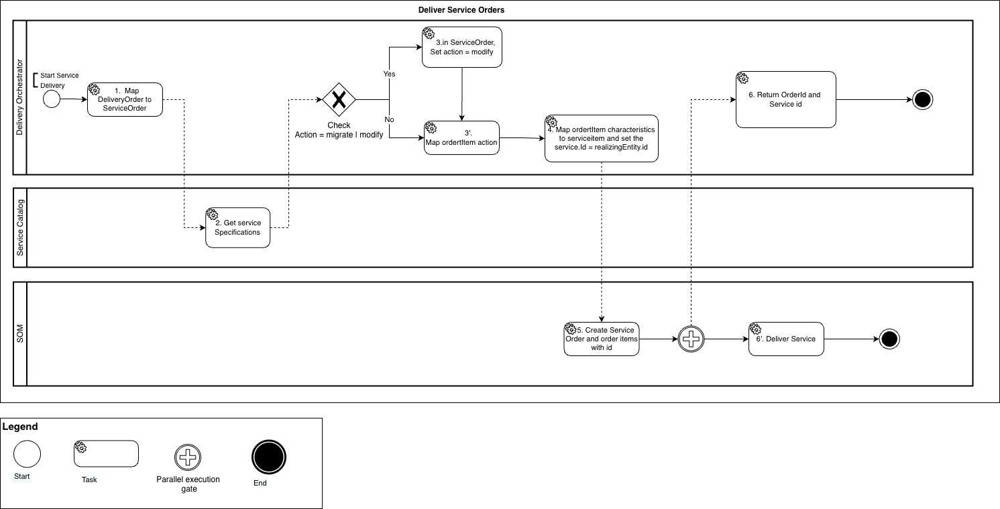{.img-zoomable}

- To sum up, COOD sends a service order to Service Ordering Management (mocked) component and captures the service order id and realizing service id then updated the delivery order and fires an `orchestrationPlanNodeStateChangeEvent` to mark node in delivery.
- On the other side, SOM initiates the delivery and later replies with status update and the realizing sevice ID which represents the ID of the deployed instanse of the service along with the deployed characteristics.

#### Updating the Produt Inventory

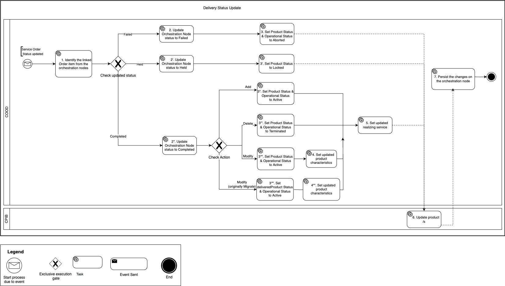{.img-zoomable}

- COOD consumes SOM event and updates the product inventory with the service state and realizing service id, as well as any modifications made to product characteristics.
- COOD then fires `orchestrationPlanNodeStateChangeEvent` to mark product delivery execution is completed/held/failed, so that the execution process of the remaining nodes get updated (or the plan itself if it's the last node).

#### SOM-Request Batching Feature

- Efficiently grouping multiple Service Order Management requests into single API calls while maintaining individual traceability.
- **Batching Logic:** The SOM handler intercepts individual incoming requests from upstream systems and places them into a temporary holding queue instead of sending them immediately.
- **Trigger Conditions:** The batch is released to the SOM API when either of these two conditions is met first:
  - **Batch Size:** Defines the maximum number of requests to accumulate before immediately triggering a send operation, regardless of how much time has passed.
  - **Grouping Period:** Sets a maximum wait time (in milliseconds) to hold the queue. If this timer expires before the batch is full, the system sends whatever is available.
- **SOM response:** Despite sending a single batch API call, the SOM system returns a distinct Service Order ID for every original request contained in the payload.
- **Key Benefits:**
  - **Reduced API Overhead:** significantly fewer HTTP connections and handshake operational costs.  
  - **Improved Throughput Efficiently**: handles burst traffic by aggregating surges into manageable payloads.  
  - **Granular Traceability:** Service Order ID per request ensures no loss of tracking visibility.  

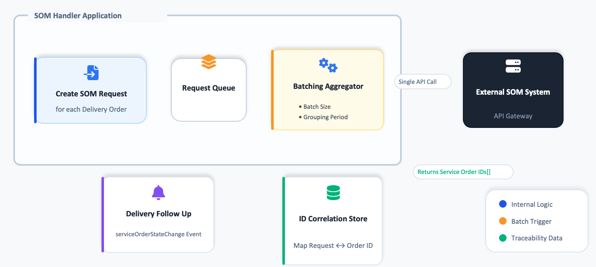{.img-zoomable}

### Tangible Products Delviery via Shipping Handler

- COOD Orchestration service groups the tangible products together -with simillar shipping details- before starting the delivery process as illustrated in the below diagram.

{.img-zoomable}

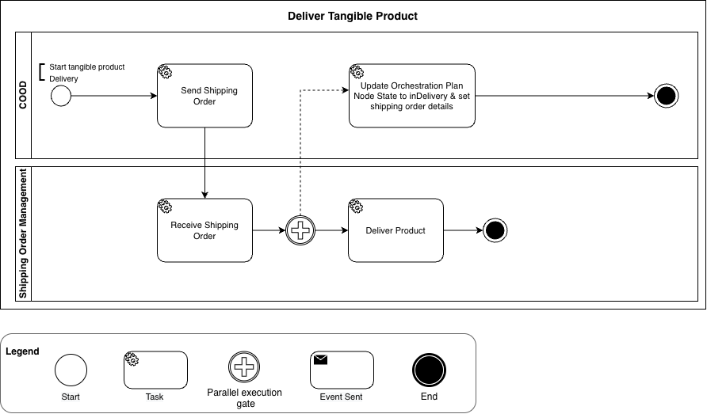{.img-zoomable}

- COOD sends a shipping order to Shipping Order (mocked) component and captures the shipping order id then fires an `orchestrationPlanNodeStateChangeEvent` to mark node in delivery.
- Shipping Order initiates the delivery and later replies with status update.

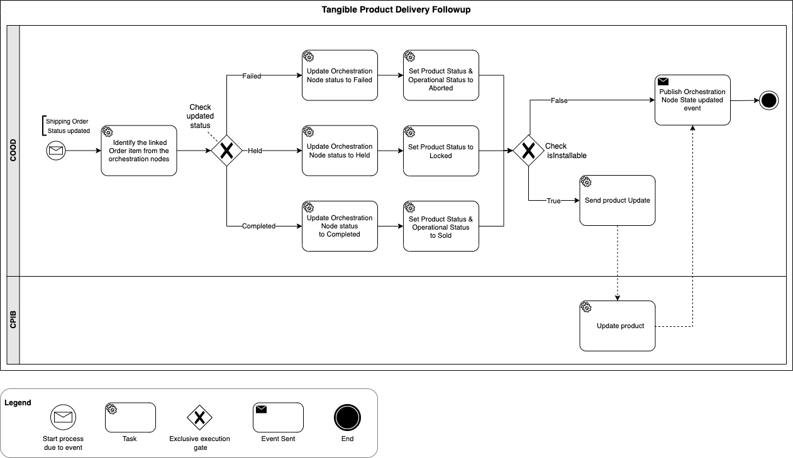{.img-zoomable}

- COOD consumes Shipping event and updates the product inventory for the tangible products with the delivery state, tangible products are distinguished from shipping product using `isInstallable` flag.
- COOD then fires `orchestrationPlanNodeStateChangeEvent` to mark product delivery execution is completed/held/failed, so that the execution process of the remaining nodes gets updated (or the plan itself if it's the last node).

## Synchronizing Orchestration Node Status and the Product Status in the Product Inventory Component

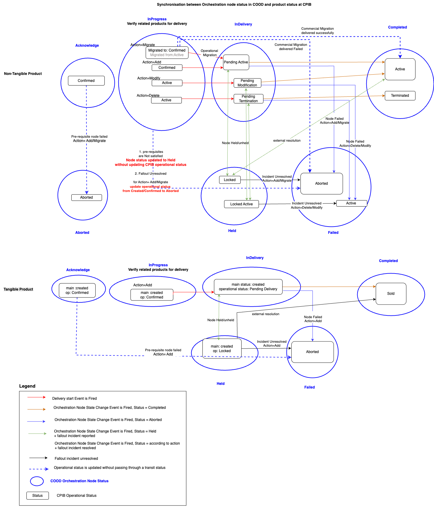{.img-zoomable}

Along the delivery cycle for each orchestration node, with each transition in the orchestration node, COOD keeps updating the product status in the product inventory to reflect the orchestration and delivery progress.

For example, when product starts delivery, product status in the inventory is updated to `PendingActive` or `PendingModify` or `PendingMigrate`, `PendingTerminate`, which mean an ongoing delivery action is in progress with action (`Add`, `Modify`, `Migrate`, `Terminate`) respectively. When delivery is completed by the delivery factory, product status is updated to `Active`, `Active`, `Active`, `Terminated` respectively.

## Managing Orchestration Plan Scheduling

This feature for COOD to provide information about the lead time consumed to orchestrate and deliver an order. This is achieved via enriching the orchestration plan/node data model with actual and estimated time parameters.

The delivery time will vary from product to product, in addition to shipment services, as well as human interaction (like service installation, customer visits).

### Plan/Node Time Parameters

- **Requested Delivery Date for the order (Orchestration Plan):** the date by which the customer requests the order be delivered, as defined in the received order
- **Order Start Date (Orchestration Plan)**: the time set by COOD to start the delivery of the Orchestration plan (Plan status `InProgress`)
For plans with immediate delivery ONLY: order start date = time stamp when plan status changed to Acknowledge
- **Order Item Start Date (Orchestration Node)**: the time set by COOD to start the delivery of the Orchestration node (Plan status `InProgress`). root nodes: start time= order start time and child nodes: start time = completion time of the parent node
- **Actual Order Start Date (Plan)**: the date when the delivery of the Order (Orchestration Plan) has started (Plan status changed to `InProgress`)
- **Actual Order Item Start Date (Node)**: the date when the delivery of the Order Item (Node) has started (Node status changed to `InProgress`)
- **Actual Order Completion Date (Plan)**: the date when the Order (Orchestration Plan) is completed successfully (Plan status Executed + All Node status is `Completed`)
- **Actual Order Item Completion Date (Node)**: the date when the Order Item (Node) is completed successfully (Node status is Completed)
- **Actual Order Delivery lead time (Plan)**: the actual duration consumed to deliver the order (Orchestration Plan)**: actual Order Completion Date (Plan) - Actual Order Start Date (Orchestration Plan)
- **Actual Order Item Delivery lead time (Node):** the actual duration consumed to deliver the order Item (Node): actual Order Item Completion Date (Node) - Actual Order Item Start Date (Orchestration Node)
- **Average lead time per product (Spec ID + delivery factory):** statistical average for the last 100 successfully completed orchestration nodes delivering the same product Spec ID via the same delivery factory (same delivery factory href)

### Updating Time Parameters along the Delivery Process

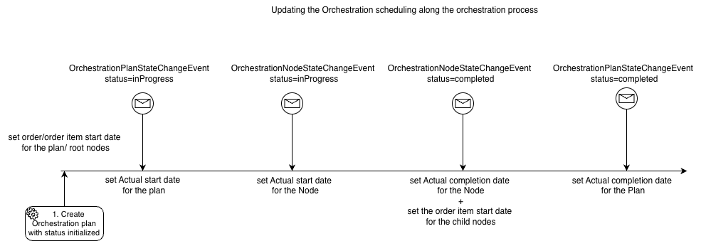{.img-zoomable}

## Managing Future Dated Orders

- Each received order has a parameter named `requestedDeliveryDate` that represents the date required to have the order delivered.
- COOD will create an orchestration plan with a status planned once the order is received. Then COOD put that plan in the orchestration cycle on the requested delivery date.

### Adaptive Orchestration Plan Scheduling

- With reference to the orchestration plans lead time estimation, COOD can detect the long-lasting plans/node that requires more than one day.
- As an optional feature, COOD can put the planned orchestration plan into the delivery cycle earlier than the requestedDeliveryDate such that the delivery of the plan is expected to be completed on the requestedDeliveryDate.

### Smooth/Gradual Launching for the Planned Orchestration plans

- This features in introduced to avoid creating burst traffic scheme when a large number of planned orchestration plans have the same requested delivery date.
- Instead of launching all plans that satisfy the time condition for the requested delivery date or plan start time altogether, COOD will launch them in patches over a period of time.
- Three configurable parameters will be considered:
  - Start and end time
  - Patch size
  - Duration between patches

## Fallout Management

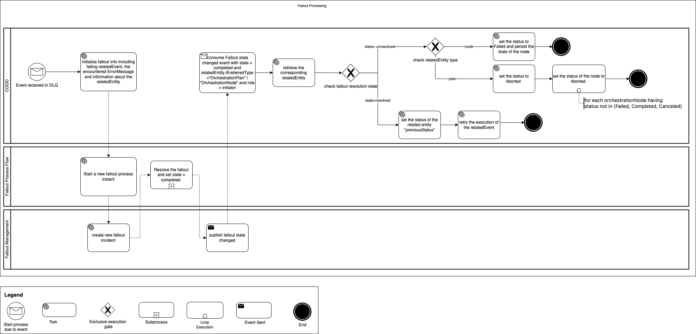{.img-zoomable}

- When a fallout occurs and its retry attempts are exhausted, it's added to the dead letter queue.
- COOD consumes events from the dead letter queue and do the following:
  - COOD checks the entity related to the issue (`OrchestrationPlan` or `OrchestrationPlanNode`) store its status and then update the status to held.
  - Create a fallout process instance to handle this fallout.
  - Attach all the relevant information including the payload of the event that has failed and the `ErrorMessage` that describes the issue.
- The Fallout Management then processes this based on the ErrorMessage until the fallout is completed and emits `FalloutIncidentStateChange` event.
- COOD Consumes `FalloutIncidentStateChange` event with `status = Completed`. Then retrieve the related orchestration plan/node.
- For fallouts with `resolutionStatus = resolved`, restore the orchestration node status to original status and retry the execution of the failed event.
- For or fallouts with `resolutionStatus = unresolved`, if the related entity is orchestration plan then set its status and all the associated orchestration nodes that are not executed yet to Aborted and an `OrchestrationPlanStateChanged` event is emitted.

If the related entity is orchestration node then set its status to Failed and an `OrchestrationNodeStateChanged` event is emitted.

## Data Retention

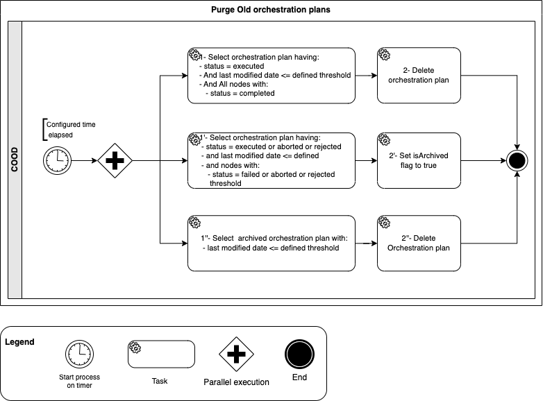{.img-zoomable}

- COOD does data cleanup for the closed orchestration plans, according to the data retention policy, COOD configures a time to retain successfully completed orchestration plan. there's another configuration for the orchestration plans that encountered failures during its delivery.
- Periodically COOD checkes and deletes them once their retention period expires.
