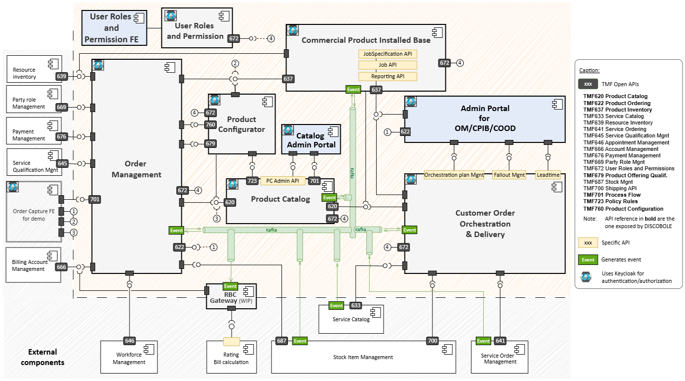
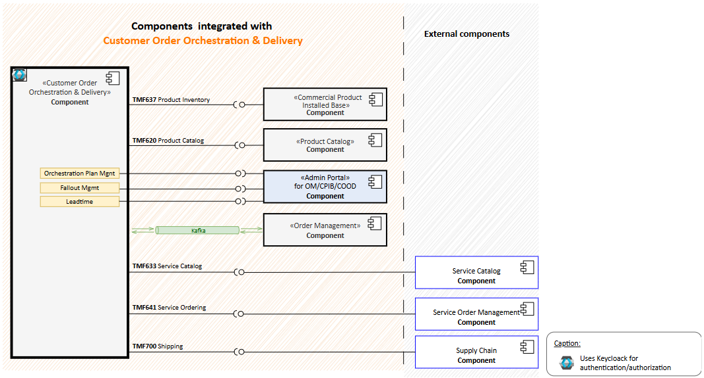
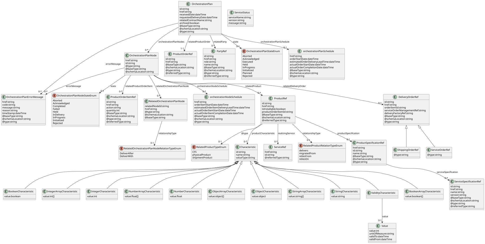
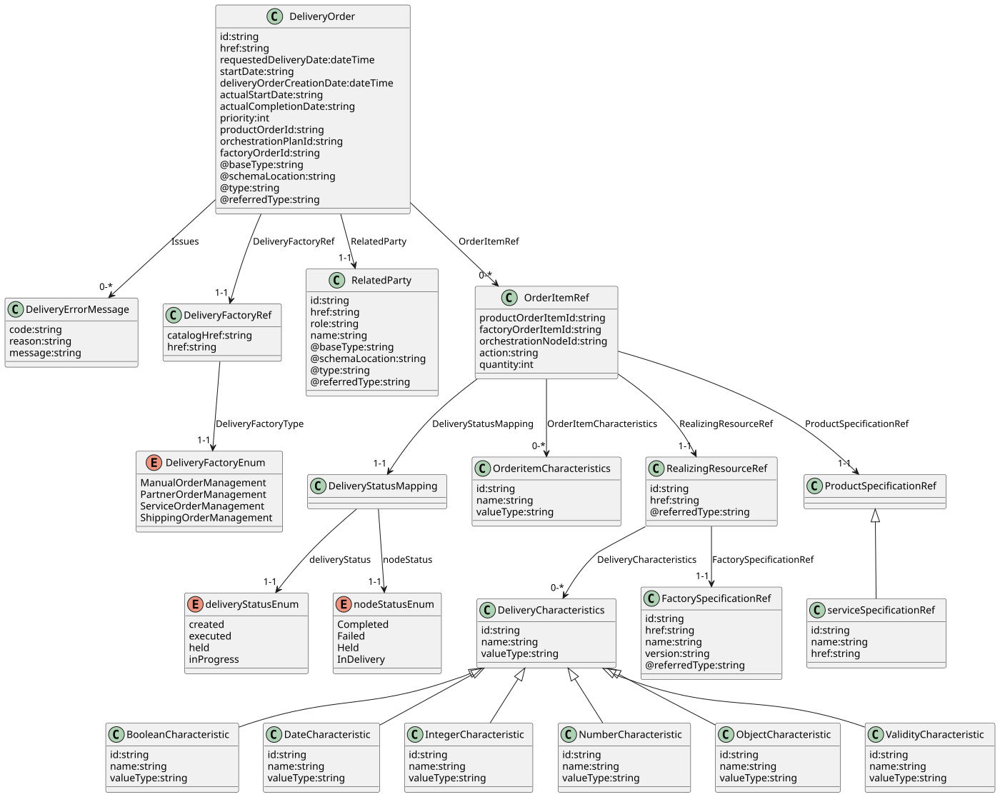
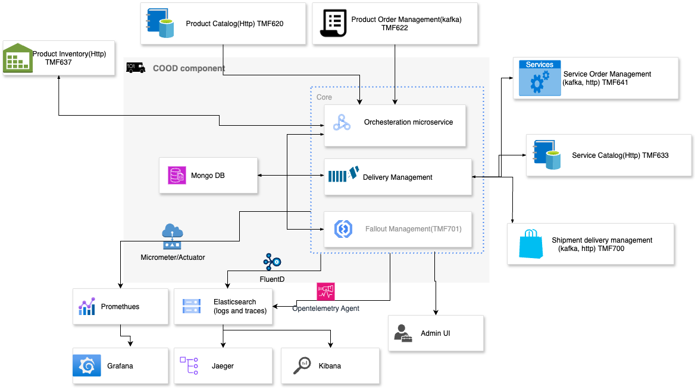
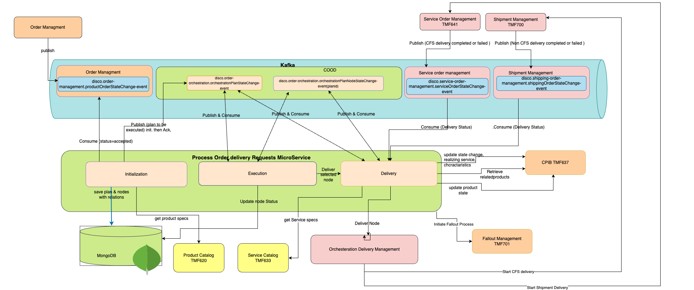
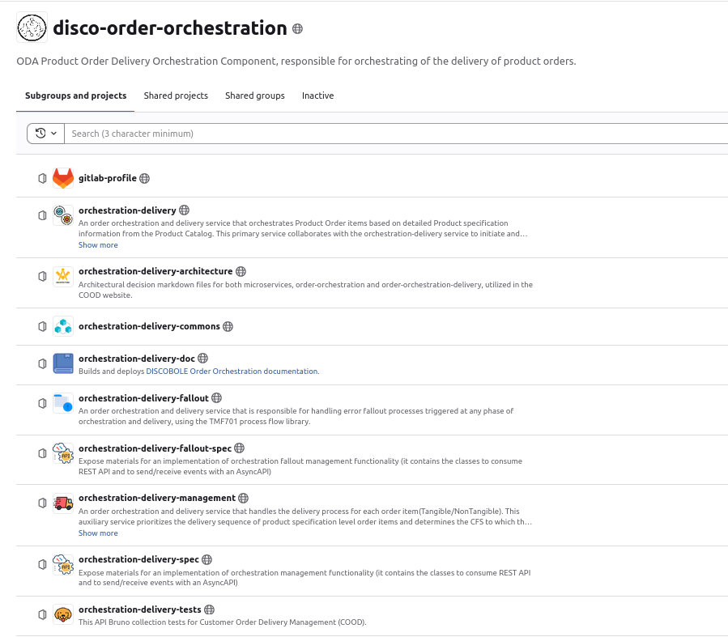

# Overall Architecture

Customer Order Orchestration and Delivery-COOD is part of the [DISCOBOLE](https://discobole.pages.gitlab.ow2.org) platform.

{: .img-zoomable}

The diagram above highlights the position of COOD within the DISCOBOLE components and its interactions with other services. COOD is responsible for creating Orchestration Plans for order items, where the execution of each node depends on the states of other nodes. This service is built as a microservice using Spring Boot 3 and Java 17. Kafka is employed as the central message bus to manage communication between components, while MongoDB is used for storing relevant data.

## Component View

The core component of the architecture consists of three Java microservices within COOD. These microservices collectively handle the orchestration and delivery of order items. They are responsible for creating and executing orchestration plans based on the dependencies between nodes.

1. **Orchestration Microservice**: This microservice is responsible for executing and initializing orchestration plans. It also listens to delivery status updates from the delivery management service.

2. **Delivery Management Service**: This service handles all logic related to delivery. It constructs objects to initiate deliveries and listens to delivery status updates from delivery factories. It is implemented using the factory/strategy pattern, with structured delivery factory interfaces facilitating easy creation of delivery factories.

3. **Fallout Service**: In case of errors during any phase of the process, a fallout process is initiated. The fallout service handles different types of errors, including technical fallout, business fallout, and retryable or unrecoverable errors.

{: .img-zoomable}

The above diagram provides a detailed breakdown of COOD's deployable components and their interactions with external systems. It outlines the APIs exposed by each component and illustrates how they communicate with and consume services from one another.

??? info "APIs and Events summary"
  | API/Event name                                                   | TMF code | Description                                                                                                                                     |State           |
  |------------------------------------------------------------------|----------|-------------------------------------------------------------------------------------------------------------------------------------------------|-----------------|
  |  `disco.order-management.productOrderStateChange-event`             | TMF622   | This event is generated within the Order Management (validated order) to start the product orders delivery planning                             | Dependent       |
  |  `disco.order-orchestration.orchestrationPlanNodeStateChange-event` | TMFC003  | COOD itself generates this event as it progresses through its orchestration plan. It reflects changes in the state of orchestration plan nodes. | Exposed         |
  |  `disco.order-orchestration.orchestrationPlanStateChange-event`     | TMFC003  | COOD itself generates this event as it progresses through its orchestration plan. It reflects changes in the state of orchestration plan.       | Exposed         |
  |  `disco.delivery-management.deliveryOrderItemStatus-event`          | N/A      | COOD has internal topic between Orchestration and Distribution microservices to reflect the delivery status to the nodes and notify cpib.      | Internal        |
  |  `disco.delivery-management.deliveryOrder-event`                    | N/A      | COOD has internal topic between Orchestration and Distribution microservices to start the delivery in delivery service.                         | Internal        |
  |  `disco.service-order-management.serviceOrderStateChange-event`     | TMF641   | COOD consumes it to notify delivery management about the delivery status of items(CFS)                                                          | Dependent(Mock) |
  |  `disco.shipping-order-management.shippingOrderStateChange-event`   | TMF700   | COOD consumes it to notify delivery management about the delivery status of items(Tangible)                                                     | Dependent(Mock) |
  | GET /leadTimeHistoryStatistics/node                              | N/A      | Retrieve node lead time statistics                                                                                                              | Exposed         |
  | GET /leadTimeHistoryStatistics/contract                          | N/A      | Retrieve contract lead time statistics                                                                                                          | Exposed         |
  | GET /orchestrationPlan/{id}                                      | TMFC003  | Retrieve orchestration plans by id                                                                                                              | Exposed         |
  | GET /orchestrationPlan                                           | TMFC003  | List orchestration plans                                                                                                                        | Exposed         |
  | GET /falloutIncident                                             | N/A      | List fallout entities                                                                                                                           | Exposed         |
  | GET /falloutIncident/{id}                                        | N/A      | Get fallout entity by id                                                                                                                        | Exposed         |
  | GET /processManagement/v1/processFlow                            | TMF701   | list fallout processes                                                                                                                          | Exposed         |
  | POST /processManagement/v1/processFlow                           | TMF701   | Create fallout process                                                                                                                          | Exposed         |
  | PUT /processManagement/v1/processFlow/{id}                       | TMF701   | Update fallout process                                                                                                                          | Exposed         |
  | GET /productCatalogManagement/v1/productSpecification            | TMF620   | COOD retrieve product specifications of order items in plan initialization stage                                                                | Dependent       |
  | GET /serviceCatalogManagement/v1/serviceSpecification            | TMF633   | COOD retrieve service catalog charactaristics to verify if it is aligned with CATALOG and CPIB characteristics during delivery stage            | Dependent(Mock) |
  | POST /serviceOrdering/v1/serviceOrder                            | TMF641   | COOD call service order service to deliver the CFS items                                                                                        | Dependent(Mock) |
  | POST /shippingOrder/v1/shippingOrder                             | TMF700   | COOD call shipping order service to deliver the Tangible items                                                                                  | Dependent(Mock) |

## Data View

The diagram below illustrates the data model for Customer Order Orchestration and Delivery Management services, which share the same database. The primary entity is the Orchestration Plan, with its main child entities being the Orchestration Plan Nodes.

{.img-zoomable}

The diagram below represents the data model for the delivery order which is used in the delivery process.

{.img-zoomable}

## Software View

Below is a diagram which presents the COOD architecture and integration with other components or technical services (TMF and non-TMF).

{.img-zoomable}

The above diagram presents an updated overview of the COOD architecture, featuring three microservices: Order Orchestration, Delivery Management, and Fallout Management, along with their associated dependencies.

### Message Bus Kafka

Kafka acts as the central message bus that connects all components within the architecture. It is used to transmit messages and events between the microservice and other components.

### Process Flow Library

The process flow concept is employed to implement the business processes. This approach facilitates the implementation of a centralized process, guiding any front-end seamlessly through the process flow interface TMF701. The process flow library is used to manage the interactions between the back-end process flow and any front-end consumer through the TMF701 Process Flow API.
It is used for fallout management.

### Database MongoDB

MongoDB is used as the database for storing data related to order items, orchestration plans, and other relevant information.

## Listeners And Topics

The microservice includes three separate listeners, each associated with a specific Kafka topic:

 **`1- disco.order-management.productOrderStateChange-event`:**

- **Purpose:** To initiate the planning of product orders, encompassing initialization, execution, and delivery phases.
- **Consumption:** This topic is consumed to kickstart the planning process for product orders.

**`2- disco.order-orchestration.orchestrationPlanStateChange-event`:**

- **Purpose:** Self-triggered event in the COOD, reflecting changes in the state of orchestration plans.
- **Usage:** Utilized when a plan is acknowledged; triggers the commencement of delivery for leaf nodes. It aids in tracking plan execution and state changes.

**`3- disco.service-order-management.serviceOrderStateChange-event`: (used by Delivery management)**

- **Purpose:** To inform Delivery management about the delivery status of items.

**`4- disco.order-orchestration.orchestrationPlanNodeStateChange-event`:**

- **Purpose:** Self-triggered event in COOD, representing changes in the state of orchestration plan nodes.
- **Usage:** Employed when a plan is completed/failed/held/aborted. Initiates the execution of its dependent/prerequisite nodes. Aids in tracing the execution, delivery, and state changes of plan nodes.
- **Note:** This topic should be partitioned by `planid` as the partition key to ensure all nodes are received in the triggered order during the execution initiation.

**`5- disco.delivery-management.deliveryOrder-event`:**

- **Purpose:** To serve as the interface between COOD and delivery management for initiating the delivery process.

**`6- disco.delivery-management.deliveryOrderItemStatus-event`:**

- **Purpose:** Delivery management publishes this event to notify COOD about the delivery status.

These topics play a vital role in orchestrating the workflow, facilitating communication between various components, and ensuring the seamless execution and tracking of delivery-related processes.

### Service Triggers

The Order Orchestration Service is primarily event-driven. It is triggered via events published on the Kafka topics mentioned above. These events initiate orchestration processes and node state changes.

### Endpoints

The service offers the following endpoints for external access:

- **Get Plans by Filter**: This endpoint allows users to retrieve orchestration plans based on specified filters.

- **Get Plan by ID**: Users can retrieve specific orchestration plans by providing the plan's unique identifier.

## Architecture With Integration Points

{: .img-zoomable }

The above diagram provides a detailed architecture of COOD and how its execution phases done.

## Source Code Organization

{: .img-zoomable}
