# Monitoring and Administration Portal

DISCOBOLE suite proposes frontends/user interfaces (UIs) for the administration and management of the DISCOBOLE components.
Admin portal UI is an user interface that can be used in the context of COOD component to monitor the execution of orchestration plans, manage the fallout and provide reporting.

## Visualizing and Monitoring Orchestration Plans

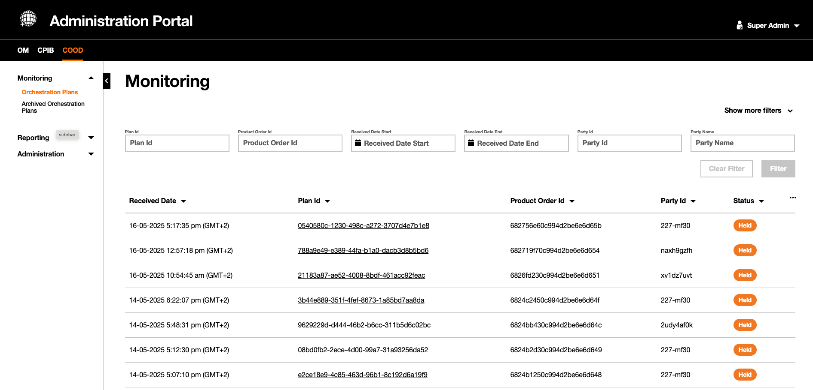{.img-zoomable}

### Orchestration Plan Details

- COOD Admin portal provides a user friendly interface to visualize and manage the orchestration along the orchestration and delivery cycle.

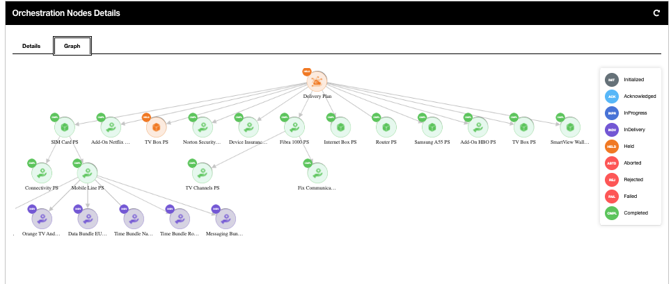{.img-zoomable}

- Detailed views for both orchestration plans and nodes: plan/node status, product specifications and characteristics, status of delivery request, error messages, etc
- Orchestration plans can be retrieved  via orchestration plan ID, Order ID, Dates, party ID, or Party name.

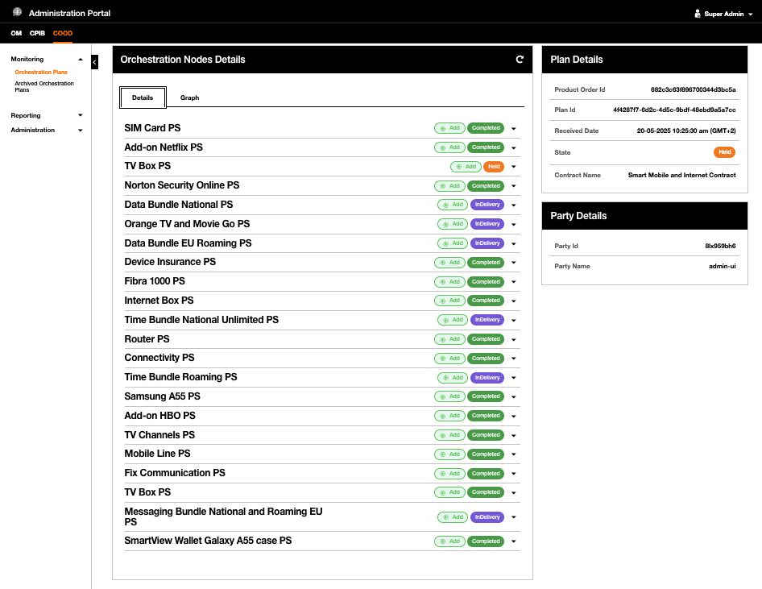{.img-zoomable}

- Detailed views for the orchestration plan provides the status and other details like product specifications for both the orchestration plan overall and each node in the plan
- Graphical view provides the hierarchy of the orchestration and delivery process.

### Orchestration Node Details

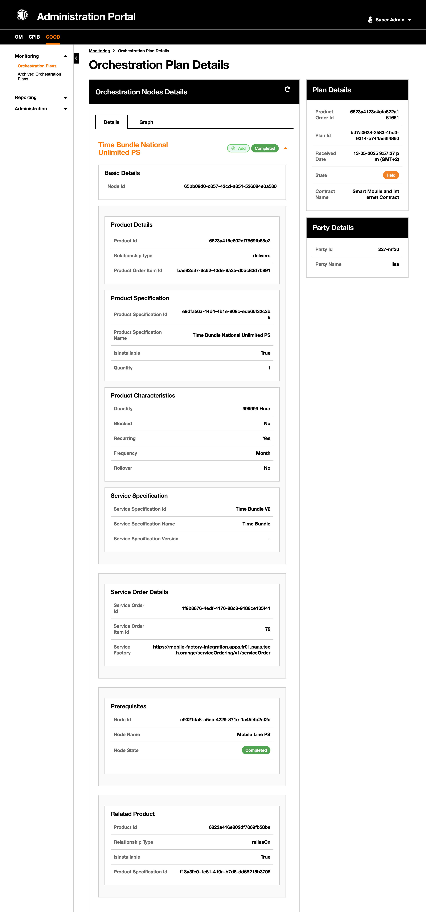{.img-zoomable}

- Orchestration node gives all relevant details of the orchestration node
  - Orchestration Node ID
  - Product Order ID
  - Product Specification ID
  - isInstallable: true for products where status is to be updated in the inventory , False for others (like shipment service)
  - Product Name
  - Product Characteristics
  - Action as defined in the product order (delivers)
  - Service Specification
  - Delivery factory details
    - service order ID
    - service order item ID
    - Delivery factory (SOM) URL
  - Related Product and prerequisites

### Time Parameters and Orchestration Schedule

Orchestration plan and orchestration nodes have been enriched  by adding time parameters that records the time line for the for the plan/node execution.

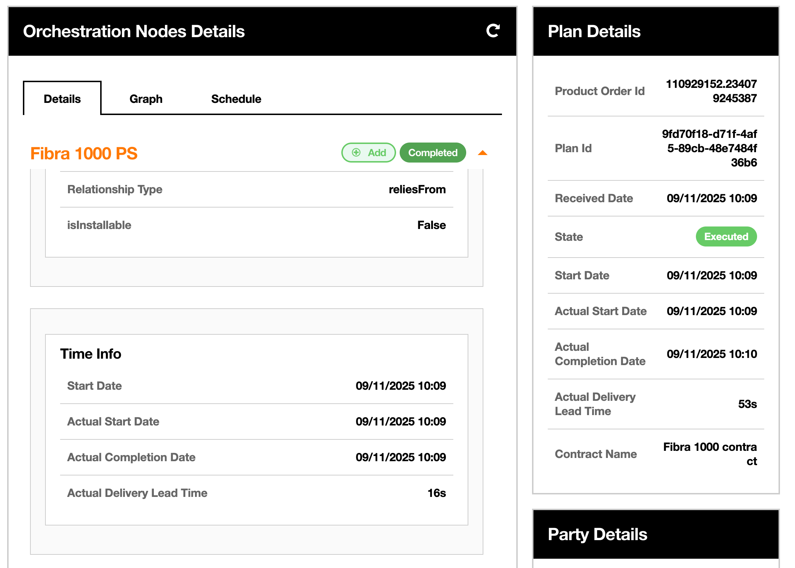{.img-zoomable}

In addition, a section was added to visualize the orchestration schedule.

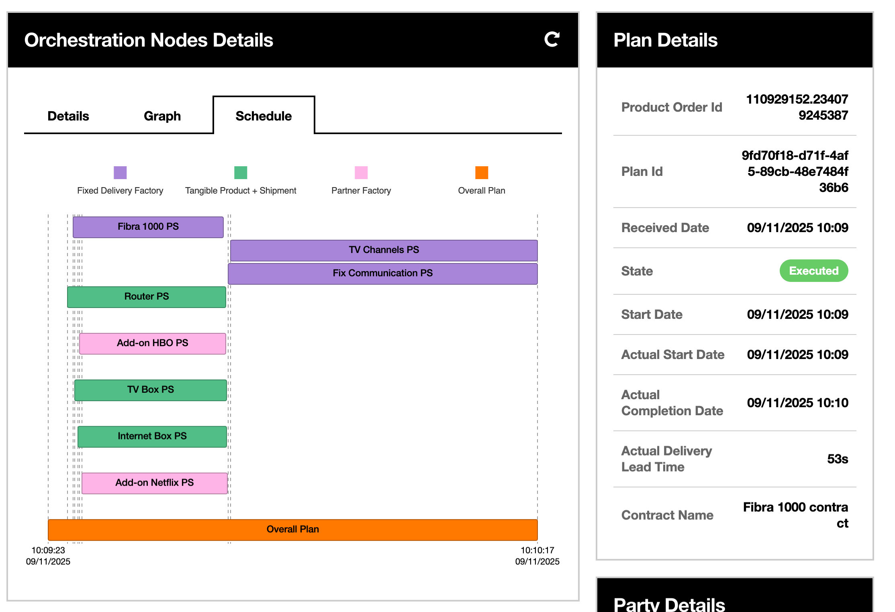{.img-zoomable}

## Reports

### Orchestration Plan Status

- Below are samples of the reports provided by COOD

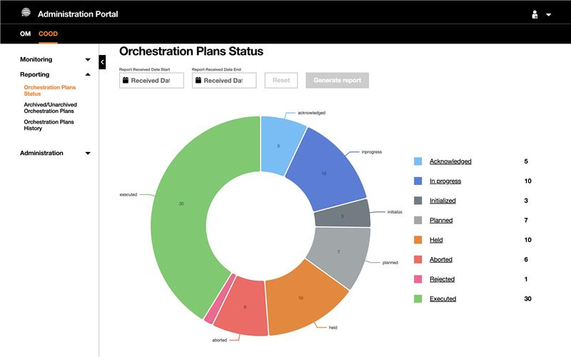{.img-zoomable}

- Report provides a number of orchestration plans divided by the status in a specific duration.

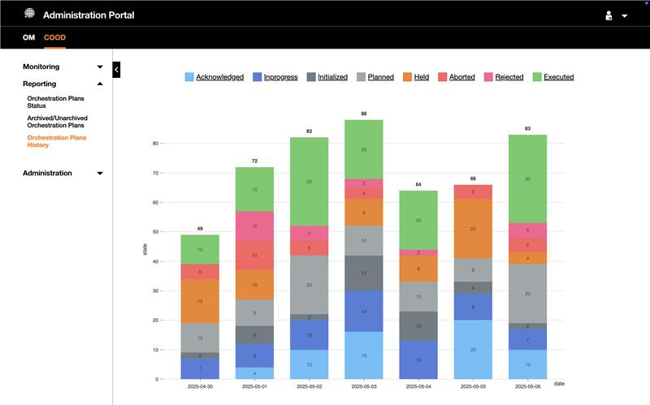{.img-zoomable}

- Report provides a number of orchestration plans divided  by the status distributed on daily/weekly/monthly based over a specific period.

{.img-zoomable}

- Report provides a number of Active vs achieved orchestration plans.

### Lead Time Reports

- Below are samples of the various reports for the lead time statistics.

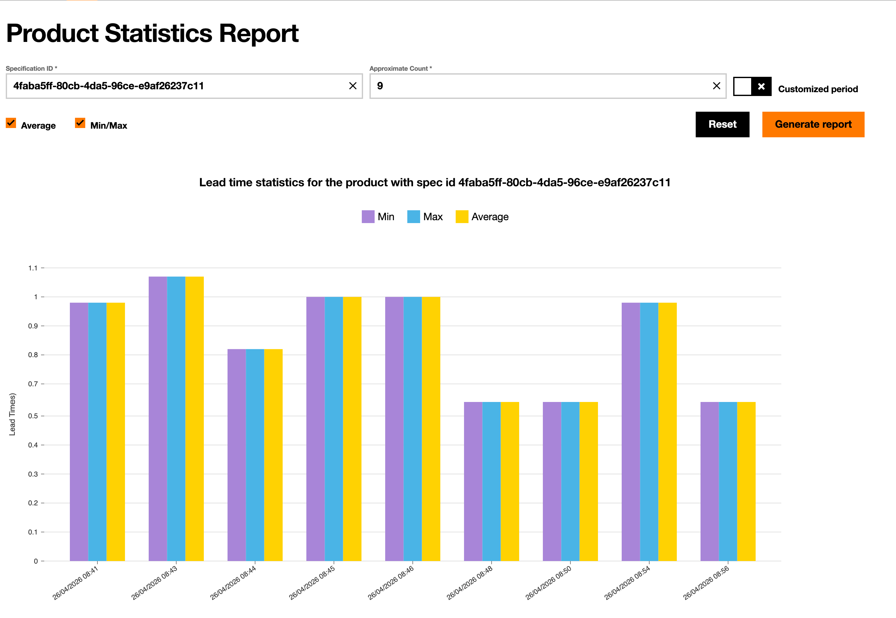{.img-zoomable}
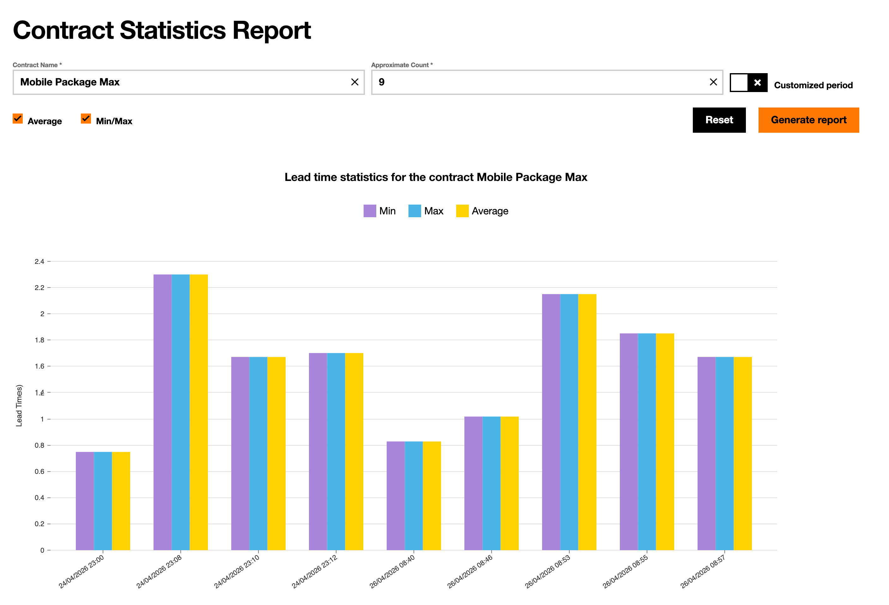{.img-zoomable}
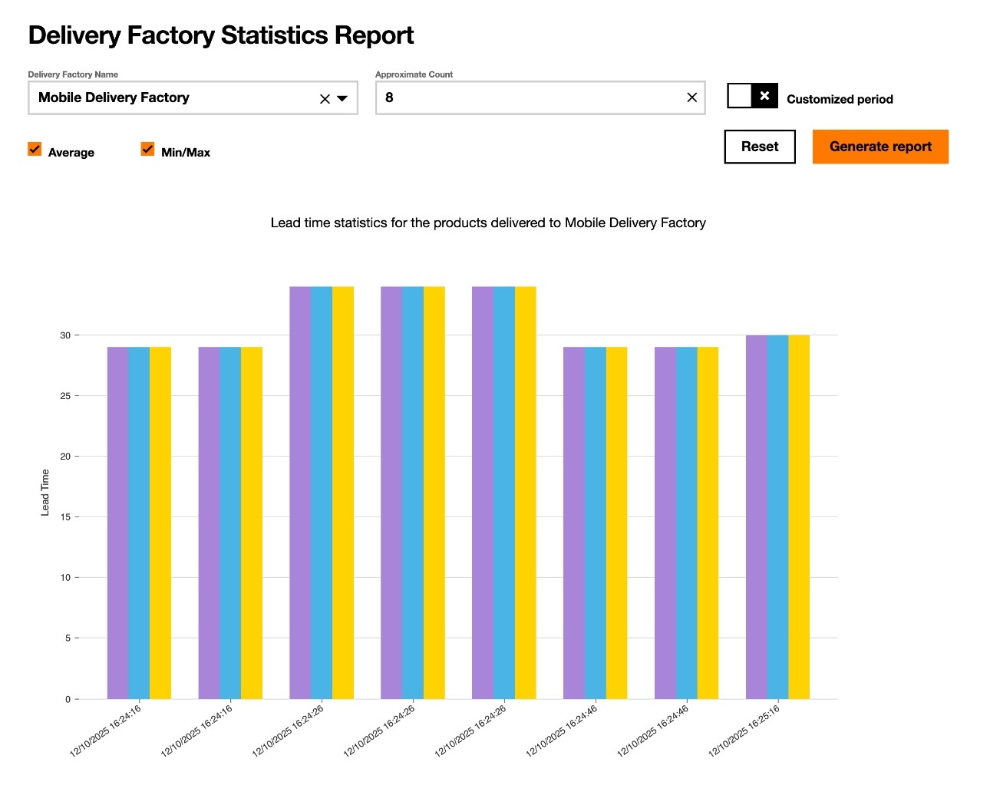{.img-zoomable}
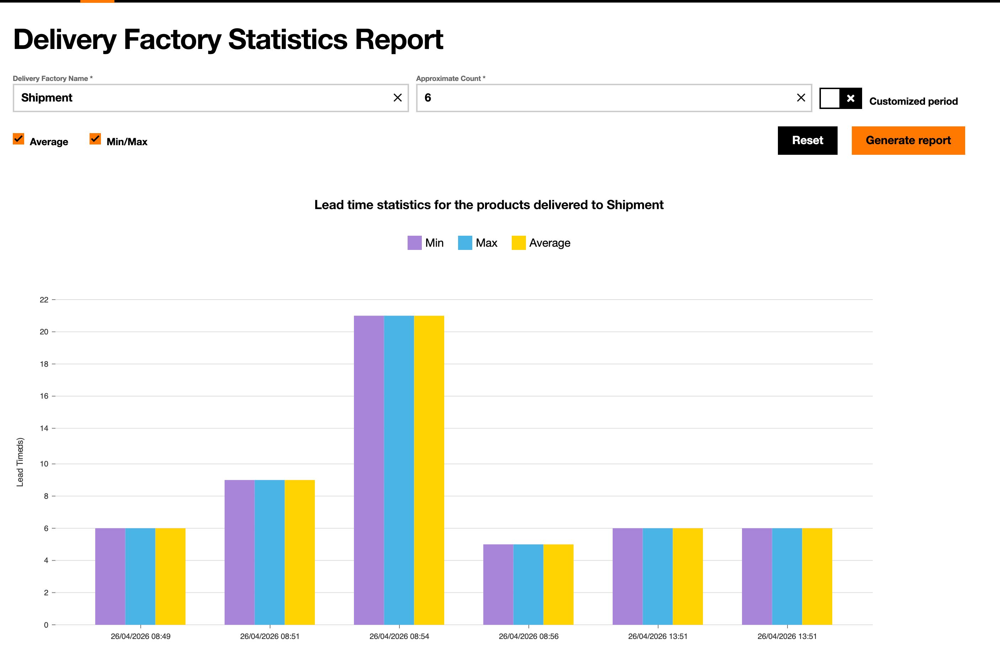{.img-zoomable}

Lead time reports for Products, contracts, delivery factories and shipment.
