# Overall Architecture

## Global View

**Product Inventory** is part of the [DISCOBOLE](https://discobole.ow2.io/doc/) suite.

{.img-zoomable}

Product Inventory (PI) also called **CPIB for Commercial Product Installed Base** belongs to the "Order To Bill" (OTB) domain and represents a central module in an operational Core Commerce Management (CCM) IT ecosystem.

The key principle of this component is to maintain the association between customers and purchased product instances.

Product Inventory is triggered by:

- Party Management platforms or any engagement management system (front-end channels).
- [DISCOBOLE Order Management (OM)](https://discobole.ow2.io/disco-oda-components/disco-order-management/doc) when a customer order is validated. OM creates the product instances with the status “Created”.
- [DISCOBOLE Order Management (OM)](https://discobole.ow2.io/disco-oda-components/disco-order-management/doc) for adding order item related to product or adding productRelationShips.
- [DISCOBOLE Customer Order Orchestration & Distribution (COOD)](https://discobole.ow2.io/disco-oda-components/disco-order-orchestration/doc) component for updating product or updating status according to order delivery progress.

- [DISCOBOLE Product Configurator](https://discobole.ow2.io/disco-oda-components/disco-product-configuration/doc) for consulting product instances.

Product Inventory also offers an administration tool UI for product monitoring and task management.

## Component View

Product Inventory (PI) is a standalone component following TMF ODA Component «Product Inventory», that stores all Products. It exposes TMF open API interfaces to enable commercial installed base creation, consultation and update: the Product Inventory Management API TMF637.

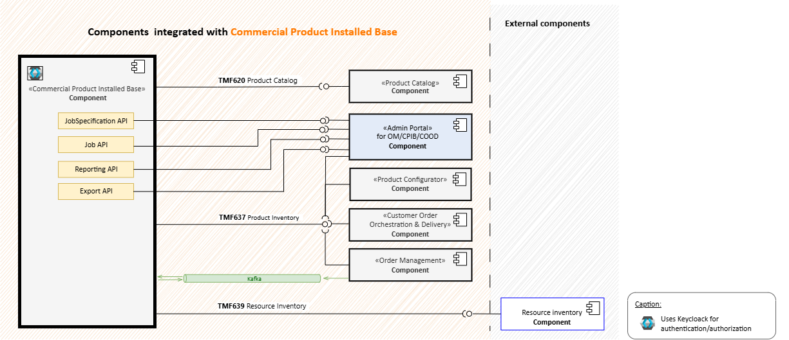{: .img-zoomable}

??? info "Component Overview"
    The Product represents an instance of a Product Offering subscribed to by a party, such as a customer, the place where the Product is in use, as well as configuration characteristics, such as assigned telephone numbers and internet addresses. The Product also tracks the services and/or resources through which the Product is realized.

??? info "Product Inventory APIs & Event Summary"
    Product Inventory exposes TMF637 Product Inventory Management API that performs the following operations on Product:

    - Retrieval of a product or a collection of products depending on filter criteria
    - Update of a product or bulk update of products(including updating rules)
    - Creation of a simple product or hierarchical product (including default values and creation rules) (for administration purposes)

    Product Inventory consumes TMF620 Product Catalog Management API to validate the offer identifier from the Product Catalog when creating a new product instance.

    The table below lists the different Product Inventory (PI) interaction with [DISCOBOLE](https://discobole.ow2.io/) ecosystem.

    | API Name | TMF Code | Usage description | State |
    | --- | --- | --- | --- |
    | Product Inventory Management | TMF637 | Manage product resource | Exposed |
    | Product Catalog | TMF620 | Validate offers and hierarchy | Dependent (optional) |
    | User Roles and Permissions | TMF672 | Get roles and permissions | Dependent (optional) |
    | Resource Inventory Management | TMF639 | Validate resource and related information | Dependent/Mocked (optional) |
    | `productOrderStateChange` | - | Abort products related to rejected order | Consumed |
    | `ProductStateChange` | - | Triggered by product state update | Published |
    | `ProductAttributeValueChange` | - | Triggered when termination date is set for product with validity | Published |
    | `productCreate` | - | Triggered when a product is created | Published |
    | `productDelete` | - | Triggered when a product is deleted | Published | 

## Data View

### Product Resource

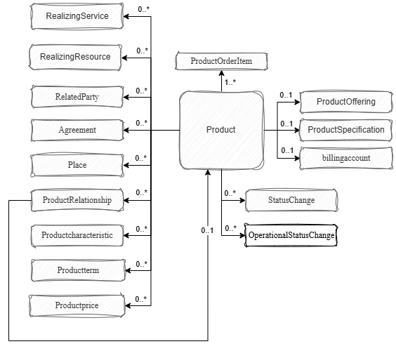{.img-zoomable}

| Class name   | Description     |
|:-------------|:----------------|
| `Product`    | A product offering procured by a customer or other interested party playing a party role |
| `RealizingService`    | Service reference, for when Service is used by other entities |
| `RelatedParty`    | Related party reference, for party or party role or its reference, linked to a specific entity |
| `Agreement`    | Agreement reference. An agreement represents a contract or arrangement |
| `Place`    | Place reference. Place defines the places where the products are sold or delivered |
| `ProductRelationship`    | Linked products to the one instantiate |
| `ProductCharacteristic`    | Describes a given characteristic of an object or entity through a name/value pair |
| `ProductOrderItem`    | The product order item which triggered product creation/change/termination |
| `ProductPrice`    | An amount, usually of money, that represents the actual price paid by a Customer for a purchase, a rent or a lease of a Product |
| `ProductOfferingPrice`    | Defines the pricing details of a product offering, including installment charge options |
| `ProductTerm`    | This represents a commitment with a duration |
| `ProductOffering`    | This represents entities that are orderable from the provider of the catalog |
| `ProductSpecification`    | A detailed description of a tangible or intangible object made available externally in the form of a Product Offering to customers |
| `BillingAccount`    | BillingAccount reference. A BillingAccount is a detailed description of a bill structure |
| `StatusChange`    | This represents a status change at some time |
| `OperationalStatusChange`    | This represents an operational status change at some time |

### JobSpecification Resource

The `JobSpecification` entity is designed to manage jobs within a scheduling framework. Each job specification would define the details of a particular type of job, such as import, export, purge, or termination jobs.

`JobSpecification` is an entity that encapsulates information about specific treatments:

- Which job,
- When scheduled,
- What are the specific characteristics of a job.

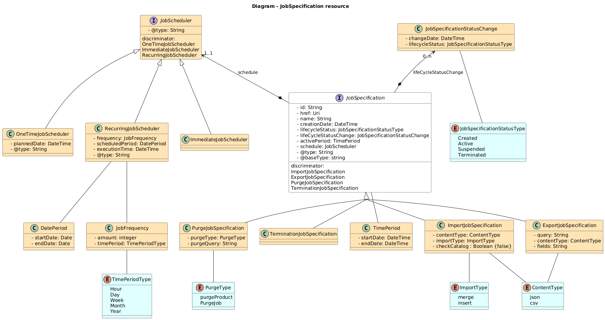{.img-zoomable}

| Class name   | Description     |
|:-------------|:----------------|
| `JobSpecification` | Represent entities that define the details of a particular type of job, such as import, export, purge, or termination jobs. JobSpecification is an entity that encapsulates information about specific treatments (which job, when scheduled, what are the specific characteristics of a job) |
| `ImportJobSpecification` | Extends the `JobSpecification` class to provide specific attributes related to import data from file (format is `Json` or `cvs`, method is either `merge` or `insert`).  Import jobSpecifications can be scheduled only as one-time or immediate. |
| `ExportJobSpecification` | Inherits from `JobSpecification` is used to define the specifics of an export job, including the query for data retrieval, the export format and the fields to be included in the export. |
| `PurgeJobSpecification` | Inherits from `JobSpecification` and is used for managing purge operations.  A purge job involves permanently removing data records based on the provided purge query and purge type. |
| `TerminationJobSpecification` | Inherits from `JobSpecification`. It represents entities used to terminate products that are no longer valid. |
| `JobScheduler` | Represent a `JobSpecification` scheduler to plan job execution. |
| `RecurringJobScheduler` | Inherits from `JobScheduler`. It's designed for jobs to be executed several times with a frequency for a given period. |
| `OneTimeJobScheduler` | Inherits from `JobScheduler`. It's designed for jobs that need to be scheduled one time by given the exact date and time when the job is to be executed. |
| `ImmediateJobScheduler` | Inherits from `JobScheduler. It's designed for jobs that need to be executed immediately when created. |
| `JobFrequency` | Represents how often a job should occur. |
| `TimePeriod` | Represents a time interval with two main attributes: startDate and endDate. |

### Job Resource

The `Job` entity represents an entity used to:

- export products into a file
- import products from a file,
- purge terminated or aborted products, purge completed JobSpecifications,
- terminate products that are not valid anymore.
  
 `Job` entities are setup by JobSpecification entities that configure:

- the selection of entities to proceed,
- the validity period for execution,
- the frequency when the job is recurring
- the type of job to execute

Each `Job` entity references only one parent class job specification.

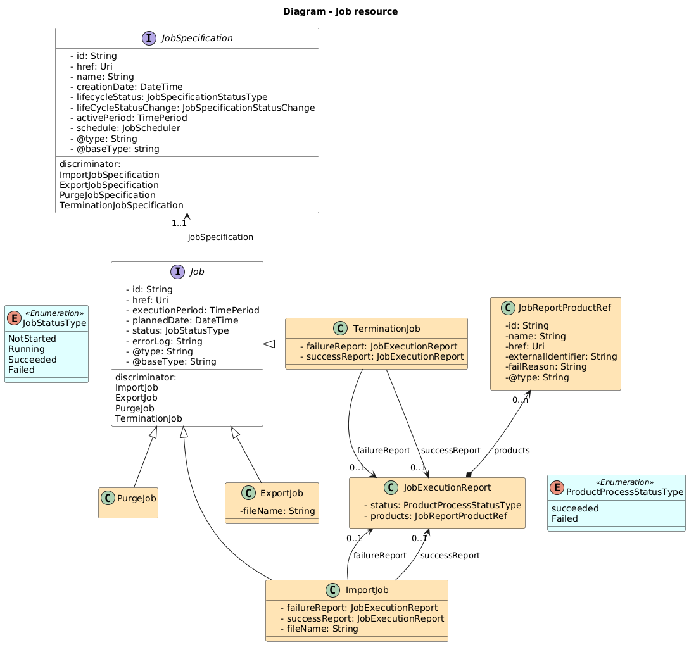{.img-zoomable}

| Class name   | Description     |
|:-------------|:----------------|
| `Job` | Represent entities that represents the execution occurrence relative to a treatment defined in the `JobSpecification` |
| `JobSpecification` | Represent entities that define the details of a particular type of job, such as import, export, purge, or termination jobs. JobSpecification is an entity that encapsulates information about specific treatments (which job, when scheduled, what are the specific characteristics of a job) |
| `ImportJob` | Represents entities used to import products from a file. Entities are setup by `ImportJobSpecification` entities |
| `ExportJob` | Represents entities used to export products into a file. Entities are setup by `ExportJobSpecification` entities |
| `PurgeJob` | Represents entities used to delete:<ul><li>terminated or aborted or cancelled products</li><li>succeeded or `failed` Job entities</li></ul> Entities are setup by `PurgeJobSpecification` entities |
| `TerminationJob` | Represents entities used to terminate products that are no more valid (when it occurs, product status are set to terminated). Entities are setup by `TerminationJobSpecification` entities |
| `JobStatusType` | Represents the possible statuses of a job (`NotStarted`, `Running`, `Succeeded` and `Failed`) |
| `ProductProcessStatusType` | Represents the status of a processed product (`Failed` and `Completed`) |
| `JobReportProductRef` | An object containing the download link of an export file |
| `JobTypeEnum` | Represents the type of a job (`TerminationJob`, `ExportJob`,`PurgeJob` and `ImportJob` ) |

### Report Resource

The `Report` entity is designed to streamline the generation of comprehensive reports related to the products. These reports offer valuable insights into the status and distribution of installed products.

- Report by Product Status
- Report by Product Offering

| Class name   | Description     |
|:-------------|:----------------|
| `Report` | A generic report entity that can represent various types of reports. |
| `ReportProductByStatus` | Inherits from `Report`. It represents the status report type. |
| `ReportProductByOffer` | Inherits from `Report`. It represents the offer report type. |
| `ReportDetails` | Inherits from `Report`. It represents the report details. |
| `ReportCharacteristic` | A name value report characteristic. |
| `ReportGranularity` | `Day`, `Week`, `Month`, `Year` |
| `MeasuredValue` | Represents a numeric value associated with a specific unit of measure. |

## Event View

- Used for notification currently when a product is created, deleted or has a status change.
- PI is moving more towards being event driven as it’s planned that it will consume events from other components like an event when an order is aborted and react.

### Use Case Event Consumption

- Mass update Order Rejected

>When Order Management rejected orders, it generates event `ProductOrderStateChange`.
>Product Inventory consume this event and trigger following actions:
>
> 1. Fetch products related to order rejected
> 2. Update Products
>    if main status of product related to rejected order is "created" then
>    update product status to Aborted
> 3. Publish event ProductStateChangeEvent

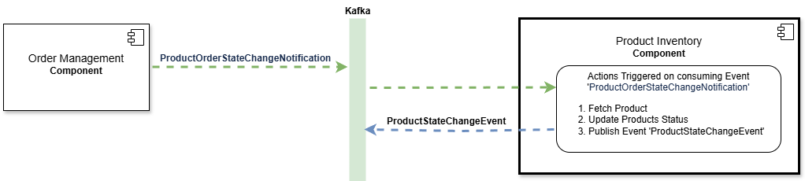{.img-zoomable}

### Use Case Published Event

- Mass Update expired product

>When products with validity expires  :
>
> 1. batch mechanism terminates the active products  
>
> 2. then publish `ProductStateChange` event.

- Update product state

>When products status change  :
>
> 1. publish `ProductStateChange` event.

- Create product

>When product is created :
>
> 1. publish `productCreate` event.

- Delete product

>When products is deleted  :
>
> 1. publish `productDelete` event.

- Mass Update calculate product validity

>Expiration date for product with validity is calculated at PI level.
>
> 1. When updating status active to a product having productCharacteristic with @type “validityCharacteristic” then calculate and set terminationdate.
>
> 2. Then an event `ProductAttributeValueChange` is published

## Process View

The Product Inventory Component is composed of three functional parts:

- **The Product module:** manage the products in the Product Inventory
- **The Job module:** perform jobs to import & export products, terminate and delete products in the Product Inventory
- **The Report module:** - generate comprehensive reports related to the products

### Product Business Rules

The following outlines the key business rules governing the behavior of Product Inventory and products throughout their lifecycles:

- A Product in the Product Inventory is defined as an instance of either a Product Offering, a Product Specification, or both, specifically tailored for a customer.

- Each Product must be associated with at least one customerProductOrderItem, establishing a direct link to customer orders.

- Products that reference either Product Offerings or Product Specifications, or both, adhere to the same lifecycle definition, ensuring uniformity in management and tracking.

- When data persisted in the Product Inventory, related catalog references (e.g., ProductOffering Id and ProductSpecification Id) are validated.
    This validation is minimal, aimed at confirming the existence of catalog elements to maintain data integrity within Product Inventory.
    This validation process is configurable, allowing administrators to enable or disable it as needed.

- An event is generated for each change that affects a Product, facilitating tracking and auditing of modifications throughout its lifecycle.

These rules ensure a structured approach to managing Product Inventory and its associated objects, promoting data integrity and operational efficiency.

### Job Business Rules

Each treatment supported by the JobSpecification module is defined by a dedicated @type value.

The @type value allows identifying which specific subclass inherits from the JobSpecification class.

Here is the list of treatments currently defined in the @type field and their respective subclasses:

??? abstract "ImportJobSpecification"

    Below is a sequence diagram illustrating the process of creating, executing, and checking the status of an import job
    Here is a breakdown of the different steps:

    This sequence diagram outlines the process of creating a Job Specification for an Import task:
    
    [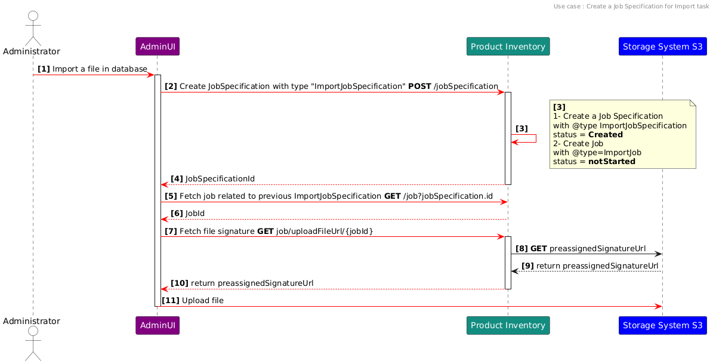](../img/import-job-specification.png){.img-zoomable}

    **[1]** An administrator initiates the process of importing a file into the database through the AdminUI front-end screen 'Create Job Specification.**[2]** The AdminUI sends a POST request to the Product Inventory system to create a Job Specification with the type ImportJobSpecification. 
    **[3]** This request triggers two internal actions: 

    1. the creation of a JobSpecification with the @type `ImportJobSpecification` and status `Created` 
    2. the creation of a job with @type `ImportJob` and status `notStarted`.

    **[5]** In order to fetch the Job related to the previously created ImportJobSpecification, AdminUI sends a GET /job request to Product Inventory using the filtering criteria value of JobSpecificationId returned by the previous POST request **[4]**. 

    **[7]** The AdminUI sends a request to the Product Inventory system to fetch the file signature using the jobId. This request is made using a GET /job/uploadFileUrl/{jobId}. **[8]** The Product Inventory system forwards the request to the Storage System S3 to obtain a preassigned signature URL.

    **[11]** The AdminUI uses this signature URL **[9]** and **[10]** to upload the file to the Storage System S3, and completing the process. 
  
??? abstract "ExportJobSpecification"

    Below is a sequence diagram illustrating the process of creating, executing, and checking the status of an export job, followed by downloading the export file.

    [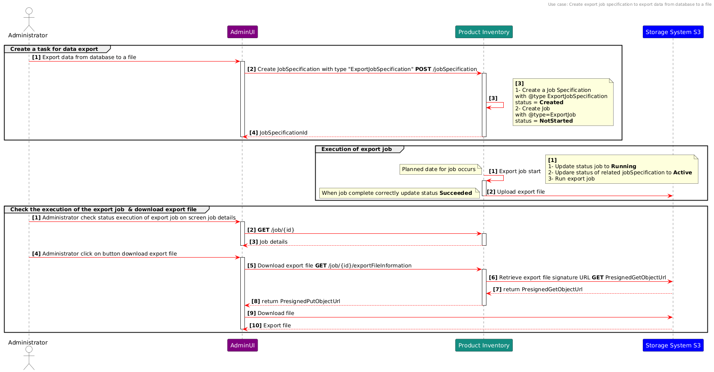](../img/export-job-specification.png){.img-zoomable}

    Here is a breakdown of the different steps:
    
    1. Create a Task for Data Export:

      The Administrator initiates the data export process from the database to a file via the AdminUI. 
      On the 'Create Job Specification' screen, the Administrator specifies criteria such as the query, schedule, and file type (contentType). 
      Specifying the attributes to export (fields) is optional.
      AdminUI sends a request to the Product Inventory to create a new JobSpecification with the @type `ExportJobSpecification`.
      The task for exporting data is now created but not yet launched.
    2. Execution of export job:

      When the planned date arrives, the job is launched, and its status is updated to 'Running'. 
      The status of the related JobSpecification is updated to 'Active'. 
      The data is collected and uploaded to the export file in the system's storage (S3).

    3. Check the Execution of the Export Job & Download Export File:
      
      The Administrator can always monitor and check the execution status of created tasks through the 'Monitoring Job' screen. 
      Additionally, administrator can view the details related to a specific job on the 'Job Details' screen. 
      For jobs of type ExportJob, a button is available on the job details screen to download the export file associated with that job. 
      This third step is executed on demand by the Administrator

??? abstract "PurgeJobSpecification"

    Data purging is a mechanism that deletes records from database or files from other type of storage following predefined rules to avoid data volume growth.

    The two major benefits of having a purging strategy are runtime performance and costs saving.

    Purge Flow require setting rules for purging data and then deleting data. Purge job will check if there is data eligible for purge and then purge related records.

    In context of huge volume of data we can define a threshold of max records to purge.

    So for purge we will manage two steps:

    1. Set rules for purge and execution occurrence: When an execution planned date is reached a task with "@type"="PrugeJob" alerady created with status initial will be executed
    2. Data cleansing

    __Purge steps__

    * Define properties and criteria for purge

        At this step administrator will define rules for purge and execution plan for this job

        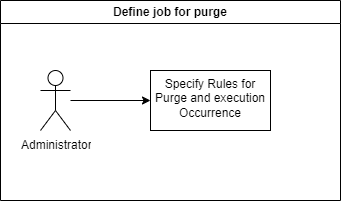{.img-zoomable}

    * Check right permissions for purge
    
    When send POST to create a purge task a check is done to verifiy is user initiating this action have the right permission of this kind of task.
    Only user with admin role can execute purge.

    [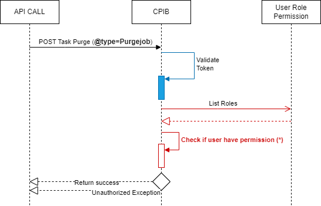](../img/purge-authorisation.png){.img-zoomable}

    * Purge execution flow details

    [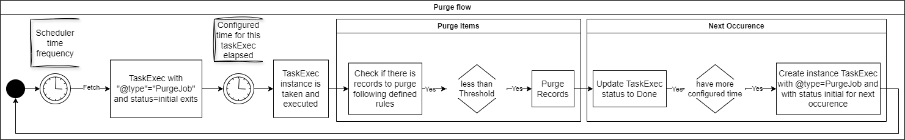{ width=100%; }](../img/purge-flow.png)

??? abstract "TerminationJobSPecification"

    Some products purchased by customers have an expiration date, requiring a specific module to terminate these products once they expire. 

    The `TerminationJob` entities, which are associated with the default `TerminationJobSpecification` created by the system, are recurring jobs that execute by default according to the scheduler's frequency configured in the system. 

    The Administrator can monitor the execution of these jobs through the AdminUI frontend. 
    Additionally, the Administrator has the ability to schedule TerminationJobSpecification jobs as one-time or immediate tasks via the AdminUI.
    
    Each time the scheduler's frequency or planned date of job is reached, the `TerminationJob` retrieves products having ValidityCharacteristic set and checks if the termination date has been reached. If so, it updates their status to `Terminated`.

### Report Business Rules

The reporting module for Product Inventory is designed to streamline the generation of comprehensive reports related to the products. These reports offer valuable insights into the status and distribution of installed products.

!!! Info "Report by Product Status"

    * Purpose: This report categorizes products based on their current status.
    
    * Functionality: This feature provides a comprehensive overview of the quantity of products categorized by their current status (e.g., Active, Terminated, Sold, etc). It enables you to clearly understand how many products fall into each status category, facilitating informed decision-making for effective product administration.

!!! Info "Report by Product Offering"

    * Purpose: This report analyzes product offerings in relation to customer preferences.
    
    * Functionality: It displays the distribution of currently instantiated products based on their offers and status. This report highlights the most frequently purchased offers by customers for a specific day or period, aiding in understanding market trends and customer behavior.

#### Report Generation

To generate a report, follow these steps:

1. Log in to the product inventory admin UI front end,
2. Navigate to the "Reporting" section from the dashboard,
3. Select the desired report type (e.g., Daily Reporting or Periodic Reporting),
4. Apply any necessary filters (report type, date range, product status, etc.),
5. Click "Generate Report",
6. View the generated report on the screen.

#### Filtering Data

Reports can be customized by applying filters. Common filters include:

- Report type: Select type of report to generate
- Date Range: Select a custom start and end date.
- Product offering: Choose specific offer to narrow down the data.
- Product status: Filter by specific product status.
- Product offering type: Select specific offer type.

## Entity Lifecycles

### Product Lifecycle

For Product entities, two state types will be used for both types of product related to product offering and to product specification :

- The first one to track the **main state** of the product such `Created`, `Active`, `Sold`, `Cancelled`, `Aborted` and `Terminated`.
- A second status to track the detailed **operational state** of the product such `Confirmed`, `PendingActive`, `PendingCancel`, `PendingModifcation`, `PendingTerminate`, `Sold`, `Active`, `Terminated`.

#### Main State

Based on TMF specifications, the status definitions are below:

| Product status | Definition      |
| :---           | :---            |
| `Created` | A new product has been created but not yet activated |
| `Aborted` | The product activation has been stopped by abnormal condition. There is probably an unexpected delivery issue |
| `Cancelled` | The product activation has been cancelled – it could come from customer or provider |
| `Active` | The product is live and running |
| `Terminated` | The product is not anymore active |

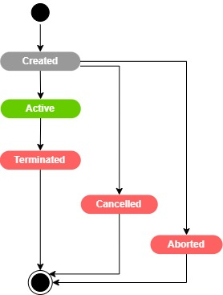{.img-zoomable}

#### Operational State

For the second type, the operational state, rather than the state specified by TMF, we will introduce some additional details to be able to describe the real impact of each transition at order level that may impact the associated Products elements:

| Product Operational status | Definition |
| :---                       | :---       |
| `Confirmed` | To be able to tag the Product that has been validated by Operator and Customer and ready to be delivered. Note that, at this step, we consider that the offer has been reviewed by the operator and it’s commercially, functionally and technically feasible. |
| `PendingActive` | The product is in activation phase. Not yet active but it is in progress |
| `Locked` | To tag any `Active` product facing, during the delivery, a technical delivery issues that may be resolved. |
| `LockedActive` | To tag any product facing, during the delivery, a technical delivery issues that may be resolved. |
| `PendingCancel` | To illustrate the case that the cancellation operation takes time to come to an end and the customer must have visibility at the PI level about the cancellation. |
| `PendingModification` | For Active Product during the treatment of an order delivery when it comes to a configuration change. |
| `PendingMigrate` | For Active Product during the treatment of an order delivery when it comes to migration. |

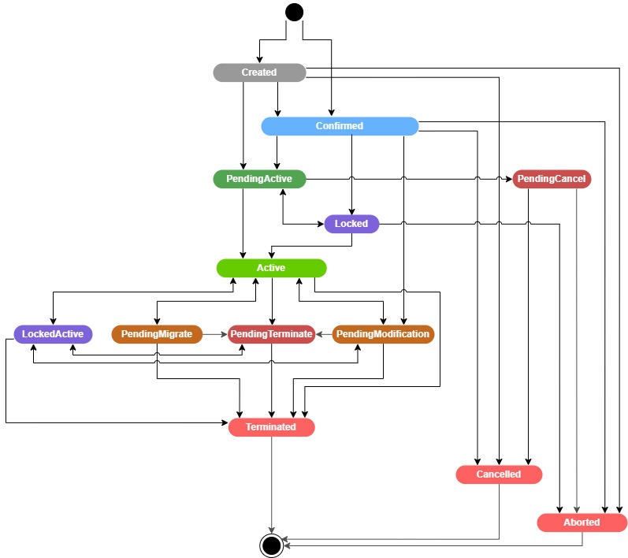{.img-zoomable}

#### Product Status & Operational Status Transitions Rules

The Product entity is instantiated with:

- Either `Created` operational status, if the instantiation is expected simultaneously when the end-user selects an offer and adds it in his Order with the default offer configuration,
- Or `Confirmed` operational status at the end of Order Completion as soon as a ProductOrderitem is confirmed by operator.

For the first option, the Product moves from `Created` to `Confirmed` once the order is validated by the Operator at the end of Order Capture.

???+ info "DISCOBOLE Implementation Choice"
    In DISCOBOLE project, the product is created in Product inventory when the order is validated by the operator, at the end of the order capture process.

    In this case, the Product is instantiated with the `Confirmed` operational status and `Created` status.

The Product order can be cancelled before its delivery start, so both Product statuses will be set to `Cancelled`.

Then, once the delivery is launched, so the Product operational status is set to `pendingActive` status.

- Even if the delivery is launched, it’s possible to cancel an Order. If it happens:
  - Either the Cancellation is immediate; Product status is set to `Cancelled`, product Operational status is set to PendingCancel then to Canceled.
  - Or the cancellation takes time to effectively cancel the order, so the Product operational status passes to `PendingCancel`, the status of the product remains unchanged e.g. `Created`, till the end of the cancellation process at that time the both Product statuses move to `Cancelled`

- If the product activation has been stopped by abnormal condition, like an unexpected delivery issue that can be solved, the Product operational status passes to `Locked`.

- As soon as the issue is solved, the ProductOrder item resumes the status `InProgress` and the Product the operational status
`PendingActive`.
PS: The status of the Product remains unchanged at `Created` status.

- If the issue cannot be solved, the ProductOrder item passes to `Failed` status and the Product, associated to ProductSpecification, to the status `Aborted` for both main and operational statuses. This is a final status.

- If the product activation has been stopped by abnormal condition that cannot be solved, the Product passes in `Aborted` (e.g. both statuses).

- Once the activation is completed successfully, the product is set to `Active`, for both status types: the Product status and the product operational status.

From the `Active` operational status, the Product can be set at `InDisturbance` status if customer cannot use the product for technical reasons.

If a Product Order for a modification is launched under an `Active` Product, the operational status of this one passes to `PendingModification` status during modification process running. Once finished successfully, the Product resumes the `Active` operational status.
PS: The status, during the modification process, kept the `Active` status.

If a Product Order for a a migration is launched under an `Active` Product, the operational status of this one passes to `PendingMigrate` status during migration process running. Once finished successfully, the Product resumes the `Active` operational status.
PS: The status, during the migration process, kept the `Active` status.

If a Product Order for a termination is requested, as soon as it’s validated and launched the Product, at `Active` status, have to be set:

- Either at `Terminated` status for both status types if the termination is immediate
- Or at `PendingTerminate` operational status till the process finish its work, at this time the Product moves to `Terminated` status.

In conclusion:

- According to the order progress, the Product OperationalStatus can move to `PendingActive`, `PendingCancel` or `Locked` without changing its status that must be in `Created` status.

- According to either the operation or the changes that can impact the Product, the Product OperationalStatus can move to `InDisturbance`, `PendingModification`, `PendingMigrate`, `LockedActive` or `PendingTerminate` without changing its status that must be in `Active` status.

- If the status moves to `Cancelled`, `Aborted`, `Terminated` or `Active`, the operationalStatus must take the same value.

#### Mapping Between Both States

The table below illustrates a sum-up mapping between both state types.

| Product Main state | Product Operational state | Notes |
| :---                | :---                      | :---   |
|`Created` | `Created` | The product instance has been created but not yet validated by the Operator |
|        | `Confirmed` | Product that has been validated by Operator and Customer and ready to be delivered. |
|  | `PendingActive` | The product is in activation phase. Not yet active but it is in progress |
|  | `PendingCancel` | The product activation has been cancelled but the cancellation operation takes time to come to an end |
|  | `Locked` | When a technical delivery issues that may be resolved has occurred during delivery. |
| `Cancelled` | `Cancelled` | The product activation has been cancelled – it could come from customer or provider. |
| `Aborted` | `Aborted` | The product activation has been stopped by abnormal condition. There is probably an unexpected delivery issue. Or resolution delay of the technical issue of Product in “Locked” state is exceeded. |
| `Active` | `Active` | The product is live and running |
| | `InDisturbance` | Technical issue locking the normal use (exploitation) of the product. |
|  | `PendingModification` | Starting Order Delivery of a modification Order |
|  | `PendingMigrate` | Starting Order Delivery of a migration Order |
|    | `LockedActive` | When a technical delivery issues that may be resolved is occurred during delivery. |
|  | `Pending Terminate` |The product is still active, but a termination process is in progress. It will soon be terminated.|
|`Terminated` | `Terminated` | The product is not anymore active. |

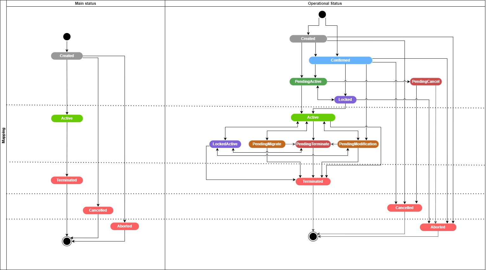{.img-zoomable}

### Tangible Product Lifecycle

A Tangible Product is a subtype of a product that represent a PhysicalProduct such as a phone/headset etc, or ShipmentProduct that represent a delivery and/or a delivery fee.
New status `Sold` and operational status "Sold" are introduced for tangible products. When the type a product is either `PhysicalProduct` or `ShipmentProduct`, status and operational status follow other lifecycle with dedicated mapping.

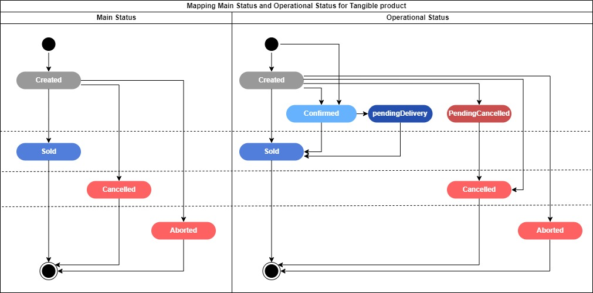{.img-zoomable}

### JobSpecification Lifecycle

When the schedule is `OneTimeJobScheduler` or `ImmediateJobScheduler`, the `JobSpecification` entity switches to status `Active` when related Job instance is actually launched, which may be delayed by up to 1 minute depending on the cron job.

When the schedule is `RecurringJobScheduler`, the `JobSpecification` entity switches to status `Active` when `scheduledPeriod.startDateTime` occurs.

### Job Lifecycle

The first job instance is created on the `JobSpecification` creation with status `notStarted`.

When the planned date occurs Job pass to status `running`.

Running job pass to status `succeeded` once completed without errors, else job passes to status `failed`.

For still `Active` `JobSpecification` with schedule type `RecurringJobScheduler`, a new job instance is created after the last job instance is completed.

## Source Code Organization

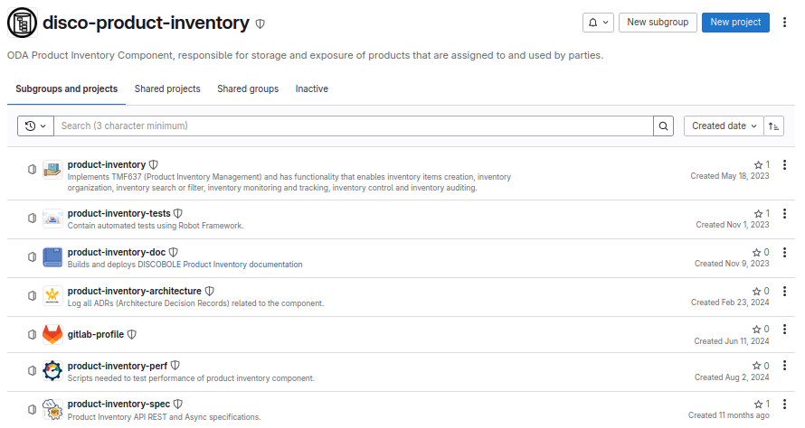{.img-zoomable}
