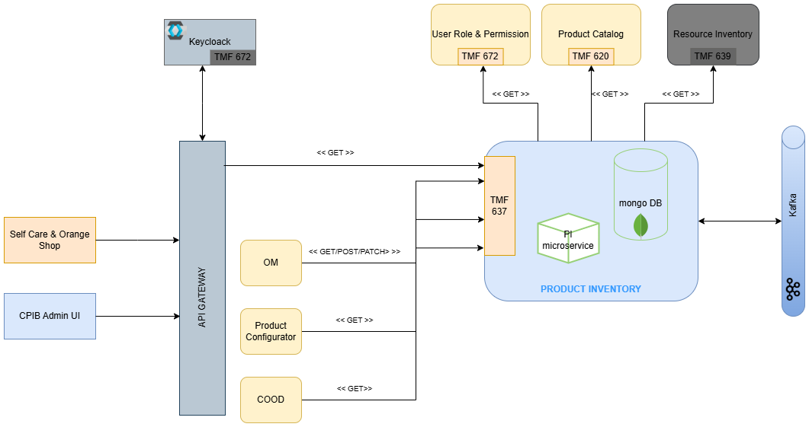

# Deploy Your Own Product Inventory Instance

!!! abstract "decide where and how to build and deploy"
    - Manually (for local development)
      1. Build java services on your workstation
      1. Optionally deploy databases (mariadb, redis), by default the microservices run in-memory databases
      1. Run java services on a JVM on your workstation
      1. Build and run web front-end on your workstation
    - Deploy manually on a local or remote kubernetes cluser using Helm
    - Automatically via CI/CD on a remote kubernetes cluster

## Manually

To deploy Product Inventory manually, you will have to deploy each component of Product Inventory:

- `Product Inventory` ODA component:
  - `product-inventory`: product inventory management

??? info "Product Inventory components"
    

<!-- ??? info "global prerequisites"
    Work in progress
    - JDK -->

??? note "a. build java services on your workstation"
    in this order, follow instructions of each component readme.md
    - `product-inventory`: [readme.md](../architecture/detailed-architecture/product-inventory.md)

??? note "b. deploy databases (mariadb)"
    <!-- this step is optional, as by default for development purpose, the microservices use in-memory database instances. -->

??? note "c. run on a local JVM or deploy on a kubernetes cluster"
    follow instructions of each component readme.md

??? info "other options?"
    the following options do not exist yet, but Prodcut inventory could work on it if there is a demand:

    - Visual Studio Code [remote-container](https://code.visualstudio.com/docs/remote/containers)
    - local docker deployment
    - all-in-one script
    - ...

## Deploy Manually Using Helm

Please refer to the [DISCOBOLE Deployment Guide over GKE](https://discobole.ow2.io/doc/deployments/release-r9/deployment/) for installation and configuration details of this component.

## Automatically Via CI/CD

To build and deploy the Product Inventory components automatically via CI/CD, you will need to fork the respective GitLab repository and configure the CI pipelines accodingly.
Details for configuration are being given in the `README.md` file for each repository.

Altenatively, you may fork the respective inventory repository and adjust the CI variables and custom values to match your target deployment. This is a way of deploying in a CI/CD manner.
