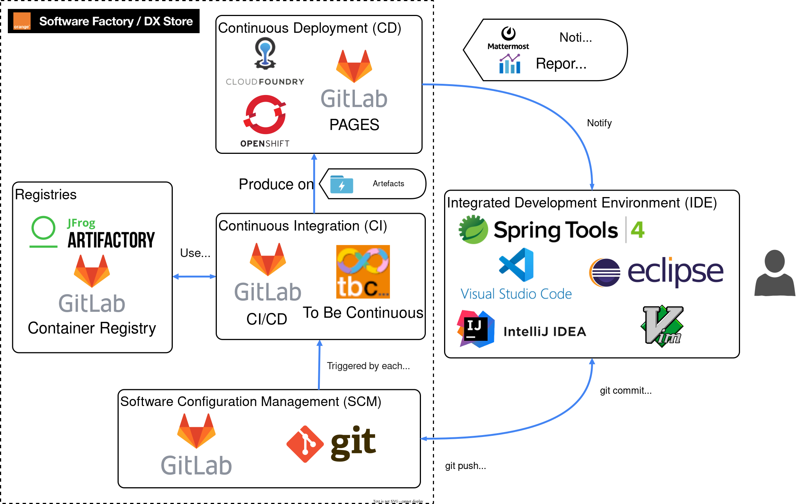

# Development Ecosystem

???+ info "Components"
    - __GitLab__: source code repository
    - __GitLab CI__: continuous integration and continuous deployment
    - __GitLab Pages__ : GitLab integrated http hosting for html pages
    - __tbc...__: to be continuous templates
    - __DIOD Openshift__ & __Rancher Kubernetes__: deployment platform
    - __Artifactory__: project's common artifact repository and external artifact proxy
    - __GitLab Container Registry__: Docker registry for internal project usage
    - __Mattermost__: human and bot communication channel

## Canvas Functions

???+ info "Components"
    - __TMF620__: Provides a standardized solution for rapidly adding partners products to an existing Catalog. It brings the capability for Service Providers to directly feed partners systems with the technical description of the products they propose to them.
    - __Kafka__: Kafka is a distributed data store optimized for ingesting and processing streaming data in real-time.
    - __Keycloak__ : Keycloak is an open-source software solution designed to provide single sign-on access to applications and services.
    - __Jaeger__: Jaeger is software that you can use to monitor and troubleshoot problems on interconnected software components called microservices.
    - __Prometheus__: It's an open-source system for monitoring services and alerts based on a time series data model.
    - __Grafana__: Grafana is an open-source platform for data visualization, monitoring and analysis.