

# Administration

The **Administration** section facilitates the management of well-defined task types that run automatically in the background according to a predetermined schedule. These tasks can be executed once, triggered immediately, or set to recur at specific intervals.

Tasks of Job entities are specified by Job Specification entities. In other terms, Job entities are the instantiation of Job Specification entities.

There are different kinds of Job Specification according to the nature of the jobs to execute:

- **`ExportJobSpecification`**: specify jobs to export products in `CVS` or `JSON` format from the product inventory into a file
- **`ImportJobSpecification`**: specify jobs import products in the product inventory
- **`PurgeJobSpecification`**: specify jobs to purge products when their status is either `Aborted`, `Cancelled`, or `Terminated`
- **`TerminationJobSpecification`**: specify jobs to terminate products when their termination date is earlier than the execution date.

Job Specification concerns jobs that are performed either:

- immediatly
- one-time (a planned date is required),  or
- recurrently (a period and frequency are required)

To manage both **Job Specification** and **Job** entities, this administration is organized into two main screens:

- **Job Specification View** — Create, monitor, and manage Job Specifications
- **Job View** — Monitor and execute of job specifications

## Job Specification View

The **Administration > Job Specifications** screen allows administrators to:

- create new job specifications,
- monitor existing ones,
- view details (schedule, query, fields, status history) and
- navigate to related jobs.

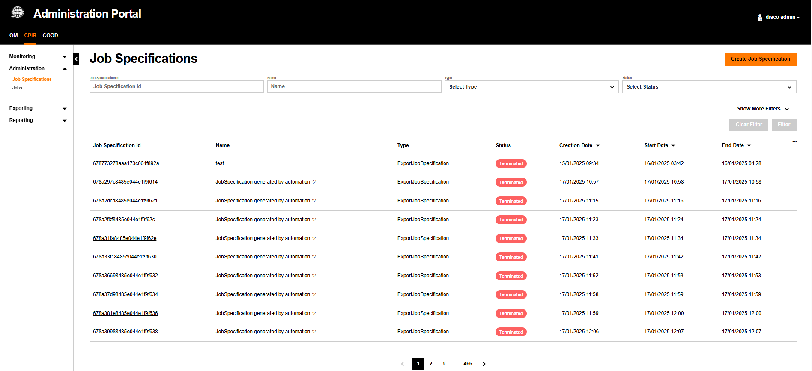{.img-zoomable}

### Filter View

The listed entities can be filtered by two modes:

- the **compact mode** - this mode is the **default** mode, showing entities based on the most-used filters, and
- the **expanded mode** - this mode reveals all available filters.

By default, the entities are filtered in the only the top filters are visible.

To show all available filters, click on 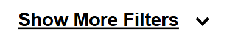{width="200"}.

To go back to the most-used filters, click on {width="200"}.

#### Compact Mode

Here are the always-visible filters which are frequently used to list a shorted list of entities.

| Filter | Type | Description |
| :----- | :----| :---------- |
| Job Specification Id | Text | Filter by the unique job specification identifier |
| Name | Text | Filter by the job specification name |
| `Type` | Dropdown | Filter by job specification type (`ExportJobSpecification`,`ImportJobSpecification`, `PurgeJobSpecification` and `TerminationJobSpecification`) |
| `Status` | Dropdown | Filter by the status of the job specification |

#### Expanded Moded

In addition of the most-used filters, here is the whole list of filters that can be used to have a shorted list of entities.

| Filter | Type | Description |
| :----- | :--- | :---------- |
| `Job Specification Id` | Text | Search by unique identifier |
| `Name` | Text | Search by name |
| `Type` | Dropdown | `ImportJobSpecification`, `ExportJobSpecification`, `PurgeJobSpecification`, `TerminationJobSpecification` |
| `Status` | Dropdown | `Created`, `Active`, `Suspended`, `Terminated` |
| `Creation Date` | Date range | Filter by creation date |
| `Start Date` | Date range | Filter by start date |
| `End Date` | Date range | Filter by end date |

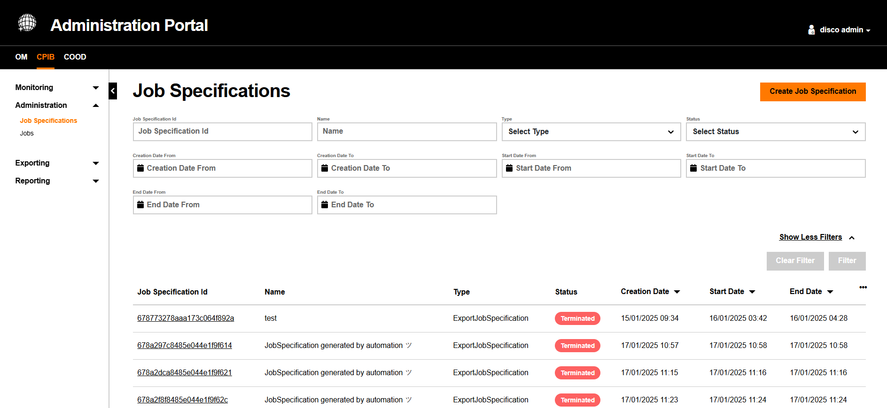{.img-zoomable}

### Table View

The Job Specification table displays entities matching the filter if any. Each row shows key Job Specification data and links to the full Job Specification detail view.

#### Table Columns

| Column | Description |
| :----- | :---------- |
| `Job Specification Id` | Clickable link to the job specification details screen |
| `Name` | Name of the job specification |
| `Type` | The type of job specification |
| `Status` | Current status displayed as a badge: Created Active Suspended Terminated |
| `Creation Date` | Date when the specification was created |
| `Start Date` | Date when the specification becomes effective |
| `End Date` | Date when the specification expires |

#### Managing Visible Columns

The table columns are configurable. Click the `⋯` icon at the top right of the table header to open the column visibility panel.

#### Pagination

Results are paginated. The pagination control appears at the bottom of the results table.

### Details View

Upon clicking on a `Job Specification Id` in the table view, the administrator accesses the full **job specification details** screen.

The administrator can also:

- **Create Job Specification** — opens the creation screen
- **View related jobs** — navigates to the Jobs monitoring screen showinng the job entities created from this JobSpecification entity

#### General Details

All these fields are shared by all types of Job Specifications.

| Field | Description |
| :--- | :--- |
| `Id` | Unique identifier |
| `Name` | Name of the job specification |
| `Status` | Current state: Created Active Suspended Terminated |
| `Creation Date` | When the specification was created |
| `Start Date` | Commencement date |
| `End Date` | Expiry date |
| `Type` | Type of job specification (`ImportJobSpecification`, `ExportJobSpecification`, `PurgeJobSpecification`, `TerminationJobSpecification`)|

#### Schedule Details

All Job Specification kinds need a schedule specification to decide when jobs created from Job Specifications will be executed.

| Field | Description |
| :--- | :--- |
| `Type` | Scheduling mode: `Recurring`, `One-time`, `Immediate` |
| `Planned Date` | For One-time jobs: scheduled execution date |
| `Start Date / End Date` | For Recurring jobs: validity period |
| `Execution Time` | Time of day when the job runs |
| `Frequency Amount & Time Period` | Repeat interval (e.g., 3 Months, 1 Hour) |

#### `ExportJobSpecification` Details

Displays **Content Type** (`JSON` or `CSV`) and a **Query & Fields** section showing the applied filters and selected data fields.

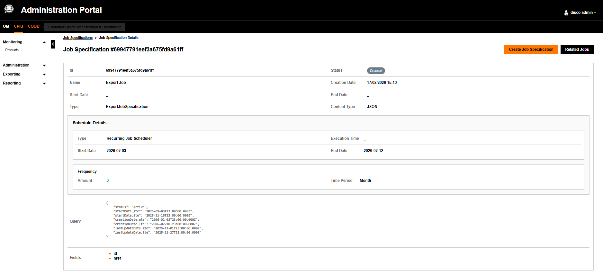{.img-zoomable}

#### `ImportJobSpecification` Details

Displays **Content Type** (`JSON` or `CSV`). Does not display Query or Fields sections.

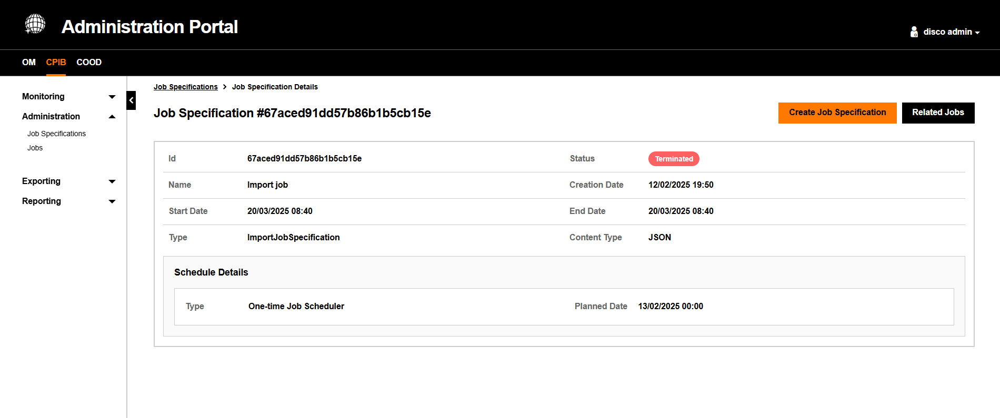{.img-zoomable}

#### `PurgeJobSpecification` Details

Displays **Purge Type** (`PurgeProduct` or `PurgeJob`) and a **Query** section with the targeted filters. No Fields section.

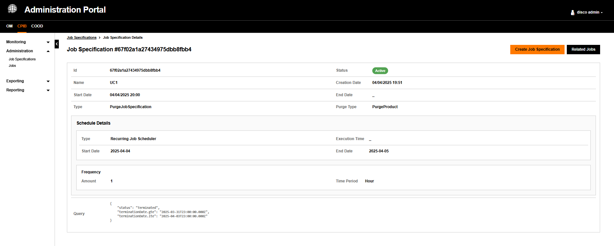{.img-zoomable}

#### `TerminationJobSpecification` Details

Displays only core metadata and Schedule Details. No Content Type, Purge Type, Query, or Fields sections.

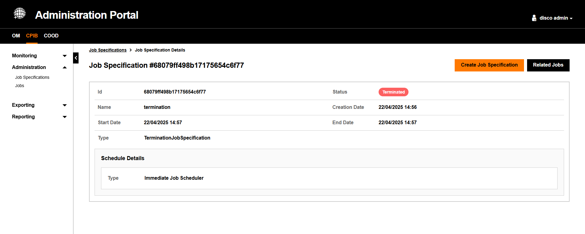{.img-zoomable}

When clicking **Related Jobs**, the portal navigates to the Jobs monitoring screen with the Job Specification Id filter pre-filled.

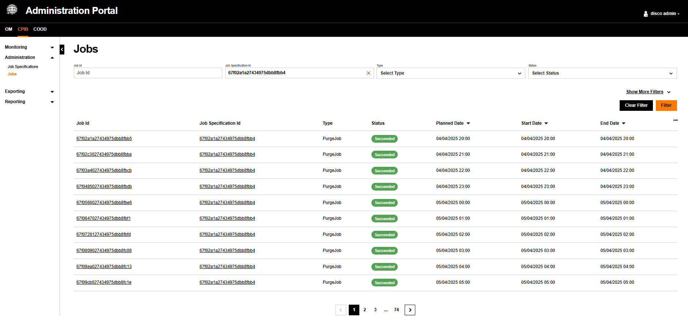{.img-zoomable}

### Creation View

This page allows administrators to define all parameters for a new job specification: type, timing, filters, content type, and specific fields.

!!! info "Timezone Notice"
    Selected dates and times are displayed in your local time zone but will be saved in UTC.

Here is a typical screen to create a JobSpecification entity.

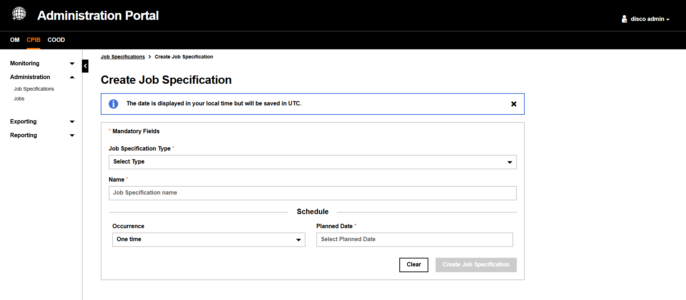{.img-zoomable}

#### Schedule Options

JobSpecification entity required schedule options to decide the moment of the execution of jobs derived from JobSpecification entities.

| Option | Description |
| :----- | :---------- |
| `One time` *(default)* | Runs once at a specific date and time. Requires a `Planned Date` |
| `Recurring` | Runs repeatedly. Configure: `Repeat every` (number), `Interval` (Day/Week/Month/Year), `Repeat From`, `End Date`, `Execution Time` |
| `Immediate` | Triggers the job immediately upon creation |

#### Import Job Specification Creation

| Field | Description |
| :--- | :--- |
| `Job Specification Type` | Dropdown to select the type |
| `Name` | Name of the job specification |
| `Content Type` | `JSON` or `CSV` |
| `Import Type` | `Insert` (add/override) or `Merge` (update existing) |
| `Check Catalog` | Fixed to `False` (not yet supported) |
| `Upload Import File` | Opens a file browser to upload the import file |

##### Example

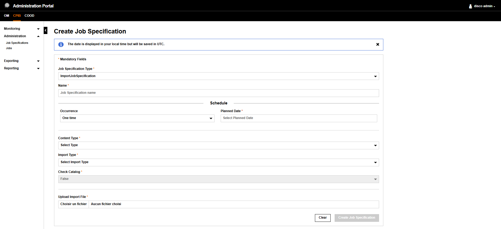{.img-zoomable}

#### Export Job Specification Creation

| Field | Description |
| :--- | :--- |
| `Job Specification Type` | Dropdown to select the type |
| `Name` | Name of the job specification |
| `Product Status` | Multi-select: Created, Active, Terminated |
| `Related Party ID` | Filter by party |
| `Date ranges` | Product Start Date, Creation Date, Last Update Date |
| `Content Type` | `CSV` or `JSON` |
| `Fields` | Select specific data fields to include |

##### Example

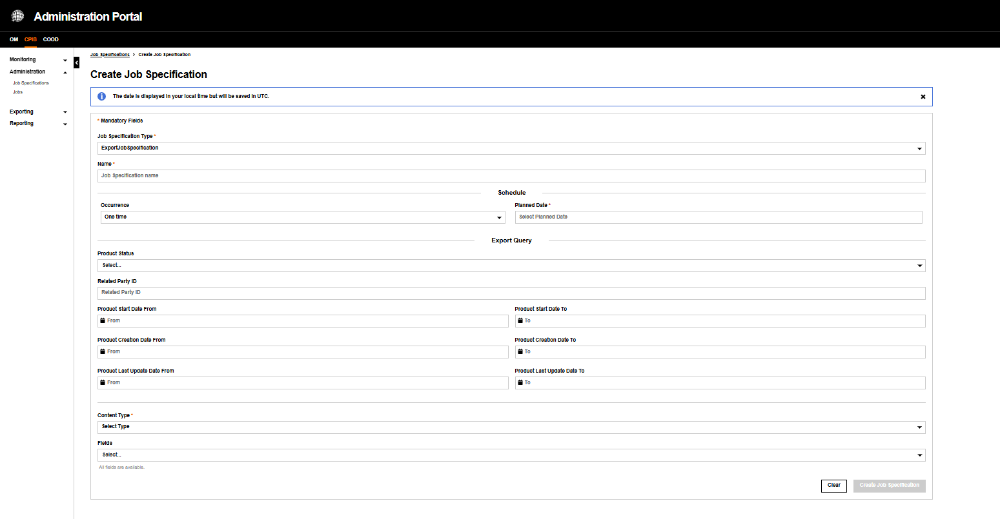{.img-zoomable}

#### Purge Job Specification Creation

The purge requires the selection of the purge type because it may concern either Job entities or Product entities.

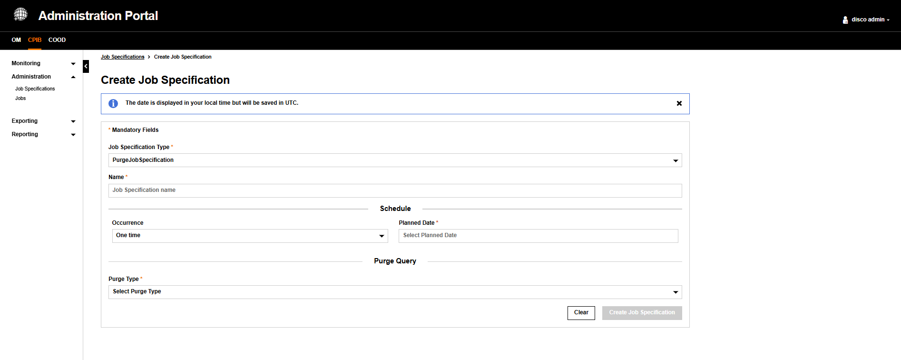{.img-zoomable}

- When `Purge Type: Purge Job` is selected, only terminated jobs can be purged. Filter by End Date range.

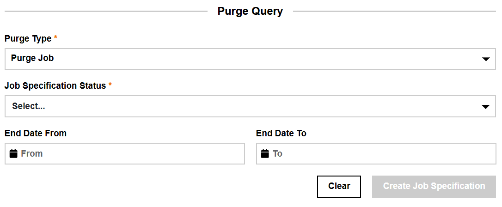{width="800" .img-zoomable}

- When `Purge Type: Purge Product` is selected, only products with status `Aborted`, `Cancelled`, or `Terminated` can be purged. Filter by Termination Date range.

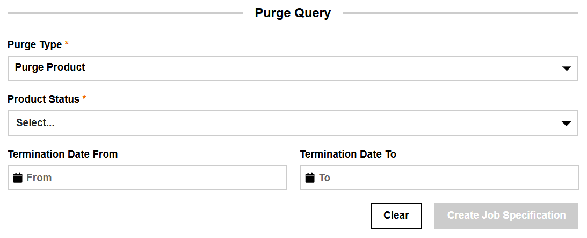{width="800" .img-zoomable}

#### Termination Job Specification Creation

This job updates the status of active products to `Terminated` when their termination date is earlier than the execution date.

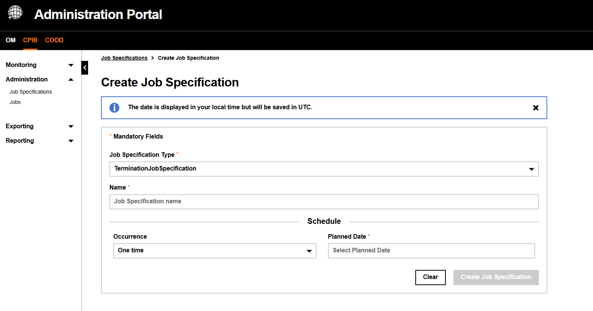{.img-zoomable}

#### Action Buttons

| Button  | Description |
| :------ | :---------- |
| `Clear` | Resets all form fields |
| `Create Job Specification` | Submits the form. Disabled (greyed out) until all required fields are filled |

Once successfully created, a success popup appears with a direct link to the new Job Specification's Details screen.

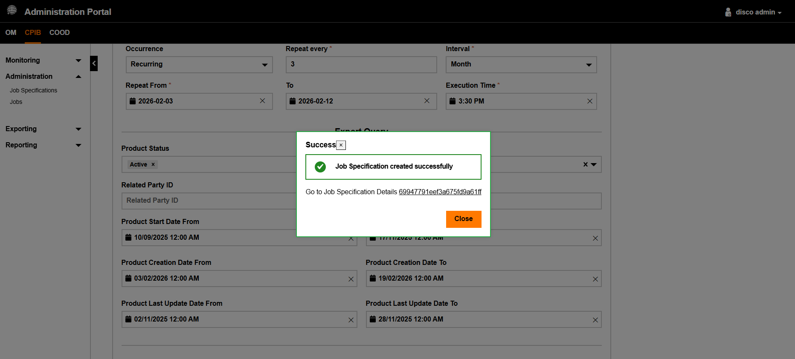{.img-zoomable}

## Job View

The **Administration > Job** screen allows allows administrators to:

- create new job from **JobSpecification** entities,
- monitor existing ones,
- view details (schedule, query, fields, status history).

Jobs are configured via **JobSpecification** entities. Each Job entity references a single parent JobSpecification entity. Once a JobSpecification is created, the initial job instance is automatically generated.

Also there are different kinds of Job as it is created from different types of Job Specification

- **`ExportJob`**: export Product entities
- **`ImportJob`**: import Product entities
- **`PurgeJob`**: purge either terminated Job entities or Product entities when their status is either `Aborted`, `Cancelled`, or `Terminated`
- **`TerminationJob`**: terminate Job entities when their termination date is earlier than the execution date

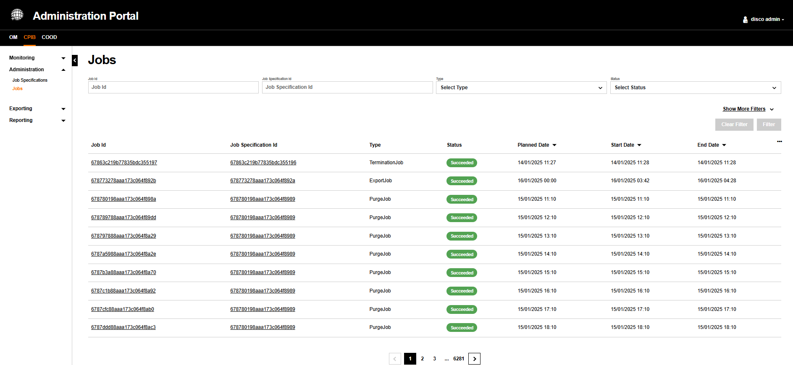{.img-zoomable}

### Filter View

The listed entities can be filtered by two modes:

- the **compact mode** - this mode is the **default** mode, showing entities based on the most-used filters, and
- the **expanded mode** - this mode reveals all available filters.

By default, the entities are filtered in the only the top filters are visible.

To show all available filters, click on {width="200"}.

To go back to the most-used filters, click on {width="200"}.

#### Compact Mode

Here are the always-visible filters which are frequently used to list a shorted list of entities.

| Filter | Description |
| :----- | :---------- |
| `Job Id` | Unique identifier |
| `Job Specification Id` | Reference to the parent job specification |
| `Type` | Type of the job |
| `Status` | Dropdown to filter by `Not Started`, `Running`, `Succeeded`, `Failed` |

#### Expanded Mode

In addition of the most-used filters, here is the whole list of filters that can be used to have a shorted list of entities.

| Filter | Description |
| :----- | :---------- |
| `Job Id` | Unique identifier — clickable link to job detail view |
| `Type` | Type of the job |
| `Job Specification Id` | Links to the parent job specification details screen |
| `Status` | Current state displayed as a badge: Not Started Running Succeeded Failed |
| `Planned Date From` | When the job was scheduled to start running |
| `Planned Date To` | When the job was scheduled to end running |
| `Start Date From` | When execution actually began |
| `Start Date To` | When execution actually stoped |
| `End Date From` | When execution completed from |
| `End Date To` | When execution completed |

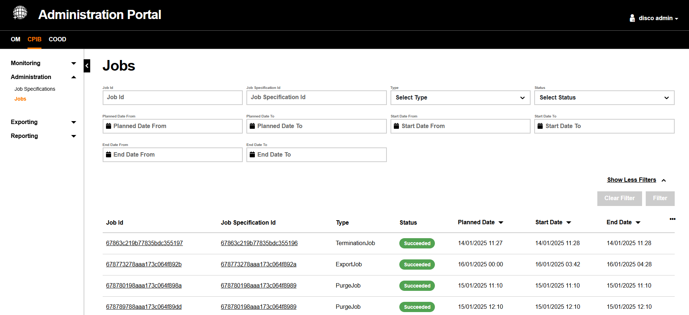{.img-zoomable}

### Table View

The Job table displays job executions matching the filter if any. Each row shows key Job  data and links to the full Job Specification detail view.

#### Table Columns

| Column | Description |
| :----- | :---------- |
| `Job Id` | Unique identifier — clickable link to job detail view |
| `Type` | Type of the job |
| `Job Specification Id` | Links to the parent job specification details screen |
| `Status` | Current state displayed as a badge: Not Started Running Succeeded Failed |
| `Planned Date` | When the job was scheduled to run |
| `Start Date` | When execution actually began |
| `End Date` | When execution completed |

### Job Details View

Upon clicking on a `Job Id` in the table view, the administrator accesses the full **job details** screen about a specific job execution.

#### General Details

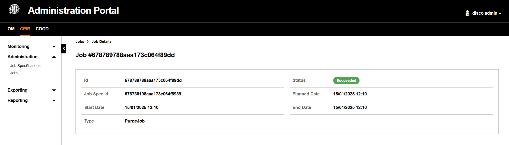{.img-zoomable}

#### `ExportJob` Details

For export jobs, the file name is displayed and an **Export File** button allows downloading the generated file.

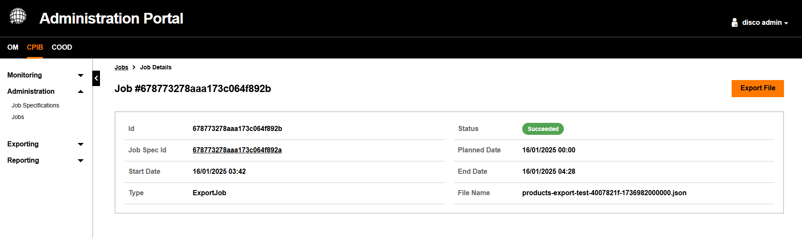{.img-zoomable}

#### `ImportJob` Details

For import jobs, the Job Overview section shows success and failure tabs detailing the products that were imported.

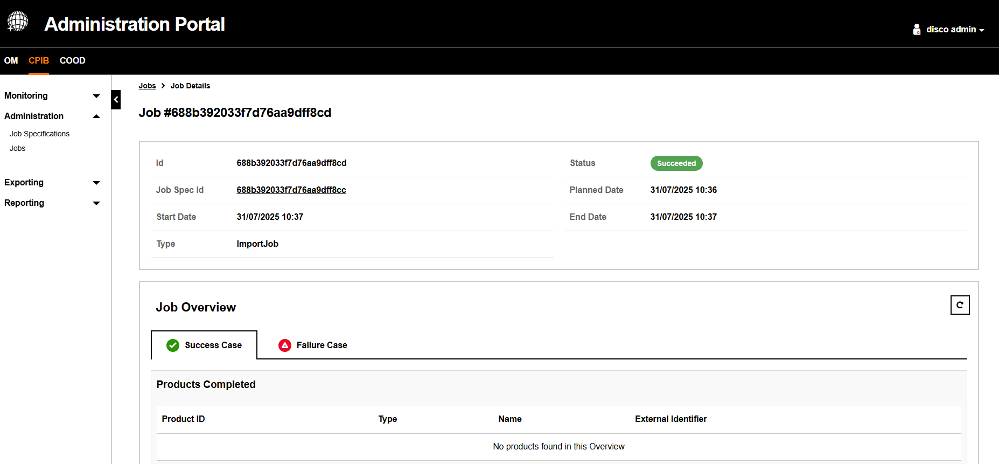{.img-zoomable}

#### `TerminationJob` Details

The Job Overview section shows success and failure tabs. Products are listed in a paginated table. The section can be collapsed using the icon in the top right.

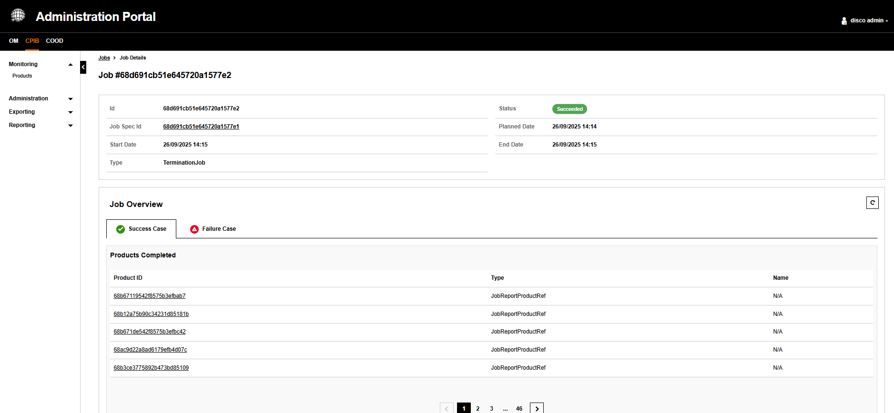{.img-zoomable}

#### Failed Job Details

When a job fails, the Error Log section displays the error date and detailed stack trace message.

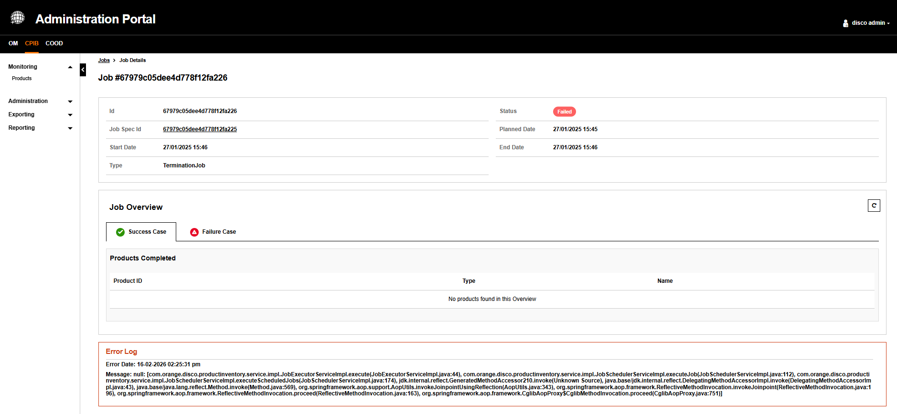{.img-zoomable}
