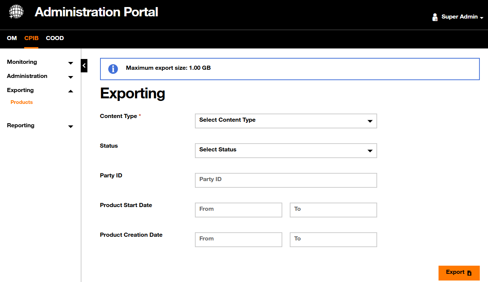

# Exporting Products

Through the **Exporting > Products** screen, the administrator is able to select and export products from the Product Inventory database.

{.img-zoomable}

The selection of products to export is based on the following criteria.

| Filter | Description |
| :----- | :---------- |
| `Content Type` | `json` to export products in `JSON` format — suitable for system integrations  `csv` to export products in `CSV` format — suitable for spreadsheet tools |
| `Status` | Select one status at a time: Created Active Cancelled Terminated Sold Aborted |
| `Party ID` | The end customer identifier |
| `Product Start Date` | Filter by start date within a timeframe |
| `Product Creation Date` | Filter by creation date within a timeframe |

!!! info "Exporting Products by Status"
    Only one `Status` value can be selected at a time. To export products of multiple statuses, run the export multiple times with different status selections.
