<style>
/* Synchronized Table Styling */

.badge {
  display: inline-block;
  padding: 1px 6px;
  border-radius: 10px;
  font-size: 0.75em;
  font-weight: bold;
  color: white;
  margin: 1px 1px;
  white-space: nowrap;
}
.badge-created             { background-color: #707C83; }
.badge-active              { background-color: #67CB67; }
.badge-cancelled           { background-color: #FD6161; }
.badge-terminated          { background-color: #FD6161; }
.badge-sold                { background-color: #527EDB; }
.badge-aborted             { background-color: #FD6161; }
.badge-pendingActive       { background-color: #52A352; }
.badge-pendingCancel       { background-color: #CB4E4E; }
.badge-pendingModification { background-color: #C2691F; }
.badge-pendingTerminate    { background-color: #CB4E4E; }
.badge-pendingMigrate      { background-color: #C2691F; }
.badge-pendingDelivery     { background-color: #244FAE; }
.badge-confirmed           { background-color: #62BFF9; }
.badge-locked              { background-color: #7E62D9; }
.badge-lockedActive        { background-color: #7E62D9; }
.badge-grey                { background-color: #9CA3AF; }

</style>

# Product Monitoring

The **Monitoring > Products** screen is the main entry point for administrators to search and browse all contract products stored in the Product Inventory (CPIB).

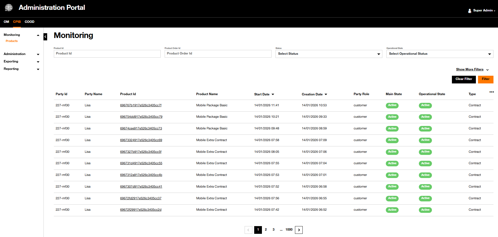{.img-zoomable}

It provides a powerful set of filters to narrow down results and a configurable product results table.

It gives also both the details of filtered products and the graphical view of product hierarchy.

## Filter View

The listed products can be filtered by two modes:

- the **compact mode** - this mode is the **default** mode, showing products based on the most-used filters, and
- the **expanded mode** - this mode reveals all available filters.

By default, the list of products are not filtered and the only the top filters are visible.

To show all available filters, click on {width="200"}.

To go back to the most-used filters, click on {width="200"}.

### Compact Mode

Here are the always-visible filters which are frequently used to list a shorter list of products.

| Filter | Type | Description |
| :----- | :----| :---------- |
| `Product Id` | Text | Filter by the unique product identifier |
| `Product Order Id` | Text | Filter by the order that created the product |
| `Status` | Dropdown | Filter by the commercial/main status of the product |
| `Operational Status` | Dropdown | Filter by the operational/delivery status of the product |

#### Status Filter

The `Status` field reflects the commercial lifecycle state of a product:

| Value | Color | Description |
| :---- | :---------- | :----------- |
| `Created` | <span class="badge badge-created">Created</span> | Product has been created but not yet activated |
| `Active` | <span class="badge badge-active">Active</span> | Product is currently active and delivering service |
| `Cancelled` | <span class="badge badge-cancelled">Cancelled</span> | Product order was cancelled before activation |
| `Terminated` | <span class="badge badge-terminated">Terminated</span> | Product service has been terminated |
| `Sold` | <span class="badge badge-sold">Sold</span> | Product has been commercially sold |
| `Aborted` | <span class="badge badge-aborted">Aborted</span> | Product was aborted during delivery |

#### Operational Status Filter

The `Operational Status` field reflects the technical/delivery state of a product. It provides finer-grained tracking during order execution.

| Value | Color | Description |
| :---- | :---------- | :---- |
| `Created` | <span class="badge badge-created">Created</span> | Technically instantiated, not yet processed |
| `Confirmed` | <span class="badge badge-confirmed">Confirmed</span> | Customer has confirmed the order |
| `Active` | <span class="badge badge-active">Active</span> | Product is operationally live |
| `Cancelled` | <span class="badge badge-cancelled">Cancelled</span> | Cancelled at operational level |
| `Aborted` | <span class="badge badge-aborted">Aborted</span> | Aborted during delivery |
| `Terminated` | <span class="badge badge-terminated">Terminated</span> | Operationally terminated |
| `Sold` | <span class="badge badge-sold">Sold</span> | Operationally sold |
| `InDisturbance` | <span class="badge badge-grey">InDisturbance</span> | Product is experiencing a service disturbance |
| `Locked` | <span class="badge badge-locked">Locked</span> | Product is locked (e.g., during an ongoing order) |
| `LockedActive` | <span class="badge badge-lockedActive">LockedActive</span> | Product is active but locked for modifications |
| `PendingActive` | <span class="badge badge-pendingActive">PendingActive</span> | Waiting to transition to Active |
| `PendingCancel` | <span class="badge badge-pendingCancel">PendingCancel</span> | Waiting to transition to Cancelled |
| `PendingModification` | <span class="badge badge-pendingModification">PendingModification</span> | Modification is in progress |
| `PendingTerminate` | <span class="badge badge-pendingTerminate">PendingTerminate</span> | Waiting to transition to Terminated |
| `PendingMigrate` | <span class="badge badge-pendingMigrate">PendingMigrate</span> | Source contract locked during a migration order |
| `PendingDelivery` | <span class="badge badge-pendingDelivery">PendingDelivery</span> | Waiting for delivery to complete |

### Expanded Mode

In addition of the most-used filters, here is the whole list of filters that can be used to have a shorter list of products.

| Filter | Type | Description |
| :----- | :---------- | :---------- |
| `Product Order Item Id` | Text | Filter by a specific order item identifier |
| `Party Id` | Text | Filter by the end customer's party identifier |
| `Start Date From / To` | Date range | Filter products whose start date falls within this range |
| `Product Offering Id` | Text | Filter by the product offering identifier defined in the catalog |
| `Product Specification Id` | Text | Filter by the product specification identifier defined in the catalog |
| `Creation Date From` / To | Date range | Filter products created within this period |
| `Product Name` | Text | Filter by the product name (supports partial match) |
| `Party Name` | Text | Filter by the customer's party name |
| `Last Update Date From / To` | Date range | Filter products last modified within this range |
| `Product Offering Name` | Text | Filter using the offering name (supports `*` wildcard). Example: `FTTH*` returns all products whose offering name starts with "FTTH" |
| `Party Role` | Text | Filter by the party's role (e.g., `customer`) |
| `Termination Date From / To` | Date range | Filter products terminated within this period |
| `Product Offering Type` | Dropdown | Filter by the type of product offering (see values below) |
| `Product Specification Type` | Dropdown | Filter by the type of product specification (see values below) |
| `Order Date From / To` | Date range | Filter by the date the associated order was placed |
| `Is Root` | Boolean | Filter by whether the product is a root (contract-level) product or not |

#### `Product Offering` Type Filter

The `Product Offering Type` field filters products by the type of their associated product offering in the catalog.

| Value | Description |
| :---- | :---------- |
| `Contract` | Top-level contract product (root of the customer hierarchy). Use `Is Root = True` to show only contracts |
| `AtomicProductOffering` | Individual, indivisible product or service (e.g., Mobile Line, SIM Card) |
| `BundleProductOffering` | Product resulting from the instantiation of a Bundle Product Offering. A grouped offering containing multiple atomic products |

#### `Product Specification` Type Filter

The `Product Specification Type` field filters products by the type of their referenced product specification.

| Value | Description |
| :---- | :---------- |
| `ProductSpecificationRef` | Standard reference to a product specification in the catalog |

#### `Is Root` Filter

The `Is Root` filter is a boolean flag that determines whether a product is the **top-level contract product** (the root of a customer's hierarchy) or a sub-product within a contract.

!!! info "Tip"
    To view only customer contracts, set `Is Root = true` and optionally combine with `Product Offering Type = Contract`.

Set `Is Root = true` to show only root/contract-level products:

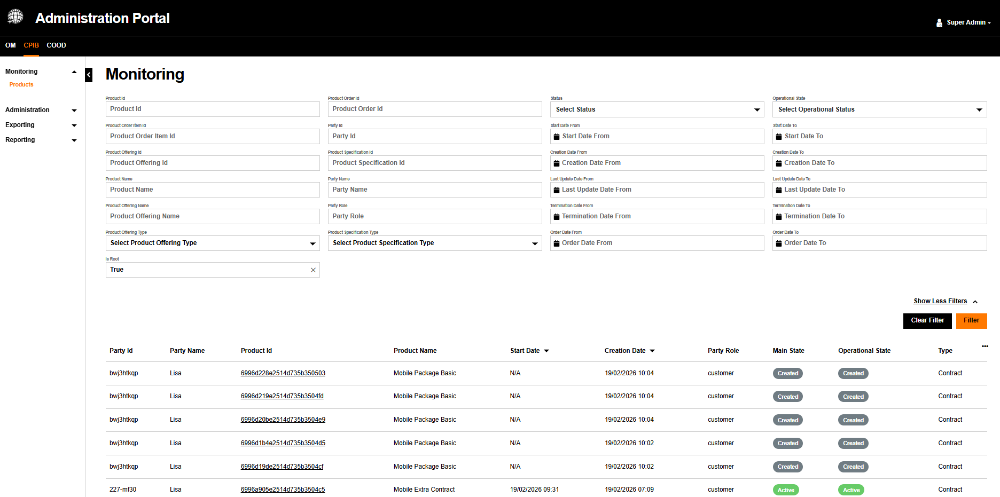{.img-zoomable}

Set `Is Root = false` to show products that result from instantiation of Bundle Product Offerings and Atomic Product Offerings:

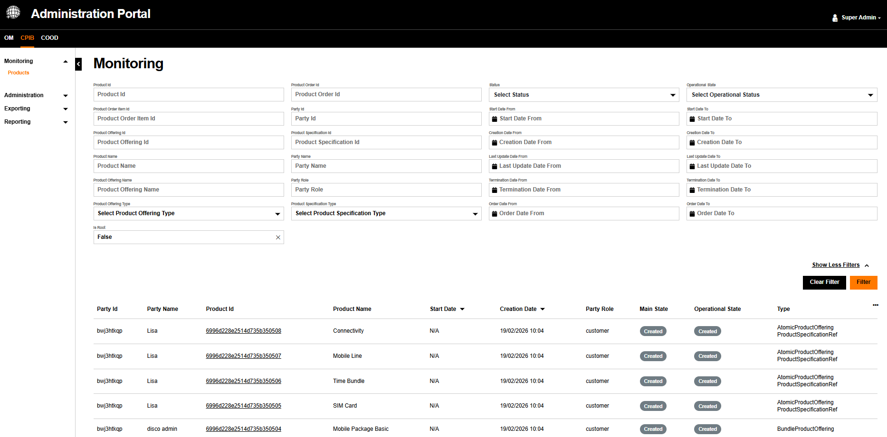{.img-zoomable}

## Applying Filter

Once at least one filter is filled, the {width="55"} button fetchs the products matching the filtering criteria.

The example below shows a search filtered by `Product Name` and `Is Root = True`, returning only active contracts:

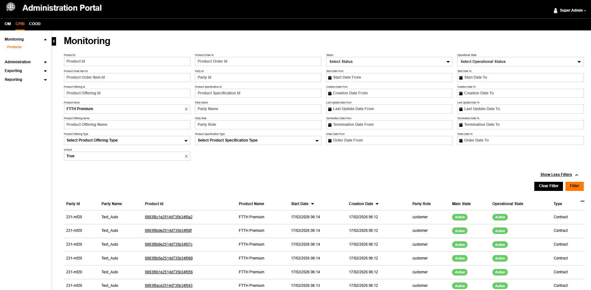{.img-zoomable}

## Clearing Filter

The 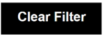{width="80"} button resets all filter fields to their default empty state and refreshes the table.

## Table View

The Product table displays products matching the filter if any. Each row shows key product data and links to the full product detail view.

### Table Columns

| Column | Description |
| :----- | :---------- |
| `Party Id` | The identifier of the customer party associated with the product |
| `Party Name` | The name of the customer |
| `Product Id` | Unique product identifier |
| `Product Name` | Name of the product |
| `Start Date` | The date on which the product service started. Sortable ▼ |
| `Creation Date` | The date the product was created in the system. Sortable ▼ |
| `Party Role` | The role of the party (e.g., `customer`) |
| `Main State` | The commercial status badge |
| `Operational State` | The operational/delivery status badge |
| `Type` | The product offering type (Contract, AtomicProductOffering, BundleProductOffering) |

### Managing Visible Columns

The table columns are configurable. Click the `⋯` icon at the top right of the table header to open the column visibility panel.

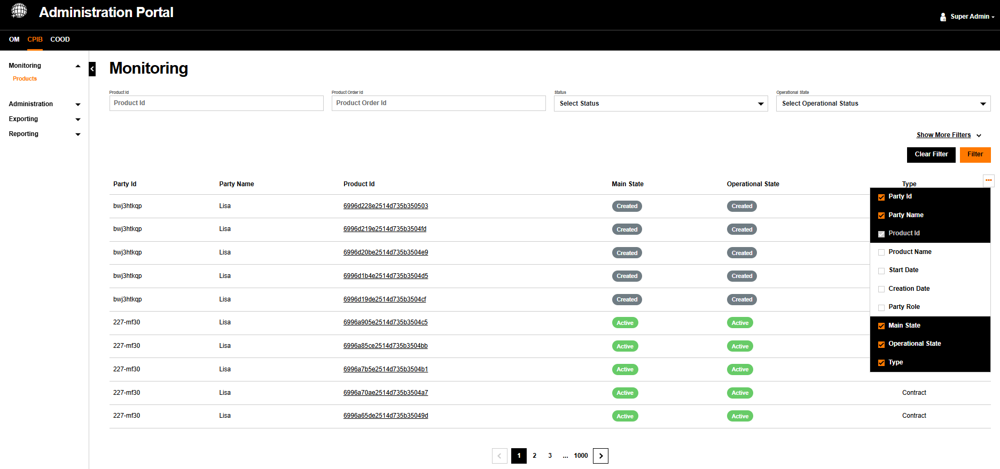{.img-zoomable}

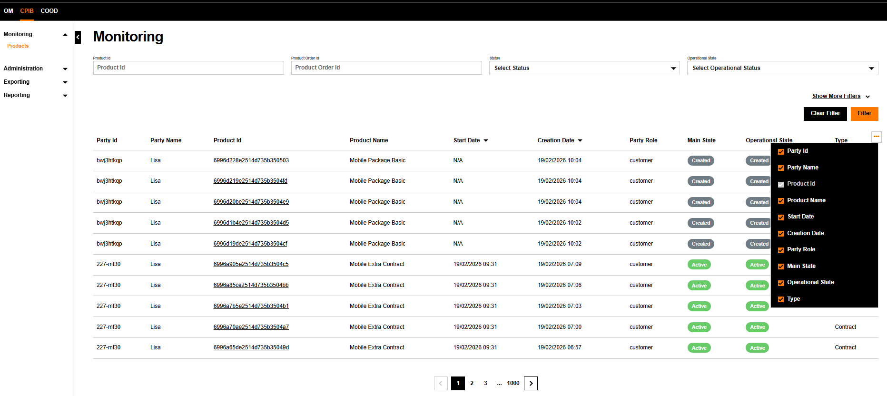{.img-zoomable}

Checked columns are visible in the table. Unchecked columns are hidden.

### Pagination

Results are paginated. The pagination control appears at the bottom of the results table.

**First page view:**

{.img-small}

**Navigation in the middle of results:**

{.img-small}

- Use `<` and `>` to navigate one page at a time.
- Click a specific page number to jump directly to it.
- `...` indicates skipped pages when the total count is large.

## Details View

Upon clicking on a `Product Id` in the monitoring view, the administrator accesses the full **product details** screen in the **details tab**.

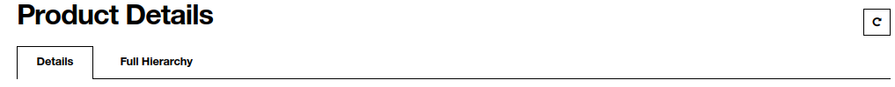{.img-zoomable}

A {width="32" .img-zoomable} reload button is available to dynamically refreshes the product data, ensuring the administrator always views the most up-to-date information without needing to manually refresh the entire browser page.

The **Details** tab that contains multiple collapsible sections is described below.

### General Details

The top section of the Details tab shows the core identity and lifecycle fields of the product.

| Field | Description |
| :---- | :---------- |
| `Id` | The unique identifier of the contract product in the CPIB system |
| `Name` | The human-readable name of the product (e.g., *FTTH Premium*) |
| `Type` | Internal object type — typically `Product` |
| `Description` | Optional free-text description of the product. Displays `–` if not defined |
| `Is Bundle` | Checkbox — checked if this product is a bundle containing sub-products |
| `Is Customer Visible` | Checkbox — checked if this product is visible by the end customer |
| `Status` | The commercial/main lifecycle status. Displayed as a color-coded badge: <span class="badge badge-active">Active</span> <span class="badge badge-created">Created</span> <span class="badge badge-terminated">Terminated</span> |
| `Operational Status` | The technical/delivery status. Can show special states like <span class="badge badge-pendingMigrate">PendingMigrate</span> during a migration |
| `Order Date` | The date the customer order was placed. Displays `–` if not available |
| `Creation Date` | The date this product record was created in the system |
| `Start Date` | The date on which the product service started |
| `Last Update Date` | The date this product was last modified |
| `Termination Date` | The date the product was or will be terminated. Displays `–` if the product is still active |

#### Example

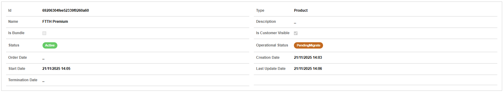{.img-zoomable}

### Product Offering

This section displays information about the product offering from the catalog that this product is based on.

!!! info "Tip"
    Depending on the product offer type that has been used to instantiate the product, this section may display only the **Product Offering**, or both the **Product Offering** and **Product Specification**.

#### Example — Contract product (Product Offering only)

The product offering for a contract product shows the top-level commercial offer. No Product Specification is attached at this level.

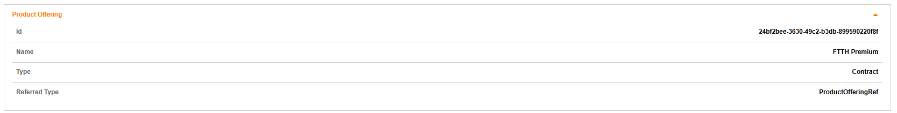{.img-zoomable}

#### Example — Atomic product (Product Offering + Product Specification)

For atomic products, both the product offering and its associated product specification are displayed.

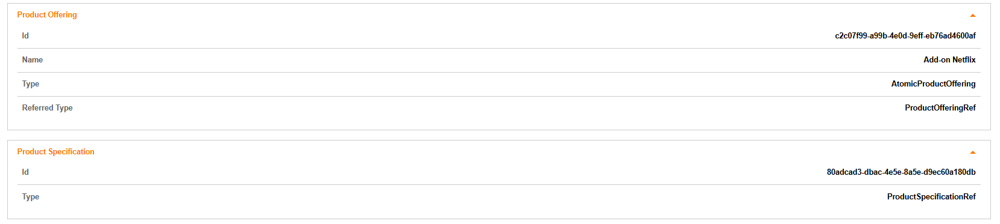{.img-zoomable}

#### Product Offering Fields

| Field | Description |
| :---- | :---------- |
| `Id` | Unique identifier of the product offering in the catalog |
| `Name` | Name of the offering (e.g., *FTTH Premium*, *Add-on Netflix*) |
| `Type` | Type of the offering: `Contract`, `AtomicProductOffering`, or `BundleProductOffering` |
| `Referred Type` | Always `ProductOfferingRef` — indicates this is a catalog reference |

#### Product Specification Fields

| Field | Description |
| :---- | :---------- |
| `Id` | Unique identifier of the product specification in the catalog |
| `Type` | Always `ProductSpecificationRef` — indicates this is a technical specification reference |

### Product Price

This section displays the pricing information associated with the product, including the price type, amounts, and any price alterations (discounts, taxes).

#### Examples

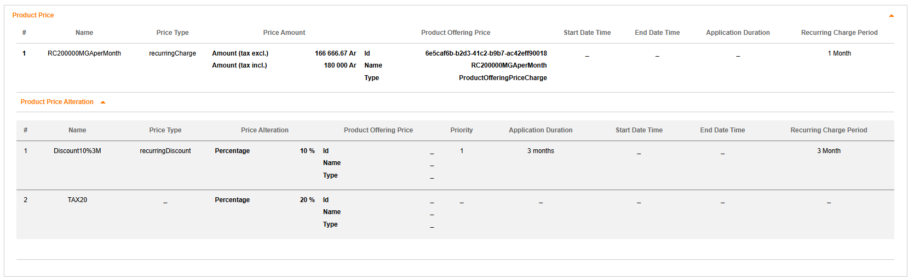{.img-zoomable}

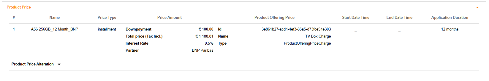{.img-zoomable}

#### Price Fields

| Field | Description |
| :---- | :---------- |
| `#` | Row number |
| `Name` | Name of the price entry (e.g., *RC200000MGAperMonth*) |
| `Price Type` | Type of charge: `recurringCharge`, `installment`, `oneTime`, etc. |
| `Price Amount` | The computed price amounts. For recurring charges: Amount (tax excl.) and Amount (tax incl.). For installments: Downpayment, Total price (Tax Incl.), Interest Rate, Partner |
| `Product Offering Price` | Reference to the catalog price: Id, Name, Type (e.g., `ProductOfferingPriceCharge`) |
| `Start Date Time` | The date from which this price applies for this product |
| `End Date Time` | The date until which this price applies for this product |
| `Application Duration` | Empty for Product Offering Price Charge |
| `Recurring Charge Period` | The billing period for recurring charges (e.g., *1 Month*, *3 Month*) |

#### Product Price Alteration

Below the main price table, the **Product Price Alteration** sub-section lists any discounts or taxes applied to the base price.

| Field | Description |
| :---- | :---------- |
| `Name` | Name of the alteration (e.g., *Discount10%3M*, *TAX20*) |
| `Price Type` | Type of alteration: `recurringDiscount`, `tax`, etc. |
| `Price Alteration` | How the alteration is expressed: `Percentage` or `Price` |
| `Percentage / Amount` | The discount or tax rate/amount (e.g., *10%* for Price Alteration in Percentage, *5€* for Price Alteration in Price,*20%* for Tax Alteration) |
| `Priority` | Application order when multiple alterations apply |
| `Application Duration` | Duration for which the alteration applies (e.g., *12 months*, *3 months*) |

### Related Party

This section identifies the customer or party associated with this product.

| Field | Description |
| :---- | :---------- |
| `Id` | The party identifier (e.g., *uxf6xxan9*) |
| `Name` | The party's name (e.g., *Catherine*) |
| `Role` | The party's role in relation to this product (e.g., `customer`) |
| `Referred Type` | The type of the individual: `individual` or `organization` |
| `Type` | The reference type — always `PartyRef` |
| `Party Name` | Full party name from the party system (may differ from local Name) |
| `Party Id` | The party system identifier (may differ from local Id) |

#### Example 

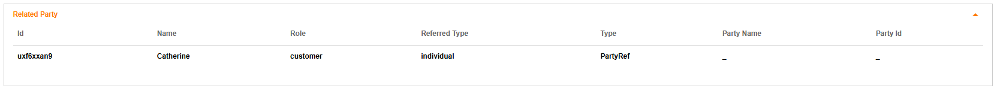{.img-zoomable}

### Billing Account

This section shows the billing account linked to this product, if one exists.

| Field | Description |
| :---- | :---------- |
| `Id` | The billing account identifier |
| `Name` | The billing account name. Displays `–` if not defined |
| `@Referred Type` | Always `BillingAccount` |

#### Example 

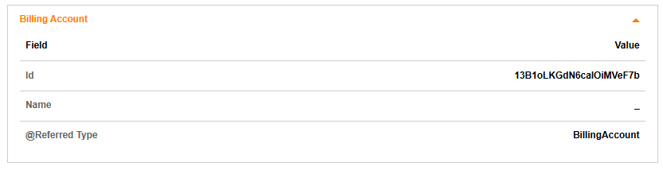{.img-zoomable}

### Related Product Items

This section lists the other products that are directly related to this product via a defined relationship type (typically `bundles`).

| Field | Description |
| :---- | :---------- |
| `Product Id` | Clickable link to the related product's detail screen |
| `Relationship Type` | Nature of the relationship: `bundles` (parent bundles the child), `reliesOn` (product depends on another) |

#### Example 

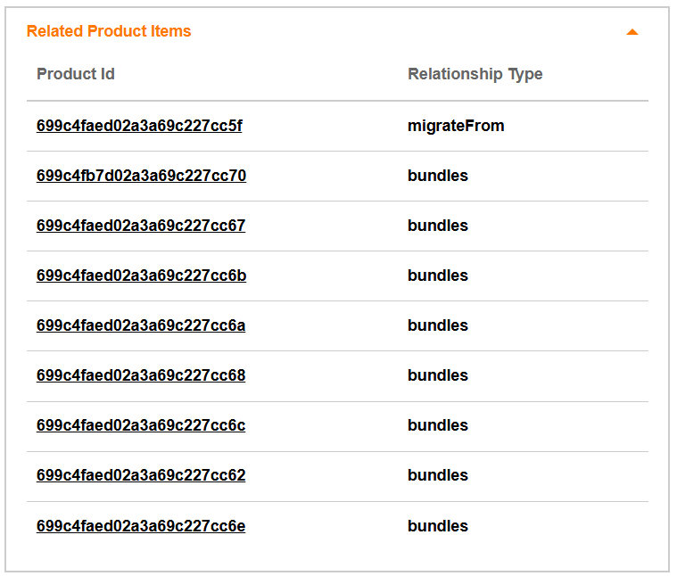{width="600" .img-zoomable}

### Commitment Term

This section displays the contractual commitment Term(s) associated to the product. It may contains a list of Commitment Terms but only one applies at a specific date.

| Field | Description |
| :---- | :---------- |
| `#` | Row number |
| `Name` | Name of the commitment term (e.g., *12 Months*) |
| `Duration` | Length of the commitment (e.g., *12 months*) |
| `Start Date` | The date from which the commitment begins |
| `End Date` | The date at which the commitment expires |
| `Description` | Additional description of the term |

#### Example 

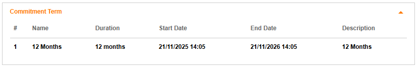{.img-zoomable}

### Product Characteristics

!!! info "Tip"
    This section is only displayed when product characteristics exist. If no characteristics are defined for the product, this section is hidden.

Product characteristics are specific attributes attached to the product instance, providing additional technical or commercial data. Note that the displayed columns adapt automatically depending on the characteristic type.

| Field | Description |
| :---- | :---------- |
| `Type` | The characteristic value type (e.g., `StringCharacteristic`, `ValidityCharacteristic`, `ObjectCharacteristic`) |
| `Id` | The unique identifier of the characteristic |
| `Name` | The characteristic name (e.g., *Blocked*, *Validity*, *Quantity*) |
| `Value` | The characteristic value (e.g., *No*, *1*). Displayed for String and Object characteristics. |
| `ValidTo` | The specific expiration date/time (e.g., *2100-01-01T23:20:50Z*). Displayed for Validity characteristics. |
| `UnitOfMeasure` | The unit of measurement (e.g., *GB*). Displayed for Object characteristics. |

#### Example 

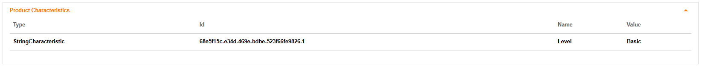{.img-zoomable}

### Product Order Item

This section lists all order items associated with this product, showing the actions that have been performed on it over its lifetime.

| Field | Description |
| :---- | :---------- |
| `Product Order Id` | The identifier of the parent order |
| `Order Item Id` | The identifier of the specific order item |
| `Order Item Action` | The action performed: `add` (creation), `migrate` (migration), `modify` (modification), `delete` (termination), etc. |
| `Role` | The role of the order item in the overall order. Displays `–` if not applicable |

#### Example 

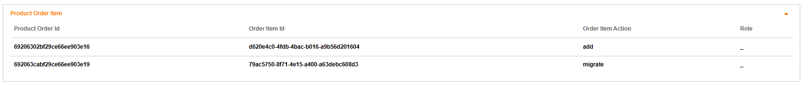{.img-zoomable}

### Realizing Service

This section lists the technical service identifiers that are realized by this product. These represent the network/service layer entities that deliver the product.

| Field | Description |
| :---- | :---------- |
| `Realizing Service Id` | The identifier of the technical service instance linked to this product (e.g., *1108_10*, *1108_11*) |

#### Example 

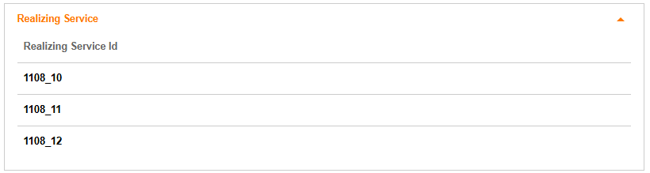{.img-zoomable}

### Realizing Resource

This section lists the physical or logical resources that are used to deliver this product.

| Field | Description |
| :---- | :---------- |
| `Realizing Resource Id` | The identifier of the resource (e.g., *12x*, *13x*) |
| `Realizing Type` | The type of resource (e.g., `Resource`) |

#### Example 

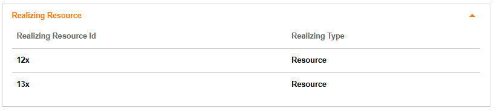{.img-zoomable}

### Status Change History

This section displays the full timeline of `commercial status` changes for the product, from creation to present.

| Field | Description |
| :---- | :---------- |
| `Change Date` | The date and time when the status changed (e.g., *21/11/2025 14:03*) |
| `Status` | The commercial status at that point in time, displayed as a color badge: <span class="badge badge-created">Created</span> → <span class="badge badge-active">Active</span> |

#### Example 

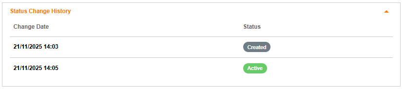{.img-zoomable}

### Operational Status Change History

This section displays the full timeline of **operational status** changes, which tracks the technical delivery states the product has gone through.

| Field | Description |
| :---- | :---------- |
| `Change Date` | The date and time when the operational status changed |
| `Status` | The operational status badge at that moment: <span class="badge badge-created">Created</span> → <span class="badge badge-confirmed">Confirmed</span> → <span class="badge badge-active">Active</span> → <span class="badge badge-pendingMigrate">PendingMigrate</span> |

#### Example

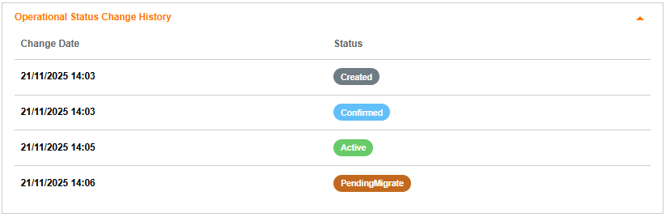{.img-zoomable}

## Hierarchy View

Upon clicking on a `Product Id` in the monitoring view, the administrator can visualize in the **Full Hierarchy** tab the graphical representation of the contract hierarchy and all products that compose this specific contract product.

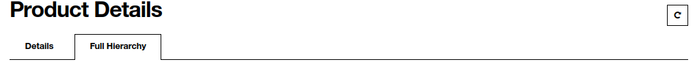{.img-zoomable}

A {width="32" .img-zoomable} reload button is available to dynamically refreshes the product data, ensuring the administrator always views the most up-to-date information without needing to manually refresh the entire browser page.

### Full Hierarchy View

The **Full Hierarchy** tab offers a top-down, node-based graphical representation of a customer's complete product landscape.

The graph is strictly organized into **four distinct levels**, each corresponding to a visual row on the canvas. Relationship rules are validated at each level (e.g., a top-level Contract product cannot have a `RootProduct` relationship to another contract):

- 📄 **Contract Level** (top level) - The root product representing the main customer agreement. There is always exactly one contract node at the top. This is the product visible when filtering with `Is Root = True`.
- 📦 **Bundle Level** — Grouped product offerings nested under the contract via `bundles` relationships. Bundles aggregate products resulting from Atomic Product Offering or Bundle Product Offering.
- 🔄 **Atomic Level** — Individual, indivisible products and services. These represent the actual deliverable components. Atomic products may have horizontal `reliesOn` dependencies with other atomic products.
- 📑 **Product Specification Level** (bottom level) — The technical product specifications referenced by atomic products via `sells` relationships. These describe the technical definition of each deliverable product.

```text
┌───────────────────────────────────────────────────────────────────────────┐
│  📄  CONTRACT LEVEL                                                       │
│      Root of the customer agreement                                       │
│      Relationship: top-level — no parent                                  │
└─────────────────────────────────────┬─────────────────────────────────────┘
                                      │
                     ┌────────────────┴────────────────┐
             bundles │                                 │ bundles
                     ▼                                 ▼
      ┌─────────────────────────────┐       ┌─────────────────────────────┐
      │  📦  BUNDLE LEVEL           │       │  📦  BUNDLE LEVEL           │
      │      Grouped offerings      │       │      Grouped offerings      │
      └──────────────┬──────────────┘       └──────────────┬──────────────┘
                     │                                     │
             ┌───────┴───────┐                             │
     bundles │               │ bundles           bundles   │
             ▼               ▼                             ▼
      ┌─────────────┐         ┌─────────────┐  reliesOn ┌─────────────┐
      │ 🔄 ATOMIC   │reliesOn │ 🔄 ATOMIC   │◄ ─────────│ 🔄 ATOMIC   │
      │   Product   │◄────────┤   Product   ├──────────►│   Product   │
      └──────┬──────┘         └──────┬──────┘           └──────┬──────┘
             │                       │         reliesFrom      │
             │                       │                         │
       sells │                 sells │                   sells │
             ▼                       ▼                         ▼
      ┌─────────────┐         ┌─────────────┐           ┌─────────────┐
      │ 📑 SPEC     │         │ 📑 SPEC     │           │ 📑 SPEC     │
      │  Spec Ref   │         │  Spec Ref   │           │  Spec Ref   │
      └─────────────┘         └─────────────┘           └─────────────┘
```

#### Basic Hierarchy Example

Below is a complete hierarchy showing contract at the top, bundles in the middle, multiple atomic products with `reliesOn` horizontal arrows. Each type of products are displayed with specific icons:

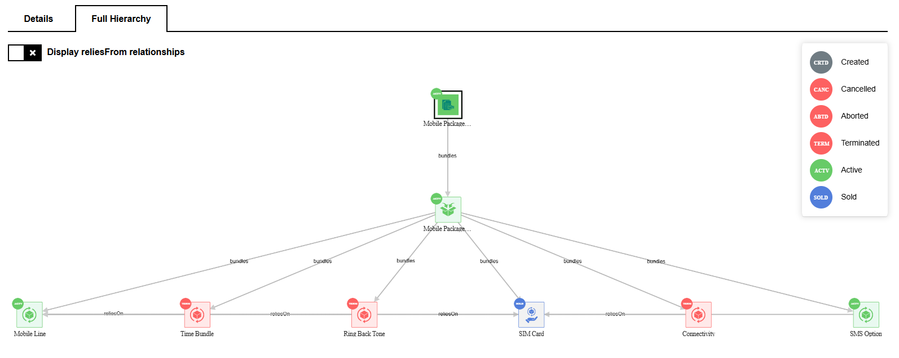{.img-zoomable}

#### Complex Hierarchy Example

Below is a more complex example featuring multiple bundles and atomic products with cross-dependencies:

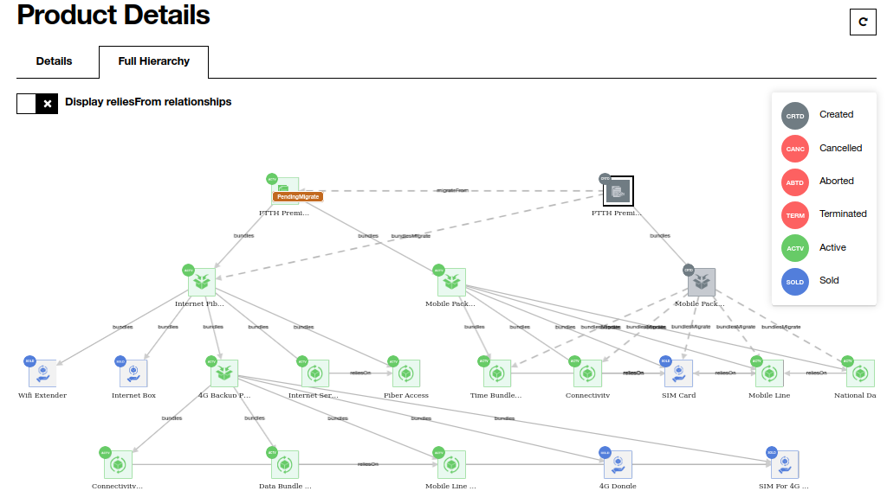{.img-zoomable}

#### Status Color Legend

Each node in the graph is color-coded to immediately reflect the product's current operational or commercial status. A legend is permanently displayed on the right side of the canvas:

| Badge | Code | Meaning |
|---|---|---|
| <span class="badge badge-created">CRTD</span> | `CRTD` | Created — instantiated but not yet active |
| <span class="badge badge-cancelled">CANC</span> | `CANC` | Cancelled |
| <span class="badge badge-terminated">ABTD</span> | `ABTD` | Aborted |
| <span class="badge badge-terminated">TERM</span> | `TERM` | Terminated — no longer delivering service |
| <span class="badge badge-active">ACTV</span> | `ACTV` | Active — currently delivering service |
| <span class="badge badge-sold">SOLD</span> | `SOLD` | Sold |

#### Node Interactions

Interacting with the graph provides deeper insights into specific products without leaving the view:

- **Click** on any node to open a contextual popup.
- **Popup details** include: `Id`, `Product Name`, `Type`, `Start Date`, `Last Update Date`, `Termination Date`, `Creation Date`.
- **"View All Details"** link in the popup navigates directly to the full [product details](#details-view).

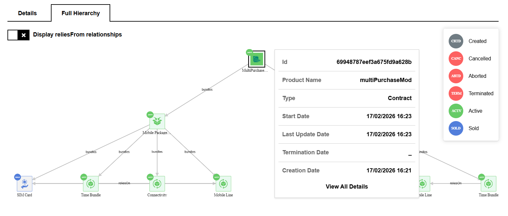{.img-zoomable}

#### Managing Dependencies

The graph uses directional edges to map dependencies between products.

- **Without `reliesFrom` (Default):** only primary `bundles` (top-down) and `reliesOn` (horizontal) dependencies are shown.

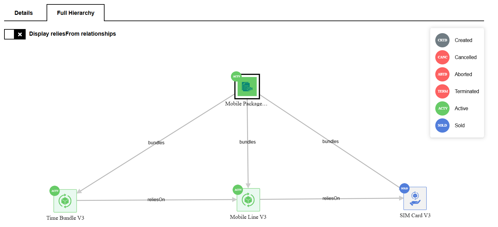{.img-zoomable}

- **With `reliesFrom` (Toggled):** check the **"Display reliesFrom relationships"** box in the top-left corner to also show **reverse dependencies** — bidirectional arrows appear between atomic products that have mutual dependencies.

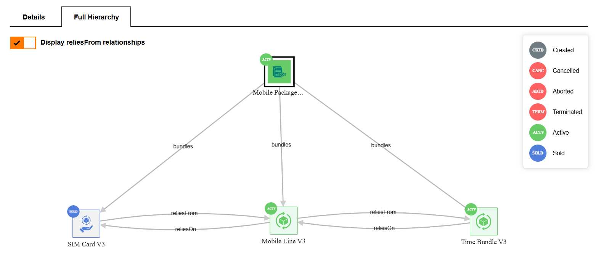{.img-zoomable}

!!! info "Tip"
    Use the default view (reliesFrom hidden) for a clean hierarchy overview. Enable reliesFrom when you need to understand the full dependency web, especially for troubleshooting.

### Migration View

A **Migration** occurs when a customer moves from an existing offer (**Source Contract**) to a new offer (**Target Contract**). This operational use case introduces specific data states and relationships to ensure service continuity and full traceability.

Two types of migrations exist:

- **Commercial Migration**: no impact on the service level. The commercial offer changes but underlying services remain unchanged.
- **Operational Migration**: requires delivery changes — products may be added, modified, or terminated as part of the transition.

The Full Hierarchy graph dynamically adapts to show both the old and new contract landscapes side by side on a single canvas.

#### Visualizing a Single Migration

When a migration is initiated or completed, both the **source hierarchy** (old contract) and the **target hierarchy** (new contract) appear simultaneously, linked by a **dashed `migrateFrom` edge**.

```text
  SOURCE CONTRACT (old)                        TARGET CONTRACT (new)
  ─────────────────────                        ─────────────────────

  ┌─────────────────────┐                      ┌─────────────────────┐
  │  📄  CONTRACT       │                      │  📄  CONTRACT       │
  │      [ TERM ]       │◄ ── migrateFrom ── ──│      [ ACTV ]       │
  └──────────┬──────────┘                      └──────────┬──────────┘
             │ bundles                                    │ bundles
             ▼                                            ▼
  ┌─────────────────────┐                      ┌─────────────────────┐
  │  📦  BUNDLE         │                      │  📦  BUNDLE         │
  │      [ TERM ]       │                      │      [ ACTV ]       │
  └──────────┬──────────┘                      └──────────┬──────────┘
             │ bundles                                    │ bundles
             ▼                                            ▼
  ┌─────────────────────┐                      ┌─────────────────────┐
  │  🔄  ATOMIC         │                      │  🔄  ATOMIC         │
  │      [ TERM ]       │                      │      [ ACTV ]       │
  └──────────┬──────────┘                      └──────────┬──────────┘
             │ sells                                      │ sells
             ▼                                            ▼
  ┌─────────────────────┐                      ┌─────────────────────┐
  │  📑  SPEC           │                      │  📑  SPEC           │
  │      [ TERM ]       │                      │      [ ACTV ]       │
  └─────────────────────┘                      └─────────────────────┘

  Legend:  ◄ ── ──   dashed edge = migrateFrom relationship
           [ TERM ]  red node    = no longer active
           [ ACTV ]  green node  = currently delivering service
```

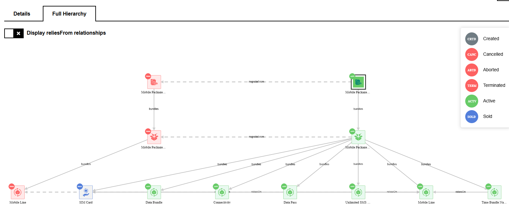{.img-zoomable}

Reading the graph:

- **Red nodes** (`TERM`/`CANC`) — left side: the old source contract and its products, no longer active.
- **Green nodes** (`ACTV`) — right side: the new target contract, currently delivering services.
- **Dashed horizontal line** labeled `migrateFrom` — connects the new contract to the old, recording the migration history.

#### Migration Lifecycle

In case of product migration, the hiearchical view of product reflects the lifecycle of the migration.

##### During Order Capture — Source Locking (step 1)

When a migration order is validated by the customer, the system prevents conflicting actions on the source contract.

- **Target Instantiation**: the new contract and its bundles are created with <span class="badge badge-created">Created</span> status.
- **Source Locking**:  the old contract's operational status changes to <span class="badge badge-pendingMigrate">PendingMigrate</span>.

```text
  SOURCE CONTRACT                              TARGET CONTRACT
  ──────────────────────────────               ─────────────────────────────

  ┌──────────────────────────┐                 ┌──────────────────────────┐
  │  📄  CONTRACT            │                 │  📄  CONTRACT            │
  │      [ PendingMigrate ]  │◄ ── ── ── ── ── │      [ Created ]         │
  └──────────────────────────┘  migrateFrom    └──────────────────────────┘

  ⚠️  Source is locked — no new orders or changes allowed until migration
      completes or is rolled back.
```

Here is an example:

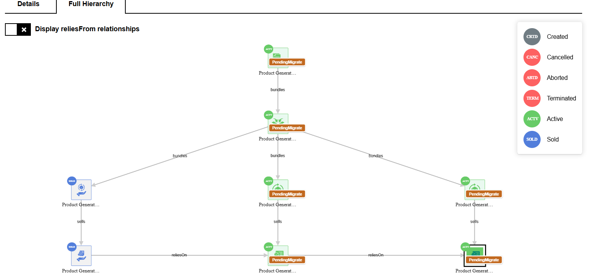{.img-zoomable}

##### During Order Delivery — Temporary Relationships (step 2)

While the order is being orchestrated, temporary relationships link new products to old ones:

- **`migrateFrom` edge**: dashed line connecting target contract → source contract.
- **`bundlesMigrate`**:  temporary replacement for `bundles` relationship during delivery.
- **`reliesOnMigrate`**: temporary replacement for `reliesOn` relationship during delivery.

#### After Successful Delivery — Completion (step 3)

Once all order items are successfully delivered:

- **Target Activation**: temporary `bundlesMigrate` / `reliesOnMigrate` are replaced by standard relationships. Target products become <span class="badge badge-active">Active</span>.
- **Source Termination**: old products transition to <span class="badge badge-terminated">Terminated</span> or <span class="badge badge-cancelled">Cancelled</span>.

!!! info "Rollback Handling"
    If delivery partially or totally fails, temporary `Migrate` relationships are removed, failed target products become `Aborted`, and the source contract reverts from <span class="badge badge-pendingMigrate">PendingMigrate</span> back to <span class="badge badge-active">Active</span>.

### Multiple Migration View

In certain business cases, a customer may undergo **successive migrations** — from Contract A → Contract B, then later from Contract B → Contract C. This creates a **chain of migration history** fully visible on a single canvas.

#### What Multiple Migrations Looks Like

The graph displays **all historical and current contracts side by side**, connected by a chain of `migrateFrom` dashed edges from the newest (rightmost, Active) back to the oldest (leftmost, Terminated):

```text
  CONTRACT A (origin)          CONTRACT B (intermediate)        CONTRACT C (current)
  ────────────────────         ─────────────────────────        ────────────────────

  ┌──────────────────┐         ┌──────────────────────┐         ┌──────────────────┐
  │  📄  CONTRACT    │         │  📄  CONTRACT        │         │  📄  CONTRACT   │
  │     [ TERM ]     │◄── ─── ─│     [ TERM ]         │◄── ─── ─│     [ ACTV ]     │
  └────────┬─────────┘         └─────────┬────────────┘         └────────┬─────────┘
           │ bundles                     │ bundles                       │ bundles
           ▼                             ▼                               ▼
  ┌──────────────────┐         ┌──────────────────────┐         ┌──────────────────┐
  │  📦  BUNDLE      │         │  📦  BUNDLE         │         │  📦  BUNDLE      │
  │     [ TERM ]     │◄── ─── ─│     [ TERM ]         │◄── ─── ─│     [ ACTV ]     │
  └────────┬─────────┘         └─────────┬────────────┘         └────────┬─────────┘
           │ bundles                     │ bundles                       │ bundles
           ▼                             ▼                               ▼
  ┌──────────────────┐         ┌──────────────────────┐         ┌──────────────────┐
  │  🔄  ATOMIC      │         │  🔄  ATOMIC         │         │  🔄  ATOMIC      │
  │     [ TERM ]     │◄── ─── ─│     [ TERM ]         │◄── ─── ─│     [ ACTV ]     │
  └────────┬─────────┘         └─────────┬────────────┘         └────────┬─────────┘
           │ sells                       │ sells                         │ sells
           ▼                             ▼                               ▼
  ┌──────────────────┐         ┌──────────────────────┐         ┌──────────────────┐
  │  📑  SPEC        │         │  📑  SPEC           │         │  📑  SPEC        │
  │     [ TERM ]     │         │     [ TERM ]         │         │     [ ACTV ]     │
  └──────────────────┘         └──────────────────────┘         └──────────────────┘

  ◄── ──   migrateFrom (dashed) — read right → left to trace history
```

Here is an example:

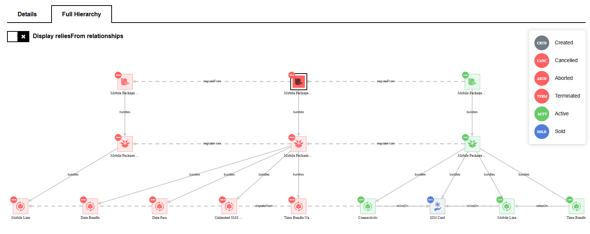{.img-zoomable}

Reading the example:

- **Left column — <span class="badge badge-terminated">TERM</span>**:  the oldest source contract — fully terminated, origin of the first migration.
- **Middle column — <span class="badge badge-terminated">TERM</span>**: an intermediate contract — was the first target, then became the source of the second migration.
- **Right column — <span class="badge badge-active">ACTV</span>**: the current active contract — the final target.
- **Dashed `migrateFrom` edges** connect each level from right to left, tracing the complete lineage.

#### Reading Multiple Migration

Read the migration chain from **right (current) to left (oldest)**:

```text
  Current Active Contract  ──migrateFrom──►  Previous Contract  ──migrateFrom──►  Original Contract
         [ ACTV ]                                 [ TERM ]                              [ TERM ]
```

At every hierarchy level (Contract, Bundle, Atomic), the `migrateFrom` edges show exactly which old product was replaced by which new product, providing **full traceability at every level of the product structure**.
