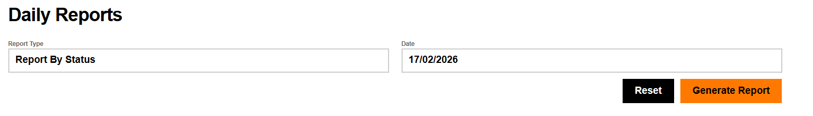
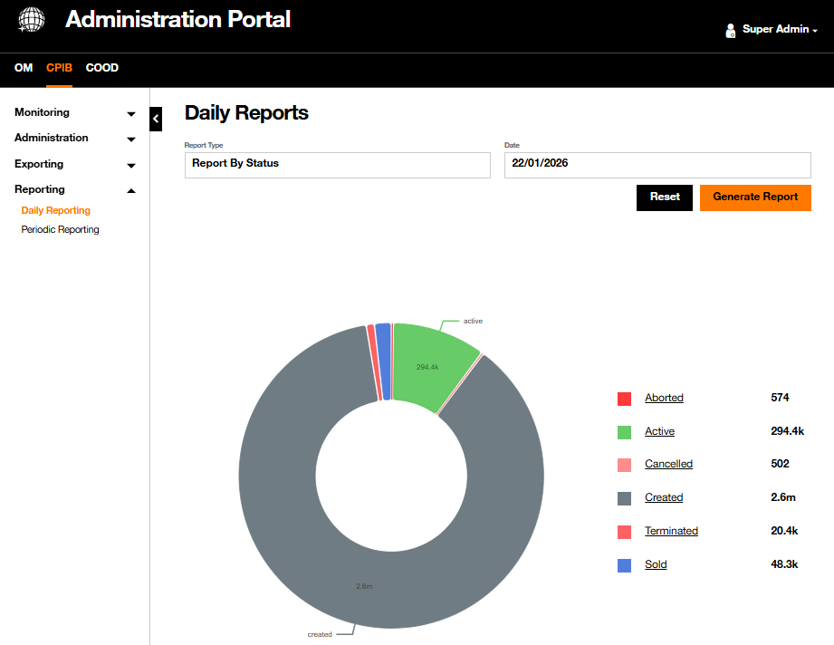
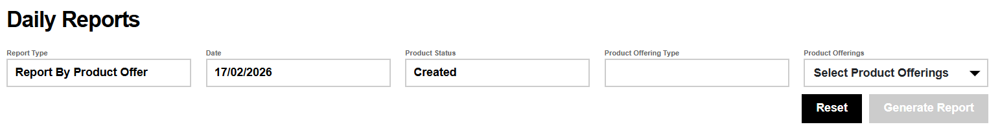
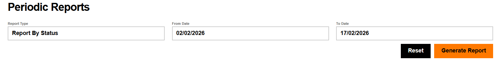
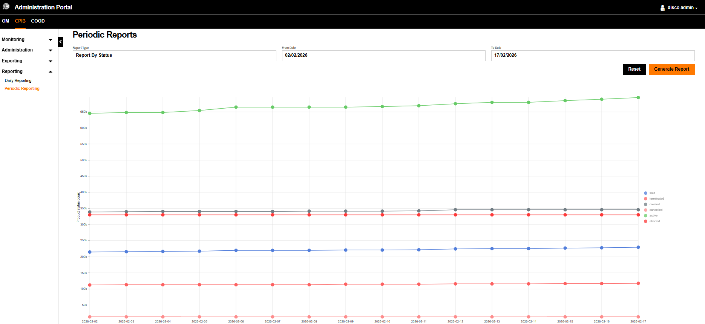
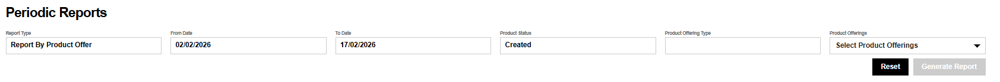

# Reporting

The **Reporting** menu enables an overview of the contract products in the Product Inventory database.

Reporting can be performed on a **Daily** basis or for a specific time  **Period**.

## Daily Reporting

It is possible to generate a daily report based on either the product statuses or the product offer. Depending on the selected **Report Type**, the available input fields adapt dynamically.

### Daily Report By Status

When selecting **Report By Status**, the interface requires only the **Date** to display the number of products per status (e.g., `Created`, `Active`, `Cancelled`, `Terminated`, `Sold`, `Aborted`).

{.img-zoomable}

As result, the reporting chart display the number products segregated by status.

{.img-zoomable}

### Daily Report by Product Offer

!!! info "In Progress"
    Currently, generating the report by Product Offer is not fully functional. However, the interface correctly updates to dynamically request the specific fields below.

When selecting **Report By Product Offer**, additional filtering criteria appear in the interface.

{.img-zoomable}

The selection of products to export is based on the following criteria.

| Filter | Description |
| :----- | :---------- |
| `Date` | |
| `Product Status` | Select one status at a time: Created Active Cancelled Terminated Sold Aborted |
| `Product Offering Type` | |
| `Product Offerings` | |

## Periodic Reporting

This report displays the number of products during a period of time. Similar to Daily Reporting, the input fields adapt based on the selected **Report Type**.

### Periodic Report By Status

When selecting **Report By Status**, the interface requires a date range:

- **From Date**: calendar start date of the report
- **To Date**: calendar end date of the report

{.img-zoomable}

The generated report shows a graph representing the number of products per status on the given time period.

{.img-zoomable}

### Periodic Report By Product Offering

!!! info "In Progress"
    Similar to the daily report, generation for this report type is currently not functional, but the fields adapt as expected.

When selecting **Report By Product Offering**, additional filtering criteria are revealed.

{.img-zoomable}

The generation of periodic reports is based on the following criteria.

| Filter | Description |
| :----- | :---------- |
| `From Date` | Calendar start date |
| `To Date` | Calendar start date |
| `Product Status` | Select one status at a time: Created Active Cancelled Terminated Sold Aborted |
| `Product Offering Type` | |
| `Product Offering` | |
