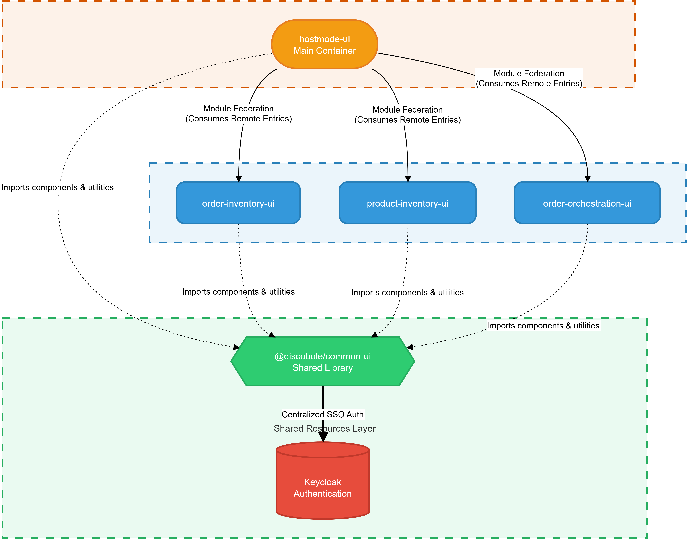
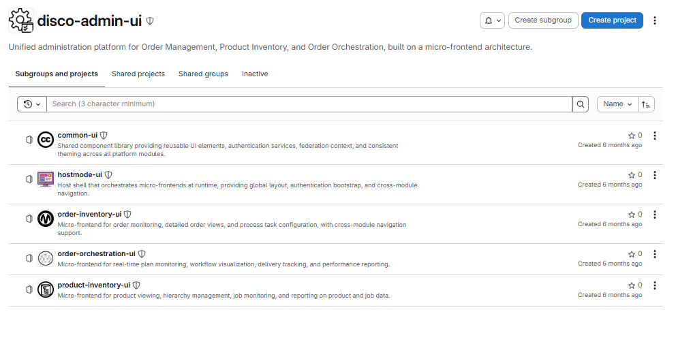
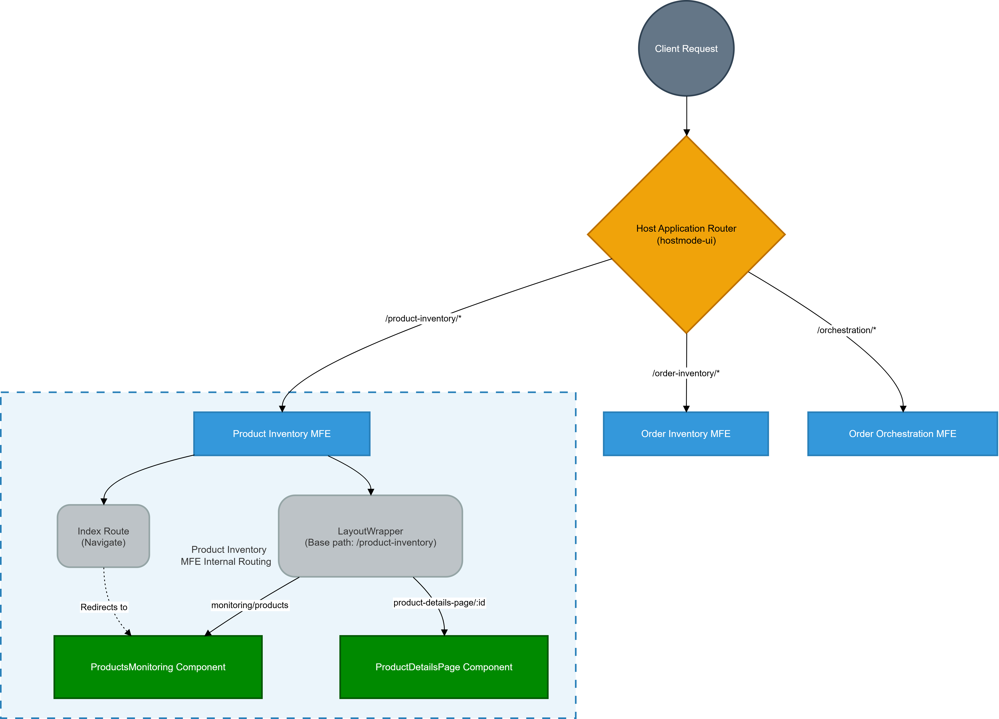
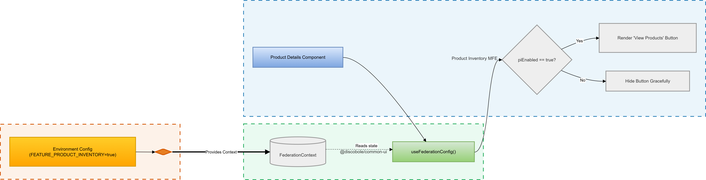
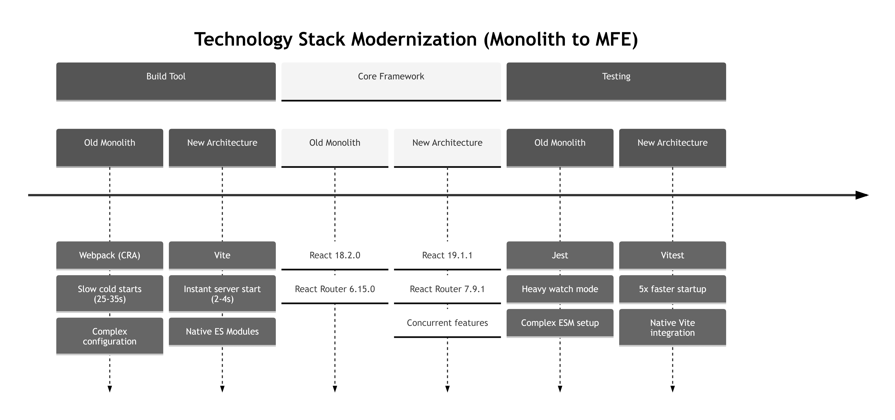
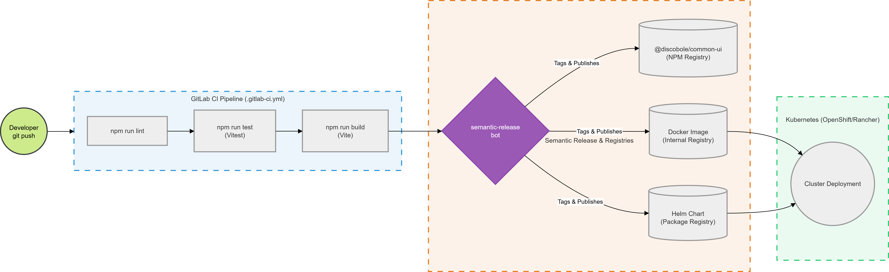
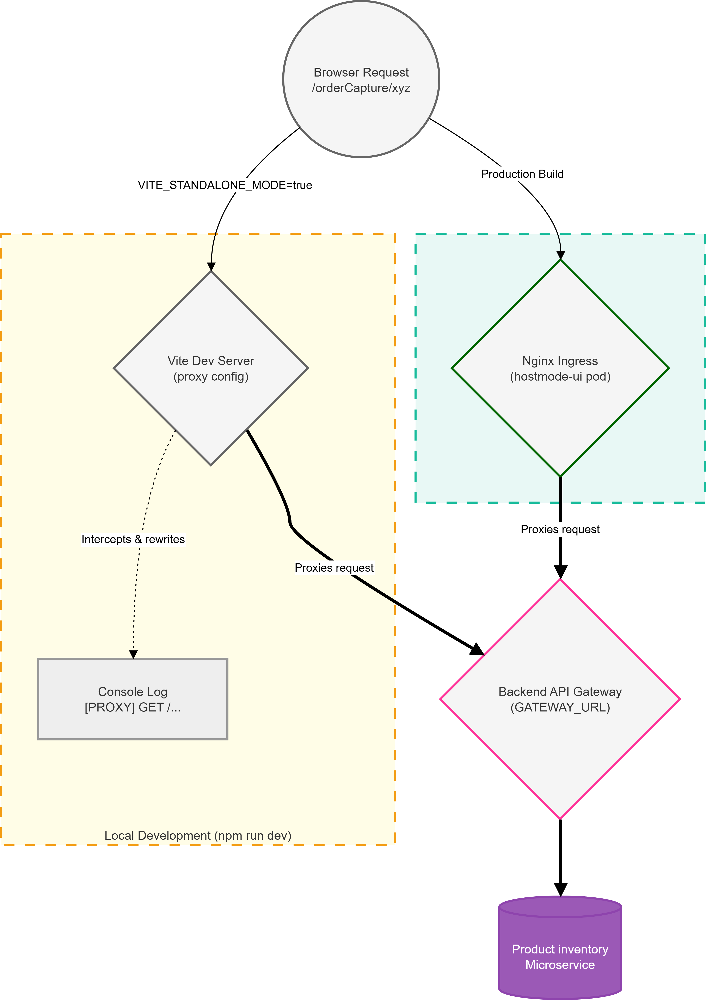

# Software Architecture

!!! info "Architecture Context"

    This document describes the frontend architecture of the **product-inventory-ui** microfrontend for the Product Inventory Component (CPIB) within the broader **admin-ui** federated platform. It covers the target architecture, key design decisions, deployment topology, and the technology stack adopted during the migration from the monolithic React application.

## Project Overview

The administration UI was historically a single React application managing three distinct business domains: **Order Inventory**, **Product Inventory**, and **Order Orchestration**. This monolithic structure created tight coupling between unrelated business functions and introduced deployment bottlenecks that affected the entire application on every release.

The adopted solution is a **domain-driven decomposition** into a federated Microfrontend Architecture, where each domain — including **Commercial Product Installed Base (CPIB)** — becomes an independently buildable, testable, and deployable unit.

[{ width="850" .img-zoomable }](../img/frontend/ui-software-architecture-mfe-hub.png)

## Target Architecture

The architecture relies on a **host shell** (`hostmode-ui`) that orchestrates independently deployed microfrontends at runtime via Module Federation. Each microfrontend owns a single business domain and is fully autonomous — it can be built, tested, and deployed without coordinating with other teams.

The `@discobole/common-ui` shared library centralizes cross-cutting concerns shared by all microfrontends: authentication, shared components, hooks, and the federation context.

[{ width="850" .img-zoomable }](../img/frontend/ui-software-architecture-mfe-composition.png)

| Component | Type | Purpose |
| :--- | :--- | :--- |
| `hostmode-ui` | Host Application | Main container orchestrating all MFEs at runtime |
| `order-inventory-ui` | Microfrontend | Order management domain |
| **`product-inventory-ui`** | **Microfrontend** | **Product inventory domain (CPIB)** |
| `order-orchestration-ui` | Microfrontend | Workflow orchestration domain |
| `common-ui` | Shared Library | Shared components, authentication, hooks, and utilities |

[{ width="850" .img-zoomable }](../img/frontend/ui-software-architecture-gitlab-overview.png)

## Module Federation

Module Federation is the core enabler of the architecture. It allows the host shell to load remote MFE bundles at runtime without any build-time dependency between repositories, and ensures that singleton shared dependencies (React, React Router, `@discobole/common-ui`) are instantiated only once across all microfrontends.

Each MFE exposes its root component via a `remoteEntry.js` manifest file, which the host shell fetches dynamically at runtime:

```js
http://<domain>/assets/remoteEntry.js
```

The federation configuration for `product-inventory-ui` is as follows:

```js
// vite.config.js — product-inventory-ui
federation({
    name: "product_inventory",
    filename: "remoteEntry.js",
    exposes: {
        "./App": "./src/App.jsx"
    },
    shared: {
        "react":                { singleton: true, requiredVersion: "^18.0.0" },
        "react-dom":            { singleton: true, requiredVersion: "^18.0.0" },
        "react-router-dom":     { singleton: true, requiredVersion: "^6.0.0" },
        "@discobole/common-ui": { singleton: true, requiredVersion: "^1.0.0" }
    }
});
```

## Dual-Mode Operation

`product-inventory-ui` supports two distinct operational modes, dynamically resolved at boot time via the `VITE_STANDALONE_MODE` environment variable. This design allows the same codebase to run both as a fully autonomous application during development and as a federated module inside the host shell in production.

[{ width="650" .img-zoomable }](../img/frontend/ui-software-architecture-execution-mode-decision-tree.png)

**Standalone Mode** (`VITE_STANDALONE_MODE=true`)

The MFE bootstraps as a fully autonomous application. It initializes its own Keycloak authentication session, mounts a `BrowserRouter`, and renders independently. This mode is used during local development and isolated testing.

**Federated Mode** (`VITE_STANDALONE_MODE=false`)

The MFE is consumed by `hostmode-ui`. It skips authentication initialization — delegating entirely to the host's Keycloak session — and returns a bare App component for the host to mount within its own routing and provider tree.

[{ width="550" .img-zoomable }](../img/frontend/ui-software-architecture-dual-mode-bootstrap.png)

## Routing Architecture

Routing responsibilities are split between the host application and `product-inventory-ui`. The host maintains top-level navigation control while the MFE manages its own internal page structure under its base path.

### Host Application Routing

`hostmode-ui` defines a top-level wildcard route that delegates all `/product-inventory/*` traffic to the CPIB MFE bundle at runtime:

```jsx
<Route path="/product-inventory/*" element={<ProductInventoryMFE />} />
```

### Internal Routing

Once the host hands off control, the MFE's internal `<Routes>` take over. The MFE defines a `LayoutWrapper` scoped to `/product-inventory` and manages its own page components:

| Route | Component |
| :--- | :--- |
| `/product-inventory/monitoring/products` | `ProductsMonitoring` — products list and monitoring view |
| `/product-inventory/product-details-page/:id` | `ProductDetailsPage` — detailed view of a single product |

[{ .img-zoomable }](../img/frontend/ui-software-architecture-routing-cpib.png)

## Cross-MFE Awareness

To maintain strict decoupling while enabling seamless cross-domain navigation, microfrontends do not import from each other directly. Instead, they rely on the `useFederationConfig()` hook provided by `@discobole/common-ui`, which reads from a shared `FederationContext` populated at host level.

A concrete example involving CPIB: the **Order Inventory MFE** conditionally renders a "View Products" navigation button depending on whether `product-inventory-ui` is currently registered and available in the host environment. If CPIB is not loaded, the button is hidden gracefully — no broken links, no runtime errors.

[{ .img-zoomable }](../img/frontend/ui-software-architecture-cross-mfe-awareness.png)

## Technology Stack

The migration was paired with a full modernization of the frontend toolchain. The choices below reflect a deliberate alignment with modern standards and the specific requirements of a Module Federation setup.

[{ width="850" .img-zoomable }](../img/frontend/ui-software-architecture-tech-stack-evolution.png)

### Build Tool: Webpack → Vite

Vite replaces Create React App's Webpack pipeline. By leveraging native ES Modules in the browser during development, Vite eliminates the upfront bundling step that caused slow cold starts. In production, it uses Rollup under the hood for optimized output. For a Module Federation setup specifically, Vite's architecture is a significantly better fit than Webpack's CRA abstraction, which does not natively support federation.

| Metric | Webpack (CRA) | Vite | Expected Improvement |
| :--- | :--- | :--- | :--- |
| **Dev Server Start** | 25–35 seconds | 2–4 seconds | ~8× faster |
| **Hot Reload** | 3–8 seconds | 200–800 ms | ~10× faster |
| **Production Build** | 45–60 seconds | 15–25 seconds | ~2.5× faster |

!!! warning "On Performance Figures"

    The metrics above are derived from official and community benchmarks comparing Webpack and Vite at scale. They represent expected gains based on the toolchain difference and should be validated through measurements on the actual codebase once sufficient production data is available.

### Framework Versions

| Package | Previous | Current | Notable Change |
| :--- | :--- | :--- | :--- |
| `react` / `react-dom` | 18.2.0 | 19.1.1 | Concurrent features, improved rendering |
| `react-router-dom` | 6.15.0 | 7.9.1 | Revised data routing API |
| `react-scripts` | 5.0.1 | — | Removed; replaced entirely by Vite |

### Testing Framework: Jest → Vitest

Testing was migrated from Jest to Vitest to align with the Vite ecosystem. The migration required minimal syntax changes and maintained full test coverage. The primary motivation was native ES Module support — Jest's CommonJS-based transform pipeline creates friction in a Vite/ESM project and complicates Module Federation test setups.

| Metric | Jest | Vitest |
| :--- | :--- | :--- |
| **Test Startup** | 5–10 seconds | 1–2 seconds |
| **ES Modules** | Requires transform workarounds | Native support |
| **Vite Integration** | External, config duplication | Built-in, single config |

## Deployment & CI/CD

`product-inventory-ui` is deployed independently through its own GitLab CI/CD pipeline. No coordination with other MFE pipelines is required — a push to `product-inventory-ui` triggers only its own pipeline.

[{ .img-zoomable }](../img/frontend/ui-software-architecture-cicd-pipeline.png)

The pipeline follows three sequential stages:

**1. Quality Gate**

```
npm run lint  →  npm run test (Vitest + coverage)  →  npm run build (Vite)
```

All three steps must pass before the pipeline proceeds. A failing test or linting error blocks the release.

**2. Semantic Release**

The `semantic-release` bot analyzes commit messages (following Conventional Commits), increments the version automatically, generates the CHANGELOG, and publishes artefacts to:

- **NPM Registry** — for `common-ui` package releases
- **Docker Image Registry** — containerized build of the MFE
- **Helm Package Registry** — Helm chart for Kubernetes deployment

**3. Cluster Deployment**

The versioned Helm chart is deployed to the OpenShift/Rancher Kubernetes cluster.

!!! success "Deployment Benefits"

    - **Independent Releases:** The CPIB team controls its own deployment schedule with no dependency on other MFE release cycles.
    - **Rollback Safety:** A failed `product-inventory-ui` deployment does not affect `order-inventory-ui`, `order-orchestration-ui`, or the host shell.
    - **Reduced Blast Radius:** Smaller, focused deployments limit the scope of any given change.

## Containerized Deployment Architecture

In production, `product-inventory-ui` runs as a containerized Nginx pod. Client requests enter through the OpenShift Ingress controller, are routed to the `hostmode-ui` pod, which then fetches the CPIB `remoteEntry.js` at runtime to dynamically compose the application.

API requests from the CPIB frontend are proxied directly through the `product-inventory-ui` Nginx container to the Backend API Gateway — the host shell does not intermediate API traffic.

[{ width="1050" .img-zoomable }](../img/frontend/ui-software-architecture-containerized-deployment.png)

??? info "API Proxy Configuration: Development vs. Production"

    **Local Development (`VITE_STANDALONE_MODE=true`):**
    The Vite Dev Server intercepts all API calls and proxies them to the configured backend via `vite.config.js`. This replaces the legacy `setupProxy.js` Webpack middleware from the monolithic app and provides enhanced debugging via `proxyReq` event hooks that log every proxied request to the console.

    **Production:**
    The `product-inventory-ui` Nginx container uses `proxy_pass` directives to forward API requests to the Backend API Gateway at `GATEWAY_URL`. The Vite Dev Server is not present in production — the built static assets are served directly by Nginx.

    [{ width="650" .img-zoomable }](../img/frontend/ui-software-architecture-api-proxy-vs-gateway-cpib.png)

## Runtime Loading Strategy

The transition to a federated architecture fundamentally changes how the application loads in the browser. The monolithic approach required the browser to fetch, parse, and compile a single 15 MB bundle — including the entirety of CPIB, OM, and COOD — before rendering anything. The federated approach uses a **progressive, on-demand loading model**: only the host shell and `common-ui` are fetched on first load; `product-inventory-ui` is lazy-loaded only when the user navigates to a product inventory route.

[{ .img-zoomable }](../img/frontend/ui-software-architecture-runtime-loading-strategy.png)

| Phase | Monolithic (Old) | Federated (New) |
| :--- | :--- | :--- |
| **Initial Fetch** | 15 MB mega-bundle (all domains) | `hostmode-ui` + `common-ui` shells only |
| **First Paint** | After full bundle parse & compile | After shell render & authentication |
| **CPIB Load** | Always loaded, even when unused | Lazy-loaded on first `/product-inventory` navigation |
| **Cache Granularity** | Entire bundle invalidated on any change | Only the `product-inventory-ui` chunk is invalidated |

## Source Code Organization

### Repository Structure

Each MFE lives in its own GitLab repository under the `disco-admin-ui` group. There are no shared build pipelines or cross-repository build-time dependencies.

| Repository | Role | Purpose |
| :--- | :--- | :--- |
| `hostmode-ui` | Host Shell | Main container orchestrating all MFEs at runtime |
| `order-inventory-ui` | Microfrontend | Order management domain |
| **`product-inventory-ui`** | **Microfrontend** | **Product inventory domain (CPIB)** |
| `order-orchestration-ui` | Microfrontend | Workflow orchestration domain |
| `common-ui` | Shared Library | Shared components, authentication, hooks, and utilities |

### Project Structure

```bash
product-inventory-ui/
├── src/
│   ├── App.jsx                 # Root component exposed via Module Federation
│   ├── bootstrap.jsx           # MFE entry point — dual-mode initialization logic
│   ├── components/             # Reusable UI components (CPIB-specific)
│   ├── service/                # API layer — all backend calls go through here
│   ├── routes/                 # Routing configuration
│   ├── views/                  # Page-level components (ProductsMonitoring, ProductDetailsPage)
│   └── hooks/                  # Custom React hooks
├── env/
│   └── env.template.js         # Runtime environment variable template
├── vite.config.js              # Vite + Module Federation configuration
├── Dockerfile                  # Multi-stage containerized build
└── package.json
```
