# Overall Architecture

## Global View

???+ summary "User Role & Permission management is part of the [DISCOBOLE](https://discobole.ow2.io/doc/) platform."
    [DISCOBOLE](https://discobole.ow2.io/doc/) stands for Digital & Innovative   OpenSource Platform for Core commerce management, it represents a suite of component covering the "Order To Bill" and Order orchestration scope within the ODA "Open Digital Architecture" core commerce management domain.

    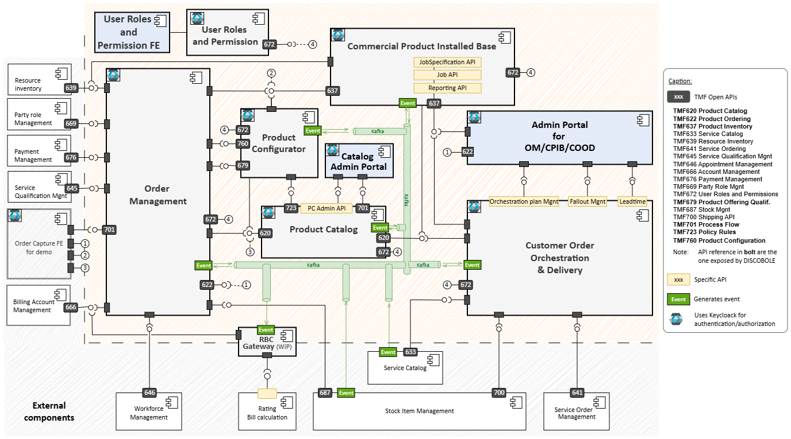{.img-zoomable}

    The user role and permission management component is a part of the Security Function of all components. It controls access to ODA components and the interfaces they expose. It manages users, user roles and entitlements to the services of DISCOBOLE components.
 
    The component is triggered by:

    1. Any user requesting access by means of a user role or keycloak-create-role-eation of a new user.
    2. Any component requesting authentication.

## Process View

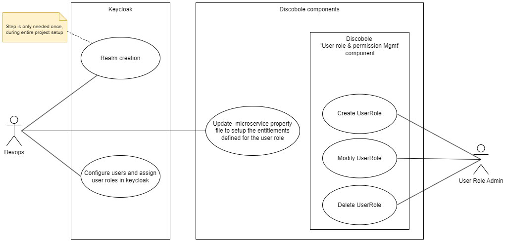{.img-zoomable}

### Step 1: create a realm and configure the list of clients

The step 1 involves creating a realm. The default realm management role is created automatically by Keycloak, which helps the admin to manage the realm and create clients. The definition of realm and clients is described in detail in the page. This is a one time activity and doesn't need to be repeated every time for user role configuration. It needs to be done only once per project for "realms" and the number of clients depend on the routing mechanism needed (through a gateway/direct).

### Step 2: create user role

A role is a list of "entitlements" that maybe assigned to a given user. Each entitlement must be configured in the DISCOBOLE component/microservice for it to be usable. The roles for DISCOBOLE are managed by using the TMF672 API (User roles and permissions management API). A set of APIs have been created (TMF Compliance) respectively for 'creating roles and entitlements', to 'modify entitlement linked to a role' and to 'retrieve roles' from the DISCOBOLE authentication server database.These APIs, described here below, will be called in compliance with TMF672 User Role Permission Management API version 4.0.1:

#### Create user role API

The first `POST /userRole` API, which has been created, is to create user role(s) from the DISCOBOLE authentication server.

**Sample:**

```json
POST http://serverlocation:port/userRolePermission/v1/userRole 
{
    "involvementRole": "Product Catalog Admin",
    "@type": "UserRole",
    "entitlement": [
        {
            "id": "x21",
            "action": "Consultation",
            "function": "Product Spec",
            "@type": "Entitlement"
        },
        {
            "id": "x22",
            "action": "Consultation",
            "function": "Atomic PO",
            "@type": "Entitlement"
        }
    ]
}
```

When this API is called, it will create a role in the Keycloak by calling the keycloak server api - `POST /{realm}/clients/{id}/roles` (refer -Keycloak Admin REST API) persist the entitlement data with user role in DISCOBOLE authentication server database.

#### Retrieve user role API

The second `GET /userRole/{id}`API, which has been created, is to retrieve user role(s) from the DISCOBOLE authentication server. In this API, data will be fetched from the `userRoleManagement` database. It will be executed from service itself while performing actions.

```json
GET call: http://serverlocation:port/userRolePermission/v1/userRole/{id}?fields=...&filtering
Accept: application/json
```

##### Modify user role API

This third `PATCH /userRole/{id}` API aims to modify user role into the DISCOBOLE authentication server:

**Sample: request to replace the value of the 'action' to create a new version**

```json
PATH http://serverlocation:port/userRolePermission/v1/userRole/1234
{
    "op": "replace",
    "path": "/entitlement/action?entitlement.id=x200",
    "value": "Create a new version"
}
```

Sample response

```json
{
    "id":"1234",

        "href": " ...",
    "involvementRole": "Test",
    "@type": "UserRole",
    "entitlement": [
        {
            "id": "x200",
            "action": "Create a new version",
            "function": "Product Spec",
            "@type": "Entitlement"
        }

   ]
}
```

When this API is called, it will update a role in the Keycloak by calling the keycloak server API - `PUT/{realm}/clients/{id}/roles` (refer -Keycloak Admin REST API) update the entitlement data with user role in DISCOBOLE-AUTH database Roles and Entitlement on Keycloak side. After creating client roles on User Role Management service using above TMF672 API, we will assign the specific created roles to specific users so that users can fetch or create data using microservices.When any microservice is accessed of a component by the user, using the above API i.e. roles will be retrieved from the database so that permissions of role can be fetched from this api for specific assigned role to user.Retrieval of roles will not be implemented manually by the user as it will automatically fetch from service when a user tries to perform any action on that service based on their user based token.The roles will not be created directly on keycloak. There will be screens in future through which management of roles and permissions will be carried out. As of now we don't have any screens the role management can be done calling the APIS (TMF compliant). The roles will be created on both the User Role Management service  as well as key cloak, and the roles will be mapped to the entitlements. the role & entitlement mapping will be in the userRoleManagement database.

**How it will work:**

When a user logs in the token from keycloak will contain the roles assigned to the user( as keycloak already contains the role & user mapping).When the token is received by the microservice, it can check with the entitlements from the DB( a reusable class is already created having all the logic.) based on the role the token.On the basis of token data, the userRoleManagement DB can be queried via API to get if the user has the entitlement to call the micro service. So on the basis of that access of users will be mapped towards their roles and their entitlements.

| **Action**              | **CFS Spec** | **Product Spec** | **Atomic PO** | **Bundle PO** | **POP/POA** | **Catalog confi. Param.** | **Permission & userRole** | **Data Set** |
|:------------------------|:------------:|:---------------:|:-------------:|:-------------:|:-----------:|:------------------------:|:-------------------------:|:------------:|
| **Create**              | NA           | x1              | x2            | x3            | x4          | x102                    | x103                     | x101         |
| **Create new version**  | NA           | x5              | x6            | x7            | x8          | NA                      | NA                       | NA           |
| **Modify (except lifecycleState)** | x100         | x9              | x10           | x11           | x12         | x102                    | x103                     | NA           |
| **Lifecycle change**    | x100         | x14             | x15           | x16           | x17         | x102                    | NA                       | NA           |
| **Terminate**           | NA           | NA              | NA            | NA            | NA          | x102                    | x103                     | x101         |
| **Assign to user**      | NA           | NA              | NA            | NA            | NA          | NA                      | NA                       | x101         |
| **Consultation**        | x20          | x21             | x22           | x23           | x24         | x25                     | x103                     | x101         |

UserRole allows defining a set as an entitlement(s). The list of entitlements is defined for ODACAT (above table). If a user is authorized to create any function with assigned entitlements then he or she can also modify or update the created ODACAT entity. If a user has assigned creation entitlement for a specific ODACAT entity then the entitlement for updation or modification will also be pre-assigned for the user.

### Step 3: configure role entitlement ID in microservice

For authentication and authorization, the above configuration is required in microservice property file. 

Entitlements defined in the user role service for APIs will be captured in the KeycloakRolesEntitlement.

Make sure to:

- Provide a valid Keycloak URL
- Provide a valid URL for the auth-userrole service

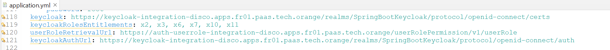{.img-zoomable}

### Step 4: configure users and assign user roles in keycloak

Create a User as folows.

A user as the name suggests is an end user who is identified by his credentials, and has a set of "user roles" mapped to their profile, which provides them "entitlements" to access microservices.

- Only the username property is mandatory, let's call them `odacat-user@orange.com`:
     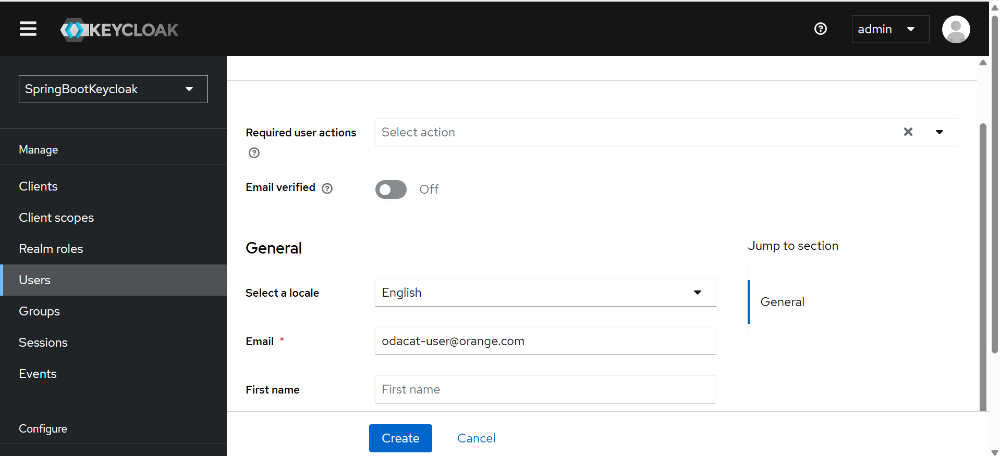
- The user needs to set their credentials,. On the credentials tab of your user and choose a password, I will be using "password" for the rest of this article, make sure to turn off the "Temporary" flag unless you want the user to have to change his password the first time he authenticates.
     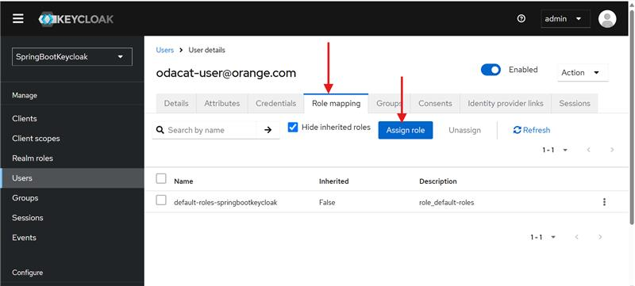
- Now proceed to the "Role Mappings" tab and assign the role "user":
- For ODACAT following roles have been configured as per current configurations
    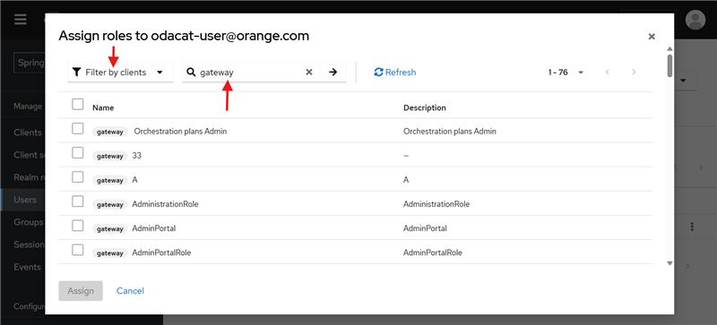{.img-zoomable}
- The following list is configured for DISCOBOLE user roles on the integration environment for ODACAT product catalog.
  - ProductCatalogAdmin
  - ProductOfferingAdmin
  - ProductOfferingPriceAdmin
  - ProductSpecAdmin
  - Policy Rule Admin
  - LifecycleAdmin
  - CateforyAdmin
  - AdminPortalRol

## Component View

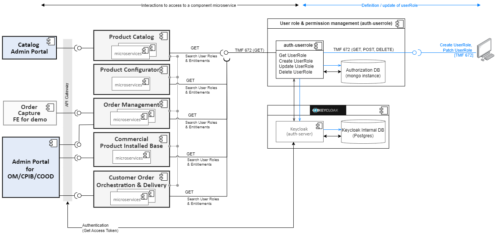{.img-zoomable}

The end-users configure roles and entitlements, and the DISCOBOLE components interact with the component to authenticate any transactions. All the [DISCOBOLE components Overview](https://discobole.ow2.io/doc/components/introduction/) consume the component.
 
Keycloak Internal DB: Indicates the DB used by keycloak. PostgreSQL is used
Authorisation DB: Indicates the data set that holds the data regarding TMF672

???+ summary "User Role & Permission Management API"
      | API name | TMF code | Description | State  |
      |:-------------|:--------------|:--------------|:-------------|
      | User Role & Permission Management  | TMF672    | The user role and permission API provides the model definition as well as all operations for managing user roles and permissions for manageable assets.   | Exposed    |

## Functional View

| Scenario ID | ODA Component Name | Scenario Name             | Scenario Description                                                                                                                                                                                                                                                                                                                                                     | Requirements Addressed                                                                                                  |
|:------------|:-------------------|:--------------------------|:-------------------------------------------------------------------------------------------------------------------------------------------------------------------------------------------------------------------------------------------------------------------------------------------------------------------------------------------------------------------------|:--------------------------------------------------------------------------------------------------------------------------|
| 1           | ODACAT             | User Authentication       | A registered user with a user role shall be able to access the Catalog UI and be able to create/update/modify/get data according to the mapped user role. Ex: Catalog admin can access the entire catalog                                                                                                                       | User interactions to PUT/POST/DELETE/GET catalog data                                                                    |
| 2           | ODACAT             | API-API interactions      | Any external registered microservice (Order capture/orchestration etc.) shall be able to get catalog data                                                                                                                                                                                                                        | API-API interactions to fetch catalog data                                                                               |
| 5           | OM                 | Front end                 | A front-end consumer shall be able to create, update retrieve process flow data. <br> A front-end consumer shall be able to retrieve productOrder data.                                                                                                                                                                          | API-API interactions to POST/PATCH/GET process flow data                                                                 |
| 6           | Selfcare FE & Admin Portal FE | User Authentication       | A registered user with a user role shall be able to access the Selfcare FE & Admin Portal FE in order to launch and manage order capture process flow (create, update and retrieve process flow data). <br> A registered user with a user role shall be able to access the Admin Portal FE to consult productOrder data.         | User interactions to POST/PATCH/GET process flow data <br> User interactions to GET productOrder data                    |
| 7           | CPIB               | API-API interactions      | OM shall be able to create, update and retrieve data. <br> COOD shall be able to update and retrieve data. <br> productConfigurator shall be able to retrieve data. <br> A front-end consumer shall be able to retrieve data.                                                                                                      | API-API interactions to POST/PATCH/GET product data                                                                      |
| 8           | COOD               | Event - interactions      | COOD will be triggered through event sent by OM and SOM                                                                                                                                                                                                                                                                           |                                                                                                                           |
| 9           | COOD               | Front end                 | A front-end consumer shall be able to retrieve OrchestrationPlan data. <br> A front-end consumer shall be able to navigate to logs/traces related to an OrchestrationPlan.                                                                                                                                                       |                                                                                                                           |
| 10          | OM                 | Event - interactions      | OM will be triggered through event sent by COOD                                                                                                                                                                                                                                                                                   |                                                                                                                           |
| 11          | COOD               | Cron Job                  | COOD will be triggered by a cron job executed periodically                                                                                                                                                                                                                                                                        |                                                                                                                           |
| 12          | Product Configurator - POQ API | API-API interactions      | Any component may query the POQ API on a dynamic basis to request for eligibility of a product offering for a given (channel/market segment or a customer). <br> The product configurator shall be querying the product catalog to fetch the product model and policy rules (request + response). <br> The product configurator shall be querying the CPIB to fetch the installed base of the customer (request + response). <br> The POQ API shall respond on a synchronous basis to the querying component on the qualification of the product offering. | API-API interactions to POST data for POQ API requests <br> API-API interactions to fetch data from ODACAT and CPIB       |
| 13          | Product Configurator - Product Configuration API | API-API interactions      | OM shall interact with the product configurator to: <br> - Create a product configuration session (POST) <br> - Modify a product configuration session (PUT/DELETE) <br> - Retrieve an existing product configuration session (GET) <br> Product configurator shall interact with ODACAT to GET product catalog and policy rule data <br> Product configurator shall interact with CPIB to GET customer installed base from CPIB | API-API interactions originating from OM to product configurator to manage configuration sessions (GET/PUT/POST/DELETE) <br> API-API interactions to GET product catalog and CPIB data |

## Data View

**User :** An user is the individual who can make use and manage the functions exposed by a given manageable asset. It can be the existing registered customer or any other individual who has been granted access to use and/or manage the asset.

**User Role:** A user role is defined as the entity that defines a set of privileges covering various functions and/or manageable assets. When a user is assigned a given role then it is actually allocated all the privileges defined for that roletype and the corresponding permissions are created for that user.

**Permission:** A basic permission provides information regarding the access privileges of a given user over manageable assets (or different functions within each asset).

**Entitlement:** UserRole allows defining a set an entitlement(s). The list of entitlements is defined for ODACA (see next table). A userRole “Catalog Product Spec Administrator” is able to create & modify Product spec and consult all ODACA entities

- Only the User Role resource is used for DISCOBOLE.
- Since creation of users is already supported by Ketcloak OTB, it is not managed via API.

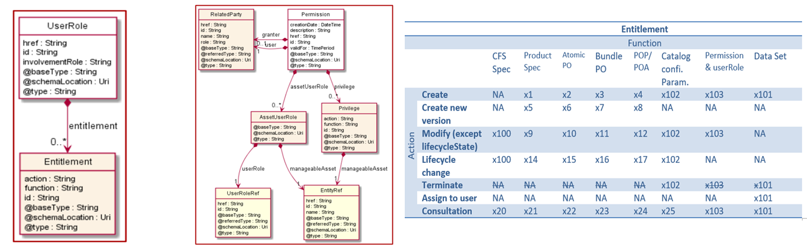{.img-zoomable}

## Service View

### Single microservice calls

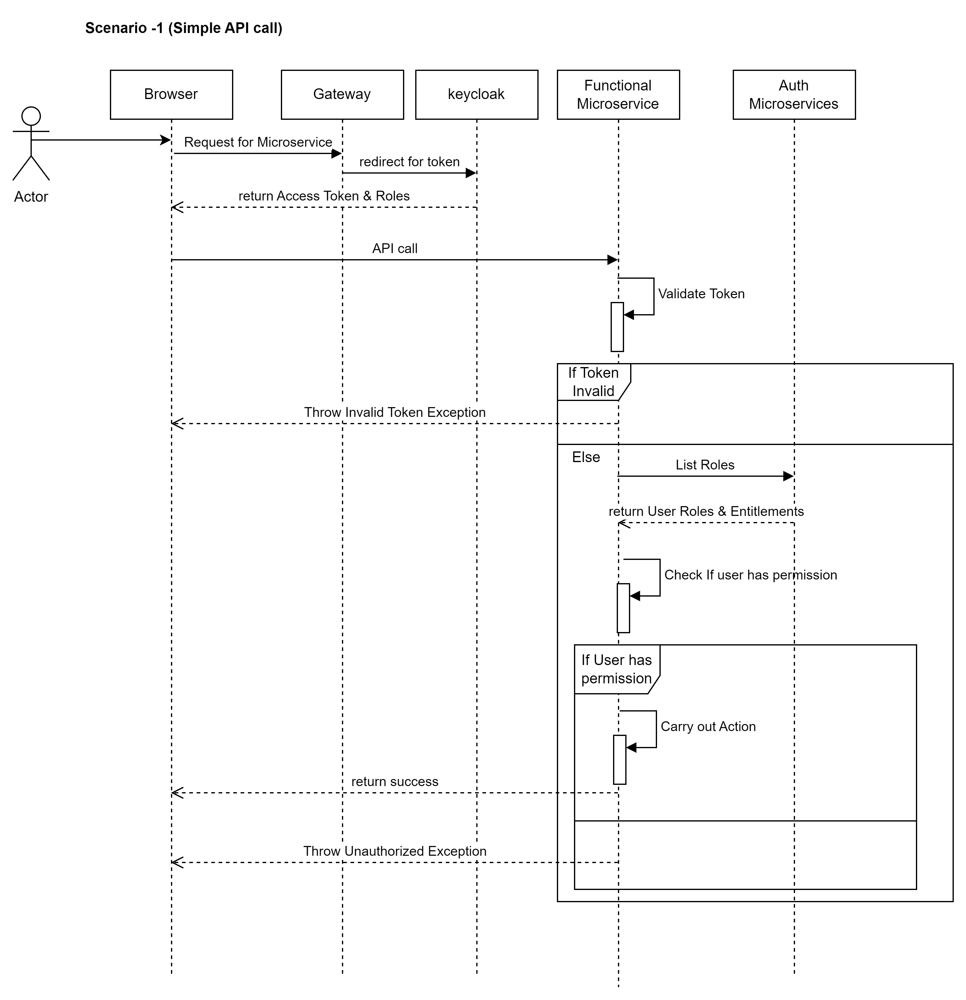{.img-zoomable}

### Microservice To Microservice call

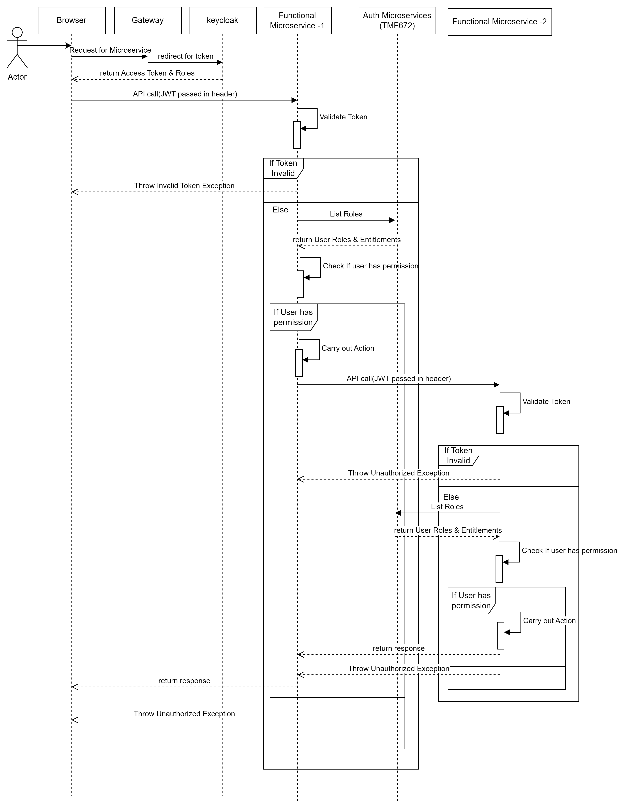{.img-zoomable}

### Communication Across components within the same environment

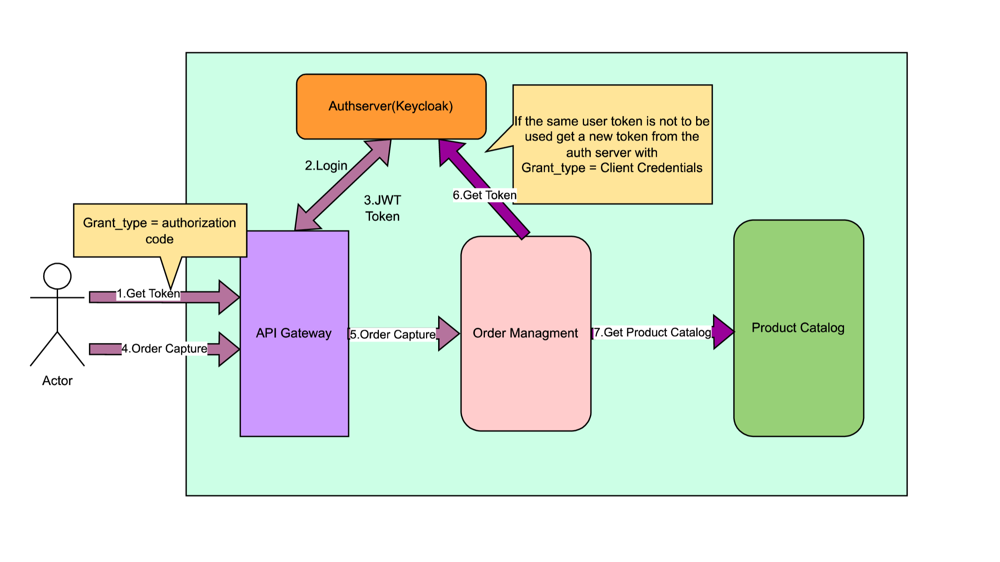{.img-zoomable}

- This is the use case for single infrastructure
- The end user is trying to invoke Order Management ODA component which requires interaction with Product Catalogue to fetch catalogue data
- After step 5, if the same user session is intended to be used the same user token can be passed on to Product catalogue, else a new session can be created for the client(not the user)

In OAUTH 2.0 flow:

- Grant Type  = Authorization code: the token is based on the user’s credentials
- Grant Type = Client Credentials: the token is generated based on the client-id & client-secret

Nota: Client = ODA component

### Communication Across components across environements

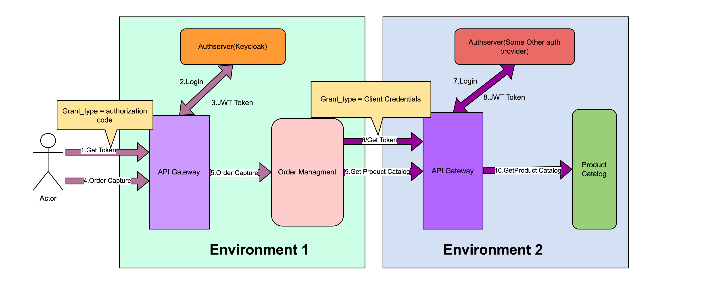{.img-zoomable}

- This is the use case for multiple infrastructure
- The end user is trying to invoke Order Management ODA component which requires interaction with Product
  Catalogue to fetch catalogue data(Product catalogue lies in another deployment environment)
- After step 5, a new session can be created for the client(not the user).

In OAUTH 2.0 flow:

- Grant Type  = Authorization code: the token is based on the user’s credentials
- Grant Type = Client Credentials: the token is generated based on the client-id & client-secret

Nota: Client = ODA component

## Design Pattern and Frameworks

 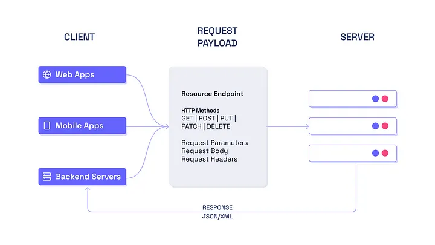{.img-zoomable}

 Transforming raw data into useful information requires numerous actions, such as reading, creating, updating, or deleting data bits. Those operations are referred to as CRUD operations. CRUD structures are unquestionably the most frequent in traditional data manipulation applications. We use the same data model for read and write operations in this situation.

## Source Code Organization

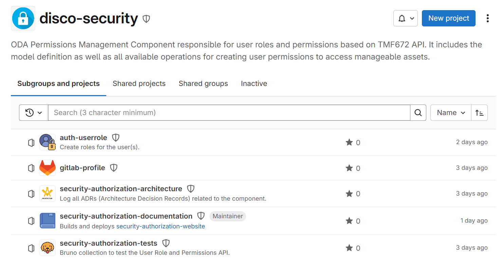{.img-zoomable}
