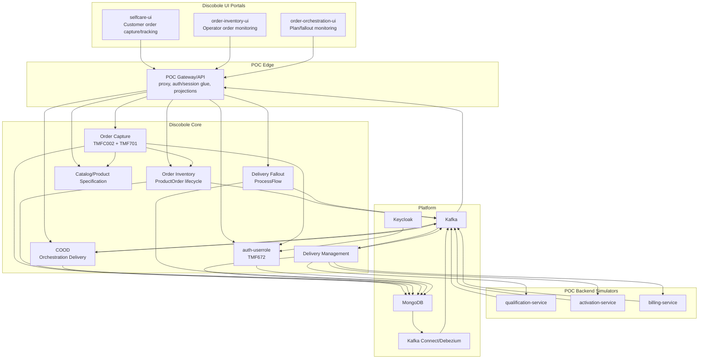
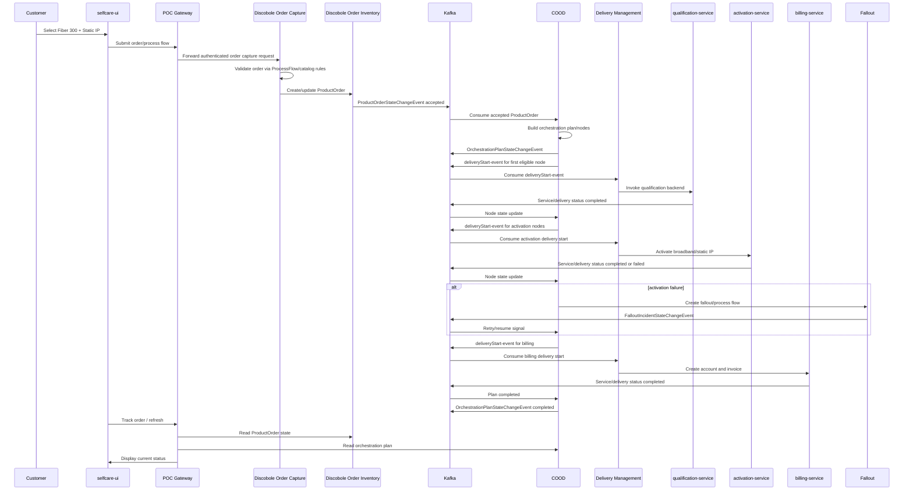
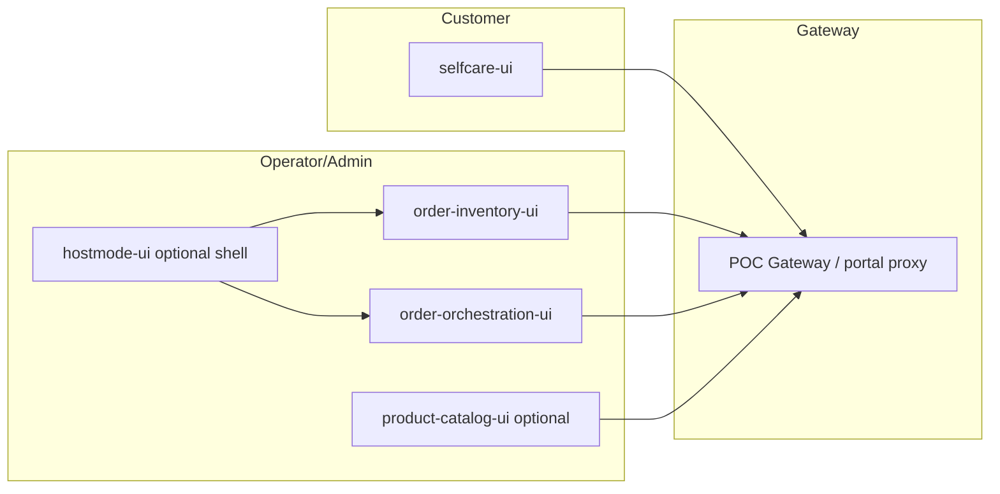
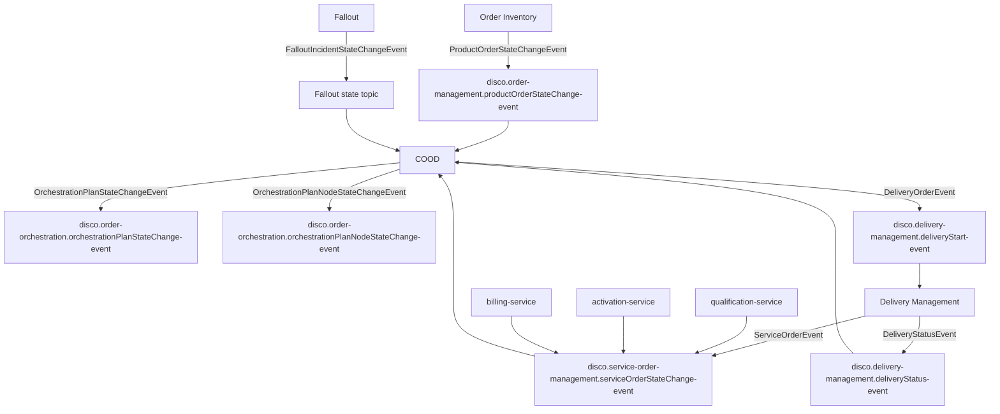

# Discobole-First Architecture for Order-to-Bill POC

## 1. Architecture Principles

- Discobole is the source of truth for order capture, order state, orchestration, delivery state, fallout, and authorization.
- Custom services simulate telecom and billing backends; they do not replace Discobole OMS/COOD.
- Kafka events drive backend state transitions.
- UI reuses Discobole portals wherever possible.
- The POC gateway provides local routing/session glue and optional projections, not core order logic.

## 2. High-Level Component View

## 3. Runtime Flow

## 4. UI Architecture

`selfcare-ui` is the customer-facing portal. `order-inventory-ui` and `order-orchestration-ui` provide operational proof that Discobole services own order and orchestration state.

## 5. Event Architecture

## 6. Data Ownership

| Data | Owner |
| --- | --- |
| Customer order/ProductOrder | Discobole Order Inventory |
| Order capture process/tasks | Discobole Order Capture + ProcessFlow |
| Orchestration plans/nodes | COOD |
| Delivery orders/status | Delivery Management |
| Fallout incidents | Orchestration Delivery Fallout |
| Users/roles/permissions | Keycloak + auth-userrole |
| Broadband qualification record | qualification-service |
| Activation records | activation-service |
| Billing account/invoice records | billing-service |
| UI session/proxy state | POC gateway/selfcare server |

## 7. Deployment Topology

Local Docker Compose must include:

- Keycloak
- auth-userrole
- MongoDB replica set
- Kafka
- Kafka Connect/Debezium if required by Discobole outbox event publication
- Order Capture
- Order Inventory
- Catalog/Product Specification services or POC-backed catalog seed service
- COOD
- Delivery Management
- Fallout/ProcessFlow
- POC simulator services
- POC gateway
- `selfcare-ui`
- `order-inventory-ui`
- `order-orchestration-ui`

## 8. Integration Boundaries

- UI portals talk only to the gateway/proxy in local POC deployment.
- Discobole services communicate over their native REST and Kafka contracts.
- POC simulator services integrate through Delivery Management or Discobole-compatible service-order events.
- Any direct custom event topics are internal implementation details and must not be required for the primary flow.
