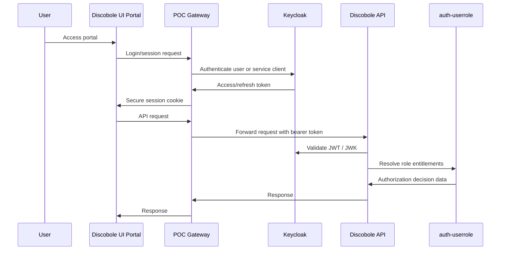
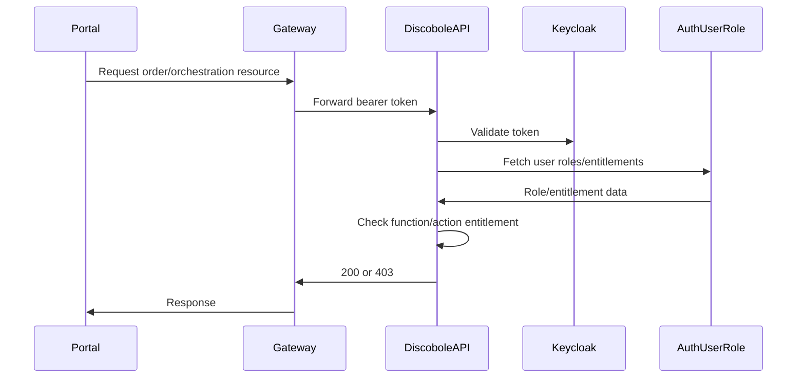

# Authentication and Authorization for Discobole-First POC

## 1. Objective

The POC must use Discobole's security model instead of a standalone custom auth layer.

Authentication is handled by **Keycloak**. Authorization and entitlement modelling are handled by Discobole **auth-userrole** using the TMF672 User Role and Permission API.

The reused UI portals, Discobole services, POC gateway, and simulator services must all participate in the same security model.

## 2. Components

| Component | Responsibility |
| --- | --- |
| Keycloak | Users, OAuth2/OIDC clients, JWT tokens, refresh tokens |
| auth-userrole | Roles, permissions, entitlements, component configuration |
| POC Gateway | UI session handling, token forwarding, reverse proxy protection |
| selfcare-ui | Customer login/session and order capture/tracking |
| order-inventory-ui | Operator order monitoring |
| order-orchestration-ui | Operator orchestration/fallout monitoring |
| Discobole APIs | Resource servers validating JWT and entitlements |
| Simulator services | Service-to-service authenticated endpoints where required |

## 3. Authentication Architecture



## 4. Keycloak Realm

Use one local POC realm, recommended name:

```text
discobole
```

If Discobole components require their default realm name during initial integration, keep a compatibility alias/profile documented in Compose.

## 5. Clients

Create clients for:

| Client | Type | Purpose |
| --- | --- | --- |
| `selfcare-ui` | public/confidential depending on portal mode | Customer UI |
| `admin-ui` | public/confidential | Operator/admin shell |
| `order-capture` | confidential | Discobole Order Capture |
| `order-inventory` | confidential | Discobole Order Inventory |
| `orchestration-delivery` | confidential | COOD |
| `orchestration-delivery-management` | confidential | Delivery Management |
| `orchestration-delivery-fallout` | confidential | Fallout |
| `auth-userrole` | confidential | TMF672 role/permission service |
| `product-catalog` | confidential | Catalog services |
| `poc-gateway` | confidential | Gateway/proxy service |
| `qualification-service` | confidential | Simulator backend |
| `activation-service` | confidential | Simulator backend |
| `billing-service` | confidential | Simulator backend |

## 6. Users

Seed at least:

| User | Purpose |
| --- | --- |
| `customer@otb.com` | Places and tracks broadband order |
| `operator@otb.com` | Monitors orders and orchestration |
| `admin@otb.com` | Configures catalog, roles, and services |

## 7. Roles and Entitlements

Use auth-userrole to seed roles that map to Discobole component entitlements.

Minimum roles:

| Role | Entitlements |
| --- | --- |
| `OTB_CUSTOMER` | Create customer order/process flow, consult own order |
| `OTB_ORDER_OPERATOR` | Consult orders, consult orchestration plans, consult fallout |
| `OTB_ORDER_MANAGER` | Consult/update order operations where Discobole permits |
| `OTB_FALLOUT_OPERATOR` | Consult and resolve fallout/process flow tasks |
| `OTB_CATALOG_ADMIN` | Create/modify/catalog broadband offers and specs |
| `OTB_ADMIN` | Full POC administration |

Entitlement IDs must match Discobole service expectations where those services already define entitlement constants. Do not invent conflicting IDs; seed POC roles by using existing component configuration where available.

## 8. UI Security Model

### selfcare-ui

Use the existing `selfcare-ui/server` pattern where possible:

- server-side proxy
- secure cookies
- refresh-token handling
- CSRF protection
- service-token fallback only for explicitly public/demo-safe operations

Customer actions must use user identity when creating or tracking an order.

### order-inventory-ui and order-orchestration-ui

Use their existing Discobole common UI authentication/client pattern.

Both should route through the POC gateway or a common local API gateway, so browser clients do not call multiple backend origins directly.

## 9. Service-to-Service Security

Discobole and simulator services should use client credentials for service-to-service calls where required.

Kafka itself can remain plaintext for local POC unless the implementation explicitly enables SASL/TLS. The event payloads must still carry correlation IDs and source identifiers for traceability.

## 10. Authorization Flow



## 11. Required Seed Data

Keycloak import:

- realm
- clients
- client secrets
- users
- basic realm/client roles if needed by Discobole services

auth-userrole import:

- component configurations
- user roles
- permissions
- entitlements
- role assignments or mappings needed by Discobole APIs

## 12. Acceptance Criteria

- Customer can log in to `selfcare-ui`.
- Customer can place a broadband + static IP order.
- Customer can only view permitted order data.
- Operator can view orders in `order-inventory-ui`.
- Operator can view orchestration plans and fallout in `order-orchestration-ui`.
- Admin can seed/manage catalog and authorization configuration.
- Discobole services reject unauthenticated API calls where security is enabled.
- Gateway forwards tokens and does not bypass authorization for protected actions.
