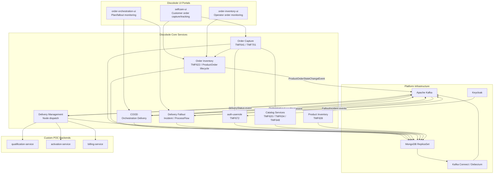
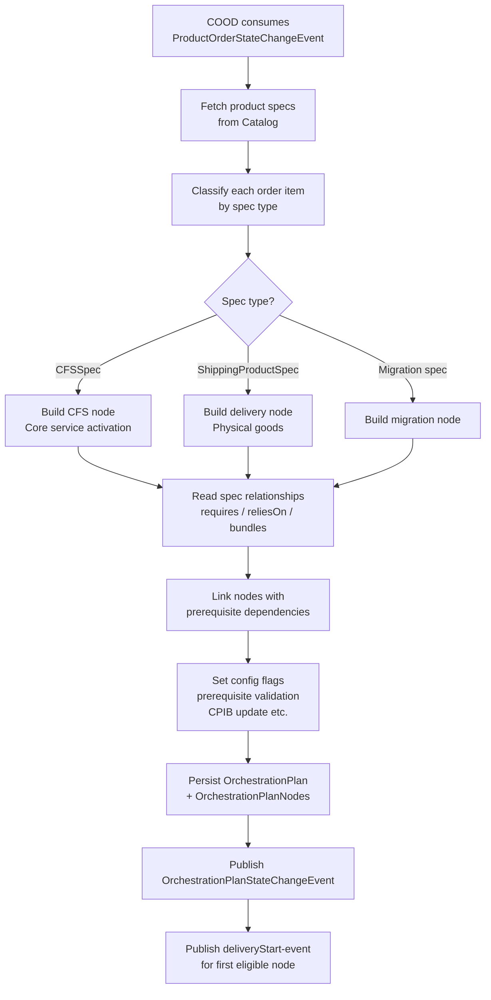
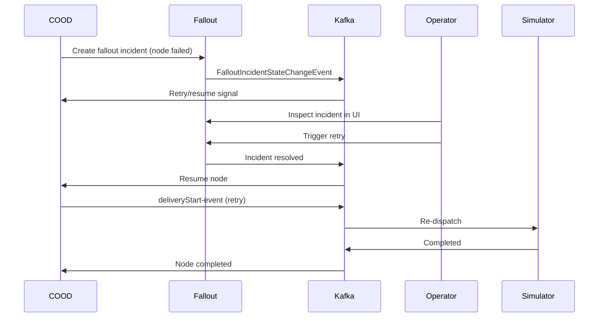
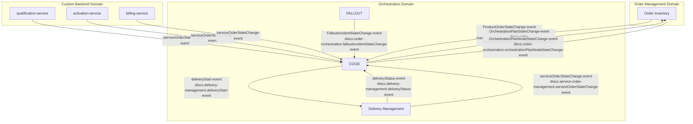
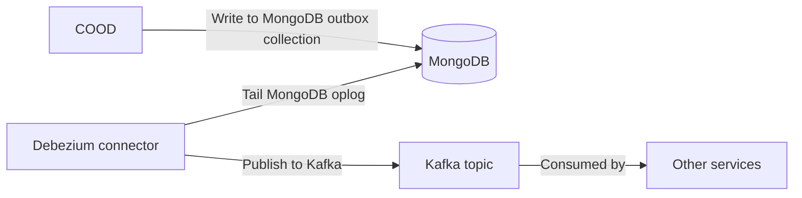
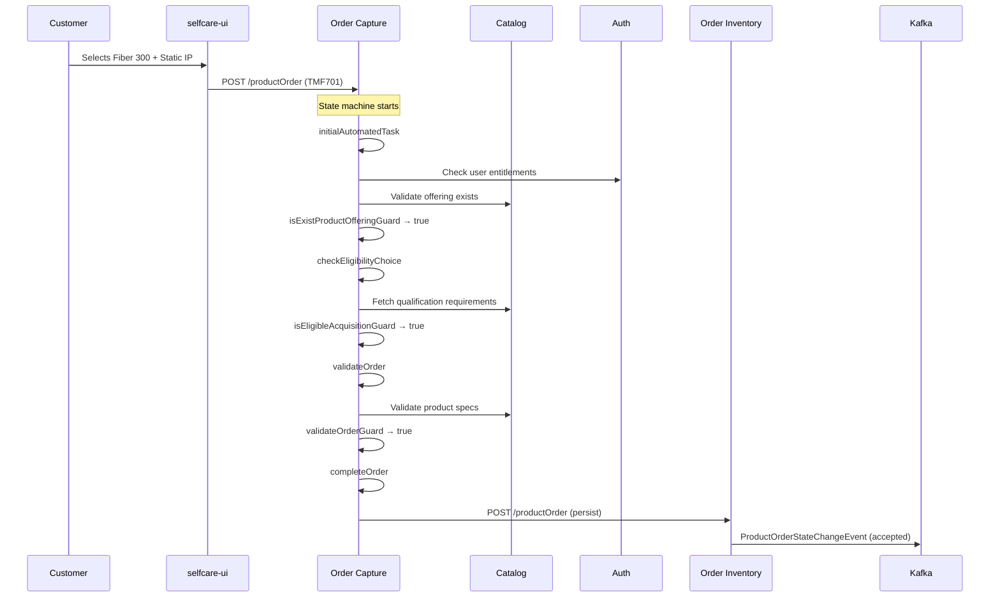
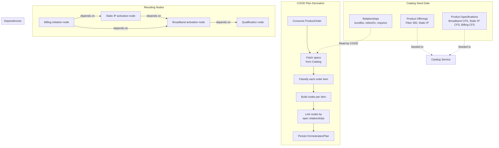
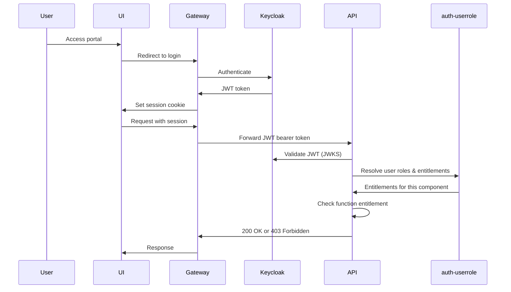

# Discobole Deep Dive: Architecture & Customization

## 1. What Is Discobole?

**Discobole** is an open-source suite of telecom operations components built by **Orange** and hosted at [OW2](https://discobole.ow2.io). It implements **TM Forum (TMF) Open APIs** — the industry-standard REST and event specifications for telecom operations.

Discobole is **not a monolithic application**. It is a set of **independent microservices** that communicate via **Kafka events** and **REST APIs**, each owning a specific domain concern:

- Order Capture (TMF641, TMF701)
- Order Inventory (TMF622)
- Product Catalog (TMF620, TMF634)
- Product Inventory (TMF639)
- Customer Order Orchestration & Delivery — COOD
- Delivery Management
- Delivery Fallout (incident/retry management)
- Auth & User Role management (TMF672)

The philosophy: **data-driven configuration, not hardcoded logic**. The same engine handles broadband, mobile, fiber, or any product type — what changes is the catalog data and configuration you feed it.

---

## 2. High-Level Architecture



---

## 3. Core Components (Deep Dive)

### 3.1 Order Capture

**Purpose**: The front door for customer orders. Validates input, runs process flows, creates ProductOrders.

**Key contracts**: TMF641 (Service Ordering), TMF701 (Process Flow)

**How it works**:

1. Receives an order request (from selfcare-ui or API)
2. Runs a **state machine** (Spring State Machine) defined in `application.yml`:
   - ~50 states, ~70 transitions
   - Two regions: `MainRegion` (order lifecycle) and `CancelRegion` (cancellation)
3. Each transition is guarded by a **Java `@Component` bean** that decides "can we proceed?"
4. Guards query the catalog, validate eligibility, check technical feasibility
5. On acceptance, persists the `ProductOrder` to **Order Inventory** via REST
6. Order Inventory emits a `ProductOrderStateChangeEvent` on Kafka

**State machine excerpt** (from `application.yml`):

```yaml
package-element:
  state-machines:
    - name: OrderCapture
      region: MainRegion
      states:
        - initialAutomatedTask
        - selectOfferOrContract
        - checkEligibilityChoice
        - validateOrder
        - completeOrder
      transitions:
        - source: initialAutomatedTask
          target: selectOfferOrContract
          guard: isAnonymousCustomerGuard
        - source: selectOfferOrContract
          target: checkEligibilityChoice
          guard: isExistProductOfferingGuard
```

### 3.2 Order Inventory

**Purpose**: The source of truth for `ProductOrder` lifecycle. Persists orders, tracks state, emits state change events.

**Key contracts**: TMF622 (Product Order Management)

**How it works**:

- REST endpoints for CRUD on ProductOrders
- Each state change (created → accepted → inProgress → completed → rejected) emits a Kafka event
- Events consumed by COOD to trigger orchestration
- Events consumed by UIs to show order status

### 3.3 COOD — Customer Order Orchestration & Delivery

**Purpose**: The orchestration brain. Consumes accepted ProductOrders, builds dependency graphs of "nodes," and drives execution.

**How orchestration plans are built** (from `OrchestrationPlanInitServiceImpl.java`):



**Node lifecycle**:

```text
pending → inProgress → completed
                       → failed → fallout incident → retry → inProgress → completed
                       → held (by threshold)
```

**Configuration** (environment-variable-driven):

| Variable | Effect |
|---|---|
| `enablePrerequisiteValidation` | Wait for prerequisite nodes before starting dependent |
| `enableUpdateCpibProduct` | Update customer product inventory on completion |
| `adaptiveOrchestrationPlanScheduling` | Dynamic vs static scheduling |
| `heldNodeProcessFlowCountThreshold` | Max failures before fallout triggers |

### 3.4 Delivery Management

**Purpose**: The dispatcher. Listens for `deliveryStart-event` on Kafka and calls the appropriate backend service.

**How it works**:

- Consumes `disco.delivery-management.deliveryStart-event`
- Takes the delivery factory reference from the orchestration node
- Calls the configured `serviceOrderingUrl` endpoint
- Publishes `deliveryStatus-event` when the backend responds
- Routes work to qualification, activation, billing services based on configuration

### 3.5 Fallout / ProcessFlow

**Purpose**: Handles failures. When a node fails, COOD creates a Fallout incident. Operators can inspect, resume, or retry.

**How it works**:



### 3.6 Catalog Services

**Purpose**: Define what products exist, their characteristics, and how they relate.

**Sub-components**:

| Service | TMF API | Purpose |
|---|---|---|
| `catalog-product-specification` | TMF648 | Product specs (technical definitions) |
| `catalog-product-offering` | TMF620 | Product offerings (what customers see) |
| `catalog-product-catalog` | TMF634 | Grouping of offerings |
| `catalog-product-offering-price` | TMF671 | Pricing |
| `catalog-product-category` | TMF620 | Categories |
| `catalog-product-lifecycle-management` | — | Lifecycle states |

### 3.7 Product Inventory

**Purpose**: Tracks which products are assigned to which customers. Updated by COOD when orchestration completes.

**Key contracts**: TMF639 (Product Inventory Management)

### 3.8 Auth / Security

**Purpose**: Authentication via Keycloak (OAuth2/OIDC), authorization via auth-userrole (TMF672).

**Key concepts**:

- **Components**: registered services (order-capture, COOD, etc.)
- **Functions**: actions a component can perform (e.g., `orderCreate`, `planRead`)
- **Entitlements**: permission to perform a function (e.g., `ENT_ORDER_CREATE`)
- **Roles**: named collections of entitlements (e.g., `OTB_CUSTOMER`)
- **Users**: assigned roles, which grant entitlements

---

## 4. Event Architecture

All communication between Discobole services is **asynchronous via Kafka**. This ensures loose coupling — services only need to agree on event schemas, not know about each other.



### Debezium / Outbox Pattern

Discobole uses the **MongoDB outbox pattern** for reliable event publication:



This ensures **at-least-once delivery**: if Kafka is down, the event sits in the outbox collection until Debezium picks it up.

---

## 5. Customization Patterns

Discobole is designed to be customized without modifying its Java code. The customization formula has **four layers**:

### Layer 1: Catalog Data (Product Model)

**What you configure**: Product specifications, offerings, categories, relationships.

**How**: REST API calls (via Bruno/Postman) to `productCatalogManagement/v1/*` endpoints.

**What it controls**:
- What products exist (broadband, mobile, fiber, etc.)
- How products relate (bundles, requires, reliesOn)
- Product characteristics (bandwidth, data cap, etc.)
- Which service specifications to use for activation

**Example relationship tree** for the broadband POC:

```text
Fiber Broadband 300 Mbps (BundleProductOffering)
├── bundles → Static IP Add-on (AtomicProductOffering)
│                └── reliesOn → Fiber Broadband 300 Mbps
└── reliesOn → Billing Initiation (ProductSpecificationRef)
```

### Layer 2: ProcessFlow State Machine (Order Behavior)

**What you configure**: States, transitions, and guard references.

**How**: Edit `application.yml` in the `order-capture` module.

**What it controls**:
- The order lifecycle path
- What validation steps run
- When external services (qualification, catalog) are called
- What error paths exist

**Design pattern**: The state machine is **product-agnostic**. It doesn't say "if broadband, do X." Instead, guards query the catalog at runtime to determine behavior.

### Layer 3: Guard Beans (Validation Logic)

**What you configure**: Java `@Component` beans referenced by name in the state machine YAML.

**Examples** (`orchestration-delivery/src/main/java/.../guard/`):

| Guard bean | Purpose |
|---|---|
| `isEligibleAcquisitionGuard` | Can this customer acquire this offering? |
| `isExistProductOfferingGuard` | Does the offering exist in catalog? |
| `validateOrderGuard` | Is the order structurally valid? |
| `catalogDrivenTasksGuard` | Are catalog-driven tasks complete? |

**Customization**: Write a new Spring `@Component` implementing `org.squirrelframework.foundation.fsm.StateMachine` guard interface, reference it by name in the YAML.

### Layer 4: Environment Configuration (Runtime Behavior)

**What you configure**: Environment variables set in Docker Compose.

**What it controls**:
- Service URLs (catalog, inventory, activation, etc.)
- Feature flags (prerequisite validation, CPIB update, etc.)
- MongoDB connection strings
- Kafka broker addresses
- Keycloak issuer URIs
- Security settings

---

## 6. How Custom Orders Work



**Key point**: The state machine never knows it's handling "broadband." It handles "a product offering with certain characteristics." The catalog data drives the differentiation.

---

## 7. How Custom COOD Works



### How Node Sequencing Works

1. COOD reads the `ProductSpecificationRelationship` from the catalog for each ordered product
2. If spec A has `relationshipType: "requires"` pointing to spec B, node A gets a prerequisite on node B
3. The config flag `enablePrerequisiteValidation: true` ensures COOD won't start node A until node B completes
4. When a node's prerequisites are all met, COOD publishes a `deliveryStart-event`

### How Nodes Are Dispatched

Each orchestration node has a `relatedDeliveryFactoryRef` that points to a service to invoke:

```yaml
# Orchestration-delivery-management config
config:
  serviceOrderingUrl: "${SERVICE_ORDERING_URL}/serviceOrdering/v1/serviceOrder"
```

When Delivery Management receives a `deliveryStart-event`:

1. Reads the delivery factory reference from the node
2. Constructs a `ServiceOrder` payload
3. POSTs it to the configured `serviceOrderingUrl`
4. The backend service (qualification, activation, billing) processes it
5. The backend publishes `serviceOrderStateChange-event` or `deliveryStatus-event` on Kafka
6. COOD consumes the event and updates the node state

---

## 8. Security Model



### Role Hierarchy (POC-specific)

```
OTB_ADMIN
├── OTB_CATALOG_ADMIN (manage catalog)
├── OTB_ORDER_MANAGER (manage all orders)
│    ├── OTB_ORDER_OPERATOR (view all orders)
│    └── OTB_FALLOUT_OPERATOR (view/resolve fallout)
└── OTB_CUSTOMER (own orders only)
```

### Entitlements (POC-specific)

| Entitlement | Effect |
|---|---|
| `ENT_ORDER_CREATE` | Create customer orders |
| `ENT_ORDER_READ_OWN` | View own orders |
| `ENT_ORDER_READ_ALL` | View any order |
| `ENT_ORDER_UPDATE` | Modify order state |
| `ENT_ORCHESTRATION_READ` | View orchestration plans |
| `ENT_ORCHESTRATION_RETRY` | Trigger retry on failed nodes |
| `ENT_FALLOUT_READ` | View fallout incidents |
| `ENT_FALLOUT_RESOLVE` | Resolve fallout incidents |
| `ENT_CATALOG_MANAGE` | Create/modify catalog data |
| `ENT_SECURITY_MANAGE` | Manage users, roles, entitlements |

---

## 9. Configuration Architecture

### How Services Discover Each Other

Discobole services do NOT use a service registry (Eureka, Consul). They use **environment-variable-configured URLs**:

```yaml
# Example from order-capture application.yml
config:
  productOfferingUrl: "${PRODUCT_CATALOG_SERVICE}/productCatalogManagement/v1/productOffering"
  productSpecificationUrl: "${PRODUCT_CATALOG_SERVICE}/productCatalogManagement/v1/productSpecification"
  productInventoryUrl: "${PRODUCT_INVENTORY_SERVICE}/productInventoryManagement/v1/product"
  orderInventoryUrl: "${ORDER_INVENTORY_SERVICE}/productOrderingManagement/v1/productOrder"
```

In Docker Compose, these are resolved to service names:

```yaml
# docker-compose.yml
services:
  order-capture:
    environment:
      PRODUCT_CATALOG_SERVICE: "http://product-catalog:8080"
      PRODUCT_INVENTORY_SERVICE: "http://product-inventory:8080"
      ORDER_INVENTORY_SERVICE: "http://order-inventory:8080"
```

### Feature Flags (Environment Variables)

| Variable | Component | Effect |
|---|---|---|
| `enablePrerequisiteValidation` | COOD | Validate dependencies before starting nodes |
| `enableUpdateCpibProduct` | COOD | Update customer product inventory |
| `adaptiveOrchestrationPlanScheduling` | COOD | Dynamic node scheduling |
| `heldNodeProcessFlowCountThreshold` | COOD | Failure threshold before fallout |

### Spring Profiles

| Profile | Purpose |
|---|---|
| `dev` | Development settings, relaxed security |
| `plaintextconsole` | Plaintext Kafka console |
| `no-security` | Disable OAuth2 for local dev |

---

## 10. Summary: The Data-Driven Philosophy

| Concern | How It's Customized | Not Hardcoded |
|---|---|---|
| What products exist | Catalog seed data | Java code |
| Order lifecycle path | State machine YAML | Java code |
| Validation rules | Guard beans (Java, but swappable) | Inline logic |
| Orchestration sequence | Product spec relationships | Orchestration engine |
| Node dispatch targets | Environment URLs | Service code |
| Failure/retry behavior | Feature flags | Orchestration logic |
| Roles and permissions | auth-userrole seed JSON | Application code |
| Kafka topics | Configuration files | Service code |

This means you can take the same Discobole binaries and run them for:
- Broadband (like this POC)
- Mobile phone plans
- Fiber optic business lines
- IoT device provisioning
- Any product mix

The only thing that changes is **what data you put in the catalog, what guards you write, and how you configure the URLs and flags**.
