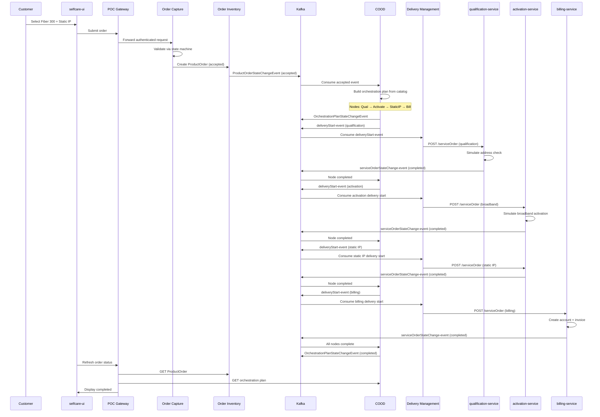
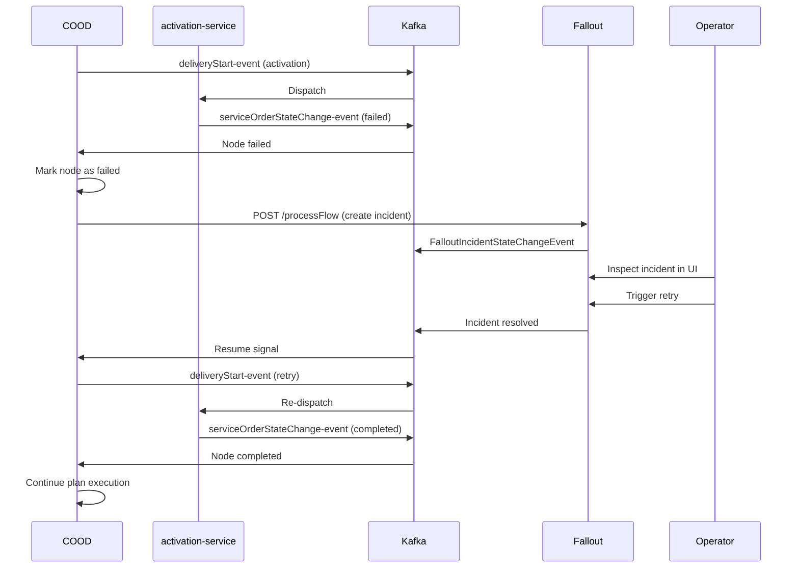
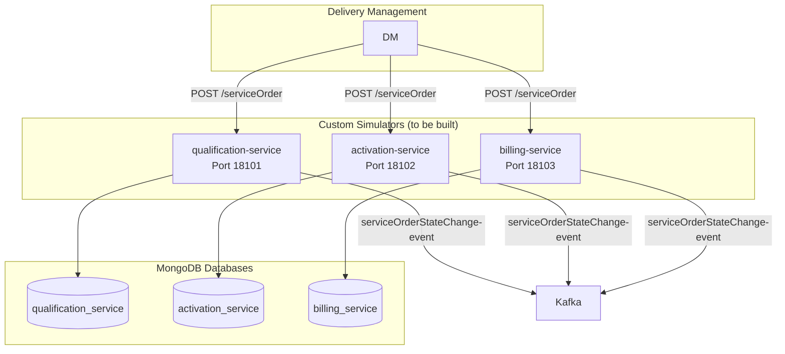
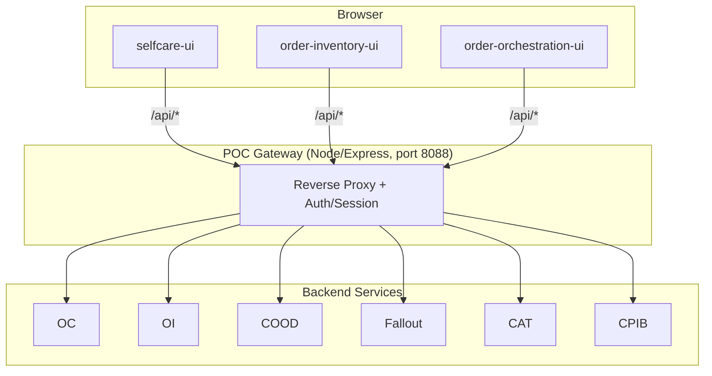

# Order-to-Bill POC Implementation

## 1. POC Overview

This Proof of Concept validates whether the **Discobole Open Source Suite** can serve as the primary platform for a telecom **Order-to-Bill** flow. The target customer journey is:

```text
Fiber Broadband 300 Mbps
+
Static IP Add-on
```

**Guiding principle**: Discobole is the source of truth for order capture, order inventory, orchestration, delivery state, fallout, authorization, and UI visibility. Custom code is written **only** for telecom-specific backends that Discobole doesn't provide (qualification, activation, billing simulators).

### Repository Layout

```text
order-to-bill-poc/
├── custom-services/           # POC-specific backend simulators
│   ├── qualification-service/ # (to be built)
│   ├── activation-service/    # (to be built)
│   └── billing-service/       # (to be built)
├── discobole-services/        # Copied Discobole service source
│   ├── disco-catalog/         # Product catalog, spec, offering services
│   ├── disco-order-management/ # Order capture, order inventory
│   ├── disco-order-orchestration/ # COOD, delivery mgmt, fallout
│   ├── disco-product-inventory/   # Product inventory service
│   ├── disco-security/        # auth-userrole
│   └── process-flow/          # ProcessFlow library
├── discobole-ui/              # Copied Discobole UI portals
├── docs/                      # Phase documentation
├── gateway/                   # POC Gateway (Node/Express)
├── infrastructure/            # Docker Compose, configs, seed data
│   ├── auth-userrole/         # Role/entitlement seed JSON
│   ├── kafka/                 # Topics, connectors, Debezium configs
│   ├── keycloak/              # Realm import
│   └── mongodb/               # Replica set init
├── scripts/                   # Build, verify, seed scripts
└── spec/                      # Architecture specs and docs
```

---

## 2. Infrastructure Stack

### Docker Compose Profiles

The stack is organized into four Docker Compose profiles, started incrementally:

| Profile | Services | Command |
|---|---|---|
| `infra` | MongoDB, Kafka, Kafka Connect/Debezium, Kafka UI, Keycloak | `docker compose --profile infra up -d` |
| `core` | auth-userrole, Order Capture, Order Inventory, Catalog (3 services), Product Inventory, COOD, Delivery Management, Fallout, Activation Service, Billing Service | `docker compose --profile core up -d` |
| `gateway` | POC Gateway | `docker compose --profile gateway up -d` |
| `ui` | selfcare-ui, order-inventory-ui, order-orchestration-ui | `docker compose --profile ui up -d` |

### Platform Services

```yaml
# docker-compose.yml (key excerpts)
services:
  mongodb:
    image: mongo:7
    command: ["mongod", "--replSet", "rs0", "--bind_ip_all"]
    ports: ["27017:27017"]

  kafka:
    image: apache/kafka:4.3.0
    # KRaft mode — no ZooKeeper
    environment:
      KAFKA_PROCESS_ROLES: "broker,controller"
      KAFKA_NODE_ID: "1"
      KAFKA_CONTROLLER_QUORUM_VOTERS: "1@kafka:9093"

  kafka-connect:
    image: quay.io/debezium/connect:3.0
    # MongoDB outbox connectors for COOD and Fallout

  keycloak:
    image: quay.io/keycloak/keycloak:26.2
    command: ["start-dev", "--import-realm"]
    volumes: ["./infrastructure/keycloak/import:/opt/keycloak/data/import:ro"]
```

### Shared Environment

All Discobole services share a common environment anchor (`x-discobole-service-env` in `docker-compose.yml`):

```yaml
x-discobole-service-env: &discobole-service-env
  SPRING_PROFILES_ACTIVE: "dev,plaintextconsole"
  SPRING_DATA_MONGODB_URI: "mongodb://mongodb:27017/otb_poc?replicaSet=rs0"
  SPRING_KAFKA_BOOTSTRAP_SERVERS: "kafka:9092"
  SPRING_SECURITY_OAUTH2_RESOURCESERVER_JWT_ISSUER_URI: "http://keycloak:8080/realms/discobole"
  AUTH_USER_ROLE_SERVICE: "http://auth-userrole:8080"
```

Each service overrides specific values (database name, service URLs) as needed.

---

## 3. Kafka Event Topology

### Topics

All topics are Discobole-aligned (no legacy `otb.*` topics):

| Topic | Partitions | RF | Producer | Consumers |
|---|---|---|---|---|
| `disco.order-management.productOrderChange-command` | 3 | 1 | Order Capture | — (command channel) |
| `disco.order-management.productOrderStateChange-event` | 3 | 1 | Order Inventory | COOD |
| `disco.order-orchestration.orchestrationPlanStateChange-event` | 3 | 1 | COOD | Order Inventory, UIs |
| `disco.order-orchestration.orchestrationPlanNodeStateChange-event` | 3 | 1 | COOD | Order Inventory, UIs |
| `disco.delivery-management.deliveryStart-event` | 3 | 1 | COOD | Delivery Management |
| `disco.delivery-management.deliveryStatus-event` | 3 | 1 | Delivery Management | COOD |
| `disco.service-order-management.serviceOrderStateChange-event` | 3 | 1 | Simulators | COOD, Delivery Management |
| `disco.order-orchestration.falloutIncidentStateChange-event` | 3 | 1 | Fallout | COOD |

### Debezium Outbox Connectors

COOD and Fallout use the **MongoDB outbox pattern** for reliable event publication:

```json
{
  "name": "cood-outbox-connector",
  "config": {
    "connector.class": "io.debezium.connector.mongodb.MongoDbConnector",
    "mongodb.connection.string": "mongodb://mongodb:27017/?replicaSet=rs0",
    "database.include.list": "orchestration_delivery",
    "collection.include.list": "orchestration_delivery.events",
    "transforms": "outbox",
    "transforms.outbox.type": "io.debezium.connector.mongodb.transforms.outbox.MongoEventRouter",
    "transforms.outbox.route.by.field": "type",
    "transforms.outbox.route.topic.replacement": "${routedByValue}"
  }
}
```

This connector:
1. Tails MongoDB's oplog for inserts into the `events` collection of `orchestration_delivery` database
2. Uses Debezium's `MongoEventRouter` transform to route each event to the Kafka topic specified in its `type` field
3. Ensures **at-least-once delivery** — if Kafka is unavailable, the event remains in MongoDB until the connector can publish it

A second connector (`fallout-outbox-connector`) does the same for the `falloutmanagement` database.

---

## 4. Discobole Core Services

### 4.1 Service Inventory

| Compose Service | Image | Port | MongoDB Database | Key Entitlements |
|---|---|---|---|---|
| `auth-userrole` | `saraswathiraj/auth-userrole:latest` | 18085 | `userRoleManagement` | `ENT_SECURITY_MANAGE` |
| `order-capture` | `saraswathiraj/order-capture:latest` | 18080 | `order_capture` | `ENT_ORDER_CREATE`, `ENT_ORDER_UPDATE` |
| `order-inventory` | `saraswathiraj/order-inventory:latest` | 18081 | `order_inventory` | `ENT_ORDER_READ_ALL`, `ENT_ORDER_CREATE` |
| `product-catalog` | `saraswathiraj/catalog-product-catalog:latest` | 18086 | `catalog` | `ENT_CATALOG_MANAGE` |
| `product-specification` | `saraswathiraj/catalog-product-specification:latest` | 18087 | `catalog` | `ENT_CATALOG_MANAGE` |
| `product-offering` | `saraswathiraj/catalog-product-offering:latest` | 18088 | `catalog` | `ENT_CATALOG_MANAGE` |
| `product-inventory` | `saraswathiraj/product-inventory:latest` | 18089 | `product_inventory` | (unauthenticated in POC) |
| `orchestration-delivery` | `saraswathiraj/orchestration-delivery:latest` | 18082 | `orchestration_delivery` | `ENT_ORCHESTRATION_READ`, `ENT_ORCHESTRATION_RETRY` |
| `orchestration-delivery-management` | `saraswathiraj/orchestration-delivery-management:latest` | 18083 | `orchestration_delivery` | (delegates to COOD) |
| `orchestration-delivery-fallout` | `saraswathiraj/orchestration-delivery-fallout:latest` | 18084 | `falloutmanagement` | `ENT_FALLOUT_READ`, `ENT_FALLOUT_RESOLVE` |

### 4.2 Service URLs (Internal Docker Networking)

Key URLs that wire Discobole services together via environment variables:

```yaml
# Order Capture → downstream services
PRODUCT_CATALOG_SERVICE: "http://product-catalog:8080"
PRODUCT_INVENTORY_SERVICE: "http://product-inventory:8080"
ORDER_INVENTORY_SERVICE: "http://order-inventory:8080"

# COOD → catalog, product inventory, order inventory
CONFIG_PRODUCT_SPEC_BY_ID_CATALOG_URL: "http://product-catalog:8080/productCatalogManagement/v1/productSpecification"
CONFIG_PRODUCT_MANAGEMENT_URL: "http://product-inventory:8080/productInventoryManagement/v1/product"
CONFIG_PRODUCT_ORDER_BY_ID_URL: "http://order-inventory:8080/api/productOrderingManagement/v1/productOrder"
CONFIG_FALLOUT_URL: "http://orchestration-delivery-fallout:8080/processManagement/v1/processFlow"

# Delivery Management → service catalog + simulator backends
CONFIG_SERVICE_CATALOG_MANAGEMENT_URL: "http://product-specification:8080/serviceCatalogManagement/v1/serviceSpecification"
CONFIG_SERVICE_ORDERING_URL: "http://activation-service:8080/serviceOrdering/v1/serviceOrder"
```

---

## 5. Seed Data

### 5.1 Keycloak Realm

File: `infrastructure/keycloak/import/discobole-realm.json`

Configured in the realm `discobole`:

| Client | Type |
|---|---|
| `selfcare-ui` | public |
| `admin-ui` | public |
| `poc-gateway` | confidential |
| `order-capture` | confidential |
| `order-inventory` | confidential |
| `orchestration-delivery` | confidential |
| `orchestration-delivery-management` | confidential |
| `orchestration-delivery-fallout` | confidential |
| `auth-userrole` | confidential |
| `product-catalog` | confidential |
| `qualification-service` | confidential |
| `activation-service` | confidential |
| `billing-service` | confidential |

Users:

| User | Password | Role |
|---|---|---|
| `customer@otb.com` | `password` | `OTB_CUSTOMER` |
| `operator@otb.com` | `password` | `OTB_ORDER_OPERATOR` |
| `admin@otb.com` | `password` | `OTB_ADMIN` |

### 5.2 auth-userrole Seed

Components registered in `infrastructure/auth-userrole/component-configurations.json`:

```json
[
  { "id": "selfcare-ui", "componentName": "selfcare-ui" },
  { "id": "order-capture", "componentName": "order-capture" },
  { "id": "order-inventory", "componentName": "order-inventory" },
  { "id": "orchestration-delivery", "componentName": "orchestration-delivery" },
  { "id": "orchestration-delivery-management", "componentName": "orchestration-delivery-management" },
  { "id": "orchestration-delivery-fallout", "componentName": "orchestration-delivery-fallout" },
  { "id": "auth-userrole", "componentName": "auth-userrole" },
  { "id": "product-catalog", "componentName": "product-catalog" },
  { "id": "qualification-service", "componentName": "qualification-service" },
  { "id": "activation-service", "componentName": "activation-service" },
  { "id": "billing-service", "componentName": "billing-service" }
]
```

Roles and entitlements in `infrastructure/auth-userrole/user-roles.json`:

| Role | Entitlements |
|---|---|
| `OTB_CUSTOMER` | `ENT_ORDER_CREATE`, `ENT_ORDER_READ_OWN` |
| `OTB_ORDER_OPERATOR` | `ENT_ORDER_READ_ALL`, `ENT_ORCHESTRATION_READ`, `ENT_FALLOUT_READ` |
| `OTB_ORDER_MANAGER` | `ENT_ORDER_READ_ALL`, `ENT_ORDER_UPDATE` |
| `OTB_FALLOUT_OPERATOR` | `ENT_FALLOUT_READ`, `ENT_FALLOUT_RESOLVE`, `ENT_ORCHESTRATION_RETRY` |
| `OTB_CATALOG_ADMIN` | `ENT_CATALOG_MANAGE` |
| `OTB_ADMIN` | All entitlements |

### 5.3 Catalog Seed (Phase 6)

Seeded via Bruno REST requests against `productCatalogManagement/v1/*` endpoints:

**Three product specifications** (POST to `/productSpecification`):

| ID | Name | Support Entity | Purpose |
|---|---|---|---|
| `...fiber-broadband-spec` | Broadband Service | CFSSpec | Core broadband product |
| `...static-ip-spec` | Static IP Service | CFSSpec | Static IP add-on product |
| `...billing-init-spec` | Billing Initiation | CFSSpec | Billing node for COOD sequencing |

**Two product offerings** (POST to `/productOffering`):

| ID | Name | Type | Links to spec |
|---|---|---|---|
| `...fiber-broadband-offer` | Fiber Broadband 300 Mbps | BundleProductOffering | Broadband Service |
| `...static-ip-offer` | Static IP Add-on | AtomicProductOffering | Static IP Service |

**One relationship patch** (PATCH to `/productOffering/{fiber-id}`):

```json
{
  "productOfferingRelationship": [
    {
      "relationshipType": "bundles",
      "product": { "id": "...static-ip-offer", "@type": "AtomicProductOffering" }
    },
    {
      "relationshipType": "reliesOn",
      "product": { "id": "...billing-init-spec", "@type": "ProductSpecificationRef" }
    }
  ]
}
```

This produces the dependency hierarchy:

```text
Fiber Broadband 300 Mbps (BundleProductOffering)
├── bundles → Static IP Add-on (AtomicProductOffering)
│                └── reliesOn → Fiber Broadband 300 Mbps
└── reliesOn → Billing Initiation (ProductSpecificationRef)
```

COOD reads these relationships to derive the orchestration plan node order.

---

## 6. End-to-End Flow

### 6.1 Happy Path



### 6.2 Failure / Fallout / Retry



---

## 7. Custom Services (Simulators)

### 7.1 Architecture



### 7.2 Configuration

All three simulators share a common pattern:

```yaml
services:
  qualification-service:
    image: saraswathiraj/qualification-service:latest
    build:
      context: ./custom-services/qualification-service
    profiles: ["simulators"]
    environment:
      SPRING_DATA_MONGODB_URI: "mongodb://mongodb:27017/{service_db}?replicaSet=rs0"
      SPRING_KAFKA_BOOTSTRAP_SERVERS: "kafka:9092"
      SIMULATOR_FAILURE_MODE: "${QUALIFICATION_SIMULATOR_FAILURE_MODE:-success}"
```

The `SIMULATOR_FAILURE_MODE` environment variable controls behavior:
- `success` — return completed status
- `failure` — return failed status (to demonstrate fallout/retry)

### 7.3 Service Contracts

Each simulator must implement:

**Endpoint**: `POST /serviceOrdering/v1/serviceOrder`
**Request** (Discobole-compatible ServiceOrder):
```json
{
  "id": "so-{uuid}",
  "serviceOrderItem": [
    {
      "id": "1",
      "action": "add",
      "service": {
        "serviceType": "BroadbandAccess",
        "serviceCharacteristic": [
          { "name": "bandwidth", "value": "300 Mbps" }
        ]
      }
    }
  ]
}
```

**Response**: `202 Accepted` with an tracking ID

**Completion event**: Publish to `disco.service-order-management.serviceOrderStateChange-event`:
```json
{
  "eventType": "ServiceOrderStateChangeEvent",
  "serviceOrder": {
    "id": "so-{uuid}",
    "state": "completed"  // or "failed"
  }
}
```

### 7.4 Current Status

| Service | Code | Docker Image | Status |
|---|---|---|---|
| `qualification-service` | Empty directory (`.gitkeep`) | `saraswathiraj/qualification-service:latest` | To be built |
| `activation-service` | Empty directory (`.gitkeep`) | `saraswathiraj/activation-service:latest` | To be built |
| `billing-service` | Empty directory (`.gitkeep`) | `saraswathiraj/billing-service:latest` | To be built |

---

## 8. Gateway

### 8.1 Architecture



### 8.2 Route Configuration

```yaml
# docker-compose.yml — gateway environment
environment:
  PORT: "8088"
  KEYCLOAK_URL: "http://keycloak:8080"
  KEYCLOAK_REALM: "discobole"
  ROUTE_PRODUCT_CATALOG_MANAGEMENT_URL: "http://product-catalog:8080"
  ROUTE_ORDER_CAPTURE_URL: "http://order-capture:8080"
  ROUTE_PRODUCT_ORDERING_MANAGEMENT_URL: "http://order-inventory:8080"
  ROUTE_PRODUCT_INVENTORY_URL: "http://product-inventory:8080"
  ROUTE_COOD_URL: "http://orchestration-delivery:8080"
  ROUTE_FALLOUT_URL: "http://orchestration-delivery-fallout:8080"
  ROUTE_USER_ROLE_PERMISSION_URL: "http://auth-userrole:8080"
```

The gateway:
- Terminates browser sessions
- Forwards JWT tokens to backend services
- Provides a single origin for all API calls (avoids CORS issues)
- Does NOT contain order-management logic (Discobole remains authoritative)

---

## 9. Phase Status & Completion

### Completed Phases

| Phase | Description | Key Artifacts |
|---|---|---|
| **0** | Scope confirmation | `spec/phase-0-decisions.md`, Discobole-first strategy |
| **1** | Repository structure | Root layout, `.env.example`, `.gitignore`, `Makefile` |
| **2** | Discobole runtime strategy | `discobole-services/`, `discobole-ui/` copied from monorepo |
| **3** | Infrastructure | `docker-compose.yml` (infra profile), MongoDB replica set, Kafka KRaft, Debezium, Keycloak |
| **4** | Security seed data | Keycloak realm import, auth-userrole component configs, roles, entitlements |
| **5** | Discobole core services | All core services running in Compose, verified health endpoints |

### Remaining Phases

| Phase | Description | Status |
|---|---|---|
| **6** | Catalog seed (broadband model) | Seed Bruno files written; verification pending |
| **7** | Reused Discobole UI portals | Source copied; adaptations pending (broadband content, gateway URLs) |
| **8** | POC Gateway | Compose service defined; implementation pending |
| **9** | Simulator services | Compose services defined; implementation pending |
| **10** | Event-driven flow integration | Kafka topics created; end-to-end flow validation pending |
| **11** | Failure, fallout, and retry | Architecture designed; demo implementation pending |
| **12** | Testing and documentation | Framework and scripts pending |

### Makefile Targets

| Command | Purpose |
|---|---|
| `make infra-up` | Start infrastructure (MongoDB, Kafka, Connect, Keycloak) |
| `make infra-bootstrap` | Create Kafka topics + register Debezium connectors |
| `make infra-verify` | Check all infrastructure health endpoints |
| `make core-up` | Start Discobole core services |
| `make core-verify` | Check all core service health + OpenAPI endpoints |
| `make security-verify-keycloak` | Verify token issuance from Keycloak |
| `make package-core-services` | Package Discobole services with Java 17 |
| `make build-core-service-images` | Build Docker images for core services |
| `make build-simulator-service-images` | Build simulator Docker images |
| `make build-ui-images` | Build UI Docker images |

---

## 10. Verification Scripts

### Infrastructure Verification (`scripts/verify-infrastructure.sh`)

Probes:
- MongoDB replica set status (`rs.status()`)
- Kafka broker (`kafka-topics.sh --list`)
- Kafka Connect health (`GET /connectors`)
- Keycloak health (`GET /health`)

### Core Services Verification (`scripts/verify-core-services.sh`)

Probes each service health endpoint and OpenAPI docs:

| Service | Health Endpoint | API Docs |
|---|---|---|
| auth-userrole | `GET /actuator/health` | `GET /v3/api-docs` |
| order-capture | `GET /actuator/health` | `GET /v3/api-docs` |
| order-inventory | `GET /actuator/health` | `GET /v3/api-docs` |
| product-catalog | `GET /actuator/health` | `GET /v3/api-docs` |
| orchestration-delivery | `GET /actuator/health` | `GET /v3/api-docs` |
| orchestration-delivery-management | `GET /actuator/health` | `GET /v3/api-docs` |
| orchestration-delivery-fallout | `GET /actuator/health` | `GET /v3/api-docs` |

### Keycloak Security Verification (`scripts/verify-keycloak-security.sh`)

```
1. POST to Keycloak token endpoint
   → Get access token for customer@otb.com
2. Validate JWT structure (has `iss`, `sub`, `realm_access.roles`)
3. POST to Keycloak token refresh endpoint
   → Get refreshed token
```

---

## 11. Port Mapping

| Service | Internal Port | Host Port | Default |
|---|---|---|---|
| MongoDB | 27017 | 27017 | 27017 |
| Kafka | 9092 (internal) / 19092 (host) | 9092 | 9092 |
| Kafka Connect | 8083 | 8083 | 8083 |
| Kafka UI | 8080 | 8085 | 8085 |
| Keycloak | 8080 | 8080 | 8080 |
| auth-userrole | 8080 | 18085 | 18085 |
| Order Capture | 8080 | 18080 | 18080 |
| Order Inventory | 8080 | 18081 | 18081 |
| Product Catalog | 8080 | 18086 | 18086 |
| Product Specification | 8080 | 18087 | 18087 |
| Product Offering | 8080 | 18088 | 18088 |
| Product Inventory | 8080 | 18089 | 18089 |
| COOD | 8080 | 18082 | 18082 |
| Delivery Management | 8080 | 18083 | 18083 |
| Fallout | 8080 | 18084 | 18084 |
| POC Gateway | 8088 | 8088 | 8088 |
| selfcare-ui | 8080 | 3000 | 3000 |
| order-inventory-ui | 8080 | 3004 | 3004 |
| order-orchestration-ui | 8080 | 3006 | 3006 |
| qualification-service | 8080 | 18101 | 18101 |
| activation-service | 8080 | 18102 | 18102 |
| billing-service | 8080 | 18103 | 18103 |

---

## 12. Architecture Compliance

The POC follows the Discobole-first principles by ensuring:

| Principle | Implementation |
|---|---|
| **Discobole owns domain state** | Order Inventory stores ProductOrders; COOD stores orchestration plans; Fallout stores incidents |
| **Kafka events drive transitions** | All state changes published on Discobole-aligned topics; no direct HTTP chaining |
| **Catalog drives product model** | Product specs, offerings, and relationships seeded in Catalog; COOD reads them at runtime |
| **Auth is integrated** | Every REST call goes through Keycloak JWT validation + auth-userrole entitlement check |
| **UIs are Discobole portals** | selfcare-ui, order-inventory-ui, order-orchestration-ui reused with minimal adaptations |
| **Custom code is only backend logic** | Simulators publish Discobole-compatible events; they contain zero orchestration logic |
| **Gateway is thin** | POC Gateway is a reverse-proxy with session management; no order logic lives in it |
